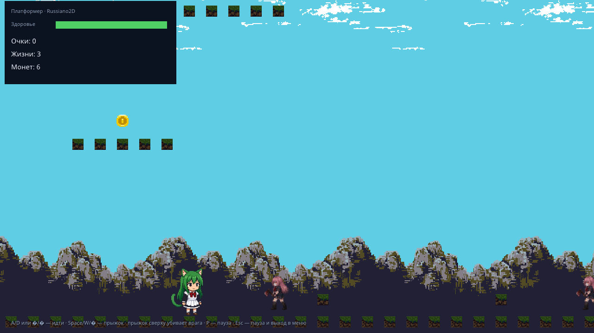
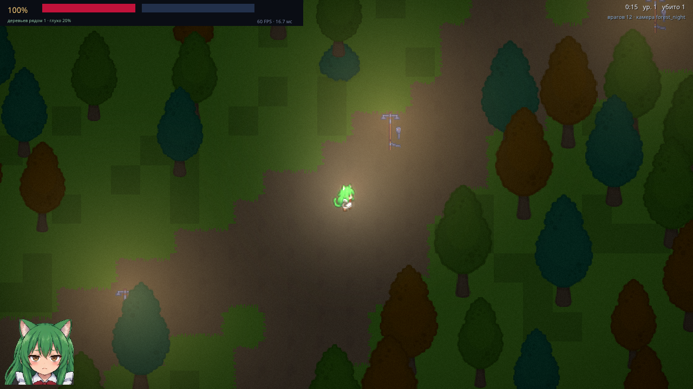
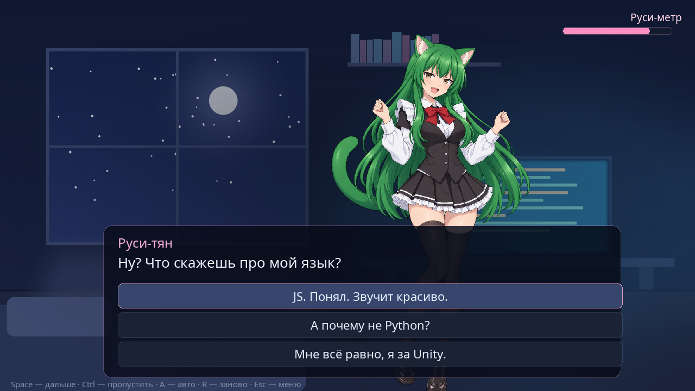

# Russiano2D (Руссиано 2D)

<p align="center">
  
</p>

<p align="center">
  <a href="https://hub.mos.ru/dem4ev48/russiano2d"><b>Исходники на hub.mos.ru</b></a> ·
  <a href="https://gitverse.ru/Nikide/russiano2d"><b>Зеркало на GitVerse</b></a> ·
  <a href="docs/tutorial-first-game.md">Моя первая игра</a> ·
  <a href="docs/HIGH_LEVEL_API.md">Справочник API</a> ·
  <a href="CHANGELOG.md">Что нового</a>
</p>

**Russiano2D** — настоящий российский 2D-игровой движок, готовый к дистрибуции
и к тому, чтобы на нём делали игры. Ядро написано на C, игровая логика — на
JavaScript; всё общение с движком идёт через одну точку входа — `$`.
Основной репозиторий — **[hub.mos.ru](https://hub.mos.ru/dem4ev48/russiano2d)**,
зеркало кода — **[gitverse.ru/Nikide/russiano2d](https://gitverse.ru/Nikide/russiano2d)**.
Готовые сборки под macOS, Linux и Windows лежат в самом репозитории, в
[`dist/`](https://hub.mos.ru/dem4ev48/russiano2d/-/tree/main/dist) — качайте оттуда.
Играть можно и без установки: демо-меню работает **прямо в браузере** —
[r2d.nikiniki.ru/play](https://r2d.nikiniki.ru/play/) (веб-сборка движка под
WebGPU, см. [docs/WEB_EXPORT.md](docs/WEB_EXPORT.md)).

* **Игры — твои, делай с ними что хочешь.** Продавай, выкладывай, дари,
  портируй: отчислений автору движка не нужно, указывать его не обязательно.
  Russiano2D — русский движок, и делает его русский автор: если этот факт вам
  не нравится — пожалуйста, не пользуйтесь им. Целиком условия — в
  [LICENSE](LICENSE).
* **Ядро — SDL3 и QuickJS-ng.** Графика через SDL_GPU (Vulkan / Metal / DirectX 12),
  физика на Box2D v3, звук на SDL3_mixer, интерфейс на RmlUi, отладка на Dear ImGui.
  Та же игра собирается и **в браузере**: Emscripten + WebGPU, интерфейс RmlUi,
  одна команда — `python3 web/export.py` (см. [docs/WEB_EXPORT.md](docs/WEB_EXPORT.md)).
* **Высокоуровневое API `$` в стиле jQuery.** Игра компилируется в один исполняемый
  файл, а пишется почти как веб-страница:

  ```js
  $('<player>', { id: 'hero' }).at(100, 300).controls('wasd').appendTo($.world);
  ```

  Непривычно — да. Зато осваивается за вечер и читается как обычный текст, а не как
  набор вызовов с десятком параметров.
* **Релизные сборки шифруются** (ChaCha20-Poly1305): скрипты и ассеты лежат внутри
  бинарника в зашифрованном контейнере, а не в открытом виде рядом с игрой.
* **Редактора нет — и не нужен.** Уровень и логика описываются кодом и данными,
  а не кликами по сцене: такой проект удобно читать, diff'ить, ревьюить
  и генерировать.
* **Интеграция с ИИ-агентами — из коробки.** Движок умеет работать как инструмент
  для программы, а не только для человека:
  * **агентский режим** (`--agent`): команды приходят JSON-строками в `stdin`,
    ответы уходят в `stdout`; окно можно скрыть (`--headless`) — рендер и
    скриншоты при этом работают;
  * **детерминированный прогон** (`--fixed-dt`, `--seed`): кадры двигаются
    командой `step`, поэтому один и тот же запуск даёт один и тот же результат
    независимо от загрузки машины;
  * **полный доступ к состоянию**: `eval` выполняет JS, `state` отдаёт снимок
    мира, камеры, интерфейса и узлов, `screenshot` — кадр в PNG;
  * **виртуальный ввод**: клавиши, мышь, колесо и даже набранный текст (`text`),
    без человека за клавиатурой;
  * **игра сама о себе рассказывает**: `$.agent.expose('score', …)`,
    `$.agent.snapshot()`, встроенные самотесты через `$.test`;
  * **готовые инструменты**: Python-клиент `tools/agent_client.py`, раннер
    `tools/run_tests.py` и 79 агентских тестов. Этим движком так и пользовались:
    агенты писали код, а движок их же и проверял — протокол описан в
    [docs/AGENT_API.md](docs/AGENT_API.md).

Если хочется сразу попробовать — начните с гайда
**[«Моя первая игра»](docs/tutorial-first-game.md)**: платформер с маскотом
за 15 минут, включая меню, смену сцен и сборку в один файл.

## Стек

| Слой | Технология |
|---|---|
| Окно, ввод, платформа | **SDL3** 3.4 |
| Графика | **SDL_GPU** (Vulkan / Metal / DirectX 12) |
| Веб | **Emscripten + WebGPU** (SDL_GPU с бэкендом WebGPU, [docs/WEB_EXPORT.md](docs/WEB_EXPORT.md)) |
| Скрипты | **QuickJS-ng** 0.10 (ES2023+, ES-модули) |
| Физика | **Box2D v3.1** (чистый C) |
| Звук и музыка | **SDL3_mixer** 3.2 (WAV / OGG / MP3) |
| Игровой GUI | **RmlUi** 6.3 (HTML/CSS-подобная разметка) |
| Упорядочивание геометрии | **2D BSP-дерево** (своё, `src/bsp.c`) |
| Свет и видимость | **trylock/visibility** (полигоны видимости, MIT; C-обёртка в `src/light.cpp`) |
| Иконки | **Material Design Icons** — 2235 штук, встроены в бинарник |
| Отладочный оверлей | **Dear ImGui** (docking) |
| HTTP из игры | **libcurl** (или встроенный сокетный бэкенд для `http://`) |
| Язык ядра | C11 (+ C++20 только для адаптеров ImGui и RmlUi) |
| Тесты | агентский режим движка + **qjs** для логики подсистем |

---

## Как собрать бинарник движка

> **Хотите просто поиграть — забирайте готовое.** Под Linux и Windows сборки
> собирает CI на GitVerse по тегу и кладёт в
> [релизы](https://gitverse.ru/Nikide/russiano2d/releases); сборка под macOS
> лежит в `dist/` репозитория. Ниже — как собрать самому из исходников.

Нужны **CMake 3.24+**, компилятор с C11 и C++20 (AppleClang, GCC, Clang, MSVC) и
Git: зависимости тянутся через CMake `FetchContent` при первой конфигурации.

```bash
# Debug — для разработки
cmake -S . -B build -DCMAKE_BUILD_TYPE=Debug
cmake --build build -j
./build/russiano2d                      # игра из каталога game/
./build/russiano2d --game demos         # меню со всеми демо

# Release — для релиза
cmake -S . -B build-release -DCMAKE_BUILD_TYPE=Release
cmake --build build-release -j
./build-release/russiano2d
```

Первый прогон занимает несколько минут: собираются SDL3, SDL3_image, QuickJS-ng,
Box2D, RmlUi, Dear ImGui, glslang и SPIRV-Cross. Дальше сборка инкрементальная
(конфигурация ~3 минуты, сама сборка — около минуты).

Если SDL3 уже установлен в системе (например, `brew install sdl3`), движок
подхватит его и не будет собирать заново. Так же подхватывается системный
libcurl — с ним `$.http` умеет и `https`.

### Автосборка всех платформ в `dist/`

Одной командой — что можно собрать на этой машине:

```bash
python3 tools/autobuild.py --with-windows
```

* **macOS** собирается нативно;
* **Linux** — в контейнере `ubuntu:24.04` (образ-сборщик:
  `tools/docker/Dockerfile.linux-builder`), репозиторий монтируется внутрь,
  поэтому артефакты остаются на диске рядом с проектом;
* **Windows** — кросс-компиляция MinGW в том же контейнере;
* каждая платформа упаковывается штатным релизным кодом в `dist/<платформа>/`
  вместе с архивом, и рядом пишется общий `dist/SHA256SUMS.txt`.

Полезные флаги: `--debug`, `--jobs N`, `--platforms macos-arm64,linux-x86_64`,
`--with-windows`, `--out DIR`. Нужен запущенный Docker Desktop — без него
соберётся только платформа текущей машины.

### Опции CMake

| Опция | По умолчанию | Что делает |
|---|---|---|
| `R2D_ENABLE_AUDIO` | `ON` | звук и музыка (SDL3_mixer); `OFF` — заглушки без зависимости |
| `R2D_ENABLE_RMLUI` | `ON` | HTML/CSS-подобный игровой интерфейс |
| `R2D_ENABLE_IMGUI` | `ON` | отладочный оверлей (F1) |
| `R2D_ENABLE_HOTRELOAD` | `ON` | перезапуск скриптов при изменении `.js` (F5) |
| `R2D_EMBED_SCRIPTS` | `ON` в Release | упаковка скриптов игры в байткод QuickJS |
| `R2D_ENABLE_HTTP` | `ON` | `$.http`; без libcurl остаётся сокетный бэкенд для `http://` |
| `R2D_ENABLE_LIVE_SHADERS` | `ON` | компиляция своих шейдеров в рантайме (`$.gfx.defineShader`); `OFF` — только встроенные эффекты и бинарник на пару мегабайт легче |

### Сборка под Windows и Linux

**Готовые сборки лежат в [`dist/`](dist/) этого же репозитория** — отдельной
выгрузки релизов нет, качать оттуда:

* [dist/ на hub.mos.ru](https://hub.mos.ru/dem4ev48/russiano2d/-/tree/main/dist)
* [dist/ на GitVerse](https://gitverse.ru/Nikide/russiano2d/content/main/dist)

Внутри — пакеты под macOS (arm64), Linux (aarch64) и Windows (x86_64):
архивы `russiano2d-<платформа>.tar.gz` / `.zip`, распакованные каталоги и
`SHA256SUMS.txt` для проверки. Собирает и кладёт их туда локальный
`build_and_push.sh`; он же поднимает версию и ставит тег `vX.Y.Z`.

CI на GitVerse написан ([.gitverse/workflows/release.yaml](.gitverse/workflows/release.yaml)),
но **выключен** — автоматического запуска у него нет.

Собрать руками:

```bash
python3 tools/autobuild.py --with-windows        # macOS + Linux + Windows (Docker)
python3 tools/autobuild.py --no-docker \
    --platforms linux-x86_64,windows-x86_64      # без Docker, кросс-компиляция MinGW
```

Под Windows нужен MSVC (или MSYS2/MinGW) и CMake — команды те же, что выше,
из «x64 Native Tools Command Prompt». Под Linux — то же самое, `cmake` +
компилятор.

Выпуск версии целиком: `build_and_push.sh` поднимает патч-версию
(`0.1.0 → 0.1.1`), собирает все платформы, коммитит, пушит ветку и тег на оба
хостинга. Версию можно поднять и отдельно:

```bash
python3 tools/release.py --bump                 # 0.1.0 → 0.1.1
```

**`dist/` лежит в репозитории осознанно** — это и есть раздача готовых сборок
(поэтому `build_and_push.sh` добавляет его через `git add -f`). Каталог
исключён из `.gitignore` намеренно.

### Опции командной строки

| Опция | Действие |
|---|---|
| `--game <каталог>` | какую игру запускать (по умолчанию `game`); точка входа — `<каталог>/main.js` |
| `--scene <имя>` | сразу открыть указанную сцену, минуя меню |
| `--stats` | печатать раз в секунду статистику кадра (FPS, спрайты, draw calls, тела, звук) |
| `--seconds N` | автоматически выйти через N секунд — удобно для дымовых тестов |
| `--frames N` | выйти ровно после N кадров |
| `--screenshot <файл>` | сохранить кадр в PNG прямо из swapchain |
| `--screenshot-at N` | на какой секунде снимать кадр (по умолчанию 2.0) |
| `--overlay` | показать отладочный оверлей сразу; иначе он включается по F1 |
| `--no-hot-reload` | не следить за изменениями `.js` |
| `--agent` | **режим агента**: команды читаются со stdin, ответы идут в stdout |
| `--headless` | скрытое окно: рендер и скриншоты работают, на экране ничего нет |
| `--fixed-dt <сек>` | детерминированный шаг времени — прогон не зависит от загрузки машины |
| `--seed N` | зерно случайных чисел для `$.random` |
| `--help` | справка |

Пример дымового прогона, который не требует глаз и рук:

```bash
./build/russiano2d --stats --seconds 4
./build/russiano2d --agent --headless --fixed-dt 0.0166666667 \
                   --game demos --scene russi_vn --seed 7
```

```
[russiano2d] статистика: 61.6 FPS | 16.70 мс | спрайтов 68 | draw calls 1 | вершин 272 | ...
```

### Где движок ищет игру

Каталог с `game/` и `assets/` определяется так: переменная окружения
`R2D_GAME_DIR` → текущий каталог (если в нём есть `game/main.js`) → каталог
исполняемого файла. Поэтому запускать можно и из корня проекта, и из `build/`.

---

## Высокоуровневое API: `$`

Игровой код пишется одним объектом `$` — он доступен глобально, без импортов.
Никаких `new`, `extends` и `this`: только декларативные цепочки, как в jQuery.

```js
$.ready(() => {
    $.world.gravity(0, 1200).color('#101820').bounds(0, 0, 4000, 1200);

    $('<player>', { id: 'hero' })
        .at(100, 300).size(32, 48).health(100).speed(250)
        .controls('wasd')
        .on('hit', e => $.camera.shake(4, 200))
        .on('death', () => $.scene.load('gameOver'))
        .appendTo($.world);

    for (let i = 0; i < 5; i++) {
        $('<enemy>', { class: 'goblin' })
            .at(500 + i * 80, 300).health(30).speed(80)
            .on('death', e => { $.sound.playAt('die.ogg', e.self); e.self.fadeOut(200).remove(); })
            .appendTo($.world);
    }

    $.camera.follow('#hero').zoom(1.5);
});

$.update(dt => {
    $('.goblin').each(e => {
        if (e.distanceTo('#hero') < 250) e.moveTowards('#hero', 120);
    });
});
```

Что уже умеет `$`:

* **создание** — `$('<player>', { … })`, теги: `player`, `enemy`, `npc`, `sprite`,
  `rect`, `circle`, `text`, `light`, `wall`, `trigger`, `bullet`, `pickup`,
  `tilemap`, `particles`, `layer`, `ui.panel`, `ui.label`, `ui.button`, `ui.bar`,
  `ui.image`, `ui.row`, `ui.col`, `ui.grid`, `ui.scroll`, `ui.checkbox`,
  `ui.slider`, `ui.input`, `ui.list`, `ui.dialog`;
* **поиск** — CSS-подобные селекторы: `#id`, `.class`, `тип`, `:alive`, `:dead`,
  `:visible`, `:onScreen`, `[hp<20]`, `'#hero .weapon'`, `'#a, .b'`, свои через
  `$.selectors.register(':boss', …)`;
* **цепочки** — позиция, визуал, физика, здоровье, события, твины, звук,
  иерархия, коллекции (`.each`, `.map`, `.filter`, `.first`, `.eq`, …);
* **подсистемы** — `$.world`, `$.camera`, `$.input`, `$.sound`, `$.scene`, `$.ui`,
  `$.time`, `$.gfx`, `$.store`, `$.fs`, `$.debug`, `$.console`, `$.agent`, `$.test`;
* **анимация и геймплей** — `$.anim` (клипы и машина состояний), `$.tilemap`
  (слои, автотайл, террейны, Y-sort), `$.particles`, `$.nav` (A*-навигация),
  `$.prefab` (сериализация и prefab'ы), `$.audio` (шины и эффекты),
  `$.layers` (канвас-слои и параллакс);
* **твины** — старый Promise-API (`.tween()`, `.moveTo()`, `$.sequence`) и
  `Tween` в духе Godot 4: `$.tween(node).property('x', 400, 0.6).trans('quad')`,
  `chain()`, `loops()`, `finished()`;
* **физика** — формы тел (прямоугольник, круг, капсула, полигон),
  односторонние платформы, события `collide`/`separate`/`hit`, суставы
  (`revolute`, `distance`, `weld`);
* **сервис** — `$.triggers` (зоны `enter`/`leave`), `$.i18n` + `$.tr()`
  (локализация), `$.pool` (переиспользование узлов), `$.http` (GET/POST/JSON),
  счётчики `$.debug.counters()`;
* **картинка** — blend-режимы (`alpha`/`add`/`multiply`/`none`) на узле и кадре,
  канвас-слои, параллакс;
* **расширение** — `$.fn.myMethod = function () { … }` добавляет метод всем узлам.

Полный справочник — **[docs/HIGH_LEVEL_API.md](docs/HIGH_LEVEL_API.md)**,
разбор подсистем — в **[docs/GAP_ANALYSIS.md](docs/GAP_ANALYSIS.md)** и
**[docs/highlevel/](docs/highlevel/)**.
Сколько стоит кадр `$` и что в нём узкое место —
**[docs/HIGH_LEVEL_API_PERF.md](docs/HIGH_LEVEL_API_PERF.md)** (замеры,
причины, план правок).
Первая игра по шагам — **[docs/tutorial-first-game.md](docs/tutorial-first-game.md)**.

Низкоуровневый `engine.*` (текстуры, тела, батчинг, RmlUi, BSP, свет) никуда не
делся: `$` построен поверх него и доступен из игры в любой момент.
Справочник — [docs/API.md](docs/API.md).

---

## Управление движком программой (агенты и CI)

Движок можно запустить в режиме агента: он читает JSON-команды со stdin и
отвечает JSON-строками в stdout. Кадры сами не идут — их продвигает команда
`step`, поэтому прогон воспроизводим побитово.

```bash
./build/russiano2d --agent --headless --fixed-dt 0.0166666667 --game demos --scene platformer
```

```
→ {"cmd":"ping","id":1}
← {"ok":true,"id":1,"pong":true,"frame":1,"time":0.016}
→ {"cmd":"keys","hold":["D"]}
← {"ok":true,"hold":["D"]}
→ {"cmd":"step","frames":60}
← {"ok":true,"frames":60,"frame":61}
→ {"cmd":"eval","code":"$('#hero').pos()"}
← {"ok":true,"result":{"x":296.5,"y":300}}
→ {"cmd":"screenshot","path":"build/level1.png"}
← {"ok":true,"path":"...","width":1280,"height":720}
```

Команды: `ping`, `frames`, `quit`, `reload`, `step`, `state`, `eval`, `key`,
`keys`, `mouse`, `mouseMove`, `wheel`, `screenshot`.

Готовый клиент на Python (только стандартная библиотека):

```python
import sys; sys.path.insert(0, "tools")
from agent_client import Agent

with Agent(game="demos", scene="platformer", seed=7) as a:
    a.step(30)
    a.keys(["D"]); a.step(60); a.keys([])
    print(a.state()["player"]["x"], a.eval("$.world.count()"))
    a.screenshot("build/shot.png")
```

Игра со своей стороны рассказывает агенту о себе через `$.agent.expose()` и
проверяет себя через `$.test.check()`.

Описание протокола — [docs/AGENT_API.md](docs/AGENT_API.md).

---

## Демо-проект

Три демо лежат в `demos/` и запускаются тем же бинарником — по одному на слой
движка. У каждого в папке есть README: что внутри и как собрать такое же.

```bash
./build/russiano2d --game demos                      # меню выбора
./build/russiano2d --game demos --scene russi_vn     # сразу конкретное
python3 tools/make_screenshots.py                    # обновить скриншоты ниже
```

| Демо | Сцена | Что показывает | Как устроено |
|---|---|---|---|
| Платформер | `platformer` | Box2D, листы анимации, монеты, враги, параллакс, HUD и пауза | [demos/platformer/README.md](demos/platformer/README.md) |
| Типичная ночь в Мытищинском лесу | `shooter_witch` | ночной лес: зомби-шутер в духе Vampire Survivors — авто-стрельба, волны, опыт и карты апгрейдов; свет только от фонарей (тени от стволов), глушение звука в чаще, кровь и лужи | [demos/shooter_witch/README.md](demos/shooter_witch/README.md) |
| Руси-тян (ВН) | `russi_vn` | визуальная новелла на `$.timeline`: интерфейс целиком на RmlUi, семь поз героини, озвучка реплик, три выбора, тряска экрана и две концовки | [demos/russi_vn/README.md](demos/russi_vn/README.md) |

| Платформер | Типичная ночь в Мытищинском лесу | Руси-тян |
|---|---|---|
|  |  |  |

Чтобы добавить своё демо, достаточно положить `demos/имя/index.js` со сценой и
дописать одну строку регистрации в `demos/main.js` — кнопка в меню появится сама.
Инструкция «как собрать такое же» — README внутри папки демо: это правило
проекта для всех новых демо.

### Управление в демо

| Клавиша | Действие |
|---|---|
| `A` / `D` или `←` / `→` | идти (платформер, «Типичная ночь в Мытищинском лесу») |
| `Space` / `W` / `↑` | прыжок, стрельба |
| `Space` / `Enter` / клик | дальше по реплике (новелла) |
| `↑` / `↓` | выбрать вариант ответа (новелла) |
| `Ctrl` · `A` · `R` | пропустить · авто-режим · заново (новелла) |
| `Esc` | выход из демо в меню, из меню — выход |
| `F1` | показать/скрыть отладочный оверлей |
| `F5` | перезапустить скрипты вручную |

Правка любого `.js` в каталоге `game/` или `demos/` перезапускает QuickJS на
лету — окно и физический мир при этом не пересоздаются.

---

## Как это устроено

### Хозяин и гость

C-ядро владеет всем: окном, GPU-устройством, физическим миром и жизненным
циклом JavaScript. Скрипт не может уронить движок — при ошибке она попадает
в консоль и в отладочный оверлей, а кадр продолжает рисоваться.

```
        ОС / Видеокарта / Ввод
                  │
                  ▼
        ┌───────────────────┐
        │     ЯДРО (C)      │ ◄──── Box2D v3
        └─────────┬─────────┘
                  │  C-биндинги globalThis.engine
                  ▼
        ┌───────────────────┐
        │    QuickJS-ng     │ ◄──── $ (src/highlevel/*.js, встроен в бинарник)
        └─────────┬─────────┘
                  │  плоский массив команд
                  ▼
        ┌───────────────────┐
        │  SDL_GPU (Render) │ ───► Vulkan / Metal / DX12
        └───────────────────┘
```

### Батчинг: один вызов на весь кадр

Вызов через границу C ↔ JS стоит дорого, поэтому отрисовка не делается
по спрайту. Игровой код наполняет плоский `Float32Array` и отдаёт его
одним вызовом:

```js
const xf  = new Float32Array(maxSprites * 6);  // sprite, x, y, w, h, angle
const col = new Uint32Array(maxSprites);       // упакованный RGBA

// ... заполнение ...

engine.submitSprites(xf, col, count);          // один вызов в C
```

Движок раскладывает это в вершинный и индексный буферы и делает столько
draw call'ов, сколько раз в кадре меняется текстура. Оверлей показывает
отношение `draw calls / спрайты` — на демо-уровне это ~0.002.

### Физика целиком в C

JS не считает коллизии и не трогает векторы Box2D. Он создаёт тело и получает
числовой id:

```js
const body = engine.createBody({ x: 120, y: 400, halfW: 14, halfH: 20,
                                 type: engine.DYNAMIC, fixedRotation: true });
```

Раз в кадр `engine.getTransforms()` возвращает `Float32Array`, который смотрит
**прямо в память C** — копирования нет:

```js
const t = engine.getTransforms();
const x = t[body * 3], y = t[body * 3 + 1], angle = t[body * 3 + 2];
```

### Масштаб единиц

Игровой код и рендер работают в **пикселях**, логические координаты окна не
зависят от DPI (на Retina 1280×720 остаётся 1280×720). Внутри Box2D работает
в метрах: 32 пикселя = 1 метр. Перевод полностью спрятан в `src/physics.c`,
так что об этом можно не думать. Ось `y` направлена **вниз**, как на экране.

### Шейдеры без внешних инструментов в рантайме

SDL_GPU требует разный формат байткода под каждый бэкенд. На этапе сборки
GLSL компилируется в SPIR-V, оттуда — в Metal Shading Language, и оба варианта
встраиваются в бинарник. На старте движок спрашивает у устройства, что оно
поддерживает, и берёт подходящий.

DXIL (для DirectX 12) пока не генерируется — для него нужен компилятор DXC.
На macOS и Linux всё работает как есть; подробности в `cmake/Shaders.cmake`.

Свои шейдеры игра может компилировать и во время работы:
`$.gfx.defineShader('scanline', '...GLSL...')` — те же glslang и SPIRV-Cross,
что собирают встроенные шейдеры, линкуются в движок и вызываются из игры.
Шапку с привязками движок подставляет сам (`$.gfx.shaderPreamble()`), дальше
имя шейдера работает как встроенный эффект: `.shader('scanline', { p1: 0.5 })`.
Нужна минимальная сборка — `-DR2D_ENABLE_LIVE_SHADERS=OFF`.

---

## Структура репозитория

```
CMakeLists.txt              точка входа сборки
cmake/
  Dependencies.cmake        все зависимости с пином коммитов
  Shaders.cmake             GLSL → SPIR-V → MSL и встраивание в бинарник
  EmbedShader.cmake         генератор r2d_shaders.h
  EmbedJs.cmake             встраивание высокоуровневого API ($) в бинарник
src/
  main.c                    главный цикл и режим агента
  app.c/.h                  окно, GPU-устройство, ввод, тайминги, виртуальный ввод
  render.c/.h               текстуры, спрайты, пакетная отрисовка
  bsp.c/.h                  2D BSP-дерево: порядок отрезков без z-буфера
  light.cpp/.h              полигоны видимости (C-обёртка над trylock/visibility)
  physics.c/.h              обёртка над Box2D v3 + лучи и запросы
  audio.c/.h                SDL3_mixer, шины, эффекты (audio_reverb.c, audio_stub.c)
  script.c/.h               QuickJS-ng: объект engine, модули, hot reload
  agent.c/.h                протокол агента: JSON-строки на stdin/stdout
  json.c/.h                 минимальный JSON для протокола
  http.c/.h                 $.http: libcurl или встроенный сокетный бэкенд
  crypto.c/.h               ChaCha20-Poly1305 для собранной игры
  payload.c/.h, build.c     упаковка игры в один исполняемый файл
  project.c/.h              project.json: имя окна, стартовый размер
  icons.c/.h                таблица 2235 иконок Material Design
  profile.c/.h              профилировка кадра
  text.c/.h                 очередь текста поверх сцены
  gui.cpp/.h                игровой GUI на RmlUi (gui_stub.c — сборка без UI)
  debug_ui.cpp/.h           отладочный оверлей на Dear ImGui
  highlevel/*.js            высокоуровневое API $ (встраивается в бинарник)
game/                       игровой код на JavaScript (ES-модули)
demos/                      три демо, набор UI-контролов и меню-лаунчер
assets/
  icons/russiano2d.png      иконка приложения
  fonts/                    Noto Sans, LatoLatin
tools/
  agent_client.py           клиент протокола агента на Python
  run_tests.py              раннер агентских тестов
  autobuild.py              сборка всех платформ в dist/ (Linux и Windows — в контейнере)
  release.py                выпуск релиза: версия, сборка, тесты, упаковка, тег
  agents_doc.py             сборка AGENTS.md и README.md для dist/ из docs/
  bench_highlevel.py        стенд производительности $ (docs/HIGH_LEVEL_API_PERF.md)
  bench_storage.mjs         микрозамер раскладки данных массовых сущностей (qjs)
  make_*.py                 генераторы ассетов демо (тайлсеты, спрайты, звуки, скриншоты)
  vn_*.py                   озвучка и прогон визуальной новеллы
  docker/                   образ-сборщик для Linux и Windows
  templates/                шаблоны README и AGENTS для dist/
  r2d_embed_js.c            генератор таблицы встроенных JS-модулей
  r2d_embed_icons.c         встраивание шрифта иконок
  r2d_pack.c                упаковщик скриптов в байткод QuickJS
tests/
  agent/                    тесты, которые гоняет агент (79 файлов *_test.py)
  fixtures/                 маленькие игры для тестов
docs/
  HIGH_LEVEL_API.md         полный справочник по $
  API.md                    низкоуровневые вызовы engine.*
  AGENT_API.md              протокол агента
  ARCHITECTURE.md           замысел движка и философия API $
  GAP_ANALYSIS.md           аудит API и пробелы относительно Godot 4.x
  HIGH_LEVEL_API_PERF.md    производительность $: замеры, причины, план правок
  TUTORIAL.md               туториал по демо «Типичная ночь в Мытищинском лесу»
  tutorial-first-game.md    «Моя первая игра»: от hello world до сборки
  tutorial-platformer.md    разбор платформера
  tutorial-menus.md         меню, сцены и переходы
  demos.md                  разбор всех демо
  VFX_PLAN.md               план по VFX: взрывы, ударные волны, render target
  BUILD.md                  сборка игры в один файл
  RELEASING.md              выпуск релиза
  highlevel/                справочники подсистем по отдельности
dist/
  <платформа>/              движок, готовая игра, ассеты и контрольные суммы
    README.md               как начать первый проект на этой платформе
    AGENTS.md               то же для ИИ-агента + ВСЯ документация движка внутри
    russiano2d              движок
    russiano2d-platformer   собранная игра-платформер (там, где её удалось собрать)
  russiano2d-<платформа>.tar.gz  тот же каталог архивом
```

Сборка кладётся в `dist/<платформа>/` целиком: бинарники, ассеты, `README.md`
с инструкцией «первый проект» и `AGENTS.md` — самодостаточный файл для
ИИ-агентов, в который вшита вся документация движка (около 900 КБ), чтобы
модель, скачавшая одну папку, ничего не искала в интернете.

Четыре главные папки: **`src/`** — код движка, **`demos/`** — демо-проекты,
**`docs/`** — документация, **`dist/`** — собранные бинарники. Остальное —
инфраструктура сборки (`cmake/`, `tools/`, `tests/`, `assets/`, `shaders/`).

### Релизная сборка: скрипты внутри бинарника

```bash
cmake -S . -B build-release -DCMAKE_BUILD_TYPE=Release -DR2D_EMBED_SCRIPTS=ON
cmake --build build-release -j
```

В этом режиме игровые `.js` компилируются в байткод QuickJS и встраиваются в
исполняемый файл. Рантайм не читает скрипты с диска вообще — их можно не
поставлять, а исходный код игры скрыт. Высокоуровневое API `$` встроено в
бинарник всегда, поэтому работает и в релизе, и без единого `.js` рядом.

**Что встраивается, а что нет.** Внутрь бинарника попадает только код на
JavaScript. Текстуры (`assets/`), шрифты и разметка интерфейса (`*.rml`,
`*.rcss`) остаются обычными файлами данных — их нужно поставлять рядом с
исполняемым файлом. Hot reload в релизном режиме отключается автоматически.

---

## Сборка игры в один файл

Движок собирает проект в **самостоятельный исполняемый файл**: папка с `main.js`
и ассетами рядом больше не нужна.

```bash
./build/russiano2d build --project . --entry game/main.js --out mygame
./mygame                                     # всё внутри: скрипты и ассеты
```

Скрипты компилируются в байткод QuickJS, ассеты укладываются в контейнер и
приписываются к копии движка. Контейнер шифруется **ChaCha20-Poly1305** —
но это **необязательно**: по умолчанию шифрование включено на Linux и Windows и
**выключено на macOS**, где собранный файл всё равно переподписывают
(`codesign`). Управляется флагами:

```bash
./build/russiano2d build ... --encrypt      # включить принудительно
./build/russiano2d build ... --no-encrypt   # выключить принудительно
```

Подробнее — в [docs/BUILD.md](docs/BUILD.md).
Подмена хотя бы одного байта обнаруживается по тегу: игра не запустится с
повреждённым грузом.

**Честно про защиту:** это обфускация, а не защита. Ключ обязан лежать в
исполняемом файле, и настойчивый исследователь его достанет — ломают не шифр,
а ищут ключ. Что реально сделано: шифруется байткод (исходников в файле нет
даже после расшифровки), ключ уникален для каждой сборки и собирается в памяти
из двух частей, расшифрованное стирается при выходе. Итог — стоимость
копирования растёт с «перетащил папку» до «нужен отладчик и время». Настоящая
защита логики возможна только на сервере.

Второй режим — `--relink`: билдер генерирует C-файл, который вкомпилируется в
движок (`cmake -DR2D_PAYLOAD_FILE=...`). Нужен компилятор, зато получается
обычный бинарник, который можно подписать настоящей подписью.

Имя окна и стартовый размер игра описывает файлом `project.json` рядом с
`main.js` — он уезжает в груз, поэтому пересобирать движок не нужно:

```json
{ "title": "Моя игра", "width": 1600, "height": 900 }
```

Из игры окно меняется целиком: `$.window.title(...)`, `.fullscreen(true)`,
`.cursor('hidden')`, `.resize(1600, 900)`, события `resize`/`focus`/`blur`.

Подробности, раскладка файла и разбор ошибок — в [docs/BUILD.md](docs/BUILD.md).

## Документация

* [docs/tutorial-first-game.md](docs/tutorial-first-game.md) — **«Моя первая игра»**: платформер с маскотом за 15 минут
* [docs/HIGH_LEVEL_API.md](docs/HIGH_LEVEL_API.md) — всё, что умеет `$`
* [docs/AGENT_API.md](docs/AGENT_API.md) — как управлять движком программой
* [docs/API.md](docs/API.md) — низкоуровневые вызовы `engine.*`
* [docs/ARCHITECTURE.md](docs/ARCHITECTURE.md) — замысел движка и философия API `$`
* [docs/GAP_ANALYSIS.md](docs/GAP_ANALYSIS.md) — аудит API и пробелы относительно Godot 4.x (2D)
* [docs/HIGH_LEVEL_API_PERF.md](docs/HIGH_LEVEL_API_PERF.md) — сколько стоит кадр `$`: замеры
  (`tools/bench_highlevel.py`), что влияет на производительность и как это исправить
* [docs/VFX_PLAN.md](docs/VFX_PLAN.md) — план по VFX: взрывы, ударные волны, render target,
  рантайм-шейдеры, чёрная дыра
* [docs/highlevel/fx.md](docs/highlevel/fx.md) — `$.fx`: ленты, молнии, ударные волны,
  поля сил, hit-stop
* [docs/highlevel/](docs/highlevel/) — подсистемы по отдельности: анимация, TileMap,
  частицы, навигация (сетка и navmesh), prefab, аудио-шины, слои, UI-контролы
  (якоря и темы), твины, триггеры, локализация, пул, HTTP, blend-режимы
* [docs/tutorial-platformer.md](docs/tutorial-platformer.md) — разбор платформера глубже
* [docs/tutorial-menus.md](docs/tutorial-menus.md) — меню и сцены
* [docs/demos.md](docs/demos.md) — разбор каждого демо
* [docs/BUILD.md](docs/BUILD.md) — сборка игры в один файл
* [docs/RELEASING.md](docs/RELEASING.md) — как выпускать релиз и как устроен CI/CD
* [CHANGELOG.md](CHANGELOG.md) — что менялось по версиям

## Правила проекта

**Контрибьютить сюда нельзя: PR не принимаются.** Проект личный, пишет его
только автор — не нравится, делайте форк, лицензия это разрешает.

* [CONTRIBUTING.md](CONTRIBUTING.md) — почему так и что делать вместо этого
  (коротко: форкать)
* [CODE_OF_CONDUCT.md](CODE_OF_CONDUCT.md) — позиция автора: баг-репорты
  принимаются, пул-реквесты нет, критика мимо, движок пилится всегда
* [SECURITY.md](SECURITY.md) — куда писать про уязвимости и что уязвимостью
  не считается
* [LICENSE](LICENSE) — используй, меняй, продавай свободно; движок русский,
  и в лицензии об этом сказано прямо

## Где живёт проект

Проект целиком живёт на отечественном хостинге
**[hub.mos.ru](https://hub.mos.ru/dem4ev48/russiano2d)** — там исходники,
сборки и вся история. Код зеркалится на
**[gitverse.ru](https://gitverse.ru/Nikide/russiano2d)**.

**Релизы лежат в [`dist/`](dist/) этого репозитория** — отдельной выгрузки нет:

* [dist/ на hub.mos.ru](https://hub.mos.ru/dem4ev48/russiano2d/-/tree/main/dist)
* [dist/ на GitVerse](https://gitverse.ru/Nikide/russiano2d/content/main/dist)

Собирает их туда `build_and_push.sh`: он поднимает версию, собирает все
платформы, коммитит, пушит ветку и тег `vX.Y.Z` на оба хостинга.

Пуш настроен мульти-пушем: у `origin` две push-цели, поэтому один `git push`
уходит сразу на оба хостинга.

```bash
git remote -v
# origin    git@hub.mos.ru:dem4ev48/russiano2d.git  (fetch)
# origin    git@hub.mos.ru:dem4ev48/russiano2d.git  (push)
# origin    git@gitverse.ru:Nikide/russiano2d.git   (push)
# gitverse  git@gitverse.ru:Nikide/russiano2d.git

git push origin main         # ветка — сразу на оба хоста
git push origin --tags       # теги — тоже на оба
git push gitverse main       # только на GitVerse
git pull origin main         # тянет с hub.mos.ru
```

`--mirror` для публикации не используйте: он удаляет на сервере всё, чего нет
локально. Подробности процесса — в [docs/RELEASING.md](docs/RELEASING.md).

## Автор

Движок делали **разные ИИ-агенты** — идея, требования, вкус и вся отсебятина
принадлежат **Никите**.

* Сайт: **[r2d.nikiniki.ru](https://r2d.nikiniki.ru/)** · почта сайта:
  **admin@nikiniki.ru**
* Почта: **dem4ev48@gmail.com**
* Репозиторий: [hub.mos.ru/dem4ev48/russiano2d](https://hub.mos.ru/dem4ev48/russiano2d)
* Зеркало: [gitverse.ru/Nikide/russiano2d](https://gitverse.ru/Nikide/russiano2d)

## Лицензия

Лицензия авторская: **используй, меняй, распространяй и продавай движок
свободно**, игры на нём распространяй как хочешь. Russiano2D — русский движок,
и делает его русский автор: если этот факт вам не нравится — пожалуйста, не
пользуйтесь им. Если выпустишь на нём игру — скажи спасибо автору, можно не вслух.

Полный текст — в [LICENSE](LICENSE). Сторонние компоненты (SDL3, QuickJS-ng, Box2D,
RmlUi, Dear ImGui, glslang, SPIRV-Cross, шрифты, иконки) остаются под своими
лицензиями — см. [THIRD_PARTY_NOTICES.md](THIRD_PARTY_NOTICES.md).

## Лицензии сторонних компонентов

SDL3 (zlib), SDL3_image (zlib), SDL3_mixer (zlib), QuickJS-ng (MIT), Box2D (MIT),
RmlUi (MIT), Dear ImGui (MIT), trylock/visibility (MIT), glslang / SPIRV-Cross
(Apache-2.0 / MIT), Material Design Icons (Apache-2.0).
Шрифты Noto Sans и LatoLatin распространяются по лицензии SIL OFL —
см. `assets/fonts/LICENSE-NotoSans.txt` и `assets/fonts/LICENSE-Lato.txt`.
Иконка приложения и иллюстрация для README — материалы владельца проекта.
Полный список с версиями — в [THIRD_PARTY_NOTICES.md](THIRD_PARTY_NOTICES.md).

Интерфейс по умолчанию использует **Noto Sans**: LatoLatin — это подмножество
только с латиницей, и кириллица в нём не отрисуется. Если меняете шрифт,
проверяйте покрытие: `python3 tools/check_fonts.py`.
