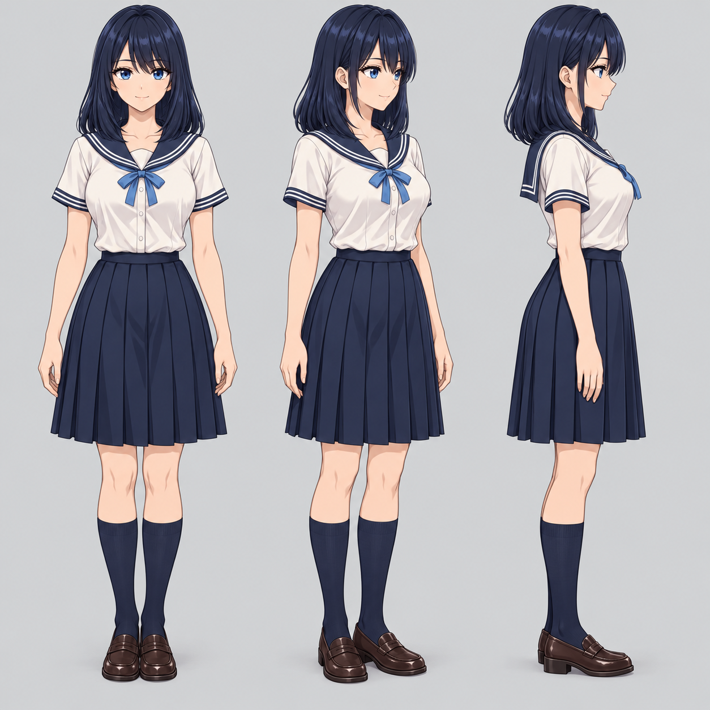

# Дополнительные body components — Real2D v4

Добавление к существующей голове, без изменения текущего head runtime и bake.

## Дизайн

Взрослая аниме-девушка; кожа и стиль контуров соответствуют `assets/head_components_candidate_v1.png`. Одежда: непрозрачная светлая блузка с тёмно-синим sailor collar и голубой лентой, синяя плиссированная юбка до колена, тёмные гольфы и коричневые лоферы. Это стартовый дизайн для body MVP.

## Три исходных sheet

Все изображения — source candidates, не запечённые geometry anchors. Каждый sheet запрашивается как 4×4, порядок row-major:

### torso_clothing_components_candidate_v1.png

1–4: base torso в непрозрачной светлой майке, front/right-3q/right-profile/back; без рук.
5–8: blouse torso front/right-3q/right-profile/back.
9–12: skirt front/right-3q/right-profile/back; без ног.
13–16: front collar+ribbon; back collar; left sleeve cap; right sleeve cap.

### limbs_components_candidate_v1.png

1–4: left/right upper arms front; left/right forearms front.
5–8: left/right upper arms side; left/right forearms side.
9–12: left/right thighs front; left/right shins front с гольфами.
13–16: left/right shoe front; shoe right-profile; shoe back.

### hands_joint_variants_candidate_v1.png

1–4: left/right relaxed palms; left/right relaxed hand backs.
5–8: left/right fists; left/right open spread palms.
9–12: left/right pointing hands; left/right relaxed hands side.
13–16: left/right thighs side; left/right shins side с гольфами.

## Интеграция агентом

MUST проверить фактические rects, alpha, число деталей и направления после генерации. Порядок выше — заданный intent, не гарантия результата генератора. Не вычислять rects слепым делением ширины на четыре. Разные sheets могут иметь разный художественный масштаб: нормализовать по landmarks и H, а не по cell dimensions.

Создать neck/shoulder/elbow/wrist/hip/knee/ankle attachment landmarks и overlap masks. Сохранить anatomical L/R. При необходимости left-facing и back variants добавить авторские данные; зеркалирование только после проверки симметрии. Кисти должны иметь пять анатомических пальцев, варианты — общий semantic owner.

Готовых cage, UV bindings, непрерывной full-body view manifold и pitch anchors в этих PNG нет. Existing head demo MUST оставаться рабочим; добавление body — отдельная стадия C спецификации. Финальные непредставленные ракурсы вычисляются renderer кодом. Генератор не используется для доказательных runtime кадров.

## Замечания к фактическому результату генерации

В limbs sheet верхние руки содержат рукава, а бёдра — фрагмент юбки. Shoes включают часть гольфа. В hands sheet боковые бёдра также содержат юбку. При отделении clothing layers не дублировать рукава/юбку и не создавать лишний overlap. Можно сначала использовать combined patches, а затем разделить авторингом. Не объявлять эти клетки чистыми skin-only layers.

## Финальный референс «как должно получиться»

`assets/full_body_target_reference_v1.png` — художественная цель: собранный персонаж front/3q/profile, единый костюм, непрерывный силуэт, корректные руки и ноги. Это reference-only изображение, НЕ результат работы математического renderer. MUST NOT включать готовые фигуры из этого файла в runtime atlas либо предъявлять их как random-angle proof. Использовать для визуального контроля стиля, костюма, пропорций и общего качества; геометрический error измерять только по согласованным авторским landmarks, не предполагать, что генератор соблюдает точные углы.

