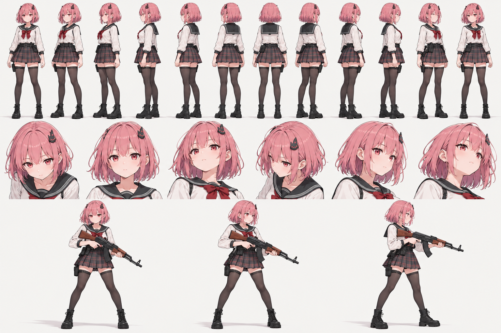

# Real2D v4 — розоволосая героиня, формулы и исходные ассеты

Это исправленный комплект для исходного художественного замысла, а не тёмноволосый head-only пример. Папка независима от existing runtime; старый демо и его bake не изменены.

## Читать в таком порядке

1. `FORMULAS.md` — компактная полная математическая модель G/L/C, SVD/PCA, Fourier×pitch, Bézier semantics, appearance/visibility/topology, warp/over, attachments и energy.
2. `REAL2D_V4_SPEC.md` — нормативная инженерная спецификация с C API/данными, контейнером, Baker, runtime и acceptance.
3. `AUTHORING_CONTRACT.md` — согласованный персонаж, intended parts×yaw layout, анатомические ID, разметка, сборка единого runtime atlas и задание агенту.
4. `PROMPTS.md` — фактические промпты всех новых sheets и target.
5. `assets/` — generated artwork candidates, перечисленные в контракте; `ASSET_REPORT.json` — реальные размеры/alpha/hashes/review status.
6. `tests/non_anchor_angles.csv` — 21 фиксированный и 256 случайных непредставленных yaw/pitch пар. Это входы теста, не готовые результаты.
7. Дополнительные `pink_body_components_compact_v2.png` (4×4: torso front/right/back/left, arms, hands, legs) и `pink_weapon_pose_expressions_v2.png` (6×4) — альтернативные candidates, не дополнительные geometry anchors. Не смешивать масштаб между версиями без нормализации.
8. `references/` — все семь оригинальных изображений пользователя, без изменения.

## Что готово и что агент должен довести

Готовы документы, исходные художественные sheets и целевой turnaround. Точные cage/mesh correspondences, per-cell yaw review, pitch geometry anchors, mask/UV data и coefficients ещё требуют авторинга и Baker. Не утверждать, что PNG содержит эти данные. Не присваивать статус acceptance_passed до реального non-anchor renderer suite.

Все component PNG имеют RGBA с реально прозрачными pixels. Цветные gradients в RGB прозрачных texels могут быть видны в некоторых previews; это не означает opaque background. Значения low alpha/edge halos дополнительно проверить при композиции.

Картинки генератора могут иметь неверную ориентацию, повторяющиеся силуэты, нестабильный root/масштаб и неточную сетку клеток. В частности head yaw sequence визуально разворачивается в сторону, противоположную нормативной convention; required ручная переаннотация углов, не предположение по номеру колонки. Brow row в face sheet не идеально выровнен с колонками. Hair masses могут содержать лишние соседние детали. В clothing blouse includes sleeves, body arms also includes sleeves — выбрать owner и убрать дублирование через authoring masks. Skirt shape changes недостаточно для доказательства точного yaw.

Отчёт честно помечает sheets GENERATED_CANDIDATE_NEEDS_AUTHORING. Простая выдача этих изображений не означает, что произвольный ракурс уже вычислен. Данные для этой сборки определены формулами и контрактом; final renders агент обязан получить кодом.

## Как должен выглядеть собранный результат

Ниже художественный target, reference-only. Он не включается в runtime atlas, не служит заменой вычисляемой функции R и не является proof выполненных формул. Сравнивать дизайн, палитру, силуэт и качество; конкретные angles дополнительно верифицировать.

