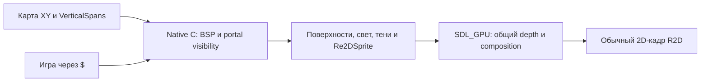

# Re2D: мир, персонажи и обычный 2D-кадр

Редакция 2026-10-10. Текущий public API мира — `$.re2dWorld`; персонажа — `$.re2dSprite`. Эта страница заменяет прежний план room/mesh. Старые API сохранены и описаны в [совместимости](highlevel/re2d_legacy.md).

## Как устроен мир

Re2D хранит пространственную карту в XY. BSP делит эти две координаты. В каждой cell есть свободные интервалы высоты — VerticalSpans. Например, `[0,128)` и `[160,288)` находятся в одной XY-области; промежуток между ними непроходимый. Пол, потолок, стена, уклон и portal — специализированные данные мира. Наличие высоты не вводит generic mesh scene, ECS или универсальную 3D-физику. Игровые объекты остаются существующими узлами `$` с атрибутами, компонентами и событиями; отдельных классов Sprite node, ActorComponent или второго игрового реестра World не создаёт.

`$` создаёт/настраивает объекты и делает игровые запросы. C владеет картой, видимостью, light lists, shadow construction, очередями синтеза ракурсов спрайтов и ресурсами. SDL_GPU исполняет выбранный GPU путь; CPU reference сохраняет ту же модель. GPU triangles — внутренний способ рисования, а не авторский формат карты.

## Что происходит с Re2DSprite

Персонаж остаётся PNG + character/animations JSON. C синтезирует его ракурс из данных поверхности. Регистрация через `world.add(sprite)` позволяет миру рассчитать угол от камеры, выбрать span, применить его свет/туман и объединить sample depth anime-персонажа с world depth. Pixel/v1 используют fallback глубину изображения. За стеной персонаж скрывается, на верхнем этаже получает верхний свет. Native composition включает socket attachments, например AK.

Положение задаётся `.at(x,y)`, высота основания — `.depth(h)`, физический размер изображения в мире — `.size(w,h)`, направление тела — `.angle(rad)`. Это семантика **спрайта узла `$`, включённого в кадр World**; обычный 2D-путь продолжает трактовать depth как порядок. Camera yaw/pitch и explicit sprite pose — в градусах, node angle — в радианах. World сам задаёт camera-relative pose, поэтому для поворота тела меняйте angle, а не вызывайте re2dPose каждый кадр.

Новый мир не превращает Box2D в многоэтажную физику. Игра выбирает достижимый пол через support, проверяет препятствия через blocked/ray и задаёт высоту узла. Прыжки, падение, health, оружие и AI принадлежат игре.

## Какие возможности доступны

- XY cells/BSP, несколько spans, portals и room-over-room; walls/floors/ceilings/continuous slopes.
- Textured albedo, optional normal/emissive, classic RGB span light, native dynamic lights, height-aware shadows и per-span fog.
- Общая глубина изображения мира и спрайтов; native attachment mirror; opaque/masked/translucent/additive world materials.
- Sky backdrop, bounded decals, binary doors, изменение flat-span heights, transactional reload/watch.
- 13 diagnostic views, native counters, pose scheduling и измеряемые caches/batching/static-light associations.

Текущие cells прямоугольные. Рендер не обещает arbitrary polygon world, smooth sliding doors, per-texel transparent shadows или массовую anime-анимацию при 60 FPS. Наблюдения запущенного GZDoom и hosted Linux CI не заявляются выполненными. Полные границы — [runtime reference](re2d/RE2D_WORLD_RUNTIME.md).

## С чего начать

| Задача | Документ |
| --- | --- |
| Создать мир, подключить персонажа и пройти карту | [World guide](RE2D_WORLD_GUIDE.md) |
| Найти точную сигнатуру/default/limit | [Public API](highlevel/re2d.md), [runtime reference](re2d/RE2D_WORLD_RUNTIME.md) |
| Свет, depth, оружие и pose budget персонажа | [Re2DSprite в World](re2d/RE2DSPRITE_WORLD.md) |
| Авторский JSON, portals, stairs/slopes и native bake | [World formats и SDK](re2d/RE2D_WORLD_FORMAT.md), [SDK](SDK.md#9-re2d-world-studio) |
| Перенести старую room/World игру | [Migration](re2d/RE2D_MIGRATION.md) |
| Создать PNG/rig/animation персонажа | [Re2DSprite guide](RE2DSPRITE_GUIDE.md), [JSON](RE2DSPRITE_JSON.md), [математика](RE2DSPRITE_MATH.md) |
| Измерить стоимость кадра | [Performance](RE2D_WORLD_PERF.md) |
| Проверить исходные требования | [Document acceptance audit](re2d/RE2D_DOCUMENT_ACCEPTANCE_AUDIT.md) |

Рабочие образцы: `demos/re2d_world_renderer_lab/acceptance` и `demos/re2d_dust2`. Dust2 — оригинальная Re2D-интерпретация маршрутов, а не точная геометрия Valve или законченная Counter-Strike игра. Данные и код являются источником истины, SDK RmlUi показывает и редактирует их.
