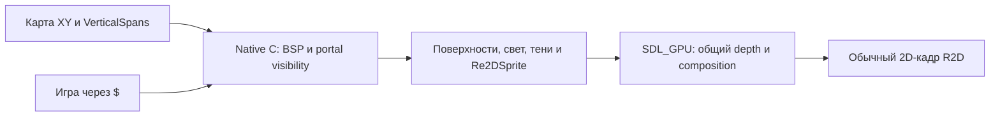

# Russiano2D 0.1.28 — Linux x86_64: инструкция для ИИ-агента

Ты получил готовый движок и игру. Тобой можно управлять программно: движок
читает JSON-команды со stdin и отвечает JSON-строками в stdout. Кадры идут
только по команде, поэтому прогон воспроизводим до кадра.

## Что в папке

| Файл | Что это |
|---|---|
| `russiano2d` | движок; он же запускает игру и собирает её в один файл |
| `game/` | готовая игра: меню + уровень-платформер |
| `assets/` | текстуры, шрифты, иконки |
| `README.md` | та же инструкция для человека — как начать первый проект |

## Режим агента

```bash
./russiano2d --agent --headless --fixed-dt 0.0166666667 --scene platformer
```

* `--agent` — кадры двигаются командой `step`, протокол на stdin/stdout;
* `--headless` — окно скрыто, но рендер и скриншоты работают;
* `--fixed-dt 0.0166666667` — детерминированный шаг (60 Гц);
* `--seed N` — зерно `$.random`;
* `--scene <имя>` — открыть сцену сразу, минуя меню;
* `--frames N` — выйти ровно после N кадров.

Первым приходит `{"event":"ready",...}`.

| Команда | Параметры | Ответ |
|---|---|---|
| `ping` | — | `{"ok":true,"pong":true,"frame":N,"time":T}` |
| `state` | — | кадр, время, окно, камера, мир, узлы, интерфейс, самотесты |
| `eval` | `code` — строка JS | `{"ok":true,"result":…}` либо `{"ok":false,"error":"…"}` |
| `step` | `frames`, `dt` | `{"ok":true,"frames":N,"frame":N2,"time":T}` |
| `screenshot` | `path` | `{"ok":true,"path":…,"width":W,"height":H}` |
| `key` | `key` (имя SDL), `action`: `"down"`,`"up"`,`"tap"` | `{"ok":true,"key":"Space","action":"tap"}` |
| `keys` | `hold` — массив имён, **заменяет** набор | `{"ok":true,"hold":["A","Space"]}` |
| `mouse` | `button` 1/2/3, `action`: `"down"`,`"up"`,`"click"` | `{"ok":true}` |
| `mouseMove` | `dx`,`dy` или `x`,`y` | `{"ok":true,"x":…,"y":…}` |
| `wheel` | `amount` | `{"ok":true}` |
| `text` | `text` | ввод текста как с клавиатуры |
| `reload` | — | перезапуск скриптов |
| `frames` | — | `{"ok":true,"frame":N,"time":T}` |
| `quit` | — | `{"ok":true}` и выход |

## Пример: пройти вправо и снять кадр

```bash
printf '%s\n' \
  '{"cmd":"state"}' \
  '{"cmd":"step","frames":40}' \
  '{"cmd":"eval","code":"$.scene.current()"}' \
  '{"cmd":"keys","hold":["D"]}' \
  '{"cmd":"step","frames":30}' \
  '{"cmd":"keys","hold":[]}' \
  '{"cmd":"screenshot","path":"shot.png"}' \
  '{"cmd":"quit"}' \
| ./russiano2d --agent --headless --scene platformer --fixed-dt 0.0166666667
```

Проверенный ответ (сокращённо):

```json
{"event":"ready","version":"0.1.28","agent":true,"headless":true,"fixed_dt":0.01666666754}
{"ok":true,"state":{"frame":1,"time":0.02,"fps":60,"window":{"title":"…","w":1280,"h":720},"world":{"bodies":0},"entities":[]}}
{"ok":true,"frames":40,"frame":41,"time":0.68}
{"ok":true,"result":"platformer"}
{"ok":true,"hold":["D"]}
{"ok":true,"frames":30,"frame":71,"time":1.18}
{"ok":true,"hold":[]}
{"ok":true,"path":"shot.png","width":1280,"height":720}
{"ok":true}
```

## Пример на Python

```python
import json, subprocess

proc = subprocess.Popen(
    ["./russiano2d", "--agent", "--headless", "--scene", "platformer",
     "--fixed-dt", "0.0166666667"],
    stdin=subprocess.PIPE, stdout=subprocess.PIPE, stderr=subprocess.DEVNULL,
    text=True, bufsize=1)

def call(**cmd):
    proc.stdin.write(json.dumps(cmd) + "\n")
    proc.stdin.flush()
    while True:
        line = proc.stdout.readline()
        if not line:
            raise SystemExit("движок закрылся")
        event = json.loads(line)
        if "event" not in event:      # первый ответ — ready, его пропускаем
            return event

call(cmd="step", frames=60)
state = call(cmd="state")["state"]
print("сцена:", state.get("scene"), "| тел:", state["world"]["bodies"])
print("HUD:", call(cmd="eval", code="$('#hud-hp').text()").get("result"))
call(cmd="quit")
```

## Что можно спросить у игры через `eval`

Проверенные выражения:

| Выражение | Что вернёт |
|---|---|
| `$.scene.current()` | имя текущей сцены, например `"platformer"` |
| `$.nodes().length` | сколько узлов сейчас в мире |
| `$('#hud-hp').text()` | текст элемента интерфейса |
| `$.debug.counters()` | счётчики кадра: спрайты, draw calls, тела |
| `state.world.bodies` | число физических тел (из `state`, не из `eval`) |

`state` полностью описывает мир: кадр, время, FPS, окно, камера, гравитация и
границы мира, список узлов и элементов UI, результаты встроенных самотестов
игры (`state.tests`).

## Своя игра

Положи рядом каталог `mygame/` с `project.json` и `main.js` (см. `README.md`)
и запусти:

```bash
./russiano2d --game mygame --agent --headless
```

Полный справочник протокола:
<https://hub.mos.ru/dem4ev48/russiano2d/-/blob/main/docs/AGENT_API.md>


---

# Приложение: вся документация движка

Ниже — полные тексты справочников, чтобы не искать их в интернете.

* Правила для кодинг-агентов — `docs/AGENT_IMPLEMENTATION_RULES.md`
* Философия Russiano2D — `docs/PHILOSOPHY.md`
* Закон UI: весь интерфейс — на RmlUi — `docs/UI_RMLUI_LAW.md`
* Архитектура и философия API `$` — `docs/ARCHITECTURE.md`
* Russiano2D — высокоуровневое API `$` — `docs/HIGH_LEVEL_API.md`
* russiano2d — агентский интерфейс (низкий уровень) — `docs/AGENT_API.md`
* Сборка и распространение игры — `docs/BUILD.md`
* Моя первая игра: платформер с маскотом — `docs/tutorial-first-game.md`
* Туториал: первая игра на `$` — `docs/tutorial-platformer.md`
* Туториал: меню, пауза и смена сцен — `docs/tutorial-menus.md`
* Russiano2D — демо-проект — `docs/demos.md`
* Текущие задачи и ограничения R2D — `docs/TASKS.md`
* Производительность и полнота высокоуровневого API `$` — `docs/HIGH_LEVEL_API_PERF.md`
* Производительность компонентов `$` API — `docs/API_PERFORMANCE.md`
* R2D DevTools — `docs/DEVTOOLS.md`
* Конвенции Russiano (R2D и R3D) — `docs/R2D_R3D_CONVENTIONS.md`
* Re2D: мир, персонажи и обычный 2D-кадр — `docs/RE2D.md`
* R2D Re2DSprite — руководство разработчика и художника — `docs/RE2DSPRITE_GUIDE.md`
* Re2DSprite JSON v1: модели, анимации и сокеты — `docs/RE2DSPRITE_JSON.md`
* Re2DSprite: развёртка и математика всех частей тела — `docs/RE2DSPRITE_MATH.md`
* Re2DSprite v1 — развёртка всего персонажа, прототип головы — `docs/RE2DSPRITE_V1.md`
* Re2DSprite v2 — большой PNG персонажа — `docs/RE2DSPRITE_V2.md`
* Re2DSprite v3 — плотная «геометрическая картинка» — `docs/RE2DSPRITE_V3.md`
* Re2D World: руководство по новой игре — `docs/RE2D_WORLD_GUIDE.md`
* Re2D World: производительность и измерения — `docs/RE2D_WORLD_PERF.md`
* Детерминированная запись и воспроизведение (record / replay) — `docs/RECORD_REPLAY.md`
* Сборка и публикация — `docs/RELEASING.md`
* Roadmap расширения R2D — `docs/ROADMAP.md`
* Russiano2D SDK — `docs/SDK.md`
* Недостающие возможности SDK и Re2D — `docs/SDK_IMPLEMENTATION_GAPS.md`
* SDK: проверенное состояние и ограничения — `docs/SDK_VERIFICATION.md`
* Тестирование мира в R2D — `docs/TESTING.md`
* Как сделать такое же демо на `$` — `docs/TUTORIAL.md`
* Веб-экспорт: движок в браузере (Emscripten + WebGPU) — `docs/WEB_EXPORT.md`
* Контракт модуля подсистемы `$` — `docs/highlevel/_CONTRACT.md`
* Акустика помещений — `$.audio.room` — `docs/highlevel/acoustics.md`
* Агент — `$.agent` — `docs/highlevel/agent.md`
* Психика NPC и режиссёр рейда — `$.alive` — `docs/highlevel/alive.md`
* `$.anim` — анимация клипами и машина состояний — `docs/highlevel/anim.md`
* `$.anim.player` — анимационный плеер: таймлайны, события, микширование — `docs/highlevel/animplayer.md`
* Сборка API — `createApi()` — `docs/highlevel/api.md`
* Атласы из JSON — `$.atlas` — `docs/highlevel/atlas.md`
* Аудио-шины и эффекты — `$.audio` — `docs/highlevel/audiobus.md`
* Загрузчик API — `bootstrap.js` — `docs/highlevel/bootstrap.md`
* BSP — `$.world.bsp` — `docs/highlevel/bsp.md`
* Камера — `$.camera` — `docs/highlevel/camera.md`
* Граф кадров — `$.cels` — `docs/highlevel/cels.md`
* Слои коллизий — `$.collision` — `docs/highlevel/collision.md`
* Бой: здоровье по зонам, урон и кровь — `$.combat` — `docs/highlevel/combat.md`
* Ядро — `$`, `ctx` и реестр узлов — `docs/highlevel/core.md`
* `$.csv` — CSV/TSV и безопасный JSON — `docs/highlevel/csv.md`
* Кривые и градиенты — `$.curve` — `docs/highlevel/curve.md`
* Катсцены — `$.cutscene` — `docs/highlevel/cutscene.md`
* Отладка — `$.debug` и `$.console` — `docs/highlevel/debug.md`
* Z-буфер ordinary batch — `$.gfx.depth` — `docs/highlevel/depth.md`
* DevTools — `$.devtools` — `docs/highlevel/devtools.md`
* Диалоги — `$.dialog` — `docs/highlevel/dialog.md`
* Потоки и таймеры — `$.flow` — `docs/highlevel/flow.md`
* Текстовые стили — `$.font` — `docs/highlevel/font.md`
* VFX своими руками — `$.fx` — `docs/highlevel/fx.md`
* `$.grid` — сеточные помощники — `docs/highlevel/grid.md`
* HTTP-запросы — `$.http` — `docs/highlevel/http.md`
* Локализация и ввод — `$.i18n`, `$.tr` и дополнения `$.input` — `docs/highlevel/i18n.md`
* Точка входа `r2d` — `index.js` — `docs/highlevel/index.md`
* Ввод — `$.input` — `docs/highlevel/input.md`
* Предметы и инвентарь — `$.items`, `$.inv` — `docs/highlevel/items.md`
* Виды узла — `.kind()`, `$.kinds`, `Re2D` — `docs/highlevel/kinds.md`
* `$.layers` — канвас-слои, параллакс и затемнение — `docs/highlevel/layers.md`
* Экран загрузки — `$.loading` — `docs/highlevel/loading.md`
* `$.math` — математика для игровой логики — `docs/highlevel/mathx.md`
* Меш со скелетом — `$.mesh` — `docs/highlevel/mesh.md`
* `native.js` — приватный вход в нативное ядро — `docs/highlevel/native.md`
* `$.nav` — навигация и поиск пути — `docs/highlevel/nav.md`
* Сеть — `$.net` (только авторитарная модель) — `docs/highlevel/net.md`
* Частицы — `$('<particles>')` и `$.particles` — `docs/highlevel/particles.md`
* Пул объектов — `$.pool` — `docs/highlevel/pool.md`
* `$.prefab` — prefab, наследование сцен и сериализация узлов — `docs/highlevel/prefab.md`
* Процедурный пиксель-арт — `$.proc` — `docs/highlevel/proc.md`
* Задания — `$.quest` — `docs/highlevel/quest.md`
* Генерация рейда — `$.raid` — `docs/highlevel/raid.md`
* `$.random` — детерминированная случайность — `docs/highlevel/random.md`
* Re2D World — public `$` API — `docs/highlevel/re2d.md`
* Legacy Re2D: room/kind и прежний World — `docs/highlevel/re2d_legacy.md`
* Re2DSprite — `$.re2dSprite` — `docs/highlevel/re2dsprite.md`
* `$.blend` и `$.viewport` — смешивание и render target — `docs/highlevel/render.md`
* Реплеи — `$.replay` — `docs/highlevel/replay.md`
* Реестр ресурсов — `$.resource` — `docs/highlevel/resource.md`
* Re2DSprite — совместимость старого имени — `docs/highlevel/rotsprite.md`
* Русские имена API (`$.ru`) — `docs/highlevel/ru.md`
* Сохранения игры — `$.save` — `docs/highlevel/save.md`
* Сцены — `$.scene` — `docs/highlevel/scene.md`
* Экраны и меню — `$.screen` — `docs/highlevel/screen.md`
* Перезапуск скриптов — `$.script` — `docs/highlevel/script.md`
* Мост инструментов SDK — `$.sdk` — `docs/highlevel/sdk.md`
* Сигналы — `$.signal` — `docs/highlevel/signal.md`
* Звук — `$.sound` — `docs/highlevel/sound.md`
* Банки звуков — `$.sound.bank*` — `docs/highlevel/soundbank.md`
* Спрайт: пивот и nine-slice — `docs/highlevel/sprite.md`
* Машина состояний — `$.state` и `.fsm()` — `docs/highlevel/state.md`
* Шаги и реплики — `$.steps` и `$.barks` — `docs/highlevel/steps.md`
* Файлы и сохранения — `$.fs` и `$.store` — `docs/highlevel/store.md`
* Сценки и катсцены — `$.story` — `docs/highlevel/story.md`
* Разбор сценария — `story_script.js` — `docs/highlevel/story_script.md`
* Работа кусками — `$.task` — `docs/highlevel/task.md`
* Текст и шрифты — `$.font`, `$('<text>')`, `$('<ui.label>')` — `docs/highlevel/text.md`
* TileMap — тайловые карты `$('<tilemap>')` — `docs/highlevel/tilemap.md`
* Время — `$.time` — `docs/highlevel/time.md`
* Таймлайн-сцены — `$.timeline` (AnimatedTimelineScene2d) — `docs/highlevel/timeline.md`
* Зоны-триггеры — `$.triggers` и тег `<trigger>` — `docs/highlevel/triggers.md`
* `$.tween` — Tween-объекты в стиле Godot 4 — `docs/highlevel/tween.md`
* HUD и интерфейс — `$.ui` — `docs/highlevel/ui.md`
* Render target — `$.viewport` — `docs/highlevel/viewport.md`
* Несколько камер — `$.camera.add/split/views` — `docs/highlevel/viewports.md`
* Реактивные запросы — `$.watch` — `docs/highlevel/watch.md`
* Оружие и баллистика — `$.weapons` — `docs/highlevel/weapons.md`
* UI-контролы — `$.ui` и теги `<ui.*>` — `docs/highlevel/widgets.md`
* Окно — `$.window` — `docs/highlevel/window.md`
* Мир — `$.world` — `docs/highlevel/world.md`


---

## Правила для кодинг-агентов

<sub>источник: `docs/AGENT_IMPLEMENTATION_RULES.md`</sub>

# Правила для кодинг-агентов

Читай этот файл **до** первой правки в Russiano2D. Здесь не пожелания, а
условия приёмки работы: правила 1–10 — ограничения, «Рабочий цикл» — порядок
действий, «Стоп-условия» — когда нужно остановиться и спросить, а не
импровизировать.

Связанные документы: [PHILOSOPHY.md](PHILOSOPHY.md) (конституция),
[UI_RMLUI_LAW.md](UI_RMLUI_LAW.md) (закон UI), [ROADMAP.md](ROADMAP.md) (порядок
работ), [TESTING.md](TESTING.md) (как проверять).

---

## Правило 1 — Существующий код побеждает

Russiano2D — существующий движок. Прежде чем что-то писать:

1. найди существующий код по теме;
2. прочитай его;
3. прочитай его документацию (`docs/`, `docs/highlevel/<имя>.md`);
4. найди его тесты (`tests/js/*_test.mjs`, `tests/agent/*_test.py`);
5. пойми публичный API;
6. и только потом проектируй изменение.

**Не реализуй параллельную подсистему** только потому, что не нашёл
существующую. Дублирование — самая дорогая ошибка в этом репозитории.

## Правило 2 — Никакой смены архитектуры без явной просьбы

Нельзя самостоятельно решать: переписать движок, перейти на C++, ввести ECS,
заменить QuickJS-ng, SDL, RmlUi, перепроектировать `$`, добавить второй
UI-фреймворк. Если это объективно блокирует задачу — опиши блокер, не обходи
его сменой архитектуры ([PHILOSOPHY.md](PHILOSOPHY.md) §3).

## Правило 3 — Сохраняй совместимость

Существующие игры должны продолжать работать. Если публичное поведение
обязано измениться: объясни причину, добавь заметки о миграции, добавь тесты и
не ломай ничего попутного.

## Правило 4 — ВЕСЬ UI — RmlUi

Не обсуждается. Никаких ImGui «временно», никаких нативных кнопок «просто для
теста», никакого второго developer GUI. Нативные custom-элементы допустимы
только как специализированное содержимое **внутри** RmlUi. Полностью —
[UI_RMLUI_LAW.md](UI_RMLUI_LAW.md).

## Правило 5 — Горячие пути — нативные

Избегай поштучных переходов C↔JS там, где движок умеет массовую операцию:

```js
// плохо: N переходов на кадр
$('.enemy').each(e => expensivePerEntityBridge(e));
```

Предпочитай декларативные и пакетные операции. Покадровый проход по узлам `$`
— кандидат в C (`src/nodes.c`): C читает поля узла через атомы за ≈4 нс, а
интерпретатор тратит на тот же узел микросекунды. Такой проход повторяет
JS-математику один в один и сверяется тестом «C против JS»
(`tests/agent/native_passes_test.py`, `$.debug.nativePasses(false)`). Но и
обратное неверно: **не тащи произвольную игровую логику в C**.

## Правило 6 — Измеряй

Прежде чем утверждать «стало быстрее»: замерь старое поведение, замерь новое,
запиши число объектов и конфигурацию сборки. Архитектурная интуиция — не
доказательство. Готовые инструменты: `$.debug.profile()`,
`tools/bench_highlevel.py`, `--stats`.

## Правило 7 — Детерминированные тесты

Новые возможности запросов/агента/реплея получают автотесты, где это
осуществимо: фиксированный шаг, известное зерно, управляемое состояние мира.
См. [TESTING.md](TESTING.md).

## Правило 8 — Структурированные данные для отладки

Машинно-ориентированные API возвращают структуру, а не декоративный вывод:
агент не должен разбирать текст терминала.

## Правило 9 — Никакой выдуманной диагностики

Диагностика сообщает **только факты, известные движку**. Движок не сочиняет
спекулятивных объяснений — рассуждение принадлежит вызывающей стороне.

```json
// хорошо
{ "visible": false, "blockedBy": "wall_42" }

// плохо
{ "reason": "Стражник, похоже, не видит игрока, потому что растерялся." }
```

## Правило 10 — Сохраняй R2D приятным

Обычный код игры должен выглядеть как R2D, а не как корпоративная
инфраструктура:

```js
$.ready(() => {
    $('<player>', { id: 'hero' }).at(100, 300).health(100).appendTo($.world);
    $('.enemy').each((i, e) => { if (e.distanceTo('#hero') < 200) e.damage(1); });
});
```

---

## Рабочий цикл

Для каждой фазы [ROADMAP.md](ROADMAP.md):

1. изучи реализацию (правило 1);
2. напиши короткий план изменения;
3. добавь/поправь тесты;
4. реализуй **наименьший полезный вертикальный срез**;
5. собери (`cmake --build build`);
6. прогони существующие тесты;
7. прогони новые тесты;
8. прогони детерминированный headless-сценарий (агентский режим);
9. сделай замеры, если изменение про производительность;
10. обнови документацию — **в том же изменении**.

Только после этого переходи к следующей крупной фазе.

---

## Стоп-условия

Остановись и доложи, вместо того чтобы импровизировать, если:

* существующая архитектура материально противоречит заданию;
* для реализации нужно сломать публичный API;
* нужной зависимости нет;
* существующие тесты падают **до** твоих правок;
* предлагаемая возможность дублирует существующую систему;
* документация и реализация расходятся так, что это влияет на проектирование.

Объясни конфликт и предложи наименьшее совместимое решение.

---

## Определение успеха

Успех — это **не** «все галочки роадмапа закрыты». Успех — это:

* существующий Russiano2D продолжает работать;
* API остаётся простым;
* запросы становятся мощнее;
* горячие пути остаются нативными;
* агент понимает состояние рантайма;
* баги воспроизводимы;
* весь UI остаётся на RmlUi.

---

## Правила репозитория, о которых легко забыть

* **Сначала философия — потом работа.** Агент не пишет в движок, пока не прочитал
  целиком [PHILOSOPHY.md](PHILOSOPHY.md) — конституцию движка. Это всё, что
  требует гейт. Остальные доки ([ARCHITECTURE.md](ARCHITECTURE.md), этот файл,
  [internal/NATIVE.md](internal/NATIVE.md), [HIGH_LEVEL_API.md](HIGH_LEVEL_API.md),
  а при правке `src/highlevel/**` — [highlevel/_CONTRACT.md](highlevel/_CONTRACT.md)
  и страница модуля `docs/highlevel/<имя>.md`) обязательны по правилам выше, но
  запись не блокируют. Гейт делает плагин
  `tools/dsh-russiano2d-docs-gate`; обойти его нельзя, делегирование не
  отменяет правило.
* **Главный гейт: движок только 2D.** Тот же плагин отклоняет правку, вводящую
  3D-сущность: имя пути вида `render3d.c`/`mesh3d.js`, имена `R3D`, `Scene3D`,
  `Mesh3D`, `Vector3`, `Matrix4`, `Quaternion`, `MeshRenderer`, `Physics3D`,
  `Camera3D` и загрузчики 3D-ассетов в рантайме (`assimp`/`tinygltf`/`cgltf`/`glm`,
  three.js). Превращать Russiano2D в 3D нельзя — это non-goal
  ([PHILOSOPHY.md](PHILOSOPHY.md) §3). RE2D остаётся разрешённым: это
  `spatial description → projection → ordinary 2D representation`
  ([PHILOSOPHY.md](PHILOSOPHY.md) §1), а не мост к 3D. SDK-импорт 3D-моделей
  (`sdk/**`), инструменты, документация, тесты и дистрибутивы из гейта исключены.
  Спорную задачу останавливай и выноси владельцу проекта.
* **Каждый модуль `src/highlevel/<имя>.js`** имеет страницу
  `docs/highlevel/<имя>.md` и тест — это проверяет
  `tests/doc_coverage_test.py`.
* **Новый файл в `docs/`** автоматически попадает в `AGENTS.md` релизного
  пакета ([tools/agents_doc.py](../tools/agents_doc.py)); порядок документов
  задаёт [tools/release.py](../tools/release.py) (`AGENTS_DOC_ORDER`). Поэтому
  документ не может «отстать» от движка — и не должен врать.
* **Закрытый пункт работы исчезает из документации в том же изменении**
  (правило из [TASKS.md](TASKS.md) §6).
* **Язык документации — русский**, термины API — английские; код и имена в
  коде — английские.


---

## Философия Russiano2D

<sub>источник: `docs/PHILOSOPHY.md`</sub>

# Философия Russiano2D

Это **конституция движка**: короткий список решений, которые не обсуждаются
заново на каждой задаче. Документ написан и для людей, и для агентов: он
называет, что можно менять свободно, а что является архитектурной константой.

Статус: **ограничения, а не пожелания**. Изменение здесь — отдельное решение
владельца проекта, а не побочный эффект правки кода.

Детали и история: [ARCHITECTURE.md](ARCHITECTURE.md) (философия API `$`),
[TASKS.md](TASKS.md) (сверка с Godot 4.x),
[TASKS.md](TASKS.md) (что осталось). Законы, вытекающие отсюда:
[UI_RMLUI_LAW.md](UI_RMLUI_LAW.md) и
[AGENT_IMPLEMENTATION_RULES.md](AGENT_IMPLEMENTATION_RULES.md).

---

## 1. Что такое Russiano2D

2D-игровой движок: ядро на C/C++ (SDL3 + SDL_GPU, Box2D v3, QuickJS-ng,
SDL3_mixer, RmlUi), игровая логика — JavaScript. Вся работа с движком идёт
через одну точку входа — `$` в стиле jQuery. Схема — **C → `$`**: нативное ядро
отдаёт свои примитивы прямо модулям `$`, а игре виден только `$`. Низкоуровневого
`engine.*` в игровом коде нет — до него не добраться без пересборки движка
([highlevel/native.md](highlevel/native.md)).

Игра — это **код и данные**, а не проект в визуальном редакторе: уровень,
логика и интерфейс описываются текстом, поэтому их удобно читать, diff'ить,
генерировать и проверять автоматически, в том числе ИИ-агентом.

**RE2D — spatial description → projection → ordinary 2D representation.**
XYZ/surfaces/bones/depth — промежуточные authoring/runtime-данные синтеза;
результат — обычный 2D sprite/кадр для существующего R2D 2D-батча.
RE2D World продолжает этот принцип: XY BSP + vertical spans, специализированные
стены и регионы пола/потолка. Пространственная математика не вводит обычный
3D scene graph, универсальный world mesh API или 3D-физику. Сущности и gameplay
остаются узлами/компонентами и скриптами. Совместимый прежний Re2D-путь
(`.kind(Re2D)`, `room`, `mesh`) описан в [RE2D.md](RE2D.md); его mesh-проход
не является архитектурной целью нового World. Узлы и камеры без `kind`
работают как прежде.

---

## 2. Константы

1. **`$` — единственная точка входа.** Одно пространство имён, цепочки,
   селекторы, неявная итерация. Нативное ядро — внутренность `$`
   (`src/highlevel/native.js`): `globalThis.engine` после установки `$`
   убирается, внутренние модули `r2d/*` игре не импортируются. Чего игре не
   хватает — добавляется в `$`, а не открывается наружу.
2. **Канонического редактора сцен нет и не планируется.** Уровень и логика —
   код и данные. Инструменты разработчика ([DEVTOOLS.md](DEVTOOLS.md)) —
   инспектор. Инструменты [SDK](SDK.md) редактируют открытые JSON/PNG и
   показывают их существующим runtime; они не создают обязательный project
   format, второй scene graph или скрытое состояние, без которого игра не работает.
   Это граница существующего code/data-first принципа, а не смена архитектуры.
3. **Создание как в HTML, поиск как в CSS.** `$('<player>', { id: 'hero' })`,
   `$('#hero')`, `$('.enemy:alive')`. Никаких `new`, `extends`, `this` в
   игровом коде.
4. **Кадр — пакет.** Игра не вызывает отрисовку на спрайт: `$.gfx` собирает
   массивы и отдаёт их одним вызовом (`engine.submitSprites` и родственные).
5. **C — ядро `$`, JS — его API и оркестрация.** Покадровые проходы по узлам
   `$` (синк физики, события мира, наведение, сортировка, сборка батча, твины)
   идут в C прямо над узлами (`src/nodes.c`, [highlevel/native.md](highlevel/native.md)),
   а не поштучными переходами C↔JS. Модули `$` на JS дают API, редкие и
   сложные случаи; произвольную игровую логику в C не переносят. См. правило 5
   в [AGENT_IMPLEMENTATION_RULES.md](AGENT_IMPLEMENTATION_RULES.md).
6. **Весь интерфейс — RmlUi.** Игровой UI, HUD, меню, диалоги, DevTools:
   только `.rml` + `.rcss`. Подробности и переходное правило —
   [UI_RMLUI_LAW.md](UI_RMLUI_LAW.md).
7. **Человек и агент — равные потребители.** Машинно-ориентированные API
   отдают структурированные данные, а не декоративный текст; движок сообщает
   только известные ему факты и не сочиняет объяснений (правила 8–9 в
   [AGENT_IMPLEMENTATION_RULES.md](AGENT_IMPLEMENTATION_RULES.md)).
8. **Детерминизм — инструмент отладки, а не роскошь.** Фиксированный шаг
   (`--fixed-dt`), зерно (`--seed`), управляемый ввод и запись/воспроизведение
   делают баг воспроизводимым. См. [RECORD_REPLAY.md](RECORD_REPLAY.md) и
   [TESTING.md](TESTING.md).
9. **Существующий код побеждает.** Сначала найди существующую подсистему, её
   доку и тесты; параллельная реализация «того же, но своего» не принимается.
10. **Совместимость.** Существующие игры продолжают работать; ломающее
    изменение публичного поведения требует обоснования, заметок о миграции и
    тестов.
11. **Измерять, а не верить.** Утверждение «стало быстрее» без замера до/после,
    числа объектов и конфигурации сборки не принимается (правило 6 в
    [AGENT_IMPLEMENTATION_RULES.md](AGENT_IMPLEMENTATION_RULES.md)).

---

## 3. Явные non-goals

Перечисленное **не** является задачей и не должно появляться «попутно»:

* переписывание движка или переезд на C++;
* ECS и другие смены архитектурной парадигмы;
* замена QuickJS-ng, SDL3 или RmlUi;
* второй UI-фреймворк (включая «временный» ImGui-интерфейс — см. закон UI);
* визуальный редактор сцен вместо кода;
* новый физический движок;
* преждевременный общий фреймворк R2D/R3D
  ([R2D_R3D_CONVENTIONS.md](R2D_R3D_CONVENTIONS.md)).

---

## 4. Чем это проверяется

* `python3 tools/run_tests.py` — агентские интеграционные тесты
  ([TESTING.md](TESTING.md));
* `tests/js/*_test.mjs` под QuickJS — логика подсистем без движка;
* `python3 tests/doc_claims_test.py` — страж «в доке написано, что чего-то
  нет, а в коде оно есть»;
* `python3 tests/doc_coverage_test.py` — у каждого модуля `src/highlevel/*.js`
  есть страница и тест;
* `tests/agent/engine_hidden_test.py` — игре виден только `$` (константа 1);
* `tests/agent/native_passes_test.py` — нативные проходы кадра дают тот же
  кадр, события и значения, что JS-путь (константа 5).

Правило на будущее: **закрытый пункт работы в том же изменении исчезает из
документации** — старые находки остаются в истории Git, а [TASKS.md](TASKS.md) содержит
только актуальные ограничения и следующий шаг.


---

## Закон UI: весь интерфейс — на RmlUi

<sub>источник: `docs/UI_RMLUI_LAW.md`</sub>

# Закон UI: весь интерфейс — на RmlUi

Статус: **закон** (архитектурная константа, см. [PHILOSOPHY.md](PHILOSOPHY.md)
§2.6). Нарушение — основание не принимать изменение.

Короткая формулировка, на которую ссылаются остальные документы:

> **ALL UI → RmlUi.** Любой интерфейс движка и игры — документы `.rml` +
> `.rcss`. Второго UI-пути в движке нет.

---

## 1. Из чего это состоит

1. **Интерфейс рисует RmlUi.** Игровой HUD, меню, экраны, диалоги, инвентарь,
   настройки, обучение, экраны загрузки, панели инструментов разработчика —
   всё это `.rml` + `.rcss`.
2. **RmlUi владеет вёрсткой и раскладкой.** Если нужен особый визуальный
   контент (коллизии, BSP, навигация, графики), он рисуется **внутри**
   RmlUi-элемента, а не вместо RmlUi.
3. **Движок не заводит второй UI-стека.** Ни ImGui «пока не сделаем нормально»,
   ни собственный виджет-фреймворк, ни ручная раскладка как основа интерфейса.
4. **Правило одно для R2D и R3D** — см.
   [R2D_R3D_CONVENTIONS.md](R2D_R3D_CONVENTIONS.md) §4.

---

## 2. Что разрешено

* Документы RmlUi: `$.ui.doc('ui/menu.rml')` и низкоуровневые `engine.ui.*`
  ([HIGH_LEVEL_API.md](HIGH_LEVEL_API.md) §20, [internal/NATIVE.md](internal/NATIVE.md) §9).
* **Нативные custom-элементы внутри RmlUi** — для специализированного
  отрисованного содержимого: визуализация коллизий, BSP, навигационной сетки,
  зон видимости, графиков профайлера ([DEVTOOLS.md](DEVTOOLS.md) §5).
* Существующие узлы `<ui.*>` (`<ui.bar>`, `<ui.label>`, `<ui.button>`, …) — как
  **быстрый рисователь HUD** в координатах окна: полоса, подпись, иконка
  поверх сцены. Они продолжают работать, их не нужно переписывать, но это не
  «интерфейсный слой» и не основа для новых экранов.

---

## 3. Что запрещено

* добавлять ImGui-интерфейс — даже временно, даже «для отладки»;
* создавать второй developer GUI параллельно RmlUi;
* строить меню, экраны и диалоги на узлах `<ui.*>`, если это новый код;
* тащить в движок стороннюю библиотеку интерфейса;
* считать ручную раскладку (`at()`/`size()` по пикселям) заменой RmlUi.

---

## 4. Текущее состояние (2026-10-09)

| Путь | Где | Статус |
|---|---|---|
| RmlUi-документы | [gui.cpp](../src/gui.cpp), [ui.js](../src/highlevel/ui.js), [devtools.js](../src/highlevel/devtools.js), `sdk/ui/`, `demos/ui/launcher.rml` | целевой путь; новый SDK и DevTools используют его |
| Legacy HUD/widgets | [ui.js](../src/highlevel/ui.js), [widgets.js](../src/highlevel/widgets.js), [screen.js](../src/highlevel/screen.js) | совместимость; новые меню/экраны на них не строятся |
| F1 / `--overlay` / `$.debug.on()` | [devtools.js](../src/highlevel/devtools.js) | RmlUi: статистика, профиль, гравитация, скрипты, текстуры и наблюдения |

ImGui удалён из зависимостей, сборки, обработки событий и runtime.
F5 запрашивает общий reload независимо от GUI. F2 открывает инспектор узлов.

Текст сцены использует native TTF/stb_truetype и существующий 2D sprite batch
([text.c](../src/text.c)), а не ImGui. Launcher уже на RmlUi; прежнее
утверждение, что `launcher.rml` не используется, удалено.
Справочники legacy подсистем сохраняют API, но не предлагают их для новых меню.
Все новые SDK-панели находятся в `.rml` / `.rcss`; World Studio редактирует
открытые данные и не вводит другой UI или renderer.

---

## 5. Переходное правило

1. **Существующие игры не ломаем.** Узлы `<ui.*>` остаются рабочими; их API не
   удаляется и не переписывается «заодно».
2. **Новый интерфейс — только RmlUi.** Меню, экраны, диалоги, панели: новый
   `.rml` + `.rcss` + `$.ui.doc`. Это относится и к служебным экранам
   (пауза, настройки, загрузка).
3. **`<ui.*>` — HUD-рисователь.** Новые полосы, подписи и иконки поверх сцены
   на них — по-прежнему нормально.
4. **DevTools — на RmlUi.** Панели инспектора делаются RmlUi-документами;
   нативная отрисовка допускается только как содержимое внутри custom-элемента
   ([DEVTOOLS.md](DEVTOOLS.md)).
5. **ImGui удалён.** Отладочные панели используют тот же RmlUi, что SDK и игры.

---

## 6. Критерии приёмки (чек-лист ревью)

* [ ] Новый интерфейс — это `.rml` + `.rcss` (или `$.ui.doc`), а не разметка
      в JS на узлах.
* [ ] В изменении нет новых окон/виджетов ImGui.
* [ ] Нет второго механизма раскладки/шрифтов/ввода интерфейса.
* [ ] Нативная отрисовка (если есть) находится внутри RmlUi-элемента и не
      подменяет вёрстку.
* [ ] Документация не называет `<ui.*>` «интерфейсным слоем» и не предлагает
      строить меню на узлах.
* [ ] Если правило нарушено по объективной причине — это отдельное решение
      владельца проекта с записью здесь, а не молчаливое исключение.

---

## 7. Как проверить, что закон соблюдён

```bash
# ImGui не должен присутствовать в коде
rg "ImGui::|imgui.h" src/

# новые меню/экраны на узлах <ui.*>
grep -rn "ui\.panel\|ui\.button" src/highlevel/*.js demos/*.js

# RmlUi-документы и их обёртка
grep -rn "ui\.doc(\|ui_load" src/highlevel/*.js game demos
```

Ссылки: [internal/NATIVE.md](internal/NATIVE.md) §9 (низкоуровневый GUI),
[HIGH_LEVEL_API.md](HIGH_LEVEL_API.md) §20 (`$.ui`),
[PHILOSOPHY.md](PHILOSOPHY.md) §2.6, [DEVTOOLS.md](DEVTOOLS.md).


---

## Архитектура и философия API `$`

<sub>источник: `docs/ARCHITECTURE.md`</sub>

# Архитектура и философия API `$`

> Исходный проектный документ: каким задумывалось высокоуровневое API.
> Актуальный справочник — [HIGH_LEVEL_API.md](HIGH_LEVEL_API.md).
>
> **Сейчас схема — C → `$`** ([PHILOSOPHY.md](PHILOSOPHY.md), константы 1 и 5):
> игре виден только `$`, нативное ядро (`engine`) спрятано под ним
> ([highlevel/native.md](highlevel/native.md)), а покадровые проходы по узлам
> идут в C (`src/nodes.c`). Внутренний справочник ядра —
> [internal/NATIVE.md](internal/NATIVE.md).

jQuery-style API для 2D-движка (SDL3 + QJS-NG)

Ок, вот переделка. Никаких классов для пользователя. Только $. Всё chainable. Всё через селекторы. Создание через <тег> как в jQuery.
1. ФИЛОСОФИЯ
text

- $  — единственная точка входа
- Всё возвращает один и тот же wrapper → цепочки
- Создание через $('<player>', {...}) — как HTML
- Поиск через селекторы: $('#hero'), $('.enemy'), $('npc')
- События через .on() .off() .emit()
- Никаких new, extends, this — юзер пишет декларативно
- Неявная итерация: $('.enemy').damage(10) бьёт всех
- Всё асинхронное — Promise, если надо
- Матчинг по CSS-подобным селекторам

Интерфейс — только RmlUi (жёсткое правило, одинаковое для людей и агентов):

- **Весь UI движка — документы RmlUi**: `.rml` + `.rcss`, загружаются через
  `$.ui.doc('ui/menu.rml')` (внутри — нативный `engine.ui.*`, §9 в
  [internal/NATIVE.md](internal/NATIVE.md#9-игровой-gui-rmlui); см. §20 в
  [HIGH_LEVEL_API.md](HIGH_LEVEL_API.md)). Меню, HUD, диалоги, экраны,
  инвентарь, настройки, оверлеи — всё это RmlUi.
- **Второго UI-пути в движке нет.** Сторонний UI-фреймворк, вёрстка интерфейса
  узлами сцены и ручной расчёт раскладки как основа UI не принимаются.
- **Узлы `<ui.*>` — не интерфейсный слой**, а быстрый рисователь HUD в
  координатах окна (`ui.js`, `widgets.js`): полоса, подпись, иконка поверх
  сцены. Существующие игры на них работают, но новые меню, экраны и диалоги
  строятся только на RmlUi.
- **Новый UI = новый `.rml` + `.rcss` + `$.ui.doc`.** Интерфейс, сделанный
  иначе, в движок не берётся — это правило ревью, а не пожелание.

Полная формулировка закона, фактическое состояние UI-путей и переходное
правило — [UI_RMLUI_LAW.md](UI_RMLUI_LAW.md).

2. ГЛАВНЫЙ ОБЪЕКТ $
text

$('<player>')                  создать
$('<enemy>', { hp: 30 })       создать с атрибутами
$('#hero')                     найти по id
$('.enemy')                    по классу
$('player')                    по типу
$(':alive')                    по фильтру
$('#hero, .boss')              объединение
$(node)                        обернуть готовый
$([a, b, c])                   из массива
$(null) / $(undefined)         пустой набор (безопасно)

$.world                        мир
$.camera                       камера
$.input                        ввод
$.sound                        звук
$.gfx                          графика (overlay)
$.store                        сохранения
$.scene                        менеджер сцен
$.time                         время
$.debug                        отладка

$.ready(fn)                    при старте
$.update(fn)                   каждый кадр
$.render(fn)                   отрисовка
$.exit(fn)                     при выходе

$.emit(name, data)             глобальное событие
$.on(name, fn) $.off(name, fn)
$.selectors                    регистрация кастомных селекторов
$.fn                           прототип — расширение через $.fn.myMethod = ...

3. СОЗДАНИЕ СУЩНОСТЕЙ (HTML-like)
text

$('<player>')
$('<player>', { id: 'hero', hp: 100, speed: 200 })
$('<enemy>',   { class: 'goblin', sprite: 'orc.png' })
$('<sprite>',  { src: 'tree.png' })
$('<text>',    { text: 'Hello', size: 24 })
$('<rect>',    { w: 32, h: 32, color: '#ff0000' })
$('<circle>',  { r: 20, color: 'blue' })
$('<tilemap>', { src: 'level1.tmx', tile: 32 })
$('<light>',   { radius: 200, color: '#ffaa00' })
$('<particles>', { src: 'fire.json' })
$('<trigger>', { w: 100, h: 50 })
$('<area>')
$('<ui.button>', { text: 'Play' })
$('<ui.label>',  { text: 'HP' })
$('<ui.panel>')

Атрибуты в объекте = свойства, эмитятся в сеттеры.
Любой непонятный ключ → .attr(key, value)

4. СЕЛЕКТОРЫ (CSS-подобные)
text

'#id'                  по id
'.class'               по классу
'type'                 по типу (player, enemy, sprite, ...)
'*'                    все
':alive'               живые
':dead'                мёртвые
':visible' ':hidden'
':onScreen'            в камере
':offScreen'
':paused'
':picked'              по курсору
':first' ':last' ':even' ':odd' ':eq(n)'
':has(.item)'          есть дети
':parent'              есть дети
':empty'               без детей
'[hp<20]'              атрибут-условие
'[team=1]'
'[hp<20][speed>100]'   комбинировать
'player.enemy'         тип + класс
'#hero .weapon'        вложенность
'>'                    прямой потомок
' '                    любой потомок
','                    объединение

Кастомные:
text

$.selectors.register(':boss', n => n.attrs.rank === 'boss');
$(':boss').hp(1000);

5. ЦЕПОЧКИ (chainable, всё возвращает wrapper)
js

$('#hero')
  .at(100, 200)
  .size(32, 32)
  .sprite('hero.png')
  .speed(250)
  .health(100)
  .layer(2)
  .tag('friendly')
  .controls('wasd')
  .on('hit', e => e.shake(0.3))
  .appendTo($.world);

6. МЕТОДЫ ПО КАТЕГОРИЯМ
Позиция / трансформ
text

.at(x, y)                       → this
.at(vec2)
.move(dx, dy) / .move(v)
.moveTo(x, y, ms?)              с твином, если ms
.pos()                          → { x, y }
.globalPos()                    → { x, y } (мировые)
.rotate(deg) / .rotation()
.angle(rad)
.scale(s) / .scale(sx, sy)
.lookAt(target)                 'target' — селектор или point
.flip(x?, y?)
.depth(z)
.layer(n)

.distanceTo('#enemy')           → number
.directionTo('#enemy')          → { x, y }
.angleTo('#enemy')              → rad
.rayTo('#enemy')                → { hit, point, normal } | null
.toGlobal(local) → { x, y }
.toLocal(global) → { x, y }

Визуал
text

.sprite(path)
.region(x, y, w, h)             атлас
.frame(n)                       кадр в атласе
.frames({ w, h, cols })
.animate(name)                  запустить анимацию
.animate(name, { loop, speed })
.stopAnim()
.color('#ff0000')               modulate
.alpha(0.5)
.opacity(0.5)
.visible(true/false)
.hide() / .show()
.fadeIn(ms) / .fadeOut(ms)
.blend('add' | 'mul' | 'alpha')
.shader('water.glsl')
.shaderParam('wave', 0.5)
.outline(w, color)
.shadow({ x, y, color, blur })

Физика
text

.velocity(x, y) / .velocity(v)
.velocity()                     → { x, y }
.applyForce(x, y)
.applyImpulse(x, y)
.gravity(true/false)
.body('static' | 'dynamic' | 'kinematic')
.collision(w, h)                хитбокс
.collisionCircle(r)
.mask(bits)
.layerBits(bits)
.collidesWith('.wall')
.onFloor() → bool
.onWall() → bool
.moveAndSlide(dt)
.jump(force)

.overlaps('#enemy')             → bool
.overlaps('#enemy', cb)         подписка
.inside('#zone')

Здоровье / урон
text

.health(100)
.hp()                           → number (текущее)
.hp(n)                          сеттер (урон/лечение)
.maxHp(100)
.damage(10)                     нанести урон
.heal(10)
.kill()
.respawn(x, y)
.alive()                        → bool
.team(1)

События (jQuery-стиль)
text

.on('hit',       e => {})
.on('death',     e => {})
.on('spawn',     e => {})
.on('tick',      e => {})       каждый кадр
.on('enter',     e => {})       в камере
.on('leave',     e => {})
.on('collide',   e => {})
.on('click',     e => {})
.on('key',       e => {})
.on('animEnd',   e => {})
.on('custom:foo', e => {})

.off('hit')
.off('hit', handler)
.off()                          все

.trigger('hit', { dmg: 5 })     локально
.emit('hit', { dmg: 5 })        то же

e объект: {
  self     — wrapper, на кого сработало
  target   — wrapper
  source   — wrapper
  data     — то что передали
  stop()   — остановить распространение
  preventDefault()
  dt, frame
}

Твины / анимации
text

.moveTo(x, y, ms, ease?)        → Promise
.tween({ x, y, alpha }, ms, ease)
.tweenTo({ prop: value }, ms)
.rotateTo(deg, ms)
.scaleTo(s, ms)
.fadeTo(0, ms)
.shake(intensity, ms)
.flash(color, ms)
.bounce(h, ms)
.animate('walk')                спрайт-анимация
.animate('walk', { loop, speed, end })
.sequence([...])
.pauseTweens()
.resumeTweens()
.clearTweens()

Easing-строки:
'linear' 'ease' 'easeIn' 'easeOut' 'easeInOut'
'easeInCubic' 'easeOutCubic' 'easeInOutCubic'
'easeInBack'  'easeOutBack'
'easeOutElastic' 'easeOutBounce'

Звук (позиционный)
text

.sound('jump.wav')              привязать звук
.playSound()                    проиграть
.mute(b)
.volume(v)

Иерархия
text

.appendTo(parent)
.prependTo(parent)
.append(child)
.prepend(child)
.remove()                       удалить из мира
.detach()                       отсоединить, сохранить
.parent()
.children(sel?)
.find(sel)
.closest(sel)
.siblings(sel?)

Коллекция (jQuery)
text

.each((i, el) => {})
.map(el => el.hp())
.first() .last() .eq(i)
.slice(a, b)
.add(sel)
.not(sel)
.filter(sel | fn)
.is(sel) → bool
.has(sel) → bool
.length → number
.get(i) → Node
.toArray() → Node[]
.index()

.every(fn) → bool
.some(fn)  → bool
.reduce(fn, init)

Data / классы / теги
text

.data('key') / .data('key', val) / .data({})
.attr('key') / .attr('key', val)
.addClass('x') / .removeClass('x') / .toggleClass('x')
.hasClass('x')
.addTag('x') / .removeTag('x')
.tag('x')                       алиас addClass

Массовые операции
text

$('.enemy').damage(10)
$('.enemy').stopAll()
$('.enemy').at(0, 0)            телепорт всей толпы
$('.enemy').remove()

7. МИР / КАМЕРА / СЦЕНА
text

$.world
  .gravity(x, y)
  .bounds(x, y, w, h)
  .background(path)
  .color('#000')
  .pause() / .resume()
  .clear()
  .spawn('<player>', x, y) → wrapper
  .query(x, y, r?) → wrapper[]  все в точке/радиусе
  .raycast(from, to, opts) → hit|null
  .raycastAll(from, to)    → hit[]
  .timeScale(0.5)               slow-mo

$.camera
  .follow('#hero')
  .follow('#hero', { offset: [0, -50], smooth: 0.15 })
  .unfollow()
  .zoom(1.5) / .zoomTo(2, 300)
  .panTo(x, y, ms)
  .shake(intensity, ms)
  .limits(x, y, w, h)
  .deadzone(w, h)
  .screenToWorld(p) / .worldToScreen(p)
  .pos() / .at(x, y)

$.scene
  .load('mainMenu')
  .load('level1', { transition: 'fade', ms: 300 })
  .push('pauseMenu')
  .pop()
  .current() → name
  .preload(['level2', 'level3'])
  .transition('fade' | 'slide' | 'wipe' | 'dissolve', ms)

$.time
  .delta() → seconds
  .now() → seconds
  .fps() → int
  .scale(0.5)                    глобальный slow-mo
  .pause()
  .resume()
  .wait(ms) → Promise
  .after(ms, fn)
  .every(ms, fn) → id
  .cancel(id)

8. ВВОД (jQuery-стиль)
text

$.input
  .down('space') → bool
  .pressed('space') → bool (только в кадре нажатия)
  .released('space')
  .axis('left', 'right') → -1..1
  .vec('wasd') → { x, y } (готовый вектор)
  .mouse() → { x, y }
  .mouseDelta() → { x, y }
  .mouseDown('left') → bool
  .wheel() → { x, y }
  .gamepad(0).axis('leftX')
  .gamepad(0).button('a')
  .rumble(0, { weak: 0.5, strong: 0.5, ms: 200 })

  .on('key',       e => {})       e.key, e.pressed
  .on('mouse',     e => {})
  .on('wheel',     e => {})
  .on('gamepadOn', e => {})
  .on('gamepadOff',e => {})

  .bind('jump', ['space', 'w', 'gamepad.a'])
  .unbind('jump')
  .down('jump')                   работает и для action, и для key

На элементе:
  $('#hero').controls('wasd')     готовый WASD-контроль
  $('#hero').controls('arrows')
  $('#hero').controls({ up: 'w', jump: 'space' })

9. ЗВУК
text

$.sound
  .play('hit.wav')
  .play('hit.wav', { volume: 0.7, pitch: 1.2, loop: false })
  .playAt('hit.wav', x, y, { max: 500 })     позиционный
  .music('theme.ogg', { loop: true, volume: 0.5 })
  .crossfade('boss.ogg', 1000)
  .stopMusic(1000)
  .volume(0.8)                                master
  .mute(b)

На элементе:
  $('#hero').sound('jump.wav')
  $('#hero').playSound()

10. СОХРАНЕНИЯ / ФАЙЛЫ
text

$.store
  .set('highscore', 100)
  .get('highscore') → 100
  .has('key') → bool
  .remove('key')
  .clear()
  .save()                         на диск
  .load()
  .autoSave(ms)                   автосейв каждые ms

$.fs
  .readText(path) → string
  .readJSON(path) → obj
  .readBytes(path) → Uint8Array
  .write(path, data)
  .exists(path) → bool
  .list(dir) → string[]
  .load('level1.json')            любой ресурс
  .load(['a.png', 'b.png'])       массив

11. ОТЛАДКА / OVERLAY
text

$.debug
  .on() / .off()
  .stats()                        fps, drawcalls, nodes
  .draw.line(a, b, color)
  .draw.rect(x, y, w, h, color)
  .draw.circle(x, y, r, color)
  .draw.text('hi', x, y)
  .watch('hp', () => $('#hero').hp())
  .profiler.start('physics')
  .profiler.end('physics')
  .profiler.report()

$.console
  .register('spawn', args => $('<enemy>').at(...))
  .run('spawn orc 100 200')
  .toggle()

12. ХУКИ ИГРЫ
js

$.ready(() => {
  // старт — создать мир, спавнить
});

$.update(dt => {
  // логика
});

$.render(dt => {
  // ручная отрисовка (обычно не нужна — движок сам)
});

$.exit(() => {
  // сохранить прогресс
});

$.on('key:escape', () => $.scene.push('pause'));
$.on('entity:died', e => $.emit('score:+1'));

13. ПОЛНЫЙ ПРИМЕР (то, как это реально выглядит)
js

$.ready(() => {
  $.world.gravity(0, 980).bounds(0, 0, 4000, 1200);

  // уровень
  $('<tilemap>', { src: 'level1.tmx' })
    .layer('bg')
    .appendTo($.world);

  // игрок
  $('<player>', { id: 'hero', sprite: 'hero.png' })
    .at(100, 200)
    .size(32, 48)
    .health(100)
    .speed(250)
    .controls('wasd')
    .collision(32, 48)
    .body('dynamic')
    .on('hit', e => {
      $('#ui-hp').width(e.self.hp());
      $.camera.shake(0.2, 5);
      e.self.flash('#ff0000', 100);
    })
    .on('death', () => {
      $.sound.play('die.wav');
      $.scene.load('gameOver', { transition: 'fade', ms: 500 });
    })
    .appendTo($.world);

  // враги
  for (let i = 0; i < 5; i++) {
    $('<enemy>', { class: 'goblin', sprite: 'goblin.png' })
      .at(500 + i * 80, 300)
      .health(30)
      .speed(80)
      .collision(32, 32)
      .on('death', e => {
        $.sound.play('die.wav');
        $.emit('kill', e.self);
        e.self.fadeOut(200).remove();
      })
      .appendTo($.world);
  }

  // камера
  $.camera.follow('#hero').zoom(1.5).limits(0, 0, 4000, 1200);

  // UI
  $('<ui.label>', { id: 'ui-hp', text: 'HP' })
    .at(10, 10)
    .appendTo($.ui);

  // музыка
  $.sound.music('theme.ogg', { loop: true, volume: 0.4 });
});

// каждый кадр — ИИ врагов
$.update(dt => {
  $('.goblin').each((i, e) => {
    const dist = e.distanceTo('#hero');
    if (dist < 250) {
      e.moveTo('#hero', dt, { speed: 120 });
      if (dist < 40) e.damage(1);
    }
  });
});

// события
$.on('kill', entity => {
  $.emit('score:+', { points: 10 });
});

14. РАСШИРЕНИЕ ЧЕРЕЗ $.fn
js

// юзер может добавлять свои методы
$.fn.flashAndDie = function() {
  return this.flash('#fff', 100).delay(150).remove();
};

$('.enemy').flashAndDie();

15. ЧТО ГЕНЕРИТЬ ПЕРВЫМ

Скажи — распишу с C-кодом и QJS-биндингами:

    $ ядро — wrapper-объект, коллекция, chainable, селекторы. (engine/jquery.c)

    $.fn.at/move/scale/rotate/distance — трансформ-методы.

    $.fn.on/off/emit — EventEmitter под капотом.

    $.world + $.camera.

    $('<player>') — фабрики через теги (карта тегов → C-конструктор).

    $.fn.tween / moveTo / fadeTo — анимации через встроенный твинер.

    $.input / $.sound / $.store.

Порядок: 1 → 3 → 2 → 6 → 5 → 4 → 7.

Начинаем с $-ядра (wrapper + селекторы + цепочки)? Это 200-300 строк C-биндинга + 150 строк JS-обёртки.


---

## Russiano2D — высокоуровневое API `$`

<sub>источник: `docs/HIGH_LEVEL_API.md`</sub>

# Russiano2D — высокоуровневое API `$`

Полный справочник по игровому API движка. Всё, что нужно игре, живёт на одном
объекте `$`: он доступен **глобально**, импортировать ничего не нужно.

```js
// game/main.js — целиком
$.ready(() => {
    $.world.gravity(0, 1200).color('#101820').bounds(0, 0, 4000, 1200);

    $('<player>', { id: 'hero' })
        .at(100, 300).size(32, 48).health(100).speed(250)
        .controls('wasd')
        .on('death', () => $.scene.load('gameOver'))
        .appendTo($.world);

    $.camera.follow('#hero').zoom(1.5);
});

$.update(dt => {
    $('.goblin').each((i, e) => { if (e.distanceTo('#hero') < 200) e.moveTowards('#hero', 120); });
});
```

Схема движка — **C → `$`**: нативное ядро (текстуры, тела, батчинг, RmlUi, BSP,
свет) спрятано под `$` и игре не видно — глобального `engine` нет, импортировать
можно только `'r2d'`. Внутренний справочник ядра — [internal/NATIVE.md](internal/NATIVE.md), как это
устроено — [highlevel/native.md](highlevel/native.md).

---

## 1. Философия

* **`$` — единственная точка входа.** Один объект, одно пространство имён.
* **Всё возвращает обёртку** (`wrapper`) — поэтому работают цепочки.
* **Создание — как в HTML:** `$('<player>', { id: 'hero', hp: 100 })`.
* **Поиск — как в CSS:** `$('#hero')`, `$('.enemy')`, `$('enemy:alive')`.
* **Неявная итерация:** `$('.enemy').damage(10)` бьёт всех найденных.
* **Никаких `new`, `extends`, `this`** в игровом коде. `$.fn` — если нужно
  добавить свой метод.
* **Асинхронность — через `Promise`:** `.moveTo(...)` возвращает `Promise`,
  который разрешается по завершении анимации.
* **Весь интерфейс — только RmlUi.** Меню, HUD, диалоги, экраны и оверлеи —
  документы `.rml` + `.rcss` (`$.ui.doc('ui/menu.rml')`, §20). Другого UI-пути у движка нет: узлы
  `<ui.*>` — быстрый рисователь HUD в координатах окна, а не интерфейсный слой,
  поэтому новые меню и экраны на них не строятся. Полностью —
  [UI_RMLUI_LAW.md](UI_RMLUI_LAW.md).

---

## 2. Жизненный цикл

| Хук | Когда вызывается |
|---|---|
| `$.ready(fn)` | один раз, на первом кадре (после `$` создан) |
| `$.update(fn)` | каждый кадр; `fn(dt, $)` |
| `$.render(fn)` | каждый кадр перед отрисовкой мира |
| `$.exit(fn)` | при завершении движка |

```js
$.ready(() => { /* построить мир */ });
$.update(dt => { /* логика */ });
$.render(() => { /* поверх сцены, до интерфейса */ });
$.exit(() => { $.store.save(); });
```

Пачка узлов (очередь выстрелов, волна врагов) — одним вызовом:

```js
$.batch(() => {
    for (let i = 0; i < 50; i++) $('<bullet>').at(x, y).appendTo($.world);
    $('.bullet').filter(':dead').remove();   // K удалений — одна уборка реестра
});
```

Порядок одного кадра внутри `$`:
`$world.sync` (свежие трансформы из физики) → смена сцены → время (твины,
таймеры, камера, события ввода) → `$.ready` → `update` сцены → `$.update` →
спрайт-анимации → встроенное управление → наведение интерфейса →
`render` сцены → `$.render` → отрисовка.

---

## 3. Создание узлов

```js
$('<player>', { id: 'hero' })        // атрибуты — вторым аргументом
$('<enemy>', { class: 'goblin boss' })
$('<ui.button>', { id: 'play', text: 'Играть' })
```

Атрибуты применяются по имени свойства. Знакомые имена (`id`, `x`, `y`, `w`,
`h`, `hp`, `speed`, `sprite`, `color`, `alpha`, `visible`, `layer`, `team`,
`body`, `text`, `size`, `value`, `max`, `radius`, `intensity`, `gravity`,
`controls`, `collision`, `hoverColor`, `textColor`, `fillColor`) попадают в
поля узла и действуют сразу. Всё остальное складывается в `attrs` и доступно
через `.attr('ключ')` — то есть свой атрибут всегда можно завести, не трогая
движок.

Два ключа ведут себя как методы, потому что за ними стоит работа, а не поле:

```js
$('<sprite>', { src: 'art/hero.png' })          // то же, что .sprite('art/hero.png')
$('<sprite>', { frames: { src: 'sheet.png', cols: 8, rows: 4, cw: 16, ch: 16 } })
```

`src` грузит текстуру у всех спрайтовых тегов (`<sprite>`, `<player>`,
`<enemy>`, `<npc>`, `<pickup>`, `<bullet>`, `<ui.image>`) — и его же
показывает `.attr('src')`. У `<tilemap>` и `<particles>` `src` остаётся
обычным атрибутом: его читают их собственные отрисовщики.

### Теги

| Тег | Тело | Назначение |
|---|---|---|
| `<player>` | динамическое | игрок: 28×40, 100 HP, скорость 250 (выбор — `$('player')`; класс появляется только после `.addClass()`) |
| `<enemy>` | динамическое | враг: 28×40, 30 HP, скорость 90, `team` 2 |
| `<npc>` | динамическое | нейтральный персонаж |
| `<pickup>` | нет | подбираемый предмет |
| `<bullet>` | динамическое | снаряд (гравитация выключена) |
| `<sprite>` | нет | картинка |
| `<rect>` | нет | прямоугольник (белый спрайт 1×1) |
| `<circle>` | нет | круг (рисуется треугольниками) |
| `<text>` | нет | текст в мировых координатах |
| `<light>` | нет | мягкое свечение радиусом `radius` |
| `<wall>` | статическое | препятствие |
| `<tilemap>` | нет | карта из тайлов: слои, автотайл, коллизии (раздел 30) |
| `<particles>` | нет | CPU-частицы: эмиттер, рампы, пресеты (раздел 30) |
| `<layer>` | нет | канвас-слой: порядок, параллакс, затемнение (раздел 30) |
| `<trigger>` | нет | зона, событие `enter` / `leave` |
| `<area>` | нет | невидимая зона без отрисовки |
| `<ui.panel>`, `<ui.label>`, `<ui.button>`, `<ui.bar>`, `<ui.image>` | нет | базовые элементы интерфейса в координатах окна |
| `<ui.row>`, `<ui.col>`, `<ui.grid>` | нет | контейнеры раскладки (раздел 30) |
| `<ui.scroll>`, `<ui.list>`, `<ui.checkbox>`, `<ui.slider>`, `<ui.input>`, `<ui.dialog>` | нет | контролы с вводом и фокусом (раздел 30) |

Теги `ui.panel`, `ui.label`, `ui.button`, `ui.bar`, `ui.image` живут в
координатах окна: камера на них не влияет, в `$.world.count()` они не входят.

---

## 4. Селекторы

| Селектор | Что находит |
|---|---|
| `'#hero'` | по `id` |
| `'.enemy'` | по классу |
| `'enemy'` | по тегу |
| `'*'` | все узлы |
| `'#hero, .boss'` | объединение |
| `'#hero .weapon'` | потомок |
| `'#hero > .weapon'` | прямой потомок |
| `'enemy.goblin'` | тег + класс |
| `'[hp<20]'`, `'[team=1]'`, `'[speed>=100]'` | условие на свойство |
| `':alive'` / `':dead'` | по здоровью |
| `':visible'` / `':hidden'` | по видимости |
| `':onScreen'` / `':offScreen'` | в кадре камеры |
| `':first'`, `':last'`, `':eq(n)'`, `':even'`, `':odd'` | по позиции в реестре |
| `':has(.item)'`, `':parent'`, `':empty'` | по детям |
| `':paused'` | когда время на паузе |
| `':picked'` | под курсором |

Свои фильтры:

```js
$.selectors.register(':boss', node => node.attrs.rank === 'boss');
$(':boss').hp(1000);
```

---

## 5. Обёртка (коллекция)

Всё, что возвращает `$`, — коллекция узлов с общими методами.

```js
$('.enemy').length          // сколько нашлось (свойство)
$('.enemy').get(0)          // узел-объект
$('.enemy').toArray()       // массив узлов
$('.enemy').each((i, e) => { })      // e — обёртка одного узла (методы-цепочки)
$('.enemy').eachNode((i, n) => { })  // n — сам узел: быстрее, обёртка не создаётся
$.batch(() => { … })                 // пачка спавна/удаления: реестр чистится один раз
$('.enemy').map((i, e) => e.hp())    // массив значений; колбэк — (индекс, обёртка)
$('.enemy').filter((i, e) => e.hp() < 10)
$('.enemy').filter('.goblin')        // фильтр селектором
$('.enemy').not('.boss')
$('.enemy').first() / .last() / .eq(2) / .slice(1, 3)
$('.enemy').add('.boss')             // объединить
$('.enemy').is('.goblin')            // bool: все подходят
$('.enemy').has('.weapon')           // bool: есть такой потомок
$('.enemy').every((i, e) => e.alive())    // bool; колбэк — (индекс, обёртка)
$('.enemy').some((i, e) => e.hp() < 5)    // bool
$('.enemy').reduce((sum, e) => sum + e.hp(), 0)
$('.enemy').index()                  // позиция первого узла в реестре мира
$('.enemy').within('#hero', 500)     // кто ближе 500 px: нативный запрос broadphase
$('.enemy').within({ x: 0, y: 0 }, 200)   // цель — точка, узел, обёртка или селектор
```

`.within(цель, радиус)` считает расстояние **по центру узла**. Узлы с телом
отбирает `engine.queryCircle` (broadphase Box2D) — перебора всех узлов в JS нет;
узлы без тела (спрайты, зоны, свет) проверяются по координатам, поэтому не
теряются. Порядок результата — порядок выборки. Диагностика запроса —
`$.debug.queryStats()` (§24).

Предел нативного запроса — 256 тел (`R2D_MAX_QUERY`, §14 в
[internal/NATIVE.md](internal/NATIVE.md)). Если кандидатов больше, выборка обрезана: признак виден в
`$.debug.queryStats().truncated`. Для очень плотных сцен это значит, что
`within()` — про «кто рядом», а не про полный перебор мира.

**Массовые операции работают всегда:** `$('.enemy').damage(10)`, `.stopAll()`,
`.at(0, 0)` (телепорт всей толпы), `.remove()`.

---

## 6. Трансформ и геометрия

```js
.at(x, y)                  // задать позицию (и переместить тело)
.move(dx, dy)              // сдвинуть
.moveTo(x, y, ms, ease?)   // плавно переехать → Promise (без ms — мгновенно)
.moveTo('#hero', speed)    // двигаться к цели со скоростью, px/с
.moveTowards('#hero', 120) // то же, но явным методом
.pos()                     // → { x, y }
.size(w, h) / .size(w)     // размер
.width(w) / .height(h)     // по одной стороне
.rotate(deg)               // довернуть (градусы)
.angle(rad)                // задать угол в радианах
.rotation()                // → радианы
.scale(1.5) / .scale(sx, sy)
.lookAt('#hero')           // повернуться к цели
.flip(true, false)         // отразить по осям
.layer(2) .depth(z)        // порядок отрисовки
.depthRelative(true)       // depth СКЛАДЫВАЕТСЯ с родителем
.distanceTo('#enemy')      // → число
.directionTo('#enemy')     // → { x, y } единичный вектор
.angleTo('#enemy')         // → радианы
.rayTo('#enemy')           // → { hit, point, normal, distance } | null
.sweepTo('#enemy')         // свип формы хитбоксом узла → как $.world.castShape
.toGlobal({x,y}) .toLocal({x,y})   // мировые ↔ экранные
```

## 7. Визуал

```js
.sprite('demos/assets/art/hero.png')      // путь к картинке (расширение обязательно)
.sprite({ src: 'sheet.png', cols: 8, rows: 4, cw: 176, ch: 176 })
.frames({ src: 'sheet.png', cols: 8, rows: 4, cw: 176, ch: 176 })
.frame(3)                                 // показать конкретный кадр
.animate({ from: 0, to: 5, speed: 12, loop: true })
.stopAnim() .playing(false)
.color('#ff0000') .alpha(0.5) .opacity(0.5)
// alpha и visible НАСЛЕДУЮТСЯ: скрытый родитель скрывает детей,
// прозрачности перемножаются (modulate)
.visible(false) .show() .hide()
.fadeIn(200) .fadeOut(300)                // → Promise
.shader('flash', { color: '#ff8080', amount: 0.7 })   // шейдер узла (эффект)
.shaderParam('amount', 0.4)               // один параметр эффекта
.region(x, y, w, h)                        // вырезать область из текстуры узла
.outline(2, '#000')                       // рамка вокруг спрайта (по хитбоксу)
.shadow({ x: 4, y: 4, color: 'rgba(0,0,0,0.4)' })   // смещённая копия под спрайтом
.fontSize(24)                             // кегль текста у <text> и <ui.label>
.pivot(0.5, 1)                           // точка вращения: низ по центру (у ног)
$.gfx.filter(true)                        // линейная фильтрация спрайтов (по умолчанию nearest)
.slice({ left: 8, right: 8, top: 8, bottom: 8 })   // nine-slice: углы целые, края тянутся
.font('title')                            // семейство шрифта узла и его детей
.radius(200) .intensity(1)                // свет: радиус и яркость у <light>
```

Цвет принимает `'#f00'`, `'#ff0000'`, `'#ff0000cc'`, `'red'`, `'rgba(255,0,0,0.5)'`,
`[255, 0, 0, 128]` или число от `$.color(...)`.

`.blend('alpha' | 'add' | 'multiply' | 'none')` задаёт режим смешивания узла,
`$.blend(name)` — режим по умолчанию для всего кадра. **Пользовательские
шейдеры поддержаны** (v0.1.10+): `$.gfx.defineShader(name, { frag })` компилирует
фрагментный шейдер в рантайме, и `.shader(name)` включает его у узла. На
платформах, где живые шейдеры выключены сборкой (`R2D_ENABLE_LIVE_SHADERS=OFF`),
`.shader()` безопасен и пишет предупреждение в журнал.

## 8. Физика

```js
.body('dynamic' | 'static' | 'kinematic')   // создать/сменить тело
.velocity(vx, vy) .velocity()               // задать / прочитать, px/с
.applyImpulse(ix, iy) .applyForce(fx, fy)
.gravity(false)                             // выключить гравитацию узла
.collision(w, h) .collisionCircle(r)        // хитбокс (и пересоздать тело)
.shape('box' | 'circle' | 'capsule' | 'polygon')   // форма тела
.oneWay(true)                               // односторонняя платформа
.sensor(true)                               // зона: ловит, но не толкает
.contacts(true | false)                     // события контакта
.sleeping()                                 // → bool: усыпил ли Box2D тело
.allowSleep(false)                          // не усыплять тело (игра ведёт его скоростью)
.angularVelocity() .angularVelocity(2)      // угловая скорость тела, рад/с
.mass()                                     // масса тела, кг (0 без тела)
.bullet(true | false)                       // CCD для быстрых тел (см. internal/NATIVE.md §8)
.joint('#other', { type: 'revolute' })      // сустав, → id
.onFloor() .onWall()                        // → bool (луч вниз/вбок)
.jump(640)                                  // импульс вверх с гашением падения
.moveAndSlide(vx, vy)                       // синоним .velocity() — скольжение делает Box2D
.stopAll() .pause() .wake()
.overlaps('.wall')                          // → bool по пересечению прямоугольников
.overlaps('.wall', (hit, self) => { })      // колбэк каждый кадр (hit | null)
.inside('#zone')                            // → bool
.layerBits(bits)                            // слой тела: 1, 2, 4, … (по умолчанию 1)
.mask(bits | узел | селектор)               // с какими слоями сталкиваться (по умолчанию все)
.collidesWith('#wall')                      // → bool: столкнутся ли узлы по слоям и маскам
.collidesWith('#wall', false)               // убрать слои цели из своей маски
```

### Слои и маски коллизий

`layerBits` — в каком слое лежит тело, `mask` — с какими слоями оно
сталкивается. Тела A и B сталкиваются, если непусты **оба** пересечения:
`A.mask & B.layerBits` и `B.mask & A.layerBits`. Маски — 32-битные числа
(`0x1`, `0x2`, `0x4`, …): побитовые операторы JavaScript всё равно 32-битные.
Дополнительно есть группы Box2D (`.attr('group', n)`): одинаковый
положительный номер сталкивает тела вопреки маскам, одинаковый отрицательный —
запрещает столкновение.

```js
$('<wall>', { layerBits: 0x1 });                      // стены — слой 1
$('<enemy>', { layerBits: 0x2, mask: 0x1 | 0x2 });    // враги: стены и друг друга
$('<bullet>', { layerBits: 0x4, mask: 0x1 });         // пули: только стены
$('#hero').mask(0);                                   // …и ни с кем не сталкиваться

$('#hero').collidesWith('#wall');                     // true — слои пересекаются
$('#hero').collidesWith('#lava', false);              // убрать слой лавы из маски
$.world.raycast(a, b, { mask: 0x1 });                 // луч видит только стены
$.world.bodyAt(x, y, { mask: 0x2 });                  // кто из врагов под точкой
```

Смена слоя или маски применяется к уже созданному телу (пересоздавать не
нужно) и переживает пересоздание тела из-за `.size()`/`.collision()`, а также
сохранение в prefab. `.onFloor()` и `.onWall()` проверяют опору по маске узла:
на том, с чем тело не сталкивается, оно и не стоит.

**Формы.** `box` — прямоугольник по хитбоксу (по умолчанию); `circle` —
настоящий круг (`.collisionCircle(r)` включает его сам); `capsule` — капсула,
не цепляется за стыки тайлов; `polygon` — силуэт до 8 точек
(`.shape('polygon', [x0,y0,x1,y1,…])`, локальные пиксели). Смена формы
пересоздаёт тело; скорость при этом сохраняется.

**Односторонние платформы.** `.oneWay(true)` — тело проходит сквозь снизу и
встаёт сверху. Второй аргумент задаёт направление лицевой стороны
(`.oneWay(true, -Math.PI / 2)` — вверх по умолчанию).

**Суставы.** `.joint(цель, opts)` возвращает id; `opts` — как в
[internal/NATIVE.md](internal/NATIVE.md#enginecreatejointopts--enginedestroyjointid), плюс сокращения:
`a`/`b` — точки крепления в мировых пикселях. Для `revolute` и `weld` вторая
точка по умолчанию совпадает с первой (крепление в одну точку), для
`distance` — берутся центры тел. Уничтожение: `$.world.destroyJoint(id)`,
состояние: `$.world.jointAlive(id)`, `$.world.jointCount()`.

### События контакта

Динамическим телам события включены сразу; `.contacts(true)` включает их и
остальным (например, стене, которая хочет знать, что в неё врезались).

```js
$('#hero').on('collide', e => {          // начали касаться
    $.log(`столкнулся с ${e.data.other ? e.data.other.tag : '?'}, скорость ${e.data.speed}`);
});
$('#hero').on('separate', e => { });     // перестали касаться
$('#hero').on('hit', e => {              // удар быстрее порога Box2D
    $.camera.shake(Math.min(6, e.data.speed / 40), 120);
});
```

В `e.data`: `kind` (`'begin'`/`'end'`/`'hit'`), `self`, `other` (обёртки или
`null`, если узла уже нет), точка контакта `x`/`y`, нормаль `nx`/`ny` и
`speed` (скорость сближения, для `hit`). Сырой список за кадр —
`$.world.contacts()`.

Встроенное управление: `.controls('wasd')`, `.controls('arrows')`,
`.controls({ axis: 'both', jump: 'space' })` — двигает узел или его тело,
прыжок по `space`/`w`/`↑` только когда узел на земле.
У узла вида Re2D под Re2D-камерой те же схемы ведут по **взгляду** камеры
(`W` — вперёд, `A`/`D` — боком), см. [legacy Re2D](highlevel/re2d_legacy.md#4-игрок-от-первого-лица).

## 9. Здоровье

```js
.health(100)        // задать максимум и текущее
.hp() / .hp(50)     // прочитать / задать
.maxHp(120)
.damage(10) .heal(5) .kill() .respawn(x, y)
.alive()            // → bool
.team(2)            // своя команда
.invulnerable(500)  // неуязвимость на 500 мс
```

При изменении здоровья мир сам рассылает события `hit`, `heal`, `death`,
`respawn`, `show`/`hide`.

## 10. События

```js
$('#hero').on('hit', e => { /* e.self, e.data, e.stop() */ });
$('#hero').off('hit');            // снять все
$('#hero').off('hit', handler);   // снять конкретный
$('#hero').emit('custom:foo', { });  // локальное событие
$.on('kill', e => { });              // глобальное
$.on('entity:enemy:death', e => { }); // по тегу и событию
$.emit('score:+', { points: 10 });    // своё глобальное событие
```

Встроенные события узла: `hit`, `heal`, `death`, `respawn`, `remove`, `show`,
`hide`, `enter`/`leave` (для `<trigger>`), `jump`, `fire`, `arrived`, `animEnd`,
`click`, `mouseenter`, `mouseleave`, `mousedown`, `mouseup`.

Объект события: `{ self, target, source, name, data, dt, frame, stop() }`.

## 11. Твины и эффекты

```js
await $('#hero').moveTo(400, 200, 600);         // Promise
$('#hero').tween({ alpha: 0, y: 100 }, 300, 'easeOutBack');
// rotateTo/scaleTo/fadeTo возвращают Promise, поэтому цепочкой их не соединить:
// ждём все три сразу. (В прежнем примере была цепочка — она падала с TypeError.)
await Promise.all([
    $('#hero').rotateTo(90, 400),
    $('#hero').scaleTo(2, 200),
    $('#hero').fadeTo(0, 300),
]);
$('#hero').shake(6, 250);                       // тряска картинки
$('#hero').flash('#ff0000', 120);               // вспышка цвета
await $('#hero').bounce(20, 300);
await $('#hero').delay(200);
$('#hero').pauseTweens().resumeTweens().clearTweens();
await $.sequence([() => step1(), 300, () => step2()]);
```

Плавности: `linear`, `ease`, `easeIn`, `easeOut`, `easeInOut`, `easeInCubic`,
`easeOutCubic`, `easeInOutCubic`, `easeInQuad`, `easeOutQuad`, `easeInQuart`,
`easeOutQuart`, `easeInBack`, `easeOutBack`, `easeInOutBack`,
`easeOutElastic`, `easeInElastic`, `easeOutBounce`, `easeInBounce`,
`easeInSine`, `easeOutSine`, `step`.

## 12. Звук на узле

```js
$('#hero').sound('jump.wav').playSound();   // привязать и проиграть
.sound('hit.wav', { max: 500 })
```

## 13. Иерархия

```js
$('<sprite>').appendTo('#hero');       // стать ребёнком узла
$('#hero').append($('<sprite>'));      // добавить ребёнка
$('#hero').prepend(child)
$('#hero').children('.limb')           // обёртка детей по классу
$('#hero').find('.grip')               // поиск среди потомков
$('#hero').closest('player')           // ближайший подходящий предок
$('#hero').siblings()                  // соседи
$('#hero').parent()
$('#hero').detach()                    // отсоединить, оставив живым
$('#hero').remove()                    // уничтожить узел и его детей
```

`.appendTo($.world)` — «в мир» (родителя нет, узел и так в реестре мира).

## 14. Данные, классы, теги

```js
.data('hp', 100) .data('hp') .data({ a: 1 })   // своё хранилище
.attr('speed', 120) .attr('speed') .attr({ })  // свойства и атрибуты
.addClass('boss') .removeClass('boss') .toggleClass('boss') .hasClass('boss')
.tag('friendly') .addTag('x') .removeTag('x')
.text('Привет') .value(0.5) .max(1)            // для текста и полос
```

`.attr('имя')` читает и свойства узла, и свободные атрибуты: `.attr('id')` и
`.attr('hp')` возвращают то же, что `.id()` и `.hp()`, а `.attr('x')` — число
(тогда как `.pos()` отдаёт сразу `{ x, y }`). Неизвестный ключ — значение из
`attrs`. `.attr()` без аргумента отдаёт только свободные атрибуты.
`.attr('имя', значение)` пишет так же, как одноимённый атрибут в
`$('<тег>', { … })`.

---

## 15. `$.world` — мир

```js
$.world.gravity(0, 1200)          // ускорение свободного падения, px/с²
$.world.bounds(0, 0, 4000, 1200)  // границы: ставит четыре стены (класс world-bound)
$.world.clearBounds()
$.world.color('#101820')          // цвет очистки кадра
$.world.background('bg.png', { parallax: 0.2 })
$.world.pause() .resume() .isPaused()   // «мир без гравитации» — для космоса и аркад сверху
$.world.freeze() .thaw()                // остановить все тела, не трогая гравитацию
$.world.timeScale(0.5)
$.world.spawn('<enemy>', 100, 200)          // → обёртка
$.world.all()                               // все узлы (обёртка)
$.world.count(sel?)                         // узлов в мире (без интерфейса и границ)
$.world.query(x, y, r?)                     // узлы в точке или радиусе
$.world.bodyAt(x, y, { mask })                // узлы тел в точке
$.world.bodiesIn(x, y, w, h, { mask })       // узлы тел в прямоугольнике
$.world.raycast({x,y}, {x,y}, { mask })      // → { hit, point, normal, distance, body, self } | null
$.world.castShape(from, to, { w, h })        // свип формы: пролезет ли объём
$.world.particlesAt(x, y, { r })             // частицы под точкой (см. particles.md)
$.world.particlesIn(x, y, w, h, { r })       // частицы в прямоугольнике
$.world.raycastAll(from, to, { mask })       // → [{ node, t, point, self }, …]
$.world.lineOfSight(from, to, { mask })      // → bool
$.world.sort('layer' | 'y')                 // порядок отрисовки ('layer' = 'z')
$.world.sortWith((a, b) => a.y - b.y)       // свой порядок
```

**Свип формы.** `$.world.castShape(from, to, opts)` везёт объём из `from` в `to`
и возвращает первое препятствие (`{ hit, point, normal, distance, fraction,
body, node, self }` или `null`). Луч отвечает «что на линии», свип — «пролезет
ли мой объём»: им проверяют проёмы, задевание углов плечом, место для
телепорта. Форма задаётся как `{ w, h }` (прямоугольник), `{ radius }` (круг),
`{ capsule: [радиус, половина отрезка] }` или явно (`shape` + `halfW`/`halfH`/
`radius`); `angle` поворачивает её, `mask` и `ignore` работают как у луча.
`fraction = 0` значит «объём уже перекрывается с препятствием».

```js
// Пролезет ли герой в проём: у луча и у объёма ответы разные.
if ($('#hero').sweepTo({ x: 900, y: 200 })) $.log('плечом заденет');
const wide = $.world.castShape({x: 0, y: 0}, {x: 200, y: 0}, { w: 48, h: 64, mask: 0x1 });
```

Лучи и запросы принимают точку, узел-объект, обёртку или селектор:
`$.world.raycast($('#hero'), '#enemy')`. В результате `raycast` есть и `node`
(узел-владелец тела), и `self` — та же обёртка для удобства.

`opts.mask` — биты слоёв, которые запрос принимает (как `collision_mask` у
`RayCast2D` в Godot). Не задан или `0` — все слои. Свой слой у запроса не
спрашивается: маска самого тела на луч не влияет, только маска запроса.

> **`$.world.pause()` — это не пауза игры.** Он выключает гравитацию мира (тела
> продолжают лететь по инерции); пауза игры — `$.time.pause()`, полная остановка
> тел — `$.world.freeze()`. Гравитация и масштаб времени — глобальные: при смене
> сцены `$` возвращает их сам, но если сцена выключала гравитацию, полагаться на
> это в своём `exit()` не нужно — состояние уже сброшено.

## 16. `$.camera` — камера

```js
$.camera.follow('#hero', { smooth: 0.15, offset: [0, -50], zoom: 1.5 })
$.camera.unfollow() .followed()
$.camera.zoom(1.5) .zoomTo(2, 300)
$.camera.panTo(x, y, 500)
$.camera.shake(6, 300)
$.camera.limits(0, 0, 4000, 1200) .limits(null)
$.camera.deadzone(200, 120)
$.camera.at(x, y) .pos()
$.camera.worldToScreen(p) .screenToWorld(p)
$.camera.isOnScreen('#hero') .viewport()
$.camera.kind(Re2D).eye(48).fov(70).pitch(0).mouseLook(true)   // вид от первого лица (Re2D, camera.md §5)
```

## 17. `$.input` — ввод

```js
$.input.down('space') .pressed('space') .released('space')
$.input.axis('a', 'd')                 // -1..1
$.input.vec('wasd' | 'arrows' | 'both')// { x, y } с учётом геймпада
$.input.mouse() .mouseDelta() .mouseWorld()
$.input.mouseDown('left') .mousePressed('left')
$.input.wheel()                        // { x: 0, y: wheel }
$.input.padAxis('leftx') .padDown('a')
$.input.gamepad(0).button('a') .axis('leftx') .connected()
$.input.rumble({ weak: 0.3, strong: 0.8, duration: 400 })   // виброотклик → bool
$.input.rumble(0) .stopRumble() .rumbleSupported()
$.input.bind('jump', ['space', 'w', 'gamepad.a'])
$.input.unbind('jump') .bindings()
$.input.down('jump')                   // имён действий тоже работает
$.input.on('key', e => { })            // e.key, e.pressed, e.shift/ctrl/alt
$.input.on('mouse', e => { }) .on('wheel', e => { }) .on('gamepadOn', e => { })
$.input.off()
$.input.text()                         // символы, набранные за этот кадр
```

`$.input.text()` отдаёт готовый UTF-8 с учётом раскладки и IME — из него
построен контрол `<ui.input>` (см. [widgets.md](highlevel/widgets.md)). Скан-коды
для текстовых полей не годятся: они не знают ни раскладки, ни compose.
В агентском режиме текст набирается командой `text` (см. [AGENT_API.md](AGENT_API.md)).

Имена клавиш человеческие: `'space'`, `'w'`, `'left'`, `'escape'`, `'f1'`,
`'enter'` (=Return), `'leftshift'`. Регистр не важен.

**Виброотклик.** `$.input.rumble(opts)` трясёт первый подключённый геймпад и
возвращает `true`, только если тряска действительно ушла в устройство — без
геймпада (или если он не умеет вибрировать) будет `false`. `weak` — слабый
(высокочастотный) мотор, `strong` — сильный (низкочастотный), значения 0..1,
`duration` — миллисекунды (по умолчанию 250). `triggers: [left, right]` трясёт
курки. `$.input.rumble(0)`, `$.input.stopRumble()` останавливают вибрацию,
`$.input.rumbleSupported()` отвечает, есть ли кому трясти. Адресно —
`$.input.gamepad(0).rumble(...)`; движок открывает один геймпад, поэтому для
`gamepad(1)` и дальше вызов честно вернёт `false`.

```js
$('#hero').on('hit', (e) => $.input.rumble({ weak: 0.2, strong: 0.9, duration: 150 }));
```

## 18. `$.sound` — звук

```js
$.sound.play('hit.wav', { volume: 0.7, loop: false })
$.sound.play('shot.wav', { pitch: 1.2, volume: 0.9 })   // выше и быстрее
$.sound.playAt('boom.wav', x, y, { max: 700 })     // позиционно
$.sound.playAt('boom.wav', '#hero')                // от узла
$.sound.music('theme.ogg', { loop: true, volume: 0.5 })
$.sound.music('theme.ogg', { pitch: 0.8 })         // музыка медленнее и ниже
$.sound.musicPitch() .musicPitch(1.1)
$.sound.crossfade('boss.ogg', 1000) .stopMusic(500)
$.sound.volume(0.8) .mute(true) .sfxVolume(0.5) .musicVolume(0.5)
$.sound.stopAll() .playing(ch) .activeChannels() .duration('x.ogg') .preload(['a.ogg'])
$.sound.channel(ch)   // { playing, volume, pan, pitch, effect, position, duration } — что звучит сейчас
```

Расширение можно не писать: движок сам ищет `.wav`, `.ogg`, `.mp3`, `.flac`.

`{ pitch }` — скорость воспроизведения: `1.0` как записано, `2.0` вдвое быстрее
и на октаву выше. Скорость — свойство канала, а каналы переиспользуются, поэтому
без `pitch` она сбрасывается в `1.0`.

**Комната.** Звук выстрела в комнате 5×5 и в зале 20×20 отличается хвостом
реверберации. Комната задаётся зонами, а слушатель — точкой, узлом или
селектором (см. [audiobus.md](highlevel/audiobus.md) §8):

```js
$.audio.zone('hall',   { rect: [0, 0, 640, 640], height: 6, material: 'concrete' });
$.audio.zone('closet', { rect: [700, 0, 160, 160], height: 2.4, material: 'tile' });
$.audio.listener('#hero');
$.audio.room();          // { wet, room, damp, width } — что сейчас звучит
```

## 19. `$.scene` — сцены

```js
$.scene.add('menu', { enter($) {}, exit() {}, update(dt, $) {}, render($) {} });
$.scene.add('level1', $ => { /* построить мир */ });   // сцена-функция
$.scene.load('level1', { transition: 'fade', ms: 300 });
$.scene.restart();
$.scene.push('pause') .pop() .stack();
$.scene.current()          // имя или null
$.scene.names() .has('x') .remove('x');
$.scene.transition('fade', 300) .busy();
```

Смена сцены **отложена на начало следующего кадра** — поэтому её можно
вызывать прямо из обработчика клика. При смене мир очищается (узлы, тела,
твины, таймеры), кроме узлов с классом `scene-persistent` и интерфейса при
`{ keepUI: true }`.

## 20. `$.ui` — интерфейс

**Весь интерфейс — RmlUi** (§1): меню, экраны, диалоги и оверлеи делаются
документами `.rml` + `.rcss` через `$.ui.doc(...)` — это основной путь.
Узлы `<ui.*>` ниже — быстрый рисователь HUD в координатах окна, а не
интерфейсный слой; они остаются рабочими, но новые меню и экраны на них не
строятся.

```js
$('<ui.bar>', { id: 'hp', value: 100, max: 100 }).at(120, 30).appendTo($.ui);
$.ui.bar('#hp', 50, 100);
$.ui.label('#score', 'Очки: 120');
$('<ui.button>', { id: 'play', text: 'Играть' }).at(640, 400);
$('#play').on('click', () => $.scene.load('level1'));
```

Документы RmlUi — интерфейс игры (вёрстка, стили, шрифты):

```js
const menu = $.ui.doc('ui/menu.rml').show();
menu.text('score', '120').cls('panel', 'hidden', true).style('bar', 'width', '50%');
menu.on('btn-play', 'click', () => $.scene.load('level1'));   // вешается один раз
menu.hide() .visible() .unload();
$.ui.icon('directions_run')    // иконка Material Design (2235 штук встроены)
$.ui.hasIcon('home') .iconNames() .iconCount() .fps()
```

`on()` подписывает **конкретный** элемент документа. Для нескольких кнопок
вызывайте его для каждой (можно цепочкой) — одного обработчика «на весь
документ» с ветвлением по id не бывает:

```js
menu.on('btn-play', 'click', play)
    .on('btn-settings', 'click', settings)
    .on('btn-quit', 'click', quit);
```

## 20.1. `$.window` — окно

Окно игры целиком: имя, размер, режим, курсор и события. Значения по
умолчанию берутся из `project.json` рядом с точкой входа (см. `docs/BUILD.md`),
флаги `--title/--width/--height` их перекрывают, а из игры всё меняется на ходу.

```js
$.window.title('Моя игра');        // заголовок окна и подпись в доке
$.window.title();                  // → 'Моя игра'

$.window.size();                   // { w, h } в точках
$.window.pixels();                 // { w, h } в пикселях (Retina: вдвое больше)
$.window.resize(1600, 900);        // высоту можно не указывать — сохраним пропорции

$.window.fullscreen(true);         // во весь экран
$.window.fullscreen();             // → true
$.window.toggleFullscreen();

$.window.cursor('hidden');         // спрятать курсор (для прицела)
$.window.cursor('crosshair');      // 'normal' | 'hidden' | 'crosshair' | 'hand' | 'text' | 'wait'
$.window.cursor();                 // → 'hidden'

$.window.vsync(false);             // больше кадров, но возможен разрыв
$.window.resizable(false);         // запретить менять размер мышью

$.window.minimize(); $.window.maximize(); $.window.restore();
$.window.show(); $.window.hide(); $.window.focus();
$.window.visible(); $.window.focused();

$.window.position();               // { x, y } на экране
$.window.move(100, 80);
$.window.center();
```

События: `resize`, `focus`, `blur`, `show`, `hide`, `fullscreen`. Движок
опрашивает состояние окна раз в кадр, поэтому событие приходит с точностью до
кадра — для интерфейса этого достаточно.

```js
$.window.on('resize', ({ w, h }) => {
    $('#menu').size(w * 0.6, h * 0.5);      // переложить интерфейс
});

$.window.on('blur', () => $.time.pause());   // ушли в другое окно — пауза
$.window.on('focus', () => $.time.resume());
```

Полное состояние окна — `$.window.state()`, оно же лежит в снимке агента
(`state.window`: имя, размер, режим, курсор, фокус), поэтому автотест может
проверить и имя окна, и реакцию на разворот.

## 21. `$.time` — время

```js
$.time.delta()      // секунды с прошлого кадра (с учётом паузы и scale)
$.time.rawDelta()   // без масштабирования
$.time.now()        // игровое время в секундах
$.time.realNow()    // время с запуска движка
$.time.perfNow()    // монотонные мс высокой точности (замеры)
$.time.fps() .frame()
$.time.scale(0.5) .pause() .resume() .toggle() .isPaused()
await $.time.wait(500)
const id = $.time.after(200, fn) / $.time.every(1000, fn)
$.time.cancel(id) .cancelAll()
```

Пауза и масштаб действуют на **игровое время** `$.time.delta()`: твины,
таймеры, `$.time.wait/every/after`, анимацию кадров (`.animate()`), клипы
`$.anim` (включая `$.anim.player`) и машину состояний `$.state`. Реальным
временем живут `$.time.rawDelta()`, `$.gfx.post`-эффекты кадра и тряска
камеры — их пауза не останавливает. Логика игры в `$.update` по-прежнему
вызывается: это её собственное дело — решать, что делать на паузе.

## 22. `$.store` и `$.fs` — сохранения и файлы

```js
$.store.set('highscore', 1200).get('highscore', 0)
$.store.has('x') .remove('x') .clear() .keys() .all() .setAll({ … })
$.store.file('save2.json').save()       // запись файла (→ bool, не цепочка)
$.store.file('save2.json').load()       // чтение файла (→ bool)
$.store.autoSave(30000) .stopAutoSave()

$.fs.readText('data/level.json')      // строка или null
$.fs.readJSON('data/level.json', {})  // объект или значение по умолчанию
$.fs.write('out.txt', 'текст') .writeJSON('out.json', obj)
$.fs.exists('x') .list('data') .remove('x') .basePath()
```

Пути — от корня запуска; абсолютные принимаются как есть.

## 23. `$.gfx` — графика и отладочный слой

```js
$.gfx.color('#101820')          // цвет очистки
$.gfx.size() { w, h }
$.gfx.white                     // id белого спрайта 1×1 для $.gfx.push.sprite
$.gfx.rgba(255, 0, 0, 128)
$.gfx.color4('#ff0000', 0.5)
$.gfx.culling(false)            // рисовать всё, даже за экраном
$.gfx.stats()                   // { sprites, triangles, texts, nodes }
$.gfx.text('Привет', 100, 640, { size: 20, color: '#fff', align: 'center' })
$.gfx.measureText('Привет', 20) // → [ширина, высота]
$.gfx.textureSize('art/hero.png')// → [ширина, высота] картинки
$.gfx.draw.line(x1, y1, x2, y2, color, width)
$.gfx.draw.rect(x, y, w, h, color)
$.gfx.draw.circle(x, y, r, color)
$.gfx.draw.ring(x, y, r, color, width)
$.gfx.draw.text('hi', x, y, color, size)
$.gfx.draw.arrow(x1, y1, x2, y2, color)
$.gfx.draw.clear()
```

Всё из `$.gfx.draw` и `$.gfx.text` рисуется **поверх сцены**, в координатах окна,
и попадает на скриншот агента.

**Пост-обработка кадра** (сцена уходит в offscreen-текстуру, поверх неё —
эффекты; HUD движок рисует уже после них, поэтому интерфейс остаётся чистым):

```js
$.gfx.post({ glow: 0.25, vignette: 0.3 })            // свечение и вигнетка
$.gfx.post({ lens: 1.1, centerX: 0.5, centerY: 0.5 }) // линза: взрыв, чёрная дыра
$.gfx.post({ chromatic: 0.005, grain: 0.08, scanline: 0.1 })
$.gfx.post({ saturation: 0.3, contrast: 1.2, tint: [1.3, 0.5, 0.5], blood: 0.2 })
$.gfx.post()          // текущие параметры
$.gfx.postOff()       // выключить (кадр идёт прямо на экран)

// Готовые камерные наборы: adventure, forest_night, horror, bloodmoon,
// retro, noir, dream, neutral. Второй аргумент — плавный переход.
$.gfx.postPreset('forest_night')
$.gfx.postPreset('bloodmoon', { ms: 90 })
$.gfx.postPresets()   // список имён
```

**Шейдер узла.** `.shader(вид, параметры)` включает эффект поверх спрайта, не
трогая остальные узлы: `flash` (подсветка цветом), `dissolve` (растворение с
кромкой), `chroma` (расхождение каналов), `wave` (волна по UV). `.shader()`
читает текущий вид, `.shader(null)` выключает; `.shaderParam(имя)` читает
параметр, `.shaderParam(имя, значение)` задаёт. Узлы с одинаковым эффектом и
одинаковыми параметрами рисуются одним вызовом, поэтому эффект почти ничего не
стоит; узлы без шейдера идут прежним конвейером.

```js
$('#hero').shader('flash', { color: '#ff8080', amount: 0.8 });   // попадание
$('#ghost').shader('dissolve', { threshold: 0.45 });             // призрак
$('#glitch').shader('chroma', { offset: 0.006 });                // помехи
$('#lava').shader('wave', { amplitude: 0.04, frequency: 30, phase: $.time.now() * 3 });
$.gfx.fxKinds();   // ['none', 'flash', 'dissolve', 'chroma', 'wave']
```

**Свой шейдер.** `$.gfx.defineShader(имя, исходник)` компилирует фрагментный
шейдер прямо в игре (glslang → SPIR-V, spirv-cross → MSL для Metal), после
чего имя работает везде, где работают встроенные эффекты: `.shader(имя)`,
`.shader(имя, { p1, p2, p3, color })`, `.shaderParam(...)`. Шапку с привязками
движок подставляет сам — `$.gfx.shaderPreamble()` её показывает:

```glsl
#version 450
layout(set = 2, binding = 0) uniform sampler2D u_texture;   // спрайт узла
layout(set = 3, binding = 0) uniform NodeParams { vec4 p; vec4 c; } u;
layout(location = 0) in vec2 v_texcoord;                    // UV внутри спрайта
layout(location = 1) in vec4 v_color;                       // цвет узла
layout(location = 0) out vec4 o_color;                      // результат
```

```js
$.gfx.defineShader('scanline', `
    void main() {
        vec4 c = texture(u_texture, v_texcoord) * v_color;
        float g = step(0.5, fract(v_texcoord.y * 60.0 + u.p.x));
        o_color = vec4(c.rgb * (0.6 + 0.4 * g), c.a);
    }`);
$('#tv').shader('scanline', { p1: $.time.now() * 2 });   // p1 → u.p.y

$.gfx.shadersSupported();   // есть ли компилятор в этой сборке
$.gfx.userShaders();        // ['scanline']
$.gfx.shaderError();        // текст ошибки компилятора или ''
$.gfx.defineShader('плохой', 'void main() { o_color = broken(); }');   // false
```

**Render target игры (`.viewport`).** Кадр можно рисовать не в окно, а в свою
текстуру: `.bind(vp)` делает её целью кадра, `.sprite(vp)` отдаёт спрайт
прошлого кадра, который игра рисует как обычную картинку (шлейфы, накопление,
порталы). Текстур две — текущий кадр и история, поэтому чтения и записи одной
текстуры в одном проходе не бывает. Пока кадр связан, пост-обработка не
применяется, а на экран движок показывает кадр блитом.

```js
const trail = $.viewport.create(800, 600);
// в кадре:
$.viewport.bind(trail);
$.gfx.draw.sprite($.viewport.sprite(trail), 0, 0, 800, 600, { alpha: 0.9 });  // шлейф
$('#hero').at(400, 300);                                                       // сцена
$.gfx.postOff();                       // с связанным viewport'ом пост не считается
```

`$.viewport.supported`, `.count()`, `.size(id)`, `.bind(id)`, `.bind(null)`,
`.bound()`, `.destroy(id)`, `.draw(id, x, y, w, h, opts)`.

**Свечение (bloom) — честное.** Яркий проход с понижением разрешения, два
размытия (горизонталь и вертикаль) и композит — отдельными проходами; в
пост-обработку приходит уже готовая размытая текстура. `glow` — сила
свечения, `bloom_threshold` — порог яркости (по умолчанию `0.75`),
`bloom_radius` — толщина ореола (по умолчанию `1`). Если буферы свечения не
создались (слабый GPU, конец памяти), движок честно откатывается на прежний
однопроходный вариант с восемью выборками — кадр не пропадает.

```js
$.gfx.post({ glow: 0.8, bloom_threshold: 0.6, bloom_radius: 1.6 });
$.debug.stats();                 // в т.ч. состояние пост-обработки кадра
```

Подробности, ограничения и внутренности — [highlevel/render.md](highlevel/render.md) §3.1.

## 24. `$.debug` и `$.console`

```js
$.debug.on() .off() .toggle() .isOn()      // оверлей движка (F1)
$.debug.stats()                            // { fps, frame_ms, sprites, nodes, bodies, … }
$.debug.profile()                          // { frame_ms, zones_ms, unaccounted_ms, zones: [{name, ms, peak}] }
$.debug.queryStats()                       // { calls, candidates, results, ms, cap, truncated } — последний $().within()
$.debug.profileReset()                     // сбросить накопленное
$.debug.profiling(false)                   // выключить замеры (по умолчанию включены)
$.debug.profiler.start('моё') / .end('моё') / .report()   // свои замеры, время — $.time.perfNow()
$.debug.profiler.on(true) .isOn()          // покадровый профайлер подсистем (по умолчанию выключен)
$.debug.render()                           // { info, depth } — факты рендера кадра и z-буфера
$.debug.memory()                           // { bytes, objects, … } — JS-куча: утечка или шум замера
$.debug.nativePasses(false)                // вернуть JS-проходы кадра (сверка «C против JS»)
$.debug.draw.line('#hero', '#exit', 'yellow')   // принимает селекторы и узлы
$.debug.draw.rect('#zone', '#door', 'red')
$.debug.watch('hp', () => $('#hero').hp())
$.debug.unwatch('hp') .watches()
$.debug.profiler.start('ai') .end('ai') .report() .reset()

$.console.register('spawn', (args) => $('<enemy>').at(args[0], args[1]), 'spawn x y')
$.console.run('spawn 100 200') .list() .help('spawn') .toggle()
```

## 25. `$.agent` и `$.test` — доступ для программы

```js
$.agent.active      // true в режиме --agent
$.agent.headless .seed .frame() .time()
$.agent.node('#hero')      // краткое описание узла
$.agent.nodes('.enemy')    // список описаний
$.agent.nodes('.enemy', 10)  // …с пределом (его же использует команда query)
$.agent.snapshot()         // полный снимок мира (уходит агенту в ответе на state)
$.agent.install()          // зарегистрировать снимок и инспекцию в движке (зовётся сам)
$.agent.expose('score', () => Global.score)   // своё поле в снимке
$.agent.describe()         // строка для лога

$.test.check($('.enemy').length === 5, 'врагов пятеро')
$.test.equal($('#hero').hp(), 100, 'здоровье целое')
$.test.near(x, 100, 0.5, 'игрок у отметки')
$.test.truthy(...) .falsy(...)
$.test.reset() .results() .report()

// Утверждения в понятиях мира (§25.1): селектор вместо ручных проверок
$.expect('#door').state('open')          // attr('state') игра ставит сама
$.expect('.enemy').count(5)
$.expect('#hero').hp(100)
$.expect('#hero').positionNear(100, 300, 1)
$.expect('#hero').prop('speed', 250)
$.expect('.coin').empty()
```

Снимок содержит `frame`, `time`, `fps`, `scene`, `window`, `camera`, `world`,
`entities` (массив узлов с позицией, здоровьем, видимостью), `ui`, `player` и
всё, что добавлено через `.expose()`.

### 25.1. `$.expect(селектор)` — утверждения в понятиях мира

`$.expect` избавляет тест от ручных проверок через `eval`: ожидание
формулируется селектором и свойством, а результат идёт в тот же счётчик, что
`$.test.*`.

| Утверждение | Что проверяет |
|---|---|
| `.exists()` / `.empty()` | есть ли хоть один узел / нет ни одного |
| `.count(n)` | сколько узлов подходит под селектор |
| `.hp(n)` | здоровье (то же, что `.prop('hp', n)`) |
| `.prop(имя, значение)` | свойство узла или свободный атрибут |
| `.positionNear(x, y, eps?)` | позиция центра с допуском (по умолчанию 0.5 px) |
| `.state(значение)` | **свободный атрибут** `state`, который ставит игра |

```js
$.test.reset();
$.expect('#door').state('open');
$.expect('.enemy').count(5);
if (!$.test.report()) { /* оставить артефакты: screenshot/state */ }
```

Провал приходит не только строкой: `$.test.results().details` (и
`state.tests.details` в снимке агента) содержит `{ message, subject, prop?,
expected, actual }` — по нему видно, **что** именно не совпало, без разбора
лога. Именно это делает падающий тест разбираемым артефактом
([TESTING.md](TESTING.md) §5).

## 26. Расширение

```js
// fadeOut возвращает Promise, поэтому цепочкой за ним не пойти: собираем шаги.
$.fn.flashAndDie = function () {
    this.flash('#fff', 100);
    return this.fadeOut(200).then(() => this.remove());
};
$('.enemy').flashAndDie();
```

Внутри `$.fn`-метода `this` — обёртка; чтобы применить что-то к каждому узлу,
используйте `this.each((i, e) => { … })`.

## 27. Прочее в `$`

```js
$.color('#f00')        // упакованный цвет
$.alpha(color, 0.5)    // сменить альфу
$.vec(1, 0)            // { x, y }
$.random               // ГПСЧ с зерном из --seed: .next() .range(a,b) .int(a,b) .pick(list) .chance(p)
$.find(sel) .count(sel)
$.log('текст')         // в журнал движка
$.quit()
$.isAgent()            // true в режиме агента
$.startScene           // имя сцены из --scene или null
$.fn .selectors .ctx   // внутренности для расширений
```

---

## 28. Ограничения (честно)

Таблица, которая здесь была, закрыта: слои и маски коллизий, виброотклик,
игровое время для клипов, свип формы, частицы в запросах, габарит агента у
tilemap, шейдеры на узел, свои шейдеры, render target игры, честный bloom,
DSP-эффекты и реверб-шины — всё это есть (см. §7, §8, §15, §17, §22, §23 и
`docs/highlevel/*.md`).

Ограничения, которые остались, — не «не сделано», а устройство движка:

| Ограничение | Почему так и что делать |
|---|---|
| DXIL не генерируется (Windows/D3D12) | Встроенные и пользовательские шейдеры собираются в SPIR-V и MSL; для DXIL нужен DXC, которого в зависимостях нет. На D3D12 движок честно пишет об этом в журнал — используйте Vulkan-бэкенд |
| Свой шейдер — только фрагментный | Вершинный шейдер общий (спрайтовый конвейер: позиция, UV, цвет), у шейдера один сэмплер (`u_texture`) и один блок параметров (`u`, два vec4). Этого хватает для эффектов поверхности; своя геометрия — правкой `shaders/sprite_vert.glsl` и пересборкой |
| Компилятор шейдеров занимает место в бинарнике | glslang и SPIRV-Cross линкуются статически. Нужна минимальная сборка — `-DR2D_ENABLE_LIVE_SHADERS=OFF`: тогда `.shader()` работает только со встроенными эффектами, а `$.gfx.shadersSupported()` вернёт `false` |
| Render target — цель всего кадра | Произвольный проход посреди кадра из JS не начать: проходы открывает `main.c`. Связали viewport — пост-обработка в этом кадре не считается (см. §23) |
| Компиляция шейдера синхронная | `$.gfx.defineShader()` компилирует в вызывающем кадре (десятки миллисекунд). Регистрируйте шейдеры на загрузке уровня, а не в игровом цикле |

Формы тел, суставы (`revolute`/`distance`/`weld`), события контакта,
`.width()`/`.height()` как геттеры — всё это есть, см. разделы 6–8.

Ошибки в игровом коде не роняют движок: они уходят в журнал вместе со стеком
(`$: ошибка в $.update: …`) и в отладочный оверлей.

### Грабли, на которых уже спотыкались

Три штуки, которые «молча не работают», уже починены — но в старых сборках и
примерах могут встречаться:

| Как писали | Что было | Сейчас |
|---|---|---|
| `$('<sprite>', { src: 'hero.png' })` | `src` оседал в `attrs`, текстура не грузилась — работал только `.sprite()` | Грузится, как `.sprite()`; то же для `{ frames }` |
| `.attr('id')`, `.attr('hp')`, `.attr('x')` | Возвращали `undefined`: `.attr()` смотрел только в `attrs`, хотя `.attr('src')` работал | Читают свойства узла, а если такого свойства нет — атрибут |
| `.tag('friendly')` | Добавлял **класс**, а не тег | Добавляет тег, как и написано в разделе 14 |

Ещё два места, где легко ошибиться уже сейчас:

* `$.world.pause()` — это выключенная гравитация, а не пауза игры (пауза — `$.time.pause()`);
* `.attr('имя')` и `.data('имя')` — разные хранилища: первое читает свойства и атрибуты узла, второе только собственный словарь `.data()`.

---

## 29. Полный пример

```js
// game/main.js — платформер на 60 строк
const MASCOT = { src: 'demos/assets/art/mascot/russiano_mascot_sheet.png',
                 cols: 8, rows: 4, cw: 176, ch: 176 };

$.ready(() => {
    $.world.gravity(0, 1600).color('#0d1117').bounds(-200, -400, 4000, 1600);

    $('<player>', { id: 'hero' })
        .at(200, 400).size(48, 64)
        .frames(MASCOT).animate({ from: 0, to: 7, speed: 10 })
        .health(100).controls('both').collision(40, 60)
        .appendTo($.world);

    for (let i = 0; i < 6; i++) {
        $('<sprite>', { class: 'coin' })
            .at(400 + i * 120, 300).size(24, 24).color('#ffd54a')
            .on('pickup', e => { e.self.remove(); $.sound.play('pickup.ogg'); })
            .appendTo($.world);
    }

    $('<wall>').at(0, 620).size(4000, 40).color('#2a3240').appendTo($.world);
    $('<ui.bar>', { id: 'hp', value: 100, max: 100 }).at(120, 28).appendTo($.ui);

    $.camera.follow('#hero', { smooth: 0.2 }).limits(-200, -400, 4000, 1600);
});

$.update(() => {
    $.ui.bar('#hp', $('#hero').hp(), 100);
    $('.coin').each((i, c) => {
        if (c.distanceTo('#hero') < 40) c.emit('pickup');
    });
    if ($('#hero').hp() <= 0) $.scene.restart();
});
```

---

## 30. Подсистемы после аудита API

Эти подсистемы добавлены по итогам сверки с Godot 4.x (2D) — разбор пробелов
и приоритетов в [TASKS.md](TASKS.md). Каждая живёт в своём файле
`src/highlevel/<имя>.js`, ставится из `api.js` и обновляется в кадре своей
`tick`-функцией.

> **Про интерфейсные подсистемы ниже** (`$.ui`-контролы, `$.screen`, `$.dialog`,
> `$.story`, `$.timeline`, `$.loading`): они работают на узлах `<ui.*>` и
> остаются для существующих игр, но закон интерфейса — RmlUi
> ([UI_RMLUI_LAW.md](UI_RMLUI_LAW.md)): новые меню, экраны и диалоги делаются
> документами `.rml` + `.rcss` через `$.ui.doc`.

| Подсистема | Пространство имён | Теги | Подробно |
|---|---|---|---|
| Анимация клипами и машина состояний | `$.anim` | — | [anim.md](highlevel/anim.md) |
| Анимационный плеер: таймлайны в мс, события, микширование | `$.anim.player`, `$.anim.clip` | — | [animplayer.md](highlevel/animplayer.md) |
| Свет в стиле Candle: тени, конус, площадной свет, туман | `$.gfx.light`, `$.gfx.fog` | `<light>`, `<lightarea>`, `<fog>` | [render.md](highlevel/render.md) §3.0 |
| TileMap: слои, автотайл, террейны, Y-sort | `$.tilemap` | `<tilemap>` | [tilemap.md](highlevel/tilemap.md) |
| CPU-частицы | `$.particles` | `<particles>` | [particles.md](highlevel/particles.md) |
| Навигация: A*, агент, navmesh | `$.nav` | — | [nav.md](highlevel/nav.md) |
| Prefab и сериализация сцен | `$.prefab` | — | [prefab.md](highlevel/prefab.md) |
| Аудио-шины и эффекты | `$.audio` | — | [audiobus.md](highlevel/audiobus.md) |
| Комната и акустика помещений | `$.audio.room/zone/listener`, `$.sound.play({ pitch })` | — | [audiobus.md](highlevel/audiobus.md) §8 |
| VFX: ленты, молнии, волны, поля сил | `$.fx` | — | [fx.md](highlevel/fx.md) |
| Канвас-слои, параллакс, fade | `$.layers` | `<layer>` | [layers.md](highlevel/layers.md) |
| UI-контролы: контейнеры, ввод, якоря, темы | `$.ui` (дополнение) | `<ui.row>` и др. | [widgets.md](highlevel/widgets.md) |
| Таймлайн-сцены: диалоги и визуальные новеллы | `$.timeline`, `$.animatedTimelineScene2d` | — | [timeline.md](highlevel/timeline.md) |
| Tween в стиле Godot | `$.tween` | — | [tween.md](highlevel/tween.md) |
| Зоны `enter`/`leave` | `$.triggers` | `<trigger>` | [triggers.md](highlevel/triggers.md) |
| Реактивные запросы: вход/выход по составу выборки | `$.watch` | — | [watch.md](highlevel/watch.md) |
| DevTools: инспектор сущностей на RmlUi | `$.devtools` | — | [devtools.md](highlevel/devtools.md) |
| Локализация | `$.i18n`, `$.tr` | — | [i18n.md](highlevel/i18n.md) |
| Пул объектов | `$.pool` | — | [pool.md](highlevel/pool.md) |
| HTTP-запросы | `$.http` | — | [http.md](highlevel/http.md) |
| Blend-режимы и подвьюпорты | `$.blend`, `$.gfx.blend`, `$.viewport` | — | [render.md](highlevel/render.md) |
| Сохранения: слоты, версии, миграции, автосейв | `$.save` | — | [save.md](highlevel/save.md) |
| Реестр ресурсов: ленивая загрузка, ссылки, выгрузка | `$.resource` | — | [resource.md](highlevel/resource.md) |
| Математика, векторы, прямоугольники | `$.math` | — | [mathx.md](highlevel/mathx.md) |
| Детерминированный ГПСЧ и шум | `$.random` | — | [random.md](highlevel/random.md) |
| Сеточные помощники: клетки, линии, заливка | `$.grid` | — | [grid.md](highlevel/grid.md) |
| CSV/TSV и безопасный JSON | `$.csv` | — | [csv.md](highlevel/csv.md) |
| Русские имена API: теги, атрибуты, методы | `$.ru` | `<свет>` и др. | [ru.md](highlevel/ru.md) |
| Машина состояний игры | `$.state`, `.fsm()`, `.fsmSend()` | — | [state.md](highlevel/state.md) |
| Сигналы: шина событий | `$.signal` | — | [signal.md](highlevel/signal.md) |
| Потоки и таймеры на игровом времени | `$.flow` | — | [flow.md](highlevel/flow.md) |
| Диалоги: ветки, условия, печатная машинка | `$.dialog` | `<ui.dialog>` | [dialog.md](highlevel/dialog.md) |
| Экраны и меню: раскладка, фокус | `$.screen` | `<ui.row>` и др. | [screen.md](highlevel/screen.md) |
| Именованные текстовые стили | `$.font` | — | [font.md](highlevel/font.md) |
| Спрайтовые атласы из JSON (Aseprite, TexturePacker) | `$.atlas` | — | [atlas.md](highlevel/atlas.md) |
| Кривые плавности и градиенты (общий `ease` для твинов) | `$.curve` | — | [curve.md](highlevel/curve.md) |
| Работа кусками по кадрам (генерация, тёплая загрузка) | `$.task`, `$.scene.loadAsync` | — | [task.md](highlevel/task.md) |
| Перезапуск скриптов на границе кадра (hot reload) | `$.script` | — | [script.md](highlevel/script.md) |
| Сценки и катсцены: текстовый DSL, реплики, выборы, флаги | `$.story` | — | [story.md](highlevel/story.md) |
| Задания: цели, условия открытия, события рейда, награда | `$.quest` | — | [quest.md](highlevel/quest.md) |
| Банки звуков, шаги по материалу, реплики NPC | `$.sound.playBank`, `$.steps`, `$.barks` | — | [soundbank.md](highlevel/soundbank.md), [steps.md](highlevel/steps.md) |
| Предметы и инвентарь: клетки, стопки, вес, ношение | `$.items`, `$.inv` | — | [items.md](highlevel/items.md) |
| Здоровье по зонам, урон, кровь, броня | `$.combat` | — | [combat.md](highlevel/combat.md) |
| Оружие: база стволов, магазин, темп, отдача, навесное | `$.weapons` | — | [weapons.md](highlevel/weapons.md) |
| Генерация рейда: районы, рельеф, постройки, стриминг чанков | `$.raid` | — | [raid.md](highlevel/raid.md) |
| Граф кадров персонажа (псевдо-3D): водители, узлы, зеркало | `$.cels` | — | [cels.md](highlevel/cels.md) |
| Z-буфер и псевдо-3D: глубина, меш, управление тестом | `$.gfx.depth` | — | [depth.md](highlevel/depth.md) |
| Процедурный пиксель-арт: палитры, силуэт, свет, лист | `$.proc` | — | [proc.md](highlevel/proc.md) |
| Виды узла: 2D по умолчанию, `.kind(Re2D)` включает 2.5D-вид того же мира | `.kind()`, `$.kinds`, `Re2D` | — | [kinds.md](highlevel/kinds.md), [RE2D.md](RE2D.md) |
| Re2DSprite v2: один PNG, тело, мимика, смена частей и anime/pixel проекция | `$.re2dSprite` | `<rotsprite>` | [rotsprite.md](highlevel/re2dsprite.md) |
| Психика NPC и режиссёр рейда: страх, срывы, давление | `$.alive` | — | [alive.md](highlevel/alive.md) |
| Сеть, только авторитарная: id, владение, снапшоты | `$.net` | — | [net.md](highlevel/net.md) |
| Время, окно, файлы, сцены, ввод, мир, камера, интерфейс, звук, BSP | `$.time`, `$.window`, `$.fs`, `$.scene`, `$.input`, `$.world`, `$.camera`, `$.ui`, `$.sound`, `$.world.bsp` | — | [time](highlevel/time.md), [window](highlevel/window.md), [store](highlevel/store.md), [scene](highlevel/scene.md), [input](highlevel/input.md), [world](highlevel/world.md), [camera](highlevel/camera.md), [ui](highlevel/ui.md), [sound](highlevel/sound.md), [bsp](highlevel/bsp.md), [replay](highlevel/replay.md) |
| Текст в сцене и шрифты: растеризация глифов, атлас, семейства | `$.font.load`, `.font()`, `<text>` | — | [text.md](highlevel/text.md) |

Физика в этой таблице не отдельной подсистемой, а частью ядра: формы тел,
односторонние платформы, события контакта и суставы описаны в разделе 8 выше
и в [internal/NATIVE.md](internal/NATIVE.md).

### Свет в стиле Candle (`<light>`, `<lightarea>`, `<fog>`)

Узел `<light>` умеет не только мягкое пятно, но и честные тени: из центра
выпускаются лучи, каждый упирается в препятствие, и по этим расстояниям
строится концентрический веер — градиент мягкий, кромка тени резкая.

```js
$.gfx.light.occluders([{ x: 400, y: 200, w: 32, h: 200 }]);   // или .tiles(...)

$('<light>', { radius: 320, color: '#ffd9a0' })
    .at(200, 300).blend('add')
    .shadows(true)            // тени от препятствий
    .cone(70, 0.3)            // конус 70° с растушёвкой кромки
    .flicker(0.18, 9)         // дрожание, как у свечи
    .appendTo($.world);

$('<lightarea>', { radius: 150, samples: 4, shadows: true })
    .at(620, 480).size(220, 12).blend('add').appendTo($.world);

$('<fog>', { color: '#8899bb', density: 0.4, layers: 4 })
    .at(400, 300).size(800, 600).appendTo($.world);
$.gfx.fog({ color: '#8899bb', density: 0.25, ground: 0.6 });   // экранный слой
```

Свет с `.punch(true)` рисуется поверх тумана: фонарь «прорезает» дымку.
Подробности, таблицы полей и ограничения — [render.md](highlevel/render.md) §3.0.

### Анимационный плеер (`$.anim.player`)

Дополняет `$.anim` (anim.js), ничего в ней не заменяя: клипы-таймлайны с
дорожками `position`/`scale`/`rotation`/`alpha`/`color`/`sprite`/`value`,
время ключей в миллисекундах, события-ключи (`call` и подписки), собственные
часы (`play`, `stop`, `seek`, `speed`, `loop`, `pause`) и микширование клипов.

```js
$.anim.clip('run', {
    duration: 600, loop: 'loop',
    tracks: [
        { type: 'sprite', fps: 12, from: 0, to: 5 },
        { type: 'value', name: 'stamina', keys: [{ t: 0, v: 100 }, { t: 600, v: 40 }] },
        { type: 'event', keys: [{ t: 300, name: 'step', call: () => $.sound.play('step') }] },
    ],
});
$.anim.target('#hero').play('run').speed(1.5);
$.anim.player('hero').blend('walk', 'run', 0.5);   // кроссфейд
$.anim.player('hero').on('step', () => $.log('шаг'));
```

Время берётся только из `dt` кадра (детерминизм в `--fixed-dt`), реестр клипов
плеера отдельный от `$.anim.define`. Подробно — [animplayer.md](highlevel/animplayer.md).

Короткий пример, где заняты сразу несколько:

```js
$.ready(() => {
    $.anim.define('hit', {
        duration: 160, loop: 'once',
        tracks: [{ prop: 'scale_x', keys: [{ t: 0, v: 1 }, { t: 1, v: 1.5, ease: 'quadOut' }] }],
    });

    $.tilemap.fromASCII(['###......', '###..###.'], { '#': 1, '.': 0 },
                        { src: 'tiles.png', tile: 32, solid: true })
        .at(0, 0).appendTo($.world);

    const boom = $('<particles>', { amount: 24, lifetime: 500, speed: [60, 180] })
        .at(200, 200).appendTo($.world);

    const grid = $.nav.grid({ x: 0, y: 0, w: 1280, h: 720, cell: 32, agentRadius: 16 });
    grid.buildFromWalls({ tags: ['wall'], agentRadius: 16 });

    $('#hero').navigateTo('#goal', { speed: 240, onArrive: () => boom.burst(24) });
    $('#hero').playClip('hit');
});
```

Ключевые правила:

* **`agentRadius` у навигационной сетки** — запас на габарит агента. Без него
  путь идёт вплотную к стене, и тело в неё упирается: сетка описывает точки, а
  не объём.
* **Коллизии TileMap** пересобираются по позиции узла на момент `.rebuild()`:
  подвинули карту — вызовите `.rebuild()`.
* **`<particles>` и `<tilemap>` рисуются модулями** через реестр
  `registerNodeRenderer` и общий батч `$.gfx.push`, поэтому лишних draw call'ов
  не появляется.
* **Аудио-шины** пересчитывают громкость живых каналов через новые
  `engine.audio.setChannelVolume/setChannelEffect` (см. [internal/NATIVE.md](internal/NATIVE.md)).
* **Blend-режимы** работают на уровне узла (`.blend('add')`) и кадра
  (`$.blend('add')`); движок сам режет батч на участки с одинаковым режимом,
  так что порядок отрисовки не меняется.
* **Текст в `<ui.input>`** приходит через `$.input.text()`,
  в агентском режиме — командой `text`.

---

## 31. `$.fx` — эффекты своими руками

Ленты, молнии, ударные волны, вспышки и поля сил. Всё рисуется тем же батчем,
что и спрайты, поэтому эффекты попадают в кадр сцены и не добавляют draw call'ов.
Подробности и параметры — [highlevel/fx.md](highlevel/fx.md).

```js
// Трассер и вспышка у дула
$.fx.ribbon([muzzle, hitPoint], { ms: 90, width: 5, color: '#ffd27f', blend: 'add' });
$.fx.pulse(muzzle.x, muzzle.y, { radius: 28, ms: 90, color: '#ffe0a0' });

// Удар: волна + тряска камеры + микро-стоп кадра
$.fx.impact(point.x, point.y, { radius: 60, shake: 4, hitStop: 60 });

// Молния и лента за целью
$.fx.lightning('#hero', '#enemy', { life: 120, jitter: 12, branches: 2 });
const trail = $.fx.trail('#hero', { ms: 350, width: 10, color: '#8fd8ff' });
trail.stop();

// Чёрная дыра: поле тянет частицы, потом схлопывается
$.fx.attractor(x, y, { radius: 280, strength: 1600, swirl: 1.2, life: 2800 });
$.fx.shockwave(x, y, { radius: 420, ms: 520, width: 16, color: '#c9a6ff' });
```

Что важно помнить:

* `$.fx.attractor` действует на **частицы** (`$.particles`), а не на тела Box2D —
  тела тянут обычными силами;
* эффекты принадлежат сцене: при `$.scene.load()` они сбрасываются сами;
* `<light>` теперь рисуется мягким радиальным пятном, а не плоским кругом.

## 32. Утилиты, данные и русские имена

Подсистемы ниже добавлены после аудита: закрывают то, что каждая игра писала
себе сама. Каждая живёт в своём файле `src/highlevel/<имя>.js`.

### `$.math` — математика, векторы и прямоугольники

Чистые функции для игровой логики: интерполяция, сглаживание, углы, векторы
и прямоугольники. Состояния нет, к движку не обращается.

```js
const k   = $.math.clamp(hp / maxHp, 0, 1);
const t   = $.math.smoothstep(0, 0.4, elapsed);
cam.x     = $.math.approach(cam.x, target.x, 12, $.time.delta());
const dir = $.math.vecNormalize($.math.vecSub(hero.pos(), enemy.pos()));
const hit = $.math.rectOverlap(view, $.math.rect(node.x, node.y, 32, 32));
```

Числа: `clamp lerp inverseLerp remap moveTowards smoothstep approach wrap
pingPong snap angleDiff deg rad sign roundTo`. Векторы: `vec2 vecLength
vecLengthSq vecNormalize vecAdd vecSub vecScale vecDot vecDist vecLerp
vecRotate vecFromAngle vecAngle`. Прямоугольники: `rect rectContains
rectOverlap rectIntersect rectCenter rectGrow`.
Подробности — [mathx.md](highlevel/mathx.md).

### `$.random` — детерминированный ГПСЧ и шум

Тот же генератор, что и раньше (`next/range/int/pick/chance`), плюс
`shuffle gaussian weighted noise1D noise2D`. Один seed → одна
последовательность: воспроизводимость тестов и `--fixed-dt` сохраняется.

```js
$.random.seed(level.seed);
const type = $.random.weighted([{ value: 'goblin', weight: 10 }, { value: 'dragon', weight: 1 }]);
const x    = $.random.range(0, arena.w);
const h    = 0.6 * $.random.noise2D(x / 64, y / 64) + 0.4 * $.random.noise2D(x / 16, y / 16, 777);
```

`$.random.seed(n)` перезапускает серию, `seed()` без аргумента возвращает
текущее зерно. Шум — чистая функция координаты, от состояния ГПСЧ не
зависит. Подробности — [random.md](highlevel/random.md).

### `$.grid` — сеточные помощники

Плоский массив значений + явная система координат (левый верхний угол, размер
клетки). Не заменяет `$.nav`: путь ищет `$.nav`, а `$.grid` — «что под
курсором», заливка, линии, соседи.

```js
const g = $.grid.make({ x: 0, y: 0, cell: 16, cols: 40, rows: 30, fill: 0 });
const c = $.grid.toCell(g, mouse.x, mouse.y);
if ($.grid.inBounds(g, c.cx, c.cy)) $.grid.set(g, c.cx, c.cy, 'wall');
$.grid.line(g, 0, 0, 39, 29, 'ray');          // Брезенхэм
$.grid.flood(g, 10, 10, 'water');             // заливка, 4/8 связная
```

Полный список: `make toCell toWorld cellRect bounds inBounds at set fill clear
count rect line bresenham flood forEach neighbors`.
Подробности — [grid.md](highlevel/grid.md).

### `$.csv` — CSV/TSV и безопасный JSON

```js
const weapons = $.csv.parseTable($.fs.readText('data/weapons.csv'));   // [{ name, damage }, …]
const rows    = $.csv.parse('a,"b,c"\n1,2');                          // [['a','b,c'], ['1','2']]
const text    = $.csv.stringify(rows, { delimiter: '\t', eol: '\r\n' });
const cfg     = $.csv.jsonParse($.fs.readText('config.json'), { volume: 1 });   // битый файл → запасное
$.fs.write('config.json', $.csv.jsonStringify(cfg, true));
```

`parse` понимает кавычки, `""`, переводы строк внутри поля и CRLF, сам
определяет разделитель (`detectDelimiter`), `parseTable` берёт ключи из первой
строки. `jsonParse`/`jsonStringify` не бросают исключений: ошибка уходит в
журнал, наружу — запасное значение или `null`.
Подробности — [csv.md](highlevel/csv.md).

### `$.save` — сохранения: слоты, версии, миграции, автосейв

Снимок состояния игры в файл-слот: данные `$.store`, мир в формате `$.prefab`
и метаданные (кадр, время, сцена). У слота есть версия, старые сохранения
доезжают через миграции, а `export()`/`import()` дают ту же запись строкой —
для `$.http`, буфера обмена и тестов.

```js
$.save.dir('saves');                        // каталог слотов (по умолчанию saves)
$('#save-1').on('click', () => $.save.slot(1).save());
$('#load-1').on('click', () => $.save.slot(1).load());
$.save.autosave(60000);                     // автосейв в слот 0, текущий не трогает

const text = $.save.export();               // та же запись строкой
$.save.import(text, { store: 'merge' });    // дополнить данные, не заменяя
```

| Функция | Назначение |
|---|---|
| `$.save.save(slotOrOpts?, opts?)` / `.load(...)` | записать / прочитать слот |
| `$.save.slot(n)` / `.dir(path?)` / `.path(slot?)` | текущий слот, каталог, путь |
| `$.save.exists(slot?)` / `.list(opts?)` / `.info(slot?)` / `.remove(slot?)` | слоты каталога |
| `$.save.snapshot(opts?)` / `.apply(payload, opts?)` | снимок и его применение без диска |
| `$.save.export(opts?)` / `.import(text, opts?)` | строка JSON |
| `$.save.autosave(ms?, slot?)` / `.stopAutosave()` | автосейв по игровому времени |
| `$.save.counter(key, delta?)` | счётчик в `$.store` |
| `$.save.stats()` | сводка модуля и `last_error` |

`opts` записи: `world`, `store`, `speeds`, `meta`; загрузки — те же плюс
`clear` (чистить мир перед восстановлением) и `store: 'merge'`.
Формат слота, миграции и ограничения — [save.md](highlevel/save.md).

### `$.resource` — реестр ресурсов

Имена для ассетов: текстуры, спрайты, кадры листов, звуки, json/text и
значения из кода. Загрузка ленивая, значения кэшируются по имени, у каждого
ресурса счётчик ссылок, а `free()` выгружает его, когда ссылок не осталось.

```js
const tiles = $.resource.load('tiles', 'assets/tiles.png');          // ссылок 1
$.resource.define('shot', { kind: 'sound', path: 'sfx/shot.wav' }); // лениво
$.resource.get('shot');                                             // загрузка здесь
$.resource.get('hero-sheet');                                       // массив кадров
$.resource.preload();                                               // экран загрузки
$.resource.free('tiles');                                           // 0 → выгружен
```

| Функция | Назначение |
|---|---|
| `$.resource.define(name, spec)` | описать ресурс, не загружая |
| `$.resource.load(name, spec?)` | взять ресурс (+1 ссылка), кэш по имени |
| `$.resource.get(name, fallback?)` | значение без ссылки (ленивая загрузка) |
| `$.resource.reload(name)` / `.free(name)` / `.freeAll()` | перезагрузить, отпустить, выгрузить |
| `$.resource.preload(names?)` | прогреть кэш → `{ loaded, failed, total }` |
| `$.resource.has/names/list/stats/info/error` | состояние реестра |
| `$.resource.remove(name)` / `.clear()` | забыть ресурс(ы) |

Виды: `texture`, `sprite`, `sheet`, `sound`, `json`, `text`, `data`
(`inferKind` выводит вид по расширению). Ограничения (движок не отдаёт API
выгрузки текстур и звуков) — [resource.md](highlevel/resource.md).

### `$.ru` — русские имена API

Второй полноценный набор имён: теги, атрибуты конструктора, методы узлов и
пространства имён. Латиница остаётся основным набором, русский — надстройкой,
причём это **ссылки**, а не копии: `$.мир === $.world`, а `.цвет()` — та же
функция, что `.color()`.

```js
$.мир.gravity(0, 0).bounds(0, 0, 800, 600);

$('<свет>', { 'радиус': 280, 'цвет': '#ffd9a0', 'тени': true })
    .в(200, 300).смешать('add').конус(70).добавитьВ($.мир);

$('<игрок>', { id: 'герой' }).в(100, 300).скорость(220).управление('wasd')
    .на('смерть', () => $.сцена.load('конец')).добавитьВ($.мир);

$('игрок').цвет('#ffd9a0');          // селектор тоже по-русски
```

Узел при этом создаётся с **каноническим** тегом: отрисовка, селекторы,
префабы и снимок для агента видят обычный `<light>`. Свои псевдонимы —
`$.aliasTag('камень', 'wall')`. Таблицы имён и ограничения —
[ru.md](highlevel/ru.md).

### `$.state`, `$.signal`, `$.flow` — логика и состояния

Три подсистемы про «что происходит в игре»: машина состояний, шина событий и
сценарные последовательности. Они ничего не рисуют и не зависят от физики,
поэтому проверяются юнит-тестами без движка.

* `$.state` — FSM для узлов и игры: переходы по событиям, `guard`-условия,
  `can()` без побочных эффектов, составные состояния, история и хуки
  `onEnter/onExit/onTransition`. Привязка к узлу — `.fsm('hero')`, текущее
  состояние — `$('#hero').fsm()`, событие — `$('#hero').fsmSend('jump')`.
* `$.signal` — именованные сигналы: `on/once/off/emit/clear`, приоритеты,
  отложенная доставка (`emit` внутри `emit` встаёт в очередь) и
  `waitFor('x').then(...)`.
* `$.flow` — `series/parallel/delay/after/repeat/cancel/cancelAll` поверх
  игрового времени: пауза и `$.time.scale` на них действуют, а при
  `--fixed-dt` прогон детерминирован.

```js
$.ready(() => {
    $.state.create({
        name: 'hero', initial: 'idle',
        states: {
            idle: { on: { jump: 'air', move: { target: 'run', guard: (m) => m.data.moving } } },
            run:  { on: { stop: 'idle', jump: 'air' } },
            air:  { initial: 'up', states: { up: { on: { land: 'down' } },
                                            down: { on: { land: 'idle' } } } },
        },
    });
    $('#hero').fsm('hero').fsmSend('jump');                 // сейчас air.up
    $.state.get('#hero').onEnter('air', () => $.sound.play('whoosh'));

    $.signal.on('enemy:died', (enemy, score) => {
        $.store.set('score', ($.store.get('score') || 0) + score);
    }, { priority: 100 });

    const intro = $.flow.series([
        400,
        () => $.sound.play('rumble'),
        () => $.flow.parallel([$.flow.delay(600), () => $.camera.shake(6, 300)]),
    ]).then(() => $.log('дверь открыта'));

    $.signal.on('player:died', () => intro.cancel());
});
```

Что помнить:

* **`.fsm()` — метод узла, а не `.state()`**: `.state()`/`.stateMachine()`
  заняты анимацией клипов (`$.anim`); это разные машины, они не конфликтуют.
* **`guard` и динамическая цель вызываются в `can()`** — побочные эффекты
  держите в `action`/`enter`/`exit`.
* **Потоки идут по игровому времени**, `Date.now()` нигде не используется.
* **Сигналы живут дольше сцены**: чистите их `$.signal.clear()` при смене
  сцены, иначе старые замыкания будут держать удалённые узлы.

Подробности — [state.md](highlevel/state.md), [signal.md](highlevel/signal.md),
[flow.md](highlevel/flow.md).

### `$.dialog`, `$.screen`, `$.font` — диалоги, экраны и текст

* `$.dialog` — ветвящиеся диалоги: реплики описываются данными
  (`nodes: { start: { text, speaker, choices: [{ text, to, if, do }] } }`),
  есть выбор по индексу и по тексту, условия на ветках, эффект печатной машинки
  (`speed`, `skip()`), портреты, события `start/end/choice` и работа с ключами
  `$.i18n` вместо готового текста.
* `$.screen` — вёрстка экрана из `ui.*`-узлов без ручных координат: строки,
  колонки, сетка, отступы, якоря, навигация фокусом с клавиатуры
  (`next/prev/activate`) и мышью.
* `$.font` — именованные текстовые стили (`$.font.define('hud', { size, color,
  align })`, `$.font.apply(node, 'hud')`), чтобы не повторять одни и те же
  параметры текста по коду. Существующие `$.gfx.text`, `.fontSize()` и `.text()`
  не заменяются — это надстройка.

```js
$.ready(() => {
    $.font.define('speech', { size: 22, color: '#f4e9d0', align: 'left' });
    $.dialog.define({
        start: { speaker: 'Ведьма', text: 'Кто здесь?',
                 choices: [{ text: 'Я', to: 'me', do: () => $.sound.play('ui') },
                           { text: 'Уйти', to: 'end', if: (s) => !s.flags.brave }] },
        me:    { text: 'Свои.', to: 'end' },
    });
    $.dialog.play('start');
    $.dialog.on('end', () => $.screen.open('pause'));

    $.screen.define('pause', { center: true, rows: [
        { text: 'Пауза' },
        { text: 'Продолжить', action: () => $.screen.close() },
        { text: 'Выход', action: () => $.scene.load('menu') },
    ] });
});
```

Подробности — [dialog.md](highlevel/dialog.md),
[screen.md](highlevel/screen.md), [font.md](highlevel/font.md).

Дальше: [AGENT_API.md](AGENT_API.md) — как этим управлять программой,
[RECIPES](tutorial-platformer.md) и [internal/NATIVE.md](internal/NATIVE.md) — низкий уровень.

Re2DSprite v2: [большой PNG, мимика, костюмы и псевдоскелет](RE2DSPRITE_V2.md),
[API `$`](highlevel/re2dsprite.md). Демо `re2dsprite` — equipment, волосы,
моргание, ходьба/бег на месте и перетаскивание кистей; старое имя rotsprite — alias.

Re2DSprite JSON, пользовательские модели/анимации и сокеты: [RE2DSPRITE_JSON.md](RE2DSPRITE_JSON.md). High-level `$.re2dSprite.from`, `$.re2dSprite.equip`, `.re2dAttach`, `.re2dDetach`, `.re2dBone`, `.re2dLayer`, `.re2dSeek`, `.re2dVariant`.

### Native Re2D World

`$.re2dWorld.load(path)` / `.fromJSON(text)` — explicit native cells/XY BSP/free spans/portals, constrained textured surfaces, classic/dynamic lighting/shadows/fog и shared depth с Re2DSprite. `world.add(sprite)` включает изображения существующего узла `$` и его присоединённых спрайтов в кадр; `world.render(view,width,height)` выводит ordinary 2D frame. Горячие пути рендера исполняются в C, GPU-путь — через SDL_GPU. World не создаёт отдельный тип игровой сущности или её жизненный цикл.

[Полное руководство](RE2D_WORLD_GUIDE.md), [public API](highlevel/re2d.md),
[персонажи/оружие](re2d/RE2DSPRITE_WORLD.md), [форматы/SDK](re2d/RE2D_WORLD_FORMAT.md),
[миграция](re2d/RE2D_MIGRATION.md), [performance](RE2D_WORLD_PERF.md).
Новые demos: `demos/re2d_world_renderer_lab/acceptance`, `demos/re2d_dust2`.

`$.re2d.room`, `.kind(Re2D)`, `$.re2d.world(description)` остаются [legacy API](highlevel/re2d_legacy.md), не alias новой world registration/render signature. Существующее `demos/re2d_bsp_world` относится к прежнему CPU пути.


---

## russiano2d — агентский интерфейс (низкий уровень)

<sub>источник: `docs/AGENT_API.md`</sub>

# russiano2d — агентский интерфейс (низкий уровень)

Движок можно запустить в **режиме агента**: тогда им управляет не человек, а
программа (ИИ-агент, CI, скрипт). Окно скрыто, время детерминировано, а весь
обмен идёт **по одной JSON-строке на запрос и одну на ответ** через stdin/stdout.

Низкий уровень — это то, что умеет C-ядро. Высокоуровневые хелперы для игрового
кода (`$.agent`, проверки, снимки мира в терминах игры) описаны в
[HIGH_LEVEL_API.md](HIGH_LEVEL_API.md), а готовый клиент и раннер тестов лежат в
`tools/agent_client.py` и `tools/run_tests.py`.

Если ты агент, который собирается **править сам движок**, сначала прочитай
[AGENT_IMPLEMENTATION_RULES.md](AGENT_IMPLEMENTATION_RULES.md) — там правила
работы, рабочий цикл и стоп-условия.

---

## 1. Запуск

```bash
./build/russiano2d --agent --game demos --scene platformer
./build/russiano2d --agent --headless --fixed-dt 0.0166666667 --seconds 30
```

| Флаг | Смысл |
|---|---|
| `--agent` | Режим агента: цикл кадров управляется командами, stdin/stdout — протокол |
| `--headless` | Окно создаётся скрытым (`SDL_WINDOW_HIDDEN`). Скриншоты работают |
| `--fixed-dt <сек>` | Детерминированный шаг: `dt` постоянный, время не зависит от реального |
| `--seed <N>` | Начальное зерно для `$.random` (доступно как `engine.seed`); по умолчанию `12345` — то же, что `DEFAULT_SEED` в `$.random` |
| `--frames <N>` | Выйти ровно после N кадров (удобно для дымовых прогонов без команд) |
| `--scene <имя>` | Открыть сцену сразу, минуя меню |
| `--game <каталог>` | Каталог игры (точка входа `<каталог>/main.js`) |
| `--stats` | Печатать статистику кадра раз в секунду (в stderr) |

Обычный режим (`--seconds`, `--screenshot`, `--overlay`) работает как раньше;
`--agent` можно совмещать с `--stats` и `--seconds`.

### Что означают флаги для детерминизма

* `--fixed-dt` заменяет реальный `dt` на константу: `engine.dt` всегда равен
  ей, `engine.time` растёт ровно на неё за кадр Формула «кадр N = время N·dt»
  держится при любой загрузке машины.
* `--headless` убирает зависимость от дисплея и от фокуса окна.
* `--seed` + `$.random` дают воспроизводимую последовательность случайных чисел.
* Физика Box2D и так шагает фиксированным шагом `1/60`.

Рекомендуемый набор для тестов:
`--agent --headless --fixed-dt 0.0166666667 --no-hot-reload`.

---

## 2. Транспорт и формат

* Запрос — **одна строка** JSON-объекта, заканчивается `\n`.
* Ответ — **одна строка** JSON-объекта, заканчивается `\n`.
* Весь прочий вывод движка (логи, предупреждения, `console.log`) идёт в
  **stderr** — stdout чист и пригоден для парсинга.
* При старте, до первого ответа, печатается `{"event":"ready", ...}`.
* Обязательное поле запроса — `cmd` (строка). Поле `id` необязательно и
  возвращается в ответе как есть — удобно для сопоставления.
* Ошибка никогда не завершает движок: ответ `{"ok":false,"error":"..."}`.
* Закрытие stdin завершает процесс (как `quit`).

Пример обмена:

```
→ {"cmd":"ping","id":1}
← {"ok":true,"pong":true,"frame":0,"time":0.0,"id":1}
→ {"cmd":"step","frames":60}
← {"ok":true,"frames":60,"frame":60}
→ {"cmd":"eval","code":"$.world.count()"}
← {"ok":true,"result":3}
```

### Режим ожидания

В режиме агента кадры **не идут сами**. Пока не выполнена команда, которая
шагает время (`step`), движок ждёт следующую строку на stdin. Поэтому один и
тот же сценарий воспроизводится побитово. Команда `--realtime` не
предусмотрена: если нужно живое время, запускайте без `--agent`.

---

## 3. Команды

### 3.1. Базовые

| `cmd` | Параметры | Ответ |
|---|---|---|
| `ping` | — | `{"ok":true,"pong":true,"frame":N,"time":T}` |
| `frames` | — | `{"ok":true,"frame":N,"time":T}` |
| `quit` | — | `{"ok":true}` и выход |
| `reload` | — | `{"ok":true,"reloads":N}` — перезапустить скрипты (hot reload вручную) |

### 3.2. Время и шаги

| `cmd` | Параметры | Ответ |
|---|---|---|
| `step` | `frames` (int, по умолчанию `1`), `dt` (number, необязательно) | `{"ok":true,"frames":N,"frame":N2}` |

`step` прогоняет ровно `frames` кадров: каждый — это `begin_frame` →
физика → `onUpdate` → `onRender` → GPU. Кадры рисуются по-настоящему, поэтому
после `step` доступен корректный скриншот.

Максимум за одну команду — 100000 кадров (защита от вечного цикла).

### 3.3. Состояние

| `cmd` | Параметры | Ответ |
|---|---|---|
| `state` | — | `{"ok":true,"state":{...},"frame":N,"time":T}` |

Поле `state` формируется игровым кодом: если высокоуровневое API загружено,
`$.agent` регистрирует провайдер снимка, и в `state` попадают мир, игрок,
камера, счётчики сцены — всё, что игра считает нужным показать агенту
(см. `$.agent.snapshot()` в [HIGH_LEVEL_API.md](HIGH_LEVEL_API.md)).

Если провайдер не зарегистрирован (игра на «голом» `engine.*`), движок отдаёт
встроенный минимум:

```json
{ "frame": 120, "time": 2.0, "fps": 60.0, "bodies": 14, "sprites": 68,
  "draws": 2, "reloads": 0, "scene": "platformer", "game": null }
```

### 3.3.1. Список сущностей — `query`

```json
{"cmd":"query","sel":".enemy","limit":10}
```

| Параметр | Тип | По умолчанию | Описание |
|---|---|---|---|
| `sel` | `string` | `"*"` | Селектор `$` — тот же, что у `$(...)` |
| `limit` | `number` | `0` | Предел списка (`0` — все) |

Ответ: `{"ok":true,"sel":".enemy","nodes":[{…}, …]}` — краткие описания узлов
(тег, id, классы, позиция, размер, `hp`, видимость, тело, `ui`, `aria`).

Разбор селектора делает игровой JS (`$.agent.nodes`) — движок только перевозит
строку и упаковывает ответ. Поэтому у агента, DevTools и игры **одна**
реализация поиска, а не три разные. Если игра не вызвала `$.agent.install()`
(игра на «голом» `engine.*`), команда отвечает ошибкой.

### 3.3.2. Одна сущность — `inspect`

```json
{"cmd":"inspect","sel":"#hero"}
```

Ответ: `{"ok":true,"sel":"#hero","node":{…}}`, а если селектор ничего не нашёл —
`"node": null`. Параметр `sel` обязателен.

Именно этими двумя командами агент получает «что есть в мире» и «что это за
сущность», не сочиняя `eval` с рукописным JS.

### 3.3.3. Профиль — `profile`

```json
{"cmd":"profile","sel":".enemy","x":100,"y":100,"radius":500}
```

| Параметр | Тип | По умолчанию | Описание |
|---|---|---|---|
| `sel` | `string` | — | Селектор `$`: сколько сущностей ему соответствует |
| `x`, `y`, `radius` | `number` | — | Круг для замера нативного запроса; без них `query` будет `null` |

Ответ: `{"ok":true,"profile":{…}}`, где

| Поле | Смысл |
|---|---|
| `sel`, `count` | селектор и число сущностей по нему (считает игровой JS) |
| `bodies` | живых тел в мире сейчас |
| `query` | `{ native, x, y, radius, candidates, results, ms, cap, truncated }` — нативный поиск: сколько кандидатов дал broadphase, сколько прошло отсев по расстоянию, сколько это заняло |
| `frame` | `{ frame_ms, real_ms, unaccounted_ms, frames, zones:[{name, ms, peak, gpu, valid}] }` — зоны кадра |
| `allocations` | всегда `null`: движок аллокации не измеряет и не притворяется, что измерил |

Только факты: движок не объясняет, «почему долго» — это дело вызывающей
стороны ([AGENT_IMPLEMENTATION_RULES.md](AGENT_IMPLEMENTATION_RULES.md)
правила 8–9).

### 3.4. Вычисление кода

| `cmd` | Параметры | Ответ |
|---|---|---|
| `eval` | `code` (строка) | `{"ok":true,"result":<JSON>}` либо `{"ok":false,"error":"..."}` |

`code` выполняется **в том же JS-контексте, что и игра**: доступны `engine`,
`$`, `Global`, переменные модулей (через `$.eval`/`$.get`), физика, UI.

Значение приводится к JSON через `JSON.stringify`:
* числа, строки, булевы, `null` — как есть;
* объекты и массивы — рекурсивно;
* `undefined`-результат отдаётся как `null`;
* циклические структуры → ошибка `преобразование результата в JSON не удалось`.

Примеры:

```json
{"cmd":"eval","code":"engine.frame"}
{"cmd":"eval","code":"$('#hero').pos()"}
{"cmd":"eval","code":"$('.enemy').length"}
{"cmd":"eval","code":"$.world.raycast(0,0,500,500)"}
{"cmd":"eval","code":"$.time.pause()"}
```

Код может быть многострочным: используйте `\n` внутри JSON-строки.

### 3.5. Виртуальный ввод

Виртуальный ввод не требует ни окна, ни человека. Состояние ввода действует
на последующие кадры, пока его не отпустят.

| `cmd` | Параметры | Ответ |
|---|---|---|
| `key` | `key` (имя SDL, напр. `"Space"`, `"A"`, `"Escape"`), `action`: `"down"`, `"up"`, `"tap"` (по умолчанию `tap`) | `{"ok":true,"key":"Space","action":"tap"}` |
| `keys` | `hold` — массив имён; **заменяет** весь удерживаемый набор (`[]` — отпустить всё) | `{"ok":true,"hold":["A","Space"]}` |
| `mouse` | `button`: `1` ЛКМ, `2` СКМ, `3` ПКМ; `action`: `"down"`, `"up"`, `"click"` | `{"ok":true}` |
| `mouseMove` | `dx`, `dy` (относительное) либо `x`, `y` (абсолютное, в логических точках) | `{"ok":true,"x":..,"y":..}` |
| `wheel` | `amount` (number) | `{"ok":true}` |
| `text` | `text` (строка, UTF-8) — символы, которые игрок «набрал» в этом кадре | `{"ok":true,"text":"..."}` |

**Мышь агента доходит и до RmlUi.** RmlUi получает ввод только событиями SDL, поэтому движок
(`r2d_app_begin_frame`) отправляет подписчикам событий изменения виртуальной мыши — движение,
кнопки, колесо — теми же `SDL_EVENT_MOUSE_*`, что и у настоящей мыши. Агент наводит курсор
(`mouseMove` + `step`), нажимает кнопки интерфейса (`mouse` `click` = down и up в разных кадрах,
`click` у элемента срабатывает как у человека: отпустить над другим элементом — не клик) и крутит
списки (`wheel`). RmlUi прокручивает плавно, поэтому после `wheel` положение элементов меняется ещё
несколько кадров. Проверка — `tests/agent/ui_virtual_mouse_test.py`.

`text` нужен для `<ui.input>` и любых текстовых полей: SDL присылает ввод
событием `SDL_EVENT_TEXT_INPUT`, синтезировать его снаружи нельзя, поэтому
агент дописывает символы прямо в буфер кадра. Игра читает их через
`engine.textInput()` или `$.input.text()`.

```
{"cmd":"text","text":"привет"}
{"cmd":"step","frames":1}
```

`tap` — нажатие ровно на один кадр (на следующий `step`), то есть `keyPressed`
в JS сработает один раз.

Имена клавиш — как в `engine.scancode()` (см. [internal/NATIVE.md](internal/NATIVE.md), раздел 5):
`"A"`…`"Z"`, `"Space"`, `"Return"`, `"Escape"`, `"Left"`, `"F1"`, `"Left Shift"`…
Неизвестное имя → `{"ok":false,"error":"неизвестная клавиша: X"}`.

Типовой прогон «пройти вправо и прыгнуть»:

```
{"cmd":"keys","hold":["D"]}
{"cmd":"step","frames":60}
{"cmd":"key","key":"Space","action":"tap"}
{"cmd":"step","frames":30}
{"cmd":"keys","hold":[]}
```

### 3.6. Скриншоты

| `cmd` | Параметры | Ответ |
|---|---|---|
| `screenshot` | `path` (строка; относительный путь — от каталога запуска) | `{"ok":true,"path":"...","width":W,"height":H}` |

Команда рисует **один дополнительный кадр**, читает его из swapchain и только
потом отвечает — файл к моменту ответа уже на диске. Формат — PNG.

---

## 4. Клиент на Python

`tools/agent_client.py` — обёртка без внешних зависимостей (только стандартная
библиотека). Класс `Agent` — контекстный менеджер: закрытие соединения
завершает движок.

```python
import os, sys
sys.path.insert(0, "tools")
from agent_client import Agent, ROOT

with Agent(game="demos", scene="platformer", seed=7) as a:
    a.step(30)
    st = a.state()
    x0 = st["player"]["x"]

    a.keys(["D"])                 # удерживать «вправо»
    a.step(60)
    a.keys([])
    assert a.state()["player"]["x"] > x0

    a.key("Space", "tap")         # прыжок
    a.step(20)

    print(a.eval("$.world.count()"))
    a.screenshot(os.path.join(ROOT, "build", "shot.png"))
```

Метод `cmd(name, **params)` — общий: `a.cmd("step", frames=10)`.

### Раннер тестов

```bash
python3 tools/run_tests.py                 # все tests/agent/*_test.py
python3 tools/run_tests.py platformer_test # только указанные (позиционные)
python3 tools/run_tests.py --list          # показать список
python3 tools/run_tests.py --fast          # быстрый набор
R2D_BINARY=build-release/russiano2d python3 tools/run_tests.py
R2D_TEST_TIMEOUT=120 python3 tools/run_tests.py
```

Раннер различает три исхода:

* `ok`   — тест вернул 0 **и** напечатал хотя бы одну проверку `  ok  …`;
* `fail` — ненулевой код или строка `  FAIL …`;
* `skip` — код 0, но проверок не было (нет ассета, нет дисплея и т. п.).
  «Пропуск» — это **не** «зелено».

Лог каждого теста — `build/test_<имя>.log`.

---

## 5. Как это устроено внутри

| Часть | Файл |
|---|---|
| Разбор/сборка JSON, буфер строк | `src/json.c/.h` |
| Протокол, команды, виртуальный ввод | `src/agent.c/.h` |
| Разбор флагов, цикл кадров, скриншот по запросу | `src/main.c` |
| `eval`/`state` в JS-контексте, `engine.setSnapshot` | `src/script.c` |
| Виртуальный ввод в приложении | `src/app.c` |
| Рейкаст и запросы Box2D для `eval` | `src/physics.c` |

---

## 6. Что уже есть в репозитории

| Файл | Что проверяет |
|---|---|
| `tools/agent_client.py` | клиент протокола: `Agent(...)`, `cmd/eval/step/state/key/keys/mouse/screenshot` |
| `tools/run_tests.py` | раннер: гоняет `tests/agent/*_test.py`, различает `ok` / `fail` / `skip` |
| `tests/agent/agent_protocol_test.py` | сам протокол: шаги, детерминизм, `eval`, виртуальный ввод, скриншот, перезапуск |
| `tests/agent/highlevel_api_test.py` | высокоуровневое API `$` на фикстуре `tests/fixtures/hello` |
| `tests/agent/game_test.py` | игра по умолчанию: меню → уровень, ходьба, прыжок, монеты, пауза |
| `tests/agent/demos_test.py` | все демо: сцена открывается, рисуется и не пишет ошибок |
| `tests/agent/build_test.py` | сборка игры в один файл: запуск без проекта, шифрование, защита от подмены |
| `tests/agent/highlevel_*_test.py` | подсистемы `$` по отдельности: `anim`, `tilemap`, `tilemap_ysort`, `particles`, `nav`, `navmesh`, `prefab`, `audiobus`, `layers`, `widgets`, `widgets_anchor`, `tween`, `triggers`, `i18n`, `pool`, `physics`, `http`, `render`, `timeline` |
| `tests/agent/ui_virtual_mouse_test.py` | виртуальная мышь агента доходит до RmlUi: наведение, клик, отпускание над другим элементом, колесо |
| `tests/agent/highlevel_guide_test.py` | страж документации: достаёт листинг из `docs/tutorial-first-game.md` и запускает его |
| `tests/js/*_test.mjs` | юнит-тесты логики модулей под `qjs` — без движка и без сборки (91 набор, сверка 2026-10-08) |
| `tests/fixtures/*` | маленькие игры для тестов (`hello`, `bare`, `spawn`, `dynimport`, по одной на подсистему) |

```bash
python3 tools/run_tests.py --fast          # быстрый набор (~12 с)
python3 tools/run_tests.py                 # все тесты
python3 tools/run_tests.py demos_test      # только выбранный
python3 tests/agent/demos_test.py light    # тест можно запускать и напрямую

# Логика подсистем без движка: сборка не нужна, секунды
build/_deps/quickjs-build/qjs tests/js/nav_test.mjs
```

## 7. Что игра может рассказать о себе

Низкий уровень отдаёт то, что знает C. Чтобы агент понимал игру, она сама
описывает себя — через высокоуровневое API:

```js
// Поле в снимке состояния: приходит в ответе на {"cmd":"state"}.
$.agent.expose('score', () => score);
$.agent.expose('wave', () => currentWave);

// Полный снимок строится автоматически: кадр, время, сцена, камера, мир,
// список узлов (позиция, здоровье, видимость), игрок, элементы интерфейса.
// Его же видно в ответе на state — поля frame/time дублируются на верхнем
// уровне ответа, поэтому простые проверки не требуют разбора вложенности.

// Самопроверка игры: результаты попадают в снимок (поле tests) и в журнал.
$.test.check($('.enemy').length === 5, 'врагов пятеро');
$.test.equal($('#hero').hp(), 100, 'здоровье целое');
$.test.near(x, 100, 0.5, 'игрок у отметки');
```

Проверки `$.test` печатают строки `  ok  ` / `  FAIL ` в журнал движка
(в агентском режиме это stderr) и складываются в `state.tests`, поэтому их
видно и человеку, и программе.

## 8. Если что-то не работает

| Симптом | Причина и лечение |
|---|---|
| `движок закрыл stdout, ожидание ready` | процесс упал: смотрите stderr, обычно это ошибка загрузки точки входа |
| Ответы приходят, но с мусором перед JSON | кто-то печатает в stdout в обход движка — в агентском режиме stdout должен быть чистым |
| `step` отвечает мгновенно, состояние не меняется | игра могла вызвать `$.time.pause()` или `--realtime` не задан (в агентском режиме кадры идут только по `step`) |
| Скриншот чёрный | кадр не отрисован: проверьте, что прошёл хотя бы один `step`, и что игра рисует что-то в кадре |
| `error: неизвестная клавиша` | имя клавиши не понимает SDL: см. таблицу в [internal/NATIVE.md](internal/NATIVE.md#5-ввод) |

## Тишина в тестах

Агентский клиент (`tools/agent_client.py`) по умолчанию подставляет беззвучный
драйвер SDL (`SDL_AUDIODRIVER=dummy`), поэтому прогон тестов не шумит. Микшер
при этом работает по-настоящему: проверки каналов, громкости и воспроизведения
проходят как обычно.

Прогнать конкретный тест со звуком:

```bash
R2D_TEST_AUDIO=real python3 tests/agent/sound_test.py
```


---

## Сборка и распространение игры

<sub>источник: `docs/BUILD.md`</sub>

# Сборка и распространение игры

Движок умеет собирать проект в **самостоятельный исполняемый файл**: папка с
`main.js` и ассетами больше не нужна рядом с игрой. Сборка встроена в сам
движок; SDK использует тот же builder. Если движок использует динамические
библиотеки, builder копирует соседний `lib/`: распространяйте его вместе с игрой.

```bash
# Движок лежит там же, где собирался
./build/russiano2d build --project . --entry game/main.js --out mygame

# Запуск: папки проекта рядом нет, всё внутри
./mygame
```

> **macOS: переподпишите собранный файл.** Сборка дописывает груз в копию
> бинарника, и подпись исходного движка перестаёт совпадать:
>
> ```bash
> codesign --force --sign - ./mygame
> ```
>
> Без этого система может отказаться запускать файл («повреждён» или
> «killed: 9»). Сообщение сборки `переподписать не удалось` — это ожидаемое
> поведение, а не ошибка: подпись делается вручную отдельной командой.

Проверить сборку без запуска окна можно в агентском режиме:

```bash
./mygame --agent --headless --fixed-dt 0.0166666667
```

Движок ответит JSON-строками на команды со stdin — так собранную игру
проверяют тесты (см. [AGENT_API.md](AGENT_API.md)).

## Что попадает внутрь

| Слой | Как | Где искать источник |
|---|---|---|
| Скрипты | компилируются в байткод QuickJS по графу `import` от точки входа | `--entry`, по умолчанию `main.js` |
| Ассеты | каталоги `assets/` и каталог точки входа (`game/` либо корень проекта для `main.js`) | `--add <путь>` добавляет ещё |
| — | расшифровываются в память при старте | читаются через виртуальную файловую систему |

Известное ограничение: файлы, скрипты которые незаметны для движка (данные
уровней, таблицы, тексты), автоматически не подбираются — их добавляют флагом
`--add`. Перебираются все файлы, кроме `.js` (они и так в байткоде) и служебных
каталогов (`build`, `.git`).

## Своё имя окна и размер

Имя окна, стартовый размер и версию игра описывает сама — файлом
`project.json` рядом с точкой входа (там же, где `main.js`):

```json
{
  "title":   "Моя игра",
  "version": "1.0.0",
  "width":   1600,
  "height":  900
}
```

Все поля необязательны. Этот файл попадает в груз вместе с остальным проектом,
поэтому **собранная игра берёт имя окна оттуда** — движок пересобирать не нужно.

Старшинство при запуске:

| Источник | Когда применяется |
|---|---|
| `--title "…"`, `--width`, `--height` | всегда старше остальных (быстрая проверка) |
| `project.json` проекта | обычный случай |
| значения движка | если ничего не задано: `Russiano2D <версия>`, 1280×720 |

Тот же манифест читается и из груза собранной игры, и с диска при `--game`.

Уже во время игры окно меняется из скриптов — `$.window` (см. `docs/HIGH_LEVEL_API.md`):

```js
$.window.title('Уровень 2');
$.window.fullscreen(true);
$.window.cursor('hidden');
$.window.on('resize', ({ w, h }) => relayout(w, h));
```

## Выбор GPU-бэкенда

Движок рисует через SDL3 GPU и включает все три формата шейдеров (SPIR-V, MSL,
DXIL); конкретный бэкенд SDL выбирает сам. Если нужно назвать его вручную — при
отладке драйверов или чтобы обойти проблемный бэкенд:

```bash
# Что собрано в этой сборке
./build/russiano2d --list-gpu

# Выбрать бэкенд
./build/russiano2d --gpu metal
./build/russiano2d --gpu vulkan
R2D_GPU=vulkan ./build/russiano2d      # то же переменной окружения
```

Имена: `metal`, `vulkan`, `direct3d12` (принимается и привычное `d3d12`).
Если бэкенд недоступен, движок **не открывает пустое окно**, а пишет, что
именно не получилось, и перечисляет собранные бэкенды:

```text
[error] SDL_CreateGPUDevice("vulkan"): SDL_HINT_GPU_DRIVER vulkan unsupported!
[error] бэкенд "vulkan" недоступен в этой сборке или на этой машине.
        Собранные бэкенды: metal, vulkan
```

Отдельно про **D3D12**: он работает только с DXIL, поэтому нужна сборка с
поддержкой DXIL (DXC). Без неё отказ дополняется подсказкой:

```text
[error] D3D12 работает только с DXIL: нужна сборка движка с поддержкой DXIL
        (DXC) либо другой бэкенд — --gpu vulkan или --gpu metal
```

Почему так, а не «просто не запуститься». Раньше при неудаче печаталась одна
строка `SDL_CreateGPUDevice: …` без имени бэкенда и без списка доступных: на
машине с одним рабочим бэкендом приходилось угадывать. Теперь отказ называет
бэкенд, перечисляет альтернативы и не оставляет окна-зомби.

**Имя бэкенда задаётся при инициализации приложения** (`r2d_app_init` получает
его аргументом): структура приложения обнуляется внутри инициализации, поэтому
записать поле до вызова было бы недостаточно.

## Режимы сборки

**`--append` (по умолчанию).** Билдер копирует движок и приписывает к копии
контейнер с грузом и футер из 128 байт. Компилятор не нужен, работает быстро.
Минус: на macOS дописанные байты ломают подпись, поэтому билдер сам
переподписывает файл ад-хок подписью (`codesign --force --sign -`). Если
переподписать не удалось, команда печатается — выполните её вручную, иначе
система откажется запускать файл.

**`--relink <папка>`.** Билдер генерирует C-файл с грузом, который затем
вкомпилируется в движок:

```bash
./build/russiano2d build --project . --entry game/main.js --relink build-payload
cmake -S . -B build-payload -DR2D_PAYLOAD_FILE=build-payload/r2d_payload_data.c
cmake --build build-payload -j
./build-payload/russiano2d
```

Нужен компилятор и несколько минут, зато получается обычный бинарник: его можно
подписать настоящей подписью разработчика и распространять в сторе.

## Шифрование: что оно даёт и чего не даёт

Груз шифруется **ChaCha20-Poly1305** (RFC 8439). Реализация своя, без внешних
зависимостей; корректность подтверждается тест-векторами стандарта
(`r2d_crypto_selftest`, `tests/agent/build_test.py`). Выбран ChaCha20, а не
AES-256-GCM, потому что он проще в корректной реализации (нет таблиц AES и
GHASH), быстр на ARM и сразу даёт аутентификацию.

**Главное, что нужно понимать: это обфускация, а не защита.** Ключ обязан
лежать в исполняемом файле, поэтому настойчивый исследователь его достанет —
ломают не шифр, а ищут ключ. AES-256 против этого не помогает: математика шифра
не является слабым местом. Что реально сделано:

1. **Шифруется байткод, а не исходники.** Даже после расшифровки читать нечего:
   в байткоде нет ни исходного текста, ни отладочных данных
   (`JS_WRITE_OBJ_STRIP_SOURCE | JS_WRITE_OBJ_STRIP_DEBUG`).
2. **Ключ не лежит в файле целиком.** В футере хранится блок, из которого ключ
   получается вместе с постоянной солью внутри движка: нужно найти и понять оба.
3. **Ключ уникален для каждой сборки** и берётся из системного источника
   случайных чисел (`/dev/urandom`, `BCryptGenRandom`).
4. **Подмена обнаруживается.** Тег Poly1305 считается по грузу; изменение хотя
   бы одного байта приводит к отказу загрузки со словами «файл повреждён или
   подменён», а не к тихой поломке.
5. **Расшифрованное стирается из памяти** при завершении и освобождается
   `r2d_secure_zero`.

Итог: стоимость копирования растёт с «перетащил папку» до «нужен отладчик и
время». Защиты от целенаправленного взлома это не даёт и дать не может —
единственная настоящая защита игровой логики это сервер.

### Включить и выключить

| Платформа | По умолчанию |
|---|---|
| Linux, Windows | **шифрование включено** |
| macOS | **выключено** |
| любая | перебивается флагом |

```bash
russiano2d build --project . --entry mygame/main.js --out mygame           # по умолчанию
russiano2d build ... --encrypt                                            # включить принудительно
russiano2d build ... --no-encrypt                                         # выключить принудительно
```

**Почему на macOS иначе.** Собранный файл на macOS всё равно переподписывают
(`codesign --force --sign - имя`), иначе система откажется его запускать, а
любая правка уже слинкованного бинарника подпись сбрасывает. Поэтому на маке
шифрование по умолчанию выключено, чтобы не делать лишний шаг; когда нужен
именно зашифрованный груз — просто добавь `--encrypt`.

Флаг `--no-encrypt` оставляет только байткод. Смысл в нём есть: размер меньше
(нет накладных расходов шифра и тега) и нет иллюзии защиты.

## Раскладка собранного файла

```
[ байты движка ][ контейнер ][ футер 128 байт ]
```

Футер: магия `R2DF`, версия, смещение и размер контейнера, 12-байтный
одноразовый номер, 16-байтный тег, 32-байтный замаскированный ключ, флаг
шифрования и дубль магии в конце — чтобы обрезанный файл не приняли за
собранную игру.

Контейнер: магия `R2DP`, версия, точка входа, число файлов и сами файлы
(путь, размер, данные). Скрипты лежат байткодом, остальное — как есть.

## Проверка собранной игры

```bash
./mygame --agent --headless --fixed-dt 0.0166666667   # тот же агентский протокол
```

Собранная игра отвечает на все команды протокола (см. `docs/AGENT_API.md`),
поэтому её проверяет тот же раннер: `python3 tools/run_tests.py --fast`.

Автотест сборки: `tests/agent/build_test.py` — собирает игру, проверяет, что
исходников в файле не осталось, что подмена байта ломает запуск и что собранная
игра отвечает на агентские команды.

Тест самого шифра: `./build/tests/r2d_crypto_test` — три вектора RFC 8439 и
круговой прогон на 301 длине под AddressSanitizer и UBSan. Собирается вместе с
движком (`-DR2D_BUILD_TESTS=ON`, по умолчанию включено).

## Частые вопросы

**`не удалось прочитать модуль ...`** — модуль не попал в груз. Билдер собирает
статический граф `import` от точки входа, а затем **дополнительно компилирует все
`.js` каталога точки входа** — именно поэтому динамический
`import('./сцена/index.js')` в собранной игре работает. Не попадут только модули
из других каталогов: их добавляют флагом `--add`, помня, что имя модуля в грузе
должно совпасть с тем, что запрашивает код.

**`no function filename for import()`** — движок собирался со срезанной
отладочной информацией в байткоде. Не срезайте её: без имени модуля QuickJS не
может разрешить динамический импорт. Исходный текст при этом всё равно вырезан
(`JS_WRITE_OBJ_STRIP_SOURCE`).

**`груз: тег не сошёлся`** — файл изменён после сборки (в том числе дописан
вирусом или отредактирован hex-редактором). Соберите заново.

**На macOS игра не запускается после сборки** — не прошла переподпись:
`codesign --force --sign - mygame`.

**Игра запускается, но ассеты «не найдены»** — путь в коде и путь в грузе не
совпали. Движок сверяет по хвосту пути, но если ассет лежит в каталоге, который
билдер не обходил, добавьте его: `--add <каталог>`.

---

## Сборка под веб (WebGPU)

Та же игра собирается **в браузерную страницу**: движок компилируется под
Emscripten, графика идёт через SDL_GPU с бэкендом WebGPU, интерфейс RmlUi
работает как обычно. Готовый каталог — `index.html` + `.js` + `.wasm` + `.data`.

```bash
# Первый раз: emsdk и SDL3 с WebGPU-бэкендом (ветка PR libsdl-org/SDL#16020)
# — пошагово в docs/WEB_EXPORT.md, там же все грабли.

# Дальше — одной командой:
python3 web/export.py --game demos --out dist/web-demos
```

| Флаг экспорта | Что делает |
|---|---|
| `--game <каталог>` | какую игру упаковывать (монтируется в MEMFS) |
| `--custom_loader <html>` | своя страница вместо `web/shell.html` |
| `--custom_image <png>` | своя картинка экрана загрузки |
| `--force_play` | начинать игру без кнопки «Играть» |
| `--index` | назвать страницу `index.html` (для выкладки в каталог сайта) |
| `--out <каталог>` | куда положить готовые файлы (без него только собираем) |
| `--emsdk`, `--sdl-prefix` | где лежат Emscripten и SDL3 с WebGPU |

Что уже работает в вебе: спрайты и батчер, свет и тени, пост-обработка и bloom,
физика Box2D, скрипты QuickJS, звук, интерфейс RmlUi, загрузочная страница с
маскотом. Чего нет: сети (UDP браузер не даёт), HTTP из игры, агентского режима
через stdin/stdout и сохранений между перезагрузками страницы. Полный разбор и
причины — [WEB_EXPORT.md](WEB_EXPORT.md).

Готовый пример такой сборки — `site/play/` (демо-меню на сайте).

### Библиотеки пакетного runtime

Если движок содержит соседний `lib/` с dylib/so, builder копирует библиотеки
рядом с output. Игра распространяется каталогом: executable + `lib/`.
Конфликтующий файл библиотеки отклоняется — выберите пустой каталог вывода.
Пакетный SDK проверяется распаковкой настоящего архива, не только запуском из checkout.

### Сторонние библиотеки поздних подсистем

| Библиотека | Где | Для чего | Лицензия в пакете |
|---|---|---|---|
| tinyexr 1.0.13 | `cmake/WorldEXR.cmake`, `src/re2d_world_exr.cpp` | декодирование EXR-неба World при загрузке; рендера и сцены нет | `share/licenses/tinyexr` |
| Steam Audio 4.8.1 (HRTF) | `cmake/SteamAudio.cmake`, `R2D_ENABLE_STEAM_AUDIO=ON` | только бинауральная DSP поверх SDL_mixer; топологию решает World | `third_party/steam_audio` |
| ufbx 0.20.1 | `cmake/SDKFBX.cmake` | импорт FBX-движения командой `r2d-sdk animation-import`; **только SDK**, в runtime игры не линкуется | `share/licenses/ufbx` |

Steam Audio подгружается как динамическая библиотека (`phonon`) для macOS,
Windows x64 и Linux x86_64; на остальных платформах и в Web сборка идёт без HRTF.
Свой SDK указывается через `-DR2D_STEAM_AUDIO_SDK=<путь>`. Источники скачиваются
по зафиксированному SHA-256.


---

## Моя первая игра: платформер с маскотом

<sub>источник: `docs/tutorial-first-game.md`</sub>

# Моя первая игра: платформер с маскотом

За 15 минут — от пустой папки до играбельного уровня, а затем до меню, смены
сцен и сборки в один исполняемый файл. Героиня — зелёноволосая маскот
Russiano2D. Всё построено на одном объекте `$`: без классов и вызовов
`engine.*`.

**Шаг 0** даёт результат за минуту, **шаги 1–12** собирают уровень,
**шаги 13–15** — меню, сцены и сборку. В конце — листинг целиком.

Справочник — [HIGH_LEVEL_API.md](HIGH_LEVEL_API.md); глубже про меню и сцены —
[tutorial-menus.md](tutorial-menus.md); сборка — [BUILD.md](BUILD.md); живой
пример — [`demos/platformer/index.js`](../demos/platformer/index.js).


**План:** 0 hello world · 1 каталог · 2 мир · 3 маскот · 4 ввод · 5 анимация ·
6 платформы · 7 монеты · 8 HUD · 9 камера · 10 смерть и финиш · 11 звук ·
12 сохранение · 13 меню и кнопки · 14 сцены · 15 сборка.

---

## Шаг 0. Hello world: игра за минуту

Создайте `mygame/main.js` и запустите — больше ничего не нужно:

```js
// mygame/main.js — самая маленькая запускаемая игра
$.ready(() => {
    $.world.color('#101820');
    $('<rect>', { id: 'box' }).at(100, 100).size(64, 64)
        .color('#4fd166').appendTo($.world);
    let x = 100, dir = 1;
    $.update(dt => {
        x += dir * 160 * dt;                  // 160 px/с
        if (x > 500) dir = -1;
        if (x < 100) dir = 1;
        $('#box').at(x, 100);
    });
});
```

Запуск: `./build/russiano2d --game mygame`; точка входа — `<каталог>/main.js`,
пути к ассетам — от корня запуска. Камера по умолчанию стоит в `(0, 0)` —
центре окна, поэтому, например, `(5000, 0)` уже за кадром.

**На экране:** тёмный фон, зелёный квадрат едет вправо и обратно.

## Шаг 1. Каталог и запуск

```
mygame/
  project.json     имя окна и стартовый размер
  main.js          вся игра
```

Запуск: `./build/russiano2d --game mygame`; точка входа — `<каталог>/main.js`.
Манифест рядом с ней необязателен:

```json
{ "title": "Моя первая игра", "width": 1280, "height": 720 }
```

Ассеты уже лежат в репозитории движка. **Пути считаются от корня запуска**,
поэтому пишутся целиком: `demos/assets/art/mascot/...` (в сборке — `--add`, шаг 15).

**На экране:** пустое окно с заголовком «Моя первая игра».

## Шаг 2. Мир и гравитация

```js
// mygame/main.js
let coins = [], animState = '';
let score = 0, collected = 0, lives = 3, won = false;
const W = 1920, DEATH_Y = 420, SPAWN = { x: 0, y: 150 };
$.ready(() => {
    $.world.gravity(0, 2000).color('#5fcde4');   // «вниз» — положительное Y
});
```

`$.ready` вызывается один раз, на первом кадре: `$` уже готов. `$.update(fn)`
выполняется каждый кадр, `fn(dt, $)`.

**На экране:** однотонный голубой фон — мир пока пуст.

## Шаг 3. Маскот: лист кадров

Лист маскота — 8×4 кадров по 176×176; номер кадра `строка * 8 + столбец`.
Строки — состояния: 0 покой, 1 ходьба, 2 прыжок и полёт.

```js
const MASCOT = {
    src: 'demos/assets/art/mascot/russiano_mascot_sheet.png',
    cols: 8, rows: 4, cw: 176, ch: 176,
};
const ANIM = {
    idle: { from: 0,  to: 3,  speed: 5,  loop: true },   // ряд 0
    walk: { from: 8,  to: 13, speed: 13, loop: true },   // ряд 1
    air:  { from: 21, to: 23, speed: 9,  loop: true },   // ряд 2
};
function buildHero() {
    return $('<player>', { id: 'hero' })
        .at(SPAWN.x, SPAWN.y)
        .size(48, 64)          // как рисуется
        .collision(28, 56)     // хитбокс: тело пересоздаётся под него
        .health(100)
        .frames(MASCOT)        // задать лист
        .animate(ANIM.idle)    // и запустить анимацию
        .appendTo($.world);
}
// в $.ready: buildHero();
```

`.frames({ src, cols, rows, cw, ch })` запоминает кадры, `.frame(n)` показывает
один, `.animate({ from, to, speed, loop })` листает диапазон.

**На экране:** маскот стоит на земле, кадры покоя сменяются — она «дышит».

## Шаг 4. Ввод и управление

Проще всего отдать управление движку — добавьте в цепочку `buildHero()`:

```js
        .controls({ axis: 'both', jump: 'space' })
```

Движок сам читает WASD и стрелки, двигает тело и прыгает по Space/W/↑, только
когда узел на земле. Свой контроллер пишется тоже коротко:

```js
$.update(dt => {
    const v = $.input.vec('both');                 // { x, y }, -1..1
    $('#hero').velocity(v.x * 250, $('#hero').velocity().y);
    if ($.input.pressed('space') && $('#hero').onFloor()) $('#hero').jump(640);
});
```

`$.input.down('a')` — клавиша удерживается, `.pressed('space')` — нажата в этом
кадре. Имена человеческие: `'space'`, `'a'`, `'left'`, `'escape'`.

**На экране:** маскот ходит влево-вправо и прыгает; падает обратно на землю.

## Шаг 5. Анимация по состояниям

Держите состояние в переменной и меняйте клип листа только при переключении:

```js
$.update(() => {
    const hero = $('#hero');
    const v = hero.velocity();
    const state = !hero.onFloor() ? 'air' : (Math.abs(v.x) > 20 ? 'walk' : 'idle');
    if (state !== animState) {
        animState = state;
        hero.animate(ANIM[state]);       // покой / ходьба / полёт
    }
    hero.flip(v.x < -10, false);         // смотрит туда, куда бежит
});
```

`.velocity()` без аргументов читает `{ x, y }`, `.onFloor()` — луч вниз,
`.flip(true, false)` отражает картинку по X.

**На экране:** на ходу включается ходьба, в прыжке — кадры полёта, маскот
разворачивается по направлению движения.

## Шаг 6. Платформы: `<wall>` и `<tilemap>`

`<wall>` — статичный прямоугольник. Соберём землю с ямой и четыре платформы:

```js
const PLATFORMS = [
    [360, 200, 720, 40],  [1560, 200, 720, 40],   // земля: две половины, между ними яма
    [420, 100, 180, 24],  [960, 100, 220, 24],
    [1320, 100, 180, 24], [1680, 100, 200, 24],
];
function buildLevel() {
    for (const [x, y, w, h] of PLATFORMS) {
        $('<wall>').at(x, y).size(w, h).color('#2a3240').appendTo($.world);
    }
}
// в $.ready: buildLevel();
```

`.at(x, y)` — центр узла, `.size(w, h)` — размер. Если платформ много, уровень
удобнее рисовать текстом: `<tilemap>` — один узел на весь уровень.

```js
const LEVEL = [
    '................',
    '.......###......',
    '................',
    '####........####',
    '####........####',
];
$.tilemap.fromASCII(LEVEL, { '#': 1, '.': 0 }, {
    src: 'demos/assets/tiles/platformer_tileset_16x16.png',
    tile: 16,          // размер клетки в мире = клетке тайлсета
    cols: 16,          // сколько тайлов в строке текстуры
    solid: true,       // тайлы 1 непроходимы, id 0 — пусто
}).at(400, 200);       // x/y — центр карты
```

После создания карту правят `.setTile()`, `.tileSize()`, `.autotile()`,
`.rebuild()`.

**На экране:** земля и парящие платформы; маскот стоит на них, а в яму падает.

## Шаг 7. Монеты и событие подбора

Монета — обычный узел. Подбор оформим событием `pickup`: подписка и проверка
расстояния не знают друг о друге.

```js
const COINS = [[200, 130], [420, 40], [560, 130], [960, 40],
               [1200, 130], [1320, 40], [1680, 40], [1820, 130]];
function buildCoins() {
    coins = COINS.map(([x, y]) => $('<sprite>', { class: 'coin' })
        .at(x, y).size(22, 22).color('#ffd54a')
        .on('pickup', e => {
            e.self.data('taken', true).hide();   // монета исчезает
            collected++;
            score += 10;
            $.sound.play(SFX.pickup, { volume: 0.8 });
        })
        .appendTo($.world));
}
// в $.ready: buildCoins();
$.update(() => {
    for (const c of coins) {
        if (c.data('taken')) continue;
        if (c.distanceTo('#hero') < 32) c.emit('pickup');
    }
});
```

`e.self` — обёртка узла-источника, `.data(key, value)` — хранилище на узле,
`.distanceTo('#hero')` — расстояние в px. Монеты прячутся, а не удаляются.

**На экране:** маскот касается монет, они пропадают со звуком.

## Шаг 8. Счёт и HUD

Узлы `<ui.*>` рисуются в координатах окна: камера на них не влияет, в мир они
не попадают. `x`/`y` — центр узла, у `ui.label` текст идёт от него вправо,
а `align: 'center'` центрирует.

```js
function buildHud() {
    const s = $.window.size();          // { w, h } текущего окна
    $('<ui.bar>', { id: 'hp', value: 100, max: 100 })
        .at(140, 34).size(220, 16).appendTo($.ui);
    $('<ui.label>', { id: 'score', text: 'Очки: 0', size: 20, color: '#ffd54a' })
        .at(24, 72).appendTo($.ui);
    $('<ui.label>', { id: 'coins', text: 'Монеты: 0/8', size: 20 })
        .at(24, 100).appendTo($.ui);
    $('<ui.label>', { id: 'hint', text: 'A/D или ←/→ — идти · Space — прыжок',
                       size: 16, color: '#8fa3bf' })
        .at(24, s.h - 30).appendTo($.ui);
}
// в $.ready: buildHud();
function refreshHud() {
    $.ui.bar('#hp', $('#hero').hp(), 100);
    $.ui.label('#score', 'Очки: ' + score);
    $.ui.label('#coins', 'Монеты: ' + collected + '/' + coins.length);
}
// в $.update: refreshHud();
```

`$.ui.bar(sel, value, max)` и `$.ui.label(sel, text)` массово правят найденные
узлы. Размер шрифта — поле `size` у `ui.label` (не метод `.size()`).

**На экране:** слева сверху полоса здоровья, очки и счётчик монет.

## Шаг 9. Камера

```js
$.camera.follow('#hero', { smooth: 0.2, offset: [0, -60], zoom: 1.5 })
    .limits(-100, -250, W + 200, 800);   // в $.ready, после buildHero()
```

`.limits(...)` не даёт камере уехать за уровень, `smooth` — мягкость слежения,
`offset` — сдвиг кадра, `zoom` — масштаб. Камеру не двигайте руками: тряску
даёт `$.camera.shake(8, 250)`.

**На экране:** кадр едет за маскотом и упирается в края уровня.

## Шаг 10. Смерть, респавн и финиш

Яма — это смерть. Монеты спрятаны, а не удалены, поэтому рестарт уровня — это
вернуть их и обнулить счётчики.

```js
function restartLevel() {
    lives = 3; score = 0; collected = 0; won = false;
    for (const c of coins) c.data('taken', false).show();
}
function fallDown() {
    if (won) return;
    $.sound.play(SFX.hurt, { volume: 0.8 });
    $.camera.shake(8, 250);
    lives--;
    if (lives <= 0) restartLevel();
    $('#hero').respawn(SPAWN.x, SPAWN.y);   // на старт и с полным здоровьем
}
$.update(() => {
    if ($('#hero').pos().y > DEATH_Y) fallDown();
    if (!won && collected === coins.length) {
        won = true;
        score += 100;
        $.store.set('best', Math.max($.store.get('best', 0), score));
        $.store.save();
    }
});
```

`.respawn(x, y)` телепортирует узел и восстанавливает здоровье, `.pos()` —
позиция, `.hp()` — текущее здоровье. О гибели от врагов расскажет событие:
`$('#hero').on('death', () => $.log('маскот погиб'))`.

**На экране:** падение в яму возвращает маскота на старт; когда собраны все
монеты — уровень пройден (в шаге 14 это отдельная сцена).

## Шаг 11. Звук

Расширение можно не писать: движок сам ищет `.wav`, `.ogg`, `.mp3`, `.flac`.

```js
const SFX = {
    jump:   'demos/assets/audio/sfx/jump_01.ogg',
    pickup: 'demos/assets/audio/sfx/pickup_01.ogg',
    hurt:   'demos/assets/audio/sfx/hurt_01.ogg',
};
// в $.ready:
$('#hero').on('jump', () => $.sound.play(SFX.jump, { volume: 0.7 }));
$.sound.volume(0.8);
$.sound.music('demos/assets/audio/music/action.ogg', { loop: true, volume: 0.4 });
```

Событие `jump` движок шлёт сам при прыжке. Для звука от объекта есть
`$.sound.playAt('boom.ogg', '#hero', { max: 700 })` — панорама и затухание
считаются от камеры.

**На экране:** играет музыка, прыжок и подбор монеты звучат.

## Шаг 12. Сохранение прогресса

```js
$.store.file('save.json').load();   // прочитать прошлое сохранение
$.store.set('best', score);         // записать рекорд
$.store.save();                     // сохранить прямо сейчас
$.store.get('best', 0);             // прочитать (0 — если записи нет)
$.store.autoSave(30000);            // писать раз в 30 с, если что-то менялось
```

Путь считается от корня запуска. Для своих файлов рядом есть `$.fs`:
`$.fs.readJSON('data/levels.json', {})`, `$.fs.write('log.txt', 'текст')`.

`autoSave` заводит таймер, а смена сцены их очищает: вызывайте его в `enter`
сцены уровня (шаг 14), а не в `$.ready`. Последний шанс — `$.exit(() => $.store.save())`.

**На экране:** после перезапуска в HUD виден прошлый рекорд.

## Шаг 13. Меню: заголовок и кнопки

**Закон интерфейса — RmlUi** ([UI_RMLUI_LAW.md](UI_RMLUI_LAW.md)): меню, экраны
и диалоги делаются документами `.rml` + `.rcss`. Ниже — оба способа; «Путь А»
на узлах оставлен для существующих игр и быстрых проб, для нового меню берите
путь с RmlUi.

| Путь | Когда выбирать |
|---|---|
| RmlUi-документ `$.ui.doc('...rml')` | **Основной путь**: меню, настройки, инвентарь, диалоги |
| Узлы `<ui.panel>`, `<ui.label>`, `<ui.button>` | Быстрый экран на `$` без файлов: пробы, HUD, существующие игры |

**Путь А — узлы** (для существующих игр и проб). Меню без единого файла разметки:

```js
function buildMenu() {
    const s = $.window.size();
    $('<ui.panel>', { x: s.w / 2, y: s.h / 2, w: s.w, h: s.h, color: '#0b1220ee' })
        .appendTo($.ui);
    $('<ui.label>', { id: 'title', text: 'МАСКОТ И МОНЕТЫ', size: 48,
                      color: '#7fd1ff', align: 'center' })
        .at(s.w / 2, s.h * 0.3).appendTo($.ui);
    $('<ui.button>', { id: 'btn-play', text: 'Играть', x: s.w / 2, y: s.h * 0.5 })
        .appendTo($.ui).on('click', () => $.scene.load('level'));
    $('<ui.button>', { id: 'btn-quit', text: 'Выход', x: s.w / 2, y: s.h * 0.5 + 70 })
        .appendTo($.ui).on('click', () => $.quit());
}
```

**Путь Б — RmlUi.** Создайте `mygame/ui/menu.rml` (стили — прямо в файле):

```xml
<rml>
<head>
    <title>Меню</title>
    <style>
        body { font-family: Noto Sans; font-size: 20px; color: #eef2f8;
               background-color: rgba(11, 18, 32, 238); width: 100%; height: 100%; }
        #menu { display: block; width: 520px; margin-left: auto; margin-right: auto;
                margin-top: 130px; text-align: center; }
        h1 { font-size: 46px; color: #7fd1ff; margin-bottom: 30px; }
        button { display: block; width: 320px; margin-left: auto; margin-right: auto;
                 margin-top: 12px; margin-bottom: 12px; padding: 14px; font-size: 20px;
                 color: #0d1220; background-color: #7fd1ff; border-width: 0px;
                 border-radius: 8px; text-align: center; }
        button:hover { background-color: #a9e0ff; }
    </style>
</head>
<body>
    <div id="menu">
        <h1>МАСКОТ И МОНЕТЫ</h1>
        <button id="btn-play">Играть</button>
        <button id="btn-quit">Выход</button>
    </div>
</body>
</rml>
```

```js
this.doc = $.ui.doc('mygame/ui/menu.rml')      // метод называется doc(), не load()
    .on('btn-play', 'click', () => $.scene.load('level'))
    .on('btn-quit', 'click', () => $.quit())
    .show();
// в exit сцены: if (this.doc) this.doc.hide();
```

Путь к документу — от корня проекта, поэтому `mygame/ui/menu.rml`, а не
`ui/menu.rml`. Слушатели RmlUi не снимаются при смене сцены, поэтому
`$.ui.doc()` кэширует документ и повторную подписку пропускает.

**Кнопки.** `hover`/нажатие у `ui.button` рисует движок; `click` приходит и от
мыши, и с клавиатуры: `Tab`/`Shift+Tab` — фокус, `Enter`/`Space` — нажать.
Программно: `$.ui.focus('#btn-play')` и `$.ui.focusedId()`.

**На экране:** затемнённый экран, заголовок и две кнопки; «Играть» ведёт на
уровень, «Выход» закрывает игру.

## Шаг 14. Сцены: меню → уровень → победа

```js
$.scene.add('level', {
    enter($)  { /* построить мир */ },
    exit()    { /* убрать за собой */ },
    update(dt, $) { /* логика кадра */ },
    render($) { /* необязательно: своя отрисовка */ },
});
$.scene.add('intro', ($) => { /* сцена-функция: это её enter */ });
```

```js
$.scene.load('level');                            // с переходом-fade (300 мс по умолчанию)
$.scene.load('level', { transition: 'none' });    // мгновенно
$.scene.load('level', { transition: 'fade', ms: 500 });
$.scene.transition('fade', 250);                  // сменить переход по умолчанию
$.scene.restart();                                // перезапустить текущую
$.scene.current() / .names() / .busy()            // что сейчас, что есть, идёт ли переход
```

Смена сцены **отложена на начало следующего кадра**, поэтому её можно вызывать
прямо из обработчика клика. При смене мир очищается (узлы, тела, твины,
таймеры), сцена получает `exit()`.

Стек — для паузы и оверлеев:

```js
$.scene.push('pause');   // запомнить текущую и открыть паузу
$.scene.pop();           // вернуться к запомненной
$.scene.stack();         // ['level']
$.scene.add('pause', {
    enter($) { $.time.pause(); /* показать оверлей */ },
    exit()   { $.time.resume(); },
    update(dt, $) { if ($.input.pressed('escape')) $.scene.pop(); },
});
// из уровня: if ($.input.pressed('escape')) $.scene.push('pause');
```

`push`/`pop` — обычные `load`, поэтому мир под паузой тоже очищается, и после
возврата уровень начинается заново. Если мир нужно сохранить — делайте паузу
оверлеем: `$.time.pause()` плюс скрытые узлы `<ui.*>`.

`$.update(fn)` — **глобальный** и работает во всех сценах сразу: логику уровня
перенесите в `update(dt, $)` сцены `level`, иначе она тикает и в меню. Цикл
`menu → level → win → menu` из трёх сцен:

```js
// menu: кнопка/Enter
$.scene.load('level');
// level: собрали все монеты
score += 100;
$.store.set('best', Math.max($.store.get('best', 0), score));
$.store.save();
$.scene.load('win');
// win: кнопка «В меню»/Enter
$.scene.load('menu');
```

**На экране:** «Играть» → fade → уровень; победа → fade → экран победы;
«В меню» → fade → меню.

## Шаг 15. Сборка в один файл

Сборка встроена в движок. Команда выполняется **из корня движка** — там, где
лежит `build/russiano2d`:

```bash
# 1. Собрать. --project — корень проекта (отсюда считаются пути в грузе),
#    --entry — точка входа относительно корня, --out — имя файла.
./build/russiano2d build --project . --entry mygame/main.js --out mascot-game
# 2. macOS: переподписать (см. ниже)
codesign --force --sign - ./mascot-game
# 3. Запустить: папки проекта рядом нет, всё внутри
./mascot-game
```

Наш код ссылается на ассеты демо (`demos/assets/...`). Автоматически в груз
попадают только каталог `assets/` и каталог точки входа (`mygame/`), поэтому
демо-ассеты добавляем явно, иначе после сборки они «не найдутся»:

```bash
./build/russiano2d build --project . --entry mygame/main.js --out mascot-game \
    --add demos/assets
```

`--out` — это имя **файла**, и оно не должно совпадать с именем папки проекта
(`mygame`): иначе сборка скажет `не удалось записать mygame`. Назовите файл
иначе (здесь `mascot-game`) или саму папку проекта — иначе.

Посмотреть, что попадёт в груз, ничего не записывая:

```bash
./build/russiano2d build --project . --entry mygame/main.js --out mascot-game --list
```

**Что внутри.** Файл — движок плюс контейнер `R2DP` и футер `R2DF`: скрипты —
байткод QuickJS по графу `import`, ассеты — как есть, груз зашифрован
ChaCha20-Poly1305 (обфускация, не защита; `--no-encrypt` выключает).
`project.json` попадает в груз всегда — оттуда собранная игра берёт имя окна.

**macOS: переподпишите собранный файл.** Сборка дописывает груз в копию
бинарника, и подпись исходного движка перестаёт совпадать:

```bash
codesign --force --sign - ./mascot-game
```

Без этого система может отказаться запускать файл («повреждён» или `killed: 9`).
Сообщение сборки про неудачную переподпись — ожидаемое: подпись делается вручную.

**Проверка без окна** — тот же агентский протокол, что у обычного запуска:

```bash
./mascot-game --agent --headless --fixed-dt 0.0166666667
```

**Если команда не сработала:**

* `нет файла ...` — `--entry` указан неверно или относительно не того корня.
  Путь всегда от `--project`.
* `нашлось несколько main.js — укажите --entry` — уберите неоднозначность.
* `неизвестная опция` — сверьтесь с `./build/russiano2d build --help`.
* `не удалось записать mygame` — `--out` совпал с папкой проекта; выберите
  другое имя файла.
* Режим `--relink <папка>` генерирует C-файл с грузом, который затем
  вкомпилируется в движок через cmake: нужен компилятор и несколько минут,
  зато получается обычный бинарник для подписи настоящим сертификатом.

**На экране:** при запуске `./mascot-game` (папки проекта рядом нет) игра стартует
с меню и работает так же, как при `--game mygame`.

## Полный листинг `mygame/main.js`

Меню, уровень, монеты, HUD, победа и сохранение — один файл, копируется
целиком. Замените только путь к маскоту, если положите его в свой проект.

```js
// mygame/main.js — игра целиком. Запуск: ./build/russiano2d --game mygame
// Сборка: ./build/russiano2d build --project . --entry mygame/main.js --out mascot-game --add demos/assets
// На macOS: codesign --force --sign - ./mascot-game; запуск сборки: ./mascot-game
const W = 1920, DEATH_Y = 420, SPAWN = { x: 0, y: 150 };
const MUSIC_MENU = 'demos/assets/audio/music/menu.ogg';
const MUSIC_LEVEL = 'demos/assets/audio/music/action.ogg';
const MASCOT = { src: 'demos/assets/art/mascot/russiano_mascot_sheet.png',
                 cols: 8, rows: 4, cw: 176, ch: 176 };
const ANIM = {
    idle: { from: 0,  to: 3,  speed: 5,  loop: true },
    walk: { from: 8,  to: 13, speed: 13, loop: true },
    air:  { from: 21, to: 23, speed: 9,  loop: true },
};
const SFX = {
    jump:   'demos/assets/audio/sfx/jump_01.ogg',
    pickup: 'demos/assets/audio/sfx/pickup_01.ogg',
    hurt:   'demos/assets/audio/sfx/hurt_01.ogg',
};
const PLATFORMS = [
    [360, 200, 720, 40], [1560, 200, 720, 40],
    [420, 100, 180, 24], [960, 100, 220, 24],
    [1320, 100, 180, 24], [1680, 100, 200, 24],
];
const COINS = [[200, 130], [420, 40], [560, 130], [960, 40],
               [1200, 130], [1320, 40], [1680, 40], [1820, 130]];
let coins = [], animState = '';
let score = 0, collected = 0, lives = 3, won = false;
function buildLevel() {
    for (const [x, y, w, h] of PLATFORMS) {
        $('<wall>').at(x, y).size(w, h).color('#2a3240').appendTo($.world);
    }
}
function buildHero() {
    return $('<player>', { id: 'hero' })
        .at(SPAWN.x, SPAWN.y).size(48, 64).collision(28, 56).health(100)
        .controls({ axis: 'both', jump: 'space' })
        .frames(MASCOT).animate(ANIM.idle)
        .on('jump', () => $.sound.play(SFX.jump, { volume: 0.7 }))
        .appendTo($.world);
}
function buildCoins() {
    coins = COINS.map(([x, y]) => $('<sprite>', { class: 'coin' })
        .at(x, y).size(22, 22).color('#ffd54a')
        .on('pickup', e => {
            e.self.data('taken', true).hide();
            collected++;
            score += 10;
            $.sound.play(SFX.pickup, { volume: 0.8 });
        })
        .appendTo($.world));
}
function buildHud() {
    const s = $.window.size();
    $('<ui.bar>', { id: 'hp', value: 100, max: 100 })
        .at(140, 34).size(220, 16).appendTo($.ui);
    $('<ui.label>', { id: 'score', text: 'Очки: 0', size: 20, color: '#ffd54a' })
        .at(24, 72).appendTo($.ui);
    $('<ui.label>', { id: 'coins', text: 'Монеты: 0/8', size: 20 })
        .at(24, 100).appendTo($.ui);
    $('<ui.label>', { id: 'hint', text: 'A/D или ←/→ — идти · Space — прыжок',
                       size: 16, color: '#8fa3bf' })
        .at(24, s.h - 30).appendTo($.ui);
}
function refreshHud() {
    $.ui.bar('#hp', $('#hero').hp(), 100);
    $.ui.label('#score', 'Очки: ' + score);
    $.ui.label('#coins', 'Монеты: ' + collected + '/' + coins.length);
}
function restartLevel() {
    lives = 3; score = 0; collected = 0; won = false;
    for (const c of coins) c.data('taken', false).show();
}
function fallDown() {
    if (won) return;
    $.sound.play(SFX.hurt, { volume: 0.8 });
    $.camera.shake(8, 250);
    lives--;
    if (lives <= 0) restartLevel();
    $('#hero').respawn(SPAWN.x, SPAWN.y);
}
function buildMenu() {
    const s = $.window.size();
    $('<ui.panel>', { x: s.w / 2, y: s.h / 2, w: s.w, h: s.h, color: '#0b1220ee' })
        .appendTo($.ui);
    $('<ui.label>', { id: 'title', text: 'МАСКОТ И МОНЕТЫ', size: 48,
                      color: '#7fd1ff', align: 'center' })
        .at(s.w / 2, s.h * 0.3).appendTo($.ui);
    $('<ui.button>', { id: 'btn-play', text: 'Играть', x: s.w / 2, y: s.h * 0.5 })
        .appendTo($.ui).on('click', () => $.scene.load('level'));
    $('<ui.button>', { id: 'btn-quit', text: 'Выход', x: s.w / 2, y: s.h * 0.5 + 70 })
        .appendTo($.ui).on('click', () => $.quit());
}
$.ready(() => {
    $.sound.volume(0.8);
    $.store.file('save.json').load();
    $.scene.transition('fade', 250);
    $.scene.add('menu', {
        enter($) {
            buildMenu();
            $.sound.music(MUSIC_MENU, { loop: true, volume: 0.4 });
        },
        exit() { $.sound.stopMusic(300); },
        update(dt, $) {
            if ($.input.pressed('enter') || $.input.pressed('space')) $.scene.load('level');
            if ($.input.pressed('escape')) $.quit();
        },
    });
    $.scene.add('level', {
        enter($) {
            score = 0; collected = 0; lives = 3; won = false; animState = '';
            $.store.autoSave(30000);
            $.world.gravity(0, 2000).color('#5fcde4');
            buildLevel();
            buildCoins();
            buildHero();
            buildHud();
            $.camera.follow('#hero', { smooth: 0.2, offset: [0, -60], zoom: 1.5 })
                .limits(-100, -250, W + 200, 800);
            $.sound.music(MUSIC_LEVEL, { loop: true, volume: 0.4 });
        },
        exit() { $.sound.stopMusic(300); },
        update(dt, $) {
            const h = $('#hero'), v = h.velocity();
            const state = !h.onFloor() ? 'air' : (Math.abs(v.x) > 20 ? 'walk' : 'idle');
            if (state !== animState) { animState = state; h.animate(ANIM[state]); }
            h.flip(v.x < -10, false);
            for (const c of coins) {
                if (c.data('taken')) continue;
                if (c.distanceTo('#hero') < 32) c.emit('pickup');
            }
            refreshHud();
            if (h.pos().y > DEATH_Y) fallDown();
            if (!won && collected === coins.length) {
                won = true;
                score += 100;
                $.store.set('best', Math.max($.store.get('best', 0), score));
                $.store.save();
                $.scene.load('win');
            }
        },
    });
    $.scene.add('win', {
        enter($) {
            const s = $.window.size();
            $('<ui.panel>', { x: s.w / 2, y: s.h / 2, w: s.w, h: s.h, color: '#0b1220ee' })
                .appendTo($.ui);
            $('<ui.label>', { id: 'win-title', text: 'Уровень пройден!', size: 44,
                              color: '#ffd54a', align: 'center' })
                .at(s.w / 2, s.h * 0.35).appendTo($.ui);
            $('<ui.label>', { id: 'win-score',
                              text: 'Очки: ' + score + ' · Рекорд: ' + $.store.get('best', 0),
                              size: 22, align: 'center' })
                .at(s.w / 2, s.h * 0.46).appendTo($.ui);
            $('<ui.button>', { id: 'win-menu', text: 'В меню', x: s.w / 2, y: s.h * 0.6 })
                .appendTo($.ui).on('click', () => $.scene.load('menu'));
        },
        update(dt, $) {
            if ($.input.pressed('enter') || $.input.pressed('space') ||
                $.input.pressed('escape')) $.scene.load('menu');
        },
    });
    $.scene.load('menu', { transition: 'none' });
});
$.exit(() => $.store.save());
```

## Частые вопросы

**Пустое окно, ничего не происходит.** Сцена не загружена или загружена не та:
`$.scene.load('menu', { transition: 'none' })` должен идти после всех
`$.scene.add(...)`, а имя — совпадать. Если сцена «неизвестна», в журнале будет
`$: неизвестная сцена "..."`. Ещё вариант: узлы созданы, но не добавлены —
у мировых узлов нужен `.appendTo($.world)`, у интерфейса `.appendTo($.ui)`.

**Ассеты не найдены.** Путь в коде должен совпадать с путём от корня запуска:
`demos/assets/art/mascot/russiano_mascot_sheet.png`, не `art/...` и не
`assets/...`. Проверить можно из игры: `$.fs.exists('demos/assets/...')` и
`$.gfx.textureSize('demos/assets/...')` (вернёт `[w, h]`). После сборки — та же
ошибка: забудьте `--add demos/assets`, и ассетов в грузе не будет.

**Кнопка не реагирует.** Кнопка должна быть добавлена в интерфейс
(`.appendTo($.ui)`), быть видимой и не перекрытой другим `ui.panel` (рисуются в
порядке создания — фон создавайте первым). У RmlUi-меню — `.show()` у документа
и `.on('btn-play', 'click', ...)`. Проверить фокус: `$.ui.focusedId()`, поставить
`$.ui.focus('#btn-play')`; `Tab` и `Enter` работают и без мыши.

**Сцена не переключается.** Переход отложен и идёт ~300 мс: `$.scene.load()`
только ставит запрос, реальная замена — в начале следующего кадра. Смотрите
`$.scene.current()` и `$.scene.busy()`. Имя должно быть зарегистрировано
`$.scene.add()` **до** `load()`.

**После сборки не запускается.** На macOS переподпишите:
`codesign --force --sign - ./mascot-game`; сообщение сборки про переподпись —
ожидаемое. `груз: тег не сошёлся` означает, что файл изменили после сборки —
соберите заново. `не удалось прочитать модуль ...` — модуль не попал в груз:
динамический `import()` из другого каталога добавляют через `--add`.

**Где смотреть ошибки.** Ошибки игрового кода уходят в журнал движка (терминал,
откуда запущена игра) со стеком; своё сообщение пишет `$.log('текст')`.
Оверлей с FPS и статистикой — клавиша `F1`, флаг `--overlay` или
`$.debug.on()`; свои значения выводят `$.debug.watch('hp', () => $('#hero').hp())`.
В консоль движка можно добавить команду: `$.console.register('win', () => ...)`.
В агентском режиме хвост ошибок отдаёт `stderr_tail` (см. [AGENT_API.md](AGENT_API.md)).

## Что дальше

* [HIGH_LEVEL_API.md](HIGH_LEVEL_API.md) — всё, что умеет `$`: селекторы,
  физика, события, твины, сцены, интерфейс, окно и время; [internal/NATIVE.md](internal/NATIVE.md) —
  низкий уровень: батчинг, тела, BSP, свет, RmlUi.
* [tutorial-menus.md](tutorial-menus.md) — меню, пауза и переходы подробнее;
  [tutorial-platformer.md](tutorial-platformer.md) — платформер с врагами и
  проверкой агентом; [BUILD.md](BUILD.md) — сборка, шифрование, `--relink`.
* [AGENT_API.md](AGENT_API.md) — прогон игры программой; [demos.md](demos.md) —
  демо-проект и живые примеры.
* Подсистемы `$` — [docs/highlevel](highlevel/): [anim](highlevel/anim.md), [tilemap](highlevel/tilemap.md),
  [particles](highlevel/particles.md), [nav](highlevel/nav.md), [prefab](highlevel/prefab.md), [audio](highlevel/audiobus.md),
  [layers](highlevel/layers.md), [widgets](highlevel/widgets.md), [tween](highlevel/tween.md), [pool](highlevel/pool.md),
  [triggers](highlevel/triggers.md), [i18n](highlevel/i18n.md).


---

## Туториал: первая игра на `$`

<sub>источник: `docs/tutorial-platformer.md`</sub>

# Туториал: первая игра на `$`

От пустого каталога до играбельного платформера. За основу взята рабочая игра
из [`game/`](../game) — здесь мы разберём её по частям и объясним решения.

Справочник по всем вызовам — [HIGH_LEVEL_API.md](HIGH_LEVEL_API.md).

- [Что получится](#что-получится)
- [Шаг 1. Каталог игры](#шаг-1-каталог-игры)
- [Шаг 2. Первый экран](#шаг-2-первый-экран)
- [Шаг 3. Игрок](#шаг-3-игрок)
- [Шаг 4. Уровень из ASCII](#шаг-4-уровень-из-ascii)
- [Шаг 5. Враги и монеты](#шаг-5-враги-и-монеты)
- [Шаг 6. HUD на узлах интерфейса](#шаг-6-hud-на-узлах-интерфейса)
- [Шаг 7. Сцены: меню и уровень](#шаг-7-сцены-меню-и-уровень)
- [Шаг 8. Сохранения](#шаг-8-сохранения)
- [Как это проверять без рук](#как-это-проверять-без-рук)

---

## Что получится

Платформер: персонаж ходит и прыгает, собирает монеты, враги патрулируют и
бьют при касании, есть HUD, пауза, победа и возврат в меню. Всё это — на одном
объекте `$`, без классов и без вызовов `engine.*`.

---

## Шаг 1. Каталог игры

```
mygame/
  main.js          точка входа
  scenes/
    menu.js
    level.js
```

Запуск: `./build/russiano2d --game mygame`, точка входа — `<каталог>/main.js`.
Пути к ассетам считаются от корня запуска (там, где лежат `game/` и `assets/`),
поэтому свой файл пишется как `mygame/assets/hero.png`.

## Шаг 2. Первый экран

```js
// mygame/main.js
$.ready(($) => {
    $.gfx.color('#141824');           // фон кадра
    $.world.gravity(0, 1800);         // «вниз» — положительное Y

    $('<player>', { id: 'hero' })
        .at(200, 300)
        .appendTo($.world);

    $.camera.follow('#hero');
});
```

`$.ready` вызывается один раз, на первом кадре: `$` уже готов, мир пуст.
Больше ничего писать не нужно — движок сам вызывает `onUpdate`/`onRender`, а `$`
внутри них обновляет твины, камеру, анимации и отрисовывает мир.

## Шаг 3. Игрок

```js
$('<player>', { id: 'hero' })
    .at(200, 300)
    .size(26, 30)              // размер и хитбокс
    .health(100)
    .controls('both')          // WASD и стрелки; прыжок по Space/W/↑
    .collision(26, 30)         // тело пересоздаётся под этот прямоугольник
    .attr({ jumpForce: 700 })
    .sprite({ src: 'assets/atlas.png', cols: 4, rows: 1, cw: 32, ch: 32 })
    .frame(0)
    .appendTo($.world)
    .on('hit', e => $.camera.shake(5, 200))
    .on('death', () => console.log('игрок погиб'));
```

Что здесь важно:

* `.controls('both')` — встроенное управление: движок читает ввод через
  `$.input.vec('both')`, сам ставит скорость телу и прыгает по Space
  (только если `onFloor()` истинно).
* `.sprite({...})` с объектом — это **лист**: задаёт и текущий кадр, и набор
  кадров для `.frame(n)` и `.animate(...)`.
* Каждый вызов возвращает обёртку, поэтому цепочка не прерывается.

Если нужен свой контроллер — не вызывайте `.controls()` и работайте с
`$.input` напрямую:

```js
$.update(dt => {
    const v = $.input.vec('wasd');
    $('#hero').velocity(v.x * 240, $('#hero').velocity().y);
    if ($.input.pressed('space') && $('#hero').onFloor()) $('#hero').jump(700);
});
```

## Шаг 4. Уровень из ASCII

Уровень удобно держать текстом: одна клетка — тайл 32×32.

```js
const TILE = 32;
const LEVEL = [
    '..........o.....',
    '.......####.....',
    '..P.............',
    '#####.....####..',
];

$.ready(($) => {
    $.world.bounds(-64, -64, LEVEL[0].length * TILE + 128, LEVEL.length * TILE + 128);

    LEVEL.forEach((row, ty) => {
        for (let tx = 0; tx < row.length; tx++) {
            const x = tx * TILE + TILE / 2;
            const y = ty * TILE + TILE / 2;
            const cell = row[tx];

            if (cell === '#') {
                $('<wall>').at(x, y).size(TILE, TILE).appendTo($.world);
            } else if (cell === 'o') {
                $('<sprite>', { class: 'coin' }).at(x, y).size(18, 18).appendTo($.world);
            } else if (cell === 'P') {
                $('<player>', { id: 'hero' }).at(x, y).controls('both').appendTo($.world);
            }
        }
    });
});
```

`$.world.bounds(...)` ставит четыре статические стены по краям — из мира нельзя
выпасть. Служебные стены носят класс `world-bound` и не попадают в
`$.world.count()`.

## Шаг 5. Враги и монеты

Враг — обычный узел с телом. Патруль пишется тремя строками:

```js
$('<enemy>', { class: 'walker' }).at(x, y).health(30)
    .on('death', e => e.self.fadeOut(200).remove())
    .appendTo($.world).attr('dir', 1);

$.update(() => {
    $('.walker').each((i, e) => {
        if (e.onWall()) e.attr('dir', -e.attr('dir'));   // развернуться у стены
        e.velocity(e.attr('dir') * 45, e.velocity().y);
    });
});
```

Монеты подбираются по расстоянию; событие узла избавляет от лишнего кода:

```js
$('.coin').on('pickup', e => { $.sound.play('pickup.ogg'); e.self.remove(); score++; });

$.update(() => {
    $('.coin').each((i, c) => { if (c.distanceTo('#hero') < 30) c.emit('pickup'); });
});
```

## Шаг 6. HUD на узлах интерфейса

Узлы `ui.*` рисуются в координатах окна: камера на них не влияет, в мир они не
попадают и видны агенту в снимке состояния.

```js
$('<ui.bar>', { id: 'hp', value: 100, max: 100 }).at(120, 30).appendTo($.ui);
$('<ui.label>', { id: 'score', text: 'Очки: 0', size: 18, color: '#ffd54a' })
    .at(30, 60).appendTo($.ui);

$.update(() => {
    $.ui.bar('#hp', $('#hero').hp(), 100);
    $.ui.label('#score', 'Очки: ' + score);
});
```

Для сложной вёрстки есть документы RmlUi:

```js
const menu = $.ui.doc('ui/menu.rml').show();
menu.text('score', '120').on('btn-play', 'click', () => $.scene.load('level'));
```

## Шаг 7. Сцены: меню и уровень

Сцена — объект с `enter/exit/update/render` или просто функция-построитель.

```js
// mygame/scenes/menu.js
export default function installMenu($) {
    $.scene.add('menu', {
        enter($) {
            this.doc = $.ui.doc('ui/menu.rml').show()
                .on('btn-play', 'click', () => $.scene.load('level'));
        },
        exit() { if (this.doc) this.doc.hide(); },
        update(dt, $) { if ($.input.pressed('escape')) $.quit(); },
    });
}

// mygame/main.js
import installMenu from './scenes/menu.js';
$.ready(($) => {
    installMenu($);
    $.scene.add('level', $ => { /* построить уровень */ });
    $.scene.load('menu', { transition: 'none' });
});
```

Смена сцены **отложена на начало следующего кадра** — её можно вызывать прямо
из обработчика клика. Мир при смене очищается: узлы, тела, твины и таймеры
исчезают, и игра начинается «с нуля».

## Шаг 8. Сохранения

```js
$.store.file('save.json').load();
$.store.set('best', score);
$.store.save();                    // путь считается от корня запуска
$.store.autoSave(30000);           // и раз в 30 секунд, если что-то менялось
```

Кроме этого `$.fs` умеет читать и писать любые файлы:
`$.fs.readJSON('data/levels.json')`, `$.fs.write('log.txt', text)`.

## Как это проверять без рук

Игру можно гонять агентом: движок принимает JSON-команды и отдаёт состояние.

```bash
./build/russiano2d --agent --headless --fixed-dt 0.0166666667 --game mygame
```

```python
import sys; sys.path.insert(0, "tools")
from agent_client import Agent

with Agent(game="mygame", seed=7) as a:
    a.step(30)
    print(a.eval("$('#hero').pos()"))
    a.keys(["D"]); a.step(60); a.keys([])
    a.key("Space", "tap"); a.step(10)
    a.screenshot("build/shot.png")
    print(a.stderr_tail(10))        # ошибки игрового кода видны здесь
```

Игра со своей стороны может рассказывать о себе агенту:

```js
$.agent.expose('score', () => score);        // поле появится в снимке состояния
$.test.check($('.coin').length === 5, 'монет пять');
```

Подробности — [AGENT_API.md](AGENT_API.md).

## Что дальше

* [tutorial-menus.md](tutorial-menus.md) — меню, пауза и переходы между сценами.
* [HIGH_LEVEL_API.md](HIGH_LEVEL_API.md) — всё, что умеет `$`.
* [internal/NATIVE.md](internal/NATIVE.md) — низкий уровень: батчинг, тела, BSP, свет, RmlUi.


---

## Туториал: меню, пауза и смена сцен

<sub>источник: `docs/tutorial-menus.md`</sub>

# Туториал: меню, пауза и смена сцен

Как устроены экраны в Russiano2D: менеджер сцен в `$`, отложенные переходы,
интерфейс на RmlUi и на узлах `<ui.*>`, пауза и сохранения.

Справочник по вызовам — [HIGH_LEVEL_API.md](HIGH_LEVEL_API.md), разделы
[`$.scene`](HIGH_LEVEL_API.md#19-scene--сцены) и [`$.ui`](HIGH_LEVEL_API.md#20-ui--интерфейс).

- [Зачем сцены](#зачем-сцены)
- [Как устроена сцена](#как-устроена-сцена)
- [Переключение и переходы](#переключение-и-переходы)
- [Стек сцен: пауза и оверлеи](#стек-сцен-пауза-и-оверлеи)
- [Два пути интерфейса](#два-пути-интерфейса)
- [Меню на RmlUi](#меню-на-rmlui)
- [HUD на узлах](#hud-на-узлах)
- [Пауза](#пауза)
- [Что живёт дольше сцены](#что-живёт-дольше-сцены)
- [Сохранения между запусками](#сохранения-между-запусками)

---

## Зачем сцены

Сцена — это экран игры: меню, уровень, пауза, экран проигрыша. При переходе
между сценами нужно не забыть убрать за предыдущей: узлы, тела, твины, таймеры,
документы интерфейса, музыку. `$` делает это сам — при смене сцены мир
очищается целиком, а сцена получает вызов `exit()`, где можно доделать своё.

## Как устроена сцена

```js
$.scene.add('level', {
    enter($)  { /* построить мир */ },
    exit()    { /* убрать за собой */ },
    update(dt, $) { /* логика кадра */ },
    render($) { /* необязательно: своя отрисовка */ },
});
```

Вместо объекта можно дать функцию — тогда она выполняется как `enter`:

```js
$.scene.add('level', ($) => { $('<player>').at(100, 200).appendTo($.world); });
```

Внутри методов `this` — сама сцена, поэтому состояние удобно хранить полями
(`this.score`, `this.doc`).

## Переключение и переходы

```js
$.scene.load('level');                              // с затемнением по умолчанию
$.scene.load('level', { transition: 'none' });      // мгновенно
$.scene.load('level', { ms: 500 });                 // длительность перехода
$.scene.restart();                                  // перезапустить текущую
```

Переход **отложен**: `load()` только ставит запрос, а замена происходит в
начале следующего кадра. Поэтому менять сцену можно прямо из обработчика клика
или из `update`, не разрушая объект посреди его работы.

```js
$.scene.current()      // 'level' или null
$.scene.names()        // список зарегистрированных сцен
$.scene.busy()         // идёт ли переход прямо сейчас
```

## Стек сцен: пауза и оверлеи

```js
$.scene.push('pause');   // запомнить текущую и открыть паузу
$.scene.pop();           // вернуться к запомненной
$.scene.stack();         // список отложенных сцен
```

`push`/`pop` — это обычные `load`, поэтому мир всё равно очищается. Если нужно
сохранить мир уровня «под» паузой, делайте паузу не сценой, а оверлеем
(см. ниже).

## Два пути интерфейса

**Закон интерфейса — RmlUi** ([UI_RMLUI_LAW.md](UI_RMLUI_LAW.md)): меню,
экраны и диалоги делаются документами `.rml` + `.rcss`. Таблица ниже описывает,
что осталось рабочим в существующих играх, а не то, что стоит выбирать для
нового интерфейса:

| Путь | Когда выбирать |
|---|---|
| Документы RmlUi (`$.ui.doc('ui/menu.rml')`) | **Основной путь**: меню, настройки, инвентарь, диалоги, экраны |
| Узлы `<ui.panel>`, `<ui.label>`, `<ui.button>`, `<ui.bar>`, `<ui.image>` | Быстрый HUD поверх сцены в существующих играх; новые меню на них не строятся |

Смешивать можно так: HUD на узлах, **весь интерфейс** — на RmlUi.

## Меню на RmlUi

Документ лежит в `game/ui/menu.rml` со стилями `menu.rcss`:

```xml
<rml>
<head><link type="text/rcss" href="menu.rcss"/></head>
<body>
    <div id="menu">
        <h1>RUSSIANO2D</h1>
        <button id="btn-play">Играть</button>
        <button id="btn-quit">Выход</button>
    </div>
</body>
</rml>
```

```js
export default function installMenu($) {
    $.scene.add('menu', {
        enter($) {
            // $.ui.doc() кэширует обёртку по пути, а .on() вешает слушатель
            // один раз — иначе после возврата в меню клик сработал бы дважды.
            this.doc = $.ui.doc('ui/menu.rml')
                .on('btn-play', 'click', () => $.scene.load('level'))
                .on('btn-quit', 'click', () => $.quit())
                .show();
        },
        exit() { if (this.doc) this.doc.hide(); },
        update(dt, $) {
            // Меню обязано работать и с клавиатуры: мышью пользуются не все.
            if ($.input.pressed('enter')) $.scene.load('level');
            if ($.input.pressed('escape')) $.quit();
        },
    });
}
```

Полезные методы документа:

```js
doc.text('score', '120');                 // заменить содержимое элемента
doc.cls('panel', 'hidden', true);         // добавить/снять CSS-класс
doc.style('bar', 'width', '50%');         // инлайновое свойство
doc.visible() / .hide() / .unload();
$.ui.icon('directions_run')               // 2235 иконок Material Design встроены
```

> Слушатели живут внутри RmlUi и не снимаются вместе со сценой, поэтому
> вешать их повторно при каждом входе нельзя — для этого `$.ui.doc()` отдаёт
> один и тот же объект, а `.on()` срабатывает только в первый раз.

## HUD на узлах

```js
$('<ui.bar>',  { id: 'hp',  value: 100, max: 100 }).at(120, 30).appendTo($.ui);
$('<ui.label>', { id: 'score', text: 'Очки: 0' }).at(30, 60).appendTo($.ui);

$.update(() => {
    $.ui.bar('#hp', $('#hero').hp(), 100);
    $.ui.label('#score', 'Очки: ' + this.score);
});
```

Узлы интерфейса — обычные узлы: у них есть селекторы, события и стили
(`.color`, `.alpha`, `.size`). Для чтения старого кода: legacy-события работают без разметки. Новая кнопка
меню создаётся в RmlUi и подписывается через `doc.on`, как выше:

```js
$('<ui.button>', { id: 'retry', text: 'Ещё раз' }).at(640, 400).appendTo($.ui)
    .on('click', () => $.scene.restart());
```

## Пауза

Пауза — это остановка игрового времени, а не смена сцены: мир остаётся на
экране, твины и таймеры замирают.

```js
if ($.input.pressed('escape')) {
    if ($.time.isPaused()) {
        $.time.resume();
        $('#overlay').hide(); $('#overlay-text').hide();
    } else {
        $.time.pause();
        $('#overlay').show();
        $('#overlay-text').show().text('Пауза');
    }
}
```

`$.time.pause()` влияет на `$.time.delta()`, твины, `$.time.wait/every` и
обновление камеры. Вспышки и тряска идут по реальному времени — они должны
догореть даже на паузе.

## Что живёт дольше сцены

При смене сцены `$` уничтожает все узлы, кроме:

* узлов интерфейса, если сцена загружена с `{ keepUI: true }`;
* узлов с классом `scene-persistent`.

```js
$('<ui.panel>', { id: 'fps' }).appendTo($.ui).addClass('scene-persistent');
```

Текстуры, спрайты, звуки и документы RmlUi живут в движке и переживают смену
сцены — загружать их повторно не нужно (повторный `loadTexture` вернёт тот же id).

## Сохранения между запусками

```js
$.store.file('save.json').load();      // при старте
$.store.set('best', 1200);
$.store.save();                        // когда удобно — например, на выходе
$.store.autoSave(30000);               // или пусть сохраняет сам

$.exit(() => $.store.save());          // последний шанс записать прогресс
```

`$.exit(fn)` вызывается движком при завершении — в том числе когда игру
останавливает агент.

---

Дальше: [HIGH_LEVEL_API.md](HIGH_LEVEL_API.md) — полный справочник,
[AGENT_API.md](AGENT_API.md) — как проверить меню и переходы без рук.


---

## Russiano2D — демо-проект

<sub>источник: `docs/demos.md`</sub>

# Russiano2D — демо-проект

`demos/` — отдельная игра на движке: четыре сцены-демо, каждая показывает свой
слой движка — платформер (Box2D и анимация), «Типичная ночь в Мытищинском лесу»
(свет, частицы, волны), новелла «Руси-тян» (`$.timeline` и интерфейс на RmlUi)
и Re2DSprite (поворот головы из одной развёртки всего персонажа).
Запускается тем же бинарником, что и `game/`, и выбирается флагом `--game`.

## Запуск

```bash
./build/russiano2d --game demos                      # меню выбора
./build/russiano2d --game demos --scene platformer   # сразу конкретная сцена
./build/russiano2d --game demos --scene re2dsprite    # маскот из одной развёртки
./build/russiano2d --game demos --scene russi_vn \
    --screenshot /tmp/s.png --screenshot-at 3 --seconds 5
```

Точка входа — `<каталог>/main.js`, то есть [`demos/main.js`](../demos/main.js).
`--scene <имя>` движок кладёт в `$.startScene`, и точка входа открывает
эту сцену минуя меню:

```js
// demos/main.js
const start = $.startScene || 'launcher';
$.scene.load($.scene.has(start) ? start : 'launcher', { transition: 'none' });
```

## Как устроено демо

Каждое демо — модуль с одним экспортом: функцией `install($)`, которая
регистрирует свою сцену. Общего кода нет: всё, что раньше лежало в
`demos/lib/` (кэш ассетов, пакет отрисовки, менеджер сцен, звук, привязки
клавиш), теперь умеет само высокоуровневое API `$`.

```js
// demos/platformer/index.js
export default function install($) {
    $.scene.add('platformer', {
        enter($) { /* построить уровень */ },
        exit() { /* убрать за собой */ },
        update(dt, $) { /* логика кадра */ },
        render($) { /* необязательно: своя отрисовка */ },
    });
}
```

Низкоуровневые подсистемы (BSP-порядок, полигоны видимости, рейкастинг) никуда
не делись — их показывает «Типичная ночь в Мытищинском лесу»: свет считается
полигонами видимости (нативный движок, для игры — `$.gfx.light.polygon`),
геометрия уходит в общий батч. Отдельные демо под
них убраны, чтобы не дублировать то же самое на пустых прямоугольниках.

Добавить своё демо: положить `demos/имя/index.js` с `install($)` и дописать
строку в список `MODULES` в `demos/main.js` — кнопка в меню появится сама
(подпись и иконка берутся из таблицы `TITLES` в `demos/launcher.js`).

## Сцены

| Сцена | Что показывает | Ключевые вызовы |
|---|---|---|
| `re2d_world` | **Re2D: 2.5D от первого лица** над плоским миром — комната-коробка с текстурами, игрок (WASD + мышь), три добрых маскота Re2DSprite, которые замечают вас, поворачиваются, улыбаются и говорят. Описание — [README](../demos/re2d_world/README.md) | `$.camera.kind(Re2D)`, `$.re2d.room`, `.kind(Re2D)`, `.controls`, `$.re2dSprite.from`, `$.ui.doc` |
| `re2d_bsp_world` | **Re2D World: комнаты, этажи и АК** — XY BSP, вертикальные интервалы, оружие первого лица. Запуск отдельным проектом: `build/russiano2d --game demos/re2d_bsp_world`. [README](../demos/re2d_bsp_world/README.md) | `$.re2d.world`, `$.re2dSprite` |
| `re2d_world_renderer_lab` | **лаборатория рендерера World**: шесть камер с эталонными кадрами CPU/GPU, свет, тени, туман, порталы, прозрачность, декали; вложенная `acceptance`. Запуск: `build/russiano2d --game demos/re2d_world_renderer_lab` | `$.re2d.world`, `.light`, `.material`, `.sky` |
| `re2d_dust2` | **Dust II по маршрутам** — оригинальная карта из ячеек: A/B, спавны, двери, тоннели, рампы, клуб с музыкой (HRTF), NPC Re2DSprite, шаги и ветер. Запуск: `build/russiano2d --game demos/re2d_dust2 --seed 7`. [README](../demos/re2d_dust2/README.md) | `$.re2dWorldAudio`, `.sky` (EXR), контроллер в стиле Quake |
| `re2dsprite` | **один атлас всего тела Руси-тян**: прототип головы, yaw −180..180°, pitch, nearest и привязка к пикселям. Стрелки — вращение, пробел — авто, Esc — меню. Базовый PNG и описание — [README](../demos/rotsprite/README.md) | `$.re2dSprite.create`, `.re2dPose`, `$.ui.doc` |
| `platformer` | Box2D, листы анимации, монеты, враги, параллакс, HUD, пауза | `.controls`, `.frames`, `.animate`, `.on('death')`, `<ui.*>` |
| `shooter_witch` | **ночной лес**: зомби-шутер в духе Vampire Survivors — авто-стрельба по ближайшему, волны, опыт, карты апгрейдов, фонари как единственный свет, тени от стволов, кровь и лужи | `<tilemap>` + `.autotile()`, `$.gfx.light.polygon`, `$.audio.zone/obstacles/damping`, `$.fx.*`, `$.gfx.postPreset` |
| `russi_vn` | **визуальная новелла «Руси-тян: Бака!»**: цундэрэ-маскот объясняет, чем JS лучше Python; интерфейс на RmlUi, пять локаций, тряска экрана, семь поз, озвучка реплик, три выбора и две концовки | `$.animatedTimelineScene2d`, `$.timeline.state`, `$.ui.doc`, `$.camera.shake`, `{ ending }` с флагом в `$.store` |

| Платформер | Типичная ночь в Мытищинском лесу | Руси-тян |
|---|---|---|
|  |  |  |

Скриншоты обновляются одной командой: `python3 tools/make_screenshots.py`.

## Управление

| Клавиша | Действие |
|---|---|
| `A` / `D` или `←` / `→` | идти |
| `Space` / `W` / `↑` | прыжок |
| мышь | прицел, стрельба, перетаскивание объектов |
| `Esc` | выход из демо в меню, из меню — выход |
| `F1` | показать/скрыть отладочный оверлей движка |
| `F5` | перезапустить скрипты вручную |

## Ассеты

Графика, звук и шрифты лежат в `demos/assets/`; полный список с лицензиями —
[`demos/assets/CREDITS.md`](../demos/assets/CREDITS.md). Маскот движка
(`art/mascot/russiano_mascot_sheet_a.png`, 8×4 кадра по 176×176) используется
как игрок в демо-платформере.

## Проверка без рук

Все демо можно открыть агентом — это то же, что делает
`tests/agent/demos_test.py`:

```bash
python3 tests/agent/demos_test.py              # все сцены
python3 tests/agent/demos_test.py light        # только выбранные
```

Тест открывает каждую сцену, шагает кадры, проверяет журнал на ошибки
и сохраняет скриншот в `build/test_demo_<имя>.png`.

## Туториал

Как собрать такое же демо с нуля — [TUTORIAL.md](TUTORIAL.md): модуль и
сцены, мир с автотайлом и светом, герой с 8 направлениями, волны, кровь,
карточки апгрейдов, HUD на якорях, меню со своей музыкой и профилирование.

Re2DSprite v2: [большой PNG, мимика, костюмы и псевдоскелет](RE2DSPRITE_V2.md),
[API `$`](highlevel/re2dsprite.md). Демо `rotsprite` — переключение костюмов,
моргание, ходьба/бег на месте и перетаскивание кистей.


---

## Текущие задачи и ограничения R2D

<sub>источник: `docs/TASKS.md`</sub>

# Текущие задачи и ограничения R2D

Сверка: 2026-10-09, исходники после завершения SDK. Старый аудит 2026-10-07
с закрытыми дефектами и проектными набросками удалён из текущего списка;
его можно прочитать в истории Git. Справочник поведения —
[HIGH_LEVEL_API.md](HIGH_LEVEL_API.md) и [highlevel/](highlevel/).

Текущие доработки SDK/Re2D от 2026-10-10, включая Dust2, небо, анимации и
звук, — [SDK_IMPLEMENTATION_GAPS.md](SDK_IMPLEMENTATION_GAPS.md).
Этот список содержит отдельные критерии приёмки и не изменяет статус
исторической сверки ниже.

## 1. Запросы и диагностика

В [ROADMAP.md](ROADMAP.md) остаются операторы `nearest` / `inside` /
`visibleFrom` / `limit`, команда `why`, единый `trace` и трассировка событий.
`query` / `inspect` / `profile`, `within`, `$.watch`, `$.expect` и record/replay
уже работают. Не возвращать их в список отсутствующих возможностей.
`why` допустим только как фактическая диагностика, без выдуманных причин.

## 2. DevTools и UI

`$.devtools` — RmlUi-инспектор. Остались изменение значений/экспорт, picking,
специализированные панели и визуализация событий, BSP, навигации и профиля.
ImGui удалён из сборки и runtime. F1 открывает RmlUi-панель статистики,
профиля, гравитации и reload; F2 открывает инспектор узлов. Legacy `ui.*` / `$.screen` сохранены для совместимости.
Новые экраны используют RmlUi — [UI_RMLUI_LAW.md](UI_RMLUI_LAW.md).

## 3. Re2D World

Реализованы XY BSP, вертикальные spans, same-XY многоэтажность, порталы с
экранными окнами и обходом BSP, слитые поверхности, материалы, нативный свет и
тени, туман, декали, панорамное небо (PNG или EXR), точная глубина samples
Re2DSprite, GPU-путь SDL_GPU с CPU-эталоном и World audio (HRTF). Остались:
автоматическая топология cells, непрерывные slopes как физические примитивы,
sweep/полный footprint, прохождение звука через материалы и реверберация.
SDK генерирует лестницы и ступенчатые slopes; это не новые физические примитивы.
Границы и очередь — [re2d/RE2D_WORLD_RUNTIME.md](re2d/RE2D_WORLD_RUNTIME.md),
[SDK_IMPLEMENTATION_GAPS.md](SDK_IMPLEMENTATION_GAPS.md); измерения —
[RE2D_WORLD_PERF.md](RE2D_WORLD_PERF.md).

## 4. SDK после acceptance фаз 0–7

[SDK.md](SDK.md) описывает реализованные срезы; все компоненты дерева §8 спецификации
(Tilemap, Particle, Collision/Physics, Parallax, Font, Audio, Input, RmlUi Studio, DevTools,
шаблоны, сборки движка) есть и покрыты тестами. Следующие возможности большой
спецификации остаются отдельными задачами: универсальный FBX-ретаргетинг (ограниченный motion-import для Mixamo уже есть), автоматическая метрика
source↔Re2D comparison, кисти поверхности, графические кривые, выбор элемента кликом в
предпросмотре RmlUi Studio, drag-ресайз фигур коллизии и зон акустики.

Baker использует dominant rigid ownership; просветы и швы sampling остаются.
VRM expression запекается по выбору; MToon lighting/rim/outline не переносятся.
Walk процедурный. Запись атомарна для каждого файла, а не всего asset package.
Доказательства и визуальные ограничения — [SDK_VERIFICATION.md](SDK_VERIFICATION.md).

## 5. Поставка и платформы

`dist/` содержит снимки конкретных версий. Свежесть определяется версией
в пакете и checksum manifest; наличие каталога само по себе не доказывает
сборку из текущего исходного дерева.
Текущий packager включает `r2d-sdk`, RmlUi/JS оболочку, реестр и документацию.
Тест запуска распакованного архива и построенной им игры прошёл на macOS arm64.
Нельзя обновлять только AGENTS.md старого пакета и выдавать это за новый runtime.
GitHub CI по version tags собирает пять платформ и публикует полный Release
после успешных jobs; фактический удалённый результат проверяется по run и assets.
Новый World проверен на macOS; Web/WASM и остальные платформы требуют своей
проверки. См. [RELEASING.md](RELEASING.md).

## 6. Правило сопровождения

Закрытый пункт удаляется из текущего списка в том же изменении. История багов
живёт в Git и CHANGELOG. Новое поведение одновременно получает документацию
и подходящую проверку; успешная сборка не заменяет визуальную проверку импорта.
Архитектурные ограничения — [PHILOSOPHY.md](PHILOSOPHY.md).


---

## Производительность и полнота высокоуровневого API `$`

<sub>источник: `docs/HIGH_LEVEL_API_PERF.md`</sub>

# Производительность и полнота высокоуровневого API `$`

Актуальный широкий периодический стенд и таблица: [API_PERFORMANCE.md](API_PERFORMANCE.md).
Этот документ сохраняет исторические замеры отдельных оптимизаций.

Аудит от 2026-10-06. Предмет — **JS-слой `$`** (`src/highlevel/*.js`, ~26 500 строк):
цикл кадра, селекторы и обёртки, подсистемы, сборка батча. C-ядро (SDL_GPU, Box2D,
SDL3_mixer, RmlUi) затрагивается только там, где `$` зовёт его на каждый узел.

> **Статус (2026-10-08).** Новая схема движка **C → `$`**: игре виден только
> `$`, покадровые проходы по узлам — в C. Итоги в Release — **§0.5–§0.8**:
> на 2000 узлов «JS итого» падает в 2–4,5 раза (спрайты 6,9 → 2,6 мс, твины
> 10,3 → 2,9, `churn` 14,5 → 3,2, текст 7,1 → 1,8). Ниже — история аудита.
>
> Пункты **P0**, **P1** и весь остаток §5 (§3.1–3.4, §3.6–3.7,
> §3.9) внедрены в тот же день; фактические замеры «до/после» и разбор по
> файлам — в **§0.1** (P0), **§0.2** (P1) и **§0.3** (пункты 12, 14, 15).
> Разделы §2 и §3 ниже — снимок «до» на момент аудита, он оставлен как есть,
> чтобы числа и рассуждения можно было перепроверить. Открытой осталась только
> архитектурная часть — **P2** (§5).

Документ отвечает на три вопроса задания:

1. **сколько стоит** сам `$` и как эта цена масштабируется с числом объектов;
2. **покрывает ли `$`** потребности игры как API движка (и что осталось за бортом);
3. **что именно влияет** на производительность и **как это исправить** — с
   приоритетами, оценкой эффекта и ссылками на код.

Замеры воспроизводимы одной командой:

```bash
python3 tools/bench_highlevel.py                 # быстрый набор, ~1 минута
python3 tools/bench_highlevel.py --full          # все виды на всех размерах
python3 tools/bench_highlevel.py --only sprite,query --ns 100,1000 --repeat 3
python3 tools/bench_highlevel.py --only churn,batch --ns 5000 --repeat 3   # цена $.batch
```

Стенд живёт в `tests/fixtures/bench/`, инструмент — `tools/bench_highlevel.py`,
числа берутся из встроенного профайлера (`engine.profile()`, `src/profile.c`).

---

## 0. Короткий ответ

**Производительность.** На пустой сцене `$` съедает **0,7–0,8 мс кадра**. На
1000 простых узлов (прямоугольников без физики, без игры) — **38,5 мс** только на
стороне JS при бюджете 16,7 мс на 60 FPS: движок не тянет тысячу сущностей не
из-за GPU и не из-за Box2D (0,01 и 0,01 мс), а из-за JS-слоя. Две главные причины:

* **`worldEvents`** (`src/highlevel/world.js:371-403`) — 4 операции с `Map` на
  числовой ключ **на каждый узел каждый кадр**: ≈20 мс при 1000 узлах, это
  половина всей цены кадра. В QuickJS `Map.get/set` с числовым ключом на карте в
  1000 записей стоит **≈6,2 мкс** против 0,19 мкс у свойства объекта — то есть
  «сравнить hp с прошлым кадром» дороже, чем всё остальное в узле вместе взятое.
* **Селекторы** (`src/highlevel/core.js:662-782`) — **любой** поиск, включая
  `$('#hero')`, это полный перебор всех узлов, а `matchesSelector` заново
  разбирает строку селектора **на каждом узле** пятью регулярками. Цена одного
  `$('.mob')` при 1000 узлах — **15,4 мс**, одного `$('#mob42')` — **14,2 мс**.
  Классический игровой цикл `$('.enemy').each(...)` в кадре убивает FPS сам по себе.
  Это не только синтетика: **штатный платформер из `game/`** тратит **55,4 мс
  кадра** на 169 узлах, потому что его `update` зовёт `$('#hero')`, `$('.walker')`
  и `distanceTo('#hero')` внутри `each` (см. §2.4).

Сверху — **около двадцати полных проходов по реестру `ctx.nodes` за кадр**
(`tickWidgets`, `tickTriggers`, `tickLayers`, `collectCounters`, `tickI18n`,
`tickParticles`, `tickTilemap`, `applyControls`, `animateSprites`, `tickEffects`,
`ui._tick`, сортировка отрисовки…), хотя большинство подсистем в кадре не делает
ничего. Это ещё ≈7 мс на 1000 узлов.

**Полнота.** `$` — это 30+ подсистем и около 30 тыс. строк: для 2D-игры среднего
размера API покрыт хорошо. Из **168** уникальных биндингов `engine.*` обёрнуто
**138 (82 %)**; не обёрнуто 30, но по-настоящему нужен игре из них **один** —
`engine.keyName` (без него `$.input.on('key')` отдаёт код числом). Остальное —
геттеры состояния звука/физики, BSP и легаси-отрисовка.

**Настоящих дыр в игровом API больше нет** — то, что перечислялось здесь раньше,
закрыто (проверено по коду, см. §4.4): пользовательские шейдеры, слои коллизий,
фигурный свип (`engine.castShape`), `Curve`/`Gradient` как ресурсы, сеть,
скелет (`.zone()` и `$.mesh`), render target, мипмапы, обрезка (scissor).
Отдельно — **мёртвый код и врущие доки** (см. §4.4).

**Что делать.** Восемь правок уровня «несколько строк» снимают ≈85 % цены кадра:
`worldEvents` → поля узла вместо `Map`; fast-path `#id` и компиляция селектора в
предикат; ранние выходы и реестры по типам вместо двадцати сканов; ленивый
`collectCounters`; переиспользуемый массив в отрисовке без объекта `{x,y,w,h}` на
узел; ранний выход в `emit`; флаг включения для профайлера. Оценка: **38,5 → 6–8 мс**
на 1000 спрайтов и **55 → 10 мс** для наивного игрового цикла. План — в §5.
**Статус: P0 внедрён, фактические числа — в §0.1.**

---

## 0.1. Статус: P0 внедрён

Все восемь правок §5 сделаны в тот же день. Ниже — фактические замеры тем же
стендом (Debug, `--repeat 3`, медиана) и перекрёстным прогоном двух бинарников,
собранных из одного дерева: эталонного (исходный JS) и оптимизированного
(`tools/bench_highlevel.py --binary build/russiano2d-base|russiano2d`).

| Сцена | N | До | После | Комментарий |
|---|---:|---:|---:|---|
| пустая сцена | 0 | 0,39–0,81 | **0,25–0,45** | профайлер выключен, окно не опрашивается |
| спрайты | 100 | 2,59 | **1,41** | |
| спрайты | 1000 | 39,11 | **12,84** | логика 28,1 → 1,5 мс, батч 11,0 |
| тела (динамические) | 1000 | 40,61 | **12,87** | |
| `$('.mob').each()` каждый кадр | 1000 | 55,80 | **13,80** | 42 мс из цены — один селектор |
| обход кэшированного массива | 1000 | 39,77 | **13,22** | |
| один `$('#id')` за кадр | 1000 | 54,77 | **12,93** | поиск по id: 14,2 → ≈0,01 мс |
| твины | 1000 | 48,21 | **21,80** | остаток — сами твины (P1) |
| частицы (один эмиттер) | 1000 | 10,07 | **9,86** | цена в батче, не в логике |
| интерфейс (`ui.label`) | 1000 | 33,40 | **10,67** | |
| тайлмап (5670 тайлов) | 10 000 | 14,80 | **14,66** | узлов нет, цена в батче |

Отдельно — **штатный платформер из `game/`** (169 узлов, тот же профайлер,
`--game game --scene platformer --agent --headless`): JS-цена кадра
**65,4 → 3,6 мс**, из них код самой игры (метка `«окно»`, теперь
`«логика игры»`) — **55–58 → 0,5 мс**, батч 1,8 мс. Игра не менялась ни на
строку: её спасли быстрый путь `#id` и компиляция селектора, то есть именно те
правки, которых аудит требовал для «наивного» кода из справочника (§2.4).

Что именно изменилось в коде:

| Правка §5 | Файл | Как сделано |
|---|---|---|
| 1. `worldEvents` | `src/highlevel/world.js` | прошлые `hp`/`visible` — поля узла `_hp_seen`/`_vis_seen`; `Map` по `uid` и ленивая чистка удалены |
| 2. `collectCounters` | `src/highlevel/pool.js` | `tickPool()` больше не считает снимок; `$.debug.counters()` считает по запросу |
| 3. fast-path `#id` | `src/highlevel/core.js` | `query()` при `'#id'` без комбинаторов идёт в `ctx.byId` (O(1)) |
| 4. компиляция селектора | `src/highlevel/core.js` | `compileSelector(sel)` → предикат, кэш на 512 строк; `Set` только при запятой; `#id` в предикате отсекается полем `node.id` |
| 5. ранние выходы подсистем | `core.js` + 8 модулей | `touchRegistry()`/`registrySummary()`: сводка на версию реестра; выход на первой строке в `tickWidgets`, `$.ui._tick`, `tickTriggers`, `tickLayers`, `tickParticles`, `tickTilemap`, `tickAnim`, `animateSprites`, `applyControls` |
| 6. `emit`/`dispatchGlobal` | `core.js`, `api.js` | при пустом `globals` объект события, обёртки и строки `'entity:…'` не строятся |
| 7. профайлер | `api.js`, `debug.js` | флаг `$.debug.profiler.on(true)` (по умолчанию выключен), метка ставится **до** измеряемого отрезка; отрезок кода игры переименован `«окно»` → `«логика игры»`, остальные ключи теперь называют свой код (в старом отчёте они были сдвинуты, см. Приложение А) |
| 8. `tickWindow` | `window.js` | состояние окна читается, только если есть подписки; снимок для сравнения берётся в `on()` |

Дополнительно (по ходу, вне таблицы §5): `destroy()` чистит `ctx.byId` —
быстрый путь по `#id` не отдаёт удалённый узел.

Что осталось из §5 (P0-остатки и весь P1): цена **сборки батча** — теперь это
11 из 12,8 мс на 1000 спрайтов (пункты 9–11: переиспользуемый массив и
компаратор в `sortedNodes`, отказ от объекта `{x,y,w,h}` на узел, числовой
`blend`-id в узле, UI-проход по списку ui-узлов), твины (пункт 12 и цена самого
`update` твинов), `tickEffects`/i18n без ранних выходов, аллокации `Wrapper` на
узел в `each()` (пункт 12), ленивые контейнеры `Node` (пункт 13) и батч-API
спавна (пункт 15).

Проверка: `python3 tools/run_tests.py` — ok 34, fail 0, skip 0;
`tests/js/*_test.mjs` (44 файла, qjs) — зелёные. Единственный тест, изменивший
ожидания, — кадровый шаг пула: он проверял, что `tickPool` пишет
`ctx.counters`, а этот снимок больше не считается в кадре.

---

## 0.2. Статус: P1 внедрён

Второй заход закрыл пункты 9–11, 13 и 16 плана, а также P0-остатки (ранние
выходы `tickEffects` и `tickI18n`) и мелочи кадра. Замеры — тем же стендом.

| Сцена | N | Аудит | После P0 | **После P0+P1** |
|---|---:|---:|---:|---:|
| пустая сцена | 0 | 0,39–0,84 | 0,25 | **0,18** |
| спрайты | 100 | 2,59 | 1,41 | **1,10** |
| спрайты | 1000 | 39,11 | 12,84 | **8,97** |
| тела (динамические) | 1000 | 40,61 | 12,87 | **8,69** |
| `$('.mob').each()` каждый кадр | 1000 | 55,80 | 13,80 | **9,80** [^q] |
| обход кэшированного массива | 1000 | 39,77 | 13,22 | **9,07** |
| один `$('#id')` за кадр | 1000 | 54,77 | 12,93 | **8,85** |
| твины | 1000 | 48,21 | 21,80 | **17,57** |
| частицы (один эмиттер) | 1000 | 10,07 | 9,86 | **9,57** |
| интерфейс (`ui.label`) | 1000 | 33,40 | 10,67 | **10,22** |
| тайлмап (5670 тайлов) | 10 000 | 14,80 | 14,66 | **13,35** |
| платформер `game/` (169 узлов) | — | 65,4 | 3,6 | **3,1** |

[^q]: В сцене `query` колбэк был записан как `.each((el) => …)`, где `el` —
индекс, поэтому сцена ничего не двигала. В §0.3 это исправлено на
`.each((i, el) => …)`, и с реальной работой сцена стоит 12,1 мс (логика 4,4).
Числа «до P0» в этой строке относятся к прежней, ничего не делающей сцене —
они по-прежнему показывают цену самого `$('.mob').each()`.

Сборка батча на 1000 спрайтов: 11,3 → **7,7 мс**. Остаток — почти целиком
`engine.submitSprites` (в Debug-сборке C считает медленнее) и сам проход по
узлам; логика кадра теперь 1,3 мс.

| Пункт §5 | Файл | Как сделано |
|---|---|---|
| 9. `sortedNodes` | `render.js` | переиспользуемый массив, компараторы уровня модуля; сортировка пропускается, если состав реестра не менялся и массив всё ещё неубывающий (проверка O(N) вместо сортировки O(N log N) с интерпретируемым компаратором) |
| 10. `nodeTransform` | `render.js` | встроенные теги получают переиспользуемый прямоугольник; свой объект — только чужим отрисовщикам и отложенному свету (он его сохраняет) |
| 11. батч | `render.js` | `blendId` с кэшем на одно имя (было `Map.get` по строке на спрайт), список ui-узлов кэширован на версию реестра, обход по индексу, вынесенный хук ysort |
| 13. ленивые контейнеры | `core.js` (+`api.js`, `prefab.js`, `pool.js`) | `listeners`, `data_store`, `tags_extra` создаются при первой записи (`node.dataMap()`); `classes` остался жадным — его читают селекторы в горячем цикле |
| 16. мелочи кадра | `state.js`, `tilemap.js`, `triggers.js`, `acoustics.js`, `script.c` | `Array.from(machines)` → переиспользуемый массив; `ctx.nodes.indexOf` в шаге карт → флаг `node.in_registry`; `rectOf` пишет в два переиспользуемых прямоугольника; `state.target` переиспользуется; `engine.contacts()` отдаёт `JS_NULL`, когда событий нет (пустой массив в C на каждый кадр) |
| P0-остаток: `tickEffects` | `tween.js` (+`api.js`, `pool.js`) | счётчик узлов с активным эффектом; точное значение пересчитывается в конце прохода (самолечение), установщики лишь поднимают флаг |
| P0-остаток: `tickI18n` | `i18n.js`, `core.js` | ранний выход, если ни у одного узла нет `attrs.tr`; `set('tr', …)` отмечает реестр изменённым |

**Сознательно не сделано** (и почему):

* **пункт 12** — `each()` без обёртки на узел. Колбэк получает `(i, el)`, где
  `el` — обёртка; на этом построены и справочник, и штатная игра
  (`$('.walker').each((i, e) => e.distanceTo('#hero'))`). Отдавать в колбэк сам
  узел — это смена публичного контракта, а не оптимизация: код игры молча
  сломался бы. Переиспользовать одну обёртку на все итерации тоже нельзя:
  колбэк вправе сохранить ссылку (`list.push(el)`), и все сохранённые ссылки
  указывали бы на последний узел.
* **пункт 14, вторая половина** — удаление из реестра пометкой и одной уборкой
  за кадр. `ctx.nodes.splice` остаётся O(N) на узел, но отложенная уборка
  меняет то, что видят подсистемы и агентский снимок в текущем кадре: половина
  обходов не проверяет `removed`. Это отдельная правка с прогоном всех
  подсистем, а не «мелочь». Сделана безопасная часть: `destroy()` чистит
  `ctx.byId`, а проверки «узел в реестре» стали O(1) через `in_registry`.
* **пункт 15** — `$.batch(fn)` и переиспользование тела в пуле: это новая
  функциональность (публичный API + документация + тесты), а не ускорение
  существующего пути; счётчик версии реестра уже O(1), поэтому выигрыш от
  батча спавна сейчас невелик.

Проверка после P0+P1: `python3 tools/run_tests.py` — ok 34, fail 0, skip 0;
`tests/js/*_test.mjs` — зелёные (правки тестов: пул — под новое поведение
`tickPool`, prefab — `dataMap()` вместо прямого `data_store`, anim — терпимость
к ленивому `listeners`).

---

## 0.3. Статус: пункты 12, 14 и 15 закрыты

Третий заход добил три пункта, которые в §0.2 были помечены «сознательно не
сделано». Сделаны они так, чтобы существующий код игры продолжал работать:
публичный контракт `.each((i, el))` не менялся.

### Обход без обёртки (пункт 12)

* `.each((i, el) => …)` остался прежним: `el` — обёртка, как в справочнике и во
  всех демках. Кэшировать обёртку в узле **нельзя**: поле `_wrapper` замыкает
  цикл «узел → обёртка → узел», и `JSON.stringify(node)` (агент, `$.store`,
  отладка) падает с `circular reference`; кэш в `Map`/`WeakMap` экономит
  0,1 мкс из 0,8 (замер в QuickJS), то есть не стоит усложнения.
* Добавлен **`.eachNode((i, node) => …)`** — колбэк получает сам узел, обёртка
  не создаётся вовсе.
* `each`/`eachNode` переехали из `api.js` в класс `Wrapper` в `core.js`: теперь
  их видят и модули-подсистемы, и юнит-тесты qjs, где `api.js` не поднимается.
* **97 цепных методов ядра** переведены на `eachNode` — `$('.enemy').damage(10)`,
  `.alpha()`, `.at()` и любой другой цепочный метод больше не создают обёртку на
  узел.

Замеры на 1000 узлов (новые сцены стенда, медиана трёх прогонов), колонка
«логика»:

| Обход за кадр | Сцена | Логика |
|---|---|---:|
| `$('.mob').each((i, el) => el.x += 0.1)` | `query` | 4,87 мс |
| `$('.mob').alpha(1)` — цепной метод ядра | `chain` | 4,03 мс |
| `$('.mob').eachNode((i, n) => n.x += 0.1)` | `fast` | **3,59 мс** |

Разница `query` − `fast` ≈ **1,3 мс на 1000 узлов** — это и есть цена обёртки на
узел; цепные методы ядра её уже не платят.

### Массовый спавн и удаление (пункты 14 и 15)

* **`$.batch(fn)`** (`core.js` + `api.js`): внутри пакета `destroy()` и возврат
  в пул только помечают узел, а реестр чистится одной компактификацией в конце.
  K удалений стоят O(K + N) вместо O(K·N); вложенные пакеты дают одну уборку.
* Селекторы и списки отрисовки не находят помеченные узлы: `removed`
  проверяется и в скомпилированном предикате, и в `query('*')`, и в кэшах
  ui-узлов и сортировки.
* Узел, вернувшийся в мир тем же пакетом (пул), отменяет своё удаление.
* **Пул переиспользует тело** (`pool.js`, `physics.c/h`, `script.c`): на
  `release` тело не уничтожается, а выключается (`b2Body_Disable`), на `spawn`
  включается обратно. Новые биндинги `engine.setBodyEnabled(body, on)` и
  `engine.bodyEnabled(body)`.

Новые сцены стенда `churn` (пачка спавна и удаления каждый кадр) и `batch`
(то же через `$.batch`):

| Сцена | N | Узлов за кадр | Без пакета | С пакетом |
|---|---:|---:|---:|---:|
| `churn` / `batch` | 1000 | 100 + 100 | 23,73 | **22,42** |
| `churn` / `batch` | 5000 | 500 + 500 | 153,75 | **117,16** |

На 5000 узлах пакет снимает **36 мс логики кадра (−37 %)**: цена удаления
перестаёт зависеть от размера мира.

Демки перешли на новый API там, где пачки действительно есть: «Типичная ночь в Мытищинском лесу»
(отжившие трассеры), `physics` (снос и постройка уровня, пачки ящиков),
`shooter_witch` (гибель зомби). В сцене стенда `query` заодно исправлен колбэк
`.each((el) => …)` → `.each((i, el) => …)`: раньше `el` был индексом, и сцена
ничего не двигала (та же ошибка, что в примерах справочника — §4.4).

Проверка: `python3 tools/run_tests.py` — ok 34, fail 0, skip 0;
`tests/js/*_test.mjs` (45 файлов, включая новый `batch_test.mjs`) — зелёные.

---

## 0.4. Статус: P2 внедрён — индекс реестра

Четвёртый заход закрыл архитектурный блок §5. Формулировка аудита («один обход
на кадр, который раздаёт узлы подсистемам») реализована как **индекс реестра**:
один проход по `ctx.nodes` на версию реестра строит карты `byTag`/`byClass` и
срезы по признакам (`ui`, `tr`, `controls`, `anim`, `clip`, `parallax`,
`zones`, `body`), а подсистема читает готовый срез. Диспетчер с обратным
вызовом на узел (буквальная альтернатива) отклонён осознанно: он вызывал бы
десяток замыканий на **каждый** узел, тогда как срез — один проход и O(1) на
чтение, а набор признаков у подсистем разный.

Цифры (Debug, `--repeat 3`, медиана; колонка «логика», мс на кадр):

| Сцена | N | До P2 | **После P2** | Δ |
|---|---:|---:|---:|---:|
| пустая сцена | 0 | 0,132 | **0,133** | 0 % |
| спрайты | 1000 | 1,312 | **0,854** | **−35 %** |
| спрайты | 5000 | 6,047 | **4,349** | **−28 %** |
| тела (динамические) | 1000 | 2,514 | **2,498** | −1 % |
| `$('.mob').each()` каждый кадр | 1000 | 4,613 | **2,489** | **−46 %** |
| то же, но по срезу (`fast`) | 1000 | 3,271 | **1,369** | **−58 %** |
| цепной метод (`chain`) | 1000 | 3,543 | **1,670** | **−53 %** |
| кэшированный массив | 1000 | 1,725 | **1,179** | **−32 %** |
| один `$('#id')` за кадр | 1000 | 1,411 | **0,848** | **−40 %** |
| интерфейс (`ui.label`) | 1000 | 6,009 | **5,877** | −2 % |
| твины | 1000 | 9,778 | **9,405** | −4 % |
| частицы (один эмиттер) | 1000 | 1,629 | **1,626** | 0 % |
| тайлмап (5670 тайлов) | 10 000 | 0,106 | **0,104** | −2 % |
| `$('.mob').each()` каждый кадр | 5000 | 21,890 | **12,431** | **−43 %** |
| кэшированный массив | 5000 | 7,842 | **6,104** | **−22 %** |
| то же, но по срезу (`fast`) | 5000 | 16,809 | **7,568** | **−55 %** |
| спавн/удаление пачкой (`churn`) | 1000 | 12,441 | **12,691** | +2 % |
| то же через `$.batch` | 1000 | 11,565 | **11,582** | 0 % |
| `churn` | 5000 | 93,149 | **91,498** | −2 % |
| `batch` | 5000 | 58,341 | **57,163** | −2 % |

Что именно изменилось в коде:

| Правка | Файл | Как сделано |
|---|---|---|
| Индекс реестра | `core.js` | `buildRegistryIndex()` за один проход строит `all`, `byTag`, `byClass` и срезы-массивы по признакам; живёт на версию реестра, срезы — снимки (новые массивы), поэтому обход среза не ломается от создания/удаления узлов внутри |
| Чтение срезов | `core.js` | `nodesByTag`, `nodesByClass`, `nodesWithFacet`, `facetCount`, `liveNodes` — экспорты для подсистем |
| Подсистемы | `anim.js`, `api.js`, `i18n.js`, `layers.js`, `particles.js`, `render.js`, `tilemap.js`, `triggers.js`, `ui.js`, `widgets.js`, `world.js` | вместо `registrySummary('key', countFn)` + прохода по `ctx.nodes` — срез: `nodesWithFacet('clip')`, `nodesByTag('particles')`, `nodesWithFacet('ui')` и т. д. `world.sync` ходит по срезу `body` |
| `query()` | `core.js` | структурный селектор (`.mob`, `enemy.mob`, `*`) — готовая выборка из индекса (кэш на версию); сложный — кандидаты по якорю (ведущий тег/класс), решение по предикату. Селекторы по изменяемым без версии полям (`:alive`, `[hp<5]`) считаются по узлам |
| Дешёвая перестройка | `core.js` | одноэлементный кэш «имя → список» для тега и класса (в однородной сцене Map-обращений почти нет); зоны-по-классу добираются из готового `by_class['trigger']`, а не `Set.has` на каждом узле |
| Сводка виджетов | `widgets.js` | `{ui, anchored}` кэшируется на версию реестра, как прежде, но считается по срезу ui-узлов, а не по всему миру |

**Цена решения.** Сцена, где узлы рождаются и умирают каждый кадр
(`churn`/`batch`), платит за индекс перестройкой на версию реестра. Первый
замер после перевода подсистем давал на 1000 узлов +0,98 мс (`churn`) и
+0,80 мс (`batch`); две правки перестройки (одноэлементный кэш «имя → список»
и зоны-по-классу из готового `by_class` вместо `Set.has` на каждом узле) свели
это к **+0,25 мс (+2 %)** и **+0,02 мс (0 %)**. На 5000 узлов `churn` и `batch`
после этих правок даже чуть быстрее, чем до P2 (−2 %): перестройка дешевле,
чем выигрыш от класс-индекса в `$('.churn')`. Это осознанный размен:
селекторные сцены дешевеют на 40–58 %, а `churn` и без того упирается в O(K·N)
удаления из реестра (лечится `$.batch`, §0.3).

**Пункт 21 (типизированные массивы) — измерен и отложен.** Аудит предлагал
перевести частицы и пули на `Float32Array`. Микрозамер QuickJS
(`tools/bench_storage.mjs`, 5000 частиц × 300 шагов, три раскладки одного закона
движения, машина без нагрузки, два прогона сходятся) даёт: массив объектов
0,72 мкс/частица-шаг, SoA на `Float32Array` 0,70 (−3 %), SoA на обычном массиве
чисел 0,60 (−18 %). То есть в QuickJS без JIT выигрыш даёт раскладка SoA, а не
сам типизированный массив, и на сцене `particles` (1000 частиц) 18 % — это
≈0,2 мс, меньше цены переписывания хранилища частиц вместе с публичным
`$.particles.at()` и двумя наборами тестов. Решение отложено явно, а не
«забыто»; инструмент замера лежит в репозитории и повторяется одной командой.

Проверка: `python3 tools/run_tests.py` — **ok 35, fail 0, skip 0** (35 тестов,
117 с); `tests/js/*_test.mjs` (47 файлов, включая новый `registry_test.mjs`) —
зелёные.

---

## 0.5. Статус: C → `$`, нативные проходы кадра (Release)

Пятый заход — новая схема движка: игре виден только `$` (фаза 1,
[highlevel/native.md](highlevel/native.md)), а покадровые проходы по узлам `$`
идут в C (`src/nodes.c`). **Замеры теперь в Release** (`-O3 -DNDEBUG`, Apple M4,
`--repeat 3`, медиана, «JS итого» = логика + батч, мс на кадр); база —
коммит `39aa3f0`.

Решение «хранилище узлов в C (SoA) или проходы по JS-объектам» принято
замером, а не интуицией: C читает свойство обычного JS-объекта по заранее
созданному атому за **4,2 нс** и пишет за **2,9 нс**; 13 полей на 1000 узлов —
0,054 мс. SoA сэкономил бы на этом < 0,05 мс, но превратил бы поля узла в
аксессоры (8 нс на чтение из JS против 2 нс) и поменял бы их семантику во всех
46 тыс. строк `$`. Поэтому узлы — прежние JS-объекты, а в C ушли проходы.

| Сцена | N | До | После | Δ |
|---|---:|---:|---:|---:|
| спрайты | 1000 | 3,68 | **2,07** | −44 % |
| спрайты | 2000 | 6,91 | **2,13** | −69 % |
| тела (динамические) | 2000 | 6,62 | **2,31** | −65 % |
| `$('.mob').each()` каждый кадр | 2000 | 7,75 | **2,50** | −68 % |
| один `$('#id')` за кадр | 2000 | 6,71 | **2,17** | −68 % |
| твины | 2000 | 10,25 | **4,20** | −59 % |
| мировой текст | 2000 | 7,15 | **3,65** | −49 % |
| `$.signal.emit` | 2000 | 8,58 | **3,11** | −64 % |
| цепной метод | 2000 | 6,93 | **2,41** | −65 % |
| спавн/удаление пачкой (`churn`) | 2000 | 14,47 | **6,24** | −57 % |
| то же через `$.batch` | 2000 | 13,49 | **5,11** | −62 % |
| частицы, интерфейс, тайлмап | 1000 | — | — | в пределах шума (±15 %, повторный замер ×5) |

Что дало эти числа:

* **наведение мыши** (`tickWorldHover`) — 1,49 → 0,18 мс на 1000 статичных
  узлов: JS звал `cameraTransform()` (новый объект) на каждый узел каждый кадр;
* **сборка батча** — проход мира в C (`drawWorld`): 2,0 → 0,4–0,9 мс на 1000
  спрайтов; сортировка и проверка порядка тоже в C;
* **Y-sort хук tilemap** ставился всегда и выключал любой быстрый путь: теперь
  он работает, только если есть карта с `ysort` (`_ysortActive`);
* синк тел и автособытия мира — в C, без изменения порядка событий.

Проверка: `tests/agent/native_passes_test.py` (кадр C и JS совпадает до
байта, те же наведение, события мира и синк тела), `python3 tools/run_tests.py`
— ok 94, `tests/js` — зелёные.

---

## 0.6. Статус: реестр, индекс и создание узлов

Шестой заход — цена жизни узла: пачки спавна и удаления (пули, волны,
осколки). Разбор цикла «200 узлов родились и умерли» на 2000 узлах мира
(Release, `engine.now()` внутри агентского eval):

| Что | До | После |
|---|---:|---:|
| цикл 200 спавнов + `$('.churn').remove()` | 4,43 мс | **2,0 мс** |
| создание 200 узлов с классом | 1,82 мс | **0,98 мс** |
| удаление 200 узлов (`.remove()` по выборке) | 2,57 мс | **0,65 мс** |
| удаление 2000 узлов одним `.remove()` | 16,6 мс | **3,0 мс** |
| перестройка индекса реестра, 2200 узлов | 1,31 мс | **0,47 мс** |

Что сделано:

* **индекс реестра строит C** (`engine.nodes.buildIndex`, `src/nodes.c`):
  тот же `all`/`by_tag`/`by_class`/срезы за один нативный проход; классы C
  читает из `node.class_list` — массива, который ядро ведёт рядом с Set
  `classes` (итерировать Set из C нельзя);
* **конструктор узла** — 4,2 → 2,7 мкс: неизменяемые умолчания (`tint`,
  `listeners`, `hitbox`, …) живут на `Node.prototype` (каждое собственное
  свойство в QuickJS — переход формы, ≈28 нс), цвета тега считаются один раз
  на тег, `velocity_cache` ленивый, `addClass` с одним именем — без
  regexp/split/filter, разбор строки цвета кэшируется;
* **`.remove()` по нескольким узлам** — одна уборка реестра в конце вызова (как
  `$.batch`): раньше O(N²), к возврату реестр чист, снаружи разницы нет;
* **одиночное удаление** ищет узел с конца реестра (`lastIndexOf`): свежие
  узлы умирают первыми.

| Сцена (Release, «JS итого», мс) | N | База `39aa3f0` | После §0.5 | **После §0.6** |
|---|---:|---:|---:|---:|
| спавн/удаление пачкой (`churn`) | 2000 | 14,47 | 6,24 | **3,39** |
| то же через `$.batch` | 2000 | 13,49 | 5,11 | **3,42** |
| `churn` | 1000 | 6,91 | 3,11 | **2,41** |

Сверка индекса C и JS — в `tests/agent/native_passes_test.py` (те же выборки
по тегу, классу, признакам и комбинаторам).

---

## 0.7. Статус: твины и эффекты

| Сцена (Release, мс) | N | До | После |
|---|---:|---:|---:|
| `$.tween(node).property('x', …).loops(-1)` — «JS итого» | 2000 | 10,25 | **2,93** |
| то же | 1000 | 5,19 | **2,54** |
| простые твины `.tween({ x, alpha })` по кругу (`move`) — тик «время» | 2000 | 1,55 | **0,39** |
| `move` — «JS: логика» | 2000 | 4,83 | **1,74** |

* **Простые твины** (`.tween/.moveTo/.fadeTo/.scaleTo/.rotateTo`) со
  встроенной плавностью — нативная лента в C: состояние, плавность (таблица
  `EASES` портирована один в один) и запись в узел; 2000 твинов — 0,04 мс за
  кадр. JS разрешает Promise по id. Своя функция плавности и `attrs` — прежняя
  JS-лента.
* **Сценарии `$.tween(target)`** остались в JS, но без лишней работы в кадре:
  полная длительность считается только на конце прохода, способ записи в цель
  выбирается один раз при старте твинера, `for…of` в горячих функциях заменён
  индексными циклами (итератор в QuickJS — объект на каждый проход). Тик 2000
  сценариев в qjs: 2,94 → 1,51 мс.
* **Таймеры эффектов** (тряска, вспышка, неуязвимость) — `engine.nodes.tickEffects`.
* `src/nodes.c` собирается без FMA-слияния — иначе C расходился с QuickJS в
  последнем знаке; это поймал тест «C против JS».

Сцена стенда `move` добавлена в `tools/bench_highlevel.py --full`.

---

## 0.8. Статус: текст, тайлы, частицы и HUD

| Сцена (Release, «JS итого», мс) | N | База `39aa3f0` | **Сейчас** |
|---|---:|---:|---:|
| мировой текст `<text>` | 2000 | 7,15 | **1,76** |
| тайлмап | 2000 | 1,92 | **1,04** |
| частицы (один эмиттер) | 2000 | 3,16 | **2,34** |
| интерфейс `ui.label` | 2000 | 4,72 | **2,69** |

* **Текст** рисует `drawWorld`: замер строки (`r2d_font_measure`) только при
  смене текста/кегля/семейства — по трём полям `_tm_*`, а не по склеенной
  строке-ключу на каждом кадре; глифы — `r2d_font_draw` в тот же момент обхода.
* **Тайлмап**: статичный слой — `drawTiles`, видимые клетки пишутся в батч
  без `push.sprite` на каждую (анимированные слои и Y-sort — прежним путём).
* **Частицы**: `drawParticles` — та же математика, рампы цвета/альфы/размера
  и `lerpColor` один в один; сборка батча 2000 частиц 2,7 → 0,4 мс.
* **HUD**: `drawUI` рисует `ui.label` и `ui.panel`, прочее — `drawUINode`
  через колбэк; очередь подписей в C, порядок сохраняется. Тик виджетов
  берёт кандидатов (якоря, контейнеры, темы) нативным фильтром.

**Оговорка о замере «логики».** У сцены частиц «JS: логика» в C-режиме
выросла (0,46 → 1,0–1,7 мс), хотя код симуляции не менялся и куча не растёт
(`$.debug.memory()`). Причина — частота CPU: кадр стал короче, поток больше
ждёт swapchain, и ОС снижает частоту ядра. Проверено: та же сцена с
искусственной загрузкой 2,3 мс в `$.render` даёт тик частиц 0,39–0,42 мс,
без неё — 0,58–0,74. Сравнивайте «JS итого» и одну и ту же конфигурацию
нагрузки, а не одну зону.

---

## 1. Методика

### 1.1. Чем мерили

В движке уже есть профайлер кадра (`src/profile.c`): CPU-зоны меряются
`SDL_GetPerformanceCounter` вокруг вызовов JS, GPU — по fence. Зоны, которые
важны здесь:

| Зона | Что внутри |
|---|---|
| `JS: логика` | весь `engine.setUpdate(...)`: синк физики, контакты, сцена, время, **`$.update` игры**, все подсистемы (`api.js:1166-1235`) |
| `JS: сборка батча` | `engine.setRender(...)`: `$.render`, `ctx.gfx._render()` — сортировка, отсечение, `submitSprites` (`api.js:1237-1248`) |
| `физика (Box2D)` | шаг мира Box2D |
| `GPU: кадр` | время кадра на GPU по fence |

Замеры снимаются в агентском режиме (`--agent --headless --fixed-dt 0.0166666667`),
поэтому они **не зависят от vsync, окна и загрузки машины**: игра идёт
детерминированными кадрами, а зоны меряются счётчиком производительности.
`--headless` не отключает рендер — команды отрисовки и GPU-работа настоящие.

### 1.2. Стенд

`tests/fixtures/bench/main.js` — сцена, вид работы и количество объектов
задаются через `--scene "<вид>:<N>"`:

| Вид | Что делает |
|---|---|
| `none` | пустая сцена: фиксированная цена цикла кадра |
| `sprite` | N статических прямоугольников: перебор узлов + сборка батча |
| `body` | N динамических тел: синхронизация физики + перебор узлов |
| `query` | N узлов + каждый кадр `$('.mob').each(...)` — как в примерах доков |
| `id` | N узлов + один `$('#mob<k>')` за кадр (цена поиска по id) |
| `cached` | та же работа, что в `query`, но по массиву узлов из `$.ready` |
| `tween` | N параллельных циклических твинов |
| `particles` | один эмиттер на N частиц |
| `ui` | N узлов интерфейса (`ui.label`) |
| `text` | N мировых надписей |
| `tilemap` | карта N тайлов (настоящий тайлсет 32×32: `assets/tiles.png` стенда) |
| `signal` | N рассылок `$.signal.emit` за кадр |
| `move` | N простых твинов `.tween({ x, alpha })` по кругу (цена твина и его Promise) |

Прогон: 30 кадров прогрева (QuickJS интерпретирует код, кэши и пулы
наполняются), затем 90 кадров замера — флаги `--warm 30 --frames 90`; по
умолчанию инструмент берёт 40 и 120. Числа в таблицах — **среднее по окну
замера, миллисекунды на кадр**.

Машина: Apple M4, macOS 27.0.1, сборка `build/russiano2d` (Debug, 2026-10-06).
Снимок исходников, к которому относятся ссылки на строки, — коммит `69d29a7`
(`src/highlevel` в том же состоянии, что и собранный бинарник).
QuickJS — **интерпретатор без JIT**: цена любой операции на порядок выше, чем в
V8/JSC, и это важно для чтения выводов (см. §3.8).

### 1.3. Оговорка про метки профайлера (исправлено в P0, см. §0.1)

На момент аудита встроенный профайлер подсистем (`$.debug.profiler`) **врал на
одну подсистему**: метка называла не тот отрезок, который измерила.
`prof('имя')` в `api.js:1157-1164` закрывала *предыдущий* отрезок и записывала
его под *старым* именем, а имена ставились **после** кода (`tickParticles(dt);
prof('частицы');`, `api.js:1221`). Проверено экспериментом: busy-loop на 5 мс
внутри `$.update` попадал в отчёт под меткой **«окно»**, а не «логика игры».

Правка №7 плана это устранила: метка ставится **до** своего отрезка, поэтому
имя метки = имя следующего за ней кода, и соответствие из Приложения А больше
не нужно. Заодно профайлер выключен по умолчанию (`$.debug.profiler.on(true)`) —
24 метки за кадр стоили 24 вызова `engine.now()` и 24 поиска в `Map` по строке
в каждом кадре релизной игры.

---

## 2. Замеры

### 2.1. Главная таблица

`JS логика`, `JS батч` — зоны профайлера; `JS итого` — их сумма (цена кадра на
стороне JS); `физика` — шаг Box2D; `GPU` — кадр на GPU.

| Вид работы | N | JS логика | JS батч | **JS итого** | физика | GPU |
|---|---:|---:|---:|---:|---:|---:|
| пустая сцена | 0 | 0,70 | 0,13 | **0,84** | 0,04 | 3,0 |
| спрайты | 100 | 1,87 | 1,41 | **3,28** | 0,02 | 1,1 |
| спрайты | 1000 | 27,70 | 10,79 | **38,49** | 0,01 | 0,9 |
| тела (динамические) | 1000 | 28,74 | 9,51 | **38,25** | 0,59 | 0,9 |
| `$('.mob').each()` каждый кадр | 1000 | 43,94 | 10,87 | **54,81** | 0,01 | 1,3 |
| обход кэшированного массива | 1000 | 28,13 | 10,91 | **39,05** | 0,01 | 1,6 |
| один `$('#id')` за кадр | 1000 | 41,75 | 10,83 | **52,57** | 0,01 | 1,3 |
| твины (1000 твинов) | 1000 | 35,94 | 10,82 | **46,76** | 0,01 | 1,1 |
| частицы (один эмиттер) | 1000 | 1,64 | 8,01 | **9,65** | 0,01 | 0,7 |
| интерфейс (`ui.label`) | 1000 | 28,55 | 3,95 | **32,50** | 0,01 | 1,4 |
| тайлмап (5670 спрайтов тайлов) | 10 000 | 0,26 | 14,29 | **14,55** | 0,01 | 1,8 |

Бюджет кадра при 60 FPS — **16,67 мс**. Уже 1000 статических прямоугольников
превышают его в 2,3 раза, а типовой игровой цикл с поиском по классу — в 3,3 раза.
GPU при этом свободен: 0,7–1,8 мс.

Что видно из таблицы:

* цена **линейна по N** с чудовищным коэффициентом: 100 → 1000 узлов даёт рост в
  15–17 раз (сверхлинейность — эффект аллокаций и GC, см. §3.5);
* **наивный селекторный цикл дороже всей остальной игры**: `query` и `id`
  добавляют к «пустому» кадру 15–16 мс при 1000 узлах;
* **тайлмап — самый дешёвый способ нарисовать много**: 5670 спрайтов тайлов стоят
  14,5 мс против 38,5 мс у 1000 отдельных узлов (у тайлмапа нет узлов, нет
  сортировки, нет синка физики — только `push.sprite`);
* **частицы** почти не стоят в логике (1,6 мс на 1000 частиц), но 8 мс в батче —
  это те же 1000 спрайтов;
* **физика Box2D не при чём**: 0,6 мс на 1000 тел.

### 2.2. Куда уходит кадр при 1000 узлах

Разбор зон для `sprite:1000` (и совпадающие с ним `cached`, `body`) — в порядке
убывания. Имена подсистем даны **с поправкой на сдвиг меток** (§1.3).

| Что реально измерено | Метка в отчёте | мс/кадр |
|---|---|---:|
| `ctx.world.sync()` → `worldEvents`: `Map` на каждый узел | синк физики | **19,8–20,3** |
| `tickWidgets`: якоря, раскладка, темы, ввод, мышь | слои | **2,7–4,2** |
| `tickTriggers`: снимок мира + зоны | виджеты | 1,6–1,8 |
| `tickPool` → `collectCounters()` каждый кадр | i18n | **1,0** |
| `tickLayers`: два прохода + поддеревья слоёв | префабы | 0,8–0,9 |
| `animateSprites()` + `applyControls()` | логика игры | 0,6–0,7 |
| `tickTime` + `tickWindow` (6 вызовов окна) | время | 0,4–0,5 |
| `tickParticles` | vfx | 0,3 |
| `tickAnim` | анимация+ввод | 0,2 |
| `tickTilemap` (скан реестра + `indexOf`) | диалоги | 0,2 |
| `ui._tick` (hit-test по всем узлам) | акустика | 0,2 |
| всё остальное (15 подсистем) | — | ≈0,1 |
| **итого JS логика** | | **27,7** |

Плюс батч (10,8 мс): сортировка всего реестра, объект `{x,y,w,h}` на узел,
`Map.get` по тегу и по имени blend на спрайт, `engine.rgba` на UI-узел.

Для `id:1000` в метке «окно» (то есть в **коде игры**) видно 14,2 мс — это один
поиск `$('#mob<k>')`; для `query:1000` — 15,4 мс на `$('.mob').each(...)`;
для `tween:1000` — 9,0 мс в `tickTime` (тысяча активных твинов);
для `signal:1000` — 4,6 мс на тысячу рассылок `$.signal.emit` за кадр.

### 2.3. Микрозамеры: почему это так дорого

Замеры внутри живого JS-контекста движка (QuickJS), наносекунды на операцию:

| Операция | нс/оп | Комментарий |
|---|---:|---|
| чтение/запись свойства объекта | 186 | база сравнения |
| чтение `node.x` у экземпляра класса | 187 | столько же |
| запись элемента массива | 237 | |
| `Map.get` со **строковым** ключом (1000 записей) | 537 | терпимо |
| `new Map()` / `new Set()` (пустые) | 485 / 497 | **12 malloc на узел** (см. §3.5) |
| создание объекта `{x,y,w,h}` | 816 | столько стоит `nodeTransform` на узел |
| вызов `engine.now()` (граница JS→C) | 284 | 24 вызова за кадр |
| `RegExp.exec` на короткой строке | 1 896 | `matchesSelector` — до 5 регулярок на узел |
| `String.replace(re) + split` (разбор селектора) | 8 199 | |
| **`Map.get` с числовым ключом (1000 записей)** | **6 215** | строка `worldEvents` |
| **`Map.set` с числовым ключом (1000 записей)** | **6 177** | строка `worldEvents` |
| **`Set.has` с числовым ключом (1000 записей)** | **6 198** | |
| `Map.get` с числовым ключом, карта на 10 записей | 426 | размер карты решает |
| `Float64Array[uid]` | 198 | в 30 раз дешевле `Map.get` по числу |
| обычный массив по индексу | 197 | |

Вывод, который определяет половину плана исправлений: **в QuickJS числовой ключ в
`Map`/`Set` — самый дорогой способ связать данные с узлом**. Полный проход по
1000 узлов с двумя `Map.get` + двумя `Map.set` (это ровно `worldEvents`) — 12,8 мс
по микрозамеру и 19,8 мс в живом кадре.

### 2.4. Реальная игра: платформер из `game/` — 55 мс на кадр при 169 узлах

Стенд — синтетика; чтобы проверить выводы на «живом» коде, тем же профайлером
измерен **штатный платформер движка** (`game/main.js` → `game/scenes/platformer.js`,
ровно та игра, по которой учатся):

```bash
./build/russiano2d --game game --scene platformer --agent --headless --fixed-dt 0.0166666667
```

| Метрика | Значение |
|---|---:|
| узлов в сцене | 169 (150 `brick`, 2 `enemy`/`.walker`, 15 `.coin`, игрок, 2 панели UI) |
| спрайтов в кадре | 170 |
| JS логика | **60,6 мс** |
| из неё — код игры (`update` сцены, метка «окно») | **55,4 мс** |
| все подсистемы `$` вместе | ≈5 мс |
| JS сборка батча | 1,8 мс |
| физика Box2D | 0,07 мс |
| GPU | 1,4 мс |

То есть **сама игра стоит в 3,6 раза дороже бюджета кадра, а движок — нет**.
Причина — в `update` сцены (`game/scenes/platformer.js:150-175`):

```js
update(dt, $) {
    const hero = $('#hero');                              // скан всех узлов
    $('#hud-hp').text(...);                               // скан
    $('#hud-coins').text(...);                            // скан
    $('.walker').each((i, e) => {                         // скан + обёртка на врага
        ...
        if (e.distanceTo('#hero') < 34) touching_hero = true;   // скан НА КАЖДОГО врага
    });
    $('.coin').each((i, c) => {
        if (c.distanceTo('#hero') < 30) c.emit('pickup');       // скан НА КАЖДУЮ монету
    });
```

Замеры на этой же сцене: один `$('#hero')` — **2,45 мс**, один `$('.coin')` —
**2,49 мс**, и тело `update` целиком — **56,5 мс** (21 полный проход по 169 узлам:
3 id + 2 классовых селектора + 17 `distanceTo('#hero')` внутри `each`). Это ровно
тот код, который документация и туториал предлагают писать, — и он квадратичен по
числу сущностей: каждая новая монета добавляет ещё один скан всей сцены.

**Практический вывод:** быстрый путь для `#id` (правка №3 плана) и компиляция
селектора (№4) превращают эти 56 мс в ≈1–2 мс **без единой правки в игре**. Пока
их нет, игру спасает только «кэшировать узлы в `$.ready` и не звать `$('#id')`
внутри `each`» — но это не то, чему учит справочник.

---

## 3. Что влияет на производительность

### 3.1. `worldEvents`: `Map` на каждый узел каждый кадр — 20 мс из 38 *(исправлено в P0, см. §0.1)*

`src/highlevel/world.js:371-403`, вызывается из `world.sync()` (там же, строка 296):

```js
function worldEvents(dt) {
    for (const node of ctx.nodes) {
        const key = node.uid;
        const was = prev_hp.get(key);          // Map.get по числу
        if (was === undefined) {
            prev_hp.set(key, node.cur_hp);     // Map.set
            prev_visible.set(key, node.visible);
            continue;
        }
        ...
        const was_visible = prev_visible.get(key);
        if (was_visible !== node.visible) { prev_visible.set(key, node.visible); ... }
        prev_hp.set(key, node.cur_hp);         // Map.set
    }
```

Смысл кода — заметить изменение `hp`/`visible` и разослать события `hit`/`heal`/
`death`/`show`/`hide`. Плата — **4 операции с числовым ключом на узел за кадр**, то
есть ≈25 мкс на узел там, где всё остальное вместе стоит ≈2 мкс. При 1000 узлах —
**20 мс кадра**, ровно половина JS-времени.

**Как исправить** (в порядке предпочтения):

1. **Сравнивать с полем самого узла** — `node._hp_seen`, `node._vis_seen`
   (≈0,2 мкс вместо 25 мкс, ×100). Тогда `worldEvents` становится циклом
   сравнения двух чисел, а карты `prev_hp`/`prev_visible` и их ленивая чистка
   (`world.js:398-402`) удаляются вовсе.
2. **Ещё лучше — рассылать события в точке изменения**: `.damage()`, `.heal()`,
   `.hp()`, `.visible()` уже знают, что значение изменилось; `worldEvents` тогда
   не нужен как класс. Это заодно убирает ложные события у узлов, которые никто
   не менял, и делает порядок событий предсказуемым.
3. Если оставлять проход — держать данные в **разреженном массиве по uid**
   (`Float64Array`) или в полях узла, но не в `Map` с числовым ключом.

### 3.2. Селекторы: O(N) на любой поиск + разбор строки на каждом узле *(исправлено в P0, см. §0.1)*

`src/highlevel/core.js:662-782`. Любой селектор, кроме `'*'`, идёт через
`ctx.nodes.filter(n => matchesSelector(n, sel))` (`core.js:766`) — **полный перебор
реестра**. Быстрый путь по `byId` есть только внутри матчера (`core.js:719`), то
есть `$('#hero')` тоже сканирует все узлы. `matchesSelector` на **каждом** узле:

```js
const attrMatch = /\[...\]/.exec(sel);                    // core.js:668
const pseudo = /:([a-zA-Z][\w]*)(\(([^)]*)\))?/.exec(sel); // core.js:684
const cleaned = sel.replace(/\[[^\]]*\]/g, '')             // core.js:713
                   .replace(/:[a-zA-Z][\w]*(\([^)]*\))?/g, '');
for (const part of cleaned.split(/(?=[.#])/)) { ... }      // core.js:716
```

Регулярки кэшируются как объекты, но `exec`/`replace`/`split` создают строки и
массивы **на каждый узел**. Плюс `query()` безусловно создаёт `Set` для
уникализации (`core.js:751`) и копирует массив в обёртке (`core.js:634`).

Замеры: пустой кадр 0,84 мс → с одним `$('.mob').each()` при 1000 узлах 54,8 мс.
Один `$('#mob42')` стоит **14,2 мс**; цена одного вызова селектора — 15,4 мс
(1000 узлов × ≈15 мкс).

Псевдоклассы `:first/:last/:even/:odd/:eq` используют `ctx.nodes.indexOf(node)`
(`core.js:696-700`) — это уже **O(N²)** на запрос.

**Как исправить:**

1. **Fast-path `#id`**: `query()` при `sel[0] === '#'` без пробелов/запятых
   возвращает `ctx.byId.get(sel.slice(1))` — O(1) вместо O(N).
2. **Компилировать селектор один раз на вызов, а не на узел**: разобрать строку
   в предикат-замыкание (`compileSelector(sel) → (node) => boolean`) и
   прогнать его по узлам. Убирает 5 регулярок × N с каждого запроса.
3. **Индексы по тегу и классу**: `ctx.byTag = Map<tag, Set<Node>>` и
   `Map<class, Set<Node>>` с версией реестра; `.class` и `tag`-селекторы станут
   O(числа совпадений). Реестр `byTag` можно поддерживать в `Node` при создании
   и в `addClass/removeClass/destroy`.
4. **Кэш результата** `Map<строка, {версия, массив}>` — но только после 1–3:
   кэш без индексов маскирует проблему и врёт при мутациях.
5. `Set` для уникализации создавать **только если селектор содержит запятую**;
   `sort`/`filter` по общим правилам — см. §3.4.

Тот же класс проблемы — `ctx.nodes.indexOf(node)` в `destroy()`
(`core.js:535-536`), `detach()` (`api.js:1264`), `pool.attachNode` и
`tilemap.tick` (`tilemap.js:1283`): удаление K узлов из N даёт O(K·N), а массовое
удаление пуль/врагов — типовой сценарий. Лечится флагом `removed` (он уже есть) и
одной уборкой реестра за кадр, а не `indexOf` на каждый узел.

### 3.3. Двадцать полных проходов по реестру за кадр *(частично исправлено в P0, см. §0.1)*

Кадр `$` устроен так, что **каждая подсистема сама обходит все узлы**, проверяя
«а есть ли тут мои?». Полный список таких мест, которые выполняются каждый кадр:

| Место | Что обходит |
|---|---|
| `world.sync` + `worldEvents` (`world.js:284`, `:372`) | все узлы |
| `animateSprites` (`api.js:1426`) | все узлы |
| `applyControls` (`api.js:1348`) | все узлы |
| `tickEffects` (`tween.js:280`) | все узлы — shake/tint/iframes |
| `tickAnim` (`anim.js:524`) | все узлы — ищет клипы |
| `tickParticles` (`particles.js:559`) | все узлы — ищет эмиттеры |
| `tickTilemap` (`tilemap.js:1281`) | все узлы — ищет карты |
| `tickLayers` (`layers.js:671`, `:684`) | все узлы — дважды |
| `tickWidgets`: `applyAnchors` 475, `layoutTree` 1310, `applyThemes` 677, `syncInput` 1788, `tickMouse` 1570 | все узлы — **пять раз** |
| `tickTriggers` → `collectFrame` (`triggers.js:155-166`) | все узлы |
| `tickI18n` (`i18n.js:317`) | все узлы (при `auto`) |
| `tickPool` → `collectCounters` (`pool.js:334`) | все узлы |
| `ui._tick` (`ui.js:90`) | все узлы |
| `sortedNodes` (`render.js:1026`) | все узлы (filter) + сортировка |
| UI-проход (`render.js:1326`) | все узлы — второй раз за кадр |

Итого ≈20 проходов. При 1000 узлах это ≈7–8 мс, при 5000 — уже 35–40 мс, причём
почти вся работа — впустую: в сцене с одними спрайтами ни одной зоны, ни одной
карты, ни одного ui-узла, ни одного эмиттера нет.

Отдельно стоит **`collectCounters()`** (`pool.js:319-347`, вызывается из
`tickPool`, `pool.js:521-523`): объект счётчиков и полный обход реестра **каждый
кадр**, а результат кладётся в `ctx.counters`, который **никто не читает**
(`$.debug.counters()` считает всё заново, `debug.js:56`). Это чистая потеря
≈1 мс на 1000 узлов.

**Как исправить:**

1. **Реестры по типам вместо сканов**: поддерживать в ядре
   `ctx.byTag: Map<tag, Set<Node>>` (он же решает задачу §3.2) и отдельные
   списки для «горячих» групп: ui-узлы, эмиттеры, карты, слои, узлы с
   эффектами (shake/tint/iframes), управляемые узлы, узлы с `attrs.tr`.
   Подсистема без своих узлов выходит на первой строке — как уже сделано в
   `tickNav` (`nav.js:1590`) и `tickHttp` (`http.js:258`).
2. **Ранние выходы там, где реестра не хватает**: `tickWidgets` — по флагу
   `any_ui`, `tickTriggers` — по непустому списку зон, `tickLayers` — по флагу
   «есть слои/параллакс», `tickI18n` — по счётчику непереведённых узлов.
3. **`collectCounters()` убрать из кадра** (или считать по требованию и
   кэшировать с версией реестра).
4. **Дешёвые локальные правки**: `state.js:768` (`Array.from(machines)` каждый
   кадр), `tilemap.js:1280-1283` (`stale = []` + `indexOf`), `tween.js:280`
   (перейти на список), `widgets.js:1310` и `:1570` (`ctx.nodes.slice()` дважды
   за кадр), `triggers.js:57` (два объекта на каждую пару «зона × цель»),
   `window.js:44-54` (6 вызовов C ради объекта, который никто не читает),
   `acoustics.js:293` (новый объект `state.target` каждый кадр),
   `api.js:1391` (`engine.contacts()` создаёт пустой массив в C до проверки
   длины).

### 3.4. Сборка батча: 10,8 мс на 1000 спрайтов *(исправлено в P1, см. §0.2)*

`src/highlevel/render.js`:

```js
function sortedNodes() {
    const list = ctx.nodes.filter((n) => !n.attrs.ui);   // :1026 — массив каждый кадр
    list.sort((a, b) => { ... });                        // :1028 — замыкание каждый кадр
    return list;
}
function nodeTransform(node, cam) {
    return { x: sx, y: sy, w: ..., h: ... };             // :886 — объект на узел
}
```

Плюс `node_renderers.get(node.tag)` — `Map.get` по строке на узел (`:908`),
`blendId(name)` — `Map.get` по строке на **спрайт** (`:233`),
`packColor(node.color, node.alpha)` → **вызов `engine.rgba` на каждый UI-узел**
(`:973`), второй полный проход по реестру для UI (`:1326`).

Измерено: 1000 спрайтов → 10,8 мс батча, тайлмап на 5670 спрайтов → 14,3 мс
(≈2,5 мкс на спрайт).

**Как исправить:**

1. `sortedNodes`: переиспользуемый массив (заполнять `length = 0`), компаратор —
   функция уровня модуля, а не новое замыкание; при `layer/depth` без изменений
   список можно не пересортировывать (dirty-флаг на `world`).
2. `nodeTransform` → не создавать объект: считать `sx/sy/w/h` прямо в
   `drawWorldNode` либо писать в один переиспользуемый объект (для отложенного
   света `deferred_lights` копировать поля, а не ссылку).
3. `blendId`: хранить числовой id режима в узле при `.blend()`, а не искать строку
   в `Map` на каждый спрайт.
4. UI: отдельный список ui-узлов вместо второго прохода по всему реестру.
5. `packColor`: при `node.alpha === 1` возвращать уже упакованный цвет без вызова
   `engine.rgba` — сейчас это FFI на каждый UI-узел каждый кадр.
6. Тайлмап: рисует тайлы через `push.sprite` — это уже хорошо; но вызов идёт через
   обёртку `gfx.push.*` с `setView(cameraTransform())`; `tileScreenPoint` создаёт
   объект `{x,y,zoom}` **на тайл** (`tilemap.js:730-744`) — при 5670 тайлах это
   5670 объектов за кадр.

### 3.5. Аллокации и сборщик мусора

QuickJS — интерпретатор с mark-sweep GC; каждый мелкий объект — malloc и работа
для GC. Что аллоцируется за кадр при 1000 узлов (по коду):

* `nodeTransform` — 1000 объектов `{x,y,w,h}`;
* `sortedNodes` — массив на 1000 элементов + замыкание-компаратор;
* `wrapOne` в `each()` и в цепных методах — `new Wrapper` + массив **на узел**
  (`core.js:635`, `api.js:357`): `$('.mob').each(cb)` = 2001 аллокация;
* `matchesSelector` — до 5 регулярок + 3–5 строк/массивов **на узел** на каждый
  запрос: `$('.mob')` = ≈8000 аллокаций;
* `emit` — объект события + `list.slice()` + обёртка, причём `dispatchGlobal`
  (`core.js:577` → `api.js:321-347`) строит объект события и **три `wrapOne`**
  даже когда глобальных подписок нет вообще;
* `collectCounters` — объект + `wrapOne` на каждую `<particles>`;
* `tickWidgets` — строки `containerSig` на контейнер и на каждого ребёнка,
  `JSON.stringify` для `themeSig` на ui-узел, два `ctx.nodes.slice()`.

Оценка мусора для типового цикла `$('.mob').each(cb)` при 1000 узлах — **≈10–11
тыс. аллокаций и ≈1 МБ мусора за кадр** (≈60 МБ/с при 60 FPS). Отсюда и
сверхлинейность: 100 узлов — 2,6–3,3 мс, 1000 — 38,5 мс (рост в 12–15 раз на 10×
объектов).

Крупные и дешёвые меры: **не создавать `Wrapper` на узел** (отдавать в колбэк сам
`node`, обёртку — вторым аргументом; в ядре этот приём уже применён в
`anim.js:282-288` с комментарием «не полагаемся на `Wrapper.prototype.each`»),
**ранний выход в `emit`/`dispatchGlobal`**, **ленивые `Set`/`Map` в `Node`**
(`classes`, `tags_extra`, `listeners`, `data_store` создаются в конструкторе
всегда — это 12 malloc на узел, `core.js:178-180`, `:257-258`).

### 3.6. Создание и удаление узлов

`$('<tag>', {...})` — ≈20–28 аллокаций JS (из них 12 — внутренности четырёх
хеш-контейнеров) + тело Box2D + два реестра (`ctx.nodes.push`, `ctx.byId.set`).
Массовый спавн (сотни узлов за кадр) платит ещё и за пересоздание тела при
`.size()`/`.collision()` (`syncBodySize` → `setBody` → `destroyBody`+`createBody`,
`core.js:521-526`).

Пул (`pool.js`) снимает часть цены, но `attachNode`/`detachNode` используют
`ctx.nodes.indexOf` (`pool.js:211-230`) — то есть O(N) на каждое возвращение в пул.
При стрельбе очередями это дороже, чем сам выстрел.

**Как исправить:** батч-операции (`$.batch(fn)`): внутри — отложенные вставки и
удаления, один пересчёт индексов и одна сортировка в конце кадра; `destroy()` —
пометка `removed` + удаление из `byId` (сейчас `byId` в `destroy()` не чистится
вовсе, `core.js:528-546`, мёртвые записи вычищают ленивые свипы в `prefab.js:547`,
`save.js:396`, `scene.js:192`).

### 3.7. Фиксированная цена пустого кадра *(частично исправлено в P0, см. §0.1)*

Пустая сцена — **0,7–0,8 мс** (4–5 % бюджета 60 FPS). Складывается из:

* 22 вызова подсистем, каждая что-то проверяет (см. §2.2, ≈0,3 мс);
* `tickWindow` — 6 вызовов C и объект состояния каждый кадр (`window.js:44-54`);
* `dispatchContacts` — `engine.contacts()` создаёт пустой массив в C каждый кадр
  (`api.js:1391`, `script.c:750-754`);
* `ctx.gfx._render()` — `cameraTransform()` (объект), `pushPost()` (≈20 аргументов
  в C), новый объект `stats`, filter+sort пустого реестра (`render.js:1254-1259`);
* **24 метки профайлера**: `engine.now()` (0,28 мкс) + `Map.get` по строке на
  каждую — ≈20 мкс; и всё это **всегда включено**, хотя профайлер нужен только
  при отладке (`api.js:1157-1164`, `debug.js:130-183`).

Не смертельно, но на 120 FPS (8,3 мс бюджета) это уже 10 %, а на слабом железе
(интерпретатор QuickJS на ARM-планшете/консоли) — больше.

### 3.8. Особенности QuickJS, которые надо учитывать

* **Нет JIT.** Всё, что в V8 «бесплатно», здесь стоит наносекунды-микросекунды:
  регулярка — 1,9 мкс, создание объекта — 0,8 мкс.
* **Числовой ключ в `Map`/`Set` — 6,2 мкс** на карте в 1000 записей (в 30 раз
  дороже массива/`Float64Array` и в 12 раз дороже строкового ключа). Все
  «узел → данные» через `Map` по `uid`/`body` надо переводить на массивы и поля.
* **Граница JS→C дешёвая** (0,28 мкс), поэтому дробить работу на много мелких
  вызовов `engine.*` не страшно — но 1000 вызовов на кадр это уже 0,3 мс, а
  `engine.getVelocity` ещё и **создаёт массив из двух чисел** в C
  (`script.c:884-887`), что дороже самого вызова.
* **Каждая аллокация — malloc.** Отсюда приоритет «не создавать объект на узел».

### 3.9. Ошибки в измерительном инструменте *(1 и 2 исправлены в P0, см. §0.1)*

1. **Метки `$.debug.profiler` были сдвинуты на одну подсистему**
   (`api.js:1157-1164`): `prof('имя')` ставилась после кода и закрывала
   предыдущий отрезок — оптимизацию по такому отчёту вели не туда.
   Исправлено: метка ставится **до** своей работы, двойная метка
   `prof('интерфейс'); prof(null);` разобрана.
2. **Профайлер был включён всегда** — 24 перехода в C и 24 `Map.get` по строке
   за кадр в релизной игре. Исправлено: `$.debug.profiler.on(true)` включает
   покадровые метки, по умолчанию они не ставятся (`debug.js`, `api.js`).
3. **Замеры делаются в Debug-сборке.** Часть цены (проверки, `-O0` в C) в Release
   другая; для отчёта важны относительные величины и структура, но абсолютные
   числа на релизе будут ниже. Рекомендация: гонять стенд на **обеих** сборках.

---

## 4. Покрытие: `$` как API движка

### 4.1. Сколько обёрнуто

Биндинги `engine.*` регистрируются в трёх файлах: `src/script.c` (150 вызовов),
`src/render.c` (14), `src/http.c` (6) — **168 уникальных имён**. Обёрнуто в `$` —
**138 (82 %)**, не обёрнуто — **30 (18 %)**; `$.engine` не существует, то есть
необёрнутое доступно только через глобальный `engine`.

| Группа | Всего | Обёрнуто | Не обёрнуто |
|---|---:|---:|---:|
| `engine.window` → `$.window` | 24 | 24 | 0 |
| `engine.audio` → `$.sound`/`$.audio` | 36 | 30 | 6 |
| `engine.ui` → `$.ui` | 15 | 14 | 1 |
| `engine.fs` → `$.fs`/`$.store` | 5 | 5 | 0 |
| `engine.http` → `$.http` | 6 | 5 | 1 |
| `engine.light` → `$.gfx.light` | 2 | 1 | 1 |
| `engine.bsp` | 7 | 0 | 7 |
| `engine.viewport` | 8 | 8 | 0 |
| плоские `engine.*` | 65 | 59 | 6 |
| **Итого** | **168** | **138** | **30** |

### 4.2. Что не обёрнуто и насколько это важно

**P1 — нужно обычной игре:**

* `engine.keyName` — **закрыто**: `input.js` зовёт биндинг движка и кеширует
  имена, поэтому `$.input.on('key')` отдаёт `'Space'`, а не число
  (проверка `tests/agent/highlevel_keyname_test.py`). Ниже — что осталось:
  дыра в покрытии.

**P2 — полезно:**

* геттеры живого звука: `channelVolume/channelPan/channelPitch/channelEffect`
  (`script.c:2712-2720`) — сеттеры используются (`audiobus.js:398`,
  `acoustics.js:389`, `sound.js:40`), геттеров нет; `$.sound.volume()` знает
  только мастер и может расходиться с реальным состоянием канала;
* физика: `getAngularVelocity` (`script.c:2650`), `bodyMass` (`:2657`),
  `r2d_physics_is_awake` (`physics.h:144`) — есть только сеттеры;
* `r2d_pad_pressed` (`app.h:167`) — у клавиатуры и мыши фронты есть, у геймпада
  нет, JS эмулирует их сам (`input.js:365-370`);
* **BSP обёрнут в `$.world.bsp`** — прежнее утверждение об отсутствии
  обёртки удалено; см. [bsp.md](highlevel/bsp.md).

**P3 — служебное:** `drawSprite`/`drawRect` (вытеснены `$.gfx.push`),
`getGravity`, `http.active`, `light.maxPoints`, `ui.iconCode`,
`audio.groupCount/groupEffect`. Render target **реализован**:
`$.viewport` работает поверх `engine.viewport.*` (привязка текстуры на кадр,
спрайт прошлого кадра, блит на экран — см. [render.md](highlevel/render.md) §3).

### 4.3. Дыры как игрового API (сверка с Godot 4.x, 2D)

Закрыто с прошлого аудита (`docs/TASKS.md`): анимация и `AnimationPlayer`,
тайлмапы, частицы, навигация и A*, префабы, шины звука с эффектами, слои и
parallax, UI-контролы (контейнеры, скролл, фокус, ввод текста, чекбоксы,
слайдеры, списки, диалоги), локализация, состояния/потоки, экраны, шрифты,
сохранения, CSV/сетки, сигналы. Это 30+ подсистем и около 30 тыс. строк.

**Закрыто с этого аудита** (проверено по коду, а не по доке):

* **пользовательские шейдеры** — `$.gfx.defineShader(name, { frag })` компилирует
  фрагментный шейдер в рантайме, `.shader(name)`/`.shaderParam()` работают
  (при `R2D_ENABLE_LIVE_SHADERS=ON`);
* **слои коллизий** — `.mask()/.layerBits()/.collidesWith()` работают;
* **фигурный свип/CastShape** — `engine.castShape` и `$.world.castShape` есть;
* **`Curve`/`Gradient` как ресурсы** — виды `curve` и `gradient` в `$.resource`
  (resource.md §1.1);
* **скелет** — `$.mesh` (кости, веса, UV) и зоны тела `.zone()`;
* **импорт атласа** — `$.atlas`, включая слайсы Aseprite с пивотами;
* **NinePatchRect** — nine-slice у узла;
* **render target** — `$.viewport` (render.md §3);
* **мипмапы и обрезка** — `engine.loadTexture(..., { mipmaps: true })`,
  `$.gfx.clip` / `.clip()`.

**Сверка 2026-10-08:** прежние остатки этого раздела закрыты: `$.mesh.ik`,
наследование `visible`/`alpha`, `.depthRelative(true)`, звук seek и приоритеты.
Текущие задачи — [TASKS.md](TASKS.md). Замеры выше остаются историческими.

Для «2D-игры среднего размера» вердикт: **покрытие достаточное**; перечисленное
выше — удобства, а не блокеры.

### 4.4. Сопровождение документации

Исторические находки этого раздела закрыты и удалены из текущего списка.
Покрытие всех 78 high-level модулей документацией и проверками подтверждается
`tests/doc_coverage_test.py`. `tests/doc_claims_test.py` ловит известные
устаревшие отрицания; он не заменяет чтение кода. Текущая сверка —
[TASKS.md](TASKS.md).

---

## 5. План исправлений

Приоритеты: **P0** — дёшево и снимает больше всего; **P1** — важно, но требует
аккуратности; **P2** — по остаточному принципу. Оценки эффекта — по замерам §2
для сцены в 1000 узлов.

### P0. Убрать паразитную работу — **внедрено** (см. §0.1)

Фактический итог: 39,1 → 12,8 мс на 1000 спрайтов, 55,8 → 13,8 мс на
наивном селекторном цикле; пустая сцена 0,39 → 0,25 мс. Столбец
«Ожидаемый эффект» оставлен как оценка аудита.

| # | Правка | Где | Ожидаемый эффект |
|---|---|---|---|
✅ | 1 | `worldEvents` — сравнение с полями узла (`node._hp_seen`, `node._vis_seen`) вместо `Map` по `uid`; карты и их чистку удалить | `world.js:371-403` | **−19,8 мс** (20,3 → ≈0,3) |
✅ | 2 | `collectCounters()` убрать из кадра (или сделать ленивым с версией реестра) | `pool.js:521-523` | **−1,0 мс** |
✅ | 3 | Fast-path `#id` в `$()` через `ctx.byId` | `core.js:745-766`, `api.js:156` | поиск id: 14,2 мс → **≈0,01 мс** |
✅ | 4 | Компиляция селектора в предикат **один раз на вызов** (не на узел); `Set` только при запятой | `core.js:662-782` | `$('.mob')`: 15,4 → **≈1–2 мс** (без индексов), до ≈0,3 с индексами |
✅ | 5 | Реестры по типам (`byTag`, ui-узлы, эмиттеры, карты, слои, узлы с эффектами/клипами) + ранние выходы подсистем | `core.js` (реестр), `widgets.js:1761`, `triggers.js:155`, `layers.js:667`, `particles.js:556`, `tween.js:279`, `i18n.js:310`, `ui.js:85`, `tilemap.js:1279`, `api.js:1347`, `api.js:1423` | **−7 мс** на 1000 узлов; на 5000 — кратно больше |
✅ | 6 | `emit`/`dispatchGlobal`: ранний выход, если слушателей нет; не создавать объект события, `wrapOne`, `list.slice()` и строки `'entity:'+name` заранее | `core.js:566-579`, `api.js:321-347` | 1000 рассылок за кадр: 4,6 мс → ≈0,5 мс; на каждое узловое событие — минус 6–9 аллокаций |
✅ | 7 | Профайлер: флаг включения + метки ставить **до** кода (устранить сдвиг) | `api.js:1157-1164`, `debug.js:130-183` | −20 мкс/кадр, зато отчёты перестанут врать |
✅ | 8 | `tickWindow`: не читать состояние окна, если нет подписчиков и запросов | `window.js:44-54`, `:180` | −6 вызовов C за кадр |

### P1. Разгрузить кадр и аллокации — **внедрено полностью** (12, 14 и 15 — см. §0.3)

| # | Правка | Где | Эффект |
|---|---|---|---|
✅ | 9 | `sortedNodes`: переиспользуемый массив, компаратор уровня модуля, пропуск сортировки без изменений `layer/depth` | `render.js:1022-1035` | ≈−2,7 мс |
✅ | 10 | `nodeTransform` без объекта: считать координаты в `drawWorldNode`; отложенный свет — копировать поля | `render.js:877-892`, `:935` | ≈−1,2 мс |
✅ | 11 | `blendId` — числовой id в узле; `packColor` без `engine.rgba` при `alpha === 1`; UI-проход по списку ui-узлов | `render.js:233`, `:973`, `:1326` | ≈−1 мс |
| ✅ 12 | `each()` и цепные методы: отдавать `node`, а не `wrapOne(node)`; ядро уже так делает в `anim.js:282-288` | `api.js:356-391` | −2000 аллокаций на вызов при 1000 узлах |
✅ | 13 | Ленивые `classes`/`tags_extra`/`listeners`/`data_store` в `Node` | `core.js:178-180`, `:252-258` | −12 malloc на узел |
| ✅ 14 | `destroy()`: чистить `byId` *(сделано в P0)*, удалять из реестра пометкой + одной уборкой за кадр; `detach`/пул — без `indexOf` | `core.js:528-546`, `api.js:1262`, `pool.js:211-230` | массовое удаление: O(K·N) → O(K+N) |
| ✅ 15 | Батч-API `$.batch(fn)` для спавна/удаления пачек; в пуле — переиспользовать тело, а не пересоздавать | `world.js`, `pool.js` | сотни узлов за кадр перестают «дробить» кадр |
✅ | 16 | Мелочи кадра: `Array.from` в `state.js:768`, `stale`/`indexOf` в `tilemap.js:1280-1283`, `rectOf` без объектов в `triggers.js:57`, `state.target` в `acoustics.js:293`, `engine.contacts()` → `JS_NULL` при отсутствии событий (`script.c:750`) | по списку | ≈−1 мс суммарно |

### P2. Архитектурно (когда целитесь в 5000+ сущностей) — **внедрено**, см. §0.4

| # | Правка | Где | Что вышло |
|---|---|---|---|
| ✅ | 17 | **Индекс реестра вместо N проходов подсистем.** Один обход `ctx.nodes` на версию реестра строит карты `byTag`/`byClass` и срезы по признакам; подсистема читает готовый срез | `core.js` (индекс), 11 модулей | `nodesByTag`/`nodesByClass`/`nodesWithFacet`/`facetCount`/`liveNodes`; каждый tick ходит по своему срезу, а не по всему миру |
| ✅ | 18 | **Кэш выборок по селектору на версию реестра.** Структурный селектор (`.mob`, `enemy.mob`) — готовый срез; сложный (`:alive`, `[hp<5]`) — по якорю (ведущий тег/класс) с предикатом | `core.js` (`query`, `querySingle`) | `query`-сцена 1000 узлов: логика 4,61 → **2,82 мс** |
| ✅ | 19 | **Индексы как часть API подсистем**: `nodesByTag`, `nodesByClass`, `nodesWithFacet`, `facetCount`, `liveNodes`, `registryVersion` | `core.js`, `docs/highlevel/_CONTRACT.md` | контракт модуля обновлён: новый срез вместо собственного `count*`-прохода |
| ✅ | 20 | **Срез `body` для кадрового синка физики**: `world.sync` ходит по узлам с телом, а не по всему миру | `core.js`, `world.js` | в сцене без физики проход исчез |
| ⚖ | 21 | **Данные массовых сущностей в типизированных массивах** (пули, частицы) | `particles.js` | **измерено и отложено**: микрозамер QuickJS (5000 частиц × 300 шагов) даёт −3 % на `Float32Array` и −18 % на обычном массиве чисел против массива объектов, то есть ~0,2 мс на 1000 частиц; цена — переписывание хранилища частиц с сохранением публичного `$.particles.at()` и двух наборов тестов. Это отдельная задача, а не полировка (§0.4, `tools/bench_storage.mjs`) |

Сознательно **не** делалось: `ctx.byTag`/`ctx.byClass` как поля `ctx` (аудит
называл их так) — вместо этого функции-экспорты `nodesByTag()`/`nodesByClass()`.
Причина: поле-`Map` в `ctx` приглашает писать в индекс руками; функции отдают
только чтение, а объекты-срезы уже помечены в контракте как read-only.

**Что осталось за P2.** Отложенное удаление из реестра (вторая половина пункта
14) — по-прежнему нет: `churn` без `$.batch` стоит O(K·N), и это осознанно
(§0.2). Ответ для игры — `$.batch`, он снимает 37 % на 5000 узлах (§0.3).

### Что даст в сумме (оценка по замерам)

| Сцена | Прогноз аудита | Факт |
|---|---:|---:|
| пустая сцена | ≈0,3 | **0,18** |
| **платформер из `game/` (169 узлов)** | ≈3 | **3,1** |
| 1000 спрайтов | 6–8 | **8,97** |
| 1000 спрайтов + `$('.mob')` в кадре | 8–10 | **9,80** |
| 1000 ui-узлов | ≈8 | **10,22** |
| 5670 тайлов | ≈9 | **13,35** |

Остаток на 1000 спрайтов — сборка батча (7,7 мс), и он почти весь в C
(`engine.submitSprites` в Debug) плюс сам проход по узлам; логика кадра — 1,3 мс.
Тайлмап и интерфейс упираются в ту же цену C на спрайт (5670 тайлов — 13,3 мс,
то есть 2,3 мкс на спрайт), а не в JS-слой.

То есть цель «1000 живых сущностей на 60 FPS с запасом на логику игры»
достижима правками P0+P1, без переписывания рендера и без трогания C — а штатная
игра перестаёт упираться в селекторы уже после P0.

---

## 6. Как проверить результат

```bash
# 1. Собрать (Debug — как в отчёте; для релизных чисел — build-release)
cmake --build build -j

# 2. Быстрый набор: 11 прогонов, ~1 минута
python3 tools/bench_highlevel.py

# 3. Сравнить с эталоном (JSON со всеми зонами)
python3 tools/bench_highlevel.py --full --repeat 3 --json build/bench_after.json

# 3а. Штатная игра: сколько стоит её собственный update
python3 - <<'PY'
import os, sys; sys.path.insert(0, "tools")
from agent_client import Agent
with Agent(game="game", scene="platformer", seed=7, start_timeout=60) as a:
    a.step(120)
    a.cmd("eval", code="engine.profileReset(); "
                           "$.debug.profiler.on(true); $.debug.profiler.reset()")
    a.step(120)
    z = {r["name"]: r["ms"] for r in a.eval("engine.profile()")["zones"]}
    print("JS логика %.2f мс, батч %.2f мс" % (z["JS: логика"], z["JS: сборка батча"]))
    print("код игры (метка «логика игры»): %.2f мс"
          % a.eval("$.debug.profiler.report()['логика игры'].avg_ms"))
PY

# 4. Разбор по подсистемам для конкретной сцены (метки точны — см. §0.1)
python3 - <<'PY'
import sys, os; sys.path.insert(0, "tools")
from agent_client import Agent
with Agent(game="tests/fixtures/bench", scene="sprite:1000", seed=1) as a:
    a.step(30)
    a.cmd("eval", code="engine.profileReset(); "
                           "$.debug.profiler.on(true); $.debug.profiler.reset()")
    a.step(90)
    for name, v in sorted(a.eval("$.debug.profiler.report()").items(),
                          key=lambda kv: -kv[1]["avg_ms"]):
        print("%-22s %7.3f мс" % (name, v["avg_ms"]))
PY

# 5. Полный набор агентских тестов (ничего не должно сломаться)
python3 tools/run_tests.py
```

Фактические «зелёные» ориентиры после P0 (тот же стенд, Debug, медиана трёх
прогонов): `sprite:1000` — JS логика 1,5 мс, всего 12,8 мс; `query:1000` — 13,8;
`id:1000` — 12,9; пустая сцена — 0,25; тайлмап 5670 тайлов — 14,7.
Остаток на 1000 спрайтов — сборка батча (11 мс), это P1 (§3.4).
Порогов в тестах нет намеренно: замер зависит от машины, а тест с секундами
в качестве условия — источник ложных падений.

Сравнение «до/после» на одной машине: соберите эталонный бинарник из исходного
JS и прогоните оба перекрёстно (`--binary`):

```bash
# эталон: исходный JS и принудительная перегенерация встроенной таблицы
# (cmake не увидит правку, если вернуть файлы копией с сохранением mtime)
git stash push src/highlevel
rm -f build/generated/r2d_js_data.h && cmake --build build -j
cp build/russiano2d build/russiano2d-base
git stash pop
rm -f build/generated/r2d_js_data.h && cmake --build build -j

python3 tools/bench_highlevel.py --binary build/russiano2d-base --repeat 3 --json build/ab_base.json
python3 tools/bench_highlevel.py --binary build/russiano2d      --repeat 3 --json build/ab_new.json
```

---

## 7. Что уже сделано хорошо (не ломать)

* **Батчинг отрисовки**: спрайты пишутся в `Float32Array`/`Uint32Array`, в C уходит
  один `submitSprites` на непрерывный участок по режиму смешивания (`render.js:216-251`).
* **Zero-copy трансформы**: `engine.getTransforms()` отдаёт тот же `Float32Array`,
  без копии в JS (`script.c:855-862`).
* **Переиспользуемые снимки вместо новых массивов**: `animplayer.js:1043`,
  `all_list`/`body_list`/`zone_list` в `triggers.js:148-166`. С P2 к этому
  добавились срезы индекса реестра (§0.4): `tickAnim` больше не собирает
  `tick_list`, а идёт по срезу `clip`.
* **Ранние выходы** у половины подсистем: `tickNav`, `tickHttp`, `tickI18n` (без
  `auto`), `tickScreen`, `tickDialog`, `tickFx`, `tickTweens`, `tickTweenObjects`,
  `tickCameraAnimations`, `tickInput`, `debug._render`.
* **Кэш-подписи вместо пересчёта**: `_wsig`/`_tsig` в виджетах, `anchors_dirty`.
* **Пулы частиц** с обменом последним элементом, лимиты на отрисовку и ленту.
* **Отсечение по камере** (`render.js:915-918`) и ленивая пересборка тайлмапа
  (правки только ставят `dirty`).
* **Акустика**: движок дёргается только при сдвиге параметра > 0,002.
* **Навигация**: репасинг A* по таймеру и только при сдвиге цели.

---

## Приложение А. Соответствие зон профайлера и подсистем

**Историческая справка.** Таблица ниже описывала сдвиг меток, который был в
аудите; в P0 метки починены (§0.1, правка №7), и теперь имя метки — это имя
измеренного кода. Таблица оставлена, чтобы можно было читать старые отчёты и
замеры §2 этой версии документа.

| Метка в отчёте | Что измерено |
|---|---|
| синк физики | `ctx.world.sync()` |
| контакты | `dispatchContacts()` |
| сцена | `ctx.scene._tick()` |
| время | `tickTime()` + `tickWindow()` |
| окно | `$.ready` + `scene.update` + хуки `$.update` |
| логика игры | `animateSprites()` + `applyControls()` |
| анимация+ввод | `tickAnim()` |
| анимация | `tickAnimPlayer()` |
| плеер анимации | `tickState()` |
| состояния | `tickFlow()` |
| последовательности | `tickScreen()` |
| экраны | `tickDialog()` |
| диалоги | `tickTilemap()` |
| tilemap | `tickFx()` |
| vfx | `tickParticles()` |
| частицы | `tickNav()` |
| навигация | `tickPrefab()` |
| префабы | `tickLayers()` |
| слои | `tickWidgets()` |
| виджеты | `tickTriggers()` |
| триггеры | `tickI18n()` |
| i18n | `tickPool()` |
| пулы | `tickViewport()` |
| вьюпорты | `tickHttp()` |
| http | `tickAudiobus()` |
| шины звука | `tickAcoustics()` |
| акустика | `ctx.ui._tick()` |
| интерфейс | ничего (метка сразу закрывается) |

## Приложение Б. Ограничения аудита

* Замеры — в **Debug**-сборке на Apple M4; структура расходов верна и на релизе,
  абсолютные числа будут ниже (проверять — на `build-release`).
* Быстрый набор — по одному прогону на точку (`--repeat 1`); для точных
  сравнений до/после берите `--repeat 3` (медиана).
* Профиль кадра в стенде включает **всю** сцену, поэтому в зону «JS логика»
  попадают и подсистемы, и код игры; разложение по подсистемам — в §2.2 и
  §1.3 (с поправкой на сдвиг меток).
* Аудит покрытия считает «обёрнутым» биндинг, который встречается в
  `src/highlevel/*.js`; часть из них обёрнута тонко (без валидации и умолчаний) —
  это оценивалось отдельно и в таблицы не попало.
* Оценки эффекта в §5 — арифметика по измеренным зонам и микрозамерам, а не
  результат уже сделанных правок: код движка в рамках аудита **не менялся**.


---

## Производительность компонентов `$` API

<sub>источник: `docs/API_PERFORMANCE.md`</sub>

# Производительность компонентов `$` API

Отдельный периодический стенд. Он **не входит** в обычный прогон тестов или CI.
Это базовая линия конкретной машины, не обещание FPS на другом оборудовании.

## Машина и сборка

| Условие | Значение |
|---|---|
| Дата UTC | 2026-10-08T20:13:09.286389+00:00 |
| ОС / архитектура | macOS-27.0.1-arm64-arm-64bit-Mach-O / arm64 |
| Компьютер / CPU | Mac mini Mac16,10 / Apple M4 |
| RAM / logical CPU | 17179869184 bytes / 10 |
| GPU | `[{"spdisplays_vendor": "sppci_vendor_Apple", "sppci_model": "Apple M4"}]` |
| GPU backend | metal |
| Питание | Now drawing from 'AC Power' |
| Binary version / SHA256 | 0.1.23 / `4ea6a438ecaa1dd693c9cc77c7bd59aa6687ea2d2032b5dc9d151e94bea219a1` |
| HEAD / dirty | `5710fcfaa81b85516a7c947208a3a5ba61b904a6` / True |
| Build | `{"CMAKE_BUILD_TYPE:STRING": "Release", "CMAKE_C_COMPILER:FILEPATH": "/usr/bin/cc", "CMAKE_C_FLAGS_RELEASE:STRING": "-O3 -DNDEBUG", "R2D_EMBED_DIR:STRING": "game", "R2D_EMBED_SCRIPTS:BOOL": "OFF", "R2D_ENABLE_AUDIO:BOOL": "ON", "R2D_ENABLE_HOTRELOAD:BOOL": "ON", "R2D_ENABLE_HTTP:BOOL": "ON", "R2D_ENABLE_IMGUI:BOOL": "ON", "R2D_ENABLE_LIVE_SHADERS:BOOL": "ON", "R2D_ENABLE_NET:BOOL": "ON", "R2D_ENABLE_RMLUI:BOOL": "ON", "R2D_JS_LEAK_DEBUG:BOOL": "OFF", "R2D_PAYLOAD_FILE:FILEPATH": "", "R2D_SANITIZE:BOOL": "OFF", "R2D_SHADERS_WGSL_ONLY:BOOL": "OFF", "R2D_VISIBILITY_INCLUDE_DIR:INTERNAL": "/Volumes/SSD NVME/nikiniki2d/build-autobuild/macos-arm64/_deps/visibility-src"}` |
| Разрешение / режим | 1280×720, headless, fixed dt 1/60, seed 17 |
| Прогрев / frame window / повторов | 40 / 120 кадров / 7 |
| Таймер micro | $.time.perfNow, monotonic native clock; target 20 ms на batch |

Полные compiler flags, dirty paths, environment, список фоновых процессов и сырые
результаты сохранены в JSON (базовая линия: `docs/benchmarks/api-performance.json`). Тест не останавливает чужие процессы.
На фоне тяжёлой сборки/нагрузки замер следует повторить.

## Охват и методика

Режим: полный sweep
В дереве 78 high-level модулей. Micro workloads: 75; frame workloads: 20.
Таблица указывает конкретную операцию: это представительные нагрузки компонентов,
**не замер каждого метода и каждой комбинации опций**. HTTP/SDK control rows
меряют только overhead capability/path queries, не сеть, импорт или компиляцию.
Micro timer исключает запуск процесса, подготовку и IPC; µs — время одной
описанной операции (часто над N объектами), включая вызов callback и checksum.
P95 в micro — percentile средних по повторным batches, не latency каждой операции.
Frame CPU — native profiler averages по окну; P95 — разброс окон, не отдельных кадров.
Обе метрики зависят от сборки, частоты CPU и фоновой нагрузки.

| Компонент / нагрузка | N | Median µs/op | P95 µs/op | Δ baseline |
|---|---:|---:|---:|---:|
| core, api — CSS class selection over N nodes | 128 | 8.628 | 8.831 | — |
| sprite — Position/alpha/pivot on one cached node | 128 | 1.664 | 1.682 | — |
| signal — Emit to N listeners | 128 | 39.170 | 39.404 | — |
| mathx — Vector normalize + interpolation | 128 | 0.437 | 0.453 | — |
| random — Seeded noise2D + weighted selection | 128 | 1.142 | 1.152 | — |
| csv — Parse N-row CSV | 128 | 187.705 | 213.919 | — |
| grid — Flood fill 16x16 | 256 | 78.679 | 82.324 | — |
| curve — Evaluate cubic curve and gradient | 128 | 2.126 | 2.156 | — |
| state — FSM send with two real transitions | 128 | 7.892 | 7.967 | — |
| store — Set/read one key in N-entry memory store | 128 | 0.221 | 0.337 | — |
| i18n — Lookup + parameter substitution | 128 | 3.707 | 3.748 | — |
| collision — Named layer mask resolution | 128 | 4.739 | 4.782 | — |
| input — Bound action state and axis query | 128 | 10.937 | 11.043 | — |
| time — Create/cancel timer without frame advance | 128 | 1.197 | 1.213 | — |
| camera — Transform screen/world coordinates | 128 | 0.954 | 0.978 | — |
| viewports — Resolve secondary camera data | 128 | 6.968 | 7.011 | — |
| window — Read window size and pixel size | 128 | 0.807 | 0.834 | — |
| agent — Snapshot of N entities | 128 | 237.458 | 238.562 | — |
| debug — Collect counters over N nodes | 128 | 24.869 | 25.530 | — |
| watch — Create/stop live selection watch | 128 | 21.418 | 22.406 | — |
| prefab — Serialize subtree to inspectable data | 128 | 14.452 | 14.592 | — |
| save — Build store/world snapshot, no disk I/O | 128 | 1771.924 | 1787.871 | — |
| resource — Get resident Curve resource | 128 | 0.832 | 0.857 | — |
| scene — Register/remove scene description | 128 | 0.490 | 0.500 | — |
| script — Read native reload state, no restart | 128 | 0.259 | 0.359 | — |
| font — Measure cached Cyrillic string | 128 | 3.728 | 3.766 | — |
| text — Measure alternating Cyrillic strings | 128 | 0.719 | 0.731 | — |
| ui — RmlUi DOM text write/read | 128 | 0.458 | 0.479 | — |
| devtools — Refresh real RmlUi inspector over N nodes | 128 | 300.474 | 305.732 | — |
| widgets — Legacy virtual list range of N items | 128 | 2.360 | 2.382 | — |
| layers — Resolve layer/parallax | 128 | 0.896 | 0.908 | — |
| anim — Lookup defined sprite animation clip | 128 | 0.222 | 0.255 | — |
| animplayer — Seek actual property-track player | 128 | 5.734 | 5.762 | — |
| tween — Create/kill property Tween | 128 | 3.624 | 3.742 | — |
| flow — Create/cancel delayed flow | 128 | 7.810 | 8.319 | — |
| task — Create/cancel chunked task | 128 | 4.699 | 10.418 | — |
| nav — A* through 32x32 grid | 1024 | 21.191 | 21.532 | — |
| bsp — Native BSP order of N parallel walls | 128 | 118.743 | 119.713 | — |
| world — Native broadphase circle query over N bodies | 128 | 99.653 | 101.418 | — |
| triggers — Test node within real trigger zone | 128 | 0.797 | 0.800 | — |
| pool — Spawn/release reusable object | 16 | 4.233 | 4.261 | — |
| particles — Particle preset normalization | 128 | 6.790 | 6.843 | — |
| tilemap — Coordinate conversion + visible range | 256 | 2.364 | 2.444 | — |
| atlas — Parse N frame Aseprite atlas in memory | 128 | 326.562 | 328.098 | — |
| items — Inventory definition lookup + creation | 128 | 0.285 | 0.322 | — |
| weapons — Weapon stats resolution | 128 | 0.143 | 0.307 | — |
| combat — Damage/zone calculation | 128 | 0.267 | 0.292 | — |
| alive — Update real NPC psyche | 128 | 1.606 | 1.623 | — |
| quest — Quest definition lookup | 128 | 0.130 | 0.317 | — |
| story, story_script — Parse N dialogue steps | 128 | 578.624 | 587.742 | — |
| dialog — Dialogue definition serialization | 128 | 0.330 | 0.373 | — |
| screen — Legacy screen define/remove, no new GUI | 128 | 0.851 | 0.861 | — |
| loading — Loading progress state | 128 | 0.243 | 0.289 | — |
| timeline — Timeline definition registration | 128 | 1.693 | 1.784 | — |
| cutscene — Read input ownership and cutscene state | 128 | 0.187 | 0.284 | — |
| cels — Evaluate real cel graph drivers | 128 | 2.534 | 2.538 | — |
| mesh — Pose two-bone skeleton | 2 | 2.189 | 2.197 | — |
| proc — Render 32x32 pixel character with seed | 1024 | 1718.417 | 1745.742 | — |
| raid — Generate deterministic raid plan | 32768 | 11.984 | 12.710 | — |
| replay — Serialize deterministic recorded input frames | 128 | 27.897 | 28.858 | — |
| acoustics — Resolve current room/zone state | 128 | 6.958 | 7.003 | — |
| audiobus — Resolve gain through bus tree | 128 | 1.364 | 1.389 | — |
| soundbank — Bank variation lookup | 128 | 0.436 | 0.451 | — |
| steps — Resolve footstep material | 128 | 0.467 | 0.472 | — |
| sound — Native sound play/stop | 128 | 39.607 | 40.800 | — |
| net — Pack replicated snapshot without external transport | 128 | 209.461 | 211.242 | — |
| re2d — Native height support over 2 vertical spans | 2 | 1.509 | 1.697 | — |
| rotsprite — Native Re2DSprite synthesize changing pose | 1 | 4040.302 | 4210.907 | — |
| kinds — Change node kind and resolve | 128 | 0.509 | 0.524 | — |
| ru — Russian tag/name alias creation and removal | 128 | 6.108 | 6.336 | — |
| viewport — Native target create/destroy, 32x32 | 1024 | 6.591 | 6.778 | — |
| fx — Build ribbon and clear bounded effect registry | 3 | 7.077 | 7.155 | — |
| depth — Toggle native depth mode; not GPU fill rate | 1 | 0.176 | 0.324 | — |
| http — HTTP capability/pending query only; no network transfer | 1 | 0.218 | 0.327 | — |
| sdk — Native tool paths/availability only; no bake/process throughput | 1 | 10.565 | 10.640 | — |

## Практические кадровые нагрузки

| Сценарий | N | Логика ms | Батч ms | CPU вместе ms | P95 окон ms | Box2D ms |
|---|---:|---:|---:|---:|---:|---:|
| none | 0 | 0.247 | 0.061 | 0.312 | 0.331 | 0.012 |
| sprite | 100 | 0.291 | 0.133 | 0.423 | 0.444 | 0.012 |
| sprite | 1000 | 0.744 | 0.777 | 1.513 | 1.552 | 0.012 |
| sprite | 2000 | 1.181 | 1.394 | 2.575 | 2.797 | 0.011 |
| body | 100 | 0.422 | 0.134 | 0.555 | 0.574 | 0.047 |
| body | 1000 | 1.831 | 0.520 | 2.350 | 2.632 | 0.221 |
| query | 1000 | 2.041 | 0.548 | 2.574 | 2.955 | 0.009 |
| cached | 1000 | 0.920 | 0.806 | 1.711 | 1.854 | 0.013 |
| id | 1000 | 0.761 | 0.739 | 1.519 | 1.602 | 0.012 |
| tween | 1000 | 2.184 | 0.359 | 2.547 | 2.712 | 0.007 |
| move | 1000 | 1.239 | 0.703 | 1.940 | 2.053 | 0.011 |
| particles | 1000 | 0.902 | 0.326 | 1.235 | 1.391 | 0.012 |
| ui | 100 | 0.499 | 0.295 | 0.806 | 0.846 | 0.013 |
| text | 100 | 0.298 | 0.299 | 0.598 | 0.619 | 0.013 |
| tilemap | 10000 | 0.256 | 1.130 | 1.385 | 1.480 | 0.012 |
| signal | 1000 | 2.251 | 0.320 | 2.582 | 2.644 | 0.006 |
| chain | 1000 | 1.172 | 0.702 | 1.874 | 2.056 | 0.011 |
| fast | 1000 | 1.111 | 0.789 | 1.901 | 2.022 | 0.012 |
| churn | 1000 | 2.319 | 0.322 | 2.645 | 2.753 | 0.006 |
| batch | 1000 | 2.324 | 0.320 | 2.643 | 2.743 | 0.006 |

## Инфраструктура / ограничения охвата

- `bootstrap`: process startup (wall clock, includes IPC).
- `index`: process startup (module installation).
- `native`: shared native bridge; included in native/frame workloads.
- `render`: frame scenarios: batch collection and native renderer.

Неописанные новые модули: нет.
GPU fill-rate, реальная сеть/HTTP, дисковая запись, full SDK bake, audio output latency
и все сцены каждой игры не покрываются micro таблицей. Audio использует SDL dummy.
Re2DSprite row измеряет native synthesize pose на малом animal fixture; full World/VRM требует отдельных
стендов (например `tools/bench_re2d_world.py`), не подменяется этой цифрой.

## Батчинг и тесты

Измеренный batching probe: `{"scene": "sprite:1000", "sprites": 1000, "draw_calls": 1, "calls_per_sprite": 0.001, "resolution": [1280, 720]}`.
В дереве 106 агентских наборов; их наличие не означает, что этот скрипт их запускает.
draw calls / sprite зависит от текстур, порядка, blend и clipping. Probe — одна
текстура, без смены blend/clip. Это не постоянная стоимость произвольной сцены.

## Повторный запуск и сравнение

```bash
python3 tools/bench_api.py
python3 tools/bench_api.py --baseline docs/benchmarks/api-performance.json --json build/bench_api_next.json --md docs/API_PERFORMANCE.md
```

Сравнение: `{"status": "no baseline", "regressions": []}`.
Одинаковыми должны быть hardware/OS/build flags/backend/workload/parameters.
Binary SHA и commit записываются, но могут отличаться: именно новые сборки сравниваются.
По умолчанию подозрение на деградацию: >20% и >0.5 µs/op (micro) / >0.1 ms (frame).
Exit 0 — измерения успешны, 1 — ошибка/неописанный модуль, 2 — неверные параметры,
3 — найдены регрессии, 4 — baseline несопоставим. Один шумный результат требует повторения.
JSON сохранить вне build, если он должен пережить очистку сборочных артефактов.


---

## R2D DevTools

<sub>источник: `docs/DEVTOOLS.md`</sub>

# R2D DevTools

## Цель

Дать инструменты разработчика, **не нарушая code-first философию** R2D
([PHILOSOPHY.md](PHILOSOPHY.md) §2.2).

DevTools — это **инспектор и отладчик**. Это **не** каноническая среда
авторинга игры: уровень и логика по-прежнему описываются кодом и данными.
DevTools ничего не «сохраняет как проект» и не становится источником истины.

Статус: план ([ROADMAP.md](ROADMAP.md) фаза 8).

---

## 1. Технология UI

**Весь UI DevTools делается на RmlUi.** См. [UI_RMLUI_LAW.md](UI_RMLUI_LAW.md):
никаких новых ImGui-окон, никакого второго developer GUI.

Нативные custom-элементы внутри RmlUi **разрешены** — ровно для
специализированного отрисованного содержимого (см. §4). RmlUi владеет
окружающим интерфейсом, вёрсткой и раскладкой.

---

## 2. Панели (кандидаты)

```text
WORLD
ENTITIES
EVENTS
PHYSICS
BSP
NAV
AUDIO
RENDER
PERF
AGENT
```

---

## 3. Инспектор сущности

Выбор `#hero` может показывать:

```text
#hero

Transform
  position
  rotation
  scale

Physics
  velocity
  body
  contacts

Gameplay
  health
  state

Events
  recent events

Debug
  source
  prefab
  trace
```

Значения, безопасные для изменения, **могут** правиться на лету — но см. §6
(источник истины).

---

## 4. Визуализация

Нативные custom-элементы RmlUi **могут** визуализировать:

* формы коллизий;
* BSP;
* навигацию;
* пространственные индексы;
* зоны видимости;
* графики профайлера.

---

## 5. Выбор сущности (picking)

Клик по сущности в превью мира должен давать **ту же идентичность**, что
понимает `$`:

```text
кликнули сущность → #goblin_12
```

DevTools должен позволять **скопировать полезный селектор**.

---

## 6. Источник истины

Временное изменение значения через DevTools **не должно** молча становиться
каноническими данными проекта. Там, где это уместно, предоставляются явные
действия:

```text
Copy value
Copy selector
Copy JS
Export override
```

Пример:

```js
$('#guard').at(420, 120);
```

---

## 7. Интеграция с агентом

DevTools и агентский протокол **должны опираться на один introspection API**.
Нельзя независимо реализовывать «инспекцию для DevTools» и «инспекцию для
агента» с несовместимой семантикой.

```text
            Debug/Inspection API
               /            \
            RmlUi          Agent
           DevTools        Protocol
```

---

## 8. Критерии приёмки

DevTools умеет:

* список сущностей;
* выбор одной;
* инспекцию базового состояния;
* показ метрик движка;
* использование **только RmlUi** для обычного интерфейса;
* работу, не превращаясь в источник истины.

Первый полезный срез (из [ROADMAP.md](ROADMAP.md) фаза 8):

```text
список сущностей → выбрать → инспекция свойств →
transform/physics/state → скопировать селектор
```

---

## 9. Что уже есть в движке

**Первый срез DevTools сделан (2026-10-07): `$.devtools`** — панель
«список сущностей → выбор → свойства → скопировать селектор», целиком на RmlUi
(документ собирается кодом через `engine.ui.loadMarkup`, `.rml` в игре не
нужен). Открывается по **F2**: [highlevel/devtools.md](highlevel/devtools.md).

Что в нём уже есть:

| Требование §8 | Состояние |
|---|---|
| Список сущностей | ✅ до 24 строк из `$.agent.nodes('*')` |
| Выбор одной | ✅ клик по строке или `$.devtools.selectBy('#hero')` |
| Инспекция базового состояния | ✅ transform, тело, здоровье, команда, живость, видимость, `aria` |
| Метрики движка | ⬜ панель PERF пока не подключена (есть `$.debug.profile()`) |
| Только RmlUi для обычного интерфейса | ✅ ImGui не используется |
| Не источник истины | ✅ панель только читает и копирует селектор |

Чего ещё нет: правки значений на лету, визуализации коллизий/BSP/навигации,
таймлайна событий, панелей WORLD/EVENTS/AUDIO/RENDER, «Copy JS / Export
override». Заготовки для них — ниже.

| Заготовка | Что даёт | Где |
|---|---|---|
| `$.agent.snapshot()` | `frame, time, dt, fps, paused, scene, window, camera, world, entities[], ui[], player, tests` + поля `expose` | [agent.js:76-120](../src/highlevel/agent.js#L76-L120) |
| `$.agent.node(sel)` / `nodes(sel)` | краткое описание узла / список описаний | [agent.js:24-46](../src/highlevel/agent.js#L24-L46), [:58-67](../src/highlevel/agent.js#L58-L67) |
| `$.agent.expose(name, fn)` | свои поля в снимке | [agent.js:70-73](../src/highlevel/agent.js#L70-L73) |
| `engine.setSnapshot` | снимок уходит в ответ на команду `state` | [agent.js:123-126](../src/highlevel/agent.js#L123-L126), [agent.c:195-225](../src/agent.c#L195-L225) |
| `$.debug.stats()` / `counters()` / `limits()` | счётчики, занятость и потолки таблиц | [debug.js:33-71](../src/highlevel/debug.js#L33-L71) |
| `$.debug.profile()` | зоны кадра, GPU-время, пики | [script.c:358-391](../src/script.c#L358-L391), зоны [profile.h:41-48](../src/profile.h#L41-L48) |
| `$.debug.profiler.*` | свои замеры | [debug.js:145-221](../src/highlevel/debug.js#L145-L221) |
| `$.debug.draw.*`, `$.debug.watch()` | отладочная отрисовка и наблюдения (принимают селекторы) | [debug.js:72-118](../src/highlevel/debug.js#L72-L118) |
| `engine.depthInfo()`, `engine.fontStats()`, `engine.renderInfo()` | глубина/меш, атлас глифов, проходы рендера | [script.c:4028](../src/script.c#L4028), [:4190](../src/script.c#L4190) |
| Курсор и выбор в мире | `attrs.picked`/`hovered` | [api.js:1851-1890](../src/highlevel/api.js#L1851-L1890) |
| Диагностика F1 (RmlUi) | статистика, профиль, физика, текстуры, скрипты, watches | [devtools.js](../src/highlevel/devtools.js) |

**Чего ещё нет:**

* правок значений на лету и их экспорта (value / JS / override);
* picking из мира в панель: клик/ховер по узлам интерфейса есть
  ([ui.js:160-202](../src/highlevel/ui.js#L160-L202)), но клик по спрайту в
  сцене пока не превращается в селектор панели;
* панелей WORLD / EVENTS / PHYSICS / BSP / NAV / AUDIO / RENDER / PERF —
  уже есть диагностика статистики/профиля, гравитации, скриптов и текстур; специализированные визуализации остаются;
* визуализации коллизий, BSP, навигации и зон видимости как инструмента
  (есть только ручные примитивы `$.debug.draw`);
* таймлайна событий — `$.watch` (реактивные запросы) даёт материал, но
  панели на нём ещё нет.

**ImGui удалён (2026-10-09).** F1, `--overlay` и `$.debug.on()` используют
RmlUi диагностику существующего DevTools, F2 — инспектор узлов.

---

## 10. Связанные документы

[UI_RMLUI_LAW.md](UI_RMLUI_LAW.md) — закон интерфейса,
[AGENT_API.md](AGENT_API.md) и [highlevel/agent.md](highlevel/agent.md) —
агентский протокол и снимок, [highlevel/debug.md](highlevel/debug.md) —
`$.debug`/`$.console`, [ROADMAP.md](ROADMAP.md) — фаза 8.


---

## Конвенции Russiano (R2D и R3D)

<sub>источник: `docs/R2D_R3D_CONVENTIONS.md`</sub>

# Конвенции Russiano (R2D и R3D)

R2D (Russiano2D) и R3D (Russiano3D) — **отдельные движки/проекты**.

Они **должны** разделять полезные ментальные модели разработчика.

Они **не должны** загоняться в общую абстракцию, если это вредит хотя бы
одному из движков.

Статус: конвенция на будущее. В репозитории R2D проекта R3D **нет**: в коде
(`src/`) и тестах ни одного упоминания, `R3D` встречается только в этом
документе и в [PHILOSOPHY.md](PHILOSOPHY.md)/[ROADMAP.md](ROADMAP.md) как план.
Поэтому ничто здесь не описывает существующий код R3D — это договорённость о
совместимых понятиях и именах.

---

## 1. Общие понятия

Предпочтительна совместимая терминология для:

```text
World
Entity
Selector
Query
Event
Prefab
Asset
Scene
UI
Agent
Inspect
Replay
```

Термины означают одно и то же в обоих движках, даже если синтаксис API
различается.

---

## 2. Выбор сущностей

R2D:

```js
$('.enemy')
```

R3D может использовать:

```js
Q('.enemy')
```

или другой одобренный проектом эквивалент. **Семантическая согласованность
важнее идентичного синтаксиса.**

---

## 3. Философия запросов

Оба движка предпочитают

```text
select → filter → operate
```

повторяющемуся высокочастотному перебору в JS. Массовая операция над выборкой
должна выполняться одним проходом, а не поштучными переходами через границу
C↔JS ([PHILOSOPHY.md](PHILOSOPHY.md) §2.5,
[AGENT_IMPLEMENTATION_RULES.md](AGENT_IMPLEMENTATION_RULES.md) правило 5).

---

## 4. UI

Оба движка используют один и тот же фундаментальный закон:

> **ALL UI → RmlUi**

Нативный отрисовщик движка может появляться **внутри специализированных
custom-элементов** (визуализация геометрии, графики), но не вместо RmlUi и не
рядом с ним как второй интерфейсный стек. Для R2D это
[UI_RMLUI_LAW.md](UI_RMLUI_LAW.md); R3D следует той же формулировке.

---

## 5. Агентский протокол

Где это практично, **имена команд должны совпадать**:

```text
step
query
inspect
screenshot
profile
```

Полезные нагрузки (payload) могут отличаться там, где этого требуют 2D/3D
семантики. Структурированные факты и запрет спекулятивных объяснений —
общие ([PHILOSOPHY.md](PHILOSOPHY.md) §2.7,
[AGENT_IMPLEMENTATION_RULES.md](AGENT_IMPLEMENTATION_RULES.md) правила 8–9).

---

## 6. Не создавать «Russiano Common Framework» преждевременно

Общий код **должен** существовать, потому что решает реальную задачу
сопровождения.

Он **не должен** существовать только потому, что у R2D и R3D похожие имена.

Скопировать маленькое понятие дважды может быть дешевле, чем вечно
поддерживать неверную абстракцию. Это же записано в non-goals:
[PHILOSOPHY.md](PHILOSOPHY.md) §3, [ROADMAP.md](ROADMAP.md) «Явные non-goals».

---

## 7. Связанные документы

[PHILOSOPHY.md](PHILOSOPHY.md) — конституция R2D,
[UI_RMLUI_LAW.md](UI_RMLUI_LAW.md) — закон UI,
[AGENT_IMPLEMENTATION_RULES.md](AGENT_IMPLEMENTATION_RULES.md) — правила
работы агентов, [AGENT_API.md](AGENT_API.md) — агентский протокол R2D.


---

## Re2D: мир, персонажи и обычный 2D-кадр

<sub>источник: `docs/RE2D.md`</sub>

# Re2D: мир, персонажи и обычный 2D-кадр

Редакция 2026-10-10. Текущий public API мира — `$.re2dWorld`; персонажа — `$.re2dSprite`. Эта страница заменяет прежний план room/mesh. Старые API сохранены и описаны в [совместимости](highlevel/re2d_legacy.md).

## Как устроен мир

Re2D хранит пространственную карту в XY. BSP делит эти две координаты. В каждой cell есть свободные интервалы высоты — VerticalSpans. Например, `[0,128)` и `[160,288)` находятся в одной XY-области; промежуток между ними непроходимый. Пол, потолок, стена, уклон и portal — специализированные данные мира. Наличие высоты не вводит generic mesh scene, ECS или универсальную 3D-физику. Игровые объекты остаются существующими узлами `$` с атрибутами, компонентами и событиями; отдельных классов Sprite node, ActorComponent или второго игрового реестра World не создаёт.



`$` создаёт/настраивает объекты и делает игровые запросы. C владеет картой, видимостью, light lists, shadow construction, очередями синтеза ракурсов спрайтов и ресурсами. SDL_GPU исполняет выбранный GPU путь; CPU reference сохраняет ту же модель. GPU triangles — внутренний способ рисования, а не авторский формат карты.

## Что происходит с Re2DSprite

Персонаж остаётся PNG + character/animations JSON. C синтезирует его ракурс из данных поверхности. Регистрация через `world.add(sprite)` позволяет миру рассчитать угол от камеры, выбрать span, применить его свет/туман и объединить sample depth anime-персонажа с world depth. Pixel/v1 используют fallback глубину изображения. За стеной персонаж скрывается, на верхнем этаже получает верхний свет. Native composition включает socket attachments, например AK.

Положение задаётся `.at(x,y)`, высота основания — `.depth(h)`, физический размер изображения в мире — `.size(w,h)`, направление тела — `.angle(rad)`. Это семантика **спрайта узла `$`, включённого в кадр World**; обычный 2D-путь продолжает трактовать depth как порядок. Camera yaw/pitch и explicit sprite pose — в градусах, node angle — в радианах. World сам задаёт camera-relative pose, поэтому для поворота тела меняйте angle, а не вызывайте re2dPose каждый кадр.

Новый мир не превращает Box2D в многоэтажную физику. Игра выбирает достижимый пол через support, проверяет препятствия через blocked/ray и задаёт высоту узла. Прыжки, падение, health, оружие и AI принадлежат игре.

## Какие возможности доступны

- XY cells/BSP, несколько spans, portals и room-over-room; walls/floors/ceilings/continuous slopes.
- Textured albedo, optional normal/emissive, classic RGB span light, native dynamic lights, height-aware shadows и per-span fog.
- Общая глубина изображения мира и спрайтов; native attachment mirror; opaque/masked/translucent/additive world materials.
- Sky backdrop, bounded decals, binary doors, изменение flat-span heights, transactional reload/watch.
- 13 diagnostic views, native counters, pose scheduling и измеряемые caches/batching/static-light associations.

Текущие cells прямоугольные. Рендер не обещает arbitrary polygon world, smooth sliding doors, per-texel transparent shadows или массовую anime-анимацию при 60 FPS. Наблюдения запущенного GZDoom и hosted Linux CI не заявляются выполненными. Полные границы — [runtime reference](re2d/RE2D_WORLD_RUNTIME.md).

## С чего начать

| Задача | Документ |
| --- | --- |
| Создать мир, подключить персонажа и пройти карту | [World guide](RE2D_WORLD_GUIDE.md) |
| Найти точную сигнатуру/default/limit | [Public API](highlevel/re2d.md), [runtime reference](re2d/RE2D_WORLD_RUNTIME.md) |
| Свет, depth, оружие и pose budget персонажа | [Re2DSprite в World](re2d/RE2DSPRITE_WORLD.md) |
| Авторский JSON, portals, stairs/slopes и native bake | [World formats и SDK](re2d/RE2D_WORLD_FORMAT.md), [SDK](SDK.md#9-re2d-world-studio) |
| Перенести старую room/World игру | [Migration](re2d/RE2D_MIGRATION.md) |
| Создать PNG/rig/animation персонажа | [Re2DSprite guide](RE2DSPRITE_GUIDE.md), [JSON](RE2DSPRITE_JSON.md), [математика](RE2DSPRITE_MATH.md) |
| Измерить стоимость кадра | [Performance](RE2D_WORLD_PERF.md) |
| Проверить исходные требования | [Document acceptance audit](re2d/RE2D_DOCUMENT_ACCEPTANCE_AUDIT.md) |

Рабочие образцы: `demos/re2d_world_renderer_lab/acceptance` и `demos/re2d_dust2`. Dust2 — оригинальная Re2D-интерпретация маршрутов, а не точная геометрия Valve или законченная Counter-Strike игра. Данные и код являются источником истины, SDK RmlUi показывает и редактирует их.


---

## R2D Re2DSprite — руководство разработчика и художника

<sub>источник: `docs/RE2DSPRITE_GUIDE.md`</sub>

# R2D Re2DSprite — руководство разработчика и художника

Редакция 2026-10-10. PNG v2 + описание модели JSON v1 + анимации JSON v1.
Это документация реализованного прототипа, включая его ограничения.
Точный компактный контракт: [RE2DSPRITE_JSON.md](RE2DSPRITE_JSON.md).
API: [highlevel/re2dsprite.md](highlevel/re2dsprite.md).

Название технологии — **Re2DSprite**. Основной API `$.re2dSprite`, методы
`.re2dPose`, `.re2dMotion`, `.re2dAttach` и остальные `.re2d*`. Старые
`$.rotSprite`/`.rot*` остаются алиасами. Внутренние пути rotsprite, native
engine.rotSprite*, tag `<rotsprite>` и заголовок PNG R2D/ROT сохранены
для совместимости данных. Сцена `re2dsprite`, старое имя `rotsprite` также работает.

## 1. Что делает технология

Re2DSprite синтезирует обычный спрайт R2D из развёртки. Цвета находятся в
верхней части PNG; нижняя часть содержит координаты и принадлежность
каждого участка. При повороте C преобразует эти точки/непрерывные участки,
разрешает глубину внутри модели и записывает изображение в текстуру.
В обычной сцене текстура рисуется существующим 2D-батчем. В новом
`$.re2dWorld` anime output дополнительно имеет resolved sample depth; native
compositor освещает его, применяет span fog и объединяет с world depth, после
чего весь world снова рисуется обычным 2D-кадром. PNG/rig/animations остаются теми же.

PNG не является sprite sheet: в нём нет заранее нарисованных направлений
0/45/90° или кадров ходьбы. JSON не содержит треугольный OBJ-меш.
Карта XYZ задаёт псевдообъём, а иерархия костей двигает его части. Сетки
поверхностей действительно имеют пространственные координаты; это данные
генератора 2D-спрайта, а не новый универсальный 3D renderer.

Технология не угадывает форму по рисунку. Если у носа, предмета или одежды
не задана боковая/задняя поверхность, поворот не создаст её автоматически.
Сначала автор задаёт форму, затем рисует материал, соответствующий её UV.
Готовые виды персонажа полезны как художественный референс, но не являются
входными кадрами Re2DSprite.

Для нового World: [полный контракт персонажа](re2d/RE2DSPRITE_WORLD.md),
[создание мира](RE2D_WORLD_GUIDE.md), [public API](highlevel/re2d.md),
[миграция старой игры](re2d/RE2D_MIGRATION.md). Никакой конвертации персонажа
в generic mesh для этого не требуется.

## 2. Какие файлы нужны

| Файл | Назначение | Читается игрой |
|---|---|---|
| `object.png` | единый материал + карты поверхности | да |
| `object.character.json` | части, скелет, сокеты, пути и настройки | да |
| `object.animations.json` | клипы движения и мимики | да, если указан |
| `object.surface.json` | авторская сетка/контрольные точки | нет |
| `object.material.png` | рисунок до компиляции карт | нет |
| `build.json` | задания компилятору | нет |

Анимации можно поместить прямо в описание модели; внешний файл удобнее для
редактирования. `.surface.json` не обязателен в опубликованной игре, если
готовый PNG уже скомпилирован. Он нужен для дальнейшего изменения формы.
Не теряйте его вместе с оригинальным рисунком.

Пути в модели разрешаются относительно её JSON. Например, если модель
лежит в `art/cat/cat.character.json`, поле `atlas:"cat.png"` указывает на
`art/cat/cat.png`. При `.from(объект)` относительные пути идут от корня игры.
Используйте `/`, не пути конкретного компьютера. Для этого демо префиксы
`demos/...` разрешает существующий файловый слой R2D.

## 3. Быстрый запуск готовых настроек

Из корня R2D:

```sh
./build/russiano2d --game demos --scene re2dsprite
```

G / «Предмет»: без предмета → АК → пистолет → дробовик. Стрелки меняют yaw
и pitch, пробел включает автоповорот. L переключает стойку, ходьбу, бег;
H — волосы; V — эмоцию; E/M — глаза/рот; B/T — моргание/речь;
Q/W — независимый поворот головы; R перечитывает данные. Кисти можно тянуть
мышью. Движение проигрывается на месте, позицию на карте задаёт игра.
Переключателя костюма C в текущем демо нет; donor/variant API остаётся authoring возможностью.

Готовый персонаж:

```js
const russi = $.re2dSprite.from('demos/rotsprite/russi.character.json', {id:'russi'})
    .at(600,360).size(512,512).re2dMotion('idle').re2dHotReload();
russi.re2dPose(35,8).re2dEmotion('happy');
russi.re2dVariant('costume','police');
russi.re2dVariant('hair','short');
```

Готовые модели технического предмета и животного:

```js
const prop = $.re2dSprite.from('demos/rotsprite/templates/prop.character.json')
    .at(300,300).size(256,256).re2dMotion('spin');
const animal = $.re2dSprite.from('demos/rotsprite/templates/animal.character.json')
    .at(500,300).size(256,256).re2dMotion('walk');
```

Это цветные разработческие заготовки, не готовые художественные ассеты.
Животное имеет собственные body/head/tail/paw кости и ID 90..96.
Человеческий скелет ему не навязывается.

## 4. Базовый атлас персонажа

Для новой модели на стандартных пропорциях используйте:

- `assets/rotsprite/rotsprite_v2_model_template.png` — базовый PNG с текущими
  ID коленей и предплечий;
- `demos/rotsprite/templates/russi.character.json` — совместимое описание;
- `demos/rotsprite/source/russi_maid.surface.json` — авторские координаты;
- `demos/rotsprite/russi.animations.json` — готовые циклы и позы.

```js
const base = $.re2dSprite.from('demos/rotsprite/templates/russi.character.json')
    .at(400,300).size(512,512).re2dPose(45,0);
```

Старый `rotsprite_v2_template.png` сохраняется для legacy `.create(PNG)`;
он не содержит новых ID предплечий. Не смешивайте его без перекомпиляции
с JSON-позой, рассчитанной на два звена руки. `.create(PNG)` продолжает
использовать встроенные legacy правила маскота. Для пользовательских сеток
и нового проекта выбирайте `.from(JSON)`.

Скопируйте шаблон и JSON в папку своего персонажа, исправьте пути и рисуйте
верхнюю материальную область. Чтобы использовать стандартную геометрию
с новым рисунком, запустите общий компилятор:

```sh
python3 tools/compile_rotsprite.py demos/rotsprite/source/russi_maid.surface.json --material art/my_character.material.png --output art/my_character.png --size 4096 --segments
```

В копии character.json поменяйте atlas на `my_character.png`, путь animations
на вашу копию. variants/equipment либо исправьте на свои пути, либо удалите.
Ссылка surface служит автору и не влияет на runtime.

Для регенерации базового шаблона:

```sh
python3 tools/build_rotsprite_assets.py demos/rotsprite/templates/build.json
```

## 5. Устройство единственного PNG

PNG MUST быть квадратным RGBA, размером 1024, 2048, 3072 или 4096.
Alpha MUST быть только 0 или 255, включая неиспользуемые области.
Все дальнейшие координаты приведены для канонического поля 1024×1024.
Для PNG 4096 умножайте их на 4, для 2048 на 2, для 3072 на 3.

Верхние 1024×768 — свободное поле материалов. Его сетка состоит из ячеек
4×4; одна ячейка задаёт один отсчёт поверхности. Поэтому карты имеют
256×192 отсчёта. PNG 4096 не создаёт в четыре раза больше геометрии:
текущая точность координат и рабочая сетка остаются теми же.

Нижние карты соответствуют верхнему полю независимо от раскладки деталей:

| Область x/y/w/h | Значение |
|---|---|
| 0 / 768 / 256 / 192 | ID части, канал R |
| 256 / 768 / 256 / 192 | Z, канал R |
| 512 / 768 / 256 / 192 | coverage: R=255 непрозрачный, R=128 прозрачная опора SUB, R=0 отсутствует |
| 768 / 768 / 256 / 192 | X в R, Y в G |
| 0 / 960 / 1024 / 64 | заголовок и резерв |

Ячейке материала `(4mx,4my)` соответствуют пиксели `(mx,768+my)` в ID,
`(256+mx,768+my)` в Z, `(512+mx,768+my)` в coverage и
`(768+mx,768+my)` в XY. На большом PNG масштабируются обе стороны связи.

Кодирование:

```text
X = (Rxy - 128) / 4       диапазон -32 .. 31.75
Y = (Gxy - 128) / 2       диапазон -64 .. 63.5
Z = (Rz  - 128) / 4       диапазон -32 .. 31.75
```

X вправо, Y вниз, Z к зрителю при yaw=0. Это базовое кодирование без SUB.
С маркером SUB `(83,85,66,255)` в `(3,960)` добавляются:
`X += (XY.B >> 4)/64`, `Y += (XY.B & 15)/32`, `Z += floor(depth.G/17)/64`.
Шаг SUB: X/Z=1/64, Y=1/32. ID.G хранит исходную группу материала.
С маркером BLD `(66,76,68,255)` в `(4,960)` ID.B хранит вторую часть,
depth.B — её вес 0..255. BLD читается только вместе с SUB.
Coverage=128 сохраняет прозрачную опорную точку. Эти каналы MUST NOT
редактироваться как декоративные цвета.
Эти пределы относятся к хранимой геометрии; костные преобразования могут
вывести точки дальше. Не рассчитывайте на их видимость за границами
выходного растера: поле результата фиксировано.

Заголовок в `(0,960)`, `(1,960)`, `(2,960)`:
`[82,50,68,255]`, `[82,79,84,255]`, `[2,4,4,255]`.
ID активной части MUST лежать в 1..254. 0 и 255 запрещены. Alpha активных служебных карт MUST быть 255. Без SUB coverage и alpha материала
MUST быть 255; с SUB coverage=128 и alpha материала=0 сохраняют прозрачную
опорную точку, coverage=255 обозначает непрозрачную. Полностью
пустая модель запрещена. Неописанный в character.json ID не рисуется.

Карты MUST NOT проходить сглаженное масштабирование, цветокоррекцию,
сжатие JPEG, перевод в художественную палитру или смешивание слоёв.
Самый безопасный путь — рисовать material.png, а карты пересобирать
компилятором. Не считайте чёрный цвет прозрачным: прозрачность задаёт alpha.

## 6. Раскладка материалов стандартного персонажа

Эта таблица относится только к готовому шаблону Руси-тян. У своей сетки
можно выбрать совершенно другую раскладку в верхних 1024×768.

| Канонический прямоугольник x/y/w/h | Материал |
|---|---|
| 0 / 0 / 640 / 192 | непрерывная развёртка головы |
| 640 / 0 / 192 / 192 | левое и правое ухо/банты |
| 832 / 0 / 96 / 192 | глаза, 4 строки по 48 |
| 928 / 0 / 48 / 192 | рот, 4 строки по 48 |
| 976 / 0 / 48 / 192 | брови, 4 строки по 48 |
| 0 / 208 / 832 / 188 | восемь лент волос |
| 832 / 208 / 192 / 188 | хвост |
| 0 / 408 / 320 / 168 | торс |
| 320 / 408 / 192 / 168 | обе руки |
| 512 / 408 / 192 / 168 | обе ноги |
| 704 / 408 / 320 / 168 | юбка/низ |
| 0 / 576 / 576 / 192 | дополнительные материалы/резерв |
| 576 / 640 / 448 / 128 | обувь |

Фронт головы в центре полосы, затылочный шов по краям. Рисуйте одну
непрерывную поверхность, а не последовательность фронта/профиля/затылка.
Для торса фронт фартука находится в центре UV-полосы; бок и спина продолжают
её. Ленты волос самостоятельны: прозрачные промежутки не должны становиться
новой поверхностью. У рисунка обязаны быть материалы скрываемых поворотом
сторон, иначе появятся дырки.

Для гладкого anime используйте крупные спокойные цветовые области, тонкие
локальные линии и минимум тёмной обводки. Толстая линия, попавшая в маленькую
ячейку, может стать широким пятном после проекции. Сглаживание режима anime
не удаляет контуры из вашего материала и не исправляет неправильную форму.

Чтобы поменять нос/подбородок, правьте XYZ в surface.json. Рисунок штриха
носа сам по себе не создаёт выступ в профиль. Текстуру лица и его карту
нужно править согласованно; отдельно проверить yaw=±90 и pitch=±45.

## 7. Как создать свою сетку без 3D-модели

Сетка здесь — набор параметризованных поверхностей, не список треугольников.
В surface.json есть `version:1`, массив patches и необязательные segments.
Каждая patch занимает уникальные ячейки верхнего материального поля.
В местах стыков XYZ соседних поверхностей SHOULD совпадать в пределах
точности кодирования. Общей системы сглаженных весов пока нет.

### Плоскость grid

Например, двусторонняя вывеска: создайте две grid-patch для передней и
задней поверхности и дополнительные полосы торцов при необходимости.
Каждой выделяется свой UV-прямоугольник, даже если она использует тот же цвет.

```json
{
  "version":1,
  "patches":[{
    "type":"grid", "id":80, "rect":[0,0,256,128], "color":[120,170,210],
    "points":[[[-12,-6,1],[12,-6,1]],[[-12,6,1],[12,6,1]]]
  }]
}
```

points — прямоугольная сетка не меньше 2×2, каждая точка `[x,y,z]`.
Для формы сложнее прямоугольника добавляйте строки/столбцы контрольных
точек. Между ними используется билинейная интерполяция. Параметры u/v
измеряются от начала rect; точки отсчётов берутся через 4 канонических
текселя, поэтому последний отсчёт не находится строго на u/v=1.

Одна плоскость будет выглядеть тонкой в профиль. Это правильное следствие
её формы. Чтобы получить толщину, задайте заднюю сторону и торцы,
а не растягивайте изображение плоскости в зависимости от yaw.

### Объём loft

Loft подходит для головы, конечности, ствола дерева, туловища животного,
бутылки и других продольных форм. Профиль по высоте задаётся sections:

```json
{
  "version":1,
  "patches":[{
    "type":"loft", "id":80, "rect":[0,0,256,192], "color":[106,148,178],
    "sections":[
      [0,7,7,7,0,-16,0,0],
      [0.03,14,14,14,0,-15,0,0],
      [0.95,14,14,14,0,14,0,0],
      [1,7,7,7,0,15,0,0]
    ]
  }]
}
```

Строка: `[v,rx,frontDepth,backDepth,cx,cy,cz,angleOffset]`.
v MUST строго возрастать; rx — радиус по X; front/back — глубина по Z;
cx/cy/cz — центр сечения. angleOffset — в радианах, исключение из обычных
градусов костей. Для каждого u вычисляется угол `(u-0.5)*2π+angleOffset`.
X=cx+rx*sin(angle); Z=cz+depth*cos(angle), где depth выбирается по стороне;
Y=cy. Параметры между сечениями интерполируются линейно.

Верх/низ loft автоматически отдельными крышками не закрываются. Для
заметных торцов добавьте grid-patch либо сведите радиус к вершине.
Начните с templates/prop.surface.json и меняйте радиусы, центры и материал.
Профиль головы требует разных радиусов/глубин на уровне лба, носа, губ
и подбородка, а не постоянного цилиндра.

### Явные samples

Для произвольной авторской формы можно записать каждую ячейку напрямую:

```json
{"version":1,"patches":[{"type":"samples","samples":[
  [0,0,80,-2,-3,1],[4,0,80,0,-3,1],[8,0,80,2,-3,1]
]}]}
```

Строка `[u,v,id,x,y,z]`; u/v — канонические координаты материала.
Так записаны нынешние поверхности Руси-тян. Это даёт полный контроль,
но для ручной работы с новым предметом grid/loft обычно удобнее.
rect и UV MUST быть целочисленными, кратными 4, без перекрытия ячеек;
поверхность MUST помещаться в поле материала, координаты — в диапазоны PNG.
Для grid/loft доступна matrix из 12 чисел, affine 3×4; она применяется после
расчёта точек. samples уже содержат окончательные координаты.

### Разделение на суставные части

```json
"segments":[
  {"id":7,"axis":"y","greaterThan":4,"assign":20,"blendWidth":6}
]
```

При `--segments` участки руки 7 ниже локтя Y=4 становятся предплечьем 20.
`blendWidth` — полная ширина плавного перехода вокруг порога; 0 — жёсткий
стык. Для maid локти используют 6 единиц, колени — 7. Вес задаёт smoothstep,
а жёсткие матрицы смешиваются двойными кватернионами. Сокеты не смешиваются.
Готовый персонаж использует 7/11 для плеч, 20/21 для предплечий;
8/12 для бёдер, 10/15 для голеней. Это данные автора, не обязательные
номера для других моделей. Добавляйте части и привязывайте их к костям
в character.json, иначе новые ID будут скрыты.

## 8. Рисунок и сборка PNG

Создайте material.png размером 1024/2048/3072/4096 и рисуйте в верхних
трёх четвертях. Для начала можно обойтись color каждой patch без материала.
При наличии material компилятор берёт его цвета, а color не заполняет рисунок.

Входной material MUST иметь бинарную alpha. Текущий общий компилятор
не делает художественный alpha-threshold автоматически для отдельного
входного PNG. Верхний левый пиксель используемой ячейки 4×4 MUST быть
непрозрачным: именно по нему компилятор активирует карту. Рисовать
надёжнее заполненными ячейками; тонкая линия внутри прозрачной ячейки
может не создать поверхность. Маскотно-специфический сборщик нормализует
полученные исходники отдельно.

```sh
python3 tools/compile_rotsprite.py art/sign.surface.json --output art/sign.png --size 1024
python3 tools/compile_rotsprite.py art/sign.surface.json --material art/sign.material.png --output art/sign.png --size 4096
```

Установка инструментария: Python 3 и Pillow (`python3 -m pip install Pillow`
в выбранном окружении). Нативный движок для компиляции PNG не требуется.
Общий компилятор отклоняет пересечения UV и координаты за диапазоном.

Для нескольких вариантов используйте build.json:

```json
{"version":1,"jobs":[{
  "surface":"sign.surface.json", "material":"sign.material.png",
  "output":"sign.png", "size":4096, "segments":false
}]}
```

```sh
python3 tools/build_rotsprite_assets.py art/build.json
```

Пути задания относительны build.json. Есть также materials для технической
упаковки исходных cutout: source, crop `[left,top,right,bottom]` в долях
исходника и rect `[x,y,w,h]` в каноническом поле. Каждая вырезка нормализуется
по непрозрачной границе, укладывается nearest и получает бинарную alpha.
Альтернатива — color для полосы торца. Полученный рисунок сохраняется в
materialOutput. Реальный пример — demos/rotsprite/weapons/build.json.

Сборка поставляемых файлов:

```sh
python3 tools/make_rotsprite_v2.py
python3 tools/build_rotsprite_assets.py demos/rotsprite/build.json
python3 tools/build_rotsprite_assets.py demos/rotsprite/templates/build.json
python3 tools/build_rotsprite_assets.py demos/rotsprite/weapons/build.json
```

Первая команда собирает материалы и legacy PNG маскота; вторая записывает
JSON-модельные PNG с разделёнными коленями/локтями. Для изменения только
костей, сокетов и анимаций перекомпиляция PNG не нужна.

## 9. Собственное описание модели

Минимальное описание для grid/loft с ID 80:

```json
{
  "version":1,"atlas":"sign.png","style":"anime",
  "rig":{"bones":[{"name":"root","pivot":[0,0,0]}],
         "parts":[{"id":80,"bone":"root"}]},
  "groups":{"paint":[80]},"defaults":{"body":true}
}
```

JSON MUST содержать version=1, atlas, 1..64 bones и 1..254 уникальных parts.
У всех частей MUST существовать bone. Имена MUST быть уникальными и не
являться __proto__/constructor/prototype. Неизвестные поля не превращаются
автоматически в новые функции движка.

part.bind содержит scale, rotation, translation (по три числа).
Это постоянная подгонка локального материала к системе персонажа.
portraitBind — аналог для головы; portrait:true разрешает часть в режиме
body=false. bodyScale по умолчанию 1, portraitScale 2, диапазон (0,8].
Для плоского предмета обычно нужен defaults.body=true; иначе его части
без portrait:true будут скрыты.

Форма носа, одежды и конечностей живёт в surface/PNG. bind удобно менять
для масштаба/смещения целой части, но он не заменяет контрольные точки
при изменении силуэта самой поверхности.

## 10. Псевдоскелет и суставы

```json
"bones":[
  {"name":"root","pivot":[0,0,0]},
  {"name":"arm","parent":"root","pivot":[9.5,-10,0]},
  {"name":"forearm","parent":"arm","pivot":[9.5,4,0]}
]
```

Родитель MUST идти раньше ребёнка. Все pivot заданы в общей системе покоя:
forearm.pivot здесь не `[0,14,0]`. Собственное вращение вокруг pivot затем
композируется с вращением родителя. Порядок осей: X, затем Y, затем Z,
матрица Rz*Ry*Rx. translation задаёт смещение; ручные/клиповые углы в градусах.
Каждая часть привязана к одной кости, смешивания skin weights нет.

Для управления из игры:

```js
model.re2dBone('forearm',{rotation:[30,0,0]});
model.re2dBone('forearm',{translation:[0,0,0],rotation:[0,0,0]});
```

Это абсолютные ручные каналы поверх анимации, а не прибавка к текущему углу.
Заданное значение 0 также перекрывает клип. Для прибавляемого управления
опишите controls: `armLift:{bone:'arm',axis:'z'}`, затем
`.re2dRig({armLift:15})`. Значение control складывается с клипом и ручным углом.
При reload ручные значения сохраняются. Для чистого нового состояния можно
создать модель заново.

joints — именованные точки для UI/логики. В info их x/y находятся в поле
128×128, независимо от растера anime=512. Экранная позиция без внешнего
поворота/flip узла: `nodeCenter + (joint-64)*nodeSize/128`; учитывайте камеру.
Сокеты возвращают пространственные матрицы, joints — уже проекцию.

## 11. Анимации, моргание и рот

```json
{"version":1,"clips":{
  "wave":{"duration":1,"loop":true,"tracks":[
    {"target":"forearm","channel":"rotation.z","keys":[[0,-20],[0.5,20],[1,-20]]}
  ]},
  "blink":{"duration":4,"loop":true,"tracks":[
    {"target":"face","channel":"eyes","keys":[[0,"open"],[3.8,"closed"],[3.94,"open"],[4,"open"]]}
  ]}
}}
```

Каналы костей rotation.x/y/z и translation.x/y/z. Ключи MUST возрастать
в 0..duration, duration>0. Интерполяция linear по умолчанию, step по выбору.
Углы не выбирают автоматически короткий путь через 360: линейный переход
0→360 означает полный оборот. loop:true повторяет клип, loop:false удерживает
конечный ключ. Переходы между разными клипами сейчас без плавного crossfade.

```js
model.re2dMotion('wave',1);     // сбрасывает время основного клипа, включает тело
model.re2dMotion('wave',0);     // тот же клип остановлен с начала
model.re2dSeek(0.5);           // время основного клипа, секунды
model.re2dLayer('blink');      // собственный таймер слоя
model.re2dLayer('blink',false);
```

Слои перекрывают только перечисленные каналы; последний добавленный слой
выигрывает конфликт. Повторное rotLayer(name,true) сохраняет его время.
Слой не удаляется автоматически по окончании одноразового клипа.
Лимиты: 64 клипа, 256 треков/клип, 1024 ключа/трек. Дубликат канала запрещён.
Скорость неотрицательная, время использует игровой dt, а не часы компьютера.
Legacy phase/stride не создают JSON-локомоцию: рисуйте ключи своих костей.

Чтобы подключить мимику, автор MUST нарисовать варианты в независимых UV
областях, назначить их part.selector и part.variant. Иначе переключатель
глаз не создаст нужный рисунок.

| selector | variant 0 / 1 / 2 / 3 |
|---|---|
| eyes | open / half / closed / happy |
| mouth | closed / open / smile / talk |
| brows | neutral / angry / sad / surprised |

Все варианты находятся на соответствующей поверхности лица; скрывается
невыбранный вариант. oneSided:true SHOULD применяться к деталям лица,
чтобы дальний глаз не проступал сквозь затылок. Нормаль зависит от порядка
UV-точек: если исчезает ближняя сторона, проверьте их ориентацию.

`.re2dExpression({eyes,mouth,brows})` задаёт базовую мимику; пропущенные поля
сбрасываются в open/closed/neutral. Активный слой лица перекрывает базу.
Для ручного открытия глаз выключите blink. Речь — только изменение рта
по таймеру, анализа звука/фонем здесь нет. emotions в JSON сопоставляет
произвольное имя набору этих трёх состояний.

## 12. Костюмы, волосы и подмены

```json
"groups":{"costume":[6,7,11,20,21,8,12,10,15,9,13,14]},
"variants":{"costume":{"normal":"normal.png","police":"police.png"}}
```

```js
model.re2dVariant('costume','police');
model.re2dPart('costume','another_donor.png');
```

rotPart заменяет геометрию И материал указанных ID из донорского PNG.
Это не простая перекраска. Донор MUST быть v2 и содержать совместимые
координаты/ID; скелет, имена костей и анимации берутся у принимающей модели.
Новая причёска может иметь другую форму, если остаётся привязанной к
правильной группе и голове. Если меняется сам rig, используйте другое
описание модели, а не только донор PNG.

При последовательных перекрывающихся группах важен порядок применения;
последняя подмена выигрывает. При reload порядок повторяется. Явного
«снять одну подмену» пока нет: подставьте базовый совместимый PNG или
пересоздайте модель. Донор может иметь только нужную группу, но не может
быть полностью пустым. Путь rotPart — обычный путь игры; rotVariant
разрешает путь относительно character.json.

## 13. Сокеты, предметы и изготовка

Сокет — точка и ориентация в общей bind-системе, привязанная к кости:

```json
"sockets":[
  {"name":"handRight","bone":"forearmRight","point":[9.5,18,0]},
  {"name":"back","bone":"root","point":[0,-2,-8],"rotation":[0,0,35]}
]
```

У предмета есть собственные sockets, например trigger/foregrip/muzzle.
Это игровые якоря; стрелять Re2DSprite сам по себе не умеет.

```js
const item = $.re2dSprite.from('art/item.character.json').re2dHotReload();
item.re2dAttach(model,'handRight',{grip:'trigger',rotation:[0,180,0]});
item.re2dDetach();
item.remove();
```

Формула крепления: parentSocket * offsetRotationScale * inverse(itemGrip).
После этого преобразуются все части предмета. Без grip совмещается его
начало. offset по умолчанию [0,0,0], rotation [0,0,0], scale [1,1,1]; scale
MUST быть положительным. Поворот закреплённого предмета идёт от родителя;
его rotPose запрещён, локальная ориентация задаётся rotAttach.rotation.

Для готовых наборов equipment:

```js
const rifle = $.re2dSprite.equip(model,'ak47',{id:'held-rifle'}).re2dHotReload();
model.re2dLayer('holdRifle');
```

equip читает model/socket/grip/offset/rotation/scale из equipment JSON,
создаёт самостоятельный узел и закрепляет его. Он не удаляет предыдущий
предмет и не включает hold-клип автоматически: это логика игры/инвентаря.
Демонстрационная игра использует поле pose для выбора слоя.

Новая holdRifle — изготовка вперёд, с согнутыми локтями. В authored bind
системе правая кисть [7,-4,10], левая [7,-5,22]. Сокеты trigger и foregrip
совмещены с ними; продольная ось АК направлена +Z персонажа. Поворот yaw
меняет направление вместе с телом. Числа rotation оборудования компенсируют
ориентацию кисти, поэтому их не следует заменять одним поворотом 90° без
проверки позы. Дробовик использует те же точки хвата; для нового размера
предмета SHOULD авторить собственную позу.

Это заранее рассчитанная JSON-поза двухзвенной руки, не runtime IK.
Если меняются длина рук, положение рукояти, цевья или scale предмета,
вторую руку нужно подогнать в клипе. Возврат в исходную позу:
`model.re2dLayer('holdRifle',false)`. При walk/run слой удержания перекрывает
движение рук основного клипа, ноги продолжают свой цикл.

Оба узла MUST быть корневыми узлами сцены, не обычными parent_node-детьми.
Граф Re2DSprite-креплений отдельный; циклы запрещены, цепочки допускаются.
Предмет наследует проекционное поле, yaw/pitch и слой родителя. Сам имеет
собственную модель/текстуру и может проигрывать свои клипы. В режиме головы
предмет скрыт, если сокет не portrait:true. При удалении родителя предмет
отсоединяется и остаётся самостоятельным; игра решает, удалить ли его.

## 14. Обновление без перезапуска

`.re2dHotReload(true)` наблюдает собственный PNG, описание JSON, внешний файл
анимаций и текущие PNG доноров. Опрос раз в 0.5 секунды. VFS-упакованные
ассеты считаются неизменяемыми. `.re2dReload()` принудительно повторяет
загрузку и подмены. Невалидное обновление сохраняет прежний ресурс,
info.reloadError объясняет ошибку.

Сохраняются pose, expression, rig, motion time/speed, ручные кости, слои,
варианты и граф креплений. Нельзя удалить активный клип, активный слой или
занятый сокет и ожидать успешного reload. Изменения equipment не меняют
параметры уже созданного крепления: переоснастите предмет через equip либо
rotAttach. Именно поэтому после изменения изготовки демо перезапускается.

surface.json и material.png runtime не отслеживает. Их правки вступают
в силу после компиляции нового object.png. Поставляемые компиляторы сохраняют
готовый PNG атомарно (сначала временный файл, затем замена), чтобы движок
не пытался открыть недописанный файл. Сторонние авторские инструменты SHOULD также использовать атомарную замену.
Предварительная проверка материала остаётся задачей авторского инструмента.

## 15. API и наблюдение за состоянием

| Метод | Назначение |
|---|---|
| `$.re2dSprite.from(source,opts?)` | JSON-модель; opts — обычные свойства узла |
| `$.re2dSprite.create(PNG,opts?)` | legacy v1/v2 без JSON |
| `$.re2dSprite.definition(target)` | независимая копия описания |
| `$.re2dSprite.equip(parent,key,opts?)` | создать предмет из equipment |
| `.at(x,y).size(w,h)` | позиция и поле спрайта |
| `.re2dPose(yaw,pitch=0)` | yaw wrap [-180,180), pitch clamp ±75 |
| `.re2dStyle('anime'|'pixel')` | сменить проекцию с сохранением состояния |
| `.re2dRig(options)` | body и controls; legacy поля совместимости |
| `.re2dMotion(name,speed=1)` | основной клип, сброс времени |
| `.re2dSeek(seconds)` | время основного клипа |
| `.re2dLayer(name,enabled=true,speed=1)` | наложенный клип |
| `.re2dBone(name,options)` | ручные каналы кости |
| `.re2dExpression(options)` / `.re2dEmotion(name)` | база мимики |
| `.re2dVariant(group,key)` / `.re2dPart(group,PNG)` | доноры |
| `.re2dAttach(parent,socket,options)` / `.re2dDetach()` | крепление |
| `.re2dHotReload(enabled=true)` / `.re2dReload()` | обновление |
| `.re2dSpriteAtlas(PNG)` | заменить ресурс и сбросить JSON/состояние |
| `.remove()` | удалить узел, освободить ресурс |
| `$.re2dSprite.dispose(target)` | освободить ресурс, сохранить узел |
| `$.re2dSprite.info(target)` | сведения или null |

Методы узла возвращают цепочку. Не используйте rotSpriteAtlas как замену
rotReload для JSON-модели: он создаёт legacy-состояние.

info содержит version, style, atlasWidth, width/height, surfaceSamples,
yaw/pitch, eyes/mouth/brows (индексы 0..3), body, rig, motion, parts,
revision, hotReload, reloads/reloadError, definition, animationTime, layers,
joints, sockets и attachment. Сокет возвращает matrix из 12 чисел:

```text
[ r00 r01 r02 tx
  r10 r11 r12 ty
  r20 r21 r22 tz ]
```

Матрицы в модели до общего yaw/pitch камеры. Для закреплённого объекта
они уже преобразованы в систему родителя. Сравните translations [3,7,11]
сокетов handRight/trigger для проверки основного хвата и handLeft/foregrip
для второго. Не сравнивайте их непосредственно с экранными joints.x/y.

Игра SHOULD использовать `$`. Native bulk API rotSpriteModelPose получает
scale и rows `[id,selector,variant,oneSided,visible,...matrix12]`, атомарно
проверяет значения и пересчитывает кэш. Оно нужно обёртке/расширениям,
а не обычному игровому инвентарю. Реализация: src/highlevel/rotsprite.js,
src/rotsprite.c, src/rotsprite_math.c; компиляторы в tools/.

## 16. Качество, ограничения и отладка

Pixel: растер v2 128×128, nearest и целый масштаб/привязка к пикселям.
Anime: внутреннее поле 1024×1024, сглаженный выход 512×512, плавная позиция,
linear. V1: голова 64×64. Новый JSON по умолчанию anime; legacy create — pixel.
Поворот меняет силуэт и детали, но не добавляет динамическое освещение:
все тени сейчас нарисованы в материале.

| Симптом | Что проверить |
|---|---|
| отказ загрузки PNG | размеры, header, alpha 0/255, хотя бы один активный ID |
| цвет есть в атласе, часть исчезла | coverage, непрозрачный anchor ячейки, parts.id, body/portrait |
| срез/дырки в профиль | недостаточная поверхность, разрыв XYZ/UV, отсутствие торца |
| глаз виден сзади | selector, oneSided, ориентация grid/UV и глубина лица |
| нос/подбородок плоские | surface XYZ, не только рисунок материала |
| шов в локте/колене | совпадение bind координат, ID сегмента, положение pivot |
| предмет боком или вверх | локальная ось предмета и вращение socket/grip; компенсация кисти |
| левая рука не на цевье | отдельная authored hold-поза; автоматического IK нет |
| мимика не меняется вручную | активный слой blink/talk перекрывает базу |
| правка JSON не появилась | hotReload, relative path, reloadError, активный удалённый клип |
| PNG обновился, просмотр атласа прежний | обычный sprite-кэш обзорного UI, переоткрыть сцену |
| предмет режет кисть/тело | межмодельное перекрытие пока приближённое |

Между разными Re2DSprite нет общего Z-buffer: предмет рисуется целиком
перед/за родителем по приблизительной глубине его центра. Это может дать
неверное перекрытие руки/приклада даже при точных сокетах. Нельзя выдавать
его за исправление анатомии. Внутри одной модели глубина по отсчётам есть.

Нет blended skin weights, общего IK, тканевой физики, collision-меша,
синхронизации губ со звуком, автоматического OBJ-импорта или редактора
сеток с GUI. Пользовательская сетка сейчас редактируется в JSON/своём
авторском инструменте. Референс OBJ Руси-тян использовался только офлайн.

Общий цвет/alpha, камера, слои и clip работают через обычный узел. Внешние
angle/pivot, неравномерный flip/scale и пользовательские shader/outline/shadow
узла для Re2DSprite пока не поддерживаются как для обычного sprite.
Для наклона используйте rotPose или кости; для размера — size/projection.

Проекция CPU экспериментальная. Debug с несколькими непрерывно меняющимися
моделями может работать медленно; 60 FPS не подтверждены. Не обещайте
массовые толпы и не назначайте 4096 как способ увеличить точность сетки.
Одинаковая поза не должна вызывать новый native upload. Анимация, меняющая
координаты, требует нового изображения. Каждая модель имеет свой ресурс;
remove/dispose и смена сцены освобождают его.

Материалы АК сделаны по референсу пользователя. Пистолет и дробовик пока
используют переразмещённые материалы металла/дерева АК и собственную
геометрию; отдельные art-запросы были отклонены генератором. Это прототипные
игровые ассеты, не окончательная художественная работа. Происхождение и
запросы: demos/rotsprite/weapons/README.md и source/*.md.

## 17. Проверка перед добавлением в игру

Сначала проверьте одну модель без анимации, затем кости, потом мимику и
крепления. Посмотрите фронт, оба профиля, 3/4, затылок, pitch ±45; после
этого walk/run и крайние сгибания суставов. PNG и успешная сборка сами по
себе не подтверждают хорошее сочленение или правильное перекрытие.

Проверки из корня репозитория:

```sh
cmake --build build -j 6
./build/tests/r2d_rotsprite_test
./build/_deps/quickjs-build/qjs tests/js/rotsprite_json_test.mjs
python3 tests/rotsprite/surface_test.py
python3 tests/rotsprite/profile_test.py
python3 tests/rotsprite/material_test.py
python3 tools/run_tests.py highlevel_rotsprite_test rotsprite_json_test
```

Нативный тест проверяет проекцию, произвольные ID/матрицы и совместимость;
JS — формат, интерполяцию, слои, сокеты, циклы и reload; authoring — grid,
loft, UV/ID/XYZ; агентские — реальные ресурсы, три предмета, изготовку,
оба хвата, повороты, live JSON, animal/prop и управление демо. Отдельно
профиль/материал проверяют исходные PNG головы и одежды маскота.

Если проверки прошли, сохраните вместе material, surface, character,
animations и build JSON. Для релиза достаточно runtime PNG/JSON и всех
используемых donor/equipment assets. Спецификация фиксирует текущую
версию; расширения с новым кодированием MUST получить новый номер формата,
а не переопределять существующие байты незаметно для загрузчика.

Полные формулы, функции и таблица частей: [Математика Re2DSprite](RE2DSPRITE_MATH.md).

## 18. Использование готового персонажа в новом World

```js
// world — $.re2dWorld.load(...); assets уже находятся в игре.
const hero=$.re2dSprite.from('art/hero.character.json',{id:'hero'})
  .re2dStyle('anime').at(350,120).depth(160).size(74,80).angle(Math.PI).hide();
world.add(hero);
const weapon=$.re2dSprite.equip(hero,'ak47').hide();
```

В этом контексте at — XY карты, depth — абсолютная высота основания, size — размер в мире, angle(rad) — направление тела. World берёт camera-relative yaw/pitch сам. Не вызывайте re2dPose каждый frame ради камеры; явный pose полезен для ordinary 2D preview. Hide подавляет отдельную отрисовку, root registry продолжает composition.

Для художника atlas/character/animation format не меняется. Anime сохраняет depth отсчётов в native sample map; pixel/v1 используют fallback image depth. Lighting/fog/world occlusion выполняются native. World normal/emissive textures принадлежат поверхности карты; это не новые обязательные каналы character atlas. Alpha world coverage threshold128 ограничивает полупрозрачность персонажа.

Оружие использует прежние sockets/grip/equip; attached child входит через root mirror. Global poseBudget1/poseStep3° — policy нового world, дорогая animation synthesis может отставать по времени. Controller, height collision, jumping/falling, AI/health/hitbox принадлежат игре. Все детали lifecycle/performance/limitations — [RE2DSPRITE_WORLD.md](re2d/RE2DSPRITE_WORLD.md).


---

## Re2DSprite JSON v1: модели, анимации и сокеты

<sub>источник: `docs/RE2DSPRITE_JSON.md`</sub>

# Re2DSprite JSON v1: модели, анимации и сокеты

Re2DSprite остаётся генератором обычного 2D-спрайта. Единственный PNG v2
хранит материалы и карты XYZ/ID/coverage; JSON задаёт части, преобразования,
псевдоскелет, клипы и крепления. Runtime не читает OBJ и не требует
готовых ракурсов. Native C проецирует поверхности; JS собирает небольшую
таблицу матриц частей, а не вызывает JS для каждого текселя.

## Сборка в игре

```js
const russi = $.re2dSprite.from('demos/rotsprite/russi.character.json', {id:'russi'})
    .at(600,360).size(512,512).re2dMotion('walk').re2dHotReload();
const item = $.re2dSprite.equip(russi, 'shotgun', {id:'held-item'}).re2dHotReload();
russi.re2dLayer('holdRifle'); // поза не включается equip автоматически
russi.re2dPose(35,8).re2dVariant('costume','police');
item.re2dDetach(); // теперь самостоятельная модель
item.remove();
```

Можно крепить любой объект к любому другому без таблицы equipment:

```js
const prop = $.re2dSprite.from('art/prop.character.json');
prop.re2dAttach(russi,'handRight',{
    grip:'trigger', rotation:[0,180,0], offset:[0,0,0], scale:[1,1,1]
});
```

## Описание модели

`version` MUST быть 1. `atlas` MUST ссылаться на строгий PNG v2. Все пути
(`atlas`, внешний `animations`, варианты и equipment.model) относительны
файлу описания; для переданного объекта — корню игры. `surface` — ссылка
для авторского инструмента, runtime её не компилирует.

`style`: anime (по умолчанию) либо pixel. `rig.bones` MUST содержать
1..64 уникальных имени. Родитель MUST идти раньше ребёнка. `pivot` —
координата шарнира в общей системе покоя, не смещение от родителя.
X направлен вправо, Y вниз, Z к зрителю при yaw=0. Углы в градусах.
Порядок вращения X, Y, Z (матрица Rz*Ry*Rx); преобразование ребёнка
композируется с преобразованием родителя вокруг общей bind-координаты.
`portraitPivot` переопределяет шарнир для режима головы.

`rig.parts`: уникальный `id` 1..254, существующая `bone`, необязательные
`bind:{scale,translation,rotation}` и `portraitBind` (три числа каждый).
`portrait:true` разрешает часть в режиме головы; остальные скрываются.
`oneSided:true` включает отсечение оборотной стороны поверхности.
`selector:eyes|mouth|brows` и `variant:0..3` выбирают детали лица;
любые другие ID являются обычными частями. Модель SHOULD перечислять все
ID, которые требуется показывать; неописанные ID скрыты. Примеры животных
и предметов используют другие ID и другую иерархию, без человеческих правил.

`rig.joints`: именованные `{name,bone,point}` для интерфейса/взаимодействий.
`rig.sockets`: `{name,bone,point,rotation?,portrait?}` — координата и ориентация
крепления в общей системе покоя. Максимум 128 joints и 128 sockets.
`rig.controls`: произвольные ключи `{bone,axis:'x'|'y'|'z'}`, управляемые
через `.re2dRig({key:angle})`. Угол control складывается с углом клипа.
`projection.bodyScale` (1) и `portraitScale` (2) — масштаб проекции (0,8].
`groups` задаёт списки ID для подмены, `variants[group][key]` — PNG доноров.
Донор MUST иметь совместимые ID и координаты соответствующей группы.
`emotions[name]` задаёт глаза/рот/брови, `defaults` — body, motion,
expression и rig. `equipment[name]` содержит model, socket, grip?, rotation?,
offset?, scale?; поле pose в демо описывает рекомендуемый клип удержания.

## Анимации

Отдельный `animations.json` либо объект в поле animations:

```json
{"version":1,"clips":{"walk":{"duration":1.2,"loop":true,"tracks":[
  {"target":"hipLeft","channel":"rotation.x","keys":[[0,22],[0.6,-22],[1.2,22]]}
]}}}
```

Каналы костей: rotation.x/y/z и translation.x/y/z. Ключи MUST строго
возрастать в диапазоне 0..duration, значения MUST быть конечными.
Числа интерполируются linear либо step. Для target=face допускаются
каналы eyes/mouth/brows, строковые состояния, только step. Максимум 64
клипа, 256 треков/клип, 1024 ключа/трек. Повтор канала запрещён.

`.re2dMotion(name,speed)` включает клип и сбрасывает его время; speed=0
останавливает его. `.re2dSeek(seconds)` задаёт время основного клипа.
`.re2dLayer(name,enabled=true,speed=1)` накладывает отдельный клип: последний
добавленный слой выигрывает совпадающие каналы. Повтор включения сохраняет
время; выключение удаляет слой. Однократные клипы удерживают последний ключ.
`.re2dBone(name,{rotation,translation})` задаёт абсолютные значения каналов
поверх клипов, затем добавляются controls. Моргание, речь и удержание
предметов в демо — именно JSON-слои. Старые phase/stride остаются только
для legacy PNG API; JSON-локомоция описана ключами.

## Крепления и владение

Оба узла MUST быть корневыми узлами сцены. Циклы и неизвестные сокеты
отклоняются до изменения крепления. Формула:
`parentSocket * offsetRotationScale * inverse(itemGrip) * itemPart`.
Без grip начало объекта совмещается с сокетом. Объект наследует поле
проекции, yaw/pitch и слой родителя; его собственный клип продолжает играть.
При повороте кости родителя предмет следует за сокетом. Сокет без
portrait:true скрывает предмет в режиме головы. Удаление родителя
отсоединяет детей; удаление ребёнка освобождает его ресурс. Перезагрузка
сохраняет граф креплений; удалить занятый сокет через hot reload нельзя.

`info()` дополнительно возвращает definition, animationTime, layers,
attachment, sockets с матрицами 3×4; joints по-прежнему в поле 128×128.
Матрицы sockets относятся к общей системе модели до camera yaw/pitch.

Сейчас глубина каждого прикреплённого спрайта выбирается целиком относительно
родителя. Общего Z-buffer между разными моделями нет: пересечение оружия
с кистями/телом может давать неверное перекрытие. Поза второй руки задана
в JSON, автоматического двухручного IK нет. Это демонстрация игровых
предметов; стрельба и механика оружия не реализованы.

## Авторская поверхность и PNG

`tools/compile_rotsprite.py` принимает surface JSON v1 с `patches`:

- samples: `[u,v,id,x,y,z]`, одна точка на ячейку материала 4×4;
- grid: rect и прямоугольная сетка контрольных XYZ-точек, билинейная поверхность;
- loft: rect и sections `[v,rx,frontDepth,backDepth,cx,cy,cz,angleOffset]`.

rect/UV MUST быть выровнены по 4, лежать в материальной области 1024×768
канонического PNG; клетки MUST NOT пересекаться. XYZ MUST помещаться в
X/Z [-32,31.75], Y [-64,63.5]. matrix? задаёт 3×4 affine для grid/loft.
color? заполняет разработческий материал без входного PNG. При `--segments`
правила `{id,axis,greaterThan,assign}` разделяют ID по координате (например,
бедро/голень). Строгий выход: 1024/2048/3072/4096 square RGBA.

```sh
python3 tools/compile_rotsprite.py art/object.surface.json --material art/material.png --output art/object.png --size 4096
python3 tools/build_rotsprite_assets.py demos/rotsprite/build.json
python3 tools/build_rotsprite_assets.py demos/rotsprite/weapons/build.json
```

Во второй команде данные геометрии маскота читаются из source/*.surface.json.
Новые предметы и животные SHOULD начинаться с templates/prop.* и animal.*,
а не копировать человеческий rig. Это технические цветные шаблоны.

Hot reload наблюдает runtime PNG, JSON описания/анимаций и доноры каждые
0.5 секунды. Изменив surface/material, автор MUST сначала пересобрать PNG.
Невалидное обновление сохраняет последний действующий ресурс и reloadError.

Проверки: r2d_rotsprite_test, tests/js/rotsprite_json_test.mjs,
tests/agent/rotsprite_json_test.py, tests/rotsprite/surface_test.py.

Полное руководство разработчика/художника: [RE2DSPRITE_GUIDE.md](RE2DSPRITE_GUIDE.md).

В актуальном маскоте также разделены плечи/предплечья: ID 7/11 → 20/21
после Y=4, sockets handLeft/handRight привязаны к forearmLeft/Right.
holdRifle — изготовка вперёд, оба хвата проверяются по матрицам сокетов.
Базовая модельная заготовка: assets/rotsprite/rotsprite_v2_model_template.png
и demos/rotsprite/templates/russi.character.json.

Выбор частей изображения для рук FPS: `.re2dVisibleParts(ids|null)`,
[контракт](highlevel/re2dsprite.md#видимые-части-модели). Кости и sockets сохраняются.

Математика, карта частей и формат SUB/BLD: [полный справочник](RE2DSPRITE_MATH.md).

## Проверка без движка

`build/r2d-sdk validate <файл>.character.json` проверяет описание теми же
правилами, что рантайм (`validateRotDefinition`, `validateRotAnimations`), плюс
PNG v2: размер, заголовок, карты, части без отсчётов, дыры и скачки XYZ.
Ответ — JSON со стабильными кодами `SDK_RE2D_*` ([SDK.md](SDK.md) §6).

## Integration с новым World (2026-10-10)

Этот JSON/PNG контракт сохранён. `world.add(sprite)` включает существующий узел `$` со спрайтом в кадр World после `.from`, а native renderer читает position/depth/size/angle, рассчитывает camera-relative pose и включает socket attachments. High-level JSON animation/model orchestration остаётся existing wrapper; native world synthesis/light/depth/composition — C.

Используйте `sprite.hide()`, чтобы подавить его отдельную обычную 2D-отрисовку. Из кадра World спрайт исключается через `world.remove(sprite)`. Height через depth, physical world size через size. Не заменяйте atlas на world mesh. Полный пример, lighting/fog/sample-depth, lifecycle и budgets: [Re2DSprite World](re2d/RE2DSPRITE_WORLD.md).


---

## Re2DSprite: развёртка и математика всех частей тела

<sub>источник: `docs/RE2DSPRITE_MATH.md`</sub>

# Re2DSprite: развёртка и математика всех частей тела

Сверено с кодом 8 октября 2026. Основной путь — `$.re2dSprite.from(JSON)`.
Результат — обычный RGBA-спрайт в 2D-батче. Внутри есть XYZ, матрицы
поворота и локальный буфер глубины; отдельной 3D-сцены и mesh-ассета нет.

## 1. Где находится точная форма

У текущего маскота **нет отдельных аналитических функций head(x), arm(x),
leg(x)**. Форма каждой детали — дискретная функция
`S_part(u,v) = (x,y,z)`, записанная строками `[u,v,id,x,y,z]` в
[`russi_maid.surface.json`](../demos/rotsprite/source/russi_maid.surface.json).
Она является источником истины, включая одобренное лицо и последние правки
рук/торса. Нельзя восстанавливать её старой приблизительной формулой цилиндра.

[`russi.character.json`](../demos/rotsprite/russi.character.json) задаёт
привязки, центры вращения и сокеты; [`russi.animations.json`](../demos/rotsprite/russi.animations.json)
содержит все численные ключи движения. Координаты исходной головы локальные;
координаты тела уже размещены в общей системе. `bind` совмещает их.

Левая/правая сторона ниже соответствует именам в JSON: Left имеет X<0,
Right — X>0. Это не обещание анатомической стороны наблюдателя.

## 2. Развёртка и кодирование

Рабочий PNG 1024×1024, физический размер 1024/2048/3072/4096.
Коэффициент `k = width/1024`; все адреса ниже умножаются на k.
Материалы занимают верхние 1024×768, шаг контрольных точек — 4 texel.
Для материала `(u,v)` адрес карты `(mx,my)=(u/4,v/4)`.

| Карта | Начало | R | G | B |
|---|---|---|---|---|
| ID | (0,768) | основная часть | группа материала SUB | вторая часть BLD |
| Глубина | (256,768) | грубая Z | дробная Z SUB | вес второй части BLD |
| Покрытие | (512,768) | 0 нет / 128 прозрачная опора SUB / 255 непрозрачная | резерв | резерв |
| XY | (768,768) | грубая X | грубая Y | дробные X/Y SUB |

Заголовок: `(0,960)=(82,50,68,255)`, `(1,960)=(82,79,84,255)`,
`(2,960)=(2,4,4,255)`. Расширения: SUB в `(3,960)=(83,85,66,255)`;
BLD в `(4,960)=(66,76,68,255)`. BLD требует SUB.

```text
X = (XY.R-128)/4 + (XY.B >> 4)/64
Y = (XY.G-128)/2 + (XY.B & 15)/32
Z = (depth.R-128)/4 + floor(depth.G/17)/64
```

Без SUB дробные слагаемые не читаются. Без BLD ID.B/depth.B не являются весами.
Компилятор ограничивает X/Z диапазоном [-32,31.75], Y — [-64,63.5].
Кодирование каждой компоненты: `q=clamp(round((a*coord+128)*16),0,4080)`,
где a=4 для X/Z, a=2 для Y; грубая часть `q//16`, дробная `q%16`.
Python `round` округляет половины к ближайшему чётному.

Основной ID MUST быть 1..254. ID второй части — 0 (нет) или 1..254;
при ID=0 вес MUST быть 0. Обе используемые части SHOULD быть описаны в rig.
Служебные карты MUST NOT сглаживаться или подвергаться цветокоррекции.
Материал должен иметь бинарную alpha. У активных служебных каналов alpha=255.

Пересборка только координат и весов без перерисовки материала:

```sh
python3 tools/compile_rotsprite.py demos/rotsprite/source/russi_maid.surface.json --material demos/assets/art/mascot/russi_rotsprite_v2.png --output demos/assets/art/mascot/russi_model_maid.png --size 4096 --segments
```

`make_rotsprite_v2.py` собирает художественные материалы и исходный атлас.
Он не заменяет шаг `compile_rotsprite.py --segments`, необходимый для JSON-rig.
Пересборка другого размера может пересэмплировать материал; сохранение верхних
трёх четвертей побитово проверено для текущего атласа maid 4096.

## 3. Авторские функции поверхности

Реализация: [`compile_rotsprite.py`](../tools/compile_rotsprite.py).

- `lerp(a,b,t) = a+(b-a)t`, покомпонентно.
- `section(rows,v)` — линейная интерполяция соседних сечений по v;
  за крайними сечениями возвращает крайнее значение.
- `patches(data)` — три типа ниже. `samples` выдаёт сохранённые координаты
  без преобразования `matrix`; grid/loft применяют affine matrix после расчёта.
- `encode_coordinates(X,Y,Z)` — квантование SUB из раздела 2.
- `compile_surface(...)` — UV, ID, сегментация, веса и карты.

Для `grid`: `u=(texelX-rectX)/width`, `v=(texelY-rectY)/height`.
Индексы клетки определяются `floor(u*(cols-1))`, `floor(v*(rows-1))`,
ограниченными предпоследней строкой/колонкой. Локальные координаты α,β —
дробные остатки. Функция:

```text
S = (1-α)(1-β)P00 + α(1-β)P10 + (1-α)βP01 + αβP11
```

Для `loft` сечение `[v,rx,front,back,cx,cy,cz,offset]`:

```text
θ = 2π(u-.5)+offset
X = cx + rx*sin(θ)
Y = cy
Z = cz + (cos(θ)>=0 ? front : back)*cos(θ)
```

`offset` здесь в радианах. Угол вращения костей в JSON — в градусах.
Сетка rect имеет полуоткрытый диапазон: точка ровно u=1/v=1 не генерируется.
Для замкнутого шва автор MUST обеспечить соответствующие граничные точки.

## 4. Общая функция движения каждой части

Реализация: [`rotsprite.js`](../src/highlevel/rotsprite.js), функции
`affine`, `multiply`, `transform`, `buildRotModelPose`.
Матрицы 3×4 хранятся построчно, точки — столбцы. Пусть c — pivot,
t — translation, D — диагональная scale:

```text
R = Rz(γ) Ry(β) Rx(α)
A(p) = R D (p-c) + c+t
B_bone = B_parent · A_bone         (для root B_parent=I)
M_part = B_bone · A_bind
p' = M_part p
```

В `buildRotModelPose` pivot задаётся в общей исходной системе, а не как
длина относительно родителя. Умножение на родителя переносит весь результат.
Bind использует pivot=0. Порядок каналов: основной клип → слои в порядке
добавления (замена канала) → ручные overrides → прибавление rig.controls.
Слои не являются аддитивными весовыми анимациями.

## 5. Части тела и конкретные преобразования

Для каждой строки ниже применяется S_part из surface, затем соответствующая M.
Составные группы глаз/рта/бровей выбирают один вариант; остальные скрыты.

| Часть | ID | Кость / родитель | Pivot | Bind |
|---|---|---|---|---|
| Голова и лицо | 1 | head / root | [0, -22, 0] | scale [.9,.86,.86], translation [0,-22,0] |
| Уши и боковые банты | 2 | head / root | [0, -22, 0] | scale [.9,.86,.86], translation [0,-22,0] |
| Пряди волос | 3 | head / root | [0, -22, 0] | scale [.9,.86,.86], translation [0,-22,0] |
| Головной убор (в maid нет отсчётов) | 5 | head / root | [0, -22, 0] | scale [.9,.86,.86], translation [0,-22,0] |
| Глаза вариант 0 | 16 | head / root | [0, -22, 0] | scale [.9,.86,.86], translation [0,-22,0] |
| Глаза вариант 1 | 17 | head / root | [0, -22, 0] | scale [.9,.86,.86], translation [0,-22,0] |
| Глаза вариант 2 | 18 | head / root | [0, -22, 0] | scale [.9,.86,.86], translation [0,-22,0] |
| Глаза вариант 3 | 19 | head / root | [0, -22, 0] | scale [.9,.86,.86], translation [0,-22,0] |
| Рот вариант 0 | 32 | head / root | [0, -22, 0] | scale [.9,.86,.86], translation [0,-22,0] |
| Рот вариант 1 | 33 | head / root | [0, -22, 0] | scale [.9,.86,.86], translation [0,-22,0] |
| Рот вариант 2 | 34 | head / root | [0, -22, 0] | scale [.9,.86,.86], translation [0,-22,0] |
| Рот вариант 3 | 35 | head / root | [0, -22, 0] | scale [.9,.86,.86], translation [0,-22,0] |
| Брови вариант 0 | 48 | head / root | [0, -22, 0] | scale [.9,.86,.86], translation [0,-22,0] |
| Брови вариант 1 | 49 | head / root | [0, -22, 0] | scale [.9,.86,.86], translation [0,-22,0] |
| Брови вариант 2 | 50 | head / root | [0, -22, 0] | scale [.9,.86,.86], translation [0,-22,0] |
| Брови вариант 3 | 51 | head / root | [0, -22, 0] | scale [.9,.86,.86], translation [0,-22,0] |
| Хвост | 4 | tail / root | [-2, 10, -8] | I |
| Торс | 6 | root / — | [0, 0, 0] | I |
| Левый рукав выше локтя | 7 | armLeft / root | [-9.5, -10, 0] | I |
| Правый рукав выше локтя | 11 | armRight / root | [9.5, -10, 0] | I |
| Левое бедро | 8 | hipLeft / root | [-5, 20, 0] | I |
| Правое бедро | 12 | hipRight / root | [5, 20, 0] | I |
| Левая голень | 10 | kneeLeft / hipLeft | [-5, 36, 0] | I |
| Правая голень | 15 | kneeRight / hipRight | [5, 36, 0] | I |
| Левая обувь | 13 | kneeLeft / hipLeft | [-5, 36, 0] | I |
| Правая обувь | 14 | kneeRight / hipRight | [5, 36, 0] | I |
| Юбка | 9 | root / — | [0, 0, 0] | I |
| Левое предплечье и кисть | 20 | forearmLeft / armLeft | [-9.5, 4, 0] | I |
| Правое предплечье и кисть | 21 | forearmRight / armRight | [9.5, 4, 0] | I |
| Подслой волос | 24 | head / root | [0, -22, 0] | scale [.9,.86,.86], translation [0,-22,0] |

В портрете head.pivot=[0,0,0], portraitBind=I, projection.scale=2.
В теле projection.scale=1. ID 24 скрыт в портрете. У лица, ушей и волос
нет собственного движения кроме head; headYaw прибавляется к rotation.y.
Торс и юбка следуют root. Отдельной кости таза/позвоночника нет.
Кисти следуют forearm, отдельного запястья или костей пальцев нет.
Обувь следует knee, отдельного голеностопа нет. Хвост имеет одну кость;
волосы и ткань не симулируются физически.

### Локти и колени

Сегментация исходных ID: 7→20 и 11→21 при Y>4; 8→10 и 12→15 при Y>36.
Для локтя W=6, для колена W=7. При `d=coordinate-threshold`:

```text
вне |d|<W/2: одна основная часть, вес второй=0
внутри: t=.5+d/W; h=t²(3-2t)
d<=0: primary=original; secondary=assigned; weight=round(255*h)
d> 0: primary=assigned; secondary=original; weight=round(255*(1-h))
```

W=0 — жёсткое разделение. ID.G сохраняет исходную группу материала;
поэтому поверхность продолжается через границу двух костей.
Это переход между костями у локтя/колена, а не смешивание плеча с торсом.

### Последние изменения формы maid

Текущие результаты уже записаны в samples. Ниже — операции редактирования,
**не повторять их поверх готовых координат**:

- Торс: `Ynew=-15+.8*(Yold+15)`.
- Юбка: `t=(v-408)/164`, `r=7.4+13.1*sin(πt/2)^1.05`;
  X нормирован на прежний радиус строки и умножен на r и складку
  `f=1+.012*cos(12θ)*t²`; `Y=4.5+20t+.18*cos(12θ)*t⁸`;
  Z умножен на `(1+.08*sin(πt))*f`. θ и старый радиус относились к
  исходным координатам операции; точное воспроизведение — сохранённые samples.
- Кисти: для UV-строк v=552..572 `t=(v-552)/20`,
  `r=1.5+.4*sin(πt)-1.15*t⁴`, `Y=14+5t`;
  X относительно центра ±9.5 масштабирован на r/старый радиус,
  Z дополнительно сжат множителем `1-.4t`.
  Это контур кисти без отдельных пальцев.
- Одобренные лицо и подбородок хранятся в таблице головы; эта работа
  с руками/телом не изменяет их.

## 6. Смешивание без сжатия сустава

C: `rigid_dual` и `model_point` в `src/rotsprite_math.c`.
Проверка жёсткой матрицы: столбцы R ортонормальны с допуском 1e-5,
определитель положителен. Из R извлекается единичный quaternion q=(x,y,z,w).
Для переноса T=(tx,ty,tz,0) dual-часть `d=.5*T*q`, где * — произведение
кватернионов. Для двух преобразований:

```text
w = blend_weight/255
sign = dot(q0,q1)<0 ? -1 : 1
q_raw = (1-w)q0 + w*sign*q1
d_raw = (1-w)d0 + w*sign*d1
q = q_raw / |q_raw|; d = d_raw / |q_raw|
p' = vector(q * (p,0) * conjugate(q) + 2*d*conjugate(q))
```

Эквивалент вращения без quaternion multiply:
`v=2*cross(q.xyz,p)`, `rotated=p+q.w*v+cross(q.xyz,v)`.
Если хотя бы одна матрица содержит масштаб/сдвиг осей, используется
`p'=(1-w)M0*p+w*M1*p`: масштаб сохраняется, но гарантии постоянной толщины нет.
Отсутствующая вторичная часть или нулевой вес оставляет M0*p.
Голова имеет bind-scale, но в текущем maid не участвует в суставном blending.

## 7. Анимация и сокеты

`sampleRotClip`: `τ=time mod duration` для loop, иначе `min(time,duration)`.
Между ключами `(t0,v0),(t1,v1)` линейный канал равен
`v0+(v1-v0)*(τ-t0)/(t1-t0)`. Step удерживает v0. До первого/после последнего
ключа удерживается крайнее значение. Углы интерполируются как числа,
без автоматического выбора кратчайшего пути через ±180°.
Полные значения всех клипов поставляются в russi.animations.json.

`socketMatrix`: `S=B_bone*A(pivot=0,translation=socket.point,rotation=socket.rotation)`.
`applyModel` для прикреплённого предмета:
`mount=S_parent*A_offset*inverse(S_grip)`, затем `M_item'=mount*M_item`.
Если grip не задан, множитель inverse отсутствует. Это привязка, не IK.
Кисти-сокеты находятся в (±9.5,18,0), стопы-joints в (±5,54,0).
Смешивание поверхности не меняет сокеты. Двуручный хват требует согласованной
позы обеих рук; универсального автоматического решения IK нет.

## 8. Проекция в 2D и заполнение пикселей

`r2d_rotsprite_angles` / `normalizeRotPose`: yaw нормализуется в [-180,180),
pitch ограничен [-75,75]. Пусть yaw=ψ, pitch=φ (в формулах радианы):

```text
xr = cosψ*x + sinψ*z
zr = -sinψ*x + cosψ*z
yr = cosφ*y - sinφ*zr
depth = sinφ*y + cosφ*zr
```

Канонические joints: `(64+s*xr,64+s*yr)`, s — projection.scale.
Anime: выход size=512, внутренний N=2*size=1024,
`screen=(N/2,N/2)+(4*(size/256)*s)*(xr,yr)`.
Большая depth находится ближе к зрителю. Нет перспективного деления.
Старые C-обёртки anime сохраняют size=256; `_sized` принимает 256/512.

`anime_quad` использует четыре спроецированные опоры P00,P10,P01,P11:

```text
P(u,v)=a+b*u+c*v+d*u*v
a=P00; b=P10-P00; c=P01-P00; d=P11-P10-P01+P00
r=pixelCenter-a
A=-cross(b,d); B=cross(r,d)-cross(b,c); C=cross(r,c)
A*u²+B*u+C=0
v=dot(r-b*u,c+d*u)/dot(c+d*u,c+d*u)
```

Корни вне [0,1] и вырожденные решения отклоняются. Линейный случай A≈0
решается отдельно. Для oneSided проверяется локальный Jacobian
`cross(b+d*v,c+d*u)>epsilon`. Глубина и UV используют одни и те же
билинейные веса `(1-u)(1-v),u(1-v),(1-u)v,uv`, без диагонали.

Материал кэшируется сеткой 5×5 на участок. Цвет интерполируется с весом
alpha; образец alpha<128 отбрасывается. Внутреннее покрытие уменьшается
вдвое с alpha-weighted RGB, затем RGB продолжается на прозрачный край.
Это сглаживание контуров, не увеличение детализации исходного рисунка.

## 9. Совместимость с legacy create(PNG)

`transform_point` при наличии model немедленно использует `model_point`.
Только **без JSON model** выполняются старые правила:

```text
head: R_y(headYaw), scale=.8, Yoffset=-22 (в режиме body)
swing=sin(phase)*stride*π/180
hipLeft=swing; hipRight=-swing; armLeft=-swing; armRight=swing
knee=max(0,sin(phase+(left?0:π)))*abs(stride)*.65*π/180
```

Сгиб колена выполняется вокруг Y=36, бедра вокруг Y=20, руки вокруг Y=-10.
Подъём руки — Rz вокруг (±9.5,-10). Legacy IDs и head-классификация
фиксированы в C и не подходят для интерпретации произвольных JSON IDs.
Эти формулы MUST NOT подменять текущие JSON-клипы маскота.

## 10. Полные исходные функции и проверка

В передаваемом ZIP лежат полные файлы, а не переписанные псевдокодом копии:

| Файл | Математические функции |
|---|---|
| src/highlevel/rotsprite.js | normalizeRotPose, rotPixelRect, sampleRotClip, multiply, affine, transform, buildRotModelPose, inverse, socketMatrix, applyModel, modelJoints |
| src/rotsprite_math.c | rigid_dual, model_point, transform_point, face_visible, cross2, anime_quad, декодирование, проекция и raster API; также legacy v1 |
| src/rotsprite_math.h | структуры точек/весов/матриц и публичные C-сигнатуры |
| tools/compile_rotsprite.py | lerp, section, patches, encode_coordinates, compile_surface |
| tools/make_rotsprite_v2.py | сборка материала и координатных карт из samples |
| demos/rotsprite/source/russi_maid.surface.json | все конкретные S_part(u,v), включая лицо, кисти, юбку |
| demos/rotsprite/russi.character.json | все pivot, bind, группы, сокеты |
| demos/rotsprite/russi.animations.json | все ключи анимаций по каждой кости |

Полный исходник нужен также для численных допусков, fallback и правил
перекрытия. ZIP — справочный срез, не отдельный собираемый движок.
Материал PNG включён, чтобы можно было пересобрать развёртку.

Существующие проверки: `tests/rotsprite/rotsprite_test.c` (билинейная глубина,
UV, сохранение радиуса сгиба), `tests/rotsprite/surface_test.py` (SUB/BLD,
сегментация), `tests/js/rotsprite_json_test.mjs` (матрицы, клипы, сокеты),
`tests/agent/highlevel_rotsprite_test.py` (реальный runtime).
В этой документационной правке код и визуальные данные не менялись.

## 11. Resolved sample depth и новый World (2026-10-10)

Sources: [anime resolve](../src/rotsprite_math.c), [native sample accessor](../src/rotsprite.c), [world stamp](../src/re2d_world.c), [GPU-композиция спрайтов](../shaders/world.frag.glsl). Function names: `r2d_rotsprite_v2_anime_sized`, `r2d_rotsprite_sample_depth`, `r2d_world_stamp_samples`.

При anime resolve размер internal field =2N, output=N (текущий runtime N=512). В каждой группе2×2 output alpha — mean alpha, color — alpha-weighted mean, sample depth — maximum depth among covered subpixels, умноженная на normalization depth_scale: `(model ? model.scale : body ? 1 : 2)/128`. Большая internal depth ближе к зрителю; output sample map сохраняется с конечным RGBA, supersampling arena может переиспользоваться.

Нативная композиция спрайта с высотой основания b, world width W/height H, center=b+H/2, camera basis:

```text
dx = sprite.x-camera.x; dy = sprite.y-camera.y
forward = dx*cos(yaw)+dy*sin(yaw)
centerDepth = forward*cos(pitch)+(center-eye)*sin(pitch)
offset = sampleDepth[texel]*H
projectedDepth = centerDepth-offset
right = (u-.5)*W
up = (.5-v)*H
wx = x-sin(yaw)*right-cos(yaw)*sin(pitch)*up-cos(yaw)*cos(pitch)*offset
wy = y+cos(yaw)*right-sin(yaw)*sin(pitch)*up-sin(yaw)*cos(pitch)*offset
wh = center+cos(pitch)*up-sin(pitch)*offset
```

Alpha<128, behind-near и depth farther than current world sample rejected. Reconstructed wx/wy/wh определяют native span/light/fog receiver. Это camera-aligned 2D synthesis reconstruction, не произвольный character mesh и не physically exact surface normals. Нормаль диффузного освещения спрайта приближённо направлена к camera в XY.

`r2d_rotsprite_sample_depth` возвращает map для anime; pixel/v1 возвращают NULL. `r2d_world_stamp_samples` тогда вызывает fallback image-depth stamp. Поэтому обещание одинаковой sample-depth точности всех styles неверно. Public creation/model format не меняется; [World integration](re2d/RE2DSPRITE_WORLD.md) описывает API/lifecycle/pose budget. Ordinary 2D atlas math выше не следует путать с perspective world camera.


---

## Re2DSprite v1 — развёртка всего персонажа, прототип головы

<sub>источник: `docs/RE2DSPRITE_V1.md`</sub>

# Re2DSprite v1 — развёртка всего персонажа, прототип головы

> Это совместимый ранний формат. Текущий большой атлас, мимика, тело и
> подмены описаны в [Re2DSprite v2](RE2DSPRITE_V2.md).

Re2DSprite синтезирует спрайт из одной PNG-развёртки поверхности. Готовых
ракурсов, меша, скелета и перспективной камеры в ассете нет. Это новый
генератор 2D-спрайта, а не новый renderer: результат входит в обычный батч.
`$.cels` выбирает готовые кадры, `$.mesh` деформирует вершины; ни одна из этих
подсистем не решает эту задачу. Они остаются самостоятельными.

## Строгий PNG

Базовый PNG для авторинга: `assets/rotsprite/rotsprite_v1_template.png`.
Пример заполнения той же раскладки маскотом:
`demos/assets/art/mascot/russi_rotsprite_v1.png`.
Оба 512×512 (`N=64`). Направляющие шаблона нужно закрасить, не переносить
в готовый арт. Генераторы и запуск — [README демо](../demos/rotsprite/README.md).

Размер `8N × 8N`, целое `N = 8..256`, RGBA после декодирования SDL_image.
Альфа только 0 или 255; полупрозрачные пиксели отклоняются. Версия формата
задана API v1, без распознавания произвольных картинок и метаданных.

| Область | Назначение |
|---|---|
| `[0,0,4N,2N]` | вся поверхность головы, longitude/latitude |
| `[4N,0,N,N]` / `[4N,N,N,N]` | левое ухо спереди / сзади |
| `[5N,0,N,N]` / `[5N,N,N,N]` | правое ухо спереди / сзади |
| `[6N,0,2N,2N]` | длинные волосы |
| `[0,2N,4N,2N]` | торс |
| `[4N,2N,2N,2N]` / `[6N,2N,2N,2N]` | руки |
| `[0,4N,4N,2N]` | таз / юбка |
| `[4N,4N,2N,2N]` / `[6N,4N,2N,2N]` | ноги |
| `[0,6N,8N,2N]` | хвост, чёлка, кисти и обувь: четыре слота 2N×2N |

**Всегда один общий атлас всего тела.** Первый вертикальный срез читает
голову и уши из него; остальные области сохраняются как данные для следующих
milestones. Их проекция пока не реализована. Размещение областей фиксировано;
параметризацию тела нужно утвердить при реализации тела, v1 её не обещает.

Голова: `u = 0.5 + atan2(x/14,z/12)/(2π)`,
`v = acos(-y/18)/π`. Фронт находится в центре полосы (`u=0.5`), затылок
на шве `u=0/1`, макушка `v=0`, подбородок `v=1`. U цикличен, V зажат.
Это текстура непрерывной поверхности, а не пять портретов.

Уши — фиксированные треугольные призмы толщиной 6 пикселей.
Левое: вершины XY `(-16,-9),(-13,-27),(-4,-12)`, правое зеркально.
UV уха: `(x+16)/12, (y+27)/18` (для правого сначала зеркалируется X).
Передняя поверхность `z=3`, задняя `z=-3`; боковая кромка использует тот же
планарный рисунок. Задняя область хранит материал сзади, а не готовый ракурс.
Прозрачное ухо позволяет видеть голову за ним. Прозрачность головы — маска
ближайшей поверхности, не сквозное отверстие до обратной стороны.

## Математика и пиксели

Встроенный шаблон: эллипсоид головы с полуосями `(14,18,12)` и две призмы.
Вспомогательная глубина локальна одному спрайту; миру R2D она не передаётся.
Растер 64×64, центр `(32,32)`, проба в центре каждого пикселя.
Обратный ортографический луч пересекает шаблон; ближайшая непрозрачная
поверхность выбирает один texel PNG. Нет билинейной фильтрации, освещения,
сглаживания, усреднения цветов и нарисованных промежуточных ракурсов.

Yaw в градусах, нормализация в `[-180,180)`. Положительный yaw поворачивает
нос вправо на экране. Затем pitch вокруг экранной X; положительный pitch
наклоняет нос вниз. Pitch ограничен `[-75,75]`. NaN/Infinity — ошибка.
Один нативный проход на изменённую позу, один переиспользуемый CPU-буфер и
GPU-текстура на голову. Повтор той же позы не делает upload.

## Интеграция и границы

Публичный API — `$.re2dSprite`, см. [rotsprite.md](highlevel/re2dsprite.md).
Узел `<rotsprite>` использует существующий renderer hook и батч спрайтов.
Экранный левый верхний угол привязывается к целой логической координате,
размер — к целому масштабу пикселя. Nearest задаётся только его спрайту.
Поворот в плоскости, произвольный pivot и неравномерный scale в v1 не
поддержаны; yaw/pitch задаются отдельным методом. Клип, слой, цвет, альфа,
видимость и положение камеры обслуживаются существующим 2D-путём.

Форма фиксирована: отдельные пряди, нос с собственной глубиной, тело,
анимация выражений, пользовательские профили формы и производственный
редактор развёрток — следующие milestones. Растяжение рисунка на больших
углах является ограничением этой параметризации, не готовым решением арта.
Новый пакет/зависимость не нужен. Файлы PNG читаются через действующий VFS,
поэтому тот же ассет доступен игре из каталога и из груза.


---

## Re2DSprite v2 — большой PNG персонажа

<sub>источник: `docs/RE2DSPRITE_V2.md`</sub>

# Re2DSprite v2 — большой PNG персонажа

Экспериментальный формат развёртки всего тела. В одном PNG находятся цвет,
варианты лица и карты поверхности. Готовых ракурсов и кадров ходьбы в нём нет.
Нативный генератор поворачивает отсчёты поверхности и выдаёт обычный 2D-спрайт
128×128 (pixel) или 512×512 со сглаживанием (anime) в существующий батч. UI остаётся RmlUi, игровая оркестрация — `$`.
Старые атласы [v1](RE2DSPRITE_V1.md) и их растер 64×64 продолжают работать.

В новом `$.re2dWorld` этот же anime output дополняется resolved sample depth
для общего перекрытия мира и спрайтов и shared lighting/fog. Pixel/v1 используют
fallback image depth. Подключение через world.add, sockets/equipment и limits —
[Re2DSprite World](re2d/RE2DSPRITE_WORLD.md). Это не изменение layout PNG.

## PNG и координаты

RGBA, квадрат 1024/2048/3072/4096; поставляемые ассеты — **4096×4096**.
Альфа только 0/255. Ни JSON-сайдкар, ни меш, ни готовые виды не требуются.
Рабочая сетка текущего прототипа — 1024×1024; ниже координаты этой сетки.
Для 4096 умножить координаты на 4. Размер хранилища не означает четыре
тысячи уникальных пикселей детализации: исходный сгенерированный арт имеет
разрешение 1254×1254 и уменьшен с Lanczos при упаковке материалов. Финальное увеличение PNG
делается с nearest, чтобы сохранить машинные карты. Размер исходной карты
поверхности остаётся 256×192; anime интерполирует её непрерывные участки.

| Область `[x,y,w,h]` | Содержимое |
|---|---|
| `[0,0,640,192]` | непрерывная поверхность головы, фронт в центре, шов затылка на краях |
| `[640,0,192,192]` | два материала ушей |
| `[832,0,96,192]` | пары глаз: open / half / closed / happy, 4 строки по 48 |
| `[928,0,48,192]` | рот: closed / open / smile / talk |
| `[976,0,48,192]` | брови: neutral / angry / sad / surprised |
| `[0,208,832,188]` | восемь отдельных лент волос |
| `[832,208,192,188]` | материал хвоста |
| `[0,408,320,168]` | поверхность торса |
| `[320,408,192,168]` | левая/правая рука |
| `[512,408,192,168]` | левая/правая нога |
| `[704,408,320,168]` | юбка или нижняя часть костюма |
| `[0,576,576,192]` | фартук, банты, аксессуары; пока резерв |
| `[576,640,448,128]` | обувь |

PNG-шаблон: `assets/rotsprite/rotsprite_v2_template.png`.
Маскот: `demos/assets/art/mascot/russi_rotsprite_v2.png`.
Соседние `russi_rotsprite_swim.png`, `russi_rotsprite_police.png` и
`russi_rotsprite_short.png` — доноры заменяемых частей той же раскладки.
Шаблон содержит нейтральные цветные силуэты и действующие карты, без надписей
в активных пикселях. Для нового арта закрашивать цветовые части, сохранять
служебные области; изменение формы требует обновить координаты/покрытие.

## Качество anime и расширение SUB

Режим anime сохраняет детали **внутри** ячейки материала: при декодировании
кэшируется сетка 5×5 texel, а при синтезе цвет и покрытие берутся по UV внутри
участка. Цвет больше не восстанавливается только из четырёх углов.
Рабочий буфер 1024×1024 разрешается в спрайт 512×512 с учётом alpha;
координаты суставов по-прежнему выражены в логическом квадрате 128×128.
Нативные функции `r2d_rotsprite_v2_anime` / `_workspace` сохраняют контракт
256×256 для существующих C-пользователей. `_sized(..., size)` поддерживает
256 и 512. Повторно используемый workspace корректно меняет размер.

Новый компилятор записывает маркер `(83,85,66,255)` (`SUB`) в `(3,960)`.
Только при наличии этого маркера действуют дополнительные каналы:

- X = `(XY.R-128)/4 + (XY.B >> 4)/64`.
- Y = `(XY.G-128)/2 + (XY.B & 15)/32`.
- Z = `(depth.R-128)/4 + (depth.G / 17)/64`, целочисленное деление.
- ID.G хранит исходную группу материала до разделения на кости.
- coverage.R=128 хранит прозрачную опорную точку; 255 — непрозрачную.
  Прозрачные точки нужны для интерполяции края, но сами не рисуют пятна
  и не закрывают другие слои в pixel-режиме.

Соседние точки одной группы материала могут принадлежать разным костям:
каждый угол участка следует своей кости. Это сохраняет соединение в коленях
и локтях. Несвязанные группы не соединяются. Старые PNG без SUB читаются
по прежним правилам; новые SUB-атласы требуют обновлённого движка.

У Руси-тян уточнены пропорции волос и юбки, свободная поза рук,
контур хвоста и обуви. Под прядями есть непрерывный слой волос ID=24
(материал `[0,576,192,192]`); остальные резервные области не менялись.
Статичные портреты в демо используют остановленный idle, чтобы не синтезировать
одинаковую картинку заново каждый кадр. Всё выводится через существующий
2D-батч; отдельная 3D-сцена, модельный формат и 3D-рендерер не добавлены.

## Служебные карты действительно участвуют в проекции

Четыре карты `[0/256/512/768,768,256,192]` описывают верхние 1024×768.
Отсчёт карты `(mx,my)` относится к цвету `(4mx,4my)`. На больших PNG обе
координаты умножаются на масштаб. Один отсчёт считывается на блок 4×4
рабочей сетки. Пространство `y=960..1023` — заголовок и резерв метаданных.

| Карта | Каналы |
|---|---|
| ID | R = часть; с SUB G = группа материала; с BLD B = вторая часть |
| глубина | R = целая компонента Z; с SUB G = дробная; с BLD B = вес |
| покрытие | R = 255 непрозрачный, 128 прозрачная опора SUB, 0 отсутствующий |
| координаты | R = X, G = Y; с SUB B = дробные компоненты X/Y |

`X=(R-128)/4`, `Y=(G-128)/2`, `Z=(R_depth-128)/4`.
Оси: X вправо, Y вниз, Z к зрителю. ID/глубина/координаты активной точки обязаны иметь alpha=255.
SUB также допускает alpha=0 у материала прозрачной опорной точки. Активный ID вне диапазона 1..254 отклоняется.
ID: 1 голова, 2 уши, 3 волосы, 4 хвост, 5 головной убор, 6 торс, 7/11 руки, 8/12 ноги,
9 юбка/низ, 13/14 обувь, 16..19 глаза, 32..35 рот, 48..51 брови.
Полностью пустые карты не допускаются; формат требует хотя бы один
поддерживаемый отсчёт. Донор может содержать только заменяемую часть. Неактивные резервные материалы не рисуются.

В `(0,960)`, `(1,960)`, `(2,960)` находятся RGBA
`(82,50,68,255)`, `(82,79,84,255)`, `(2,4,4,255)` — R2D / ROT / v2.
Для PNG 4096 это блоки 4×4. Чисто рисовальная картинка без заголовка
не станет v2 автоматически.

При загрузке C декодирует карты в собственный кэш отсчётов. Поворот yaw/pitch
и локальные суставы меняют координаты; лицевые детали лежат по кривизне головы, чёлка может перекрывать брови;
локальный буфер глубины решает
перекрытия, включая волосы и лицо. В режиме pixel цвет берётся только из исходных texel, без интерполяции. При загрузке
для материальных частей выбирается существующий texel, ближайший к среднему
цвету непрозрачных пикселей блока 4×4: одиночный контур не становится
широкой полосой. Глаза, рот и брови используют ближайший непрозрачный texel к центру блока. След отсчёта — 2×2 пикселя, при равной глубине выбирается
ближайший отсчёт; при полном совпадении выигрывает более светлый исходный
texel, затем применяется устойчивое сравнение цвета. Это дискретная 2.5D-проекция: край может менять силуэт
на один пиксель, а тонкие прозрачные ленты под скользящим углом могут иметь
разрывы. Генератор не восстанавливает отсутствующие поверхности из рисунка.

## Мимика, костюмы и движение

```js
const russi = $.re2dSprite.create('art/russi.png',{id:'russi'})
    .at(400,300).size(384,384).re2dRig({body:true}).re2dHotReload();
russi.re2dPose(30,0).re2dEmotion('happy');
russi.re2dPart('costume','art/police.png').re2dPart('hair','art/short.png');
russi.re2dMotion('walk'); // idle / walk / run; второй аргумент — скорость цикла
russi.re2dRig({armLeft:70,headYaw:-25});
```

Мимика: независимые глаза/рот/брови через `.re2dExpression({...})`;
`.re2dEmotion()` даёт neutral/happy/angry/sad/surprised/sleepy.
Моргание и речь в демо используют те же состояния, без кадров поворота.

Подменяются группы head/hair/tail/hat/torso/arms/legs/skirt/shoes/costume. Донор —
PNG v2. В текущем прототипе группа `head` означает поверхность, уши и головной убор;
мимика сохраняется. Замена копирует только выбранные отсчёты и их цвет,
сохраняет позу, выражение и другую одежду. Временный GPU-ресурс донора
освобождается; неизменяемый исходник на диске не переписывается.
Перечитывание всех доноров атомарно: невалидный файл сохраняет персонажа.

В legacy `.create(PNG)` псевдоскелет фиксирован: торс → голова,
плечи → руки, бёдра → ноги → колени → стопы. Проекция тела включается
через `rotRig({body:true})`. В режиме тела голова масштабируется .8 и
сдвигается на Y=-22. Параметры: phase в радианах, stride в градусах (ограничен ±75),
armLeft/armRight — подъём руки в плоскости, headYaw — отдельный поворот
головы. Idle/walk/run — процедурные циклы **на месте**; перемещение узла
по миру остаётся обычной `.at()`/игровой логикой R2D. Общего импорта
скелетов, IK, физики одежды и контакта стоп с произвольной землёй пока нет.
`.info().joints` сообщает положения суставов в пикселях растера 128×128;
демо переводит кисти на экран и позволяет тянуть их мышью.

## Обновление файлов и ресурсы

`.re2dHotReload(true)` опрашивает исходный PNG и доноров дважды в секунду.
Проверяются время изменения и размер локального файла. PNG из упакованного
VFS неизменяемы. `.re2dReload()` перечитывает вручную. Позы, мимика,
подмены и движение сохраняются; `.info()` сообщает reloads/reloadError.
При повреждённом PNG остаётся последний действующий ресурс, ошибка
доступна структурированно. Левый обзор PNG в демо — обычная текстура;
его кеш обновляется обычным перезапуском сцены, независимо от live-проекции.

У узла собственные CPU-кэш, текстура и handle; remove, смена сцены,
замена и hot reload освобождают старые ресурсы. Несколько персонажей не
делят позу. Nearest и экранный pixel snapping сохраняются. Общая
архитектура renderer и поведение обычных спрайтов не меняются.

## Проверка и авторинг

`python3 tools/make_rotsprite_v2.py` повторно компилирует пять поставляемых
PNG из сохранённых исходных изображений в `demos/rotsprite/source/`.
Исходный арт создан встроенным imagegen, запись запросов —
`demos/rotsprite/source/PROMPTS.md`; повторная компиляция генерации не требует.

Проверки: `tests/js/rotsprite_test.mjs`, `build/tests/r2d_rotsprite_test`
(ASan/UBSan), `tests/agent/highlevel_rotsprite_test.py`, демо и общие тесты.
Запуск: `./build/russiano2d --game demos --scene re2dsprite`.

## Аниме-проекция

`.re2dStyle('anime')` включает отдельный сглаженный режим для v2. Соседние
ячейки одной группы материала и разницей координат не более 3 образуют локальные
непрерывные участки. Интерполяция координат и цвета применяется внутри
участка, без соединения разных частей или швов. Для изолированных отсчётов
остаётся круглый footprint; изолированные края ушей/волос отбрасываются,
а тонкие соседние брови/рот соединяются непрерывной полосой. Штатная проекция выполняется в 1024×1024 с разрешением
покрытия и alpha-weighted уменьшением до 512×512; старые C-обёртки сохраняют 256×256. RGB краёв продолжается
на один прозрачный texel, чтобы linear не добавлял чёрную кайму. Это временные локальные
участки при синтезе RGBA: игрового mesh-ассета, 3D-сцены или нового renderer нет.

В anime нет палитровой квантизации, привязки позиции/масштаба к пикселям
и принудительного nearest. Выходной спрайт использует linear; привычные
pixel-правила сохранены в режиме `pixel` и v1. Координаты joints остаются
в каноническом поле 128×128 в обоих режимах. Стиль сохраняется вместе с
подменами, позой и мимикой при `.re2dReload()` и hot reload.

Демо использует anime. Авторские материалы головы, волос, лица, горничной,
купальника и полиции перерисованы с широкими чистыми тенями и цветными
контурами; прежние исходники сохранены как `*_pixel.png`. Запросы и происхождение:
`demos/rotsprite/source/ANIME_PROMPTS.md`. Сглаживание увеличивает CPU-работу;
это экспериментальный CPU-прототип, не обещание качества финального персонажа.

## Профиль и объёмы персонажа

Авторский компилятор `tools/make_rotsprite_v2.py` записывает в карты головы
симметричный профиль: переносицу, выступ носа, верхнюю/нижнюю губу,
подбородок и сужение челюсти. Это одна поверхность из того же материала,
не готовые виды в PNG. Мимика использует те же авторские координаты глубины лица;
рот расположен почти на коже, чтобы в профиль не висеть отдельным пятном.

Детали лица односторонние: в anime нормаль вычисляется по соседним точкам карты,
а в pixel используется приближение. Видимость проверяется с учётом
общего yaw/pitch и независимого headYaw. При повороте дальний глаз и бровь
скрываются, ближний глаз сжимается геометрической проекцией поверхности.
Это общий механизм для ID лица, а форма носа/челюсти остаётся данными PNG.

Торс компилятора имеет шею, расширение плеч, грудную клетку, талию и
разную глубину спереди/сзади; конечности сужаются к локтям/запястьям и
коленям/лодыжкам. Таз купальника имеет более выраженный задний объём, полицейская юбка —
узкий силуэт, юбка горничной — расширение ткани к низу. Якоря плеч и рук v2 находятся на X=±9.5, Y=-10.
Псевдоскелет и координаты joints согласованы с этими якорями.
Одежда и волосы по-прежнему экспериментальны; точного соответствия
анатомической turnaround-схеме эта заготовка не обещает.

Проверки: `python3 tests/rotsprite/profile_test.py` проверяет профиль носа,
губ и подбородка в математике и четырёх PNG; `r2d_rotsprite_test` проверяет
скрытие дальнего глаза в обеих проекциях и независимый поворот головы.

## Референс маскота

OBJ Meshy использован только вне движка для сравнения фронта, профиля и
пропорций. R2D не загружает OBJ или его треугольники. Карты PNG содержат
округлый череп, короткую челюсть и небольшой нос; белые боковые банты
относятся к группе ушей. Исходник головы: `head_identity.png`.
Происхождение: `demos/rotsprite/source/IDENTITY_REFERENCE.md`.

## Непрерывные материалы одежды

Материал горничной (`maid_unwrap.png`) содержит четыре непрерывные полосы:
торс, рукав с манжетой/кожей, юбка, чулок. Компилятор размещает фронт фартука
в центре UV-полосы, спину у шва; отдельные силуэты одежды не растягиваются
на цилиндр. Подмены купальника и полиции сохраняют прежние материалы.
`hair_soft.png` нормализуется по каждой из восьми прядей отдельно; длинные
пряди доходят до талии. Хвост использует изогнутую ленту той же палитры.
Банты — отдельные вырезанные материалы `bow_clean.png` в группе ушей.
Уши и банты считают UV от начала каждого блока 96 px; разрыв
абсолютного modulo устраняется в компиляторе.
Запросы встроенного image_gen: `demos/rotsprite/source/POLISH_PROMPTS.md`.

`python3 tests/rotsprite/material_test.py` проверяет отсутствие дырок в картах
торса/рукавов/ног, непрерывность координат ушей/бантов, фронт/спину фартука и переход ткани в манжету/кожу в PNG.

### Подбородок

Нижняя часть головы в авторском компиляторе растягивается после Y=3,
сходясь к мягкой вершине Y=11.5. Рот находится на Y=7.2; профиль носа и
положение глаз сохранены. Тест профиля проверяет в готовых PNG, что ниже
рта осталось минимум три единицы поверхности кожи, а не срез на уровне губ.

### Профиль носа

Переносица, небольшой выступ кончика и углубление под ним задаются общей
авторскими координатами глубины лица. Положение кончика Y=4.4; верхняя губа — Y=6.6.
Тест профиля проверяет выступ относительно переносицы и переход под носом
в готовых координатных картах PNG. Материал `nose_detail.png` добавляет
тонкий тёплый штрих на ту же поверхность для фронта; это не отдельный ракурс.
Запрос: `demos/rotsprite/source/NOSE_PROMPT.md`.

## Общие модели без фиксированного rig

[JSON v1](RE2DSPRITE_JSON.md) выносит авторскую поверхность, части, скелет,
анимации, группы доноров и сокеты в данные. `.from(JSON)` использует явные
матрицы частей, ID 1..254; старый `.create(PNG)` сохраняет legacy rig.
В демо используются russi.character.json, russi.animations.json и отдельные
PNG/JSON АК-47, пистолета, дробовика. Поверхность маскота находится в
demos/rotsprite/source/*.surface.json; анатомические формулы больше не
зашиты в авторский Python-компилятор.

Полное руководство: [RE2DSPRITE_GUIDE.md](RE2DSPRITE_GUIDE.md).

## Плавные суставы и непрерывная деформация

Участки anime растеризуются обратным билинейным отображением: UV и глубина
вычисляются на одной поверхности, без диагонального перелома между треугольниками.

Компилятор поддерживает `blendWidth` в правилах `segments`: ширину перехода
в логических единицах вокруг `greaterThan`. Нулевое значение сохраняет жёсткое
разделение. Внутри перехода вес второй кости задаётся smoothstep.
Маркер `BLD` `(66,76,68,255)` в `(4,960)` включает ID.B (вторая кость)
и depth.B (её вес 0..255). Без маркера эти каналы не участвуют в сгибании.
Жёсткие преобразования смешиваются двойными кватернионами, сохраняя толщину
сустава; для произвольного масштаба используется линейное смешивание координат.
Положение сокетов определяется костями, а не весами материала.

У maid плавные локти и колени, укороченный торс, округлённый силуэт юбки
и сужающийся контур кистей. Эти изменения правят только координатные карты:
цветовые материалы сохранены без изменений.

Полный справочник формул и функций по частям тела: [RE2DSPRITE_MATH.md](RE2DSPRITE_MATH.md).


---

## Re2DSprite v3 — плотная «геометрическая картинка»

<sub>источник: `docs/RE2DSPRITE_V3.md`</sub>

# Re2DSprite v3 — плотная «геометрическая картинка»

v3 снимает главный потолок v2: геометрия больше не хранится редкой сеткой 256×192 с кэшем цвета 5×5.
Один PNG хранит **плотную поверхность**: каждый тексель — цвет, позиция, нормаль, блеск и до четырёх костей с весами.
Рантайм сам строит из соседних текселей четырёхугольники, переносит их костями, рисует программным растеризатором
(SS×2, попиксельный свет) и отдаёт обычный 2D-спрайт + карту глубины для `$.re2dWorld`.
Меша, сцены и 3D-API в игре нет: это внутренняя растеризация одного спрайта.

## Контейнер

PNG шириной `3·W` и высотой `1 + 2·H`. Строка 0 — заголовок: `R2D`/`ROT`/`(3,0,0)`, затем W, H (16 бит), число колонок и слоёв, `extent`.
Шесть слоёв W×H (3 колонки × 2 ряда): цвет · позиция hi · позиция lo (16 бит на ось, единицы Re2D −128…128) ·
нормаль (+блеск в A) · кости (id−1) · веса (сумма 255). Альфа слоя позиции 255 — тексель существует.
Единицы и оси совпадают с v2 (X вправо, Y вниз, Z к зрителю), поэтому матрицы частей `R2DRotModelPose.parts[id]` применяются без изменений;
`extent` — размер холста в единицах Re2D (v2: 128).

## Рантайм

- Соседние тексели образуют ячейку, если рёбра короче 5× медианного шага; пирамида уровней 2×2; уровень выбирается по размеру растра (`projection.detail`).
- Кожный скининг (LBS) матрицами частей; клипы `skin` (`animations.json`) — матрицы костей по кадрам, линейная интерполяция.
- Свет синтеза: ключевой, заполняющий, полусфера неба/земли, контровой, блик Блинна; множитель `tint` — освещение мира (`.color(...)`).
- Растеризация делится на горизонтальные полосы и идёт на потоках SDL (`R2D_ROT_THREADS`), блоки 16×16 ячеек отсекаются по экранному габариту.
- При растре ≤ 1024 — два отсчёта на пиксель по каждой оси; выше — один отсчёт и сглаживание силуэта по окрестности 3×3.
- Сворачивается и загружается в текстуру только изменённая область результата.
- Для World отдаётся `sample_depth`; цвет/глубина — как у v2 anime.

JS: `$.re2dSprite.from('x.character.json')` определяет v3 по заголовку PNG. `info()` добавляет `grid`, `extent`, `level`, `levels`, `synthMs`.

## Проекция (`projection` в character.json)

| Поле | Значение |
|---|---|
| `bodyScale` | увеличение проекции: 1 — весь `extent` помещается в спрайт |
| `raster` | размер синтеза, 128..2048 (по умолчанию 1024). Для спрайтов мира достаточно 512: кадр мира 1024×576 |
| `detail` | 0.25..8 — допустимый размер текселя выбранного уровня в пикселях (по умолчанию 1.25) |
| `light` | 24 числа или объект освещения синтеза |
| `eye` | `[x,y,z]`, z>0 — глаз перспективы в пространстве вида (единицы Re2D, после поворота позы). Нет поля — ортографическая проекция |
| `window` | `[x0,y0,x1,y1]` в долях спрайта — видимое окно; вне его ничего не рисуется (спрайт больше экрана) |
| `cull` | `true` — пропускать ячейки, отвернувшиеся от зрителя (только замкнутые модели) |
| `motionLod` | 0..4 — на сколько уровней грубее рисовать кадры движения; когда поза устоялась, кадр дорисовывается в полном качестве |

**Перспектива.** Луч из глаза через точку пересекает плоскость `z=0` модели; ось взгляда попадает в центр спрайта.
Фокус в пикселях экрана: `f = S·bodyScale·eye.z/extent`, где `S` — размер спрайта на экране. Вершины ближе `0.2·eye.z` к глазу отбрасываются.
Так ставится оружие от первого лица: глаз — там, где он задуман в исходной модели, спрайт центрируется на прицеле,
`window` обрезает то, что за экраном (пример — `demos/re2d_dust2/aks3/bake_aks3.sh` и `AKS` в `demos/re2d_dust2/main.js`).

## Получение v3

- `r2d-sdk bake-re2d3 модель.fbx|glb|obj` — FBX/GLB/OBJ → v3 с костями и клипами скелета (см. [SDK.md](SDK.md)). Поля за краем UV-острова ложатся на ближайшую точку ребра: поверхность доходит до ребра и не торчит за него.
- `r2d-sdk convert-re2d3 russi.png --character russi.character.json --name russi3` — апгрейд v2: геометрия ячеек делится на d×d текселей,
  цвет берётся прямо из атласа 4096 (без кэша 5×5), нормали из градиента; `--raster N` записывает `projection.raster`. Сменные `variants` (hair/costume) у v3 не переносятся.

## Ограничения

Скининг линейный (в v2 — dual quaternion для суставов); мимика v2 работает через видимость частей. Время синтеза зависит от размера
растра и уровня: автомат от первого лица на 2048 — ≈20 мс в покое и ≈10 мс в движении (`motionLod: 1`), зомби и Руся на 512 — ≈2,5 мс.


---

## Re2D World: руководство по новой игре

<sub>источник: `docs/RE2D_WORLD_GUIDE.md`</sub>

# Re2D World: руководство по новой игре

Редакция 2026-10-10. Новый мир создаётся через `$.re2dWorld`, персонаж — через `$.re2dSprite`. Здесь описан текущий native renderer; прежние room/kind и `$.re2d.world` находятся в [legacy reference](highlevel/re2d_legacy.md).

## Быстро посмотреть результат

Из корня checkout:

```sh
./build/russiano2d --game demos/re2d_world_renderer_lab/acceptance --seed 7
./build/russiano2d --game demos/re2d_dust2 --seed 7
```

Acceptance lab: 1–7 выбирают corridor/upper/bridge/fog/stairs/ramp/window; E — этаж, O — дверь, Space — вспышка, M — движение красной верхней лампы, F2 — debug, WASD/стрелки — движение/взгляд. Dust2: 1–7 — именованные камеры, O — doors, Space — прыжок, Shift — бег, мышь — взгляд, ЛКМ/F — вспышка, Esc — отпустить мышь, M — захват, Q — выход; G — CPU/GPU, R — reset, F2 — diagnostics. Управление конкретного демо задано его README/main.js.

## Минимальный main.js

Этот пример работает с существующим персонажем checkout; отдельную карту читать не нужно. Создайте проект с обычным `project.json` и этим `main.js`. В своей игре замените путь персонажа на локальный asset, скопировав его atlas, animations и equipment dependencies вместе с character JSON.

```js
const view = {x:60,y:120,h:48,yaw:0,pitch:0,fov:70,near:1};
$.ready(() => {
  $.world.gravity(0,0).color('#14202c');
  const description = {
    version:1,
    cells:[
      {x:0,y:0,w:240,h:240,spans:[
        {bottom:0,top:128,lighting:{level:.35}},
        {bottom:160,top:288,lighting:{level:.25}}
      ]},
      {x:240,y:0,w:240,h:240,spans:[
        {bottom:0,top:128,lighting:{level:.35}},
        {bottom:160,top:288,lighting:{level:.25}}
      ]}
    ],
    walls:[
      {from:[0,0],to:[480,0],bottom:0,top:288,color:'#bba078'},
      {from:[0,240],to:[480,240],bottom:0,top:288,color:'#bba078'},
      {from:[0,0],to:[0,240],bottom:0,top:288,color:'#bba078'},
      {from:[480,0],to:[480,240],bottom:0,top:288,color:'#bba078'},
      {from:[240,0],to:[240,80],bottom:0,top:288,color:'#aa8866'},
      {from:[240,160],to:[240,240],bottom:0,top:288,color:'#aa8866'}
    ],
    portals:[{cellA:0,cellB:1,from:[240,80],to:[240,160],
      openings:[{bottom:0,top:128},{bottom:160,top:288}]}]
  };
  const world = globalThis.docWorld = $.re2dWorld.fromJSON(JSON.stringify(description))
    .backend('gpu');
  world.lighting({mode:'classic',dynamic:true,shadows:true,distanceScale:.001});
  const source = 'demos/rotsprite/russi.character.json';
  const lower = globalThis.docLower = $.re2dSprite.from(source,{id:'doc-lower'})
    .re2dStyle('anime').at(330,120).depth(0).size(64,80).angle(Math.PI)
    .re2dMotion('idle',0).hide();
  const upper = globalThis.docUpper = $.re2dSprite.from(source,{id:'doc-upper'})
    .re2dStyle('anime').at(330,120).depth(160).size(64,80).angle(Math.PI)
    .re2dMotion('idle',0).hide();
  globalThis.docWeapon = $.re2dSprite.equip(lower,'ak47').re2dStyle('anime').hide();
  world.add(lower).add(upper);
  world.light({x:330,y:120,h:208,radius:180,intensity:1.2,color:'#ff3020',shadow:true});
  // Flush initial static synthesis deterministically for this small example.
  world.quality({poseBudget:0,poseStep:0});
});
let closed = false;
$.update(() => {
  if ($.input.pressed('o')) docWorld.portalClosed(0,closed=!closed);
  if ($.input.pressed('e')) view.h = view.h<128 ? 208 : 48;
  if ($.input.pressed('space')) docWorld.light({x:300,y:120,h:45,radius:200,
    intensity:3,color:'#ffbf70',shadow:true}).life(.12);
  if ($.input.pressed('escape')) $.quit();
});
$.render(() => docWorld.render(view,400,240));
```

Два спрайта находятся на одинаковых XY, но в разных free spans. Верхняя лампа не должна освещать нижнего через solid перекрытие; портал позволяет проход между соседними rooms отдельно на каждой высоте. E показывает другой этаж, O закрывает обе openings данного portal. Вспышка имеет native lifetime — игровой callback для удаления не нужен.

`.hide()` подавляет отдельную обычную 2D-отрисовку персонажа и оружия; в кадре World спрайт остаётся зарегистрирован. `.kind(Re2D)` и `$.camera.kind(Re2D)` для этого нового explicit world не нужны. UI делайте существующим RmlUi; world.render рисует готовое изображение, а HUD остаётся отдельным интерфейсом.

## Загрузить авторскую карту

Вместо description в JS храните `.re2dmap` с SDK rect/id/stairs/slopes; compile выдаёт `.re2dworld`:

```sh
build/r2d-sdk world-compile maps/room.re2dmap --renderer --output maps/room.re2dworld
```

```js
const world = $.re2dWorld.load('maps/room.re2dworld').backend('gpu');
```

Не передавайте сырой SDK `.re2dmap` loader-у: его cells имеют `rect`, а native runtime JSON — x/y/w/h. `fromJSON` нужен для native description или теста, а compiled load избегает повторного authoring build. [Форматы и compile](re2d/RE2D_WORLD_FORMAT.md) описывают различия и validation.

## Материалы и свет

Сначала настройте span ambient и проверьте читаемость без dynamic lights. Затем зарегистрируйте PNG material и присвойте canonical surface IDs:

```js
world.material('brick',{albedo:'art/brick.png',normal:'art/brick_n.png',blend:'opaque'});
world.surface(0).material('brick');
world.material('lamp-panel',{albedo:'art/panel.png',emissive:'art/panel_e.png',emissiveStrength:1.3});
world.span(0).lighting({level:.2,color:'#ffe2c5'});
world.span(0).fog({density:.004,start:60,color:'#142a49'});
```

Emissive — видимая яркость самого материала; она не создаёт свет в комнате. Для освещения добавьте world.light. Classic settings в `world.lighting` — полная конфигурация, span setters — частичная. Поэтому явно задавайте dynamic/shadows/distanceScale при каждом global lighting switch.

Свет выбирается по portal/radius/height в C; API не выдаёт игре списки для per-frame light pairing. World normal map влияет на освещение wall/plane, а не меняет её geometry. Персонаж использует совместимый native light/fog path; его PNG не нужно переписывать в world material.

## Движение и высота

World не содержит встроенный Player/Enemy controller. `support` проверяет точку и headroom, `blocked` — статическую форму, `ray` — отрезок; это не swept movement и не gravity solver. Для движения используйте небольшие подшаги и проверяйте опору под радиусом. Такой helper повторяет подход рабочего Dust2 demo:

```js
function moveWalker(world, walker, dx, dy) {
  const x=walker.x+dx, y=walker.y+dy;
  let support=world.support(x,y,walker.feet,walker.bodyHeight,walker.step);
  const distance=Math.hypot(dx,dy);
  if (distance && support) {
    for (const sign of [-1,1]) {
      const probe=world.support(x+sign*dx/distance*walker.radius,
        y+sign*dy/distance*walker.radius,walker.feet,walker.bodyHeight,walker.step);
      if (probe && probe.height>support.height) support=probe;
    }
  }
  if (!support || world.blocked(x,y,walker.radius,support.height,
      support.height+walker.bodyHeight)) return false;
  walker.x=x; walker.y=y; walker.feet=support.height;
  return true;
}
// walker = {x:60,y:120,feet:0,bodyHeight:64,step:9,radius:6};
// После успешного шага: sprite.at(walker.x,walker.y).depth(walker.feet),
// view.x=walker.x; view.y=walker.y; view.h=walker.feet+48.
```

Это ограниченный игровой helper, не гарантированный footprint/sweep solver: он не покрывает все углы, скачки и движущиеся платформы. Если используется Box2D body, physics update может переписать позицию/angle. Box2D не разделяет спрайты по spans автоматически; многоэтажную collision policy задаёт игра.

## Дверь, lift, reload

`world.portalClosed(id,true/false)` одной операцией меняет portal closure, collision, rays, visibility и light/shadow invalidation. Smooth fraction `door.open(.7)` из исходного плана не является текущим public API.

`world.span(id).heights(bottom,top)` меняет допустимый span без overlap/ownership конфликтов. Это не автоматическое движение стоящего на нём узла. Для flat lift игре нужно согласованно перемещать passengers. Static continuous slopes поддерживаются; сложные runtime edits slope/portal boundaries ограничены.

`reloadJSON(text)`/`reload(path)` и `watch(path)` сохраняют прежний world при invalid edit. После успеха проверьте новые index domains и перенастройте индексные surfaces/spans, если topology изменилась. Ссылки на узлы со спрайтами, handles динамического света и material bank сохраняются согласно [runtime lifecycle](re2d/RE2D_WORLD_RUNTIME.md#перезагрузка-и-жизненный-цикл).

## Отладка и типичные ошибки

| Симптом | Проверить |
| --- | --- |
| Персонаж нарисован ещё раз поверх карты | скрыт ли обычный draw через `sprite.hide()`/`weapon.hide()` |
| Спрайт не видно | world.add; positive size; midpoint height входит в free span; camera/frustum/portal visibility |
| Свет не действует | global dynamic enabled; radius/height; closed portal; shadow; per-span limit/slot priority |
| Emissive не освещает соседа | добавить отдельный world.light, emissive не emitter |
| За стеной всё видно | используется ли новый World, а не legacy room billboard renderer |
| Спрайт шагает сквозь этаж | depth задан правильно, controller использует support/headroom; Box2D не height authority |
| Поза догоняет с задержкой | posesDeferred, poseBudget, poseStep; unlimited increases synthesis cost |
| Правка compiled JSON не видна | baked tables authoritative; править source .re2dmap и compile |
| Surface settings после reload неверны | проверить canonical domain, старый numeric ID не semantic handle |

Debug: `world.debug.view('depth')`, `'owner'`, `'bsp'`, `'portals'`, `'dynamic-light-count'`, `'shadow-mask'`, `'normal'`, `'emissive'`, `'overdraw'`. Вернуть normal frame: `'final'`. `world.info()` — native counts/timings; не стройте JS render queue из debug snapshots.

## Что проверено и где продолжать

Локальная acceptance evidence: full lab 21 checks, renderer 55, Dust2 17, dedicated World Studio 19; ранее прошли native/JS verification и 6 goldens. Это результаты конкретных прогонов, не гарантия всех платформ. Детали и ограничения — [audit](re2d/RE2D_DOCUMENT_ACCEPTANCE_AUDIT.md), [implementation evidence](re2d/RE2D_RENDERER_IMPLEMENTATION_PLAN.md), [performance](RE2D_WORLD_PERF.md).

Далее: [полный API](highlevel/re2d.md), [Re2DSprite в мире](re2d/RE2DSPRITE_WORLD.md), [форматы](re2d/RE2D_WORLD_FORMAT.md), [миграция](re2d/RE2D_MIGRATION.md). GZDoom — reference поведения; его code/shaders/assets не являются implementation источником.

World positional audio: [`world.audio` / `$.re2dWorldAudio(world)`](re2d/WORLD_AUDIO.md). Sources share the native Re2D geometry and existing mixer; Steam Audio supplies HRTF PCM only.


---

## Re2D World: производительность и измерения

<sub>источник: `docs/RE2D_WORLD_PERF.md`</sub>

# Re2D World: производительность и измерения

Редакция 2026-10-10. Текущий renderer — native C + SDL_GPU. GPU world raster и CPU Re2DSprite pose synthesis — разные части кадра. Исторический отчёт прежнего CPU World сохранён [отдельно](re2d/RE2D_WORLD_CPU_HISTORY.md); он не описывает новый renderer.

## Финальный static stress

Provenance: Apple M4, macOS27.0.1 arm64, AppleClang Release, SDL_GPU Metal, native400×240, seed7, warmup8/sample20. Sprite nodes static; initial synthesis unlimited, poseStep0. GPU completion fence waited; FINAL output без framebuffer readback. Modified checkout baseline HEAD8011294b01330420ec12c903dfd9041834a6ecfe, binarySHA256 `6ebf56e995b3f68329c35c8993913dfbf0c96968762103ff2451c2524ff7364c`. Full recorded report: [JSON](re2d/RE2D_RENDERER_BENCHMARK.json).

| Сцена | Visible / total cells | Visible surfaces | Relevant / total lights | Видимые / все спрайты | Warm median ms | Cold frame ms |
| --- | --- | --- | --- | --- | --- | --- |
| A | 16 / 100 | 166 | 8 / 8 | 9 / 10 | 1.056667 | 144.995750 |
| B | 30 / 500 | 486 | 12 / 64 | 29 / 30 | 1.733438 | 444.015333 |
| C room-over-room | 16 / 80 | 167 | 16 / 128 | 15 / 50 | 1.659104 | 254.589333 |

Первичный синтез ракурсов спрайтов: A126.580250/B411.129250/C232.270042ms. Warm static cache не включает постоянную animation resynthesis. Это native world frame time с fence, не displayed FPS и не whole application frame budget. Scene C содержит16 shadow candidates. Полные totals/surfaces/stages/parameters сохранены в JSON, не выводятся из таблицы приблизительно.

BSP visits23/34/29; draws302/1044/314; adjacent sampler batches10/30/16. Binding batches не означают столько же draw calls. GPU draws — specialized fullscreen triangles, не generic scene triangles.

GPU texture payloads A21,562,376/B63,505,416/C34,145,288bytes; buffer/download payloads A1,922,048/B1,922,048/C1,947,424bytes. Эти resident payload categories исключают allocator/driver/temporary/shared resources; их нельзя называть total VRAM/process memory.

## Анимированные персонажи

Earlier unbudgeted animated GPU stress в том же ходе работ дал A135.863/B433.309/C227.574ms; CPU pose synthesis занимала примерно131/421/219ms. Эти значения исторические для recorded промежуточного build, не fresh measurement финального binary. Они объясняют, почему нельзя подменять animated throughput static warm цифрами.

Default `world.quality({poseBudget:1,poseStep:3})` ограничивает dirty synthesis и распределяет её round robin. Спрайт, синтез которого отложен, использует готовый ракурс, animation clocks продолжаются. Budget0 unlimited; step0 unquantized. Снижение pose refresh — visual quality tradeoff, не бесплатное ускорение. Attachment candidates тоже потребляют budget.

## Что оптимизировано

Native visibility следует reachable spans/portal windows и active near-first XY BSP branches. Light masks/per-light reached-span lists ремонтируют dirty links, не пересканируют все cells на unchanged frame. Baked topology/static associations избегают authoring build при compiled startup.

Retained scratch: visibility/frame/light/touched/sort buffers, shared anime supersampling arena. GPU-кэш спрайтов использует монотонный ID экземпляра, ревизию и размер; повторное использование адреса памяти не вызывает коллизии кэша. Shadow chunks local per-light invalidation; atlas repacks/uploads whole after relevant change. Adjacent equal material samplers reused without geometry order changes. Эти оптимизации сохраняют constrained authoritative model.

## Воспроизвести

Из checkout после Release build, на свободной машине:

```sh
python3 tools/bench_re2d_world_renderer.py --backend gpu --frames 20 --output build/re2d_world_renderer_gpu_benchmark.json
python3 tools/bench_re2d_world_renderer.py --backend cpu --frames 20 --output build/re2d_world_renderer_cpu_benchmark.json
```

Script drives agent protocol; measured workload reports native counters, not Python loop execution. Output captures machine/commit/working-tree/binary digest/resolution/quality/cold frame/warm stages. Benchmark tool currently hashes build/russiano2d; для сопоставимого прогона используйте этот binary и не задавайте другой agent binary через environment. LoadWallMs и ColdAgentStepWallMs включают transport; они отличны от frameMs.

```js
world.profile({gpuWait:true});
world.quality({poseBudget:0,poseStep:0});
const sample=world.info(); // читать после фактического render/frame
```

GPU timing fields — CPU wall/cache construction/submission/fence wait, не hardware timestamp. FrameMs без gpuWait не ждёт GPU. Debug capture/readback дороже FINAL; измеряйте выбранный mode явно. Не меняйте golden baseline ради performance результата.

## Что пока не подтверждено

Hosted Linux/Vulkan run, fresh Web/WASM build, arbitrary animated50 actor60FPS и другие hardware/resolutions не подтверждены этим benchmark. CPU/GPU parity и local correctness checks не заменяют platform performance measurements. [Runtime profiler reference](re2d/RE2D_WORLD_RUNTIME.md#диагностика-и-полный-profiler-snapshot), [implementation evidence](re2d/RE2D_RENDERER_IMPLEMENTATION_PLAN.md), [audit](re2d/RE2D_DOCUMENT_ACCEPTANCE_AUDIT.md).


---

## Детерминированная запись и воспроизведение (record / replay)

<sub>источник: `docs/RECORD_REPLAY.md`</sub>

# Детерминированная запись и воспроизведение (record / replay)

Цель: **сделать игровые баги воспроизводимыми.** Баг-репорт должен превращаться
в один файл, который проигрывается тем же движком и приводит мир в то же
состояние.

Статус: план (фаза 5 [ROADMAP.md](ROADMAP.md)). Существующая JS-подсистема
описана в [highlevel/replay.md](highlevel/replay.md); этот документ задаёт
требования к записи на уровне движка и CLI.

---

## 1. CLI

```bash
r2d --game <каталог> --record bug.r2replay
r2d --game <каталог> --replay bug.r2replay
```

Замечание о текущем CLI: точка входа задаётся **каталогом** (`--game <каталог>`,
по умолчанию `game` → `<каталог>/main.js`); позиционный аргумент вида `game.js`
сегодня не поддерживается — неизвестная опция вызывает предупреждение
([main.c:577-597](../src/main.c#L577-L597)).

**Реализовано (2026-10-07):** `--record <файл>` и `--replay <файл>`
([main.c](../src/main.c), [replay.c](../src/replay.c)). Запись снимает ввод
кадра («эффективное» состояние, которое увидела игра), воспроизведение
подставляет его как виртуальный ввод до начала кадра — тот же путь, которым
пользуется агентский протокол. Вместе с `--agent --headless --fixed-dt --seed`
это даёт воспроизводимый сценарий для теста.

---

## 2. Что должна захватывать запись

Как минимум, где применимо:

* версию движка;
* идентификатор игры/проекта;
* конфигурацию фиксированного шага;
* зерно ГПСЧ;
* события ввода;
* релевантную конфигурацию рантайма.

**Не сериализовать весь мир каждый кадр.** Запись — это вход в симуляцию, а не
снимок состояния (снимок — это `$.prefab`/`$.save`).

---

## 3. Детерминизм

Воспроизведение полезно, только если эквивалентное начальное состояние плюс
записанный вход дают эквивалентную симуляцию. Системы, вносящие
недетерминизм, должны быть **выявлены**.

Источники-кандидаты: настенные часы; неупорядоченный обход; случайные значения
вне движкового ГПСЧ; асинхронная загрузка ресурсов; платформенно-зависимая
арифметика с плавающей точкой.

Идеальная кросс-платформенная побитовая детерминированность **не требуется**
для первой реализации. Начинать с детерминированного воспроизведения в
пределах одной поддерживаемой конфигурации рантайма/платформы.

---

## 4. Проверка

Воспроизведение **должно** поддерживать необязательные чекпоинты:

```text
frame 120:
    #hero.position ~= [420, 200]
    #hero.health == 75
```

Хеширование выбранного состояния мира **может** использоваться для
автоматических регрессионных тестов.

---

## 5. Формат файла

Формат обязан быть:

* версионированным;
* распознаваемым вперёд (файл новой версии явно отвергается, а не читается
  «как получится»);
* с понятным отказом на несовместимую версию.

Непрозрачный формат без заголовка версии не допускается.

**Реализовано:** текстовый формат JSON-строк, по строке на кадр
([replay.c](../src/replay.c)). Первая строка — версионированный заголовок:

```json
{"r2d_replay":1,"version":"0.1.15","game":"game","fixed_dt":0.0166666675,"seed":777}
{"f":0,"keys":[4,20],"mx":100.0,"my":200.0,"mb":0,"wheel":0.0}
{"f":1,"keys":[],"mx":100.0,"my":200.0,"mb":0,"wheel":0.0,"dx":12.0,"dy":-3.0}
```

* `r2d_replay` — версия формата; файл с другим числом отвергается целиком с
  понятной ошибкой (`replay: несовместимая версия записи (N, нужна 1)`);
* `version`, `game`, `fixed_dt`, `seed` — то, без чего воспроизведение не
  совпадёт (версия движка берётся из сборки, см. §9);
* кадр: номер, список удерживаемых скан-кодов, позиция мыши, маска кнопок и
  колесо. Клавиш в кадре — не больше 64 (больше одновременно не нажимают);
* `dx`/`dy` — относительное движение мыши за кадр (взгляд мышью в Re2D). Поля
  необязательны и пишутся только когда движение было: записи 2D-игр остаются
  побайтово прежними, а старые записи читаются как «движения не было»;
* чего в записи **нет**: касаний, геймпадов, текста IME и содержимого окон —
  честное ограничение первой версии, а не забывчивость.

Чекпоинтов (утверждений вида `frame 120: #hero.position ~= [420, 200]`) в
формате пока нет: состояние сверяет игра — `$.replay.verify` для ввода и
`$.test.near/equal` для мира ([TESTING.md](TESTING.md)).

---

## 6. Критерии приёмки

Записать тестовый сценарий: запуск сцены, перемещение игрока, действие,
продвижение на N кадров, остановка записи. Воспроизвести его. Важное
проверяемое состояние должно совпасть в задокументированных допусках.

---

## 7. Что уже есть в движке

| Возможность | Статус | Где |
|---|---|---|
| CLI `--record <файл>` | есть | [main.c](../src/main.c), [replay.c](../src/replay.c) — `r2d_replay_record` |
| CLI `--replay <файл>` | есть | там же — `r2d_replay_play`, подстановка через виртуальный ввод |
| Версионированный формат | есть | `{"r2d_replay":1, …}`, чужую версию отвергаем с объяснением |
| Версия движка, игра, шаг, зерно в заголовке | есть | `version`, `game`, `fixed_dt`, `seed` |
| Запись ввода по кадрам | есть (JS) | `$.replay.record(sampler, apply)` — [replay.js:276-357](../src/highlevel/replay.js#L276-L357) |
| Воспроизведение | есть (JS) | `$.replay.play(apply?)` — [replay.js:151-169](../src/highlevel/replay.js#L151-L169) |
| Формат | JSON-текст, не `.r2replay` | `{ header: {seed, dt, frame, frames}, frames: [[f, d], …] }` — [replay.js:201-206](../src/highlevel/replay.js#L201-L206) |
| Заголовок с зерном и шагом | есть | `seed: engine.seed`, `dt: engine.fixedDt` — [replay.js:240-252](../src/highlevel/replay.js#L240-L252) |
| Лимит записи и счётчик потерь | есть | `MAX_FRAMES = 36000`, `dropped()` — [replay.js:27](../src/highlevel/replay.js#L27), [:93-97](../src/highlevel/replay.js#L93-L97) |
| Сравнение двух записей | есть | `compareReplays(a, b)` → `{ same, count, first }` — [replay.js:227-235](../src/highlevel/replay.js#L227-L235) |
| Проверка ввода | есть | `verify(sampler)` — [replay.js:310-320](../src/highlevel/replay.js#L310-L320) |
| Мир не сериализуется по кадрам | соблюдено | лимит кадра 4096 символов — [replay.js:28-29](../src/highlevel/replay.js#L28-L29), [highlevel/replay.md](highlevel/replay.md) §3 |
| Детерминированный прогон | есть | `--fixed-dt` ([app.c:688-693](../src/app.c#L688-L693)), `--seed` ([main.c:552-553](../src/main.c#L552-L553)), фиксированный шаг физики 1/60 ([main.c:217-226](../src/main.c#L217-L226)) |
| Управляемый ввод | есть | виртуальный ввод агента ([app.c:670-684](../src/app.c#L670-L684)), команды `key`/`keys`/`touch`/`pad`/`mouse`/… |
| Тесты воспроизведения | есть | [tests/agent/highlevel_replay_test.py](../tests/agent/highlevel_replay_test.py) (seed 777, fixed-dt 1/60), [tests/js/replay_test.mjs](../tests/js/replay_test.mjs) |

**Чего нет:**

* CLI `--record` / `--replay` — опций нет в разборе аргументов
  ([main.c:529-580](../src/main.c#L529-L580));
* версии формата: `load()` проверяет только `Array.isArray(obj.frames)`
  ([replay.js:122-125](../src/highlevel/replay.js#L122-L125));
* версии движка, идентификатора игры и конфигурации рантайма в заголовке
  (игра может дописать своё через `start(extra)`, но это необязательно);
* чекпоинтов состояния и хеша мира;
* команд реплея в агентском протоколе — сценарий разыгрывается вручную
  ([highlevel/agent.md](highlevel/agent.md) §4);
* сериализации самого процесса (перед `play()` мир возвращает в начальное
  состояние сама игра).

---

## 8. Найденные источники недетерминизма

| Источник | Где | Комментарий |
|---|---|---|
| Часы кадра | [time.js:30](../src/highlevel/time.js#L30) → [app.c:695-700](../src/app.c#L695-L700) | в `--fixed-dt` реальные часы не читаются ([app.c:688-693](../src/app.c#L688-L693)) |
| `engine.now()` (wall clock) | [script.c:319-330](../src/script.c#L319-L330) | используется профайлером; игровой логике не нужен |
| `Date.now()` в `$.task` | [task.js:48](../src/highlevel/task.js#L48), [:66](../src/highlevel/task.js#L66), [:106](../src/highlevel/task.js#L106) | можно подменить через `spec.now` |
| `Date.now()` в метаданных `$.save` | [save.js:443](../src/highlevel/save.js#L443) | метаданные, не логика |
| Задержка сети на `SDL_GetTicks()` | [net.c:274](../src/net.c#L274), [:382](../src/net.c#L382) | потери и джиттер детерминированы от сида, время отправки — нет |
| `Math.random()` в демо | `demos/shooter_witch/index.js` (27 вызовов) | демо невоспроизводимы; страж `tests/duplicate_keys_test.py` проверяет только `src/highlevel` |
| Несверка номеров кадров | [replay.js:151-169](../src/highlevel/replay.js#L151-L169) | `tick()` отдаёт кадры по порядку записи, а не по `engine.frame` |

Обход в C недетерминированным не найден: циклы в `physics.c`/`render.c` идут по
индексам, движковый ГПСЧ в C не заводится.

---

## 9. Дефекты, закрытые перед записью версии в заголовок

1. **Версия движка в бинарнике отставала от проекта** — теперь строка одна на
   проект: `R2D_VERSION_STRING` приходит из CMake (`PROJECT_VERSION`,
   [src/CMakeLists.txt](../src/CMakeLists.txt)), запасное значение —
   `"0.0.0-dev"` для нестандартных сборок ([r2d.h](../src/r2d.h)). Раньше в
   коде была зашита `"0.1.0"` при проекте `0.1.14`, и эта строка шла в usage,
   заголовок окна, событие `ready` агента и User-Agent HTTP.
2. **Зерно в заголовке не совпадало с фактическим** — `--seed` по умолчанию
   равен `12345`, то есть `DEFAULT_SEED` из `$.random`
   ([main.c](../src/main.c), [random.js](../src/highlevel/random.js)). Раньше
   без `--seed` движок отдавал `engine.seed = 0`, а генератор работал от 12345.

Осталось сделать в самой записи: версию формата, идентификатор игры и чекпоинты
(§2, §5).

---

## 10. Ограничения (честно)

* Реплей воспроизводит ровно то, что записано: зависимость симуляции от
  чего-то вне записи (часы, сеть, невиртуальный ввод, `Math.random`) разойдётся
  молча ([highlevel/replay.md](highlevel/replay.md) §4).
* Предел записи — 36 000 кадров (10 минут при 60 к/с); дальше кадры
  учитываются в `dropped()`, а не теряются молча.
* Мир не восстанавливается автоматически: перед `play()` игра сама возвращает
  начальное состояние.
* Кросс-платформенная побитовая идентичность не обещается.

---

## 11. Связанные документы

[highlevel/replay.md](highlevel/replay.md) — текущее API `$.replay`,
[TESTING.md](TESTING.md) — как реплей используется в тестах,
[AGENT_API.md](AGENT_API.md) — виртуальный ввод и `step`,
[ROADMAP.md](ROADMAP.md) — фаза 5.


---

## Сборка и публикация

<sub>источник: `docs/RELEASING.md`</sub>

# Сборка и публикация

Актуализировано 2026-10-09. Общий упаковщик — `tools/release.py`: движок,
нативный `r2d-sdk`, JS/RmlUi оболочка SDK, шаблоны, реестр, лицензии и текущие docs.

## Локальный выпуск

```sh
./build_and_push.sh "Описание изменений"
```

Скрипт проверяет новый тег, поднимает patch version до сборки, собирает пять
платформ через `tools/autobuild.py`, обновляет документы пакетов из docs/,
пересобирает документацию и главную сайта, WebGPU demos при наличии toolchain,
коммитит текущее дерево, создаёт `vX.Y.Z` и отправляет ветку/тег в три хоста:
GitHub (`github`), hub.mos.ru (`origin`), GitVerse (`gitverse`). Повторяющиеся
push URL отправляются один раз. Ошибка одного хоста не блокирует другие и сайт;
итоговый ненулевой код сообщает о частичной публикации. История не переписывается.

Локальная сборка использует macOS toolchain для arm64/x86_64 и Docker для
Linux x86_64/aarch64 и Windows x86_64. Сборочная ошибка по умолчанию отменяет
коммит/публикацию и возвращает версию. `ALLOW_PARTIAL=1` разрешает частичный
набор, `PLATFORMS` задаёт явный список. `REMOTES` переопределяет три направления,
`SITE=0` отключает сайт, `BUMP=0`/`TAG=0` отключают bump/tag.

## GitHub CI и Releases

`.github/workflows/build.yml` запускается по новому version tag или вручную.
Пять независимых Release jobs на нативных GitHub runners: macOS arm64/x86_64,
Linux x86_64/aarch64, Windows x86_64. Каждый собирает engine и SDK, выполняет
native/JS тесты, упаковывает архив. Linux дополнительно проверяет SDK GUI под Xvfb.
После успешных пяти jobs release job публикует пять архивов и SHA256SUMS.txt
в GitHub Release этого тега. Неуспешный build не выдаётся за полный релиз.
Вручную запущенный workflow сохраняет artifacts без создания релиза.

## Сайт и документы

Исходники сайта отслеживаются в Git; секреты `site/.env.deploy`, состояние
выгрузки, generated docs/download/play остаются локальными. `site/build-site.sh`
читает текущие docs/ заново, удаляет старые generated pages, обновляет llms.txt,
llms-full.txt, sitemap, links/version и архивы. `deploy-fast.sh` после успешной
загрузки удаляет с сервера снятые doc pages, ранее учтённые в deployment manifest.
Удаление ограничено doc/, остальные удалённые локальные файлы не затрагиваются.

## Проверка результата

Проверить `build_and_push.log`, три remote branch/tag и GitHub Actions run.
Проверить пять assets в Release и опубликованный сайт, а не только локальный
workflow. macOS append signing и поддержка других платформ проверяются отдельно:
локальный запуск игры сам по себе не подтверждает пригодную для распространения подпись.


---

## Roadmap расширения R2D

<sub>источник: `docs/ROADMAP.md`</sub>

# Roadmap расширения R2D

Документ задаёт **порядок** работ по развитию движка. Он расширяет
существующий Russiano2D, а не заменяет его: нормальная починка багов и
сопровождение не останавливаются ради галочек роадмапа.

Статус: план. Ограничения, которым он подчинён — [PHILOSOPHY.md](PHILOSOPHY.md),
[UI_RMLUI_LAW.md](UI_RMLUI_LAW.md),
[AGENT_IMPLEMENTATION_RULES.md](AGENT_IMPLEMENTATION_RULES.md).

Другие списки работ, с которыми этот документ не конфликтует, а дополняет:
[TASKS.md](TASKS.md) (текущие задачи и ограничения),
[TASKS.md](TASKS.md) (сверка с Godot 4.x).

Правило перехода: **следующая фаза не начинается, пока текущая не зелёная** —
сборка, существующие тесты, новые тесты, headless-прогон, документация.

---

Актуальная сверка от 2026-10-08: [TASKS.md](TASKS.md).
Числа в фазах ниже относятся к датам их выполнения. SDK имеет отдельные
фазы и критерии: [SDK.md](SDK.md) §11.

## Фаза 0 — Базовая линия

Перед разработкой возможностей:

* собрать текущий R2D;
* прогнать текущие тесты;
* зафиксировать текущее поведение;
* разобрать внутренности `$`;
* найти пространственные/BSP-средства;
* найти реализацию агентского протокола;
* найти интеграцию RmlUi;
* снять базовые показатели производительности.

**Результат:** изменений в поведении нет.

**Статус: выполнена 2026-10-07.** Сборка `build/russiano2d` на месте; полный
прогон `python3 tools/run_tests.py` — **79/79 ok, 0 fail, 0 skip** (283.8 с);
`tests/js/*_test.mjs` — 79 наборов зелёные; `tests/doc_claims_test.py` и
`tests/doc_coverage_test.py` пройдены; тесты гейта — 16/16. Инвентаризация ниже.

| Пункт | Есть | Где |
|---|---|---|
| Сборка | да | `build/russiano2d` собирается `cmake --build build` |
| Тесты | да | `python3 tools/run_tests.py` (79 агентских), `tests/js/*_test.mjs` (79) |
| Стражи доков | да | `tests/doc_claims_test.py`, `tests/doc_coverage_test.py` |
| Инвентаризация `$` | да | [TASKS.md](TASKS.md), [TASKS.md](TASKS.md) |
| Агентский протокол | да | [AGENT_API.md](AGENT_API.md), [src/agent.c](../src/agent.c) |
| RmlUi | да | [src/gui.cpp](../src/gui.cpp), [internal/NATIVE.md](internal/NATIVE.md) §9 |
| Замеры | частично | `$.debug.profile()`, `tools/bench_highlevel.py`, `--stats` |
| **CI прогоняет сборку/тесты** | **настроен** | [.github/workflows/build.yml](../.github/workflows/build.yml): сборка, native/JS/SDK и агентские проверки; удалённый запуск отдельно не подтверждён |

---

## Фаза 1 — Основа запросов

Нужен минимальный нативный конвейер запросов. Начать с одного оператора:

```js
$('.enemy').within('#hero', 500);
```

Затем — одна массовая операция поверх него (`remove()` или другая уже
безопасная). Не реализовывать все операторы сразу.

**Состояние: реализовано (2026-10-07).**

* `$('.enemy').within('#hero', 500)` — цель принимает селектор, узел, обёртку
  или точку `{x, y}`; расстояние считается по центру узла
  ([core.js](../src/highlevel/core.js) — метод `Wrapper.within`, чистая
  `withinRadius`);
* узлы **с телом** отбирает нативный `engine.queryCircle(x, y, r, mask)`
  ([physics.c](../src/physics.c) — `r2d_physics_query_circle`, broadphase
  `b2World_OverlapAABB` + отсев по расстоянию, сортировка по расстоянию);
  узлы **без тела** проверяются по координатам — спрайты и зоны не теряются;
* массовая операция поверх выборки — существующие `.remove()`, `.damage()`,
  `.stopAll()`: `$('.goblin').within('#hero', 250).remove()`;
* прежнее `$('.enemy')` не изменилось: это фильтрация по индексу реестра в JS
  ([core.js:1297](../src/highlevel/core.js#L1297),
  [core.js:1442](../src/highlevel/core.js#L1442));
* лимит ответа запроса — 256 ([physics.h:249](../src/physics.h#L249)).

Проверка: `tests/agent/highlevel_within_test.py` (28 проверок, фикстура
`tests/fixtures/within`) и `tests/js/within_test.mjs` (6 проверок чистой
фильтрации без движка).

Осталось из «операторов»: `nearest`, `inside`, `visibleFrom`, `limit` — это
фаза 2.

---

## Фаза 2 — Диагностика запросов

Добавить: время запроса, число кандидатов и результатов, диагностику для
разработки; затем — отдельные операторы (`nearest`, `inside`, `visibleFrom`,
`limit`) там, где существующие средства движка делают их осмысленными.

**Состояние: диагностика реализована (2026-10-07), операторы — нет.**

* `engine.queryStats()` → `{ calls, candidates, results, ms, cap, truncated }` —
  только факты о последнем `engine.queryCircle`
  ([script.c](../src/script.c), [internal/NATIVE.md](internal/NATIVE.md) §16);
* `$.debug.queryStats()` — то же из игры
  ([debug.js](../src/highlevel/debug.js));
* профилировщик по-прежнему знает только зоны кадра — `UPDATE`, `RENDER_JS`,
  `PHYSICS`, `ACQUIRE`, `UPLOAD`, `DRAW`, `UI`, `OTHER`
  ([profile.h:41-48](../src/profile.h#L41-L48), [script.c:358-391](../src/script.c#L358-L391));
* `$.debug.limits()` отдаёт лимиты и занятость таблиц
  ([debug.js:67-71](../src/highlevel/debug.js#L67-L71));
* операторов `nearest` / `inside` / `visibleFrom` / `limit` пока нет.

---

## Фаза 3 — Семантическая инспекция

Расширить агентский протокол командами `query` и `inspect`. Начинать не с
«почему», а с надёжной базовой инспекции.

**Состояние: `query` и `inspect` реализованы (2026-10-07), `why` — нет.**

* **`query`** — `{"cmd":"query","sel":".enemy","limit":10}` → `{ok, sel, nodes}`;
  список сущностей по селектору `$` с необязательным пределом;
* **`inspect`** — `{"cmd":"inspect","sel":"#hero"}` → `{ok, sel, node}`, где
  `node` — краткое описание узла или `null`, если селектор ничего не нашёл;
* разбор селектора остался в JS (`$.agent.node/nodes`), C только перевозит
  строку: у DevTools, агента и игры **одна** реализация поиска
  ([agent.c](../src/agent.c) — `cmd_query`/`cmd_inspect`,
  [script.c](../src/script.c) — `r2d_script_agent_query`,
  [agent.js](../src/highlevel/agent.js) — `install()` и `nodes(sel, limit)`);
  игра на «голом» `engine.*` получает понятную ошибку, а не пустоту;
* структурный снимок мира по-прежнему есть: `$.agent.snapshot()`
  ([agent.js:76-120](../src/highlevel/agent.js#L76-L120)) и команда `state`
  протокола ([agent.c:195-225](../src/agent.c#L195));
* игровые поля (текст, состояние FSM, инвентарь) в снимок не попадают —
  добавляются игрой через `$.agent.expose`;
* команды `why` нет: движок не сочиняет объяснений
  ([AGENT_IMPLEMENTATION_RULES.md](AGENT_IMPLEMENTATION_RULES.md) правило 9).

Проверка: `tests/agent/agent_query_test.py` (15 проверок, фикстура
`tests/fixtures/within`).

---

## Фаза 4 — Trace / profile

Добавить опциональную инструментацию для разработки: `trace`, `profile`.
Инструментация обязана быть отключаемой.

**Состояние: команда `profile` реализована (2026-10-07), `trace` — нет.**

* **`profile`** — `{"cmd":"profile","sel":".enemy","x":100,"y":100,"radius":500}`
  → `{sel, count, bodies, query:{native, candidates, results, ms, cap, truncated},
  frame:{frame_ms, zones[]}, allocations:null}`
  ([agent.c](../src/agent.c) — `cmd_profile`, [AGENT_API.md](AGENT_API.md) §3.3.3);
  число сущностей по селектору считает игровой JS (тот же код, что `query`),
  нативный поиск меряется через `r2d_physics_query_circle`, зоны кадра — через
  `r2d_prof_*`. `allocations` — `null`: движок их не измеряет и не притворяется;
* есть `$.debug.profile()` (зоны кадра, GPU-время), `$.debug.profiler.*`,
  `$.debug.watch()`, `$.debug.draw.*` ([debug.js:72-221](../src/highlevel/debug.js#L72-L221));
* есть `engine.profile()`, `engine.limits()`, `engine.depthInfo()`,
  `engine.fontStats()`, `engine.renderInfo()`
  ([script.c:3959](../src/script.c#L3959), [:4039](../src/script.c#L4039));
* команды `trace` нет; единой трассировки событий (кто кого ударил, кто умер)
  тоже нет — это следующий шаг фазы.

---

## Фаза 5 — Детерминированный record/replay

Строить запись/воспроизведение на существующих опорах: `--fixed-dt`, `--seed`,
агентский ввод. Использовать в автотестах.

**Состояние: CLI и формат реализованы (2026-10-07); чекпоинтов нет.**

* **`--record <файл>` / `--replay <файл>`** — запись ввода кадра и
  воспроизведение через виртуальный ввод ([main.c](../src/main.c),
  [replay.c](../src/replay.c)); формат — JSON-строки с версионированным
  заголовком (`r2d_replay`, версия движка, игра, шаг, зерно), чужая версия
  отвергается с объяснением;
* есть JS-подсистема `$.replay` (запись ввода по кадрам, JSON, лимит
  36 000 кадров, `verify`, `compareReplays`) —
  [replay.js](../src/highlevel/replay.js), [highlevel/replay.md](highlevel/replay.md);
* **нет** чекпоинтов (утверждений о состоянии на кадре) и хеша мира, нет
  команд реплея в агентском протоколе: сценарий разыгрывается командами
  `key`/`step`, а состояние сверяет игра.

---

## Фаза 6 — World testing API

Экспортировать высокоуровневые утверждения: `exists`, `count`, `state`,
`position`, `property`. Падающий тест должен оставлять полезные артефакты.

**Состояние: реализовано (2026-10-07).**

* **`$.expect(селектор)`** — утверждения в понятиях мира: `exists()`, `empty()`,
  `count(n)`, `hp(n)`, `prop(имя, значение)`, `positionNear(x, y, eps?)`,
  `state(значение)` ([agent.js](../src/highlevel/agent.js),
  [HIGH_LEVEL_API.md](HIGH_LEVEL_API.md) §25.1);
* счётчик общий с `$.test.*`, поэтому `results()`/`report()` и снимок агента
  видят и утверждения, и ручные проверки;
* **артефакт падения**: `$.test.results().details` и `state.tests.details`
  содержат `{ message, subject, prop?, expected, actual }` — агент видит, что
  именно не совпало, не разбирая текст лога
  ([TESTING.md](TESTING.md) §3, §5);
* `state()` читает **свободный атрибут** `state` (игра ставит его сама), а не
  свойство узла анимации — состояния движок не выдумывает;
* проверки: `tests/js/expect_test.mjs` (5 наборов без движка) и
  `tests/agent/expect_test.py` (в движке, фикстура `tests/fixtures/within`).

---

## Фаза 7 — Реактивные запросы

Реализовать минимум: `onEnter` / `onLeave`. Оптимизировать только после
профилирования.

**Состояние: реализовано (2026-10-07).**

* **`$.watch(селектор, { onEnter, onLeave, immediate })`** — вход/выход по
  составу выборки: узел попал под селектор или перестал подходить (сменил
  класс, удалён, вышел из `within()`). Возвращает handle `{ stop, size, active,
  selector }`; `$.watch.count/list/clear` — диагностика и снятие
  ([watch.js](../src/highlevel/watch.js), [watch.md](highlevel/watch.md));
* сравнение по `uid`: пересозданный узел — новое вхождение, удалённый не
  путается с чужим; по умолчанию первый тик молчит (`immediate: true` — иначе);
* шаг встроен в кадр `$` (`tickWatch` после триггеров); кадр без наблюдений
  ничего не стоит;
* зоны `<trigger>` с событиями `enter`/`leave` остаются для пересечений в мире
  ([triggers.js](../src/highlevel/triggers.js), [highlevel/triggers.md](highlevel/triggers.md));
* проверки: `tests/js/watch_test.mjs` (5 наборов без движка) и
  `tests/agent/watch_test.py` (в движке).

---

## Фаза 8 — DevTools на RmlUi

Строить инспектор поверх уже существующего introspection API. **Не
реализовывать инспекцию дважды.** Первый полезный срез:

```
список сущностей → выбор одной → инспекция свойств →
transform/physics/state → копирование селектора
```

**Состояние: первый срез сделан (2026-10-07), `$.devtools`.**

* панель — **RmlUi-документ, собранный кодом** (`engine.ui.loadMarkup`), без
  `.rml` в игре и без ImGui: закон UI соблюдён
  ([devtools.js](../src/highlevel/devtools.js), [devtools.md](highlevel/devtools.md));
* список сущностей → выбор → инспекция (transform, тело, здоровье, команда,
  живость, видимость, `aria`) → **копирование селектора** в буфер обмена;
* открывается по **F2**, обновляется раз в 6 кадров, обработчики вешаются один
  раз (RmlUi уносит слушателей вместе с элементами — разметка не
  перерисовывается);
* данные — из той же инспекции, что у агента (`$.agent.nodes('*')`): второй
  реализации поиска нет ([DEVTOOLS.md](DEVTOOLS.md) §7);
* **осталось**: правки значений и экспорт, picking из мира, панели
  WORLD/EVENTS/PHYSICS/BSP/NAV/AUDIO/RENDER/PERF, таймлайн событий,
  визуализация коллизий/BSP/навигации;
* проверки: `tests/js/devtools_test.mjs` (3 набора без GUI) и
  `tests/agent/devtools_test.py` (в движке: открытие, F2, выбор, обновление).

---

## Фаза 9 — Продвинутые инструменты

Возможные будущие работы: визуализация BSP, визуализация навигации, таймлайн
событий, визуализатор запросов, таймлайн реплея, flame/timeline
производительности. Делать только когда это действительно полезно.

**Состояние: сознательно не начиналась.** Всё перечисленное — инструменты
поверх уже готовых данных (`$.world.bsp`, `$.nav`, `$.watch`, `$.replay`,
`$.debug.profile`), поэтому их можно делать по потребности, не блокируя
остальной роадмап. Условие входа то же, что у фазы 8: сначала полезный срез,
потом расширение.

---

## Явные non-goals

Роадмап **не** требует:

* переписывания на ECS;
* перехода на C++;
* нового UI-фреймворка;
* визуального редактора сцен вместо кода;
* переписывания рендера;
* нового физического движка;
* отказа от `$`;
* замены QuickJS-ng;
* монорепозитория R2D/R3D и общего фреймворка
  ([R2D_R3D_CONVENTIONS.md](R2D_R3D_CONVENTIONS.md)).


---

## Russiano2D SDK

<sub>источник: `docs/SDK.md`</sub>

# Russiano2D SDK

Статус документа: описывает **фактическое** состояние SDK (не цель). Целевая
архитектура и законы — [Следующая цель SDK AGENT.md](../Следующая%20цель%20SDK%20AGENT.md);
проверки — [SDK_VERIFICATION.md](SDK_VERIFICATION.md); журнал работы —
[SDK_HANDOFF.md](../SDK_HANDOFF.md).

Недостающие возможности, текущие доработки Re2D и критерии их приёмки —
[SDK_IMPLEMENTATION_GAPS.md](SDK_IMPLEMENTATION_GAPS.md).

```text
GAME = CODE + DATA          SDK = R2D-приложение + инструменты для CODE + DATA
```

SDK не владеет игрой: проекты и ассеты остаются обычными файлами, а игра
запускается без SDK.

## 1. Состав

| Часть | Где | Что это |
|---|---|---|
| Приложение SDK | [`sdk/`](../sdk) | обычный проект R2D: `project.json`, `main.js`, RmlUi-документы `sdk/ui/*.rml`. Запуск: `./build/russiano2d --game sdk` |
| Реестр компонентов | [`sdk_tools.json`](../sdk_tools.json) | единственный список инструментов; launcher строит каталог по нему |
| Нативный бэкенд | [`sdk/native/`](../sdk/native) | C-бинарник `r2d-sdk` (`build/r2d-sdk`) без Python/Node.js/shell |
| Мост GUI → бэкенд | `$.sdk` ([highlevel/sdk.md](highlevel/sdk.md)) | включается `"toolHost": true` в `project.json` |
| Тесты | `tests/sdk/`, `tests/js/sdk*_test.mjs`, `tests/agent/sdk_*_test.py` | C, qjs и агентские |

## 2. Принципы (кратко)

* **UI только RmlUi.** Оболочка SDK — `sdk/ui/shell.rml` + `shell.rcss`.
* **Один код для GUI, CLI и агента.** Кнопка вызывает операцию
  `$.sdkApp.<имя>()`; тот же вызов доступен агенту через `eval`. Тяжёлая работа
  выполняется в `r2d-sdk`, поэтому GUI и CLI не расходятся.
* **Диагностика только фактами**, со стабильными кодами:
  `{ code, severity, asset, location, message, details }`,
  `severity` ∈ `info | warning | error | fatal`.
* **Существующие форматы.** Новых «ассет-баз» нет: тип ассета выводится из
  имени файла, инструмент — из шаблонов `assets` реестра.

## 3. Реестр `sdk_tools.json`

```json
{ "schema_version": 1,
  "tools": [ { "id": "world-studio", "name": "Re2D World Studio",
               "description": "…", "last_updated": "2026-10-08T17:00:00+03:00",
               "entry": "world-studio", "binary": "build/r2d-sdk",
               "category": "re2d", "assets": ["*.re2dmap"] } ] }
```

* `id` — `a-z`, `0-9`, `-`; уникален; `last_updated` — ISO 8601 **с часовым
  поясом**; `entry` — экран (`sdk/tools/<entry>.js`) либо встроенный
  (`launcher`, `asset-browser`, `diagnostics`);
* `assets` — шаблоны имён файлов (`*` и `?`, без учёта регистра): так Asset
  Browser выбирает инструмент для файла;
* `binary` — необязательный относительный путь к нативному бинарнику.

Состав реестра (18 компонентов, каждый ровно один раз; тест `sdk_studios_test.py` сверяет его со
спецификацией §8 и наличием экранов): оболочка — `launcher`, `asset-browser`; бэкенд — `r2d-sdk`;
Classic 2D — `sprite-studio`, `animation-studio`, `tilemap-studio`, `particle-studio`,
`collision-tools`, `parallax-tools`, `font-tools`, `audio-tools`, `input-tools`, `rmlui-studio`;
отладка — `devtools`; Re2D — `re2dsprite-studio`, `re2d-baker`, `re2d-world-studio`; автоматизация —
`automation`. Экран, которому нужен файл (`assets` в записи), без файла ведёт в Asset Browser с
фильтром и подсказкой `SDK_PICK_ASSET`; студии с `export const standalone = true` открываются сразу.

Неверная `schema_version` и некорректные записи **не пропускаются молча**:
запись остаётся в списке с `valid:false`, причина — в диагностике
(`SDK_REGISTRY_SCHEMA_VERSION`, `SDK_REGISTRY_DATE`, `SDK_REGISTRY_ID`,
`SDK_REGISTRY_DUPLICATE_ID`, `SDK_REGISTRY_FIELD`, `SDK_REGISTRY_BINARY_PATH`,
`SDK_REGISTRY_BINARY_MISSING`, `SDK_REGISTRY_ENTRY`).

## 4. CLI `r2d-sdk`

Каждая команда печатает **один JSON-объект**; код выхода: `0` — ok, `1` —
операция выполнена, но в данных есть ошибки, `2` — неверное использование.

| Команда | Что делает |
|---|---|
| `version`, `commands` | версия, список команд и типов, которые умеет проверять `validate` |
| `tools [--registry f]` | реестр с проверкой схемы |
| `assets <каталог> [--registry f]` | ассеты по реальной файловой структуре: путь, тип, размер, mtime, инструмент |
| `project <каталог>` | `project.json` и `main.js`: название, версия, размер окна |
| `projects <каталог>` | проекты (каталоги с `project.json`) под каталогом |
| `validate <файл> [--type t]` | проверка ассета, структурная диагностика |
| `atlas-grid <png> --out f.atlas.json (--cell WxH \| --cols N --rows N) [--prefix p] [--duration мс] [--tags idle:0-3,…]` | атлас сеткой из картинки |
| `atlas-format <f.atlas.json> [--write] [--text]` | привести к каноническому виду |
| `atlas-info <f.atlas.json>` | кадры, теги, слайсы, картинка + проверка |
| `re2d-info <character.json\|png>` | Re2DSprite: PNG v2, части ↔ кости, статистика карт, проверка |
| `re2d-debug <character.json\|png> --mode m --out f.png [--scale N]` | Re2DSprite: отладочный вид карт поверхности |
| `re2d-sample <character.json\|png> --x mx --y my` | Re2DSprite: один отсчёт (ID, XYZ, покрытие, владелец) |
| `bake-re2d <модель.glb\|.gltf\|.vrm\|.obj\|.fbx> --type prop\|character\|weapon\|environment --output каталог [--uv auto\|existing\|optimized] [--origin center\|feet] [--size 1024\|2048\|4096] [--scale S] [--name n] [--style s] [--first-id N] [--expression имя]` | Re2D Baker: GLB/glTF → Re2DSprite |
| `world-compile <f.re2dmap> [--renderer] [--output f.re2dworld]` | --renderer: native baked $.re2dWorld; без флага: legacy $.re2d.world output |
| `world-info <f.re2dmap>` | compile/validation без записи результата |
| `batch <manifest.batch.json> [--output report.json]` | пакет bake-re2d / validate, ошибки отдельных jobs не прерывают пакет |
| `agent <session.agent.json> [--engine путь] [--output report.json]` | нативный клиент исходного агентского протокола движка |
| `templates [--root sdk/templates]` | шаблоны проектов (`sdk/templates/<id>/template.json`): имя, описание, число файлов |
| `new <шаблон> <каталог> [--name «Имя»] [--root sdk/templates]` | создать проект копированием файлов шаблона; `{{name}}` в текстовых файлах заменяется именем; непустой каталог не перезаписывается (`SDK_DEST_EXISTS`) |
| `engines [--engine путь]` | найденные сборки движка `russiano2d` (рядом с `r2d-sdk`, `dist/*`, `R2D_ENGINE`) и используемая |
| `run <каталог> [--scene s] [--frames N] [--headless] [--engine путь]` | запуск игры движком |
| `build <каталог> --out f [--entry main.js] [--encrypt\|--no-encrypt]` | сборка в один файл (`russiano2d build`); каталог результата создаётся |

Явный `--engine` не подменяется молча: нет файла → `SDK_ENGINE_NOT_FOUND`.

## 5. Classic 2D: Sprite Studio и Animation Studio

Данные — **существующий формат**, который уже читает `$.atlas`
([highlevel/atlas.md](highlevel/atlas.md)): Aseprite-совместимый JSON
`*.atlas.json`. Нового формата SDK не вводит.

| Что | Где в файле | Как читает игра |
|---|---|---|
| картинка | `meta.image` (путь от каталога JSON), `meta.size` | `$.atlas.load('hero', 'hero.atlas.json')` |
| кадр | `frames[имя] = { frame:{x,y,w,h}, duration }` | `sheet.frame(имя)`, `sheet.info(имя)` |
| анимация | тег `meta.frameTags`: `name, from, to, direction, loop` | `sheet.tagSprites(тег)`, `sheet.tagInterval(тег)`, `.frames(ids).animate({speed})` |
| пивот кадра | слайс с именем кадра в `meta.slices` (`keys[0].pivot`) | `sheet.slice(имя).pivotLx/pivotLy` |
| метаданные | `meta.custom` (рантайм игнорирует) | — |

Файл пишется в каноническом виде: **один кадр, тег и слайс — на строке**, порядок
ключей стабилен, поэтому `git diff` показывает только настоящие правки
(смена длительности тега — 4 строки). Тот же вид пишут C (`atlas-grid`,
`atlas-format`) и JS-сериализатор Studio; тест `sdk_classic2d_test.py`
проверяет, что байты совпадают.

**Sprite Studio** (`sdk/tools/sprite-studio.js`, RML `sdk/ui/sprite_studio.rml`):
открывается на `*.atlas.json` или на `*.png` (нет атласа — режим «нарезка
сеткой», делает нативный `atlas-grid`). Кадры (рамка мышью или числами),
пивот, длительность, метаданные, масштаб и панорама, сетка пикселей, undo/redo
(Ctrl+Z / Ctrl+Shift+Z), проверка черновика нативным `validate`. Картинка рисуется
обычным узлом `<sprite>` (nearest, как в игре); рамки и подписи — RmlUi поверх.

**Animation Studio** (`sdk/tools/animation-studio.js`): теги атласа как анимации —
диапазон кадров, направление, цикл, длительность. Просмотр — настоящий
рантайм: атлас разбирает `$.atlas` из того же текста, что будет записан, узел
`.frames().animate()` листает кадры кадровым шагом движка. Скорость
(0.25×…4×), пауза, шаг. Студии делят **одну сессию на файл**: правки одной
видны в другой, история общая.

Чего нет (честно): события клипов — спрайтовая анимация рантайма их не
поддерживает (события есть у `$.anim` и `$.anim.player`); `pingpong` рантайм-атлас
не разворачивает (валидатор предупреждает `SDK_ATLAS_TAG_PINGPONG`); у кадров
тега рантайм берёт интервал первого кадра (`SDK_ATLAS_DURATION_MIXED`).

**Hot reload.** Движок следит не только за `.js`, но и за `*.atlas.json` в каталоге
игры ([highlevel/script.md](highlevel/script.md)): сохранили в Studio — игра
перезапустилась и прочитала новые данные без SDK. В агентском режиме слежение
выключено (как и раньше), поэтому тест гоняет игру обычным headless-процессом.

Диагностики атласа: `SDK_ATLAS_ROOT`, `_FRAMES`, `_FRAME_RECT`, `_FRAME_BOUNDS`,
`_FRAME_FRACTIONAL`, `_DUPLICATE_FRAME`, `_IMAGE_FIELD`, `_IMAGE_MISSING`, `_IMAGE_FORMAT`,
`_SIZE_MISMATCH`, `_DURATION`, `_DURATION_MIXED`, `_ROTATED`, `_TAG`, `_TAG_RANGE`,
`_TAG_DUPLICATE`, `_TAG_FRAME`, `_TAG_PINGPONG`, `_SLICE`, `_PIVOT_OUTSIDE`,
`_FORMAT_UNSUPPORTED`, `_GRID`, `_GRID_REMAINDER` (префикс `SDK_ATLAS`).

## 6. Re2DSprite Studio

`sdk/tools/re2dsprite-studio.js` + `sdk/ui/re2d_studio.rml`: открывается на
`*.character.json` ([RE2DSPRITE_JSON.md](RE2DSPRITE_JSON.md)). SDK **не меняет
семантику формата** и **не синтезирует спрайт сам**: изображение даёт настоящий
рантайм (`$.re2dSprite.from`), карты PNG v2 декодирует нативный `r2d-sdk`.

| Вкладка | Что делает | Откуда данные |
|---|---|---|
| Вид | узел рантайма: ракурс yaw −180…180 / pitch −75…75 (поля и перетаскивание мышью), клипы, эмоции, варианты, стиль anime/pixel, тело/голова, пауза | `$.re2dSprite.*`, `info()` |
| Поверхность | виды карт: материал, ID части, владелец (кость), X, Y, Z, покрытие, группа материала, перекрытие; отсчёт под курсором (ID, кость, XYZ, покрытие) | `r2d-sdk re2d-debug`, `re2d-sample` |
| Скелет | кости (pivot/portraitPivot), часть → кость, сокеты, проекция; undo/redo | `*.character.json` |
| Клипы и варианты | добавление/правка/удаление clips, emotions, variants, equipment; ключи клипа и переход по времени; preview экипировки | существующие JSON definitions и настоящий runtime |

Сохранение пишет файл **тем же отступом**, что у исходника (у файлов демо роундтрип
побайтно равен оригиналу), поэтому diff показывает только правки. После сохранения
узел читает файл с диска и следит за ним (`.re2dHotReload()`): правка снаружи
подхватывается рантаймом без перезапуска. Ошибка рантайма на невалидной модели
показывается диагностикой `SDK_RE2D_RUNTIME` рядом с фактами нативной проверки.

Нативные команды ([§4](#4-cli-r2d-sdk)): `re2d-info <character.json|png>` (PNG v2, части
и кости, статистика карт, проверка), `re2d-debug --mode … --out f.png [--scale N]`,
`re2d-sample --x mx --y my`. Раскладка PNG — [RE2DSPRITE_V2.md](RE2DSPRITE_V2.md) и
[RE2DSPRITE_MATH.md](RE2DSPRITE_MATH.md) §2: ID (0,768), глубина (256,768), покрытие
(512,768), XY (768,768) — по 256×192 отсчётов, адреса умножаются на `size/1024`.

Что проверяет `validate` для `*.character.json` (стабильные коды `SDK_RE2D_*`):

| Область | Коды |
|---|---|
| описание | `ROOT`, `VERSION`, `ATLAS`, `STYLE`, `RIG`, `NAME`, `BONE_DUPLICATE`, `BONE_PARENT`, `VECTOR`, `PART_ID`, `PART_BONE`, `PART_FLAG`, `SELECTOR`, `GROUP`, `JOINT`, `CONTROL`, `PROJECTION`, `SOCKET`, `DEFAULTS`, `EMOTION` |
| анимации | `ANIM_ROOT`, `ANIM_MISSING`, `ANIM_CLIP`, `ANIM_TRACK`, `ANIM_DUPLICATE`, `ANIM_INTERPOLATION`, `ANIM_KEYS`, `ANIM_KEY_TIME`, `ANIM_KEY_ORDER`, `ANIM_KEY_VALUE` |
| связи | `EQUIPMENT`, `EQUIPMENT_SOCKET`, `EQUIPMENT_MISSING`, `VARIANT_MISSING` |
| PNG v2 | `ATLAS_MISSING`, `PNG_FORMAT`, `PNG_SIZE`, `PNG_HEADER`, `PNG_BLD_WITHOUT_SUB`, `MAP_EMPTY`, `MAP_ID_RANGE`, `MAP_ALPHA` |
| поверхность (предупреждения, только факты) | `ID_UNDECLARED`, `PART_EMPTY`, `HOLE`, `SEAM` (скачок XYZ > 6 между соседями одной части), `ISOLATED`, `STALE_ID` |

**Паритет с рантаймом.** QuickJS в инструментах SDK запрещён, поэтому правила
`validateRotDefinition`/`validateRotAnimations` продублированы в C. Тест
`tests/agent/sdk_re2d_parity_test.py` прогоняет 82 правки описания через оба
валидатора, и решения «принять/отвергнуть» должны совпасть.

Авторский редактор сохраняет записи в существующих разделах JSON. При первой правке
внешнего клипа копирует все клипы в inline `animations`, сохраняя исходный внешний
файл. `variants[group][key]` указывает на PNG донора; `equipment[key]` — на описание
модели и существующий сокет. Изменения имеют undo/redo. Клик по ключу ставит время
реального runtime (`re2dSeek`); SDK не рассчитывает позу вторым алгоритмом.
Правка карт поверхности и графический редактор кривых пока не реализованы.

## 7. Re2D Baker (Prop и Character)

**Закон:** 3D разрешён на этапе импорта и не становится архитектурой рантайма. Baker читает
GLB/glTF как *временный источник данных* и записывает нативный ассет Re2DSprite; результат
не содержит меша, рантайм не читает GLB, MeshRenderer'а нет.
Нативный SDK публикует каждый PNG/JSON через временный файл и rename: читатель
hot reload не получает недописанный файл. Это атомарность отдельного файла, а не
транзакция всего пакета ассетов.

```bash
build/r2d-sdk bake-re2d crate.glb --type prop --output assets/crate/
# → crate.png (PNG v2), crate.character.json, crate.animations.json (клип spin), crate.bake.json (отчёт)
```

Конвейер (`sdk/native/sdk_gltf.c`, `sdk_bake.c`; **один код** для CLI и GUI):

1. **Разбор** GLB / `.gltf` (+внешний `.bin`, `data:`-URI): иерархия узлов (матрицы и TRS),
   TRIANGLES/STRIP/FAN, индексы u8/u16/u32, `byteStride`, нормализованные UV,
   baseColorFactor/baseColorTexture (PNG/JPEG во встроенных и внешних изображениях), alphaMode, `KHR_texture_transform`.
2. **Оси Re2D:** X вправо, **Y вниз**, Z к зрителю; нормали зеркалятся вместе с осью.
3. **Coordinate Fit:** авто-вписывание в диапазон карт (X/Z −32…31.75, Y −64…63.5) с запасом
   2%; `--scale S` задаёт масштаб явно (выход за диапазон — ошибка `SDK_BAKE_FIT_OVERFLOW`);
   `--origin center|feet` (feet прижимает низ к Y=0, допустимая высота — 64 ед.).
4. **UV:** `auto` (Auto Unwrap) — 6 плоских карт по доминирующей оси нормали, плотная упаковка
   в 256×192 отсчётов с поиском минимального шага; `existing` — UV модели как есть (нужны UV
   в 0..1, наложения развёртки считаются и сообщаются). `optimized` — те же карты с распределением плотности по заполнению, семантической
   важности и ожидаемой проекции; ограничения швов сохраняются (§19).
5. **Растеризация** в сетку текселей (PNG 1024/2048/4096: на отсчёт приходится блок 4k×4k
   текселей цвета), цвет — baseColor × текстура (билинейно), cutout по alpha.
6. **Карты v2** (RE2DSPRITE_MATH.md §2): ID (часть = материал, `--first-id` по умолчанию 80),
   группа материала (ID.G), глубина Z и XY с дробными частями (SUB), покрытие; заголовок v2.
7. **Описание модели:** одна кость `object`, части по материалам, группы по именам материалов,
   клип `spin`; опционально стиль (`--style anime|pixel`).

Отчёт `*.bake.json` (он же ответ CLI, машинно-читаемый):
`{ success, ok, type, source{kind,triangles,materials,textures,skins,animations}, parts, atlasUsage,
samples, uvMode, size, sampleSpacing, uvOverlapTexels, fit{scale,origin,x,y,z,limits}, files{png,character,animations},
errors, warnings, infos, diagnostics }`.

Диагностика `SDK_BAKE_*`: `INPUT_MISSING`, `FORMAT`, `GLB_HEADER`, `GLB_CHUNK`, `GLTF_VERSION`,
`EXTENSION_UNSUPPORTED` (Draco, meshopt, basisu), `SPARSE_UNSUPPORTED`, `BUFFER_MISSING`, `ACCESSOR`,
`ACCESSOR_RANGE`, `INDEX_RANGE`, `NO_POSITION`, `NO_MESH`, `MODE_UNSUPPORTED`, `TEXTURE_MISSING`,
`IMAGE_FORMAT`, `TEXCOORD_UNSUPPORTED`, `TEXTURE_TRANSFORM`, `TEXTURE_NO_UV`, `SKIN_IGNORED`,
`ANIMATION_IGNORED`, `DEGENERATE`, `FIT_OVERFLOW`, `LOW_DENSITY`, `UV_MISSING`, `UV_RANGE`, `UV_OVERLAP`,
`UV_MODE_UNSUPPORTED`, `TYPE_UNSUPPORTED`, `PARTS_LIMIT`, `SIZE`, `MEMORY`, `EMPTY`, `WRITE_FAILED`.

**GUI** `sdk/tools/re2d-baker.js` + `sdk/ui/baker.rml`: Prop/Character/Weapon/Environment, выбранное выражение VRM, Auto/Existing/Optimized UV, размер PNG,
Feet/центр, масштаб, панель *Coordinate Fit* (диапазоны X/Y/Z, ✓), отчёт, диагностика,
превью — запечённая модель вращается настоящим `$.re2dSprite`, кнопка «Открыть результат в
Re2DSprite Studio». GUI вызывает тот же `bake-re2d`, поэтому PNG побайтно совпадает с CLI.

### OBJ (Prop)

`bake-re2d model.obj --type prop` читает Wavefront OBJ + MTL тем же конвейером, что GLB
(`sdk/native/sdk_obj.c`: `v`, `vt`, `f` в формах `v`, `v/vt`, `v//vn`, `v/vt/vn`, отрицательные
индексы, полигоны веером; `usemtl`/`mtllib`; MTL `Kd`, `d`/`Tr`, `map_Kd` — PNG/JPEG/BMP рядом с
моделью). Оси как у glTF (Y вверх); V текстуры OBJ идёт снизу вверх и переворачивается. Линии и
точки пропускаются с предупреждением, нормали и сглаживание игнорируются (нормали считает Baker),
остальные карты MTL не читаются. OBJ — временный источник: результат тот же PNG v2 +
`*.character.json`. Коды: `SDK_BAKE_OBJ_SYNTAX`, `INDEX_RANGE` (с номером строки), `NO_MESH`,
`MTL_MISSING`, `MATERIAL_MISSING`, `TEXTURE_MISSING`, `EXPRESSION_UNSUPPORTED`; как `--type character`
OBJ отвергается (нет humanoid). Тест `tests/agent/sdk_obj_test.py`, фикстуры —
`tests/fixtures/sdk/make_obj_fixtures.py`.

### FBX (Prop, Weapon, Character)

`bake-re2d model.fbx --type prop|weapon|character` читает ASCII/binary FBX через ufbx (`sdk/native/sdk_fbx.c`) тем же
конвейером, что GLB/OBJ: треугольники, UV, материалы, текстуры; результат — PNG v2 + `*.character.json`. Меш и кости — временный
источник, рантайм FBX не читает. Единицы приводятся к метрам, оси — как у glTF (Y вверх).

| Опция | Смысл |
| --- | --- |
| `--fbx-stack клип --fbx-time секунды` | вершины в позе клипа в заданный момент (скин считается ufbx); так запекается покадровая анимация: по вызову на кадр |
| `--pivot x,y,z` | фиксированная точка привязки (метры, Y вверх) вместо центрирования по габариту: кадры одного клипа обязаны совпадать |
| `--scale S` | единиц Re2D на метр; без неё каждый кадр вписывался бы по-своему |
| `--fbx-tint имя=#rrggbb,…` | цвет материала без базовой текстуры |
| `--fbx-ao имя=файл.png,…` | карта затенения, умножается на цвет (и текстура для материала без base color; `default=…` — для мешей без материала) |
| `--fbx-rot "Кость=rx,ry,rz;…"` | (character) локальные повороты костей поверх позы файла: A-поза для ретаргета `animation-import` |

Текстуры ищутся по пути из файла, рядом с моделью, в `textures/`, `../textures/`, `tex/` по имени файла.
`--type character`: Mixamo-кости (`mixamorig:Hips`, `LeftArm`, …) сопоставляются с humanoid, веса вершин (до 4 на вершину) и
узлы переходят в тот же персонажный baker, что у VRM; ходьба ретаргетится штатным `animation-import`. Не поддержано: blendshape
(предупреждение `SDK_BAKE_FBX_MORPH`), карты normal/specular. Диагностика: `SDK_BAKE_FBX_STACK` (нет клипа), `SDK_BAKE_FBX_BONE` (нет кости для `--fbx-rot`).
Ограничение формата: Re2DSprite v2 — облако из ≤49 152 отсчётов (карта 256×192); крупные кадры показывают блоки, это не настройка baker'а.
Тест: `tests/agent/sdk_fbx_test.py` (фикстура — `tests/fixtures/sdk/make_fbx_fixtures.py`).

### Character / VRM (Phase 5)

```bash
build/r2d-sdk bake-re2d hero.vrm --type character --output assets/hero/
# → hero.png, hero.character.json (10 костей, сокеты кистей), hero.animations.json (spin, walk), hero.bake.json
```

Конвейер поверх Prop (`sdk/native/sdk_char.c`; один код для CLI и GUI):

1. **Скин и VRM:** загрузчик читает узлы, `skins` (inverseBind), JOINTS_0/WEIGHTS_0 и расширения **VRM 0.x** (`extensions.VRM`) и **VRM 1.0**
   (`VRMC_vrm`): meta, humanoid-кости, пресеты выражений. Геометрия берётся в позе файла: Σ w·(world(joint)·IBM)·v.
   VRM 0.x (лицом к −Z) разворачивается на 180° вокруг Y; результат совпадает с VRM 1.0 побайтно.
2. **Rig Re2D (Auto Re2D Character):** humanoid → кости `root, head, arm*, forearm*, hip*, knee*` (Left = сторона X<0, как у Russi);
   pivot'ы из позиций humanoid-суставов, сокеты `handLeft/handRight` из кистей. Обязательные кости VRM: hips, head, руки и ноги до lowerArm/lowerLeg.
3. **Владение частями (skin ownership):** треугольник принадлежит кости Re2D с наибольшей суммой весов. Если лучшая кость набрала < 70%,
   треугольник считается *неоднозначным*: он достаётся доминирующей кости, а число и пары костей уходят в отчёт
   (`character.ownership.{ambiguous,pairs}`) и в `SDK_BAKE_SKIN_AMBIGUOUS` (warning при > 5%). Сустав без humanoid-предка → root.
   Негуманоидный скин как character — отказ (`SDK_BAKE_CHARACTER_NO_HUMANOID`), неполный humanoid — `SDK_BAKE_HUMANOID_INCOMPLETE` с именами костей.
4. **Результат — обычный Re2DSprite:** правится Re2DSprite Studio, рантайм VRM не читает, процедурные клипы `spin`/`walk` заменяются авторскими.
5. **Выражения:** `--expression happy` запекает выбранное VRM 0.x/1.0 выражение в отдельный ассет.
   POSITION morph (dense и sparse) применяется до skinning; поддержаны color и texture-transform binds.
   PNG можно использовать донором `variants.head.happy` в основном описании персонажа.
   Без выбора выражения сохраняется поза файла; `SDK_BAKE_EXPRESSIONS_NOT_BAKED` сообщает
   о доступном отдельном bake. Неизвестное имя — ошибка, неподдержанный материал bind — предупреждение.
6. **Материалы:** цвет и текстуры переносятся в PNG, MToon освещение/rim/outline не переносится
   (`SDK_BAKE_MATERIAL_FLATTENED`). Это преобразование материала в обычный Re2D цвет.
7. **Видимое сопоставление:** `character.mapping[]` содержит humanoid, node, re2d;
   Baker показывает таблицу вместе с количеством и парами неоднозначных треугольников.

Коды Character: `SDK_BAKE_CHARACTER_NO_HUMANOID`, `HUMANOID_INCOMPLETE`, `SKIN_AMBIGUOUS`, `JOINT_UNMAPPED`, `EXPRESSIONS_NOT_BAKED`, `SKIN_ATTRS`.
Тест `tests/agent/sdk_character_test.py` проверяет контракт на **синтетическом** VRM (`tests/fixtures/sdk/make_vrm_fixtures.py`);
реальный Seed-san VRM и три реальные GLB проверены дополнительно — [SDK_VERIFICATION.md](SDK_VERIFICATION.md).
Материалы MToon сводятся к baseColor; авторская анимация файла не переносится.

Weapon/Environment, optimized UV и сравнение «источник ↔ Re2D» реализованы (§19).
Не реализованы автоматическая метрика различия (§40) и FBX mesh baking (OBJ поддержан — ниже). FBX→Re2D skeletal-motion import доступен для Mixamo-подобного rig preset через `animation-import`. Качество: плоские карты по оси
дают просветы на косых гранях и швы между картами — это видно в диагностике (`LOW_DENSITY`)
и на проекциях; «идеального auto unwrap» baker не обещает.

## 8. Мост `$.sdk` и агент

Игра не может порождать процессы. Проект-инструмент включает мост флагом
`"toolHost": true` (`sdk/project.json`); тогда `$.sdk.tool([...])` запускает
`r2d-sdk`, а `$.sdk.launch([...])` — сам движок. Аргументы — массив без shell,
вывод читается фоном, кадр не блокируется.

Агент управляет SDK теми же средствами, что и игрой:

```js
await $.sdkApp.openProject('demos');      // eval в агентском режиме
$.sdkApp.snapshot()                       // и раздел sdk в ответе команды state
$.ui.doc('sdk/ui/shell.rml').click('btn-build')   // нажать элемент RmlUi
```

## 9. Re2D World Studio

Экран `re2d-world-studio` редактирует `*.re2dmap` / `*.re2dmap.json` — source data, не runtime DB. Native compiler с `--renderer` выдаёт baked `.re2dworld` для нового `$.re2dWorld`. Preview использует этот compiled world через `renderToSprite`, а UI остаётся existing RmlUi.

```sh
build/r2d-sdk world-compile maps/room.re2dmap --renderer --output maps/room.re2dworld
```

Без флага compiler сохраняет legacy stepped output. В новом режиме BSP/cell/span/portal/surface tables и static light associations импортируются runtime без тяжёлого authoring build. XY cells rectangular; exact same-XY source rectangles объединяются в native owner с несколькими spans. Continuous slopes — одна plane; stairs дают шаги с соседними native openings. Authored walls блокируют generated links только при пересечении высоты opening.

Инструменты: synchronized XY plan/height section, добавление/удаление, JSON properties, grid move, split/join коллинеарных стен, undo/redo, save/compile/validation; author/move static lights; debug-view cycling, CPU/GPU selection, lighting toggle. PreviewMaterial задаёт имя, surface IDs и PNG albedo/normal/emissive для настоящего material bank. Это preview configuration, не новый world mesh format.

Source sections version/name/cells/walls/portals/stairs/slopes/lighting/lights. Cells используют rect:[x,y,w,h]; native loader input использует x/y/w/h. Compiler diagnostic ведёт к source object. Source PVS report и runtime BSP/portal-window visibility — разные данные; legacy runtimeUsed:false нельзя переносить как утверждение об отсутствии culling в новом renderer. Текстуры/continuous slopes/portals/sample depth уже реализованы в новом пути.

Полное описание: [World formats](re2d/RE2D_WORLD_FORMAT.md), [runtime API](highlevel/re2d.md), [migration](re2d/RE2D_MIGRATION.md). Проверки: sdk_world_test.py81, dedicated sdk_world_studio_test.py19, renderer55; latest full-lab21. Это local run evidence, не hosted CI/package publication claim. UI редактирует inspectable files; игра запускается из собственного project context без работающего SDK.

## 10. Automation / Batch

`r2d-sdk batch manifest.batch.json --output report.json` использует те же C baker и
validator, что GUI. Пути source/output jobs относительны каталогу манифеста.

```json
{ "version": 1, "jobs": [
  { "op": "validate", "source": "world.re2dmap" },
  { "op": "bake-re2d", "source": "hero.vrm", "type": "character",
    "output": "hero", "origin": "feet", "expression": "happy" }
] }
```

Baker job принимает type, name, uv, origin, size, scale, style, firstId, expression.
Пакет продолжает обработку после ошибки; выход содержит total/succeeded/failed,
warnings, jobs с исходными diagnostics/result. Код выхода 1 при ошибке job или
записи отчёта. Повторный output в одном пакете отклоняется.

`r2d-sdk agent session.agent.json --output report.json` запускает движок в режиме
agent/headless/fixed-dt с seed и последовательно пересылает исходные requests.
Это клиент существующего протокола, без второго игрового API или Python runtime.
Ответы и их id сохраняются, неизвестная команда остаётся ошибкой движка; quit
допустим последним. После сессии дочерний процесс освобождается.

```json
{ "version": 1, "game": "../../sdk", "seed": 7, "timeoutMs": 30000,
  "requests": [
    { "cmd": "step", "frames": 4 },
    { "cmd": "eval", "code": "$.sdkApp.snapshot()" },
    { "cmd": "quit" }
  ] }
```

Путь game относителен сессии; scene — необязательная строка. Seed — uint32 (по умолчанию 1).
Timeout — целое число 1..600000 мс,
максимум 4096 requests/jobs. Экран `automation` сохраняет JSON и запускает
batch/agent через тот же мост, отображая машинный отчёт. Он доступен из реестра,
а API — в `$.sdkApp.studios.automation`, снимок — `state.sdk.studios.automation`.
CI вызывает SDK native tests, CLI, expression regression, batch manifest,
паритет всех 19 команд агента, а также паритет JS ↔ C студий данных, импорт OBJ,
мышь агента и сами студии (шаг в `.github/workflows/build.yml`, удалённо не запускался);
сохраняет машинные отчёты артефактами.

## 11. Состояние фаз

| Фаза | Статус по acceptance §60–67 | Проверка |
|---|---|---|
| 0 Audit | IMPLEMENTED | SDK_HANDOFF.md, последующий аудит SDK_VERIFICATION.md |
| 1 Shell | IMPLEMENTED | sdk_shell_test, sdk_cli_test |
| 2 Classic 2D vertical slice | IMPLEMENTED | sdk_classic2d_test |
| 3 Re2DSprite Studio | IMPLEMENTED | sdk_re2dsprite_test, sdk_author_test, sdk_re2d_parity_test |
| 4 Baker MVP Prop | IMPLEMENTED | sdk_baker_test, реальные BoxTextured/Duck/Lantern |
| 5 Character / VRM | IMPLEMENTED по acceptance | sdk_character_test, sdk_expression_test, реальный Seed-san |
| 6 World Studio | IMPLEMENTED по acceptance | sdk_world_test, sdk_world_studio_test; same-XY/different-height |
| 7 Automation / Batch | IMPLEMENTED | sdk_automation_test, CI manifest и workflow |

Это закрытие перечисленных вертикальных срезов. Все компоненты дерева §8 спецификации
теперь есть в реестре и открываются (Tilemap, Particle, Collision/Physics, Parallax,
Font/Text, Audio, Input, RmlUi Studio, DevTools — §13–§16). Не реализованы:
универсальный FBX-ретаргетинг, автоматическая метрика сравнения с исходным 3D, рисование поверхности,
graph editor кривых, выбор элемента кликом в предпросмотре RmlUi Studio, drag-ресайз
фигур коллизии и drag зон акустики (числовые поля есть). ImGui удалён; весь UI и runtime диагностика — RmlUi.
Процедурный walk, ступенчатые slopes, консервативный PVS и упрощение MToon описаны
выше и не выдаются за авторскую анимацию, continuous slopes или lighting shader.

## 12. Запуск и поставка

Текущий SDK запускается из исходного checkout: `cmake --build build`, затем
`./build/russiano2d --game sdk`. Нативный CLI — `build/r2d-sdk`. Хостовый
CMake собирает его автоматически; в Emscripten этот target не включается.
Опубликованные `dist/` 0.1.22 не содержат завершённый SDK.
`tools/release.py` пока упаковывает engine/game/assets, а не SDK-приложение.
Проверенная упаковка SDK остаётся в [TASKS.md](TASKS.md) §5.

## 13. Студии данных Classic 2D

Семь студий работают на одном хосте (`sdk/lib/studio_host.js`, страница
`sdk/ui/data_studio.rml`): файл, undo/redo, сохранение, нативная проверка, горячие
клавиши (Ctrl+Z / Ctrl+Shift+Z / Ctrl+S), мышь над окном просмотра и кадровые хуки.
Студия — объект `def` с несколькими функциями (`left/tools/right`, `mount/unmount`,
`tick`, `api`); код студии не строит интерфейс вне RmlUi. Каждая студия открывается
**без файла** (создаёт новый по имени `*.<тип>.json`, существующий **никогда не
перезаписывается**) или на выбранном в Asset Browser.

Формат каждой студии — **JSON с `version: 1`**, содержимое которого игра читает обычным
`$.fs.readJSON`; новых «баз ассетов» нет. Файл пишется в каноническом виде
(`sdk/lib/kit.js` `canonicalJson`: массивы скаляров в строку, ряд тайлов — строка файла),
поэтому `git diff` показывает только настоящие правки. Правила проверки живут в двух
копиях — JS (`sdk/lib/kinds/*.js`, живая диагностика студии) и C (`sdk/native/sdk_data.c`,
`r2d-sdk validate`, кнопка «Проверить», агент); `tests/agent/sdk_data_parity_test.py`
прогоняет ~2900 правок базовых файлов через обе и требует одинаковых `severity:code`.

| Инструмент | Файл | Игра читает так | Предпросмотр (настоящий рантайм) |
|---|---|---|---|
| Tilemap Studio | `*.tilemap.json` | `$('<tilemap>', $.fs.readJSON(f)).at(x, y).appendTo($.world)` | узел `<tilemap>` с теми же параметрами, `autotile`, палитра тайлсета |
| Particle Studio | `*.particles.json` | `$('<particles>', $.fs.readJSON(f)).at(x, y)…` | узел `<particles>`, пресеты `$.particles.preset` |
| Collision / Physics Tools | `*.collision.json` | `for (const s of f.shapes) applyShape($('<' + (s.tag \|\| 'wall') + '>').at(s.x, s.y), s)…` | настоящие `<wall>/<trigger>/<area>`, Box2D, шары |
| Parallax Tools | `*.layers.json` | `$.layers.create(l)` и спрайты в слой | настоящие слои `$.layers`, камера |
| Font / Text Tools | `*.fonts.json` | `$.font.load`, `$.font.define` | `$.font`, текст `<text>`, `$.font.measure` |
| Audio Tools | `*.audio.json` | `$.audio.bus`, `$.audio.zone`, `$.audio.play` | `$.audio` (шины, звук, зоны) |
| Input Tools | `*.input.json` | `$.input.bind(действие, клавиши)` | `$.input.bind` + тестер `$.input.down` |

Параметры файла — **те же `opts`**, что принимают соответствующие вызовы `$`
(поэтому у `tilemap`/`particles` корень файла — сами `opts`, а `version`/`name` рантайм
складывает в attrs). Подробности форматов и диагностики:

* **tilemap**: `tile` (1..512), `src`, `cols`, `solid` (bool или id), `autotile`
  (`bit16`/`blob47`), `layers[{ name, depth, solid, data[][] }]` (до 16 слоёв, ряды одной
  длины, id 0..65535). Инструменты: кисть, ластик, заливка, область; ПКМ — пипетка, СКМ —
  панорама, колесо — масштаб; мазок — один шаг undo. Режим «id» рисует цветные клетки, когда
  тайлсет не нужен. Коды `SDK_TILEMAP_*`: `FIELD, NO_SRC, AUTOTILE, LAYERS, LAYER, DATA, SHAPE,
  SIZE, TILE_ID, EMPTY_LAYER, DUPLICATE_NAME`.
* **particles**: все параметры `docs/highlevel/particles.md` §2. Стопы рамп принимают `value` и
  именованное поле так же, как рантайм (в пресетах `{ t, value }`). Неизвестное поле — предупреждение
  `UNKNOWN_FIELD` (рантайм кладёт его в attrs). Коды: `FIELD, RANGE, RAMP, COLOR, SUBEMITTER, CAP`.
* **collision**: фигуры `box|circle|capsule|polygon` (центр `x, y`; полигон — 3..8 вершин, локальные
  пиксели), `tag` (`wall|trigger|area`), `sensor`, `oneWay`, `layerBits`, `mask`. Режим «Физика»
  создаёт из файла узлы функцией `applyShape` (она же — в документации и игре) и роняет шар:
  столкновения считает Box2D. Правки: перетаскивание с привязкой к сетке, вершины полигона,
  числовые поля. Коды: `SHAPES, SHAPE, KIND, TAG, GEOMETRY, POLYGON_POINTS, POLYGON_CONCAVE, FLAG, BITS`.
* **layers**: `layers[{ name, order, parallax 0..4, visible, modulate, sprites[{ src, x, y, w, h }] }]`,
  общий `modulate`. Слой не тайлится — «ряд копий» записывает копии спрайтов явно. Предпросмотр
  двигает камеру (мышью или автопрокруткой). Коды: `LAYERS, LAYER, NAME, PARALLAX, COLOR, SPRITES,
  SPRITE, MODULATE, NO_PARALLAX`.
* **fonts**: `fonts[{ name, path }]` (.ttf/.otf) и `styles{ имя → { size 4..512, color, align,
  lineHeight, base, font } }`; итоговый стиль — `default → base → стиль`. Коды: `FONTS, FONT, STYLES,
  STYLE, SIZE, COLOR, ALIGN, LINEHEIGHT, BASE_MISSING, FONT_MISSING, CYCLE`.
* **audio**: `buses`, `sounds`, `zones`. Эффективная громкость шины считается по цепочке родителей и
  совпадает с `$.audio.gain`. Коды: `BUSES, BUS, VOLUME, EFFECT, PARENT, CYCLE, SOUNDS, SOUND, PITCH,
  BUS_MISSING, ZONES, ZONE`.
* **input**: `actions{ имя → [клавиши] }`, `deadzone`. Клавишу можно назначить нажатием. Коды:
  `DEADZONE, ACTIONS, ACTION, KEYS, UNKNOWN_KEY, CONFLICT`.

Предпросмотр берёт ресурсы по путям от корня проекта (открытый проект или каталог файла); имена
в рантайме SDK получают префикс `sdkpv-` и убираются при закрытии студии. Ограничения (честно):
у Audio нет редактирования зон мышью и записи звука; у Collision нет drag-ресайза; у Tilemap нет
редактора террейнов и анимации тайлов (есть автотайл); Font Tools не подбирает кернинг и не
умеет жирный/курсив стилем — это ограничение движка (`docs/highlevel/font.md` §6).

API для агента: `$.sdkApp.studios['tilemap-studio'].ops` (`paint`, `fillRect`, `fillAt`, `setMap`,
`addLayer`, …), аналогично `particle-studio`, `collision-tools`, `parallax-tools`, `font-tools`,
`audio-tools`, `input-tools`; общее — `$.sdkApp.studios['<id>'].undo/redo/save/validate/select`
(методы самой студии, не её `ops`), снимок —
`state.sdk.studios.<id>`.

## 14. RmlUi Studio

`sdk/tools/rmlui-studio.js` + `sdk/ui/rmlui_studio.rml`: открывается на `*.rml` (стили берёт из
`<link type="text/rcss">`) и на `*.rcss` (ищет документ, который его подключает; нет — пример
разметки, не сохраняется). Раскладка по спецификации §17: дерево элементов | предпросмотр |
свойства, снизу RCSS. Файлы остаются обычным текстом: студия меняет только правимый фрагмент
(`sdk/lib/rml_model.js`: терпимый разбор с позициями, `setAttrs`, `setInnerText`, дублирование,
перемещение, удаление). Любая правка — команда undo/redo.

Предпросмотр — **настоящий RmlUi**: черновики документа и стилей пишутся рядом с оригиналом
(`.r2d-draft-*`, Asset Browser их не показывает), загружаются `$.ui.doc` и прижимаются к окну
просмотра; закрытие студии удаляет черновики. Сломанная разметка не загружается в предпросмотр, а
показывается диагностикой `SDK_RML_UNBALANCED` / `SDK_RML_UNCLOSED` / `SDK_RML_ROOT` /
`SDK_RCSS_BRACES` / `SDK_RCSS_COMMENT` (те же коды у `r2d-sdk validate` для `rmlui.document` и
`rmlui.style`). Не реализовано: выбор элемента кликом в предпросмотре (в RmlUi-интеграции нет
hit-test API), проверка свойств RCSS (разбор — дело RmlUi; движок пишет предупреждения в журнал).

## 15. DevTools

`sdk/tools/devtools.js` + `sdk/ui/devtools.rml` — инспектор **запущенной игры**, только чтение
(спецификация §18). Студия собирает сессию исходного агентского протокола и запускает её нативным
`r2d-sdk agent`: игра идёт headless и детерминированно (`fixed-dt`, seed). Показывает `state`,
сущности по селектору `$` (`query`), профиль кадра (`profile`) и скриншот кадра игры; свои команды
(JSON-массив) выполняются перед опросом. Сессию можно сохранить в `*.agent.json` и повторить в
Automation. Описание сущностей даёт игровой `$.agent` — те же понятия `$`, что у человека и агента;
второй реализации поиска нет. Это не scene editor: ничего не пишется в данные игры.

## 16. Шаблоны, сборки движка, запуск, отладка, пакет

Экраны оболочки по §9 спецификации: **Шаблоны** (`r2d-sdk templates` / `new`; поставляются `blank`,
`platformer`, `tilemap-room`, `ui-menu` в `sdk/templates/`; созданный проект открывается сразу и в
SDK не нуждается), **Сборки движка** (`r2d-sdk engines`; показывает, какой бинарник используется),
**Запуск и сборка**: Run, **Debug** (запуск со статистикой кадра `--stats`), Build (один файл) и
**Package** (тот же файл без шифрования). Операции: `$.sdkApp.createFromTemplate`,
`loadEngines`, `debugProject`, `packageProject`.

## 17. Оформление и поведение интерфейса

Тема SDK — `sdk/ui/theme.rcss` в палитре сайта (`site/style.css`: фон `#0b0e14`, акцент
`#ff5a3c → #ffb03a`, скругления 14/10/6), общая для оболочки (`shell.rcss`) и студий
(`studio.rcss`). Правила RmlUi, которые легко нарушить:

* **Полосам прокрутки нужны стили** (`scrollbarvertical`, `sliderbar`, …): без них RmlUi резервирует
  под полосу всю ширину контейнера с `overflow: auto`, и содержимое схлопывается до нуля — так были
  «мёртвыми» кнопки каталога инструментов. Стили заданы в `theme.rcss`; не удаляйте их.
* RCSS не поддерживает `@import`, переменные и градиентные декораторы в этом рендерере:
  `theme.rcss` подключается ссылкой `<link>` в каждом документе, цвета повторены литералами.
* Шрифт интерфейса — Open Sans: «→», «←», «●» в нём нет (используйте «»», «•»).

Нажатие мышью: виртуальная мышь агента теперь доходит до RmlUi (`r2d_app_begin_frame` отправляет
изменения позиции, кнопок и колеса подписчикам SDL-событий) — агент нажимает настоящие кнопки
интерфейса, наводит курсор и крутит списки; см. [AGENT_API.md](AGENT_API.md) §3.5 и
`tests/agent/ui_virtual_mouse_test.py`. RmlUi прокручивает плавно: после колеса положение
элементов (`rect`) меняется ещё несколько кадров.

Тесты: `tests/js/sdk_kinds_test.mjs`, `tests/js/sdk_rml_test.mjs` (чистая логика),
`tests/agent/sdk_data_parity_test.py` (JS ↔ C), `tests/agent/sdk_studios_test.py` (все студии, оболочка,
шаблоны, движки, запуск/пакет — настоящей мышью), `tests/agent/ui_virtual_mouse_test.py` (движок).

## 18. Проверка созданием игры (2026-10-09)

`games/neon-courier` — законченная небольшая аркада: шесть посылок, два движущихся
дрона, щит, таймер, пауза, победа/поражение и новый рейс. Проект создан шаблоном
blank через кнопку SDK; управление сохранено Input Tools; частицы изменены
Particle Studio с undo/redo/save. Gameplay остаётся обычным `main.js`, UI — RmlUi.
Запуск и Package проверяются через SDK, результат запускается без SDK.

Проверка выявила и устранила ошибки общего рабочего процесса: RmlUi теперь
ищет файлы выбранного `--game` перед стандартным проектом; builder включает
данные каталога точки входа также для корневого `main.js`; `$.fs.readJSON`
читает встроенный payload, шрифты RmlUi из payload сохраняют имя семейства,
обработчики кнопок подключаются также в автономной игре. Регрессии —
`highlevel_game_path_test.py` и `neon_courier_test.py`. Для автономного текста
проект явно содержит Open Sans с лицензией.

Полная сверка философии и большого гайдлайна — [SDK_VERIFICATION.md](SDK_VERIFICATION.md).

## 19. Завершение рабочего процесса (2026-10-09)

- F1 / `--overlay` / `$.debug.on()` — общая RmlUi диагностика DevTools;
  ImGui удалён из source/dependencies/build/input/render. F2 — инспектор узлов.
- Package платформы включает `r2d-sdk`, `sdk/`, шаблоны, `sdk_tools.json`,
  handoff и документацию. Backend должен лежать рядом с переданным engine binary.
  Пакет проверяется распаковкой и созданием/запуском/сборкой проекта без checkout.
- Собранная игра переносит соседний `lib/`; весь каталог игры, включая `lib/`,
  распространяется вместе. Конфликт библиотек — ошибка, без их перезаписи.
- Autosave раз в 2 секунды пишет отдельный `.r2d-recovery-<asset>.json` рядом
  с ассетом. Исходник меняется только Save. После crash студия предлагает
  restore/discard/later на RmlUi. Restore — undo-команда; изменение исходника
  после autosave показывается как конфликт. Data/atlas/Re2DSprite/World/RmlUi
  histories используют один recovery host. API агента:
  `$.sdkApp.recovery.snapshot()/flush()/restore(abs)/discard(abs)/offer(abs)`.
- Baker `--compare` создаёт 25 временных source PNG (yaw 0/45/90/135/180,
  pitch -45/-20/0/20/45). GUI выбирает пару: слева C source projection,
  справа настоящий `$.re2dSprite`, одинаковый масштаб и ракурс. Исходный меш
  остаётся tool-only; source PNG не является Re2D approximation.
- `--type weapon`: статическая модель и редактируемый grip socket в origin;
  автоматическое угадывание хвата не заявляется. `--type environment`: отдельная
  статическая деталь, Feet по умолчанию; это не импорт игровой сцены.
- `--uv optimized`: weighted charts по площади заполнения, важности head/face/eyes
  и фронтальной проекции. Это существующий C sampler с распределённым budget,
  без нового runtime; не обещает идеальную развёртку. Поддержан и в batch.

Новые регрессии: sdk_runtime_ui / sdk_package / sdk_recovery / sdk_comparison /
sdk_baker_modes. Подробные доказательства — SDK_HANDOFF и SDK_VERIFICATION.


## Re2DSprite v3: `bake-re2d3` и `convert-re2d3`

`r2d-sdk bake-re2d3 <модель.fbx|glb|obj> --output <каталог> [--name] [--grid 256..2048] [--extent 96] [--scale|--fit] [--pivot x,y,z]
[--fbx-tint имя=#rrggbb] [--fbx-ao имя=png] [--tiles имя=вес] [--clips имя=клип[:l]] [--fps 30]` — плотная геометрическая картинка
(`name.png`, `name.character.json`, `name.animations.json` со скин-клипами, `name.bake.json`). Формат: [RE2DSPRITE_V3.md](RE2DSPRITE_V3.md).

Опции проекции записываются в `projection` character.json (смысл полей — в [RE2DSPRITE_V3.md](RE2DSPRITE_V3.md)):
`--eye x,y,z` — камера перспективы в метрах исходной модели (для позы yaw=pitch=0), `--zoom k` → `bodyScale`, `--raster N`,
`--window x0,y0,x1,y1`, `--cull`, `--motion-lod 0..4`, `--detail 0.25..8`.

`r2d-sdk convert-re2d3 <v2.png> [--character x.character.json] [--output каталог] [--name имя] [--density 2..12] [--raster 128..2048]` — апгрейд v2→v3
без меша: ячейки управляющей сетки делятся на d×d текселей (по умолчанию 8 → сетка 2048×1536), цвет из атласа, кости по углам ячейки.


---

## Недостающие возможности SDK и Re2D

<sub>источник: `docs/SDK_IMPLEMENTATION_GAPS.md`</sub>

# Недостающие возможности SDK и Re2D

Обновлено 2026-10-10. Этот документ — очередь дальнейшей реализации.
[SDK_HANDOFF.md](../SDK_HANDOFF.md) хранит изменения, команды, результаты и
ошибки; здесь хранится то, что ещё нужно сделать, и условия приёмки.
Статусы: **проверено**, **в работе**, **запланировано**. Наличие исходников
или красивого кадра само по себе не переводит пункт в «проверено».

Архитектурные условия: [PHILOSOPHY.md](PHILOSOPHY.md),
[ARCHITECTURE.md](ARCHITECTURE.md),
[AGENT_IMPLEMENTATION_RULES.md](AGENT_IMPLEMENTATION_RULES.md).
Расширяем существующие нативные модули через C → `$`; игровой код и данные
остаются открытыми файлами. World использует XY и вертикальные интервалы,
анимация выводится существующим Re2DSprite. Gameplay использует существующие
узлы и компоненты; новая иерархия Actor, отдельная 3D-сцена и 3D-физика
не входят в эти задачи. Любой новый интерфейс SDK делается на RmlUi.

## Ближайший порядок работ

1. **Закрыть текущие дефекты Dust2 — в работе.** Сохранить воспроизводимые
   позиции камеры для каждого присланного дефекта; проверить углы стен,
   лестницы, края рамп и NPC. Мировые UV и линейная фильтрация уже написаны,
   но нужна отдельная проверка неизменности картинки при разбиении и развороте
   стены. Принять после конкретных регрессий, прохода маршрутов без провалов
   и просмотра кадров; общий успешный тест не закрывает все ракурсы.
2. **Завершить панорамное небо — в работе.** Пользовательский EXR читается
   нативным адаптером, его тесты прошли 7/7; реальные кадры CPU/GPU получены.
   Осталось отдельно проверить шов 360°, поворот, отсутствие параллакса при
   перемещении и сохранение закрытых потолков. Небо — выборка 2D-панорамы.
3. **Завершить Chicken Dance — в работе.** Нативный SDK уже выдал из
   предоставленного FBX клип 4.76666667 с, 144 отсчёта и 31 дорожку;
   кадр танцующей клубной тянки получен. Остались воспроизводимый повторный
   импорт, проверка поз на границе цикла и работающего автоматического
   воспроизведения. Runtime читает animation JSON; FBX нужен при импорте.
4. **Обобщить импорт анимаций — запланировано.** Пользовательская карта
   костей, разные исходные позы, выбор клипа, сохранение скручивания,
   кисти/пальцы, переходы между движениями и явный root motion. Текущий
   пресет для десяти костей маскота не считать универсальным импортом.
5. **Расширить акустику — запланировано.** Прохождение звука через
   материалы, огибание углов, отражения и реверберация комнаты; сглаживание
   по времени. Использовать ту же геометрию World. Текущие расстояние,
   прямая преграда и HRTF проверены отдельно: 9 DSP + 12 World проверок.
6. **Проверить поставку — запланировано.** Запустить установленный пакет
   вне рабочего дерева на macOS, Linux и Windows; проверить зависимости,
   EXR, импорт и HRTF. Наличие настроек сборки не доказывает работу пакета.

Для каждого нового пункта записывать: воспроизводимый пример, затронутый
существующий модуль/API, ожидаемое поведение, тест, реальный кадр или PCM
при необходимости, ограничения и результат проверки. Если потребуется
новый исходный риг для проверки ретаргетинга или материал для акустики,
фиксировать конкретный недостающий файл в handoff. Сейчас предоставленные
музыка, EXR и FBX доступны; текущая работа не требует дополнительных файлов
от пользователя.

## Технические ограничения и критерии приёмки

Дополнение 2026-10-10: крышки пяти коробок и их твёрдый объём проверены
нативными лучами/опорой и реальными кадрами CPU/GPU. Шаги и ветер используют
существующий World audio; проверены движение, остановка, прыжок и приглушение
ветра потолками (18/18 специальных проверок). Следующие улучшения: банк шагов
по материалу вместо выбранных снежных записей; различение намеренного запаса
воздуха над стенами и случайных дыр в диагностике SDK. Сейчас авторская карта
даёт79 предупреждений `SDK_WORLD_OPEN_EDGE` над наружными стенами; это не
ошибки компиляции, но утверждать «0 предупреждений» для неё нельзя.

Реализация NPC на карте Dust2 завершена в текущем узком объёме: три
предоставленных Mixamo-совместимых стека импортируются в animation JSON;
сближение запускает голос, RmlUi-реплику и чередование трёх клипов. Штатные
`headYaw`/`bodyYaw` controls ограничивают поворот головы и передают остаток
корпусу. Новые риги и карта кости остаются отдельными будущими возможностями.

This is an evidence-based backlog, not a claim that every plan is implemented. Current code/data and specific acceptance tests remain authoritative. Last updated 2026-10-10; active work is tracked in SDK_HANDOFF.md.

| Area | Current implementation / active work | Remaining capability | Acceptance criterion |
|---|---|---|---|
| Re2D World audio | Existing SDL_mixer, positioned sources, native distance and direct-ray wall/ceiling/door obstruction; Steam Audio PCM HRTF. Verified 9 DSP + 12 world tests. | Material transmission, diffraction around corners, reflections and room reverberation; time-based smoothing. | Same authored XY/spans/portals drive sound; opening/closing a door changes impulse response; reproducible PCM tests; no independent 3D scene. |
| Audio portability | macOS runtime exercised; Linux x64/Windows x64 build integration exists. | Actual platform runtime and release bundle tests, unsupported-target policy validation. | Fresh installed bundle plays HRTF MP3 without development-tree libraries; requested missing HRTF fails explicitly. |
| Panorama sky | Native equirectangular selection existed for PNG; direct EXR/tone mapping/yaw and smooth sampling are active work. Supplied EXR decoded by new native adapter tests. | Complete current camera/seam/CPU-GPU regression and demo launch before marking done; larger-than-4K or multipart/deep EXR deliberately unsupported. | Actual supplied file, yaw/pitch and 360 seam, no translation parallax, enclosed club/tunnel ceilings remain closed, CPU/GPU agreement. |
| Surface rendering | World-coordinate UV and optional bilinear sampling are active corrections to segment/cell texture resets. | Complete actual-frame regressions; mipmaps/footprint-aware minification if distant shimmer persists. | Splitting/reversing a wall does not change world-mapped appearance; matching CPU/GPU frames; collision unchanged. |
| FBX motion | Re2DSprite animation JSON playback and validation already existed. Direct FBX motion import was missing; native SDK humanoid importer is active work for Chicken Dance. | Finish current import/runtime/loop verification. No generic importer completion claim yet. | Real provided FBX yields version1 clip, valid target bones, nontrivial sampled poses, bounded keys, seamless loop and actual club playback. Runtime consumes JSON, not FBX. |
| Retargeting | Current importer targets the existing mascot's ten humanoid bones with explicit image-side mapping and swing retargeting. | User-supplied source/target bone maps, differing rest poses/bone axes, missing bones, multiple stacks/clips, twist/roll preservation. | Different humanoid rigs retarget without hardcoded names; bind pose and bone length preserved; unsupported mappings return structured errors. |
| Hands/fingers | Existing mascot rig does not expose finger bones. | Author finger surfaces/rig and import individual finger tracks; foot/hand contact constraints if required. | Visible articulation and seam inspection in real Re2DSprite output, not an imported 3D mesh preview. |
| Motion loops | Current dance import bakes a short closing seam and in-place root movement. | General root-motion extraction, blend transitions, quaternion interpolation/bake continuity checks near singular rotations. | Loop boundary has no visible jump; root motion is explicit data consumed by game logic; deterministic pose tests. |

Keep this table current after verification. A passing generic suite does not prove untested acoustics, platform packaging, universal FBX retargeting or all camera angles. Detailed commands, evidence, failures and remaining risks belong in SDK_HANDOFF.md.


---

## SDK: проверенное состояние и ограничения

<sub>источник: `docs/SDK_VERIFICATION.md`</sub>

# SDK: проверенное состояние и ограничения

Сверка 2026-10-09, macOS arm64/Metal, CMake Release. Команды и возможности —
[SDK.md](SDK.md), журнал и история проверок — [SDK_HANDOFF.md](../SDK_HANDOFF.md).

Дополнения и незавершённые проверки от 2026-10-10 ведутся в
[SDK_IMPLEMENTATION_GAPS.md](SDK_IMPLEMENTATION_GAPS.md) и handoff;
числа ниже относятся к указанной сверке 2026-10-09.

## Автоматические проверки

- Полный agent suite: **116/116**, fail 0, skip 0, 301.3 с.
- **93 JS suites**, native SDK core **100 checks**; doc claims/coverage прошли.
- Новые проверки: runtime RmlUi UI 13, SDK archive 10, crash recovery 10,
  source/runtime comparison 6, Baker modes 9, игра 21.
- SDK archive распаковывается в отдельный каталог: CLI/GUI, 18 инструментов,
  четыре шаблона, new/run/build и самостоятельная собранная игра проверены.
- Все 25 source/runtime ракурсов Baker проверены; comparison screenshot просмотрен.
- Recovery проверен аварийным завершением процесса, реальной кнопкой Restore,
  undo/redo/Save. Невидимый текст окна найден визуально и исправлен.
- Публикационный pipeline: actionlint, shell syntax, native/JS/batch на свежей
  macOS Release-сборке, временные Git зеркала с одним отказом, mock FTP prune/retry
  и пять заголовков CPU/platform. Несовпадение архитектуры не стирает старый пакет.

Это число наборов/проверок конкретных сценариев, а не доказательство полного
выполнения всего большого гайдлайна. Логи — build/sdk_completion_* и build/publish_*.

## Практическая игра

[Неоновый курьер](../games/neon-courier/README.md) создан через шаблон SDK,
Input Tools, Particle Studio и Run/Package. Использует публичный `$`, RmlUi,
обычные JSON/JS/RML/RCSS. Полный выигрышный маршрут воспроизводится клавишами;
упакованное меню нажимается мышью в пустом каталоге без проекта и SDK.

## Ограничения

универсальный FBX-ретаргетинг (есть ограниченный Mixamo motion-import пресет), кисти поверхности, графические кривые и автоматическая численная метрика
сравнения не реализованы. Skin — dominant rigid ownership; walk процедурный,
MToon lighting не переносится. Source-preview — C tool-only raster, справа
настоящий Re2DSprite runtime. World runtime не использует PVS, slopes ступенчатые.

В этой сессии VRM/GLB регрессии используют fixtures. Реальные Seed-san/GLB
из предыдущего этапа заново не скачивались и не выдаются за свежую проверку.
macOS append codesign выдавал strict validation warning: локальный запуск
работает, пригодная для распространения подпись игры не подтверждена.
Удалённый CI/пять Release assets подтверждаются только фактическим GitHub run;
результаты публикации записываются отдельно в handoff.


---

## Тестирование мира в R2D

<sub>источник: `docs/TESTING.md`</sub>

# Тестирование мира в R2D

Цель: дать тестам выражать **ожидаемое игровое поведение** в понятиях мира
(`#door`, `.enemy`), а не во внутренних структурах C. Тест не должен знать
устройство движка, если он не проверяет именно это устройство.

Статус: описание существующей практики + требования к новым тестам. Связано с
[ROADMAP.md](ROADMAP.md) (фаза 6), [RECORD_REPLAY.md](RECORD_REPLAY.md),
[AGENT_IMPLEMENTATION_RULES.md](AGENT_IMPLEMENTATION_RULES.md) (правило 7).

---

## 1. Уровни тестов

| Уровень | Что проверяет | Где | Как запускать |
|---|---|---|---|
| Модульные без движка | чистая логика подсистем `$.…` под QuickJS | `tests/js/*_test.mjs` (91 набор, сверка 2026-10-08) | `build/_deps/quickjs-build/qjs tests/js/<имя>_test.mjs` |
| Интеграционные в движке | поведение игры и API через агентский протокол | `tests/agent/*_test.py` (106 наборов, сверка 2026-10-08) | `python3 tools/run_tests.py` |
| Стражи документации | «в доке написано, что чего-то нет, а в коде есть»; у каждого модуля есть страница и тест | `tests/doc_claims_test.py`, `tests/doc_coverage_test.py` | `python3 tests/doc_...py` |
| C | физика/BSP и прочие ядра | `tests/bsp`, цели CMake | `cmake --build build` |

Раннер агентских тестов различает три исхода: `ok` (код 0 **и** есть хотя бы
одна проверка), `fail`, `skip` (код 0, но проверок не было — нет ассета,
нет дисплея). **«Пропуск» — это не «зелено»** ([AGENT_API.md](AGENT_API.md) §4).
Логи прогона — `build/test_<имя>.log`.

---

## 2. Как выглядит тест сегодня

Игровая сторона использует `$.test` (проверки копятся, падение решает
программа-агент):

```js
$.test.check($('.enemy').length === 5, 'врагов пятеро');
$.test.equal($('#hero').hp(), 100, 'здоровье целое');
$.test.near($('#hero').pos().x, 100, 0.5, 'игрок у отметки');
$.test.truthy($('#door').attr('open'), 'дверь открыта');
$.test.reset();  $.test.results();  $.test.report();
```

Реализация — [agent.js:137-182](../src/highlevel/agent.js#L137-L182),
справочник — [HIGH_LEVEL_API.md](HIGH_LEVEL_API.md) §25.

Сторона теста (Python) управляет движком через протокол:

```python
with Agent(game="tests/fixtures/door", seed=7) as a:
    a.step(30)
    assert a.eval("$('#door').attr('open')") is True
    a.cmd("key", key="E", action="tap")
    a.step(30)
    state_before, state_after = ..., ...
```

Клиент: [tools/agent_client.py](../tools/agent_client.py). Он **всегда** запускает
движок как `--agent --headless --fixed-dt 1/60` и умеет `--seed`
([agent_client.py:222-240](../tools/agent_client.py#L222-L240)).

---

## 3. Утверждения в понятиях мира (фаза 6 сделана)

Целевой вид проверок — селектор вместо ручных сравнений:

```js
$.test.reset();
$.expect('.enemy').count(5);
$.expect('#hero').positionNear(100, 300, 1);
$.expect('#door').state('closed');
// …команды протокола key/step…
$.expect('#door').state('open');
$.test.report();
```

Сопоставление с тем, что было:

| Пожелание | Сегодня |
|---|---|
| `t.expect(sel).count(n)` | **есть**: `$.expect(sel).count(n)` |
| `t.expect(sel).exists()` | **есть**: `$.expect(sel).exists()` / `.empty()` |
| `t.expect(sel).state('open')` | **есть**: `$.expect(sel).state('open')` — читает свободный атрибут `state`, который игра ставит сама |
| `t.expect(sel).positionNear(x, y, eps)` | **есть**: `$.expect(sel).positionNear(x, y, eps)`, допуск по умолчанию 0.5 px |
| `t.expect(sel).health(100)` | **есть**: `$.expect(sel).hp(100)` (или `.prop('hp', 100)`) |
| `t.expect(sel).prop(имя, значение)` | **есть**: свойство узла или свободный атрибут |
| `t.expect(sel).within(other, dist)` | `$('.enemy').within('#hero', 500)` — метод обёртки ([ROADMAP.md](ROADMAP.md) фаза 1); в утверждениях пока нет |
| `t.load('…bscene')` | загрузка сцены игрой (`$.scene.load`) или `--scene` |
| `t.keyDown/t.keyUp/t.step` | команды протокола `key`/`keys`/`step` |

`$.expect` и `$.test` пишут в один счётчик, поэтому итог (`results()`/`report()`)
и снимок агента (`state.tests`) видят и то, и другое.

---

## 4. Скриншоты и семантика

Скриншоты допустимы там, где важен визуальный результат, но для игрового
поведения **предпочтительны семантические проверки**:

* плохо: «на скриншоте дверь выглядит открытой»;
* хорошо: `$.test.truthy($('#door').attr('open'), 'дверь открыта')`.

Визуальная регрессия может дополнительно проверять рендер. Скриншот делается
командой `screenshot` ([AGENT_API.md](AGENT_API.md) §3.6) и попадает в
артефакты прогона.

---

## 5. Артефакты при падении

Провалившийся тест должен оставлять то, что можно сразу исследовать:

* лог прогона `build/test_<имя>.log`;
* скриншот (`screenshot`);
* семантический снимок мира (`state` / `$.agent.snapshot()`);
* при возможности — запись ввода ([RECORD_REPLAY.md](RECORD_REPLAY.md)).

---

## 6. Детерминизм тестов

Интеграционные тесты запускаются с:

* фиксированным шагом (`--fixed-dt`);
* известным зерном (`--seed`);
* управляемым вводом (виртуальный ввод агента, `step` вместо `sleep`).

Раннер требует именно `step`, а не ожидание по времени
(`tests/agent/README.md`). Кадры идут только по
команде, поэтому прогон воспроизводим до кадра.

---

## 7. Критерии приёмки

* CI/headless-окружение способно прогнать игровой тест **без видимого окна**
  (`--agent --headless`). GitHub Actions
  ([build.yml](../.github/workflows/build.yml)) настроен на нативную сборку и
  C-тесты по новому тегу; запуск GPU/агентских тестов на раннере ещё не настроен.
* При падении тест-раннер отдаёт достаточно структурированного контекста,
  чтобы диагноз был возможен без перезапуска.

---

## 8. Документация и код

Три расхождения, найденных аудитом 2026-10-07, закрыты в самих документах:
`$.agent` больше не приписывает себе проверки (они у `$.test`), у
`$.debug.profile()` больше нет аргумента, а лимит 256 у `$.world.raycastAll`
больше не обещается (лимит — только у нативных запросов к физике).

Общее правило: **каждый закрытый пункт работы исчезает из документации в том
же изменении** ([TASKS.md](TASKS.md) §6). Страж `tests/doc_claims_test.py`
ловит только известный ему список утверждений «этого нет», поэтому
расхождения в сигнатурах он не видит — такие правки остаются на ревью.

## RE2D BSP World (новый специализированный путь)

`build/tests/r2d_re2d_world_test` проверяет одинаковые XY на трёх этажах,
headroom, ray/circle-height и приватную RGBA/depth-композицию (ASan/UBSan).
`python3 tools/run_tests.py highlevel_re2d_bsp_world_test re2d_bsp_combat_test`
проверяет compositor и игровое демо с АК. Это отдельный путь от legacy
`highlevel_re2d_world_test`. Подробности: [аудит](RE2D_WORLD_GUIDE.md).

## Контроль репозитория

`python3 tests/repository_hygiene_test.py` проверяет мусор в tracked файлах,
локальные ссылки Markdown, контрольные суммы пакетов и содержимое архивов.
`ctest` пока не регистрирует C-тесты: запускайте собранные test executables
напрямую. Успешный пустой `ctest` не является доказательством проверки.

## Периодический контроль производительности `$`

Отдельный инструмент — `python3 tools/bench_api.py`. Он не подключён к
`tools/run_tests.py`, обычному CI или release pipeline: запускать вручную время
от времени, после изменений горячих путей или при подозрении на деградацию.
Перед замером собрать актуальный engine. Для другой сборки указать
`--binary PATH --cache PATH/CMakeCache.txt`.

Сценарии: `tools/bench_api_cases.json`; реальные runtime fixtures в
`tests/fixtures/bench_api`, кадровые нагрузки используют существующий
`tools/bench_highlevel.py`. [API_PERFORMANCE.md](API_PERFORMANCE.md) — таблица,
методика, машина и границы охвата. Сырые данные сохраняются в JSON.

```bash
python3 tools/bench_api.py
python3 tools/bench_api.py --baseline docs/benchmarks/api-performance.json \
  --json build/bench_api_next.json --md docs/API_PERFORMANCE.md
```

Не сравнивать чужие машины/OS/build/backend или разные workloads. Exit 3
показывает превышение одновременно относительного и абсолютного порога; сначала
повторить замер без фоновой нагрузки. Это сигнал к расследованию, не автоматический
приговор. Быстрые unit checks runner без performance run:
`python3 tests/bench_api_runner_test.py`.


---

## Как сделать такое же демо на `$`

<sub>источник: `docs/TUTORIAL.md`</sub>

# Как сделать такое же демо на `$`

Туториал по демо «Типичная ночь в Мытищинском лесу» (`demos/shooter_witch/index.js`): ночной лес, героиня
с 8 направлениями, автоматическая стрельба по ближайшему врагу, волны зомби,
кровь, опыт, карточки апгрейдов, DOOM-подобный HUD с живым портретом, меню
отдельной сценой и экран загрузки.

Всё, что здесь есть, — только высокоуровневое API `$`. Если чего-то не хватало,
это добавлялось в движок и обнажалось через `$` (так появились `$.loading`,
`$.input.cursor`, `$.ui.setIcon`, `$.time.perfNow()`, полтексельные UV атласа).

---

## 0. Подготовка

```bash
cmake --build build-release -j6                        # собрать движок
./build-release/russiano2d --game demos --scene witch_menu
```

Важно понимать, что где лежит:

| Что | Где | Когда подхватывается |
|---|---|---|
| Демо-скрипты | `demos/*.js` | **на каждом запуске**, с диска |
| Высокоуровневое API | `src/highlevel/*.js` | **вшивается в бинарник при сборке** |
| Ядро | `src/*.c` | при сборке |

> Первая грабля, на которую я наступил: поправил `src/highlevel/ui.js`, запустил
> без пересборки — и получил `TypeError: not a function` в сцене. Меняешь что-то
> в `src/highlevel/` — **пересобирай**.

---

## 1. Модуль и сцены

Демо — ES-модуль, который отдаёт `install($)`. Сцены регистрируются в нём:

```js
export default function installWitchShooter($) {
    $.scene.add('witch_menu', {
        enter() { menu = createMenuScene($); },
        update(dt) { if (menu) tickMenuScene(menu, dt); },
    });

    $.scene.add('shooter_witch', {
        enter() { state = createGame($); },
        update(dt) { if (state) tickGame(state, dt); },
    });
}
```

Переход — `$.scene.load('shooter_witch')`. Он **отложенный**: сцена меняется на
следующем кадре, с анимацией перехода (~300 мс). Отсюда вторая грабля: проверив
переход через 8 кадров, я решил, что «сцена не переключается». Ждать надо
`ms` перехода, а не пару кадров.

Сцена может быть ещё не зарегистрирована, когда движок просит её (`--scene` или
стартовый `load` при асинхронной загрузке модулей) — менеджер сцен держит такой
запрос до регистрации.

---

## 2. Мир: тайлмап, автотайл, свет, камера

```js
// Земля и тропа. Тропа собирается автотайлом поверх готового тайлсета.
const ground = $('<tilemap>', {
    src: 'demos/assets/tiles/forest_32.png', tile: 32, cols: W, rows: H,
    terrains: { path: { mode: 'bit16', base: 4, solid: [3] } },
}).appendTo($.world);
ground.fill(1);                       // 1 — первая ячейка листа
for (const p of path_cells) ground.set(p.x, p.y, 4);
ground.autotile('path');              // режим terrain: трогает только тропу
```

Деревья и фонари — просто спрайты, отсортированные с героем по Y:

```js
$('<sprite>', { sprite: TREE.src, w: 64, h: 96 })
    .at(x, y).depth(y).appendTo($.world);
```

Свет — узел `<light>`; рисуется аддитивно мягким градиентом:

```js
$('<light>', { radius: 210, intensity: 0.9, color: '#ffd9a0', falloff: 1.6 })
    .at(lamp.x, lamp.y - 36).blend('add').alpha(0.34).appendTo($.world);
```

Камера и пост-обработка — один пресет на всю игру:

```js
$.camera.follow(hero, { lerp: 6, zoom: 1.6, bounds: world_rect });
$.gfx.postPreset('forest_night', { ms: 600 });
```

Пост-параметры (24 числа) можно донастраивать поверх пресета — так делается
вспышка выстрела:

```js
if (s.flash > 0.01) $.gfx.post({ glow: 0.12 + s.flash * 0.8 });
```

---

## 3. Героиня: 8 направлений и стрельба

Лист `witch_shooter.png` — 8 колонок (направления) × 4 строки (поза/выстрел).
Порядок колонок я определил, увеличив строку листа: **0 — вверх, 2 — вправо,
4 — вниз, 6 — влево**. Формула:

```js
function dirIndex(angle) {
    const deg = angle * 180 / Math.PI;
    let i = Math.round((deg + 90) / 45) % 8;   // не (90 - deg)! это зеркалит
    if (i < 0) i += 8;
    return i;
}
```

Направление берётся **от выстрела**, а не от ходьбы, — тогда стоя героиня тоже
разворачивается к цели:

```js
const target = nearestZombie(hero, def.range);
const aim = target ? angleTo(hero, target.node.pos()) : null;
if (aim !== null) s.dir_index = dirIndex(aim);

s.fire_t = Math.max(0, s.fire_t - dt);
const row = s.fire_t > 0 ? 1 + (Math.floor((0.22 - s.fire_t) * 22) % 3) : 0;
s.hero.frame(row * 8 + s.dir_index);
```

Кадр задаётся через `frame(index)` — индекс в предразбитом листе, поэтому
переключение стоит один вызов.

Стрельба — по ближайшему врагу, без ручного прицела:

```js
if (target && w.next <= 0) {
    w.next = def.cooldown / s.stats.rate;
    for (let i = 0; i < def.shots; i++) fireRay(s, def, from, angle, target);
}
```

---

## 4. Враги, волны, урон

Зомби — обычные сущности с телом Box2D и спрайтом в 8 направлениях. Волна
усложняется со временем:

```js
const count = 3 + Math.floor(s.run / 18);
const hp    = 3 + s.run / 25;
```

Урон, смерть и кровь — одно место:

```js
function hurtZombie(s, z, dmg) { ... }
function killZombie(s, z) {
    burstBlood(z, 3.2);                       // $.fx.burst + $.fx.decal
    for (let i = 0; i < 6; i++) spawnGib(s, z);  // $.prefab.spawn — гибы летят
    $.sound.play(SFX + 'zombie_die.ogg', { volume: 0.5 });
}
```

Кровь — это **подсистема**, а не ручные спрайты: `$.particles` для лужиц и
`$.fx.decal` для следов; они затухают сами.

---

## 5. Опыт, пауза и карточки апгрейдов

Опыт летит к героине магнитом, при заполнении — уровень и пауза выбора:

```js
function levelUp(s) {
    s.level++;
    s.xp = 0;
    s.xp_next = Math.round(s.xp_next * 1.35);
    s.paused = true;
    $.world.freeze();
    showCards(s);
}
```

Карточки собираются из списка улучшений. На первом уровне всегда показываются
оба новых оружия — иначе за забег их можно не увидеть:

```js
if (s.weapons.length === 1) {
    picked = [findUpgrade('shotgun'), findUpgrade('tesla'), randomStat()];
} else {
    picked = UPGRADES.slice().sort(() => Math.random() - 0.5).slice(0, 3);
}
```

Иконки берём из встроенных Material Design Icons (2235 штук) и ставим отдельной
меткой, чтобы текст не «ездил» относительно центра кнопки:

```js
const btn = $('<ui.button>', { text: item.title, size: 24 })
    .at(cx, cy).size(340, 54).appendTo($.ui);
btn.on('click', item.act);
$('<ui.label>', { size: 26, align: 'center' }).at(cx - 112, cy).appendTo($.ui);
$.ui.setIcon(`#menuicon${i}`, item.icon);
```

Выбор — цифры, стрелки и мышь. Клик проверяем и сами по прямоугольникам карточек:
в паузе UI-слой срабатывает не всегда, а игра должна отзываться.

> Грабля: улучшения объявлены на уровне модуля, и их `apply` **не видят** функций
> фабрики. Вызов `grantWeapon(...)` из модульного массива — и `ReferenceError`
> при выборе оружия. Всё, что зовут `apply`, держи на уровне модуля.

---

## 6. HUD

Одна строка сверху и крупный портрет снизу слева:

```js
$('<ui.panel>', { color: '#0a0d14cc', anchorLeft: 0, anchorRight: 0, anchorTop: 0 })
    .at(0, 0).offsetTo(560, 48) ...
```

Правила, которые я вывел на своих ошибках:

1. **Только якоря**, никаких абсолютных пикселей 1280×720: иначе при другом
   размере окна HUD уезжает и режется.
2. **Лицо создавай последним** — интерфейс рисуется в порядке создания, и панель,
   добавленная после, перекроет портрет.
3. **Обновляй узлы прямыми ссылками**, а не по селекторам. `$('#hp')` каждый кадр
   заставлял движок пересобирать раскладку: профайлер показал **16.75 мс** на
   один HUD. Прямые ссылки — **0.06 мс**.

```js
hud.hp.nodes[0].value = hero.hp();
hud.stats.nodes[0].text = `${mm}:${ss}  ур. ${s.level}  убито ${s.kills}`;
```

Портрет — анимированный: строка листа = состояние здоровья, столбцы = кадры,
скорость зависит от ситуации (спокойствие 1.1 к/с, удар 12 к/с, смерть 1.6 к/с):

```js
const row = hp > 0.85 ? 0 : hp > 0.65 ? 1 : hp > 0.45 ? 2 : hp > 0.25 ? 3 : hp > 0.02 ? 4 : 5;
const col = Math.floor($.time.realNow() * face_fps) % 4;
face_node.region(FACES.pad + col * 384, FACES.pad + row * 384, 364, 344);
```

Отступ `pad` внутри ячейки — чтобы на границе региона не затягивался соседний кадр.

---

## 7. Меню, загрузка, музыка

Меню — отдельная сцена: так видно, что смена сцены меняет и мир, и музыку.

```js
act: () => {
    $.loading.show({ title: 'Типичная ночь в Мытищинском лесу',
                     hint: 'готовим лес, тропу и фонари' });
    $.loading.progress(0.15, 'мир');
    $.scene.load('shooter_witch');
}
```

Если работу можно резать на шаги, их выполняет сам экран загрузки — по шагу за кадр:

```js
$.loading.show({ title: 'Ночная смена' });
$.loading.run([
    { label: 'лес',   work: () => buildForest() },
    { label: 'враги', work: () => spawnHorde() },
], () => startRun());
```

Музыка — своя у каждой сцены (`$.sound.music(path, { loop: true, volume })`),
звуки — `$.sound.play(...)`; акустика леса считается по препятствиям:
`$.audio.obstacles(list)` + `$.audio.damping(...)` приглушают выстрелы за деревьями.

---

## 8. Профилирование и оптимизация

Профайлер даёт зоны кадра и построчные замеры подсистем:

```js
$.debug.profile();          // { zones: [...], unaccounted_ms }
$.debug.profiler.on(true);  // включить покадровый профайлер подсистем
$.debug.profiler.report();  // по подсистемам $: сколько мс каждая
$.debug.profiler.start('своё'); ... $.debug.profiler.end('своё');
```

Что реально дало прирост:

| Было | Стало | Что сделали |
|---|---|---|
| 16.75 мс | 0.06 мс | HUD обновляем прямыми ссылками узлов, а не по селекторам |
| 29 мс | 7.3 мс | убрали двойной тик подсистем (они тикали дважды за кадр) |
| 8 fps | 30 fps | Release-сборка вместо Debug |

Порядок работы: замер → правка → тот же замер. `$.time.perfNow()` даёт монотонные
миллисекунды для замеров внутри кадра (`$.time.realNow()` идёт шагами по кадру и
для этого не годится).

---

## 9. Чек-лист «своё демо»

- [ ] Модуль отдаёт `install($)`, сцены регистрируются в нём.
- [ ] Мир: тайлмап + `autotile`, спрайты с `.depth(y)`, свет `<light>`.
- [ ] Герой: направления по цели, кадры через `frame()`.
- [ ] Враг: тело Box2D + спрайт, смерть → VFX/звук/добыча.
- [ ] Опыт → уровень → пауза → карточки (иконки `$.ui.setIcon`).
- [ ] HUD на якорях, обновление прямыми ссылками.
- [ ] Меню отдельной сценой + `$.loading` + своя музыка.
- [ ] `$.debug.profile()` перед оптимизацией и после.
- [ ] `--agent --headless` для автотестов: `tests/agent/demos_test.py`.

## 10. Грабли, на которые я наступал

1. `src/highlevel/*.js` вшивается при сборке — правишь API, **пересобирай**.
2. `$.fx.*` и `$.gfx.draw.*` — мировые координаты, `$.gfx.push.*` — экранные.
3. `add`-смешение — `SRC_ALPHA, ONE`: с `ONE, ONE` прозрачность вершин игнорируется.
4. Порядок создания UI-узлов = порядок отрисовки.
5. Клик по UI в паузе дублируй своей проверкой прямоугольников.
6. Полтексельный отступ UV обязателен для атласов, иначе соседний кадр «протекает».
7. Модульные массивы не видят функций фабрики — держи общее на уровне модуля.
8. Смена сцены занимает время перехода: проверяй её по `$.scene.current()`, а не
   по первому кадру.

Приятной разработки — и не забудь про пересборку после правок `src/highlevel/`.


---

## Веб-экспорт: движок в браузере (Emscripten + WebGPU)

<sub>источник: `docs/WEB_EXPORT.md`</sub>

# Веб-экспорт: движок в браузере (Emscripten + WebGPU)

Документ описывает **рабочий спайк** веб-сборки: движок запускается в браузере,
поднимает SDL_GPU на WebGPU, грузит игру из виртуальной ФС и рисует кадры.
Здесь же — все грабли, на которые мы наступили, чтобы их не искать заново.

Статус на момент написания: **игра играется в браузере**. Работает
`GPU-бэкенд: webgpu`, загрузка игры из виртуальной ФС, физика Box2D, QuickJS,
шрифты (кириллица), спрайтовый батчер, пост-обработка и bloom — всё на
WGSL-вариантах шейдеров. **RmlUi тоже работает**: игровое меню демо рисуется в
Chrome как обычно (для этого понадобился патч из §3.7 — без него бэкенд RmlUi на
WebGPU не поднимался вовсе, а после него пропадал текст). Веб-сборку можно
собирать и раздавать одной командой — [web/export.py](../web/export.py) (§2.4).

Проверено на этом спайке:

* движок грузит `/demos/main.js`, строит сцену и рисует кадры (демо
  «Типичная ночь в Мытищинском лесу» игралось в видимом окне Chrome);
* шрифты, иконки Material Design и текст интерфейса RmlUi видны;
* нативная сборка и `tests/agent/*` остаются зелёными (см. §7).

Чего нет — в разделе «Что ещё не сделано».

---

## 1. Почему это вообще возможно именно так

У движка нет своего рендера: вся отрисовка идёт через **SDL_GPU** (см.
[ARCHITECTURE.md](ARCHITECTURE.md), [internal/NATIVE.md](internal/NATIVE.md) §7). Значит, веб-сборка
упирается не в движок, а в один вопрос: **есть ли у SDL_GPU бэкенд для браузера**.

Проверка фактов (на момент спайка):

* в апстриме SDL (ветка `main`, релиз 3.4.x) каталог `src/gpu` содержит только
  `d3d12`, `metal`, `vulkan` и `xr` — **WebGPU-бэкенда нет**;
* заявка на него — [libsdl-org/SDL#10768](https://github.com/libsdl-org/SDL/issues/10768)
  (открыта, milestone «3.x»);
* рабочий бэкенд живёт в открытом PR
  [libsdl-org/SDL#16020](https://github.com/libsdl-org/SDL/pull/16020)
  («Experimental WebGPU SDLGPU Backend», форк `TheeStickmahn/SDL_wgpu`).
  Автор прогнал на нём 34/34 примера SDL_GPU, включая веб (Chrome/Firefox/Safari),
  и подключил официальный порт Emscripten `emdawnwebgpu`;
* браузерный WebGPU принимает **только WGSL**: ни SPIR-V, ни MSL, ни DXIL.

Отсюда весь план: берём SDL из PR #16020, собираем движок под Emscripten и
переводим шейдеры на WGSL. Ничего в самом SDL мы не правим (и не должны: у
проекта SDL прямо запрещено принимать AI-сгенерированный код — см.
`.web/sdl-wgpu/AGENTS.md`).

---

## 2. Как собрать

### 2.1. Один раз: Emscripten

```bash
git clone --depth 1 https://github.com/emscripten-core/emsdk.git /tmp/r2d-web/emsdk
cd /tmp/r2d-web/emsdk && ./emsdk install latest && ./emsdk activate latest
source /tmp/r2d-web/emsdk/emsdk_env.sh
```

Спайк собран на Emscripten 6.0.11. Тулчейн ставится **вне репозитория**
(каталог `.web/` и `/tmp/r2d-web/` в `.gitignore`): это сотни мегабайт чужих
исходников.

### 2.2. Один раз: SDL3 с WebGPU-бэкендом

```bash
git clone --depth 1 https://github.com/TheeStickmahn/SDL_wgpu.git .web/sdl-wgpu

source /tmp/r2d-web/emsdk/emsdk_env.sh
emcmake cmake -S .web/sdl-wgpu -B /tmp/r2d-web/sdl-build -G Ninja \
  -DCMAKE_BUILD_TYPE=Release \
  -DCMAKE_INSTALL_PREFIX=/tmp/r2d-web/sdl-install \
  -DSDL_WEBGPU=ON -DSDL_WEBGPU_EMSCRIPTEN=ON \
  -DSDL_TESTS=OFF -DSDL_EXAMPLES=OFF -DSDL_SHARED=OFF -DSDL_STATIC=ON
cmake --build /tmp/r2d-web/sdl-build --target install -j8
```

Что должно получиться в отчёте конфигурации:

```
-- Enabled backends:
--   Video drivers: dummy emscripten offscreen
--   GPU drivers: openxr webgpu
```

`SDL_WEBGPU_EMSCRIPTEN=ON` добавляет к SDL3 tarball-зависимость
`--use-port=emdawnwebgpu`; она уезжает в `SDL3staticTargets.cmake` и дальше
подхватывается при линковке движка автоматически.

### 2.3. Сборка движка под веб

```bash
source /tmp/r2d-web/emsdk/emsdk_env.sh
SRC=$PWD
DEPS=$SRC/build/_deps        # нативные исходники зависимостей — чтобы не качать заново
emcmake cmake -S "$SRC" -B /tmp/r2d-web/build -G Ninja \
  -DCMAKE_BUILD_TYPE=RelWithDebInfo \
  -DCMAKE_PREFIX_PATH=/tmp/r2d-web/sdl-install \
  -DFETCHCONTENT_SOURCE_DIR_SDL3_IMAGE="$DEPS/sdl3_image-src" \
  -DFETCHCONTENT_SOURCE_DIR_QUICKJS="$DEPS/quickjs-src" \
  -DFETCHCONTENT_SOURCE_DIR_BOX2D="$DEPS/box2d-src" \
  -DFETCHCONTENT_SOURCE_DIR_STB="$DEPS/stb-src" \
  -DFETCHCONTENT_SOURCE_DIR_VISIBILITY="$DEPS/visibility-src" \
  -DFETCHCONTENT_SOURCE_DIR_SDL3_MIXER="$DEPS/sdl3_mixer-src" \
  -DR2D_WEB_PRELOAD="web/game@/game;demos@/demos;assets@/assets" \
  -DR2D_WEB_SHELL="$SRC/web/shell.html"

cmake --build /tmp/r2d-web/build -j8
```

На выходе в `/tmp/r2d-web/build`:

| Файл | Что это |
|---|---|
| `russiano2d.html` | страница-обёртка (`web/shell.html`) |
| `russiano2d.js` | загрузчик Emscripten |
| `russiano2d.wasm` | движок: QuickJS, Box2D, SDL3, SDL3_image, SDL3_mixer |
| `russiano2d.data` | груз: то, что перечислено в `R2D_WEB_PRELOAD` (MEMFS) |
| `russiano2d-mascot.png`, `russiano2d.png` | картинки самой страницы |

### 2.4. Экспорт игры (страница, картинка загрузки, старт без кнопки)

Собирать можно и вручную (команда выше), но для «экспорта» есть обёртка —
[web/export.py](../web/export.py). Она готовит конфигурацию, собирает и
раскладывает готовые файлы:

```bash
# демо со стандартной страницей (маскот + кнопка «Играть»)
python3 web/export.py --game demos --out dist/web-demos

# своя страница, своя картинка, старт без кнопки
python3 web/export.py --game demos --out dist/web-demos \
    --custom_loader my/loader.html --custom_image my/logo.png --force_play
```

| Флаг | Что делает | Переменная сборки |
|---|---|---|
| `--custom_loader <html>` | своя HTML-страница вместо `web/shell.html` | `R2D_WEB_SHELL` |
| `--custom_image <png>` | своя картинка экрана загрузки (по умолчанию маскот из README) | `R2D_WEB_LOADER_IMAGE` |
| `--force_play` | начинать игру сразу после загрузки, без кнопки «Играть» | `R2D_WEB_FORCE_PLAY` |
| `--game <каталог>` | какую игру упаковывать (монтируется в MEMFS) | `R2D_WEB_PRELOAD` |
| `--preload "a@/a;b@/b"` | свой список груза | `R2D_WEB_PRELOAD` |
| `--out <каталог>` | куда положить готовые файлы (без него только собираем) | — |
| `--emsdk`, `--sdl-prefix` | где лежат Emscripten и SDL3 с WebGPU | — |
| `--precompress` | рядом с `.wasm/.js/.html/.data` положить `.gz` (и `.br`, если есть модуль `brotli`) для серверов со статическим сжатием; в конце печатается таблица размеров | — |
| `--debug` | `RelWithDebInfo` вместо `Release` (с именами функций в wasm-стеке) | `CMAKE_BUILD_TYPE` |
| `--clean` | снести каталог сборки перед сборкой | — |

При копировании в `--out` картинка экрана загрузки сжимается до палитры в 256
цветов (нужен Pillow; без него остаётся как есть): штатный маскот — 1,4 МБ →
0,24 МБ без видимой разницы, а грузится она раньше полосы прогресса.

Из груза автоматически исключаются файлы, которые игре не нужны: `*.md`, `*.py`,
исходники редакторов (`*.psd`, `*.kra`, `*.xcf`, `*.aseprite`, `*.blend`),
`*.bak`, `.DS_Store`. Список — `R2D_WEB_PRELOAD_EXCLUDE` в
[cmake/Web.cmake](../cmake/Web.cmake) (`emcc --exclude-file`). Данные, которые
игра читает в рантайме, в него добавлять нельзя.

Про `--force_play` честно: кнопка «Играть» существует не для красоты — браузер
не даёт открыть аудиоустройство без действия пользователя и **запускает звук
только после клика**. С `--force_play` движок стартует сразу, и звук в браузере
может не заиграть до первого клика по странице. Если игра со звуком — оставляйте
кнопку.

В свою страницу (`--custom_loader`) можно вставлять те же подстановки, что и в
штатную: `@R2D_WEB_LOADER_IMAGE_NAME@` (имя картинки рядом со страницей) и
`@R2D_WEB_FORCE_PLAY_JS@` (`true`/`false`). Обязательный элемент один —
`{{{ SCRIPT }}}`: на его место Emscripten подставляет загрузчик.

### 2.5. Запуск и проверка

```bash
python3 tests/web/smoke.py --build-dir /tmp/r2d-web/build --headed      # посмотреть глазами
python3 tests/web/smoke.py --build-dir /tmp/r2d-web/build               # headless-проверка
python3 tests/web/smoke.py --build-dir /tmp/r2d-web/build \
    --engine-args="--game,demos" --frames 600 --headed
```

`tests/web/smoke.py` поднимает HTTP-сервер над каталогом сборки, открывает
страницу с `?autostart=1` и собирает **маячки прогресса** со страницы
(`/__r2d_progress`). Вердикт ставится по журналу самого движка, а не по
пикселям canvas:

| Признак | Что значит |
|---|---|
| `first-frame` | движок отрисовал первый кадр (страница по нему гасит экран загрузки) |
| `stopped: R2D-WEB-SMOKE: …` | движок дошёл до лимита кадров и остановился; в строке — справочная статистика кадра |
| `shutdown: <шаг>` | шаги завершения (gpu-idle → script-exit → audio → app → done): видно, если страница «залипает» на выходе |
| `abort`, `uncaptured error`, `memory access out of bounds` | провал |

Страница шлёт маячки `/__r2d_progress` **только** при `?autostart=1` или
`?beacon=1` (смок передаёт оба): на обычном хостинге такого адреса нет, и без
этого каждая строка журнала была бы запросом с ответом 404. Если WebGPU у
браузера нет (`navigator.gpu`), страница сразу пишет об этом и не показывает
кнопку «Играть» — вместо минуты ожидания и падения движка. (Сам груз при этом
всё равно докачивается: загрузчик Emscripten стартует из `{{{ SCRIPT }}}`.)

Пиксельная статистика (`colors`, `bright`) печатается справочно: `drawImage` по
WebGPU-canvas в некоторых состояниях отдаёт пустое изображение, поэтому как
единственный критерий она не годится. Подробности и флаги —
`tests/web/README.md`.

Готовый пример такой сборки для сайта — `site/play/` (меню демо на странице
`r2d.nikiniki.ru/play`), собирается той же командой с `--index`.

---

## 3. Что именно пришлось сделать в движке

### 3.1. Шейдеры: WGSL вместо SPIR-V/MSL

Сейчас движок собирает шейдеры на этапе сборки: GLSL → SPIR-V (glslang) →
MSL (spirv-cross), оба варианта вкомпилированы в `r2d_shaders.h`
([cmake/Shaders.cmake](../cmake/Shaders.cmake)). Браузеру нужен третий вариант —
WGSL, и SPIRV-Cross его не умеет, поэтому WGSL написан руками:
[shaders/wgsl/](../shaders/wgsl) — девять файлов, по одному на пару
«шейдер + стадия».

Что важно при написании WGSL под SDL_GPU:

* **группы привязок**: у вершинной стадии ресурсы в группе 0, юниформы в 1;
  у фрагментной — ресурсы в 2, юниформы в 3. Это конвенция SDL_GPU, а не
  WebGPU: бэкенд разбирает WGSL-текст и строит по нему layout;
* **текстура и сэмплер идут парами, в порядке слотов**: `binding(0)` — текстура,
  `binding(1)` — её сэмплер, `binding(2)` — вторая текстура, `binding(3)` — её
  сэмплер (так у `post.frag`, где сцена и bloom). В GLSL это были два
  `sampler2D`;
* **точка входа** — всегда `main` (SDL подставляет это имя в `entrypoint`);
* `const` в WGSL требует константного выражения: то, что в GLSL было `const float x = clamp(u.p.y, …)`,
  в WGSL пишется `let`.

Сборка WGSL — отдельный режим `-DR2D_SHADERS_WGSL_ONLY=ON`: он не тянет
glslang и spirv-cross вовсе (в браузере они не нужны), а `EmbedShader.cmake`
кладёт в блоб только текст WGSL. Нативная сборка этим режимом не пользуется.

В [src/render.c](../src/render.c) выбор формата расширен: WGSL — последний в
списке предпочтений, после SPIR-V, MSL и DXIL. Порядок такой намеренно: если
нативный WebGPU когда-нибудь научится принимать SPIR-V, менять ничего не надо.

### 3.2. ASYNCIFY — без него браузер виснет намертво

Самая дорогая находка спайка. WebGPU-бэкенд SDL ждёт асинхронные ответы
браузера (адаптер, устройство) **циклом**:

```c
while (!waitInfo.completed) {
    wgpuInstanceWaitAny(renderer->instance, 1, &waitInfo, 0);
    SDL_DelayNS(100);              // на Emscripten это emscripten_sleep()
}
```

В браузере такой цикл блокирует очередь событий: колбэк адаптера не может
выполниться, `SDL_CreateGPUDevice` не возвращается никогда. `emscripten_sleep`
отдаёт управление браузеру **только** в сборке с Asyncify. Требование записано
и в самом PR: `-sASYNCIFY=1` в `examples/CMakeLists.txt` с комментарием
«The WebGPU SDLGPU backend requires Asyncify».

Поэтому [cmake/Web.cmake](../cmake/Web.cmake) линкует с `-sASYNCIFY=1`. Цена —
рост `.wasm` (у нас 15.6 МБ → 17.3 МБ) и замедление вызовов. Альтернативы на
будущее: JSPI (Chrome) или неблокирующий путь создания устройства в бэкенде.

Как это ловилось: сначала зависал движок, потом — изолированный щуп без единой
строчки движка ([web/probe/gpu_probe.c](../web/probe/gpu_probe.c)): он показал,
что виснет именно `SDL_CreateGPUDevice`, а с Asyncify рисует 120 кадров.

### 3.3. Главный цикл: `while` в браузере нельзя

`src/main.c` крутил кадры в `while (app.running)`. В браузере это блокирует
вкладку, поэтому кадры отданы `emscripten_set_main_loop_arg`
(функция `r2d__web_frame`), а завершение приложения вынесено в общий
`r2d__shutdown()` — один порядок остановки для нативного цикла и для
браузерного колбэка. Лимиты `--frames` / `--seconds` работают в обеих сборках:
на них строится дымовой прогон.

### 3.4. Отложенный старт: `-sINVOKE_RUN=0` + `Module.callMain`

Браузер не даёт открыть аудиоустройство без действия пользователя, а движок
поднимает звук в `r2d_app_init`. Поэтому `main()` больше не запускается сам:
страница показывает экран загрузки с кнопкой «Играть», и движок стартует по
клику. Для автотестов есть `?autostart=1`.

### 3.5. WebGPU строже остальных бэкендов: состояние прохода = состояние конвейера

Вторая по стоимости находка. WebGPU требует, чтобы **состояние вложения
render-прохода совпадало с конвейером точно**: если пайплайн объявлен с форматом
глубины, проход обязан нести depth-вложение того же формата. Vulkan и Metal к
такому расхождению снисходительны, поэтому движок его допускал:

* конвейеры спрайтов создаются с `depth_stencil_format = D32_FLOAT`
  (`src/render.c`), потому что z-буфер включён по умолчанию;
* интерфейс (`r2d_render_draw_ui`) рисуется **теми же** спрайтовыми
  конвейерами;
* а HUD-проход открывался вообще без depth-вложения — и пост-обработка
  рисовалась в одном проходе с HUD.

На WebGPU это даёт `Attachment state of [RenderPipeline] is not compatible with
[RenderPassEncoder]`, командный буфер становится невалидным — и **кадр не
рисуется вообще**, хотя движок бодро считает кадры. Симптом в игре: чёрный
экран и `colors=1` в проверке кадра.

Починка в `src/main.c`: HUD-проход получил то же depth-вложение (с
`LOADOP_LOAD`, чтобы не стирать посчитанную глубину), а пост-обработка и
интерфейс разъехались на два прохода — у конвейера поста глубины нет, и
мешать его с HUD нельзя.

### 3.6. Экран загрузки: ждём готовности, потом отдаём кадр

Страница ([web/shell.html](../web/shell.html)) сделана по образцу веб-экспорта
Godot: маскот из README, полоса прогресса, подпись «Инициализация P2D» и кнопка
«Играть». Две неочевидные детали:

* **движок стартует по клику** (`-sINVOKE_RUN=0` + `Module.callMain`) — браузер
  не даёт открыть аудиоустройство без жеста пользователя, а движок поднимает
  звук при старте;
* **экран не исчезает по клику**: он гаснет только после ПЕРВОГО кадра
  (`window.__r2dOnFirstFrame`, зовётся из `src/main.c`), и до того же момента
  у canvas стоит `pointer-events: none`.

Второе — не украшение, а лечение падения: пока движок поднимает
WebGPU-устройство, он «спит» в Asyncify (`emscripten_sleep`), и любое событие
браузера, зашедшее в wasm в этот момент, рушит кучу. Именно это ловилось как
`memory access out of bounds` в `SDL_PushEvent` из `Emscripten_HandleResize` и
`sdlEventHandlerPointerEnter` — а приходило оно ровно потому, что раньше
страница при старте меняла раскладку (прятала оверлей, показывала canvas) и
слала resize и pointer-события в спящий wasm. Теперь раскладка стабильна с
первого кадра, сцена стоит в DOM всегда, а ввод включается после первого кадра.

### 3.7. RmlUi в вебе: два дефекта, один патч

Интерфейс движка — это RmlUi ([UI_RMLUI_LAW.md](UI_RMLUI_LAW.md)), поэтому без
него веб-сборка бессмысленна. Сам RmlUi под wasm собирается штатно (у него даже
есть готовый `FindFreetype` для Emscripten — шрифт берётся из порта
`-sUSE_FREETYPE=1`). На WebGPU мешали две вещи, обе — в его бэкенде под SDL_GPU.

**Дефект 1: бэкенд не знает WGSL.** В таблице форматов у него всего три —
SPIR-V, MSL и DXIL, — и на WebGPU-устройстве он честно пишет
`Invalid shader format` и не поднимается. Шейдеров всего три
(`Backends/RmlUi_SDL_GPU/shader_*.{vert,frag}`: вершинный с матрицей и
переносом, цветной и текстурный), поэтому:

* WGSL-тексты этих трёх шейдеров лежат **в движке** —
  [src/rmlui_wgsl.c](../src/rmlui_wgsl.c). Они попадают в бинарник, в рантайме
  ничего не читается;
* в бэкенд добавлена ветка «если устройство умеет WGSL — спросить у движка».

**Дефект 2: атлас глифов не доезжал до GPU.** RmlUi освобождал transfer-буфер
**до** закрытия копирующего прохода:

```c
SDL_UploadToGPUTexture(copy_pass, …);
SDL_ReleaseGPUTransferBuffer(device, transfer_buffer);   // ← слишком рано
SDL_EndGPUCopyPass(copy_pass);
SDL_SubmitGPUCommandBuffer(command_buffer);
```

На Vulkan и Metal такой порядок прощался, а WebGPU копирование кодирует при
закрытии прохода — буфер к этому моменту уже освобождён, текстура остаётся
пустой. Симптом был издевательский: интерфейс рисовал **геометрию** (панели,
кнопки), но ни одной буквы — текстуры у RmlUi пустые, а цветные квады рисуются
шейдером без текстуры. Движок в своём коде делает правильно: сначала
`SDL_EndGPUCopyPass` и отправка, потом `SDL_ReleaseGPUTransferBuffer`
([src/render.c](../src/render.c)).

Обе правки лежат одним патчем в репозитории:
[third_party/patches/rmlui-webgpu.patch](../third_party/patches/rmlui-webgpu.patch).
Он применяется **автоматически на конфигурации веб-сборки**
(`cmake/Dependencies.cmake`), идемпотентно (по маркеру; если дерево осталось с
прошлой версией патча — файл возвращается к состоянию из репозитория RmlUi и
патч кладётся заново), а если контекст не совпал — сборка падает с понятным
текстом, а не собирается без интерфейса. Обе правки заперты под
`#if defined(__EMSCRIPTEN__)`: нативная сборка компилирует тот же файл и ведёт
себя как раньше.

Отдельная тонкость: RmlUi добавляет свой Emscripten-каталог с `FindFreetype` к
`CMAKE_MODULE_PATH` только когда собирается как корневой проект. Мы встраиваем
его через FetchContent, поэтому каталог добавляем сами (`cmake/Dependencies.cmake`),
иначе конфигурация веба падает на «Freetype could not be found».

### 3.8. Шрифт по умолчанию — с кириллицей

Это не веб-специфичная правка, но нашлась она именно на веб-сборке: текст
интерфейса рисовался латиницей, а русские слова молча пропадали. Причина —
`autoload_default_font` в [src/font.c](../src/font.c) брал **первый файл по
алфавиту** из `assets/fonts`, а им оказывался `LatoLatin-Regular.ttf` — шрифт
без кириллицы (глифов нет — рисовать нечего, ошибки нет).

Теперь семейство по умолчанию выбирается так:

1. явный список предпочтений (сейчас `Open Sans` — он же лежит в
   `assets/fonts/OpenSans-Regular.ttf` вместе с `LICENSE-OpenSans.txt`);
2. иначе — первый шрифт каталога, в котором **действительно есть кириллица**
   (проверка по глифу «А», U+0410);
3. иначе — первый по алфавиту плюс честное предупреждение в журнале.

Список кандидатов сортируется, поэтому выбор не зависит от порядка файлов в
каталоге. Шрифты — SIL OFL 1.1, уведомления обновлены в
[THIRD_PARTY_NOTICES.md](../THIRD_PARTY_NOTICES.md).

### 3.9. Бытовые грабли, которые стоили времени

| Грабли | Что было |
|---|---|
| Emscripten ищет пакеты только в своём sysroot | `CMAKE_FIND_ROOT_PATH_MODE_PACKAGE=ONLY` в тулчейне: SDL3 из `/tmp/r2d-web/sdl-install` не находился, и движок **молча** собирался с апстримом SDL — без WebGPU вообще. Лечится `set(CMAKE_FIND_ROOT_PATH_MODE_PACKAGE BOTH)` плюс проверкой, что в найденном `SDL_gpu.h` есть `SDL_GPU_SHADERFORMAT_WGSL` (cmake/Web.cmake) |
| `JSValue` — не всегда структура | В QuickJS-ng при `JS_NAN_BOXING` (включён для wasm32) `JSValue` — это `uint64_t`. Самодельные `typedef struct JSValue JSValue;` в [src/http.h](../src/http.h) и [src/render.h](../src/render.h) разъезжались с `quickjs.h`, и сборка падала на его inline-функциях. Теперь оба заголовка берут типы из `<quickjs.h>`; для нативных конфигураций с nan-boxing это тоже исправление |
| Заглушки были неполными | При `R2D_ENABLE_LIVE_SHADERS=OFF` не линковались `r2d_live_shader_*` (добавлен [src/shader_live_stub.c](../src/shader_live_stub.c)), а в `gui_stub.c` не было `r2d_gui_load_markup` |
| `--preload-file` и относительные пути | Путь разрешается от каталога линковки: `-DR2D_WEB_PRELOAD="web/game@/game"` падало с «does not exist». Относительные пути теперь переводятся в абсолютные от корня репозитория |
| Правка оболочки не пересобирала страницу | `--shell-file` — опция линковки, а не зависимость: ninja отвечал «no work to do». Добавлен `LINK_DEPENDS` |
| `emdawnwebgpu` требует C++ | Линковать надо `em++`, а не `emcc`: «emdawnwebgpu requires C++». У движка C++ и так есть, а вот C-щуп пришлось собирать `em++` |
| Base path в браузере | `R2D_GAME_DIR`/cwd/`SDL_GetBasePath()` дают `/`; поэтому груз монтируется в `/game`, `/demos`, `/assets`, а движок запускается с `--game demos` (или `--game game` для тестовой сцены) |

### 3.10. Что выключено в веб-сборке и почему

Всё это — штатные опции движка ([cmake/Web.cmake](../cmake/Web.cmake));
вместо выключенных подсистем работают существующие заглушки, поэтому
скриптовый слой не обрастает `#ifdef`.

| Опция | Почему выключена |
|---|---|
| `R2D_ENABLE_NET` | Сеть движка — датаграммы (UDP); браузер их не даёт. Нужен транспорт поверх WebSocket/WebRTC |
| `R2D_ENABLE_HOTRELOAD` | В браузере файлы не меняются: следить за mtime нечего |
| `R2D_ENABLE_HTTP` | libcurl в wasm не собирается; нужен бэкенд на fetch/XHR (и CORS) |
| `R2D_ENABLE_LIVE_SHADERS` | Компилятор собирает SPIR-V, а WebGPU его не принимает: `$.gfx.defineShader()` честно сообщает «не поддержано», встроенные эффекты работают |
| `R2D_EMBED_SCRIPTS` | Упаковщик — хост-инструмент; в вебе скрипты и так лежат в MEMFS |

---

## 4. Размеры и производительность

Две конфигурации, обе измерены на этом спайке (RmlUi, QuickJS-ng, Box2D v3,
SDL3 + SDL3_image + SDL3_mixer, FreeType из порта — всё внутри):

| Артефакт | Release (так собирает `web/export.py`) | RelWithDebInfo (отладка) |
|---|---|---|
| `russiano2d.wasm` | **9.4 МБ** | ~51 МБ (с DWARF) |
| `russiano2d.js` | 0.3 МБ | 0.3 МБ |
| `russiano2d.data` (демо целиком) | 51 МБ | 53 МБ |
| `russiano2d.data` (только игра + `assets`) | ~4 МБ | 3.8 МБ |

Отладочный профиль раздувает `.wasm` впятеро — это debug-символы и
`--profiling-funcs` (он включён намеренно: без имён функций wasm-ловушка
«RuntimeError: unreachable» не говорит, где упало). Для раздачи нужен Release.

Что ещё можно ужать, если понадобится: `-O3`/`-Os`, `--closure 1` для `.js`,
сжатие `.data`, отключение неиспользуемых подсистем. Спайк этого не делал.

Производительность: сцена демо в Chrome идёт без просадок на M-series, но
точных замеров спайк не делал — Asyncify замедляет вызовы, и это первое, что
стоит измерить, если понадобится держать 60 FPS на слабых машинах.

---

## 5. Что ещё не сделано

По убыванию важности:

1. **Звук в браузере.** Сборка с SDL3_mixer для Emscripten проходит, движок
   поднимает аудиоустройство («аудио готово: 48000 Гц, 2 канала»), но проверить
   звук в headless-браузере нельзя; кнопка «Играть» как жест пользователя для
   аудио уже сделана — нужен ручной прогон.
2. **Агентский режим и тесты.** `tests/agent/*` управляют движком через
   stdin/stdout, которых у страницы нет. Нужен мост на WebSocket, иначе
   автотесты остаются только нативными.
3. **Скриншоты и readback.** `--screenshot` пишет PNG в MEMFS; для CI нужен
   путь наружу (скачивание или отправка на сервер). Именно поэтому дымовой
   прогон веб-сборки проверяет кадр по статистике пикселей canvas, а не файлом.
4. **Сеть.** UDP в браузере нет: нужен WebSocket-транспорт под тот же интерфейс
   `net.h` (или признание, что мультиплеер — не для веба).
5. **Файлы и сохранения.** Сейчас MEMFS живёт до перезагрузки страницы;
   `$.store`/`$.save` в вебе требуют IDBFS или localStorage.
6. **Загрузка по требованию.** `.data` сейчас содержит весь груз; для больших
   игр нужен стриминг ассетов по fetch из `$.fs`.
7. **Размер сборки.** 51 МБ `.wasm` в RelWithDebInfo — это RmlUi целиком,
   QuickJS, Box2D, SDL3, FreeType и отладочные символы. Release-профиль
   (`web/export.py` по умолчанию), `-O3`, `--closure 1`, отключение DWARF и
   сжатие `.data` — отдельная работа, которую спайк не делал.
8. **JSPI вместо Asyncify.** Уменьшит размер и ускорит вызовы, но это Chrome-фича.
9. **Слежение за PR #16020.** Бэкенд экспериментальный: не потокобезопасен,
   обработка ошибок редкая, парсер WGSL понимает не весь язык. Как только он
   войдёт в апстрим, зависимость от форка уйдёт; если не войдёт — придётся
   решать, держать ли свой форк SDL.

Отдельным фронтом идёт **доведение демо-интерфейсов до RmlUi** (задание
проекта): лаунчер демо уже переведён (адаптивная вёрстка на `vh`, проверено на
1280×720, 1600×900 и 960×540), «ведьма» ещё рисует HUD узлами `<ui.*>`,
платформер — тоже (хотя `demos/ui/platformer-hud.rml` и `platformer-pause.rml`
уже лежат в репозитории и ждут подключения), новелла уже на RmlUi.

---

## 6. Соседние задачи, не относящиеся к вебу

* **Пустой запуск движка** (без груза игры) должен показывать маскота из README
  и подпись внизу по центру: «Ты забыл вставить игру, Дурка». Речь про нативную
  сборку без игры: сейчас движок открывает пустое окно с предупреждением в
  журнале.

---

## 7. Проверка нативного пути

Веб-специфичный код заперт за `EMSCRIPTEN` / `R2D_SHADERS_WGSL_ONLY`, но часть
правок общая, и её нужно проверять нативной сборкой:

* `JSValue`/`JSContext` берутся из `quickjs.h` в `src/http.h` и `src/render.h`
  (иначе сборка падает на конфигурациях QuickJS с nan-boxing);
* заглушки `src/shader_live_stub.c` и `r2d_gui_load_markup` в `gui_stub.c` —
  сборка с выключенными подсистемами обязана линковаться;
* `r2d__shutdown` в `src/main.c` — общий путь завершения для нативного цикла и
  веб-колбэка;
* `SDL_GPU_SHADERFORMAT_WGSL` в списке форматов — под `#ifdef`, потому что в
  апстриме SDL такой константы нет;
* шрифт по умолчанию (`autoload_default_font`) — общий для всех платформ;
* патч RmlUi компилируется и нативно (обе правки под `#if defined(__EMSCRIPTEN__)`).

Что прогнано после всех правок:

| Проверка | Результат |
|---|---|
| `cmake --build build` (нативная сборка) | ok |
| `python3 tools/run_tests.py` (полный набор `tests/agent/*`) | 82 теста, все зелёные |
| `python3 tests/agent/demos_test.py` | платформер, «ведьма», новелла и лаунчер — все проверки пройдены |

Тест демо обновлён вместе с интерфейсом: лаунчер теперь проверяется как документ
RmlUi (`$.ui.doc(...).listeners()` + «документ виден»), а не как набор узлов
`<ui.*>`; платформер из меню убран, но остаётся рабочей сценой и по-прежнему
проверяется (`--scene platformer`).


---

## Контракт модуля подсистемы `$`

<sub>источник: `docs/highlevel/_CONTRACT.md`</sub>

# Контракт модуля подсистемы `$`

Документ для разработчиков (в том числе ИИ-агентов), которые добавляют
подсистему в высокоуровневое API. Задача и общий план — в
[TASKS.md](../TASKS.md).

## 1. Один модуль — один файл

Подсистема живёт в **одном новом файле** `src/highlevel/<имя>.js` и экспортирует:

```js
export function install<Имя>($) { /* создать $.xxx, TAGS, методы узлов */ }
export function tick<Имя>(dt) { /* необязательно: шаг кадра */ }
```

Модуль уже импортирован и вызван в `src/highlevel/api.js` — **править `api.js`
не нужно и нельзя**: это интеграционная точка, у неё один писатель.

### Что категорически запрещено

* менять любые существующие файлы, кроме своего `src/highlevel/<имя>.js`;
* запускать `cmake`, сборку движка и Python-тесты — это делает интегратор
  (сборка встраивает все модули сразу, параллельные сборки ломают друг друга);
* переопределять уже существующие методы узла и пространства имён (см. §5);
* обращаться к `engine.*` на верхнем уровне модуля (только внутри функций) —
  иначе модуль нельзя протестировать вне движка.

## 2. Что доступно модулю

Импортом из ядра (только чтение, файлы не менять):

```js
import { ctx, Node, Wrapper, TAGS, wrap, wrapOne, query, def, defGet,
         packColor, withAlpha, nodeBounds, boundsOverlap, makeRandom,
         resolveSprite, sheetFrames,
         nodesByTag, nodesByClass, nodesWithFacet, facetCount, liveNodes,
         registrySummary, registryVersion, touchRegistry, countUiNodes } from './core.js';
import { registerNodeRenderer, registerUINodeRenderer } from './render.js';
import { cameraTransform } from './camera.js';
```

Ключевые объекты:

* `ctx.world / ctx.camera / ctx.input / ctx.time / ctx.sound / ctx.scene /
  ctx.ui / ctx.gfx / ctx.nodes / ctx.byId / ctx.byBody / ctx.log`;
* `TAGS[tag] = { ...defaults }` — объявление нового тега `<tag>`; `Node`
  читает `TAGS` в конструкторе, поэтому тег надо зарегистрировать в `install`.
* `def(name, fn)` / `defGet(name, fn, default)` — метод обёртки (цепочка) и
  геттер. Имя обязано быть уникальным.
* `engine` — нативное ядро, **только импортом**: `import { engine } from
  './native.js'` (`engine.whiteSprite`, `engine.width/height`, `engine.dt`,
  `engine.rgba`, `engine.createBody`, `engine.submitSprites`, `engine.raycast`,
  …). Глобального `engine` после установки `$` нет, игре он не виден
  ([native.md](native.md)); всё, что нужно игре, отдаётся через `$`.

### Кадровый шаг не должен сканировать реестр

Тик-функция обязана выходить на первой строке, если её узлов в мире нет:
полный обход `ctx.nodes` в каждой подсистеме — это ≈20 проходов за кадр
(`docs/HIGH_LEVEL_API_PERF.md` §3.3). Для этого в ядре есть **индекс реестра**
(§5, P2 того же отчёта): один проход по узлам на версию реестра, из которого
подсистема берёт готовый срез.

```js
import { nodesByTag, nodesWithFacet } from './core.js';

export function tickMine(dt) {
    // Готовый срез: на кадр нет ни прохода по ctx.nodes, ни предиката.
    const nodes = nodesWithFacet('clip');        // или nodesByTag('particles')
    if (nodes.length === 0) return;              // ни одного — выходим сразу
    for (let i = 0; i < nodes.length; i++) step(nodes[i], dt);
}
```

Что даёт индекс:

* `nodesByTag(tag)` — срез по тегу (`particles`, `tilemap`, `layer`…);
* `nodesByClass(name)` — срез по классу (на нём же стоит `query('.mob')`);
* `nodesWithFacet(name)` — срез по признаку: `ui`, `tr`, `controls`, `anim`,
  `clip`, `parallax`, `zones`, `body`; `facetCount(name)` — их число;
* `liveNodes()` — все узлы реестра, кроме помеченных на удаление;
* `query(sel)` — `#id` и структурные селекторы (`.mob`, `enemy.mob`) берутся
  из индекса целиком; сложные идут по якорю (ведущий тег/класс терма), а поля,
  которые меняются без изменения реестра (`:alive`, `[hp<5]`), по-прежнему
  считаются по узлам, а не по кэшу.

Срезы — **снимки**: во время обхода можно создавать и удалять узлы, массив от
этого не сломается (индекс при перестройке делает новые массивы). Держать срез
между кадрами нельзя — он устареет на первом же изменении реестра.

Если признака в списке нет — считайте его сами через `registrySummary(key,
compute)` (кэш на версию реестра) или заведите срез в ядре:

```js
// Предикат живёт в своём модуле; ядро лишь кэширует его результат
// до следующего изменения реестра (создание/удаление узлов, пул, классы,
// .attr('ui'|'trigger'), .controls(), якорь, коэффициент параллакса).
function countMyNodes(nodes) {
    let n = 0;
    for (let i = 0; i < nodes.length; i++) if (isMyNode(nodes[i])) n++;
    return n;
}

export function tickMine(dt) {
    if (registrySummary('my_nodes', countMyNodes) === 0) return;   // ни одного
    ...
}
```

Если признак узла меняется в обход `Node.set()` (прямая запись в `attrs` или
своё поле вроде `node.parallax_factor`) — после изменения зовите
`touchRegistry()`, иначе и срез, и сводка не заметят новый узел.
Для ui-узлов готовый предикат — `countUiNodes` (ключ `'ui_nodes'`).
`registryVersion()` нужен, если модуль держит собственный кэш на версию реестра
(так сделана сортировка в `render.js`).

Обход коллекции — `wrapper.each((i, el) => …)` (в `el` обёртка) и
`wrapper.eachNode((i, node) => …)` (в `node` сам узел, без аллокаций). Оба
объявлены в ядре (`core.js`, класс `Wrapper`), а не в `api.js`, поэтому
доступны и в юнит-тесте qjs, где `api.js` не поднимается.

Контейнеры узла ленивые: `node.listeners`, `node.data_store` и
`node.tags_extra` могут быть `null` (создаются при первой записи). Пишите через
`node.on(...)`, `node.addTag(...)` и `node.dataMap()`, а читайте с проверкой на
`null` — `node.classes` создаётся всегда.

Неизменяемые умолчания узла (`tint`, `hitbox`, `listeners`, `frames`, …) лежат
на `Node.prototype`, а не в каждом объекте: читаются так же, первая запись
создаёт собственное поле. Не полагайтесь на `hasOwnProperty`/`Object.keys(node)`.
Классы меняйте только через `addClass`/`removeClass`/`toggleClass`: рядом с
Set `classes` ядро ведёт массив `class_list`, по которому C строит индекс
реестра ([native.md](native.md)).

## 3. Отрисовка нового тега

Ядро не знает про новые теги. Модуль рисует их сам:

```js
import { registerNodeRenderer } from './render.js';

registerNodeRenderer('tilemap', (node, t, cam) => {
    // t = { x, y, w, h } — прямоугольник узла на экране (центр x/y)
    // cam = { x, y, zoom, shake_x, shake_y, w, h }
    $.gfx.push.sprite(engine.whiteSprite, t.x, t.y, 32, 32, 0, packColor('#fff'));
});
```

`$.gfx.push` — общий батч кадра, лишних draw call'ов не создаёт:

| Вызов | Назначение |
|---|---|
| `$.gfx.push.sprite(sprite, x, y, w, h, angle, color)` | спрайт/прямоугольник, `x/y` — центр |
| `$.gfx.push.triangle(x1,y1,x2,y2,x3,y3,color)` | треугольник |
| `$.gfx.push.line(x1,y1,x2,y2,width,color)` | отрезок |
| `$.gfx.push.circle(cx,cy,r,color,segments)` | диск |
| `$.gfx.push.stats()` | `{ sprites, triangles }` в текущем кадре |

Отрисовщик вызывается **до** отсечения по камере: если у тега большой
собственный габарит, отсекайте себя сами (так делает `<tilemap>`).

Для тегов интерфейса — `registerUINodeRenderer(tag, (node, packedColor) => …)`.

## 4. Юнит-тесты без движка (обязательно)

Логика (математика, раскладка, парсинг, поиск пути) обязана быть проверяемой
без движка. Для этого:

```js
// tests/js/<имя>_test.mjs
import { test, eq, near, truthy, finish } from './_harness.mjs';
import { astar, buildGrid } from '../../src/highlevel/nav.js';

test('A* находит путь в обход стены', () => {
    eq(astar(...).length, 5);
});
finish();
```

Запуск (быстро, без сборки):

```bash
build/_deps/quickjs-build/qjs tests/js/<имя>_test.mjs
```

`tests/js/_harness.mjs` подставляет мок `engine` (прокси: неизвестный метод —
no-op) и даёт `test/eq/near/truthy/falsy/joined/finish`. Поэтому модуль должен
импортироваться без обращений к `engine` на верхнем уровне, а чистые функции —
экспортироваться наружу.

## 5. Пространства имён и имена методов

Уже занятые имена методов обёртки (переопределять **нельзя**):

```
add addClass addTag agentRadius agentSize align alive allowSleep alpha anchor
anchorPreset anchorRect anchors angle angleTo angularVelocity animate append
appendTo applyForce applyImpulse at attr autotile blend blur body bounce
bullet burst checked children clear clearTiles clearTweens clip clipProgress
clipRect clipSpeed clipTime clone closeDialog closest collidesWith collision
collisionCircle collisions color cone contacts controls count damage data
delay depth depthRelative detach directionTo disabled distanceTo each eachNode
effectiveAlpha effectiveDepth effectivelyVisible emit emitting eq every fadeIn
fadeOut fadeTo fill filter find first fitsAt flash flicker flip focus font
fontSize frame frames fsm fsmSend gap get globalPos gravity has hasClass heal
health height hide hp html index inputValue inside intensity invulnerable is
isDepthRelative isEmitting isNavigating isPlayingClip isVisible items joint
jump kill kind last layer layerBits layerName lookAt map mask maskBy mass max
maxHp maxLength min move moveAndSlide moveTo moveTowards mute navPath
navTarget navigateTo not occluders off offset on onFloor onWall oneWay opacity
openDialog outline overlaps padding parallax params parent particleAt pause
pauseClip pauseTweens pivot pivotAt placeholder playClip playSound playing pos
prefab prefabClone prepend prependTo punch radius rayTo re2dAttach re2dBone
re2dDetach re2dEmotion re2dExpression re2dHotReload re2dLayer re2dMotion
re2dPart re2dPose re2dReload re2dRig re2dSeek re2dSpriteAtlas re2dStyle
re2dVariant re2dVisibleParts rebuild rect reduce region release remove
removeClass removeTag repath reset respawn restart resumeClip resumeTweens
rotAttach rotBone rotDetach rotEmotion rotExpression rotHotReload rotLayer
rotMotion rotPart rotPose rotReload rotRig rotSeek rotSpriteAtlas rotStyle
rotVariant rotVisibleParts rotate rotateTo rotation sample savePrefab scale
scaleTo selectedIndex selectedItem sensor sequence setTile shader shaderParam
shadow shadowSoft shadows shake shape show siblings size sizePercent sleeping
slice sliderValue some sound speed sprite start state stateMachine stateTime
states step stop stopAll stopAnim stopClip stopNav style sweepTo tag team
terrainData text textStyle theme tileAnimation tileAt tileLayer tileSize
tilesData tilesList tileset toArray toData toGlobal toLocal toState
toggleClass trigger tween tweenTo value velocity visible volume wake width
within ysort zone zoneCount анимация в видимый высота глубина данные добавить
добавитьВ естьКласс жив здоровье игратьЗвук идтиК испустить кадр кадры каждый
класс контур конус лечить мерцание на остановитьАнимацию поворот позиция
показать препятствия прозрачность прыжок радиус размер скорость скрыть слой
смешать смотретьНа снять столкновение текст тени тень убить убратьКласс угол
удалить управление урон цвет ширина яркость
```

> Список снят с живого движка, а не перепечатан: **345 имён**, команда —
> `Object.getOwnPropertyNames(Object.getPrototypeOf($('<rect>'))).filter(n => n !== 'constructor')`
> в агентском режиме. Это объединение `def()`/`defGet()` из `src/highlevel/*.js`
> с методами класса `Wrapper` (`each`, `eachNode`, `eq`, `get`, `index`,
> `toArray`, `within`), включая методы `re2d*`/`rot*` и русские псевдонимы
> `$.ru` (они тоже занимают имена). Список устаревает вместе с кодом, поэтому перед
> добавлением своего метода сверяйтесь с ним, а не с памятью: прежняя версия
> этого списка отставала на 86 имён, и автор подсистемы мог занять уже занятое.

Геттеры: `alive angleTo children closest directionTo distanceTo find globalPos
hasClass inside isVisible onFloor onWall parent pos rayTo rotation siblings
toGlobal toLocal` (плюс `state`, `stateTime`, `states`, `size` и другие —
полный перечень выше).

Правила:

* пространство имён — своё: `$.anim`, `$.tilemap`, `$.particles`, `$.nav`,
  `$.prefab`, `$.audio`, `$.layers`, `$.ui` (дополнять, не заменять);
* новый метод узла называйте так, чтобы он не мог столкнуться: например
  `playClip`, `setTile`, `burst`, `navigateTo`, `toData`, `inLayer`;
* перед добавлением `def()` сверьтесь со списком выше.

## 6. Документация — обязательна

На подсистему: `docs/highlevel/<имя>.md` — назначение, все публичные функции
с сигнатурами, примеры, ограничения. Стиль и язык — как в
[HIGH_LEVEL_API.md](../HIGH_LEVEL_API.md): русский, таблицы, короткие примеры.

Раздел для главного справочника не правьте: интегратор сам вмержит ссылку и
сводку в `HIGH_LEVEL_API.md`.

## 7. Интеграционный тест движка

Полноценная проверка — Python-тест через агентский интерфейс, по образцу
`tests/agent/highlevel_api_test.py` (клиент — `tools/agent_client.py`):

* фикстура-игра: `tests/fixtures/<имя>/main.js` + `project.json`;
* тест: `tests/agent/highlevel_<имя>_test.py`, в нём `check(условие, описание)`
  и вывод «Все проверки пройдены»;
* запускать его будет интегратор после сборки — писать надо так, чтобы он
  проходил с первого раза: проверяйте то, что действительно реализовано.

## 8. Стиль кода

* комментарии и текст ошибок — по-русски, объясняйте «почему», а не «что»;
* отступ 4 пробела, точки с запятой, `const`/`let`, без `var`;
* длинные функции дробите: чистые помощники экспортируйте наружу (их тестирует
  qjs-харнесс);
* сообщение об ошибке должно подсказывать, что делать: `'$.tilemap: нужен
  src — путь к текстуре тайлсета'`.


---

## Акустика помещений — `$.audio.room`

<sub>источник: `docs/highlevel/acoustics.md`</sub>

# Акустика помещений — `$.audio.room`

Реверберация по зонам: комната, улица, тоннель звучат по-разному. Подсистема
считает, в какой зоне слушатель и источник, и подбирает параметры реверба.

```js
$.audio.room.define('bunker', { size: 12, material: 'concrete', wet: 0.7 });
$.audio.room.zone({ x: 0, y: 0, w: 400, h: 300, room: 'bunker' });
const p = $.audio.room.at(hero.x, hero.y);      // параметры для точки
```

---

## 1. Методы и помощники

| Вызов | Смысл |
|---|---|
| `$.audio.room.define(name, spec)` | описать помещение (`size`, `material`, `wet`, …) |
| `$.audio.room.zone(rect)` | назначить помещение области мира |
| `$.audio.room.at(x, y)` | параметры реверба в точке |
| `$.audio.room.reset()` | сбросить зоны и описания |

Чистые функции (их проверяет юнит-тест): `roomVolume(spec)`, `rt60(spec)`,
`reverbForZone(...)`, `zoneAt(zones, x, y)`, `obstacleMuffle(...)`.

`MATERIALS` — таблица материалов с поглощением; `PX_PER_METER` — масштаб мира.

## 2. Как считается

* **объём** — из размера помещения, **RT60** — по объёму и поглощению
  материала (формула Сэбина);
* **препятствия** приглушают звук: `obstacleMuffle` учитывает стены между
  источником и слушателем (список отрезков);
* параметры применяются к каналам `$.sound`, а не к каждому файлу.

## 3. Ограничения

* **одна зона на точку**: пересекающиеся зоны выбираются по порядку, «смеси»
  двух помещений нет;
* **нет окклюзии по геометрии**: `obstacleMuffle` работает по отрезкам, которые
  вы ему дали, а не по всему миру;
* **порталов и проёмов нет**: звук не «течёт» через дверь отдельным путём;
* **реверб один на кадр**: все источники слышат одно помещение (то, где
  слушатель);
* **нет отражений и задержек**: только общий реверб, без ранних отражений.


---

## Агент — `$.agent`

<sub>источник: `docs/highlevel/agent.md`</sub>

# Агент — `$.agent`

Мост между игрой и программой, которая ей управляет. Низкий уровень (команды
`eval`/`state`/`step` по stdin/stdout) описан в [AGENT_API.md](../AGENT_API.md);
задача `$.agent` — превратить мир в понятный снимок и дать игре проверять себя.

```js
$.agent.expose('hero', () => ({
    hp: $('#hero').hp(), x: Math.round($('#hero').pos().x),
}));
$.test.truthy($('#hero').hp() > 0, 'жив');
$.test.near($('#hero').pos().x, 100, 6, 'дошёл');
```

Проверки живут **не** у `$.agent`, а у `$.test`
([HIGH_LEVEL_API.md](../HIGH_LEVEL_API.md) §25): `check/equal/near/truthy/falsy`
и итог `reset/results/report`.

Утверждения в понятиях мира — `$.expect(селектор)`: `exists()`, `count(n)`,
`empty()`, `hp(n)`, `prop(имя, значение)`, `positionNear(x, y, eps)`,
`state(значение)`.

```js
$.expect('#door').state('open');
$.expect('.enemy').count(5);
$.expect('#hero').positionNear(100, 300, 1);
$.test.reset();          // перед прогоном
$.test.report();         // «Все проверки пройдены (N)»
```

Каждое утверждение идёт через `$.test.check`, поэтому попадает и в общий
счётчик, и в снимок агента. Провал приходит не только строкой, но и структурной
деталью — `$.test.results().details[i]` и `state.tests.details`:

```json
{ "message": "#hero: hp = 1", "subject": "#hero",
  "prop": "hp", "expected": 1, "actual": 100 }
```

Это и есть артефакт падающего теста: агент видит, **что** именно не совпало, и
не разбирает текст лога. `state()` читает **свободный атрибут** `state`
(`$('#door').attr('state', 'open')`), а не свойство узла: у анимации клипами своё
`state`, путать их нельзя.

---

## 1. Методы

| Вызов | Смысл |
|---|---|
| `snapshot()` | снимок мира: кадр, время, узлы, физика |
| `expose(name, fn)` | добавить своё поле в снимок |
| `install()` | зарегистрировать снимок в движке (команда `state`) |
| `describe()` | строка состояния |
| `frame()` / `time()` / `node(sel)` | быстрый доступ к данным снимка |
| `nodes(sel, limit?)` | список описаний узлов; `limit` обрезает список |
| `active` / `headless` / `seed` | параметры запуска (см. §3) |

`node()` и `nodes()` — тот же код, что обслуживает команды протокола `inspect`
и `query` (а режим `count` — команду `profile`): DevTools, агент и игра видят
одинаковые описания узлов, второй реализации поиска нет
([AGENT_API.md](../AGENT_API.md) §3.3.1–3.3.3).

## 2. Узлы в снимке

`snapshot()` отдаёт узлы как **краткое описание** (`nodeBrief`): тег, id, классы,
позиция, размер, угол, видимость, здоровье (`hp`, `max_hp`), `team`, `alive`,
тело, признак `ui` и **семантику `aria`**
(`$.ui.aria`) — она нужна, чтобы доступность интерфейса проверялась тестом.
Текста и значений произвольных игровых полей там **нет** — их добавляйте
через `expose`. Мир и интерфейс идут разными разделами: `entities` и `ui`.

## 3. Активация

`active` / `headless` / `seed` — параметры запуска. В обычном запуске агент
неактивен, и `describe()` показывает нули.

## 4. Ограничения

* **снимок беден по умолчанию**: текст, инвентарь и игровые поля появляются
  только через `expose`; из «боевого» `nodeBrief` в снимке уже есть `hp`,
  `max_hp`, `team` и `alive`, а также позиция, размер, угол и видимость;
* **проверки не бросают исключений**: результат копится в `results()`, падение
  теста решает программа-агент;
* **реплеи есть, но вне агента**: запись и воспроизведение ввода делает
  `$.replay` (replay.md), а команд протокола для них нет — сценарий
  разыгрывается командами `key`/`touch`/`pad`;
* **сетевых команд нет**: `net`/`net-peer` не реализованы, сетевые сценарии
  разыгрываются двумя процессами движка
  ([net_loopback_test.py](../../tests/agent/net_loopback_test.py)).


---

## Психика NPC и режиссёр рейда — `$.alive`

<sub>источник: `docs/highlevel/alive.md`</sub>

# Психика NPC и режиссёр рейда — `$.alive`

Порт из audm-neko: `game/alive2d/npc/alive_psyche.gd` (786 строк) и
`game/alive2d/director/alive_raid_director.gd` (149). Оригинал почти не трогает
Godot — психика это числа и события, поэтому перенесена целиком.

```js
const mind = $.alive.psyche('veteran', { aggression: 0.8, skill: 0.7 });
mind.onHurt(0.4, true);          // ранение
mind.onAllyDown(true);           // лидер отряда погиб
mind.tick(dt, { leaderNear: true, underFire: true });
mind.aimErrorMult();             // множители для боя
mind.isBroken();                 // срыв?

const dir = $.alive.director({ seed: 1, lootValue: () => $.inv.value() });
dir.tick(dt, { playerHp: 0.8, enemies: [{ id: 'a', alive: true, kit: {} }] });
dir.phase();                     // 'spare' | 'even' | 'press'
```

---

## 1. Три слоя — как в оригинале

* **Статика** — психотип (`$.alive.types()` — 44 акцентуации по Личко/Леонгарду),
  14 черт, OCEAN (невротизм и экстраверсия выводятся из черт, если не заданы),
  тренированность, роль в отряде.
* **Динамика** — страх, пульс, подавление, усталость, ярость, стресс, голод,
  холод, глухота.
* **Триггеры** — ранение, смерть союзника, пролёт пули, взрыв, окружение,
  убийство: спайк и затухание **по чертам**, а не константой.

## 2. Черты и акцентуация

Черты: `aggression`, `caution`, `curiosity`, `greed`, `jumpiness`, `patience`,
`morale` (−1…1), `skill`, `sociability`, `honesty`, `empathy`, `fear`, `madness`,
`talkativeness`. Значения по умолчанию — `TRAIT_DEFAULTS`.

Психотип даёт **поправки поверх черт**: `fg` — множитель страха, `rg` — ярости,
`fr` — склонность к ступору, `br` — веса срывов. Так ветеран держит позицию,
новичок паникует, эпилептоид свирепеет от раны, астеник застывает, а эмпат
медлит в упор.

```js
$.alive.types();                       // 44 психотипа
$.alive.typeBias('berserker');         // { fg, rg, fr, br }
$.alive.traits();                      // список черт
```

## 3. Роль в отряде

Лидером становится явная метка, либо психотип из `LEADER_TYPES` (офицер,
ветеран) при `skill >= 0.65` и морали не ниже −0.1. Ведомый (`follower`) без
лидера рядом **сыпется** (затухание страха становится отрицательным), с лидером
— остывает быстрее (Маршалл). `leadership()` — качество лидера.

## 4. Эффекты (Гроссман)

| Метод | Смысл |
|---|---|
| `overload()` | доля пути от порога туннельного зрения до предела пульса |
| `aimErrorMult()` | ошибка прицела: дрожь и «мимо» при высоком пульсе и страхе |
| `tremorMult()` | микродрожь руки (усиливается холодом) |
| `reactionMult()` | **время** реакции (>1 — медленнее соображает) |
| `reloadMult()` | **время** перезарядки (>1 — мелкая моторика села) |
| `visionConeMult()` | обзор: пульс выше 140 сужает картинку |
| `hearingMult()` | слух: отчуждение под пульсом и глухота после взрыва |
| `freezeChance(dist)` | шанс ступора лицом к лицу |
| `killingHesitation(dist)` | барьер убийства: заминка перед выстрелом в упор |

Пульс: покой 62, предел 200, порог туннельного зрения 140. Вверх разгоняется
быстро, вниз остывает медленно (тахикардия боя).

## 5. Срывы (Darkest Dungeon)

На пороге стресса (0.72) проверка с шансом по психотипу даёт **панику, ярость,
ступор, сдачу или молитву**, плюс «взгляд на 1000 ярдов» (CSR) у вымотанных и
травмированных. Длительность у каждого своя, после срыва — откат 16 с и
опустошение.

```js
mind.breakChance();       // шанс на текущем стрессе
mind.breakWeights();      // веса видов (лидер не бежит, вымотанный смотрит в пустоту)
mind.checkBreak();        // проверить и, может быть, сорваться
mind.forceBreak('panic'); // принудительно (скрипты, тесты)
mind.breakLeft; mind.breakTitle(); mind.breakCooldown;
```

## 6. Моральная травма (Шэй, Litz)

`onKill` и `onAllyDown` копят `moralInjury`. Внутри рейда она не спадает,
между рейдами живёт через `carryMoralInjury(value)`. Даже полностью
травмированный держит 30% характера (`TRAUMA_FLOOR`) — иначе «не лутает и не
прячется» становится не травмой, а выключенным NPC.

| Метод | Смысл |
|---|---|
| `anhedonia()` | интерес к добыче гаснет |
| `greedMult()` | множитель жадности (не ниже пола) |
| `cautionMult()` | множитель осторожности (утрата самосохранения) |
| `selfPreservationLoss()` | насколько перестал себя беречь |
| `carryMoralInjury(v)` | принять травму прошлых рейдов |

Первое убийство переживается фазами: **эйфория → отрицание → раскаяние**, и
эмпата в упор может вырвать (`vomit`).

## 7. Режиссёр рейда

Фазы: `spare` (щадит) → `even` (ровно) → `press` (давит). Решение
пересматривается раз в 4 с: пока рейд молод и рюкзак пуст — щадит; как только
рюкзак набит (900) или рейд долгий (>300 с) и рюкзак приличный (450) — давит.

`knobsFor(phase)` — настройки давления для игры: `mercy` (пощада), `let_win`
(шанс дать выиграть), `focus` (фокус на игроке).

В фазе `press` режиссёр посылает «загонщика» к **самому слабо вооружённому**
бойцу, который ни с кем не дерётся, — и **не добивает** игрока: при здоровье
ниже 35% охота не начинается. У бойца появляется назначение
(`objectiveFor(id)` → `{ pos, score: 0.62 }`) со сроком жизни 28 с.

## 8. Связь с узлами

```js
$.alive.attach('#npc', 'rookie');
$.alive.of('#npc');                      // психика узла
$.alive.tick(dt);                        // один тик на все привязанные
```

`tick` ставит узлу `fear`, `pulse`, `stress`, `broken` — игра читает их для
анимации и интерфейса.

## 9. Ограничения (честно)

* **тело не переносилось**: `alive_npc_core.gd` (1 289 строк), `alive_mover.gd`,
  `alive_nav_graph.gd` — это движение и навигация за игроком; портирована
  только «психика внутри»;
* **`$.alive.tick` не управляет поведением**: срыв — только решение; что делает
  сломанный боец (бежит, застывает, сдаётся) — на игре;
* **зрение и слух не считаются**: `alive_senses.gd` не портирован, множители
  `visionConeMult`/`hearingMult` отданы наружу;
* **панель и метр навыка** (`alive_panel.gd`, `alive_skill_meter.gd`) не
  портированы — это интерфейс;
* **память между рейдами — только значения**: `alive_memory.gd` (записи NPC,
  остывание травмы за сутки) не портирован, `carryMoralInjury` принимает число;
* **`hunger`/`cold` — числа**: `$.world.time` к ним не привязан, ночь ставится
  вручную (`mind.night(true)`).

## 10. Проверка

```bash
# OCEAN, роли, спайки, пульс, срывы, травма, фазы режиссёра
build/_deps/quickjs-build/qjs tests/js/alive_test.mjs
```


---

## `$.anim` — анимация клипами и машина состояний

<sub>источник: `docs/highlevel/anim.md`</sub>

# `$.anim` — анимация клипами и машина состояний

Подсистема добавляет к `$` именованные анимационные **клипы** (аналог
`AnimationPlayer` в Godot 4) и **машину состояний** (аналог `AnimationTree`).
Она закрывает то, чего не хватало твинам: появление/смерть, атаку, двери,
UI-переходы, переключение анимаций по условию и по событию.

```js
$.ready(() => {
    $.anim.define('hit', {
        duration: 180,
        loop: 'once',
        tracks: [
            { prop: 'scale_x', keys: [{ t: 0, v: 1 }, { t: 1, v: 1.6, ease: 'quadOut' }] },
            { prop: 'scale_y', keys: [{ t: 0, v: 1 }, { t: 1, v: 1.6, ease: 'quadOut' }] },
        ],
        events: [{ at: 0.6, name: 'impact', data: { power: 10 } }],
    });

    const hero = $('<player>', { id: 'hero' }).at(100, 200).appendTo($.world);
    hero.playClip('hit');
    hero.on('key', (e) => { if (e.data.name === 'impact') $.sound.play('hit'); });
});
```

Чем клип отличается от твина:

| | Твин (`tween.js`) | Клип (`anim.js`) |
|---|---|---|
| Что это | одноразовый переход `A → B` за время | timeline с ключами и режимом |
| Длительность | задаётся в вызове | часть объявления клипа |
| Повтор | нет | `once` / `loop` / `pingpong` |
| События | нет | `events: [{ at, name }]` в процентах |
| Состояния | нет | `.stateMachine()` |
| Возврат | Promise | цепочка `$` |

Клипы и твины не конфликтуют, если трогают разные свойства: узел может
одновременно ехать `.moveTo()` и «дышать» клипом по `alpha`.

---

## `$.anim`

### `$.anim.define(name, spec)`

Объявляет (или переобъявляет) клип с именем `name`. Возвращает `$`.

`spec`:

| Поле | Тип | По умолчанию | Смысл |
|---|---|---|---|
| `duration` | число, мс | — (обязательно, `> 0`) | длина клипа |
| `loop` | `'once' \| 'loop' \| 'pingpong'` | `'once'` | режим воспроизведения |
| `speed` | число | `1` | множитель скорости по умолчанию |
| `tracks` | массив | `[]` | дорожки свойств |
| `events` | массив | `[]` | события в процентах клипа |

Некорректный `duration` или `loop` бросает исключение (`$.anim.define: у
клипа "..." нужен duration > 0 (мс)`) — лучше упасть при загрузке, чем
молча показывать неживую анимацию.

### Дорожки (`tracks`)

Три вида дорожек, различаются по полям объекта:

**1. Свойство узла — `{ prop, keys }`:**

```js
{ prop: 'alpha', keys: [{ t: 0, v: 1 }, { t: 0.5, v: 0.3 }, { t: 1, v: 1 }] }
{ prop: 'x',     keys: [{ t: 0, v: 0 }, { t: 1, v: 120, ease: 'quadOut' }] }
```

* `t` — момент в долях клипа `0..1` (сортируется автоматически, значения
  вне диапазона зажимаются);
* `v` — значение;
* `ease` — необязательная плавность на участке.

Доступные `prop` (пишутся напрямую, без физики):

`x`, `y`, `angle`, `scale_x`, `scale_y`, `alpha`, `width`, `height`,
`radius`, `intensity`. Синонимы: `rotation` → `angle`, `scaleX`/`scaleY`,
`opacity` → `alpha`, `w`/`h`. Любое другое имя пишется в `node.attrs`.

`angle` — в радианах (как `node.angle`), `scale_x`/`scale_y` — множители,
`alpha` — `0..1`. Это ровно те поля, что читает отрисовка, поэтому клип
виден на экране без единого дополнительного слоя.

**2. Произвольное свойство — `{ fn }`:**

```js
{ fn: (node, k) => { node.attrs.glow = k * 2; } }
```

`k` — прогресс клипа `0..1` (для `pingpong` он ходит вперёд-назад). Третий
аргумент — `{ clip, u, time, name }`.

**3. Кадры спрайт-листа — `{ anim }`:**

```js
// узел уже получил кадры через .frames({ src, cols, rows, cw, ch })
{ anim: true }                                  // весь лист
{ anim: { from: 2, to: 5 } }                    // диапазон кадров
```

Кадр выбирается по прогрессу клипа: `index = from + floor(phase * span)`.
Скорость смены кадров задаётся `duration` клипа, а не отдельным счётчиком.

### Плавности (`ease`)

Те же кривые, что у твинов (`tween.js`), плюс короткие псевдонимы:
`linear`, `quadIn`, `quadOut`, `quadInOut`, `cubicIn`, `cubicOut`,
`cubicInOut`, `quartIn/Out/InOut`, `sineIn/Out/InOut`, `backIn/Out/InOut`,
`elasticIn/Out`, `bounceIn/Out`, `in`, `out`, `inOut`, `step` и длинные
имена (`easeInQuad`, `easeOutBounce`, …).

Плавность берётся у **ключа-назначения** (правого), а если её там нет — у
начального. Поэтому работают обе привычные записи:

```js
[{ t: 0, v: 0 }, { t: 1, v: 100, ease: 'quadOut' }]   // ease «на приезде»
[{ t: 0, v: 0, ease: 'quadIn' }, { t: 1, v: 100 }]    // ease «на выезде»
```

Если `ease` не указан вовсе — участок линейный.

### События (`events`)

```js
events: [
    { at: 0.0, name: 'start' },
    { at: 0.5, name: 'impact', data: { power: 10 } },
]
```

`at` — доля клипа `0..1`. В момент события узел получает два события:

* `'key'` с данными `{ name, data, at, clip, clipName }`;
* событие с собственным именем (`'impact'`) и теми же данными.

Событие `at: 0` срабатывает сразу в `playClip()`. Для `loop` события
повторяются каждый цикл; для `pingpong` — раз за прямой проход.

### `$.anim.get(name)`

Нормализованный клип (`{ name, duration, loop, speed, tracks, events }`) или
`null`.

### `$.anim.has(name)`

`true`, если клип объявлен.

### `$.anim.list()`

Массив имён всех клипов.

### `$.anim.remove(name)`

Удаляет клип, возвращает `true`, если он был.

### `$.anim.clear()`

Удаляет все клипы. Возвращает `$`.

---

## Методы узла

### `.playClip(name, opts)`

Запускает клип. Нулевой кадр применяется сразу, ещё до первого `tickAnim`.

`opts`:

| Поле | Тип | Смысл |
|---|---|---|
| `speed` | число | множитель скорости (переопределяет `spec.speed`) |
| `loop` | строка | режим (переопределяет `spec.loop`) |
| `onEnd` | функция | вызов при завершении клипа `once`; аргумент — узел |
| `restart` | bool | `true` — перезапустить даже тот же клип |

Повторный `.playClip()` того же клипа **не** сбрасывает время: игровой код
может звать его каждый кадр без «дёрганья». Нужен сброс — `{ restart: true }`.

```js
$('#hero').playClip('run', { speed: 1.5, loop: 'loop' });
$('#hero').playClip('die', { onEnd: (node) => node.remove() });
```

Если клип не объявлен, вызов пишет подсказку в журнал и ничего не делает.

### `.stopClip()`

Останавливает клип и забывает его. Свойства узла остаются в последнем
состоянии (сброса нет — это осознанно: анимация не «телепортирует» узел).

### `.pauseClip()` / `.resumeClip()`

Ставит время клипа на паузу и снимает её. `isPlayingClip()` на паузе
остаётся `true`: клип не завершён, он ждёт.

### `.isPlayingClip()`

`true`, пока клип активен (в том числе на паузе). `false` после `once`-конца
или `.stopClip()`.

### `.clipTime()`

Текущее время внутри клипа в **миллисекундах**: `phase * duration`. Для
`loop`/`pingpong` это время внутри цикла, а не суммарное.

### `.clipProgress()`

Прогресс `0..1` (`phase`). На `once`-конце равен `1`.

### `.clipSpeed(value)`

Без аргумента — текущая скорость. С аргументом — задаёт скорость и
возвращает цепочку.

---

## Машина состояний

### `.stateMachine(spec)`

```js
$('#hero').stateMachine({
    initial: 'idle',
    states: {
        idle: { clip: 'idle-anim', loop: 'loop' },
        run:  { clip: 'run-anim',  loop: 'loop', speed: 1.2 },
        die:  { clip: 'die-anim',  loop: 'once', next: 'idle' },
    },
    transitions: [
        { from: 'idle', to: 'run',  when: (n) => Math.abs(n.velocity_cache.x) > 1 },
        { from: 'run',  to: 'idle', when: (n) => Math.abs(n.velocity_cache.x) <= 1 },
        { from: 'idle', to: 'die',  on: 'damaged' },
    ],
});
```

`spec`:

| Поле | Смысл |
|---|---|
| `initial` | имя стартового состояния (если его нет — берётся первое из `states`) |
| `states` | `{ имя: { clip, loop, speed, next } }` |
| `transitions` | массив правил перехода |

Состояние без `clip` — легальная заглушка: оно активно, ждёт перехода.

Переход `{ from, to, when, on }`:

* `from` — имя состояния или `'*'` (любое);
* `to` — имя состояния;
* `when(node)` — условие, проверяется каждый кадр;
* `on` — триггер:
  * `on: 'event'` (или отсутствует) — переход «условный», срабатывает по `when`;
  * `on: '<имя>'` — переход по событию узла с этим именем
    (`node.emit('damaged')`);
  * `on: 'signal'` + `signal: '<имя>'` — то же самое явной парой.

Событийные переходы имеют приоритет над условными в одном кадре. Первое
подходящее правило выигрывает.

`next` у состояния — «доиграл клип и дальше»: когда `once`-клип
завершается, машина сама переходит в `next`.

Событийные переходы подписываются на узел один раз при объявлении, поэтому
`.stateMachine()` не плодит обработчиков при повторных вызовах.

### `.toState(name)`

Принудительный переход (например, из игрового кода по «смерти»).

### `.state()` / `.stateTime()` / `.states()`

* `.state()` — имя текущего состояния или `null`;
* `.stateTime()` — время в состоянии в **секундах** (как `dt` в цикле);
* `.states()` — массив имён состояний.

---

## События

| Событие | Когда | `e.data` |
|---|---|---|
| `clipEnd` | `once`-клип доиграл | `{ clip, name, node }` |
| `key` | событие внутри клипа | `{ name, data, at, clip, clipName }` |
| `<имя события>` | то же, что `key`, но под своим именем | то же |
| `stateEnter` | вход в состояние (включая `initial`) | `{ state, prev, node }` |
| `stateExit` | выход из состояния | `{ state, next, node }` |

```js
$('#door').on('stateEnter', (e) => {
    if (e.data.state === 'open') $.sound.play('door');
});
$('#door').on('clipEnd', (e) => $.log('клип', e.data.name, 'закончился'));
```

---

## Чистые функции (для тестов и инструментов)

Экспортируются из `src/highlevel/anim.js` и не требуют движка:

| Функция | Что делает |
|---|---|
| `normalizeKeys(keys)` | проверяет ключи, зажимает `t`, сортирует |
| `sampleKeys(keys, t)` | значение дорожки на прогрессе `t` (с учётом `ease`) |
| `chooseEase(ease)` | функция плавности по имени/функции (понимает `quadIn` и т. п.) |
| `clipPhase(u, loop)` | фаза `0..1` из «единиц длительности» `u` |
| `eventsBetween(events, fromU, toU)` | события, попавшие в интервал (с повторами) |
| `evalClip(clip, timeMs)` | `{ u, phase, done, values }` на момент времени |
| `normalizeClip(name, spec)` | проверка и нормализация объявления |
| `animEases()` | список всех имён плавностей |

Проверка без сборки движка:

```bash
build/_deps/quickjs-build/qjs tests/js/anim_test.mjs
```

---

## Ограничения и особенности

* Клипы **не трогают физику**: `x`/`y` пишутся в поля узла напрямую, тела
  Box2D не переносятся. Для движения тела используйте твины/скорость.
* Скорость клипа может быть отрицательной — время пойдёт назад; события при
  этом не срабатывают (интервал считается только вперёд).
* Событие `at: 1` в `once`-клипе успевает сработать до фиксации конца.
* Пауза клипа не останавливает машину состояний: `.stateTime()` и проверки
  `when` продолжают идти.
* `.playClip()` на узле с машиной состояний меняет клип до ближайшего
  перехода — сама машина остаётся активной.
* Имя `$.anim` и методы `.playClip()`, `.stateMachine()` и т. п. не
  пересекаются с именами ядра (`animate`, `pause`, `sequence`, …).


---

## `$.anim.player` — анимационный плеер: таймлайны, события, микширование

<sub>источник: `docs/highlevel/animplayer.md`</sub>

# `$.anim.player` — анимационный плеер: таймлайны, события, микширование

Подсистема добавляет к `$` **анимационный плеер** — аналог `AnimationPlayer` в
Godot 4.x, но 2D и в духе `$`. Она живёт в `src/highlevel/animplayer.js`,
дополняет уже существующее пространство `$.anim` (см. [anim.md](anim.md)) и не
заменяет ни один его метод.

Что умеет:

* клипы с дорожками `position`, `scale`, `rotation`, `alpha`, `color`,
  `sprite` (кадры листа) и произвольной `value`-дорожкой (число для игры);
* ключи со временем **в миллисекундах** и плавностью (`ease`) теми же кривыми,
  что у твинов и клипов `anim.js`;
* события-ключи: колбэк (`call`) или подписка (`on`) — аналог Call Method Track;
* собственные часы плеера: `play`, `stop`, `pause/resume`, `seek`, `speed`,
  `loop`, режимы `once` / `loop` / `pingpong`;
* микширование двух клипов (`blend(a, b, t)`) и ручной кроссфейд по весам;
* детерминизм: время идёт только от `dt` игрового кадра, поэтому прогон в
  `--fixed-dt` повторяется кадр в кадр.

```js
$.ready(() => {
    $.anim.clip('run', {
        duration: 600,
        loop: 'loop',
        tracks: [
            { type: 'position', keys: [{ t: 0, v: { x: 0, y: 0 } },
                                       { t: 600, v: { x: 120, y: 0 }, ease: 'quadOut' }] },
            { type: 'sprite', fps: 12, from: 0, to: 5 },
            { type: 'event', keys: [{ t: 300, name: 'step', call: () => $.sound.play('step') }] },
        ],
    });

    $('<sprite>', { id: 'hero' }).frames(HERO).at(0, 0).appendTo($.world);
    $.anim.player('hero').target('#hero').play('run');
    $.anim.player('hero').on('step', () => $.log('шаг'));
});
```

---

## Чем это отличается от `$.anim.define()` (anim.js)

| | `anim.js` (`$.anim.define` / `.playClip`) | `animplayer.js` (`$.anim.clip` / `$.anim.player`) |
|---|---|---|
| Время ключа | доля клипа `0..1` | миллисекунды от начала |
| Дорожка | имя свойства узла (`prop: 'x'`) | тип (`type: 'position'`) |
| Владелец времени | узел (`node.__clip`) | плеер (часы + слоты) |
| Перемотка | нет | `seek(ms)` |
| Микширование | нет (есть машина состояний) | `blend(a, b, t)` |
| События | `events: [{ at: 0..1 }]` | ключи `t` в мс, `call` и подписки |
| Произвольное значение | `fn`-дорожка | `value`-дорожка + `player.value()` |
| Реестр клипов | `$.anim.define/get/list` | `$.anim.clip/clipGet/clips` |

Реестры **разные**: `$.anim.has('run')` не увидит клип, объявленный через
`$.anim.clip`. Обе подсистемы можно использовать в одной игре, но не стоит
анимировать ими одно и то же свойство одного узла — выигрывает та, что
тикает позже (`tickAnimPlayer` идёт сразу после `tickAnim`).

---

## Формат клипа

`$.anim.clip(name, spec)` — объявить (или переобъявить) клип. Возвращает `$`.
Некорректное объявление бросает исключение: лучше упасть при загрузке, чем
молча показывать неживую анимацию.

| Поле | Тип | По умолчанию | Смысл |
|---|---|---|---|
| `duration` | число, мс | — (обязательно, `> 0`) | длина клипа |
| `loop` | `'once' \| 'loop' \| 'pingpong'` | `'once'` | режим воспроизведения |
| `speed` | число `>= 0` | `1` | темп клипа по умолчанию |
| `tracks` | массив | `[]` | дорожки (см. ниже) |
| `events` | массив | `[]` | события: `{ at, name, data, call }` |

Дорожка-событие может быть и отдельным элементом `tracks`
(`{ type: 'event', keys: [{ t, name, data, call }] }`) — такие ключи попадают
в общий список событий клипа.

### Дорожки

| `type` | Значение ключа `v` | Куда пишется |
|---|---|---|
| `position` | `{x, y}`, `[x, y]`, число (по обеим осям) | `node.x`, `node.y` |
| `position` + `axis: 'x' \| 'y'` | число | только `node.x` или `node.y` |
| `scale` | `{x, y}` или число (равномерно) | `node.scale_x`, `node.scale_y` |
| `rotation` (он же `angle`) | число, радианы | `node.angle` |
| `alpha` (он же `opacity`) | число `0..1` | `node.alpha` |
| `color` (он же `tint`) | `'#rgb'`, `'#rrggbb'`, `'#rrggbbaa'`, `'red'`, `[r,g,b,a]` | `node.color` |
| `sprite` | индекс кадра | `node.sprite`, `node.frame_index` |
| `value` | число | в плеер (`player.value(name)`) |
| `event` | — (ключ с `name`) | колбэк `call` и подписки |

Поля дорожки:

| Поле | Для чего | Смысл |
|---|---|---|
| `keys` | все | массив `{ t, v, ease }`, `t` — **миллисекунды** |
| `axis` | `position` | `'x'` или `'y'` — писать одну ось |
| `name` / `key` / `prop` | `value` | имя значения в `player.value(name)` |
| `attr` | `value` | `true` — писать ещё и в `node.attrs[name]` |
| `from`, `to` | `sprite` | диапазон кадров листа (`to: -1` — последний) |
| `fps` | `sprite` | кадры листаются по кругу со скоростью `fps` |
| `once` | `sprite` | `true` — без зацикливания, встать на `to` |

Сокращения при объявлении: тип можно не писать, если указан привычный
`prop` (`x`, `y`, `scale`, `angle`, `alpha`, `color`, `sprite`); `prop` с любым
другим именем (`prop: 'hp'`) — это `value`-дорожка с записью в `node.attrs`.
Ключ с `name` вместо `v` считается ключом-событием.

### Плавности (`ease`)

Те же кривые, что у твинов (`tween.js`) и клипов `anim.js`: `linear`, `quadIn`,
`quadOut`, `quadInOut`, `cubicIn/Out/InOut`, `quartIn/Out/InOut`,
`sineIn/Out/InOut`, `backIn/Out/InOut`, `elasticIn/Out`, `bounceIn/Out`, `in`,
`out`, `inOut`, `step` и длинные имена (`easeOutQuad`, …). Своей таблицы кривых
модуль не заводит: короткие имена переводит `chooseEase` из `anim.js`, а сами
кривые — `easeFunction` из `tween.js`.

Плавность берётся у ключа-назначения (правого), а если её там нет — у левого:

```js
[{ t: 0, v: 0 }, { t: 600, v: 100, ease: 'quadOut' }]   // ease «на приезде»
[{ t: 0, v: 0, ease: 'quadIn' }, { t: 600, v: 100 }]    // ease «на выезде»
```

### События

```js
$.anim.clip('attack', {
    duration: 400,
    events: [
        { at: 0,   name: 'swing' },                                   // сработает сразу в play()
        { at: 200, name: 'hit', data: { power: 7 },
          call: (e) => $.log('удар', e.data.power) },                 // прямой вызов
    ],
});
```

* событие срабатывает ровно один раз — когда время плеера пересекает его
  момент в интервале `(прошлое, текущее]`;
* в `loop`/`pingpong` событие повторяется каждый проход (его моменты —
  `at + n * duration`); событие `at: 0` — на каждом стыке циклов;
* у подписчика приходит `{ name, data, at, clip, clipName, player }`;
* сообщение приходит и как общее `'event'`, и под своим именем;
* `seek()` события **не** вызывает: это прыжок. Нужно доиграть — `seek(ms, { fire: true })`;
* `stop()` отменяет всё: после остановки события не приходят.

---

## Плееры

### `$.anim.player(name)`

Плеер по имени (создаётся при первом обращении). Без имени — плеер по
умолчанию (`'main'`), тот же, на который смотрит фасад `$.anim.play/stop/…`.

### Методы плеера

| Метод | Что делает |
|---|---|
| `.target(узел \| '#id' \| селектор \| обёртка)` | привязать цель; без аргумента — геттер |
| `.play(clip, opts)` | играть клип; `opts`: `slot`, `weight`, `loop`, `speed`, `restart`, `time`, `offset`, `onEnd` |
| `.blend(a, b, t, opts)` | кроссфейд: `t = 0` — только `a`, `t = 1` — только `b` |
| `.stop(clipName?)` | без имени — остановить всё и сбросить часы; с именем — один клип |
| `.pause()` / `.resume()` / `.paused()` | пауза часов |
| `.seek(ms, { fire })` | перемотка на `ms` от начала клипа |
| `.speed(x)` / `.speed()` | множитель скорости часов (`x >= 0`) |
| `.loop(true \| false \| 'once' \| 'loop' \| 'pingpong' \| null)` | режим повтора; без аргумента — геттер |
| `.playing()` | играет ли что-нибудь (на паузе — тоже `true`) |
| `.time()` | время внутри клипа, мс `0..duration` |
| `.total()` | часы плеера целиком, мс (со всеми проходами) |
| `.clip()` / `.clipNames()` | имя основного клипа / всех играющих |
| `.value(name, fallback?)` | значение `value`-дорожки (`0`, если её нет) |
| `.values()` | все значения последнего кадра |
| `.weight(slot, x?)` | вес слота: геттер/сеттер для ручного кроссфейда |
| `.on(event, fn)` | подписка; возвращает **функцию отписки** |
| `.off(event, fn?)` | снять обработчик(и) |
| `.destroy()` | плеер больше не тикает, подписки снимаются |

Повторный `.play()` того же клипа не сбрасывает время (как `.playClip()` в
`anim.js`): игровой код может звать его каждый кадр без «дёрганья». Нужен
сброс — `{ restart: true }`.

### Фасад `$.anim.*` (плеер по умолчанию)

| Метод | Что делает |
|---|---|
| `$.anim.target(x)` | задать цель плеера по умолчанию |
| `$.anim.play(name, opts)` | играть клип |
| `$.anim.blend(a, b, t, opts)` | кроссфейд |
| `$.anim.stop(clipName?)` / `$.anim.stopAll()` | остановить клип / все плееры |
| `$.anim.pause()` / `$.anim.resume()` / `$.anim.paused()` | пауза часов |
| `$.anim.seek(ms, opts)` | перемотка |
| `$.anim.speed(x?)` | скорость: сеттер (цепочка) или геттер |
| `$.anim.loop(v?)` | режим повтора: сеттер или геттер |
| `$.anim.playing()` / `$.anim.time()` / `$.anim.totalTime()` | состояние |
| `$.anim.clipName()` | имя играющего клипа |
| `$.anim.value(name, fallback?)` / `$.anim.values()` | значения дорожек |
| `$.anim.on(event, fn)` / `$.anim.off(event, fn?)` | подписки (возвращают отписку / `$.anim`) |

Методы-сеттеры возвращают `$.anim`, поэтому цепочки работают:

```js
$.anim.target('#hero').play('run').speed(2);
```

### Реестр клипов плеера

| Метод | Что делает |
|---|---|
| `$.anim.clip(name, spec)` | объявить клип, возвращает `$` |
| `$.anim.clipGet(name)` | нормализованный клип или `null` |
| `$.anim.clips()` | имена клипов плеера |
| `$.anim.removeClip(name)` | удалить клип, `true` если он был |
| `$.anim.clearClips()` | очистить реестр, возвращает `$` |
| `$.anim.players()` | имена созданных плееров |
| `$.anim.defaultPlayer()` | плеер по умолчанию |
| `$.anim.clearPlayers()` | остановить и забыть все плееры |

---

## Примеры

### 1. Ходьба с событием шага и сменой кадров

```js
$.ready(() => {
    $.anim.clip('walk', {
        duration: 800,
        loop: 'loop',
        tracks: [
            { type: 'sprite', fps: 10, from: 0, to: 7 },
            { type: 'position', axis: 'x', keys: [{ t: 0, v: 0 }, { t: 800, v: 160 }] },
        ],
        events: [{ at: 400, name: 'step' }],
    });

    $('<sprite>', { id: 'hero' }).frames({ src: 'hero.png', cols: 8, rows: 1, cw: 32, ch: 32 })
        .at(0, 200).appendTo($.world);

    const hero = $.anim.player('hero').target('#hero').play('walk');
    hero.on('step', () => $.sound.play('step'));
});
```

### 2. Одноразовая анимация двери + value-дорожка

```js
$.anim.clip('door', {
    duration: 500,
    tracks: [{ type: 'rotation', keys: [{ t: 0, v: 0 }, { t: 500, v: -1.57, ease: 'quadOut' }] }],
    events: [{ at: 500, name: 'opened' }],
});

$.anim.clip('stamina', {
    duration: 1000,
    loop: 'loop',
    tracks: [{ type: 'value', name: 'energy', attr: true,
               keys: [{ t: 0, v: 100 }, { t: 1000, v: 0 }] }],
});

$.anim.player('door').target('#door').play('door', {
    onEnd: () => $.log('дверь открыта'),
});

const hud = $.anim.player('stamina').target('#hud').play('stamina');
$.update(() => { $('#bar').value(hud.value('energy') / 100); });
```

### 3. Кроссфейд ходьбы и бега

```js
const p = $.anim.player('hero').target('#hero');
p.play('walk', { slot: 'walk' });
p.play('run', { slot: 'run', weight: 0 });

$.update((dt) => {
    const speed = Math.abs($('#hero').velocity().x);
    const t = Math.max(0, Math.min(1, (speed - 60) / 140));
    p.weight('walk', 1 - t);
    p.weight('run', t);
    // или одной строкой, с обнулением часов:
    // p.blend('walk', 'run', t);
});
```

---

## Чистые функции (для тестов и инструментов)

Экспортируются из `src/highlevel/animplayer.js`, движка не требуют:

| Функция | Что делает |
|---|---|
| `normalizeTimeline(name, spec)` | проверка и нормализация объявления клипа |
| `normalizeTimelineTrack(raw, duration, clipName)` | одна дорожка в каноническом виде |
| `normalizeTimelineKeys(keys, duration, type, raw)` | ключи: мс, сортировка, зажим, канонизация |
| `normalizeEvent(raw, duration)` | событие `{ at, name, data, call }` |
| `trackType(raw)` | тип дорожки (с синонимами и выводом по `prop`) |
| `canonicalKeyValue(type, axis, key)` | значение ключа нужного вида |
| `playerEase(ease)` | функция плавности по имени/функции |
| `sampleKeysAt(keys, ms)` | значение дорожки на момент (число, вектор, цвет) |
| `spriteFrameAt(track, ms, frameCount)` | индекс кадра для дорожки `sprite` |
| `timelineValuesAt(clip, ms, frameCount)` | значения всех дорожек клипа |
| `playheadState(ms, duration, loop)` | `{ position, phase, cycle, ended }` |
| `eventsBetweenTimes(events, from, to, duration, loop)` | события интервала `(from, to]` |
| `blendValues(entries, discrete)` | смешивание значений по весам |
| `writeTrackValue(node, track, value)` | запись значения дорожки в узел |
| `lerpValue(a, b, k)` / `cloneValue(v)` | интерполяция и копия значения |
| `unpackRgba(packed)` / `packRgba(rgba)` | цвет ↔ `[r,g,b,a]` |
| `resolveTarget(value)` | узел/обёртка/селектор → узел |
| `getPlayer(name)` / `advancePlayer(player, ms)` | плеер по имени / шаг одного плеера |
| `tickAnimPlayer(dt)` | шаг всех плееров (вызывается из `api.js`) |
| `installAnimPlayer($)` | установка подсистемы |

Проверка без сборки движка (36 проверок):

```bash
build/_deps/quickjs-build/qjs tests/js/animplayer_test.mjs
```

---

## Подключение

Модуль ставится в `api.js` (это делает интегратор, один писатель на файл):

```js
import { installAnimPlayer, tickAnimPlayer } from './animplayer.js';
// …
installAnim($);
installAnimPlayer($);          // сразу после installAnim: дополняет $.anim
// …
tickAnim(dt);
tickAnimPlayer(dt);            // сразу после tickAnim
```

Интеграционная проверка — `tests/agent/highlevel_animplayer_test.py`
(фикстура `tests/fixtures/animplayer`).

---

## Ограничения (честно)

| Чего нет | Почему / что делать |
|---|---|
| Обратного хода часов | `speed(x)` принимает только `x >= 0`: реверс ломает «событие ровно один раз». Для движения туда-обратно — `loop: 'pingpong'` |
| Кроссфейда кадров спрайта | Кадр дискретен: в `blend()` он берётся у клипа с большим весом, промежуточного кадра не бывает |
| Аддитивного/слоёного смешивания | Микширование — взвешенное среднее по весам; режимов `add`/`mix` как в `AnimationTree` нет |
| Вложенных плееров и IK | Не реализованы: один плеер = одна цель-узел |
| Вложенных дорожек (sub-tracks) и кривых Безье | Интерполяция линейная между ключами + `ease`; своих кривых у ключа нет |
| Точности события внутри кадра | Событие срабатывает в кадре, где время его пересекло; внутри одного клипа порядок — по времени события, между клипами кроссфейда — по порядку слотов |
| Автоматического переноса тела Box2D | `position` пишет `node.x/node.y` напрямую, как в `anim.js`: анимация не телепортирует физику |
| Остановки вместе с `$.time.pause()` | Плеер тикает по сырому `dt` кадра (как `anim.js`): пауза времени на него не действует, для паузы есть `player.pause()` |
| Своего отрисовщика/тега | Подсистема не рисует ничего своего: пишет поля узла, которые читает общая отрисовка |
| Отмены отдельных событий клипа | Отписка (`off`/функция от `on`) или `stop()` целиком |
| Спрайтов без листа | Дорожка `sprite` работает с `node.frames` (`.frames(...)`); если кадров нет, индекс считается, но `node.sprite` не меняется |


---

## Сборка API — `createApi()`

<sub>источник: `docs/highlevel/api.md`</sub>

# Сборка API — `createApi()`

Модуль собирает всё высокоуровневое API в один объект `$` и ставит подсистемы в
фиксированном порядке. Игра им не пользуется напрямую: `$` уже создан к моменту
запуска `main.js` (см. [bootstrap.md](bootstrap.md)).

```js
import { createApi, callExitHooks } from './api.js';
const $ = createApi();          // свой экземпляр API (тесты, вложенные миры)
```

---

## 1. Что здесь есть

| Имя | Смысл |
|---|---|
| `createApi()` | собрать новый экземпляр API со всеми подсистемами |
| `callExitHooks()` | вызвать хуки выхода (движок зовёт при завершении) |

Порядок установки важен: `installLayers` → `installCollisionLayers` →
`installBsp` → `installAtlas` → `installCurve` → `installTask` → `installScript`
→ `installStory` → `installQuest` → `installSoundBank` → `installSteps` →
`installBarks` → `installItems` → `installCombat` → `installWeapons` →
`installRaid` → `installCels` → `installProc` → `installAlive` → `installNet`
→ `installReplay`. Реактивные запросы (`installWatch`) ставятся рядом с
сигналами и состояниями, а DevTools (`installDevTools`) — после `installAgent`:
панель берёт данные из инспекции агента.

## 2. Кадровые хуки

`$.update(fn)` и `$.render(fn)` регистрируют обработчики кадра (не `ctx.update` —
именно эти). Порядок вызовов внутри кадра:

1. `$.update(dt)` — игровая логика (до начала кадра отрисовки);
2. `$.render()` — сборка батча.

Исключения в хуках не роняют движок: они попадают в журнал через `ctx.reportError`.

## 2.1. Физика узла, добавленная при схеме C → `$`

Игре недоступен `engine.*`, поэтому то, что раньше брали из ядра, есть у узла:

| Метод | Смысл |
|---|---|
| `.angularVelocity()` / `.angularVelocity(w)` | угловая скорость тела, рад/с (без тела — 0) |
| `.mass()` | масса тела, кг (без тела — 0) |
| `.allowSleep(on)` | разрешить/запретить Box2D усыплять тело |
| `$.startScene` | имя сцены из `--scene` или `null` |

Проверка — `tests/agent/engine_hidden_test.py`.

## 3. Совместимость

Повторный `createApi()` даёт **независимый** экземпляр: подсистемы свои, реестр
узлов общий (`ctx`), поэтому узлы видны обоим. Так делают тесты, которым нужен
чистый API.

## 4. Проверка

```bash
# API ставится и БЕЗ движка (регрессия на «$ не определён»)
build/_deps/quickjs-build/qjs tests/js/api_no_engine_test.mjs
```


---

## Атласы из JSON — `$.atlas`

<sub>источник: `docs/highlevel/atlas.md`</sub>

# Атласы из JSON — `$.atlas`

Спрайтовый лист обычно не сетка: художник режет картинки как удобно и отдаёт
вместе с ними JSON — где какой кадр и как называются анимации. `$.atlas`
читает этот JSON и делает из него спрайты.

```js
$.ready(() => {
    const hero = $.atlas.load('hero', 'art/hero.json');

    $('#hero').sprite(hero.frame('idle_0')).at(200, 300).appendTo($.world);

    // Тег Aseprite — готовый клип для $.anim.
    $.anim.define('hero', {
        clips: {
            idle: { frames: hero.tagSprites('idle'), fps: 8, loop: true },
            walk: { frames: hero.tagSprites('walk'), fps: 12, loop: true },
        },
    });
    $('.hero').anim('hero').play('idle');
});
```

---

## 1. Загрузка

| Вызов | Что делает |
|---|---|
| `$.atlas.load('hero', 'art/hero.json')` | читает JSON через `$.fs.readJSON`, грузит картинку из данных, режет кадры |
| `$.atlas.load('hero', { data: json, src: 'art/sheet.png' })` | данные уже в памяти (ответ сети, тест); `src` перебивает путь к картинке |
| `$.atlas.get('hero')` | загруженный атлас или `null` |
| `$.atlas.names()` | имена загруженных атласов |
| `$.atlas.unload('hero')` | забыть атлас (спрайты живут в движке) |
| `$.atlas.parse(data)` | разобрать данные без загрузки — для отладки |
| `$.atlas.imagePath(json, data)` | путь к картинке по данным |

Путь к картинке берётся из `meta.image` (Aseprite) или `image`, считается от
каталога JSON. Если поля нет — рядом с JSON подставляется `.png`.

## 2. Форматы

Формат определяется по содержимому, а не по расширению.

| Формат | Как узнать | Особенности |
|---|---|---|
| **Aseprite** (Export Sprite Sheet → JSON) | `frames` — объект, есть `meta` | кадры с `duration`, теги `meta.frameTags` |
| **TexturePacker / LibGDX** | `frames` — массив с `filename` | кадры вида `frame: {x,y,w,h}` |
| **свой простой** | `frames` — объект «имя → `{x,y,w,h}`» | годится для ручных списков; теги можно задать полем `tags` |

Поддержаны обе формы прямоугольника: `{w, h}` и `{width, height}`, а также
кадр без обёртки `frame` (плоский).

## 3. Объект атласа

| Метод | Возвращает |
|---|---|
| `frame(name)` | id спрайта кадра (`-1`, если кадра нет) |
| `frames()` | имена кадров в порядке атласа |
| `info(name)` | `{ name, x, y, w, h, duration }` или `null` |
| `tag(name)` | имена кадров тега; пустой массив, если тега нет |
| `tagSprites(name)` | массив id спрайтов — готовый вход `$.anim.clip` |
| `tagInterval(name)` | длительность кадра тега в мс (`0` — брать из клипа) |
| `tags()` | имена тегов |
| `slice(name, frame?)` | слайс Aseprite: `{frame, x, y, w, h, pivotX, pivotY, pivotLx, pivotLy}` |
| `sliceNames()` | имена слайсов |
| `sliceCount(name)` | сколько ключей (по кадрам) у слайса |
| `size()` | `[ширина, высота]` картинки атласа |
| `image`, `texture`, `format`, `meta` | поля загруженного атласа |

Тег `direction: 'reverse'` из Aseprite разворачивает список кадров, поэтому
`tag('walk')` идёт в правильном порядке.

## 3.1. Слайсы и пивоты Aseprite

Aseprite хранит **слайсы** (`meta.slices`): у каждого ключа прямоугольник и
**пивот**. Это ровно то, что нужно для рамок, точек крепления и вращения частей.

```js
const hero = $.atlas.load('hero', 'art/hero.json');

hero.sliceNames();                     // ['head', 'hand', 'body']
const hand = hero.slice('hand', 2);    // ключ слайса для кадра 2
// { frame, x, y, w, h, pivotX, pivotY, pivotLx, pivotLy }
```

`pivotX`/`pivotY` — как в JSON (**абсолютные**, в координатах спрайта);
`pivotLx`/`pivotLy` — локальные, от левого верхнего угла слайса. Для поворота
нужен именно локальный: `$.mesh.fromSlice` делает пивот **началом координат
части**, поэтому `$.mesh.draw` крутит часть вокруг сустава, а не вокруг угла
картинки (см. [mesh.md](mesh.md) §2.1).

Без `pivot` в ключе пивот считается центром слайса.

Ключи слайса нумеруются **кадрами листа** (число), а не именами: `slice(name,
frame)` берёт последний ключ с `frame <=` указанного. Без аргумента — первый.

## 3.2. Правка в SDK

Атлас в формате «Aseprite JSON с `frames`-объектом» правит Sprite Studio
(SDK, [../SDK.md](../SDK.md) §5): кадры, пивоты (слайсы с именем кадра),
длительности, теги-анимации (`meta.frameTags`, поле `loop` рантайм
игнорирует) и `meta.custom`. Файл пишется в каноническом виде — по строке на
кадр, тег и слайс. Движок следит за `*.atlas.json`
([script.md](script.md)), поэтому сохранение в Studio перезапускает игру.

## 4. Ограничения

* **повёрнутые кадры не поддержаны**: если в JSON у кадра `rotated: true`,
  кадр пропускается с записью в журнал — выгрузите атлас без поворота;
* **trimmed-кадры** импортируются по своему прямоугольнику. Пивот из
  **слайсов** (`meta.slices`) теперь переносится — см. §3.1; если пивот задан
  только у trimmed-кадра и слайсов нет, ставьте его сами (`.pivot(0.5, 1)`);
* **`$.atlas` не кэширует JSON на диск**: повторный `load` тем же именем
  возвращает уже собранный атлас, а `reload` для атласов нет — вызовите
  `unload` и `load` заново;
* **картинка одна на атлас**: многолистовые атласы (несколько PNG в одном
  JSON) не собираются;
* **костей (`bones`) в Aseprite JSON нет**: они есть только в `.ase`, а JSON
  несёт кадры, теги и слайсы. Скелет задаётся через `$.mesh.skeleton` руками, а
  слайсы дают привязку частей и пивоты;
* выгрузка спрайтов и картинки — через `$.resource.free()` и
  `engine.freeTexture()` ([resource.md](resource.md)).

## 5. Проверка

```bash
# разбор трёх форматов, теги, обратное направление, путь к картинке, слайсы
build/_deps/quickjs-build/qjs tests/js/atlas_test.mjs
```


---

## Аудио-шины и эффекты — `$.audio`

<sub>источник: `docs/highlevel/audiobus.md`</sub>

# Аудио-шины и эффекты — `$.audio`

`$.audio` дополняет существующий `$.sound` (не заменяет его) и повторяет
идею `AudioServer`/`AudioBusLayout` + `AudioEffect` из Godot 4: звук
маршрутизируется в именованную **шину**, у шины есть громкость, mute, solo,
родитель и эффект. Дерево по умолчанию: `master → sfx`, `master → music` —
любая шина, у которой не указан `parent`, вешается на `master`.

Физически движок не знает про шины: у него есть громкость, панорама и эффект
на **канале**. Слой шин живёт в JS поверх `engine.audio.*`:

* при запуске звука его канал сразу получает громкость шины;
* при смене громкости/mute/solo шины громкость **всех её живых каналов
  пересчитывается немедленно** (через `engine.audio.setChannelVolume`);
* эффект шины накладывается на каналы её живых звуков
  (`engine.audio.setChannelEffect`).

```js
$.ready(() => {
    $.audio.bus('music', { volume: 0.6 });
    $.audio.bus('ui', { parent: 'music', volume: 0.5 });

    // Шина 'music' — обычный маршрут для звуков через $.audio; отдельная
    // музыкальная дорожка движка ($.sound.music) живёт вне дерева шин.
    $.audio.play('assets/audio/music/action.ogg', { bus: 'music', loop: true, volume: 0.7 });

    // Обычный звук в шине ui: слышен с громкостью 0.5 × 0.6.
    const click = $.audio.play('assets/audio/sfx/pickup_01.ogg', { bus: 'ui' });

    // Позиционный звук — панорама и затухание от слушателя (по умолчанию камера).
    $.audio.playAt('assets/audio/sfx/hurt_01.ogg', 640, 300, { bus: 'sfx' });

    click.stop(150);                 // плавно погасить
    $.audio.mute('music', true);     // мгновенно заглушить всю ветку music
    $.audio.fadeBus('ui', 0, 800);   // плавно увести шину в тишину
});
```

---

## 1. Шины

| Метод | Назначение |
|---|---|
| `$.audio.bus(name, opts?)` | создать или получить шину; возвращает живой объект шины |
| `$.audio.buses()` | массив шин со состоянием (копии) |
| `$.audio.remove(name)` | удалить шину, детей переподчинить её родителю |
| `$.audio.clear()` | снять все шины, остановить их звуки, вернуть слушателя камере |

`opts` (все поля необязательны, при повторном вызове обновляют шину):

| Поле | Тип | По умолчанию | Смысл |
|---|---|---|---|
| `volume` | 0..1 | `1` | собственная громкость шины |
| `muted` | bool | `false` | заглушить шину и её потомков |
| `solo` | bool | `false` | оставить слышимыми только solo-ветку |
| `parent` | имя / `'master'` | `'master'` | родитель в дереве; цикл отклоняется |
| `effect` | `'none'`, `'lowpass'`, `'highpass'`, `'echo'`, `'tremolo'`, `'bitcrush'`, `'ringmod'`, `'reverb'` | `'none'` | эффект шины |
| `effectParams` | объект | `{}` | параметры эффекта (см. §3) |

`master` — не отдельная шина, а корень дерева и общая громкость движка.
`$.audio.bus('master')` вернёт `null` с подсказкой в журнале: мастер задаётся
через `$.audio.masterVolume()` / `$.audio.volume(0..1)`.

Создавать `sfx` заранее не нужно: `$.audio.play(...)` без `bus` сам заводит
шину `sfx` и маршрутизирует звук в неё. Шина, названная в `bus`/`playAt`,
тоже создаётся автоматически, если её ещё нет.

**Шины — настоящие группы микшера.** Каждая шина заводит группу SDL_mixer
(`MIX_CreateGroup`), каналы её звуков приписываются к группе
(`MIX_SetTrackGroup`), а `effect` шины накладывается на пост-микс группы
(`MIX_SetGroupPostMixCallback`). Поэтому эффект шины обрабатывает весь микс
шины целиком и действует в том числе на звуки, запущенные позже — раньше он
раскладывался по каналам в момент запуска.

Чего у группы нет: собственного гейна и вложенности — группы SDL_mixer 3.2
плоские. Поэтому `volume`, `mute` и `solo` по-прежнему считает JS и раздаёт
каналам через `engine.audio.setChannelVolume`. Личный эффект звука
(`handle.effect(...)`) живёт на канале и складывается с эффектом шины.
Если групп в сборке нет (звуковая заглушка), всё работает по-старому:
эффект шины раскладывается по каналам живых звуков.

---

## 2. Громкость, mute, solo

| Метод | Что делает |
|---|---|
| `$.audio.volume(name)` | эффективная собственная громкость шины |
| `$.audio.volume(name, v)` | задать собственную громкость шины (0..1) |
| `$.audio.volume(v)` | задать общую громкость (прокси к `$.sound.volume`) |
| `$.audio.mute(name)` / `$.audio.mute(name, bool)` | прочитать / задать mute |
| `$.audio.solo(name)` / `$.audio.solo(name, bool)` | прочитать / задать solo |
| `$.audio.gain(name)` | эффективная громкость с учётом родителей, mute и solo |
| `$.audio.masterVolume(v?)`, `$.audio.sfxVolume(v?)`, `$.audio.musicVolume(v?)` | прокси к `$.sound` без дублирования логики |

Эффективная громкость = произведение собственных громкостей по цепочке
родителей. Общая громкость (`master`) применяется движком ко всему миксу и в
громкость канала не входит, иначе она умножалась бы дважды.

**Mute** шины обнуляет её саму и всех потомков, но не трогает соседей.

**Solo** (если хотя бы одна шина помечена solo) оставляет слышимыми только:
саму solo-шину, её **потомков** (дочерние шины продолжают звучать) и её
**предков** (чтобы путь к мастеру не обрывался). Все остальные шины получают
эффективную громкость `0`. Так, при `music.solo = true` и дереве
`master → music → ui`, `master → ambient`: `ui` слышен, `ambient` — нет.

---

## 3. Эффекты

| Метод | Назначение |
|---|---|
| `$.audio.effect(name, kind, params?)` | задать эффект шины; без `kind` — прочитать текущий |
| `$.audio.effects()` | список доступных имён из `engine.audio.effectCount()/effectName()` |
| `handle.effect(kind, params?)` | личный эффект конкретного звука (перебивает шинный) |

Эффект шины применяется к каналам уже играющих звуков шины. Если у конкретного
handle вызван `.effect(...)`, смена эффекта шины его больше не задевает.

| `kind` | `params` | Смысл |
|---|---|---|
| `'none'` | — | без эффекта |
| `'lowpass'` | `{ freq }` или `{ cutoff }`, Гц (по умолчанию `1200`) | срез высоких частот: «глухой» звук за стеной, под водой |
| `'highpass'` | `{ freq }` или `{ cutoff }`, Гц (по умолчанию `200`) | убрать гул и низкий рокот: радио, телефон, «из-за двери» |
| `'echo'` | `{ delay }` мс (по умолчанию `250`), `{ feedback }` 0..0.9 (по умолчанию `0.35`) | эхо; доля повтора обрезается до 0.9 |
| `'tremolo'` | `{ rate }` Гц (по умолчанию `5`), `{ depth }` 0..1 (по умолчанию `0.5`) | качание громкости: вертолёт, сирена, больное сердце |
| `'bitcrush'` | `{ bits }` 1..16 (по умолчанию `6`), `{ downsample }` 1..64 (по умолчанию `1`) | «8-битный» звук: ретро, глитч, помехи в радиоэфире |
| `'ringmod'` | `{ freq }` Гц (по умолчанию `220`), `{ mix }` 0..1 (по умолчанию `1`) | кольцевая модуляция: металл, робот, помехи |
| `'reverb'` | `{ send }` 0..1 (по умолчанию `0.35`), `{ room }` 0..1 (по умолчанию `0.5`), `{ damp }`, `{ width }` | **реверб-шина с посылом**: доля `send` микса шины уходит в собственный хвост, остальные шины его не слышат |

```js
$.audio.bus('underwater', { parent: 'sfx' });
$.audio.effect('underwater', 'lowpass', { freq: 700 });
$.audio.effect('cave', 'echo', { delay: 320, feedback: 0.5 });
$.audio.effect('radio', 'highpass', { freq: 500 });
$.audio.effect('radio', 'bitcrush', { bits: 5, downsample: 2 });
$.audio.bus('hall', { effect: 'reverb', effectParams: { send: 0.5, room: 0.8, damp: 0.3 } });
console.log($.audio.effects());
// ['none', 'lowpass', 'highpass', 'echo', 'tremolo', 'bitcrush', 'ringmod', 'reverb']
```

Чтобы применить эффект к конкретному звуку, есть `handle.effect(kind, params)` —
он живёт на канале и перебивает шинный.

**Реверб-шина и комната — разные вещи.** Комната (§8) считается по зоне
слушателя и звучит для всего микса сразу: это «где я нахожусь». Реверб-шина —
это конкретная шина со своим хвостом: посыл `send` уходит в него, а мастер и
другие шины остаются сухими. Так делают «тоннель», «церковь» или отдельный
хвост для голоса.

```js
$.audio.bus('tunnel', { parent: 'sfx', effect: 'reverb',
                        effectParams: { send: 0.6, room: 0.9, damp: 0.5 } });
```

**Честные ограничения эффектов:**

* эффекты — это PostMix-колбэк трека или группы: они обрабатывают буфер
  целиком, поэтому порядок «сначала ФНЧ, потом эхо» на одной шине не задать —
  включён ровно один эффект на шину (или на канал);
* реверб-шина держит свой хвост: на 48 кГц это ~200 КБ на включённую шину,
  поэтому буферы выделяются лениво — при первом включении эффекта;
* эффект шины живёт на её группе микшера, а личный эффект звука — на канале;
  звуки, запущенные напрямую через `$.sound.play` (мимо `$.audio`), в шину не
  попадают и эффекта шины не получат;
* смена эффекта не перезапускает звук — слышно на уже играющих каналах;
* `lowpass`/`echo` могут быть недоступны в конкретной сборке микшера: тогда
  `engine.audio.setChannelEffect` вернёт `false`, `$.audio` молча продолжит
  работу.

---

## 4. Запуск звуков и handle

| Метод | Назначение |
|---|---|
| `$.audio.play(pathOrId, opts)` | обёртка над `$.sound.play` с маршрутизацией в шину |
| `$.audio.playAt(pathOrId, x, y, opts)` | позиционный звук от слушателя/камеры |
| `$.audio.listener(x, y)` / `$.audio.listener()` | задать / прочитать слушателя (по умолчанию — камера) |
| `$.audio.handles()` | массив активных handle'ов |
| `$.audio.stopBus(name, fadeMs)` | остановить звуки шины и её потомков |
| `$.audio.stopAll(fadeMs)` | остановить всё (прокси к `$.sound.stopAll`) |

`opts`: `{ bus, volume, pan, loop, at: [x,y], falloff }`.

* `bus` — имя шины (по умолчанию `sfx`);
* `volume` — 0..1, умножается на эффективную громкость шины;
* `pan` — -1..1, перебивается расчётом при `at`;
* `loop` — зацикливать ли звук;
* `at` — `[x, y]` (или `{x,y}`) в мировых координатах: включает позиционный
  расчёт, как у `playAt`;
* `falloff` — число (радиус слышимости, px) или `{ max }` (по умолчанию `700`).

`$.audio.play(...)` возвращает **handle**:

```js
const h = $.audio.play('assets/audio/sfx/hurt_01.ogg', { bus: 'sfx', volume: 0.8 });

h.channel;          // номер канала движка или -1, если звук не поднялся
h.bus;              // имя шины
h.path;             // путь/ид звука
h.stop(fadeMs);     // остановить (fadeMs > 0 — плавно)
h.volume();         // текущая личная громкость
h.volume(0.3);      // задать; канал пересчитается сразу
h.pan(); h.pan(p);  // панорама
h.effect(kind, params?);   // личный эффект поверх шинного
h.playing();        // играет ли канал сейчас
```

Handle'ы автоматически чистятся: после `h.stop(...)`, а также когда движок сам
освободил канал (звук доиграл), запись исчезает из `$.audio.handles()` в
ближайшем `tickAudiobus`. Поэтому долгоживущая игра не накапливает «мёртвые»
handle'ы.

### Позиционное звучание

`playAt` (и `play` с `opts.at`) считает панораму и затухание относительно
слушателя:

* расстояние `dist` от слушателя до источника;
* `gain = 1 - dist / max` (0 за границей слышимости);
* `pan = clamp(dx / (max/2), -1, 1)` — источник справа звучит в правом ухе.

```js
$.audio.listener($('#hero').pos().x, $('#hero').pos().y);   // ручной слушатель
$.audio.playAt('boom.ogg', 900, 200, { bus: 'sfx', falloff: { max: 900 } });
```

Без вызова `$.audio.listener(...)` слушателем считается центр камеры, то есть
поведение совпадает с `$.sound.playAt`.

### Режим позиционирования: `$.audio.spatial(mode)`

| Режим | Кто считает затухание и панораму | Особенности |
|---|---|---|
| `'js'` (по умолчанию) | JS: `panAndGain` из этого модуля | звук остаётся стерео, работает `pan` вручную |
| `'sdl'` | SDL_mixer: `MIX_SetTrack3DPosition` | затухание и раскладка по колонкам от движка; трек микшируется в моно |

У SDL_mixer слушатель **всегда** в `(0,0,0)` и его нельзя двигать, поэтому в
режиме `'sdl'` передаются координаты относительно слушателя: мир `(dx, dy)`
отображается как `(x = dx, y = 0, z = dy)`. Окклюзия (`$.audio.occlusion`)
продолжает работать, а ручные панорама и затухание в этом режиме отключаются —
иначе звук ослаблялся бы дважды.

```js
$.audio.spatial('sdl');      // позиционирование отдаём SDL_mixer
$.audio.spatial();           // → 'sdl'
$.audio.spatial('js');       // обратно на панораму в JS
```

---

## 5. Затухания (fade)

| Метод | Назначение |
|---|---|
| `$.audio.fadeBus(name, value, ms)` | плавно перевести громкость шины к `value` за `ms` |
| `$.audio.fadeHandle(handle, value, ms)` | плавно перевести личную громкость звука |

Затухания ведутся существующим движком твинов (`tweenProps`) и применяются в
`tickAudiobus(dt)` — кадр не блокируется. `ms = 0` применяет значение сразу.
Повторный fade по той же цели заменяет предыдущий, чтобы два затухания не
спорили за одну громкость.

---

## 6. Деградация без звука

Если движок собран с `R2D_ENABLE_AUDIO=OFF` (или звуковое устройство
недоступно), `engine.audio.play` вернёт `-1`. Тогда:

* `$.audio.play` / `playAt` не бросают исключение, а возвращают handle с
  `channel === -1`;
* `h.playing()` возвращает `false`, `h.stop(...)` ничего не делает;
* шины, громкость, mute, solo и эффекты продолжают работать как чистая логика
  (их состояние видно через `$.audio.buses()` и `$.audio.gain(name)`).

---

## 7. Чистые функции

Экспортируются из `src/highlevel/audiobus.js` и тестируются qjs без движка:

```js
import { effectiveGain, panAndGain } from '../../src/highlevel/audiobus.js';

effectiveGain(buses, 'ui');      // громкость с родителями, mute и solo
panAndGain(listener, source, { max: 700 });  // { pan, gain, dist }
```

`buses` — `Map` или словарь `{ имя: { volume, muted, solo, parent } }`.

---

## 8. Комната и зоны акустики

Реверберация помещения — не эффект шины, а свойство места: её слышно для всего
микса сразу. Поэтому сам DSP живёт в C (Freeverb, `src/audio_reverb.c`, public
domain) и висит на последнем шаге микшера, а высокоуровневая модель — в
`src/highlevel/acoustics.js`.

| Метод | Назначение |
|---|---|
| `$.audio.room()` | текущие параметры комнаты `{ wet, room, damp, width }` |
| `$.audio.room({...})` | задать вручную и выключить авто-режим (`auto: false`) |
| `$.audio.zone(name, { rect, height, material, wet, smooth })` | завести/переопределить зону |
| `$.audio.obstacles(list)` | препятствия для звука (деревья, колонны): список точек/узлов/селекторов |
| `$.audio.damping(opts)` | настройка глушения: `radius`, `strength`, `max`, `cutoff_clear`, `cutoff_dense` |
| `$.audio.densityAt(x, y, r)` | сколько препятствий вокруг точки (для HUD и отладки) |
| `$.audio.zone()` / `$.audio.removeZone(name)` | список зон / удалить |
| `$.audio.acoustics(flag)` | авто-режим: комната считается по зоне слушателя |
| `$.audio.occlusion(flag)` | глушить ли источники за стенами |
| `$.audio.acousticsState()` | снимок: активная зона, слушатель, параметры |

Что происходит в кадре при включённом авто-режиме:

1. берётся точка слушателя (`$.audio.listener()` — точка, узел или селектор;
   без него — центр камеры);
2. ищется зона, накрывающая эту точку (позже добавленные важнее);
3. по `rect` и высоте потолка считаются объём `V` и площадь `S`; в 2D-мире
   потолка нет, поэтому `height` задаётся явно (по умолчанию 3 м);
4. по формуле Сабина `RT60 = 0.161·V / (S·α)` получается время реверберации,
   где `α` — поглощение материала;
5. `RT60` превращается в `room` (длина хвоста) и `wet` (доля), `damp` берётся из
   материала. Параметры едут к цели за `smooth` секунд (по умолчанию 0.25) —
   иначе на границе зон слышен щелчок.

Материалы: `concrete`, `tile`, `metal`, `glass`, `wood`, `carpet`, `curtain`.
Чистая математика (`roomVolume`, `rt60`, `reverbForZone`, `zoneAt`) вынесена из
модуля и тестируется qjs — см. `tests/js/acoustics_test.mjs`.

```js
$.audio.zone('hall',   { rect: [0, 0, 640, 640], height: 6,   material: 'concrete' });
$.audio.zone('closet', { rect: [700, 0, 160, 160], height: 2.4, material: 'tile' });

$.audio.listener('#hero');            // слушатель едет за игроком
$.sound.playAt('shot.ogg', '#hero');  // хвост зависит от комнаты
```

**Окклюзия.** Если она включена и между слушателем и источником нет прямой
видимости (`$.world.lineOfSight`), канал глушится фильтром 700 Гц и слегка
придавливается по громкости. Реверберация комнаты при этом остаётся — так это и
слышится: звук из-за стены глухой, но помещение угадывается.

`$.sound.playAt` запоминает источник (канал и узел) и дальше сам ведёт
панораму и громкость, пока звук играет.

---

### 8.1. Чаща и открытое поле

Плотный лес глушит звук иначе, чем поляна: высокие частоты вязнут в листве.
Это считается честно — по числу препятствий, лежащих рядом с линией
«слушатель → источник»:

```js
$.audio.obstacles(trees.map((t) => ({ x: t.x, y: t.y })));   // деревья леса
$.audio.damping({ radius: 34, strength: 0.2, max: 0.85,
                  cutoff_clear: 18000, cutoff_dense: 620 });
```

Каждое препятствие в пределах `radius` от луча добавляет `strength` глухости
(не больше `max`). По глухости выбирается срез фильтра между `cutoff_clear`
и `cutoff_dense` и теряется до половины громкости. Препятствия работают
вместе с окклюзией по `lineOfSight`: стена глушит сильнее и в первую очередь,
чаща — мягко и всегда.

`$.audio.densityAt(x, y, r)` нужен игре, чтобы показать игроку, где он: в
демо `shooter_witch` в HUD видно «деревьев рядом N · глухо X%».

## 9. Ограничения

* Реверберация — общая на микс: отдельной реверб-шины с посылом из конкретных
  звуков нет (в Godot это `AudioEffectReverb` на шине).
* Шины плоские: группы SDL_mixer 3.2 не вкладываются друг в друга и не имеют
  своего гейна — дерево и громкость считает JS, движку достаётся только DSP.
* В режиме `$.audio.spatial('sdl')` трек микшируется в моно, а громкость
  канала остаётся за JS: относительное затухание считает SDL.
* Слоёв и масок коллизий для звука нет, окклюзия считается одним лучом.
* Нет поканального «отправления» в несколько шин: один звук живёт в одной шине.
* Эффект и громкость применяются к каналу, поэтому уже доигранные или
  остановленные каналы пересчитывать нечего; «мёртвые» handle'ы вычищаются.
* Микрофон/захват, задержки на шине и sidechain-сжатие не поддерживаются.
* `$.sound` продолжает работать как раньше; звуки, запущенные им напрямую, не
  маршрутизируются в шины и не видны в `$.audio.handles()` (но позиционные —
  `$.sound.playAt` — попадают в модель акустики).
* Музыкальная дорожка движка (`$.sound.music`) — отдельный трек микшера, она
  не входит в дерево шин; для неё есть только `$.audio.musicVolume(v)`,
  `$.sound.musicPitch(v)` и `{ pitch }` в `$.sound.music(...)`.

## 10. Почему штатный SDL_mixer, а не SoLoud

Перенос звука на SoLoud рассматривался (2026-10-05): спайк собрался и работал.
Но всё, за чем туда шли, нашлось в пришпиленном SDL_mixer 3.2.4: pitch
(`MIX_SetTrackFrequencyRatio`), шины (`MIX_CreateGroup` + пост-микс группы),
позиция (`MIX_SetTrack3DPosition`), DSP на дорожке. Поэтому из SoLoud взят
только алгоритм реверберации (Freeverb, `src/audio_reverb.c`), а публичный API
остался один — `$.sound` и `$.audio`; возможности бэкенда проверяются через
`$.audio.supports(...)`, а не отдельным пространством имён. SoLoud — запасной
вариант, если понадобится граф шин с send/return или свёртка с импульсными
характеристиками.


---

## Загрузчик API — `bootstrap.js`

<sub>источник: `docs/highlevel/bootstrap.md`</sub>

# Загрузчик API — `bootstrap.js`

Модуль, который движок выполняет сразу после создания JS-контекста: он строит `$`
и кладёт его в `globalThis`, поэтому `$` существует уже в коде `main.js`.

```js
// main.js — $ уже есть, импортировать не нужно
$.ready(() => { /* мир готов */ });
```

---

## 1. Что делает

1. ставит метку выполнения `globalThis.__r2d_boot_started` (по ней проверка
   видит, что модуль **доехал** до бинарника, а не потерялся при встраивании);
2. вызывает `createApi()`;
3. кладёт результат в `globalThis.$` и `globalThis.nk` (короткий алиас);
4. при ошибке установки запоминает её текст в `globalThis.__r2d_boot_error` и
   пишет в журнал движка — без этого «$ не определён» неотличимо от «модуль не
   загрузился»;
5. экспортирует `$` по умолчанию, поэтому `import $ from 'r2d'` возвращает **тот
   же** объект, а не второй экземпляр.

## 2. Почему именно так

Ошибка внутри `createApi()` уносила контекст, и движок писал только «bootstrap.js
не выставил globalThis.$» — по такому сообщению причину не найти. Теперь текст
исключения виден и в журнале, и в `__r2d_boot_error`.

## 3. Проверка

```bash
# все модули доехали до бинарника и $ в игре есть
python3 tests/agent/highlevel_modules_test.py
```


---

## BSP — `$.world.bsp`

<sub>источник: `docs/highlevel/bsp.md`</sub>

# BSP — `$.world.bsp`

Порядок отрезков «от дальних к ближним» для наклонной геометрии: когда стены
перестают быть регулярной сеткой, сеточный рейкастер не даёт правильного
порядка, а BSP-дерево даёт. Построение дорогое, обход дешёвый — дерево живёт
между кадрами.

```js
$.world.bsp.build($.world.bsp.fromLines(walls));
const order = $.world.bsp.order($.camera.pos());     // [{ index, x1, y1, x2, y2 }]
for (const s of order) $.gfx.draw.line(s.x1, s.y1, s.x2, s.y2, '#8899aa');
$.world.bsp.clear();                                  // в onExit сцены
```

---

## 1. Методы

| Вызов | Смысл |
|---|---|
| `build(segments, opts?)` | построить дерево; принимает массив или `Float32Array` |
| `ready()` / `count()` / `nodes()` / `depth()` | состояние дерева |
| `order(from, opts?)` | порядок от дальних к ближним ( `opts.near` — обратный ) |
| `indices(from, opts?)` | только индексы, без разбора в объекты |
| `segment(index)` | `{ index, x1, y1, x2, y2, tag, split }` |
| `clear()` | освободить дерево |

`from` — `{x, y}`, `[x, y]`, узел, обёртка или селектор.

## 2. Чистые помощники

| Функция | Смысл |
|---|---|
| `segmentsFromFlat(flat)` | плоский массив (stride 4) → список объектов |
| `segmentsToFlat(list, tagOf?)` | список → `Float32Array` (stride 5: четыре координаты и метка) |

`segmentsToFlat` принимает объекты `{x1,y1,x2,y2}`, четвёрки `[x1,y1,x2,y2]` и
пары точек `[[x1,y1],[x2,y2]]` (или `[{x,y},{x,y}]`).

## 3. Ограничения

* **спрайты дерево не упорядочивает**: только отрезки; спрайты сортируются по
  расстоянию через `$.world.sort`;
* **BSP-вставка точек не реализована осознанно** (`src/bsp.h`), спрайты идут
  отдельным списком;
* **дерево не перестраивается само**: при изменении геометрии зовите `build`
  заново (это дорого — делайте это при загрузке сцены, а не в кадре);
* **разрезание порождает новые отрезки**: `count()` может быть больше, чем
  подали на входе; признак `split` в `segment()` показывает порождённые.

## 4. Проверка

```bash
# перевод данных без движка
build/_deps/quickjs-build/qjs tests/js/bsp_test.mjs
# сам обход дерева (C)
./build/tests/r2d_bsp_test
```

На 2026-10-08 `count()` считает только достижимые активные отрезки; исходники,
заменённые разрезами, в счётчик не входят. Оба направления пересечения режутся.
На пределе глубины обход возвращает splitter и весь хвост ровно по одному разу;
точный painter-order внутри неразбитого хвоста не гарантирован. World raycast
проверяет все отрезки такого хвоста, поэтому для его queries это не ограничение.
Индексы сегментов локальны одному build; связывайте данные через `tag`.


---

## Камера — `$.camera`

<sub>источник: `docs/highlevel/camera.md`</sub>

# Камера — `$.camera`

В ядре камеры нет: сцена рисуется в координатах окна. Камера живёт здесь и
применяется **в момент отрисовки** — `$.gfx` умножает мировые координаты узлов
на матрицу камеры. Поэтому `.pos()` у узла всегда мировые координаты, а
экранные получаются через `$.camera.worldToScreen()`.

```js
$.camera.follow('#hero', { smooth: 8, deadzone: 24 });
$.camera.zoom(2.4);
$.camera.shake(0.35, 6);
$.camera.limits(0, 0, 3000, 800);        // не показывать пустоту за краем
$.camera.panTo(1200, 400, 0.8);          // плавный наезд (катсцена)
```

---

## 1. Методы

| Вызов | Смысл |
|---|---|
| `follow(target, opts?)` / `unfollow()` / `followed()` | слежение за узлом |
| `pos()` / `x()` / `y()` | положение камеры в мире |
| `at(x, y)` | поставить камеру мгновенно |
| `panTo(x, y, seconds?)` | плавный наезд к точке |
| `zoom(value?)` / `zoomTo(value, seconds?, easing?)` | зум и плавный зум |
| `rotation(value?)` / `rotateTo(value, ms?)` | поворот кадра (радианы) и плавный поворот |
| `shake(amount, seconds?)` | тряска (сила, время) |
| `limits(x, y, w, h)` | границы, за которые камера не выезжает |
| `deadzone(size?)` | зона, в которой цель может двигаться без сдвига камеры |
| `viewport(w, h)` | логический размер кадра для пересчёта |
| `split(n)` / `add` / `remove` / `views()` | несколько камер — см. [viewports.md](viewports.md) |
| `worldToScreen(x, y)` / `screenToWorld(x, y)` | перевод координат |
| `isOnScreen(node, margin?)` | видно ли узел (для отсечения) |
| `cameraTransform()` | матрица камеры (для своих расчётов) |
| `kind()`, `yaw()`, `pitch()`, `eye()`, `fov()`, `fog()`, `look()`, `mouseLook()`, `info()` | вид Re2D (§5) |

Слежение сглажено: `smooth` — скорость подтягивания, `deadzone` — размер
«окна свободы» вокруг цели.

## 1.0. Несколько камер (сплитскрин)

```js
$.camera.split(2);                          // две камеры в половинах окна
$.camera.viewAt('p2', hero2.x, hero2.y);    // куда смотрит вторая
```

Подробности — [viewports.md](viewports.md). Коротко: регион выражается зумом и
центром камеры, поэтому ни сциссор, ни отдельные цели не нужны, а камеры
рисуются в один батч кадра. Ограничения (спрайты на границе регионов, общий пост
и свет, ввод по главной камере) — там же, §4.

## 1.1. Поворот кадра

```js
$.camera.rotation(Math.PI / 4);     // повернуть кадр на 45°
$.camera.rotation();                // прочитать угол
$.camera.rotateTo(-Math.PI / 2, 600);   // плавно
```

Вращается **всё, что рисуется миром**: спрайты, текст, треугольники, слои,
частицы. Координаты узлов остаются **мировыми**: `.pos()` не меняется, физика,
лучи и пикинг работают как обычно — меняется только картинка.

Положительный угол поворачивает мир **по часовой стрелке** на экране.

`$.camera.worldToScreen()` и `screenToWorld()` учитывают поворот и остаются
взаимно обратными — за это отвечает одна общая функция `frameWorldToScreen`
(импортируется из `camera.js`): раньше отрисовка узлов считала камеру **своей**
формулой, и поворот сдвигал только свет и VFX, а сами узлы стояли на месте.
Это нашлось тестом по скриншотам (картинка не менялась) — теперь формула одна.

Поворот входит в `$.camera.snapshot()`/`restore()`, поэтому катсцены
возвращают камеру вместе с углом.

## 5. Вид камеры: Re2D

`$.camera.kind(Re2D)` переключает камеру на взгляд **от первого лица** над тем же
плоским миром ([RE2D.md](../RE2D.md), [re2d.md](re2d.md)). Без `kind` камера —
обычная 2D, и всё выше работает как раньше.

```js
$.camera.kind(Re2D).eye(48).fov(70).pitch(0).mouseLook(true);
$.camera.follow('#hero');            // глаза на теле, мгновенно
$.camera.look(12, -4);               // повернуть на сдвиг мыши (px), без захвата мыши
$.camera.info();                     // { kind, x, y, eye, yaw, pitch, fov, … } — углы в градусах
```

| Вызов | 2D | Re2D |
|---|---|---|
| `kind(name?)` | `'2d'` | `'re2d'` (или `kind(null)` — назад в 2D) |
| `at(x, y)` / `follow(sel)` | центр кадра | положение глаз на полу; слежение мгновенное |
| `rotation(rad)` | крен кадра | **куда смотрим** (yaw в радианах); у 2D-кадра и у Re2D свои углы — один не перетекает в другой |
| `yaw(deg)` | — | куда смотрим, градусы, диапазон (−180, 180]; всегда пишет угол взгляда, в какой бы вид ни была включена камера |
| `zoom(k)` | масштаб кадра | сужение угла обзора (тангенс половины угла делится на `k`) |
| `pitch(deg)` | — | наклон вверх-вниз, зажат в ±85° (настоящий поворот камеры) |
| `eye(h)` | — | высота глаз над полом, пиксели мира (48 по умолчанию) |
| `fov(deg)` | — | вертикальный угол обзора до зума, 5…170° (70 по умолчанию) |
| `fog(far, min)` | — | затемнение с расстоянием: цвет × `clamp(1 − d/far, min, 1)`; `fog(0)` выключает |
| `look(dx, dy)` | — | повернуть на сдвиг мыши в пикселях: вправо — направо, вверх — вверх |
| `mouseLook(on? \| { on, sensitivity })` | — | взгляд мышью: захват мыши (`$.window.mouseLock`) и поворот каждый кадр; чувствительность — радианы на пиксель (0.0025) |
| `worldToScreen(p)` | `{ x, y }` | `{ x, y, scale, depth, visible }`; высота — `p.z` (у узла `.depth`), по умолчанию пол |
| `screenToWorld(p)` | мировая точка | точка на полу (или на высоте `p.z`); `null`, если луч уходит в небо |
| `limits(...)` | границы камеры | не применяются |
| `shake(...)` | сдвиг кадра | небольшой поворот камеры (по `shake_x/shake_y`) |
| `snapshot()` / `restore()` | как раньше | дополнительно переносят `kind`, `yaw`, `pitch`, `eye`, `fov`, `fogFar`, `fogMin` |

Взгляд мышью детерминирован: сдвиг мыши за кадр попадает в запись
`--record/--replay` (поля `dx`/`dy`, [RECORD_REPLAY.md](../RECORD_REPLAY.md)), а
`look(dx, dy)` можно вызывать из кода и тестов. Перспективу считает C
(`engine.re2d.*`, [internal/NATIVE.md](../internal/NATIVE.md)), камера лишь собирает его параметры
(`re2dViewOf`): одна реализация математики.

Ограничения: дополнительные камеры (`split/add/pip`) остаются 2D; `isOnScreen`
в Re2D проверяет проекцию центра узла, а не его границы.

## 2. Связь с оружием и боевкой

`$.camera.shake()` принимает силу **отдачи**: `$.weapons.fire()` возвращает
`recoil`, его удобно отдавать камере и прицелу.

## 3. Ограничения

* **границы — прямоугольник**: сложная форма (полигон, несколько комнат) не
  поддержана;
* **тряска — смещение**, не угловая: крен кадра не делается (для крена —
  `rotateTo` с небольшой амплитудой самому);
* **границы (`limits`) считаются без поворота**: при наклонённом кадре видно
  чуть больше по диагонали, и у самой границы может показаться пустота;
* **сплитскрин — общий пост и ввод**: несколько камер поддержаны
  (`split/add/views`, §1.0 и [viewports.md](viewports.md)), но пост-обработка и
  свет считаются на кадр целиком, а `mouseWorld()` — по главной камере, а не по
  региону под курсором ([viewports.md](viewports.md) §4).

## 4. Отсечение

`isOnScreen` считает по границам узла с запасом `margin`: рисуйте только то, что
попало, — на больших мирах это главная экономия кадра.


---

## Граф кадров — `$.cels`

<sub>источник: `docs/highlevel/cels.md`</sub>

# Граф кадров — `$.cels`

Порт из [aarthificial/reanimation](https://github.com/aarthificial/reanimation):
персонаж — это **граф**, который по «водителям» (драйверам) решает, какой кадр
показать. Граф не хранит ни спрайтов, ни таймингов: узел выбирает узел, лист
отдаёт имя кадра, а игра рисует его как хочет.

```js
$.ready(() => {
    $.cels.define('hero', {
        // Начальные водители: 0 — «нет событий».
        drivers: { x: 0, grounded: 0, hurt: 0, time: 0 },
        root: {
            type: 'switch', driver: 'hurt',
            nodes: [
                { type: 'switch', driver: 'grounded', nodes: [
                    // Доля x выбирает ветку: 0 — стоять, 0.5 — бежать вправо, 1 — влево.
                    { type: 'switch', driver: { name: 'x', percentage: true }, nodes: [
                        { type: 'anim', cels: ['idle_0', 'idle_1'], driver: { name: 'time', auto: true } },
                        { type: 'anim', cels: ['run_0', 'run_1'], driver: { name: 'time', auto: true } },
                        { type: 'anim', cels: ['run_0', 'run_1'], driver: { name: 'time', auto: true }, mirror: true },
                    ]},
                    { type: 'anim', cels: ['jump_0'] },
                ]},
                { type: 'cel', cel: 'hurt_0' },
            ],
        },
    });

    const cels = $.cels.create('hero');
    cels.state({ x: 0.5, grounded: 0 });   // водители
    cels.tick(dt);                         // шаг графа
    $('#hero').sprite(cels.cel());         // имя кадра
});
```

---

## 1. Водители

Водитель — число в состоянии графа. Им игра говорит «иду вправо», «в воздухе»,
«ранен», а граф решает, что показать.

| Поле водителя | Смысл |
|---|---|
| `name` | имя значения в состоянии |
| `percentage: true` | число 0..1 превращается в индекс (доля) |
| `auto: true` | после выбора значение увеличивается на 1 (перебор кадров) |

Краткая форма: `driver: 'x'` или `driver: { name: 'x', percentage: true }`;
`percentage: true` рядом с `driver` тоже читается.

## 2. Узлы

| Вид | Что делает |
|---|---|
| `switch` | выбирает один из `nodes` по водителю |
| `anim` | лист: `cels` — кадры; водитель выбирает кадр |
| `cel` | один кадр (`mirror: true` — зеркалить) |
| `override` | всегда этот кадр |
| `termination` | граф ничего не показывает |

Массив узлов — краткая запись `switch` без водителя (выбирается первый).
Строка вместо объекта — краткая запись `cel`.

`setDrivers: { имя: число }` у узла **вливает водители** в состояние до выбора
ветки: так узел может переключить вложенное состояние (например, «в укрытии»).
Так же ведёт себя оригинал (`nextState.Merge(drivers)`).

## 3. Состояние персонажа

| Вызов | Возвращает |
|---|---|
| `$.cels.create(name, drivers?)` | состояние графа (независимое у каждого бойца) |
| `cels.tick(dt)` | шаг: с учётом `fps` может быть пропущен |
| `cels.resolve()` | решить немедленно (без `fps`) |
| `cels.cel()` / `flip()` | имя кадра / зеркалить ли |
| `cels.state({...})` / `set(name, value)` | задать водители |
| `cels.get(name)` / `values()` | прочитать водитель / все |
| `cels.trace()` / `node()` | путь решения (для отладки) |
| `cels.reset(values?)` | вернуть начальные водители |
| `cels.save()` / `load(data)` | снимок состояния |

`fps` у графа ограничивает частоту решения: кадр меняется не чаще, чем раз в
`1/fps` секунд, а не каждый кадр движка.

## 4. Связь с узлами

```js
$.cels.attach('#hero', 'hero', { sprites: { idle_0: spriteId, run_0: … } });
$.cels.state('#hero', { x: 1, grounded: 1 });   // управление
$.cels.tick(dt);                                 // один тик на все привязанные
```

`attach` создаёт состояние и запоминает его за узлом; `tick` решает все
привязанные графы и ставит кадр узлу (`sprite`, `flip_x`). Если у игры спрайты
лежат в атласе, передайте их картой в `sprites`.

## 5. Циклы и ошибки

Граф может «зациклиться», если игра собрала замыкание (узел ссылается сам на
себя). Разбор и решение это переживают: при разборе повторный узел становится
`termination`, при решении повторно посещённый узел пропускается. Без этого
стек QuickJS кончался с `Maximum call stack size exceeded`.

## 6. Ограничения

* **граф показывает имена кадров, а не рисует**: связка с атласами — на игре
  (`$.atlas`, `$.anim`), `attach` умеет только подставить кадр;
* **нет переходов и задержек**: в оригинале граф решался раз в кадр анимации;
  переходы между клипами — `$.anim`;
* **нет `MirroredAnimationNode` целиком**: поддержан флаг `mirror` у кадра, но
  не отдельные зеркальные поддеревья;
* **нет редактора**: в оригинале граф собирался в Unity-ассетах, здесь — кодом
  или JSON;
* **`trace` только читается**: редактор следов не портирован.

## 7. Проверка

```bash
# водители, ветки, доли, автоинкремент, зеркало, fps, циклы, сейв
build/_deps/quickjs-build/qjs tests/js/cels_test.mjs
```


---

## Слои коллизий — `$.collision`

<sub>источник: `docs/highlevel/collision.md`</sub>

# Слои коллизий — `$.collision`

Box2D понимает только биты: у тела есть **категория** (`layerBits`) и **маска**
(`mask`), с кем сталкиваться. Писать в игре `0x1 | 0x2` неудобно и опасно
(ошибку не видно), поэтому битам дают имена.

```js
$.ready(() => {
    $.collision.define('walls',   0x1);
    $.collision.define('enemies', 0x2);
    $.collision.define('player',  0x4);

    $('<wall>').layerName('walls');
    $('<enemy>').layerName('enemies');

    $('#hero')
        .layerName('player')
        .maskBy('!player');            // со всеми, кроме других игроков

    $('.ghost').maskBy('none');        // ни с кем
});
```

Пространство имён отдельное: `$.layers` — это канвас-слои и параллакс
([layers.md](layers.md)), смешивать их в одном объекте нельзя.

---

## 1. Объявление имён

| Функция | Что делает |
|---|---|
| `$.collision.define(name, bit, opts?)` | объявить имя для бита; `opts.all: true` — «сталкиваться со всеми» сразу |
| `$.collision.remove(name)` | забыть имя |
| `$.collision.clear()` | очистить реестр |
| `$.collision.has(name)` / `bits(name)` | есть ли имя / бит по имени |
| `$.collision.names()` | имена по алфавиту |
| `$.collision.list()` | `[{ name, bit, mask }]` |
| `$.collision.freeBit()` | бит, ещё не занятый ни одним именем |
| `$.collision.reload()` | перечитать реестр из `$.store` |

Реестр живёт в `$.store` под ключом `collision.layers`, поэтому переживает
смену сцены и hot reload. `define` тем же именем перезаписывает бит.

Битов 16 (по числу категорий Box2D); бит выше `1 << 15` отвергается с записью
в журнал.

```js
$.collision.define('walls', $.collision.freeBit());   // сам подберёт свободный
$.collision.define('player', 0x4, { all: true });     // и сразу маска «со всеми»
```

## 2. Выражения масок

`maskBy(выражение)` понимает имена и операторы:

| Выражение | Маска |
|---|---|
| `'walls'` | только этот слой |
| `'walls|enemies'` | объединение |
| `'all'`, `'*'` | все биты (`0xffffffff`) |
| `'none'`, `'0'` | ноль — не сталкиваться ни с кем |
| `'!enemies'` | все **кроме** врагов (база — все известные слои) |
| `'walls|!enemies'` | добавить стены, исключить врагов |

`$.collision.mask(выражение)` отдаёт число — его можно передать в ядерные
`.mask(bits)`, `.collidesWith(bits, false)` и так далее.

## 3. Методы узла

| Метод | Что делает |
|---|---|
| `.layerName(name)` | поставить слой: пишет `layerBits` и `attrs.layer` |
| `.layerName()` | имя слоя узла (или `null`, если он не ставился) |
| `.maskBy(выражение)` | маска из выражения; без аргумента — текущая |
| `.mask(bits)`, `.layerBits(bits)`, `.collidesWith(target, on?)` | ядерные методы, работают как раньше ([HIGH_LEVEL_API.md](../HIGH_LEVEL_API.md) §6) |

`$.collision.apply(цель, 'walls', { all: true })` делает то же для узла,
обёртки или селектора, если удобнее не цепочкой.

## 4. Группы (`collision_group`)

Группа сильнее масок: у тел с одинаковой ненулевой группой сталкивание
определяется **знаком** группы (положительная — сталкиваются между собой,
отрицательная — никогда), а слои и маски игнорируются. Правило живёт в ядре,
`.collidesWith()` его учитывает.

## 5. Проверка

```bash
# разбор имён, битов и выражений масок — без движка
build/_deps/quickjs-build/qjs tests/js/collision_test.mjs
```


---

## Бой: здоровье по зонам, урон и кровь — `$.combat`

<sub>источник: `docs/highlevel/combat.md`</sub>

# Бой: здоровье по зонам, урон и кровь — `$.combat`

Порт из audm-neko (`limb_health.gd`, `damage_model.gd`). Здоровье — не одно
число, а **пять зон**, как в таркове, но без душноты: чёрную конечность
поднимает обычная аптечка, а не только хирургия — иначе игрок без хирургии
встаёт в тупик.

| Зона | Максимум | Ноль означает |
|---|---|---|
| `head` | 35 | смерть |
| `chest` | 85 | смерть |
| `arms` | 60 | чёрная рука: тряска прицела ×1.6, перезарядка ×1.4 |
| `stomach` | 70 | чёрный живот: тикает уроном, пока идёт кровь |
| `legs` | 65 | чёрные ноги: скорость ×0.45, прыжок ×0.5 |

Парные конечности — **один пул**: левая и правая рука считаются вместе.
Хитбоксы у них разные, но игроку не надо помнить, какую именно зацепило.

```js
$.ready(() => {
    $.combat.attach('#hero');                       // полоска узла = зоны
    $.combat.attach('#enemy', { onDeath: (node) => loot(node) });

    // Выстрел: оружие 35, попадание в голову.
    $.combat.hit('#enemy', 35, 'head');

    // Кровь тикает каждый кадр (или зовётся вручную).
    $.update((dt) => $.combat.tick(dt));
});
```

---

## 1. Урон

Итоговый урон попадания: **(оружие + добавка за часть) × 1.35** — числа
оригинала. Добавки: голова +30, грудь +10, руки/ноги/живот +6.

| Вызов | Что делает |
|---|---|
| `$.combat.damage(35, 'head')` | урон оружия по слоту хитбокса |
| `$.combat.damageFor(35, 'head')` | то же по имени зоны |
| `$.combat.zoneForSlot(slot)` | слот рига → зона (`arm_forearm_front` → `arms`) |
| `$.combat.hit(узел, 35, 'head', opts?)` | выстрел по бойцу с привязкой к узлу |

Неизвестный слот считается **грудью**: лучше попасть, чем промахнуться в
пустоту. `opts`: `zone` — своя зона, `raw` — урон без расчёта, `armor` — броня,
`tick` — сразу отсчитать крови.

## 2. Модель здоровья

```js
const hp = $.combat.health('#hero');   // модель привязанного бойца
hp.get('chest');          // HP зоны
hp.hit('arm', 30);        // урон: { died, blacked, amount, zone, blocked }
hp.blacked('legs');       // конечность чёрная?
hp.bleeding();            // ['arms', 'stomach', …]
hp.tick(dt);              // кровь
hp.heal('arms', 20);      // аптечка (поднимает и чёрное)
hp.stopBleeding();        // жгут
hp.aimPenalty();          // множители дебаффов
hp.report();              // «Руки 0/60 (чёрная), Ноги 40/65 (кровь)»
hp.save() / hp.load(d);   // сейв
```

`$.combat.health()` без аргумента создаёт **новую** модель — удобно для своих
бойцов и тестов.

## 3. Кровь

Сильное попадание (**от 25 урона**) в руку, живот или ногу заводит
кровотечение: зона теряет 1 HP в секунду, пока кровь не остановят жгутом или
аптечкой. Голова и грудь не кровят — там сразу смерть или ничего.

Доли времени не теряются: модель копит остаток и считает кровь шагами по 0.1 с,
поэтому 60 кадров по 1/60 дают ровно 1 HP потери.

## 4. Броня

Класс брони 1..6 держит от 15% до 70% урона, и защита падает вместе с
прочностью: `applyArmor(amount, class, durability, maxDurability)` возвращает
`{ damage, blocked, spent }`. Целая броня шестого класса держит 70%, убитая —
ничего.

```js
$.combat.hit('#hero', 35, 'chest', {
    armor: { class: 3, durability: 80, maxDurability: 100, spend: (n) => wearOff(n) },
});
```

## 5. События

Через шину `$.signal`: `combat:zone` (урон по зоне), `combat:blacked` (зона
почернела), `combat:bleed` (началось кровотечение), `combat:died` (смерть).
У привязанного узла обновляются `cur_hp`/`max_hp` — сумма по ВСЕМ зонам: если
считать только нелетальные, попадание в грудь не двигало бы полоску вовсе
(этот баг нашёлся при проверке в движке). `hp.total()` остаётся «суммой без
смертельных» — для совместимости с прежним смыслом, а `hp.sum()` — полная.

## 6. Ограничения

* **попадание считает игра**: модель не знает ни формы хитбоксов, ни
  траектории — она принимает уже готовый урон и слот;
* **отрыва конечностей нет**: `LIMB_SLOTS`/`RIP_DELAY` оригинала не портированы
  (это визуальная система поверх модели);
* **нет боли, давления и пульса**: `blood_pressure.gd` и `fighter.gd` не
  портированы — из них взята именно модель конечностей;
* **полоска — сумма по всем зонам**: смерть определяется только головой и
  грудью, поэтому полоска может быть «почти полной» у бойца с пробитой грудиной;
* **модель на узел, а не на бойца**: физика, ИИ и оружие остаются за игрой.

## 7. Проверка

```bash
# зоны, смерть, кровь, чёрные конечности, броня и урон (без движка)
build/_deps/quickjs-build/qjs tests/js/combat_test.mjs
```


---

## Ядро — `$`, `ctx` и реестр узлов

<sub>источник: `docs/highlevel/core.md`</sub>

# Ядро — `$`, `ctx` и реестр узлов

`$` — единственная точка входа (философия в [ARCHITECTURE.md](../ARCHITECTURE.md)):
любой вызов возвращает один и тот же wrapper, поэтому работают цепочки; создание
как в HTML, поиск как в CSS.

```js
const hero = $('<player>', { id: 'hero' }).at(100, 200).appendTo($.world);
$('#hero').hp(100).speed(180);          // цепочка возвращает тот же узел
$('.enemy:alive').each((i, el) => el.flash('#f00'));
$('.enemy').within('#hero', 500);       // выборка в радиусе (нативный broadphase)
```

---

## 1. Что экспортирует модуль

| Группа | Имена |
|---|---|
| Контекст | `ctx` — общий контекст подсистем (реестр, камера, время, сети подсистем) |
| Узлы | `Node`, `Wrapper`, `wrap`, `wrapOne`, `query`, `def`, `defGet` |
| Реестр | `registryIndex`, `nodesByTag`, `nodesByClass`, `nodesWithFacet`, `facetCount`, `liveNodes`, `dropFromRegistry`, `touchRegistry`, `registryVersion`, `registrySummary` |
| Пакетная правка | `beginBatch`, `endBatch`, `inBatch` |
| Выборки | `registerSelector`, `compileSelector`, `TAGS` |
| Радиус | `withinRadius` — чистая фильтрация «центр в радиусе» (метод обёртки `.within()`) |
| Геометрия | `halfExtents`, `nodeBounds`, `boundsOverlap` |
| Спрайты | `dotSprite`, `resolveSprite`, `resolveSheet`, `sheetFrames`, `spriteSize`, `forgetTexture`, `textureSizeOf`, `regionSprite` |
| Цвет | `packColor`, `withAlpha` |
| Случайность | `makeRandom`, `fxRandom` |
| Прочее | `eventName`, `engineOf`, `countUiNodes` |

`engineOf()` — безопасная заглушка движка: подсистемы берут движок через неё,
поэтому API ставится и без движка (юнит-тесты).

## 2. Реестр узлов

Реестр — источник правды о живых узлах: `liveNodes()` отдаёт их списком,
`registrySummary(key, compute)` кеширует дорогие выборки до изменения реестра.
`beginBatch()`/`endBatch()` откладывают пересчёт индексов при массовой правке.

## 3. Facets

Facet — общий признак узлов (`hp`, `body`, …): `nodesWithFacet('hp')` даёт все
узлы с этим полем, не перебирая классы. Так подсистемы находят «всё живое» и
«всё с телом», не зная конкретных классов игры.

## 4. Ограничения

* **реестр линейный по узлам**: миллионы узлов не предполагаются; для больших
  миров используйте `$.raid` со стримингом чанков;
* **селекторы разбираются при каждом вызове** (кроме зарегистрированных):
  в горячем цикле держите ссылку на узел;
* **`ctx` — общий объект**: подсистемы дописывают в него свои поля, поэтому
  имена уникальны на весь API (см. `docs/highlevel/_CONTRACT.md`).

## 5. Свойства тела у узла

Тело узла настраивается цепочкой: `.body(kind)`, `.bullet(on)` (CCD),
`.gravity(on)`, `.layerBits(bits)` (слой тела) и `.mask(bits)` (с какими слоями
сталкиваться). Флаги хранятся на узле (`bullet_on`, `gravity_on`), поэтому тело,
пересозданное после смены размера, получает те же настройки.

Слоям можно давать имена — `$.collision` (`collision.js`): после
`$.collision.define('walls', 0x1)` работают `.layerName('walls')`,
`.maskBy('walls|enemies')` и `$.collision.mask('all|!enemies')`; список имён —
`$.collision.names()`.


---

## `$.csv` — CSV/TSV и безопасный JSON

<sub>источник: `docs/highlevel/csv.md`</sub>

# `$.csv` — CSV/TSV и безопасный JSON

Разбор и сборка таблиц: баланс оружия, диалоги, уровни, локализация — всё это
удобно держать в CSV рядом с игрой. Разборщик самодостаточный: кавычки,
удвоенные кавычки, переводы строк внутри поля, автовыбор разделителя и
первая строка как заголовки.

Заодно здесь живут JSON-помощники, которые **не бросают исключений**: битый
файл даёт запасное значение и понятную запись в журнал. Движок JSON умеет
(`JSON.parse`), но выразить «разобрать или вернуть запасное» из игры нечем.

```js
const text = $.fs.readText('data/weapons.csv');
const weapons = $.csv.parseTable(text);          // [{ name: 'меч', damage: '10' }, …]
$.csv.parse(text);                               // [[...], [...]] — как есть, с заголовком
$.csv.stringify(rows, { delimiter: '\t' });      // собрать TSV обратно

const save = $.csv.jsonParse($.fs.readText('save.json'), { level: 1, hp: 100 });
$.fs.write('save.json', $.csv.jsonStringify(save, true));
```

Проверка без движка:

```bash
build/_deps/quickjs-build/qjs tests/js/csv_test.mjs
```

---

## 1. Разбор

### `$.csv.parse(text, opts?) → string[][]`

Возвращает все строки, каждая строка — массив полей (всегда строки).

| Опция | По умолчанию | Смысл |
|---|---|---|
| `delimiter` | автоопределение | Один символ-разделитель: `,`, `;`, `\t`, `|` |
| `trim` | `false` | Обрезать пробелы у полей |
| `skipEmptyLines` | `false` | Выбросить полностью пустые строки |

Правила разбора:

* `"` в начале поля открывает кавычки; внутри кавычек разделители и переводы
  строк не действуют, а `""` превращается в одну кавычку;
* `\n`, `\r\n` и одиночный `\r` считаются одним переводом строки;
* последний перевод строки не создаёт лишнюю пустую запись, а настоящая
  пустая строка в середине (`a\n\nb`) — создаёт;
* пустой текст даёт `[]`;
* незакрытая кавычка не ошибка: поле берётся как есть — битый файл лучше
  показать целиком, чем потерять данные.

```js
$.csv.parse('a,"b,c"\n1,2');
// → [['a', 'b,c'], ['1', '2']]

$.csv.parse('первая,"строка\nвнутри"');
// → [['первая', 'строка\nвнутри']]      — одна запись, а не две
```

### `$.csv.detectDelimiter(text) → string`

Определяет разделитель по первой строке, **не считая вхождения внутри
кавычек**. Кандидаты: `,`, `;`, `\t`, `|` (при равенстве побеждает запятая).
Если разделителей нет — возвращает запятую.

```js
$.csv.detectDelimiter('a;b;c');       // ';'
$.csv.detectDelimiter('"a,b";c');     // ';' — запятая внутри кавычек не считается
```

### `$.csv.parseTable(text, opts?) → object[]`

Первая строка — имена полей, остальные — данные. Недостающие поля
добиваются пустой строкой, поэтому у всех объектов один набор ключей.
Опции те же, что у `parse`, плюс:

* `keys` — свой список имён: тогда первая строка тоже считается данными;
* пустой заголовок получает имя `col1`, `col2`…, повтор — суффикс `_2`.

```js
$.csv.parseTable('name,damage\nмеч,10\nщит,5');
// → [{ name: 'меч', damage: '10' }, { name: 'щит', damage: '5' }]

$.csv.parseTable('1,2\n3,4', { keys: ['x', 'y'] });
// → [{ x: '1', y: '2' }, { x: '3', y: '4' }]
```

## 2. Сборка

### `$.csv.stringify(rows, opts?) → string`

| Опция | По умолчанию | Смысл |
|---|---|---|
| `delimiter` | `','` | Разделитель (`'\t'` — для TSV) |
| `eol` | `'\n'` | Перевод строки (`'\r\n'` — для Excel) |
| `header` | — | Массив имён: печатается первой строкой |

Строки могут быть массивами или объектами. Если задан `header`, объекты
берут значения по этим именам (иначе — по своим ключам).

Кавычки ставятся только когда нужны: внутри разделитель, кавычка, перевод
строки или пробелы по краям. `null`/`undefined` → пустое поле, объект → JSON,
остальное → `String`. `parse(stringify(rows))` возвращает исходные строки.

```js
$.csv.stringify([['a,b', 'c"d']]);                     // '"a,b","c""d"'
$.csv.stringify([{ name: 'меч', damage: 10 }], { header: ['name', 'damage'] });
// 'name,damage\nмеч,10'
```

### `$.csv.quoteField(value, delimiter?) → string`

Экранирует одно поле — полезно, когда таблица собирается по частям вручную.

## 3. JSON без исключений

| Функция | Назначение |
|---|---|
| `$.csv.jsonParse(text, fallback?) → any` | Разобрать JSON; при ошибке вернуть `fallback` (по умолчанию `null`) |
| `$.csv.jsonStringify(value, pretty?) → string \| null` | Собрать JSON; при невозможности — `null` |

Оба пишут в журнал движка, что именно не так (с началом текста или причиной),
и никогда не роняют игру. `pretty` — `true` или число пробелов отступа.
`jsonStringify` возвращает `null`, если в данных ссылка на себя, `BigInt`,
функция или `undefined`.

```js
const cfg = $.csv.jsonParse($.fs.readText('config.json'), { volume: 1 });
$.fs.write('config.json', $.csv.jsonStringify(cfg, true));
```

## 4. Установка

```js
import { installCsv } from './csv.js';
installCsv($);       // $.csv = { parse, parseTable, stringify, … }
```

Чистые функции экспортируются наружу и проверяются qjs без движка: `parse`,
`parseTable`, `stringify`, `detectDelimiter`, `quoteField`, `jsonParse`,
`jsonStringify`.

## 5. Ограничения

| Чего нет | Почему / что делать |
|---|---|
| Чтения и записи файлов | Это `$.fs`; `$.csv` работает с текстом — так его можно проверить без диска |
| Комментариев (`#`) и произвольных кавычек (`'`) | RFC 4180 знает только `"`; комментарии отфильтруйте до разбора |
| Типизации значений | Все поля — строки: `'10'`, а не `10`. Преобразуйте сами (`Number(row.damage)`) или через `$.csv.jsonParse` |
| Вложенных структур в CSV | Для сложных данных берите JSON: `$.csv.jsonParse`/`jsonStringify` |
| Потокового разбора огромных файлов | Текст читается целиком; для мегабайтных таблиц лучше бинарный формат |
| Автоопределения кодировки | Только UTF-8, как везде в движке |


---

## Кривые и градиенты — `$.curve`

<sub>источник: `docs/highlevel/curve.md`</sub>

# Кривые и градиенты — `$.curve`

Одна форма плавности на весь движок. До этой подсистемы каждый модуль писал
свою формулу затухания — вспышка, разгон камеры, размер частицы, прозрачность
шлейфа, — и все они были разными. Теперь есть общий язык: `t → значение`.

```js
$.ready(() => {
    const pop  = $.curve.use('pop');          // готовая кривая
    const fire = $.curve.gradient('#fff2a8 → #ff6b1a → #7a1f00');

    $('#hero').tween({ y: -40 }, 0.25, { ease: pop });   // твин понимает кривую
    $('#fire').color(fire($.time.now() % 1));
});
```

---

## 1. Значения и градиенты

| Вызов | Что делает |
|---|---|
| `$.curve.make(values, opts?)` | кривая значений |
| `$.curve.gradient(stops, opts?)` | кривая цвета |
| `$.curve.define(name, values, opts?)` | объявить именованную кривую |
| `$.curve.use(name)` | готовая или объявленная кривая по имени (в журнал уйдёт подсказка, если имени нет) |
| `$.curve.get(name)` | то же, но без записи в журнал; `null`, если нет |
| `$.curve.names()` | имена: свои и встроенные |
| `$.curve.resolve(value, fallback?)` | функция, число или имя → функция `t → y` |
| `$.curve.remove(name)` / `clear()` | забыть именованные кривые |

Кривая — это **функция** `(t) => y`, у неё есть методы:

| Метод | Смысл |
|---|---|
| `curve(t)` | значение в точке (без зажима: за пределами — крайние значения) |
| `curve.at(t)` | то же с зажимом `t` в 0..1 |
| `curve.range(n)` | `n` равномерных сэмплов — для sparkline, буфера, полосы |
| `curve.points()` | точки кривой `[{ x, y }]` |
| `curve.plus(other)` | сложить с другой кривой или числом |
| `curve.mode` | режим интерполяции |

## 2. Как задаются точки

```js
$.curve.make([0, 1, 0.2]);                      // равномерно: (0,0) (0.5,1) (1,0.2)
$.curve.make([[0, 0], [0.8, 1], [1, 0.5]]);     // x задан явно
$.curve.make([{ x: 0, y: 0 }, { x: 1, y: 1 }]); // точками
```

Список значений раскладывается равномерно по `0..1`; пары `[x, y]` и объекты
`{x, y}` позволяют управлять положением точки по времени — например, чтобы
быстрый подъём занимал 10% времени, а медленный спад — остальные 90%.

## 3. Режимы (`mode`)

| Режим | Что делает | Кому |
|---|---|---|
| `linear` | прямая между точками (по умолчанию) | предсказуемые тайминги |
| `step` | ступенька: значение держится до следующей точки | светофор, кадры, «щелчки» |
| `smooth` | гладкая интерполяция (Catmull-Rom) | затухания, «дыхание» |
| `spline` | то же, крайние касательные нулевые | то же, но без выбросов на концах |

```js
const blink = $.curve.make([[0, 1], [0.5, 1], [0.5, 0], [1, 0]], { mode: 'step' });
```

## 4. Встроенные кривые

`linear`, `easeIn`, `easeOut`, `easeInOut`, `pop` (с перелётом), `bounce`,
`pulse` (0→1→0), `spike` (0→0→1→0→0), `fadeIn`, `fadeOut`.

Всё, что принимает `ease`, понимает и кривую: `$.tween`, переходы камеры,
эффекты. Число вместо кривой тоже принимается — `$.curve.resolve(2)` отдаст
постоянную функцию.

## 5. Градиенты

```js
const fire = $.curve.gradient('#fff2a8 → #ff6b1a → #7a1f00');   // строка
const hp   = $.curve.gradient([
    { at: 0,   color: '#ff2d2d' },
    { at: 0.6, color: '#ffd23d' },
    { at: 1,   color: '#3ddc84' },
]);
const ramp = $.curve.gradient(['#000', '#fff']);                 // равномерно
```

| Метод | Возвращает |
|---|---|
| `gradient(t)` | упакованный RGBA — как `engine.rgba` |
| `gradient.at(t)` | `[r, g, b, a]` числами 0..255 (с зажимом) |
| `gradient.range(n)` | `n` цветов по сетке |
| `gradient.stops()` | исходные стопы `[{ x, color }]` |

Цвета принимаются как `#rgb`, `#rrggbb`, `#rrggbbaa`, `rgb(...)`,
`transparent` и упакованным числом. Интерполяция **покомпонентная** (не в
sRGB): так переход между тёмными цветами не «выцветает» в серое.

## 6. Ограничения

* **шестнадцатикратное превышение возможно**: сплайн не «зажимает» значение,
  и `pop` даёт `> 1` в середине — это специально, но будьте осторожны там, где
  значение идёт в альфу или размер (зажмите `.at()`, он тоже не зажимает
  значение, только `t`);
* **нет параметрических кривых Безье**: только интерполяция по точкам. Для
  UI-анимаций с касательными нужен свой `ease`-функцией — кривая принимает её
  как есть;
* **градиент считается на CPU**: по одному вызову на цвет. Для заливки области
  это дорого — рисуйте полосами (`gradient.range(n)`) или используйте
  вершинные цвета;
* **нет узлов-градиентов**: заливка градиентом прямоугольника не появилась,
  только цвета по параметру.

## 7. Проверка

```bash
# чистые функции: раскладка точек, режимы, разбор цветов, каналы градиента
build/_deps/quickjs-build/qjs tests/js/curve_test.mjs

# в движке: реестр имён и совместная работа с твинами
python3 tests/agent/highlevel_curve_test.py
```


---

## Катсцены — `$.cutscene`

<sub>источник: `docs/highlevel/cutscene.md`</sub>

# Катсцены — `$.cutscene`

Дирижёр сценария **внутри текущей сцены**: забирает управление у игрока, ведёт
любые узлы мира, двигает камеру и возвращает всё как было. Мир при этом не
перезагружается — этим `$.cutscene` и отличается от `$.timeline`, которая
владеет полноэкранной «новеллой» (свои локации, состав, фон) и посреди уровня
запустить её нельзя.

```js
$.cutscene.define('bridge', [
    { take: 'input' },                                  // ввод забран
    { letterbox: 0.12 },                                // полосы сверху и снизу
    { camera: { at: [1200, 300], zoom: 1.5, ms: 600 } },
    { walk: '#npc', to: [1000, 300], speed: 200, ms: 400 },
    { say: 'Мост не выдержит!', who: 'npc' },           // панель из $.dialog
    { face: ['#npc', '#hero'] },
    { sfx: 'crash.ogg' }, { shake: 12, ms: 400 },
    { do: ($) => $('#bridge').shader('dissolve') },
    { wait: 300 },
    { give: 'input' },                                  // управление вернулось
    { letterbox: 0 },
    { camera: 'restore', ms: 400 },                     // камера как была
]);

$.cutscene.play('bridge');   // играется в текущей сцене
$.cutscene.skip();           // пропускает шаги с skip: true
$.cutscene.blocking();       // true, пока ввод забран — для своего ИИ
```

---

## 1. Шаги сценария

| Шаг | Смысл |
|---|---|
| `take: 'input'` / `give: 'input'` | забрать и вернуть управление игроком |
| `letterbox: 0.12` | полосы кадра (0 — убрать, максимум 0.5) |
| `camera: { at, zoom, ms }` | переезд и зум; `camera: 'restore'` — вернуть как было |
| `walk: '#npc', to: [x, y], speed, ms` | провести узел к точке (работает и у узлов с телом) |
| `face: ['#a', '#b']` | развернуть узлы друг к другу |
| `say: 'текст', who: 'npc'` | реплика через `$.dialog` |
| `sfx: 'файл', volume` | звук |
| `shake: 12, ms: 400` | тряска камеры |
| `fade: 1, ms: 300` / `flash: '#fff', ms: 200` | затемнение и вспышка |
| `do: ($) => { … }` | свой код (шейдер, анимация, что угодно) |
| `wait: 300` / `ms: 300` | длительность шага |
| `skip: true` | этот шаг пропускается по `$.cutscene.skip()` |

Мгновенные шаги (`take`, `give`, `letterbox`, `face`, `do`, `sfx`) выполняются и
сразу передают ход следующему — им время не нужно.

## 2. Методы

| Вызов | Смысл |
|---|---|
| `define(name, steps)` / `has` / `names` / `remove` | реестр сценариев |
| `duration(name)` | сколько миллисекунд займёт сценарий |
| `play(name, opts?)` | играть в текущей сцене; `opts.take: false` — не забирать ввод |
| `stop()` | остановить и вернуть управление и камеру |
| `skip()` | пропустить шаги с `skip: true` |
| `running()` / `runningName(name)` / `progress()` | что играется сейчас |
| `blocking()` | ввод забран — своё ИИ и ввод должны молчать |
| `letterbox()` | текущие полосы |
| `state()` / `describe()` | снимок состояния (для отладки и агента) |
| `on('end', fn)` / `off` | конец сценария (получает имя) |

Чистые функции: `normalizeSteps(steps)`, `stepsDuration(steps)`, `pointOf(value)`.

## 3. Что происходит с вводом

Пока идёт шаг `take`, катсцена:

1. снимает признак `attrs.controls` у всех управляемых узлов и **помнит прежние
   значения** — `give` возвращает ровно их;
2. гасит скорость управляемых тел: без этого герой «доползёт» по инерции;
3. не даёт читать ввод в обход гейта: `$.input.taken()` возвращает `true`.

`$.cutscene.blocking()` нужен своему ИИ: движок не знает про «NPC-скрипт» игры,
поэтому врагов останавливает игра — по этому флагу.

Тик катсцены идёт **до** применения управления игроком (`api.js`), иначе гейт
опаздывал бы на кадр.

## 4. Камера

`play()` снимает состояние камеры (цель слежения, сглаживание, границы, мёртвую
зону, зум и смещение) и `camera: 'restore'` возвращает **всё** это. Шаг `camera`
снимает слежение на время переезда: иначе кадровый тик камеры каждый кадр тянет
её к цели слежения и переезд откатывается.

## 5. Ограничения (честно)

* **катсцены не вкладываются**: `play` во время другой катсцены останавливает
  первую (с возвратом управления и камеры);
* **скип грубый**: шаг с `skip: true` пропускается целиком, шаги с игрой
  доигрываются; мгновенного «промотать всю катсцену сразу» нет;
* **`walk` ведёт по прямой** без обхода препятствий: для сложных дорог —
  `$.nav` и свой шаг `do`;
* **реплики — через `$.dialog`**: если диалог недоступен, шаг молча ничего не
  делает (в журнал ничего не пишется);
* **серверная в мультиплеере**: катсцену играет хост и рассылает как
  авторитетное состояние; клиент не решает сам, когда она началась (`net.md`).

## 6. Проверка

```bash
# ядро без движка: разбор шагов, длительность, точки
build/_deps/quickjs-build/qjs tests/js/cutscene_test.mjs
# в движке: ввод забран, NPC идёт, камера едет и возвращается
python3 tests/agent/highlevel_cutscene_test.py
```


---

## Отладка — `$.debug` и `$.console`

<sub>источник: `docs/highlevel/debug.md`</sub>

# Отладка — `$.debug` и `$.console`

```js
$.debug.on();                                     // оверлей движка (то же, что F1)
$.debug.draw.rect(10, 10, 40, 40, 'red');
$.debug.watch('hp', () => $('#hero').hp());       // значение в оверлее
$.debug.profile();                                // зоны кадра: UPDATE/RENDER_JS/PHYSICS/…
$.console.register('spawn', (args) => $('<enemy>').at(args[0], args[1]));
$.console.run('spawn 100 200');
```

---

## 1. Методы `$.debug`

| Вызов | Смысл |
|---|---|
| `on()` / `off()` / `toggle()` / `isOn()` | оверлей |
| `draw.rect/line/circle/ring/text/arrow(...)` | рисование поверх кадра |
| `watch(name, fn)` / `unwatch(name)` / `watches()` | значения в оверлее |
| `profile()` / `profileReset()` / `profiling(on)` | замеры кадра: зоны, GPU, пики (у `profile()` аргументов нет) |
| `queryStats()` | диагностика последнего нативного запроса (`$().within`, `engine.queryCircle`) |
| `stats()` / `counters()` / `limits()` / `textures()` | счётчики, занятость и потолки таблиц |
| `render()` | факты рендера кадра: `{ info, depth }` — пост-обработка, bloom, проходы и состояние меша/z-буфера; без движка — `null` |
| `memory()` | факты о JS-куче: `{ bytes, used, objects, arrays, strings, atoms, shapes, native_tweens }` (QuickJS `JS_ComputeMemoryUsage`); без движка — `null`. Растущее `objects` между кадрами — утечка, а не шум |
| `nativePasses(on?)` | нативные проходы кадра (`src/nodes.c`): синк физики, события мира, наведение, сортировка и сборка батча. `false` возвращает прежний JS-путь — для сверки «C против JS»; без аргумента — включены ли сейчас (`true` по умолчанию в движке, `false` без движка) |
| `profiler.on(on?)` / `isOn()` | покадровый профайлер подсистем: включить (без аргумента), выключить `on(false)`, прочитать состояние |
| `profiler.start/end/record/report/reset` | свои замеры; время — `$.time.perfNow()` |

## 2. Методы `$.console`

| Вызов | Смысл |
|---|---|
| `register(name, fn, help?)` | своя команда: получает массив аргументов |
| `unregister(name)` / `list()` / `help(name)` | снять команду, перечислить, показать справку |
| `run(text)` | выполнить строку как команду |

Команды — свой мини-терминал: `$.console.run('spawn 100 200')` разбирает строку
на имя и аргументы.

## 3. Ограничения

* **оверлей — RmlUi DevTools**: F1, `--overlay` и `$.debug.on()` используют одну панель; без RmlUi она недоступна. `isOn()` возвращает фактическую видимость;
* **рисование поверх кадра отключается с пост-обработкой** — отладочные фигуры
  идут в тот же проход, что и сцена;
* **профайлер замеряет участки**, а не отдельные вызовы: вложенные замеры
  складываются в один;
* **консоль без истории и автодополнения**: это вызов команды, а не REPL.

`textures()` возвращает метаданные живых GPU-текстур `{id,name,width,height}`.
Панель показывает профиль, статистику, текстуры, watches и `$.script.error()`,
позволяет применить гравитацию общего мира и запросить reload на границе кадра.


---

## Z-буфер ordinary batch — `$.gfx.depth`

<sub>источник: `docs/highlevel/depth.md`</sub>

# Z-буфер ordinary batch — `$.gfx.depth`

Эта страница относится к ordinary sprite/mesh passes. Новый `$.re2dWorld`
имеет собственный общую глубину мира и спрайтов и owner targets до финального 2D draw.
Ограничение «ordinary sprite поверх mesh» ниже не относится к спрайтам существующих узлов `$`, включённым в кадр World.
См. [runtime](../re2d/RE2D_WORLD_RUNTIME.md) и [Re2DSprite World](../re2d/RE2DSPRITE_WORLD.md).

Глубина в движке нужна псевдо-3D: меш персонажа пишет настоящий z, а спрайты
сцены проверяются по нему — поэтому плоский спрайт не рисуется поверх
выпуклости, а выпуклость не «уезжает» под фон.

```js
$.gfx.depth();             // true — тест глубины включён (по умолчанию)
$.gfx.depth(false);        // выключить: прежнее поведение, порядок отрисовки
$.gfx.depth(true);         // вернуть
$.debug.render().depth;    // { enabled, texture, pipeline, … } — факты z-буфера
```

---

## 1. Как это сделано

* **Текстура глубины** формата `D32_FLOAT` создаётся под размер кадра один раз
  и пересоздаётся при смене размера (`r2d_render_depth_target`). Она
  подключается к проходу сцены целью глубины с очисткой в `1.0` — дальняя
  плоскость, ближе значит меньше.
* **Тест глубины** включён в конвейерах (`LESS_OR_EQUAL`), запись включена.
* **Спрайты пишут z = 0** (их вершинный шейдер не изменился). Это главное
  свойство: между спрайтами порядок отрисовки сохраняется, и вся прежняя
  отрисовка выглядит ровно как раньше — это проверяется тестом кадра.
* **Меш пишет свою глубину**: у него свой формат вершины (позиция `float3` +
  `uv` + цвет) и свой вершинный шейдер, а рисуется он **первым** в проходе
  сцены, чтобы успеть записать z до спрайтов.

## 2. Зачем сначала меш

Меш рисуется первым, спрайты после. Тогда спрайт с `z = 0` проходит тест только
там, где меш не записал меньшую глубину, — так часть меша перекрывает спрайт,
а часть нет, без сортировки на стороне игры.

## 3. Выключение

`$.gfx.depth(false)` освобождает текстуру глубины и возвращает прежний путь
(чистая прозрачность по порядку). Это нужно интерфейсу и пост-обработке, где
порядок и так задан явно.

## 4. Меш псевдо-3D: работает

Вершины в меш уходят из подсистем (`$.mesh`, cels и части персонажа); сама
отрисовка — нативный вызов, доступный модулям движка:

```js
engine.submitMesh(new Float32Array([    // внутри src/highlevel/mesh.js
    300, 200, 0.5,  0, 0,  1, 0, 0,     // x, y, z, u, v, r, g, b
    500, 200, 0.5,  1, 0,  0, 1, 0,
    400, 400, 0.5,  0.5, 1, 0, 0, 1,
]));
```

8 float на вершину: `x`, `y` — **экранные** пиксели (камера на меш не влияет),
`z` — глубина `0..1`, `u`/`v` — текстурные координаты (`0..1`), `r`/`g`/`b` —
цвет **`0..255`** (как у `drawRect`; в доке раньше стояло «0..1» — врало, меш
выходил почти чёрным).

Третий аргумент `engine.submitMesh` — **id текстуры** (или ничего). С текстурой
`u`/`v` сэмплят её, а цвет вершин умножается: `255` — «как есть». Раньше меш
всегда биндил белую текстуру, поэтому `u`/`v` были мертвы и текстурированный
псевдо-3D был невозможен.
Треугольники собираются своим батчем, рисуются **первыми** в проходе сцены:
меш пишет глубину, спрайты потом по ней проверяются.

### Причина, по которой отрисовка была отключена

**В `r2d_render_draw_mesh` не вызывался `SDL_BindGPUIndexBuffer`.** Меш рисуется
первым в проходе сцены, а индексный буфер привязывают участки спрайтов и
треугольников — то есть **позже**. `SDL_DrawGPUIndexedPrimitives` уходил с
непривязанным индексным буфером, и Metal падал с SIGSEGV (`-11`).

Лечится одной привязкой в начале `r2d_render_draw_mesh`:

```c
SDL_GPUBufferBinding ib;
SDL_zero(ib);
ib.buffer = r->index_buffer;
if (!ib.buffer) return;
SDL_BindGPUIndexBuffer(pass, &ib, SDL_GPU_INDEXELEMENTSIZE_32BIT);
```

### Почему «пробы» не находили это раньше

В функции стоял **ранний `return` до кода отрисовки**. Поэтому «падает с
записью глубины» и «работает без записи» означали одно и то же — отрисовки не
было. Восемь проб из прошлых проходов были несостоятельны, и выводы из них
(таблица «ALWAYS работает, LESS падает», комментарий про `GREATER` в
`render.c`) убраны из кода и документации.

Отдельно: `$.gfx.depth(false)` «спасал» не потому, что дело в глубине, а потому
что `r2d_render_draw_mesh` начинается с `if (!r->depth_enabled) return;` — при
выключенном режиме меш просто не рисуется.

### Что проверено (tests/agent/highlevel_mesh_test.py)

| Проверка | Результат |
|---|---|
| квадрат `100..300 × 100..300` | нарисован ровно там, bbox совпадает с вершинами |
| ближний (`z = 0.2`) **первым**, дальний (`z = 0.8`) вторым | дальний **отсечён** — z-буфер работает, а не painter's algorithm |
| обратный порядок | результат тот же: z решает, порядок не важен |
| 100 треугольников (300 вершин), 10 кадров | без падения |

### Ограничение ordinary batch: спрайты поверх меша

Спрайтовый вершинный шейдер пишет `z = 0` — «ближе всего». Поэтому **спрайт
перекрывает меш всегда**, каким бы близким меш ни был; z-буфер сортирует только
треугольники меша между собой. Чтобы спрайт мог оказаться ЗА выпуклостью
персонажа, спрайтам нужна своя глубина (например, из y-сортировки) — это
не предоставляется этим ordinary batch API. В новом World перекрытие спрайтов по глубине samples
реализована отдельным native compositor; это не изменение обычного sprite shader.

## 5. Ограничения (честно)

* **меш ещё не рисуется на экране**: конвейер, формат вершины, заливка буфера и
  отрисовка написаны и вызываются, но проверка показала, что кадр не меняется.
  Инструмент отладки (`engine.depthInfo()`) и счётчики (`meshDraws`,
  `meshBatches`, `pending`) добавлены именно для этого и остаются в движке;
  довести меш — отдельная задача (§4 в `docs/TASKS.md`);
* **у спрайтов нет своей глубины**: они все пишут `z = 0`. Сортировать спрайты
  между собой по-прежнему нужно порядком отрисовки (`$.gfx.layer`);
* **нет трафарета**: формат только глубина;
* **нет глубины в пост-обработке и свечении**: их проходы идут без цели глубины;
* **нет чтения глубины из игры**: буфер не выгружается обратно, поэтому
  «найти ближайший объект» через него нельзя.

## 6. Проверка

```bash
# глубина включена, управляется, не меняет вид спрайтовой сцены
python3 tests/agent/highlevel_depth_test.py
```


---

## DevTools — `$.devtools`

<sub>источник: `docs/highlevel/devtools.md`</sub>

# DevTools — `$.devtools`

Инспектор сущностей: список → выбор → свойства → «скопировать селектор»
(ROADMAP, фаза 8; требования — [DEVTOOLS.md](../DEVTOOLS.md)).

Панель — **RmlUi-документ**, собранный кодом (`engine.ui.loadMarkup`), а не
`.rml`-файл в игре: инструмент обязан работать в любой игре и не требовать
ассетов. ImGui здесь не используется — закон интерфейса
([UI_RMLUI_LAW.md](../UI_RMLUI_LAW.md)).

```js
$.devtools.toggle();                 // или F2
$.devtools.selectBy('#hero');        // выбрать сущность
$.devtools.selector();               // '#hero' — то, что кладёт кнопка в буфер
$.devtools.panel();                  // { open, doc, rows, entities, selected, selector, refreshed }
```

---

## 1. Методы

| Вызов | Смысл |
|---|---|
| `open()` / `close()` / `toggle()` / `isOpen()` | панель; в сборке без RmlUi `open()` честно вернёт `false` |
| `select(uid)` / `selectBy(sel)` | выбрать сущность по uid или селектору |
| `selector()` | селектор выбранной сущности (кнопка копирует его в буфер обмена) |
| `panel()` | машиночитаемое состояние панели — факты для тестов и агента |
| `refresh()` | перерисовать немедленно |

Клавиша **F2** открывает и закрывает панель (F1 занята отладочным оверлеем
движка, [debug.md](debug.md)).

## 2. Что показывает

* **Список** — до 24 сущностей из `$.agent.nodes('*')`: id (или `тег#uid`), тег,
  здоровье; выбранная строка подсвечена;
* **Инспектор** — transform (позиция, размер, угол), физика (тело), здоровье,
  команда, живость, видимость, семантика `aria`;
* **Кнопка «Скопировать селектор»** — кладёт `#id`, `.class` или тег в буфер
  обмена (`engine.setClipboard`) и пишет строку в журнал.

## 3. Источник истины

Панель **только читает** мир. Она не сохраняет изменения и не становится
каноническими данными проекта ([DEVTOOLS.md](../DEVTOOLS.md) §6): правки
делаются кодом, DevTools — способ посмотреть и скопировать селектор.

## 4. Цена

* содержимое обновляется раз в 6 кадров (~10 Гц), а не каждый кадр;
* обработчики вешаются **один раз** при открытии (24 строки + кнопка);
  разметка не перерисовывается, иначе RmlUi унёс бы слушателей вместе с
  элементами — обновляются только тексты и классы;
* пока панель закрыта, кадровый шаг не делает ничего, кроме проверки F2.

## 5. Проверка

```bash
build/_deps/quickjs-build/qjs tests/js/devtools_test.mjs   # без GUI
python3 tests/agent/devtools_test.py                        # в движке
```

## 6. Диагностика runtime (F1)

`openRuntime()` / `closeRuntime()` открывают/скрывают RmlUi диагностику.
`runtimePanel()` возвращает `{open,doc,snapshot}`; `refreshRuntime()` обновляет
её с периодом 6 кадров. Snapshot содержит stats/profile/limits/textures,
gravity/reloads/error/watches из существующих публичных API.
F1 / `--overlay` / `$.debug.on()` используют эту же панель. Поля гравитации
проверяют конечные числа; reload выполняется существующим `$.script.request()`.
Это временная отладка текущего мира, без записи проекта или Scene Editor.
Проверка: `tests/agent/sdk_runtime_ui_test.py`.


---

## Диалоги — `$.dialog`

<sub>источник: `docs/highlevel/dialog.md`</sub>

# Диалоги — `$.dialog`

Подсистема `dialog.js` — ветвящиеся диалоги и квестовые реплики: реплики NPC,
выборы игрока, условия на ветках, печатная машинка и панель с портретом,
именем и кнопками выбора. Диалог описывается данными, состояние ведёт модуль:

```js
$.ready(() => {
    $.dialog.define('guard', {
        start: 'hello',
        nodes: {
            hello: {
                speaker: 'Стражник', portrait: 'art/guard.png',
                text: 'Стой! Кто идёт?',
                choices: [
                    { text: 'Я свой', to: 'pass', if: 'has_pass' },
                    { text: 'Уйти', to: null, do: () => $.store.set('left', true) },
                ],
            },
            pass: { text: 'Проходи.', to: 'bye' },
            bye:  { text: 'Не задерживайся.', to: null },
        },
    });

    $.dialog.play('guard');
    $.dialog.on('end', (e) => $.store.set('talking', false));
});
```

---

## 1. Формат данных

`$.dialog.define(id, spec)`:

| Поле | Тип | По умолчанию | Смысл |
|---|---|---|---|
| `nodes` | объект | — (обязательно) | реплики: `id → описание` |
| `start` | string | `'start'`, иначе первый ключ `nodes` | с какой реплики начинать |
| `speaker` | string | — | имя говорящего для всех реплик |
| `portrait` | string | — | путь к портрету для всех реплик |
| `speed` | number | 40 | скорость печатной машинки (символов в секунду) |
| `style` | string | — | стиль `$.font` для текста диалога |

Описание реплики (`nodes[id]`):

| Поле | Тип | Смысл |
|---|---|---|
| `text` | string \| string[] \| функция | текст; массив — страницы (`next()` листает), функция вызывается при входе в реплику |
| `speaker` | string | имя говорящего (переводится, если это ключ `$.i18n`) |
| `portrait` | string | путь к портрету |
| `choices` | массив | варианты ответа (§2) |
| `to` | string \| null | куда идти после реплики; `null` — конец диалога |
| `next` | string | то же, что `to`, но слабее: используется, если `to` не задан |
| `if` / `when` | функция \| bool \| string | условие показа реплики; ложь — реплика пропускается, переход по её `to`/`next` |
| `do` / `onEnter` | функция | что выполнить при входе в реплику |
| `speed` | number | своя скорость печати этой реплики |
| `style` | string | свой стиль `$.font` |

Вариант ответа (`choices[i]`):

| Поле | Тип | Смысл |
|---|---|---|
| `text` | string | подпись кнопки (ключ `$.i18n` переводится) |
| `to` | string \| null | куда идти после выбора; `null` или отсутствие — конец диалога |
| `if` / `when` | функция \| bool \| string | условие видимости варианта |
| `do` | функция | что выполнить при выборе |
| `action` | string | метка для события `choice` |

## 2. Условия

`if` понимает три формы:

```js
if: () => $.store.get('level') > 3      // предикат: исключение = ложь + лог
if: true                                 // константа
if: 'has_pass'                           // флаг: $.dialog.flag('has_pass') → $.store.get('has_pass')
```

Строка-флаг ищется сначала среди `$.dialog.flag()`, затем в `$.store`. Условие
на реплике, если оно ложно, **не показывает** её: переход идёт по `to`/`next`
этой же реплики (цепочка пропусков ограничена 32 шагами — на случай цикла).

## 3. Функции `$.dialog`

| Функция | Назначение |
|---|---|
| `$.dialog.define(id, spec)` | объявить диалог |
| `$.dialog.has(id)` / `list()` / `remove(id)` | реестр диалогов |
| `$.dialog.play(id, nodeId?)` | начать диалог или конкретную реплику; `true`, если реплика открылась |
| `$.dialog.next()` | дальше: допечатать / следующая страница / `to`/`next` / конец |
| `$.dialog.choose(i)` | выбрать вариант по номеру **видимого** списка (с нуля) |
| `$.dialog.chooseByText(text)` | выбрать по подписи (точное совпадение, затем без учёта регистра) |
| `$.dialog.skip()` | допечатать текущую страницу целиком |
| `$.dialog.close()` | закрыть диалог (`end` с reason `manual`) |
| `$.dialog.isOpen()` / `isTyping()` | открыт ли диалог и печатается ли текст |
| `$.dialog.node()` / `definition()` | id текущей реплики и диалога |
| `$.dialog.page()` / `pageCount()` | номер страницы (с нуля) и их число |
| `$.dialog.text()` | видимый (напечатанный) текст страницы |
| `$.dialog.fullText()` | полный текст страницы |
| `$.dialog.speaker()` / `portrait()` | имя говорящего и путь к портрету |
| `$.dialog.choices()` | `[{ index, text, to, action }]` — только видимые; `index` — позиция в исходном массиве |
| `$.dialog.choiceFocus()` / `focusChoice(step)` | подсвеченный вариант и его сдвиг по кругу |
| `$.dialog.speed(v)` | скорость печатной машинки: геттер/сеттер |
| `$.dialog.vars(obj)` | параметры подстановки переводов: `{name}`, `{n}` |
| `$.dialog.flag(name, value)` | свой флаг для условий; без значения — снять, без аргументов — все флаги |
| `$.dialog.visibleChoices()` | видимые варианты «как есть» (с `do`); для тестов и агента |
| `$.dialog.panel()` | обёртка панели диалога или `null` |
| `$.dialog.on(name, fn)` / `off(name, fn)` | подписки на события |
| `$.dialog.listenerCount(name)` | сколько подписчиков (для тестов) |

`play()` с одним аргументом: если имя совпало с объявленным диалогом — играем с
его `start`, иначе это id реплики последнего открытого диалога.

## 4. События

| Событие | Когда | `data` |
|---|---|---|
| `start` | `play()` открыл диалог | `{ definition, node }` |
| `line` | показана реплика или её новая страница | `{ id, text, fullText, page, pages, speaker, portrait, definition }` |
| `typed` | страница допечатана (сама или через `skip()`) | `{ id, text }` |
| `choice` | игрок выбрал вариант | `{ index, text, to, action }` |
| `end` | диалог закончился: `reason` = `'end'` (дошли до конца), `'missing'` (нет реплики), `'skipped'`, `'loop'`, `'manual'` (закрыли), `'restart'`, `'removed'` | `{ reason, definition, node }` |
| `close` | сразу после `end` | то же |

Состояние сбрасывается **до** событий, поэтому обработчик `end` может сразу
начать новый диалог.

## 5. Печатная машинка

* скорость — символов в секунду: у реплики `speed` → у диалога → `$.dialog.speed()`
  (по умолчанию 40);
* текст печатается в `tickDialog(dt)` — его вызывает кадровый цикл `api.js`;
* `skip()` допечатывает страницу, `next()` сначала допечатывает, а следующим
  вызовом идёт дальше (защита от «пролистывания» случайным Enter);
* подсчёт идёт по кодпойнтам, поэтому эмодзи и суррогатные пары не рвутся;
* когда печатать нечего (`text: ''`), событие `typed` приходит сразу.

## 6. Переводы (`$.i18n`)

Текст, имя говорящего и подписи вариантов переводится, **если строка совпала с
ключом словаря** (`$.i18n.has(str)`); иначе строка остаётся как есть:

```js
$.i18n.add('ru', { 'dlg.greet': 'Привет, {name}!' });
$.dialog.define('greet', { nodes: { start: { text: 'dlg.greet', to: null } } });

$.dialog.vars({ name: 'Игрок' });
$.dialog.play('greet');       // «Привет, Игрок!»
```

Подстановка `{name}` — штатная `i18n.tr(key, params)`, поэтому имена параметров
те же, что и в остальном API.

## 7. Как выглядит диалог

Модуль сам создаёт узлы интерфейса (на `play()`, уничтожает при закрытии):

| id узла | Тег | Назначение |
|---|---|---|
| `__dialog` | `ui.panel` | панель внизу окна по центру |
| `__dialog_portrait` | `ui.image` | портрет 96×96 слева (скрыт, если портрета нет) |
| `__dialog_speaker` | `ui.label` | имя говорящего |
| `__dialog_line0…3` | `ui.label` | до четырёх строк текста с переносом по словам |
| `__dialog_choice0…5` | `ui.button` | до шести кнопок выбора |

Панель растёт под число видимых вариантов; подсвеченный вариант рисуется
цветом `hoverColor`. Размеры берутся из окна, при смене размера панель
пересчитывается на следующем кадре.

## 8. Клавиатура и мышь

* `↑`/`↓` — подсветка варианта по кругу, `Enter`/`Space` — выбрать подсвеченный
  (а если вариантов нет — следующая реплика);
* `Escape` — закрыть диалог;
* клик мышью по кнопке выбора шлёт обычный `click` (его обрабатывает `ui.js`),
  `tickDialog` только переводит на неё подсветку;
* при `play()` снимается фокус `widgets.js` (`$.ui.blur()`), иначе Enter нажал
  бы и вариант диалога, и узел, оставшийся в фокусе.

## 9. Ограничения

* диалог **не сохраняется**: `save.js` о нём не знает — состояние разговора
  нужно восстанавливать игрой (`$.dialog.play(id, nodeId)` для возврата к реплике);
* текст рисуется максимум четырьмя строками без прокрутки; длинный текст лучше
  резать на страницы массивом;
* анимации портрета нет: спрайт грузится через `setSprite` один раз на реплику;
* функция в `text` вызывается в момент входа в реплику, а не каждый кадр;
* `choose(i)` нумерует **видимые** варианты; исходные индексы отдаёт
  `$.dialog.choices()[i].index`;
* диалог один на процесс: `play()` при открытом диалоге закрывает прежний
  (`end` с reason `'restart'`);
* ввод мира диалог не блокирует — это забота игры (`$.time.pause()`);
* печатную машинку двигает `tickDialog(dt)`: если его не подключить в
  `api.js`, текст просто не будет печататься по кадрам (всё остальное
  работает).

## 10. Проверка

```bash
build/_deps/quickjs-build/qjs tests/js/dialog_test.mjs
python3 tests/agent/highlevel_dialog_test.py    # интеграция, после сборки
```

Покрыто: чистое ветвление и условия (функция/bool/флаг), индексы выборов,
печатная машинка и `skip()`, страницы текста, ветки `to`/`next`/`null`,
`choose`/`chooseByText`, события `start/line/typed/choice/end/close`, перевод
ключей, портрет и имя, пропуск реплики с ложным условием, клавиатура и
раскладка панели.


---

## Потоки и таймеры — `$.flow`

<sub>источник: `docs/highlevel/flow.md`</sub>

# Потоки и таймеры — `$.flow`

`flow.js` — сценарные последовательности поверх игрового времени: «подожди,
открой дверь, подожди, закрой», «запусти три волны параллельно», «повтори
пять раз с паузой». Всё расписание живёт на `$.time`, поэтому пауза
останавливает потоки, а `$.time.scale` их ускоряет. `Date.now()` и `setTimeout`
не используются: при `--fixed-dt` прогон детерминирован — одни и те же кадры
дают один и тот же порядок вызовов.

```js
$.ready(() => {
    $.flow.series([
        () => $.sound.play('rumble'),           // шаг
        400,                                     // пауза 400 мс игрового времени
        () => doorOpen(),                        // ещё шаг
        () => $.flow.parallel([                  // шаг, который ждёт параллель
            $.flow.delay(600),
            () => $.camera.shake(6, 300),
        ]),
    ]).then(() => $.log('дверь открыта'));

    // Отмена по условию — одной строкой:
    $.signal.on('player:died', () => $.flow.cancelAll());
});
```

---

## 1. Чем отличается от `$.time.after` / `$.time.every` / `$.sequence`

| | `$.time.after/every` | `$.sequence([...])` | `$.flow` |
|---|---|---|---|
| Отмена | по id таймера | нет | хендл отменяет поток **вместе с вложенными** |
| Результат / цепочки | нет | нет | `then()` возвращает новый хендл |
| Параллельность | вручную | нет | `parallel` |
| Повторы | `every(ms, fn)` | нет | `repeat(n, fn)` |
| Шаг «не раньше кадра» | — | шаги слипаются в один кадр | каждый шаг — отдельный кадр |
| Время | игровое | игровое | игровое |

`$.time.after` и `$.time.every` никуда не делись — они про «просто таймер».
`$.flow` нужен там, где таймеров становится несколько и их надо отменять
вместе.

---

## 2. Хендл потока

`series`, `parallel`, `delay`, `after`, `repeat` возвращают **хендл**:

| Метод / поле | Смысл |
|---|---|
| `.then(onOk, onErr)` | новый хендл; `onOk(value, handle)` — когда поток завершился |
| `.catch(onErr)` | только ошибка |
| `.cancel(reason?)` | отменить поток |
| `.done()` | поток завершён (успех, ошибка или отмена) |
| `.isPending()` / `.isDone()` / `.isFailed()` / `.isCancelled()` | состояние |
| `.value` | значение результата (у `series`/`parallel` — массив) |
| `.error` | `Error` при провале или отмене |
| `.state` | `'pending' \| 'done' \| 'failed' \| 'cancelled'` |
| `.toJSON()` | сводка `{ kind, state }` — хендлы ссылаются друг на друга, поэтому без неё `JSON.stringify` падал бы |

Правила отмены:

* отмена родителя отменяет **вложенные** потоки, которые он запустил;
* отмена хвоста цепочки (`delay(100).then(f).cancel()`) отменяет и её начало —
  иначе таймер дожил бы до конца «в пустоту»;
* `cancel()` безопасен: повторный вызов и отмена завершённого дают `false`;
* `$.flow.cancelAll()` снимает всё расписание (и потоки, и отдельные задержки).

---

## 3. Шаги

Шагом может быть:

| Шаг | Пример | Поведение |
|---|---|---|
| число | `250` | пауза в мс игрового времени |
| функция | `() => door.open()` | вызывается сразу; результат обрабатывается (см. ниже) |
| хендл | `$.flow.delay(100)` | поток ждёт его завершения |
| `Promise` | `fetch(...)` | ждёт (завершится в микротаске, вне кадра) |

Результат функции-шага:

| Вернула | Что делает поток |
|---|---|
| число | пауза на это число мс (в `value` не попадает) |
| хендл / `Promise` | ждёт завершения |
| что угодно ещё | шаг завершён, значение попадает в `value` |
| `undefined` / `null` | шаг завершён |

```js
const h = $.flow.series([
    () => 'раз',            // value: ['раз']
    100,                    // пауза
    () => $.flow.delay(50), // ждём вложенный поток
    () => 42,               // это ПАУЗА 42 мс, а не значение
]);
h.then((values) => $.log(values));   // ['раз']
```

В `then` число — это **значение** (задержку оформляйте `$.flow.delay(n)`), в
шагах — **пауза**. Это разные вещи, и путать их не стоит.

---

## 4. Публичное API

| Функция | Возвращает | Назначение |
|---|---|---|
| `$.flow.series(steps)` | хендл | шаги по очереди; `value` — массив результатов |
| `$.flow.parallel(steps)` | хендл | все шаги сразу; `value` — результаты в порядке шагов |
| `$.flow.delay(ms)` | хендл | задержка; `delay(0)` завершается сразу |
| `$.flow.after(ms, fn)` | хендл | однократный вызов через `ms` (то же, что `delay(ms).then(fn)`) |
| `$.flow.repeat(n, fn)` | хендл | `n` повторов `fn(i)`; `n < 0` — бесконечно, `n = 0` — ничего |
| `$.flow.cancel(handle)` | bool | отменить поток |
| `$.flow.cancelAll()` | число отмен | отменить всё расписание |
| `$.flow.active()` | число | сколько потоков в работе |
| `$.flow.now()` | мс | игровое время расписания (не `Date.now()`) |
| `$.flow.scheduler()` | объект | планировщик — для отладки и юнит-тестов |

Провал шага переводит хендл в `failed`:

* ошибку видно в `.error`, состояние — `.isFailed()`;
* `.catch(onErr)` / `.then(ok, onErr)` её получают;
* если обработчика нет, ошибка уходит в `$.log` (`$.flow: …`) — тихой она не
  остаётся;
* провал ветки `parallel` отменяет остальные ветки: работа, которую никто не
  ждёт, — это забытые таймеры и звуки, которые доиграют без сцены.

---

## 5. Время и кадровый шаг

| Вызов | Назначение |
|---|---|
| `tickFlow(dt)` | кадровый шаг; время берётся из `$.time.delta()` — пауза и `$.time.scale` действуют сами |
| `tickFlowMs(ms)` | явный шаг в миллисекундах: юнит-тесты и пошаговые прогоны |
| `advanceScheduler(sched, ms)` | шаг конкретного расписания (чистая функция) |

Дисциплина кадра: **следующая ступень потока стартует не раньше следующего
`tickFlow`**. Это защищает от «слипания» длинной серии в один кадр и от
бесконечного цикла `repeat(-1, fn)` без кадров. Первый шаг при создании потока
выполняется сразу.

Без `$.time` (юнит-тест) `tickFlow(dt)` понимает `dt` в секундах — как и все
остальные `tick*` в подсистеме.

Модуль экспортирует `installFlow($)` (ставит `$.flow`), `tickFlow(dt)` и
`tickFlowMs(ms)` — их вызывает `api.js` при сборке API и в кадровом цикле.
`tickFlow` надо звать **без аргумента** (или с `dt` — он всё равно берёт время
из `$.time`): тогда пауза и `$.time.scale` действуют на потоки.

---

## 6. Чистое ядро (для тестов без движка)

Планировщик не знает ни про `$`, ни про движок:

| Экспорт | Назначение |
|---|---|
| `createScheduler()` | пустое расписание `{ tasks, now, seq, on_error }` |
| `scheduleAfter(sched, delayMs, fn, periodMs?)` | поставить задачу (с `periodMs` — периодическую) |
| `advanceScheduler(sched, ms)` | продвинуть время и выполнить созревшее |
| `cancelTask(sched, task)` / `cancelAllTasks(sched)` | снять задачу / все |
| `schedulerSize(sched)` | сколько живых задач |
| `flowSeries` / `flowParallel` / `flowDelay` / `flowRepeat` | потоки без `$` |
| `cancelFlow(handle)` / `isFlowHandle(value)` / `activeFlowCount()` | хендлы |
| `settleHandle(handle, value)` / `failHandle(handle, error)` | ручное завершение (тесты, внешние события) |

Порядок в планировщике детерминирован: по сроку (`at`), при равных сроках — по
порядку постановки. Задача, поставленная **внутри** шага, срабатывает не
раньше следующего вызова `advanceScheduler` — так расписание не зацикливается
само на себя.

---

## 7. Примеры

### Катсцена с отменой

```js
let scene = null;

function playIntro() {
    scene = $.flow.series([
        () => $.camera.at(400, 300),
        800,
        () => $.sound.play('thunder'),
        200,
        () => $('#hero').show(),
        () => $.flow.repeat(3, (i) => {
            $.fx.pulse(100 + i * 40, 300, { radius: 30 });
            return 200;                       // пауза между вспышками
        }),
    ]).then(() => $.log('катсцена закончилась'));
}

$.input.on('key', (e) => { if (e.key === 'Escape') scene.cancel('игрок пропустил'); });
```

### Волны врагов

```js
$.flow.repeat(3, (wave) => {
    for (let i = 0; i < 4; i++) $.world.spawn('enemy', 100 + i * 60, 80, { wave });
    return $.flow.series([
        1500,                                                   // пауза до следующей волны
        () => $.log(`волна ${wave + 1} закончилась`),
    ]);
}).then(() => $.log('все волны отбиты'));
```

### Одноразовый таймер, который можно отменить

```js
const bomb = $.flow.after(3000, () => { $.fx.shockwave(x, y, { radius: 300 }); boom(); });
$('#defuser').on('use', () => { if (bomb.cancel()) $.log('обезврежено'); });
```

---

## 8. Ограничения

* **Потоки не сериализуются.** После загрузки сейва сценарные последовательности
  надо запускать заново.
* **Шаг-`Promise` завершается в микротаске**, а не в кадре: порядок
  относительно других шагов в этом случае не гарантирован. Для
  детерминированных сценариев используйте `delay`/`series`.
* **`repeat(-1, fn)` без паузы** прокручивает одну итерацию за кадр: это
  безопасно, но это не «мгновенный» цикл — для настоящего цикла берите
  обычный `for`.
* **Ошибка шага останавливает поток.** Продолжить после ошибки можно только
  снаружи: `h.catch(...)` и новый поток.
* **`cancelAll()` глобальный.** Он снимает и чужие потоки (например, таймер
  интерфейса) — если это нежелательно, отменяйте конкретные хендлы.
* **Точность — кадр.** `delay(16)` при 60 FPS может сработать в том же кадре,
  а может в следующем; расписание считает время, а не «спит».

---

## 9. Тесты

| Файл | Что проверяет |
|---|---|
| `tests/js/flow_test.mjs` | планировщик, порядок шагов, отмену вложенных потоков, `parallel`, `repeat`, `then`, ошибки, привязку к `$.time` |
| `tests/agent/highlevel_state_test.py` | `$.flow` в живом движке (вместе с `$.state` и `$.signal`) |

```bash
build/_deps/quickjs-build/qjs tests/js/flow_test.mjs
python3 tests/agent/highlevel_state_test.py     # после сборки движка
```


---

## Текстовые стили — `$.font`

<sub>источник: `docs/highlevel/font.md`</sub>

# Текстовые стили — `$.font`

Подсистема `font.js` — именованные наборы параметров текста: размер, цвет,
выравнивание, межстрочный интервал. Один стиль описывается один раз и
применяется к любому числу узлов — правка в одном месте меняет весь HUD,
подписи меню и реплики диалогов:

```js
$.ready(() => {
    $.font.define('hud',   { size: 20, color: '#ffffff', align: 'left' });
    $.font.define('title', { base: 'hud', size: 40, color: '#ffd166' });

    $('<ui.label>', { id: 'score', text: 'Счёт: 0' }).at(120, 40).size(240, 30);
    $.font.apply('#score', 'hud');
    $('#score').textStyle('title');        // то же самое методом узла
});
```

Модуль — **только надстройка**: он не заменяет `$.gfx.text()`, `.fontSize()` и
`.text()`, а раскладывает готовый набор по уже существующим свойствам узла
(`size`, `color`/`text_color`, `attrs.align`, `attrs.lineHeight`), которые
читает отрисовка.

---

## 1. Поля стиля

| Поле | Тип | По умолчанию | Смысл |
|---|---|---|---|
| `size` | number | 20 | размер шрифта в пикселях |
| `color` | цвет | `'#ffffff'` | цвет текста (см. §2 — у контролов он уезжает в `text_color`) |
| `align` | `'left'`\|`'center'`\|`'right'` | `'left'` | выравнивание (`attrs.align`) |
| `lineHeight` | number | 1.25 | множитель межстрочного интервала (`attrs.lineHeight`) |
| `base` | string | — | имя родительского стиля (§4) |

Любые **другие** поля описания копируются в `attrs` узла как есть: `$.font` о
них ничего не знает, но их может читать другая подсистема
(`$.font.define('glow', { size: 20, letterSpacing: 3 })` → `attrs.letterSpacing`).

## 2. Куда попадает цвет

У контролов свойство `color` — это **фон**, а цвет подписи лежит в
`text_color`. `apply()` выбирает свойство сам, иначе стиль перекрашивал бы фон
кнопки:

| Теги | Свойство цвета |
|---|---|
| `ui.button`, `ui.bar`, `ui.checkbox`, `ui.slider`, `ui.input`, `ui.list`, `ui.dialog` | `text_color` |
| `text`, `ui.label`, `ui.panel`, остальные | `color` |

Чистая функция для проверки правила — `textColorTarget(tag)` → `'text'` | `'color'`.

## 3. Функции `$.font`

| Функция | Назначение |
|---|---|
| `$.font.define(name, spec)` | объявить стиль; `spec.base` — наследование |
| `$.font.get(name)` | разобранный стиль (копия) или `null`, если стиля нет |
| `$.font.has(name)` | есть ли такой стиль |
| `$.font.list()` | имена стилей по алфавиту |
| `$.font.remove(name)` | удалить стиль |
| `$.font.apply(target, name)` | применить стиль к узлу, обёртке `$(…)`, селектору или массиву |
| `$.font.of(target)` | имя стиля, последним применённого к узлу (или `null`) |
| `$.font.styleOf(target)` | что реально читает отрисовка: `{ font, size, align, lineHeight, color }` |
| `$.font.measure(text, name)` | ширина строки в пикселях этим стилем |
| `$.font.defaults()` | значения по умолчанию (копия) |

```js
$.font.apply('#score', 'hud');       // селектор
$.font.apply($('#score'), 'hud');    // обёртка
$.font.apply($('#score').get(0), 'hud');   // сам узел
$.font.apply($('ui.button'), 'hud');       // все кнопки
```

## 4. Метод узла `.textStyle()`

| Вызов | Что делает |
|---|---|
| `.textStyle('hud')` | применить объявленный стиль |
| `.textStyle({ size: 30, color: '#f00' })` | разовый набор без регистрации (имя не запоминается) |
| `.textStyle()` | имя действующего стиля или `null` |

## 5. Наследование

Цепочка: `default` (если объявлен) → `base` → сам стиль. Незаданные поля
наследуются, заданные — перекрывают:

```js
$.font.define('default', { size: 18, color: '#c8d4e8' });   // база для всех
$.font.define('hud', { align: 'left' });                     // size/color из default
$.font.define('title', { base: 'hud', size: 40 });           // + свой размер
$.font.get('title');   // { size: 40, color: '#c8d4e8', align: 'left', lineHeight: 1.25 }
```

Цикл в `base` (`a → b → a`) разбор не вешает: повторное имя просто
пропускается. Ссылка на несуществующую базу — предупреждение в лог один раз,
стиль продолжает работать без неё.

## 6. Ограничения

* кроме `size`/`color`/`align`/`lineHeight` движок ничего у текста не умеет:
  жирный, курсив, свои файлы шрифтов и перенос строк стилем не задать;
* `apply()` пишет в `attrs.align` — у тега `<text>` это то же поле, что и у
  `<ui.label>`, поэтому стиль с `align` действует на оба;
* `align` вне `left/center/right` подменяется на `left` с предупреждением;
* неизвестный стиль: `get()` → `null`, `apply()` пишет в лог и **не меняет**
  узел; `measure()` берёт размер по умолчанию;
* `.textStyle()` — метод обёртки `$`, его имя уникально и не пересекается со
  списком §5 контракта (`fontSize` при этом остаётся отдельным методом);
* реестр стилей живёт в замыкании `installFont()`: повторная установка
  (перезагрузка игры) начинает с чистого списка;
* `$.font.measure()` без движка (qjs) возвращает 0 — тесты проверяют логику,
  а не метрики шрифта.

## 7. Проверка

```bash
build/_deps/quickjs-build/qjs tests/js/font_test.mjs
```

Покрыто: разбор и слияние стилей, наследование (`base`, неявный `default`),
циклы, выбор свойства для цвета, копия из `get()`, неизвестный стиль,
`.textStyle()`, `measure()`, `styleOf()`.


---

## VFX своими руками — `$.fx`

<sub>источник: `docs/highlevel/fx.md`</sub>

# VFX своими руками — `$.fx`

Модуль `src/highlevel/fx.js`: ленты, молнии, ударные волны, вспышки и поля сил.
Никаких сторонних библиотек — всё рисуется тем же батчем, что и спрайты
(`$.gfx.push.triangle/line/ring/circle`), поэтому эффекты попадают в кадр сцены
и не добавляют draw call'ов.

Пост-обработка и пользовательские шейдеры — в [render.md](render.md).

---

## Координаты

`$.fx.*` и `$.gfx.draw.*` работают в **мировых** координатах: движок сам
переводит их в экранные через текущую камеру (и масштабирует толщины и
радиусы). Раньше перевода не было, и VFX уезжал на расстояние камеры — если
пишете свой модуль поверх `$.gfx.push.*`, помните, что `push` ждёт **экранные**
координаты: либо считайте их сами (`$.camera.worldToScreen`), либо рисуйте из
`$.render`-хука через `$.fx`/`$.gfx.draw`.

## 1. Обзор

| Метод | Что делает |
|---|---|
| `$.fx.trail(target, opts)` | лента за целью: селектор, узел, обёртка или функция точки |
| `$.fx.ribbon(points, opts)` | разовая лента по готовым точкам: трассер, след клинка |
| `$.fx.lightning(from, to, opts)` | молния с дрожанием и ветвями |
| `$.fx.shockwave(x, y, opts)` | расширяющееся кольцо |
| `$.fx.pulse(x, y, opts)` | вспышка-круг в точке (дуло, попадание) |
| `$.fx.attractor(x, y, opts)` | поле сил: притяжение и вихрь для частиц |
| `$.fx.impact(x, y, opts)` | готовый удар: волна + тряска + микро-стоп кадра |
| `$.fx.hitStop(ms, scale)` | замедление времени на удар |
| `$.fx.stats()` | сколько чего живо сейчас |
| `$.fx.clear()` | убрать всё (обычно не нужно: сцена чистит сама) |

Ленты и поля возвращают handle с `.stop()` (у `attractor` ещё `.move(x, y)` и
`.set(opts)`, у `trail` — `.options(opts)`).

```js
// Трассер: одна лента и вспышка у дула.
$.fx.ribbon([muzzle, hitPoint], { ms: 90, width: 5, color: '#ffd27f', blend: 'add' });
$.fx.pulse(muzzle.x, muzzle.y, { radius: 28, ms: 90, color: '#ffe0a0' });

// Попадание: волна, искры (частицами) и микро-стоп.
$.fx.impact(point.x, point.y, { radius: 60, shake: 4, hitStop: 60 });

// Молния между игроком и целью.
$.fx.lightning('#hero', '#enemy', { life: 120, jitter: 12, branches: 2, color: '#9fe8ff' });

// Чёрная дыра: поле живёт 2.8 с, потом схлопывается ударной волной.
const hole = $.fx.attractor(x, y, { radius: 280, strength: 1600, swirl: 1.2, life: 2800 });
$.time.after(2800, () => $.fx.shockwave(x, y, { radius: 420, ms: 520, width: 16, color: '#c9a6ff' }));
```

---

## 2. Параметры

**`trail`** — `{ ms, width, color, blend, minStep, alpha }`. `ms` — сколько живёт
точка ленты, `minStep` — минимальный шаг в пикселях (чтобы лента не копила
точки на месте), `width` — толщина у головы, к хвосту сужается сама.
Живая лента тянется за целью каждый кадр; когда цель исчезла (или `.stop()`),
лента доигрывает и убирается. Разовая (`ribbon`) — стареет и исчезает сама.

**`lightning`** — `{ life, segments, jitter, width, color, blend, branches, glow }`.
`jitter` — разброс середины в пикселях, `branches` — число ответвлений,
`glow` — рисовать ли широкую полупрозрачную подложку.

**`shockwave`** — `{ radius, ms, width, color, blend, ease }`. `ease` — `'out'`
(по умолчанию, быстро в начале) или `'linear'`.

**`attractor`** — `{ radius, strength, swirl, life, visual, color, edge }`.
`strength` — сила притяжения, `swirl` — доля тангенциальной составляющей
(закручивание), `visual: false` — невидимое поле.

---

## 3. Поля сил и частицы

`$.fx.attractor` действует на частицы `$.particles`, пока живёт: `particles.js`
читает общий список `ctx.fx_fields` и добавляет частице ускорение к центру
(с затуханием к краю радиуса) плюс вихрь. Тела Box2D поле не двигает — их
тянут обычными силами (`$.world` / `.applyForce`), как в демо «Типичная ночь в Мытищинском лесу».

Формально сила на частицу: `k = strength · (1 − d/R) · dt / max(16, d)`,
скорость получает `dx·k` и `−dy·swirl·k`.

---

## 4. Кадр и порядок

* `tickFx(dt)` вызывается в кадре **до** `tickParticles(dt)`: просроченное поле
  не должно успеть подействовать на частицы;
* рисование идёт из хука `ctx.gfx._fxFlush(cam)` внутри `render.js`, после
  узлов и до отправки батча: раньше нельзя (батч ещё не собирается), позже —
  он уже отправлен;
* эффекты отсекаются по камере (радиус видимой области + запас), поэтому
  далёкие волны не занимают буфер;
* случайность берётся из `fxRandom()` (`core.js`) — при `--seed` и
  фиксированном шаге картинка воспроизводима.

Смена сцены чистит эффекты: `resetFx()` вызывается из `scene.js` вместе с
очисткой мира.

---

## 5. Ограничения

* Пост-обработка и шейдеры **есть** (`$.gfx.post`, `$.gfx.defineShader`), но
  искажений кадра целиком (heat haze, линза чёрной дыры) в `$.fx` нет: их
  собирает игра из пост-обработки и пользовательского шейдера.
* Свет `<light>` — радиальный градиент из колец (мягкое пятно), а не честный
  источник с тенями; тени даёт `engine.light.visibility`.
* Поля сил действуют только на частицы, не на тела Box2D.
* Лента рисуется треугольниками без сглаживания стыков: на очень длинных
  лентах заметны грани (ограничитель — 128 точек).

---

## 6. Тесты

`tests/js/fx_test.mjs` (qjs, без движка) проверяет времена жизни, привязку
ленты к цели, поля сил, отсечение по камере и сброс. Демо-проверка —
`tests/agent/demos_test.py shooter_witch`.


---

## `$.grid` — сеточные помощники

<sub>источник: `docs/highlevel/grid.md`</sub>

# `$.grid` — сеточные помощники

Инструменты для работы с двумерными данными: «какой тайл под курсором»,
«залить комнату», «провести линию», «обойти соседей». Это **не** навигация:
`$.nav` ищет путь по препятствиям, а `$.grid` — просто арифметика над
плоским массивом. Аналог `TileMap`-утилит и `GridContainer`-математики из
Godot, но без привязки к тайлсету.

Сетка — обычный объект с полем `data` (плоский массив значений), поэтому её
можно заполнить чем угодно (числа, строки, объекты), сохранить в JSON,
нарисовать или передать в `$.nav`.

```js
const g = $.grid.make({ x: 0, y: 0, cell: 16, cols: 40, rows: 30, fill: 0 });

const c = $.grid.toCell(g, mouse.x, mouse.y);
if ($.grid.inBounds(g, c.cx, c.cy)) {
    $.grid.set(g, c.cx, c.cy, 1);              // поставить блок
    $.grid.flood(g, c.cx, c.cy, 2);            // залить комнату
}
```

Проверка без движка:

```bash
build/_deps/quickjs-build/qjs tests/js/grid_test.mjs
```

---

## 1. Система координат

Она задана явно, чтобы не было «полклетки» на глаз:

| Величина | Смысл |
|---|---|
| `x`, `y` | Левый верхний угол сетки в **мировых пикселях** |
| `cell` | Сторона клетки в пикселях |
| `cx`, `cy` | Номер клетки: `0..cols-1`, `0..rows-1` |
| `toCell(g, wx, wy)` | Мировая точка → клетка (может быть за границей) |
| `toWorld(g, cx, cy)` | Клетка → **центр** клетки в мире |
| `cellRect(g, cx, cy)` | Клетка → прямоугольник `{x, y, w, h}` для отрисовки |
| `bounds(g)` | Вся сетка в мире: `{x, y, w: cols*cell, h: rows*cell}` |

Клетка `(cx, cy)` занимает мир `[x + cx*cell, x + (cx+1)*cell)` по X и так же
по Y. Точка ровно на левой границе попадает в левую клетку.

```js
const r = $.grid.bounds(g);                     // куда поставить камеру-ограничитель
for (const { cx, cy, value } of $.grid.neighbors(g, 4, 4, true)) { ... }
```

## 2. Создание

### `$.grid.make(opts) → grid | null`

| Поле | Тип | По умолчанию | Смысл |
|---|---|---|---|
| `x`, `y` | число | `0` | Левый верхний угол в мире |
| `cell` | число | `32` | Сторона клетки; мусор и `0` заменяются на `32` |
| `cols`, `rows` | число | — | Размер в клетках |
| `w`, `h` | число | — | Размер в пикселях: `cols = ceil(w / cell)` |
| `fill` | любое | `0` | Значение всех клеток при создании |

Размер можно задать либо в клетках (`cols`/`rows`), либо в пикселях
(`w`/`h`). Если не задано ни то, ни другое — возвращается `null`: молча
создавать сетку 0×0 опаснее, чем сообщить об ошибке.

Поля готовой сетки: `x`, `y`, `cell`, `cols`, `rows`, `fill`, `data`
(плоский массив длиной `cols * rows`, индекс — `cy * cols + cx`), `version`
(растёт при каждом изменении — удобно для кэшей отрисовки).

## 3. Чтение и запись

| Функция | Назначение |
|---|---|
| `inBounds(g, cx, cy) → bool` | Клетка внутри сетки |
| `at(g, cx, cy, fallback?) → any` | Значение клетки; за границей — `fallback` (`undefined`) |
| `set(g, cx, cy, value) → g` | Записать; за границей — тихо игнорируется |
| `fill(g, value) → g` | Залить всю сетку |
| `clear(g, value?) → g` | Вернуть к `g.fill` или к указанному значению |
| `count(g, value) → number` | Сколько клеток равны значению |
| `rect(g, cx, cy, w, h, value) → g` | Прямоугольник `w×h` **в клетках**, обрезается по границе |

`set` меняет `version` только когда значение действительно изменилось.

```js
$.grid.rect(g, 2, 2, 5, 3, 'стена');       // 5 клеток в ширину, 3 в высоту
$.grid.count(g, 'стена');                  // → 15
```

## 4. Линии и заливка

| Функция | Назначение |
|---|---|
| `bresenham(x0, y0, x1, y1) → [{cx,cy}, …]` | Клетки отрезка (чистая функция, без сетки) |
| `line(g, x0, y0, x1, y1, value) → g` | Провести линию по сетке |
| `flood(g, cx, cy, value, opts?) → number` | Заливка «ведром»; возвращает число изменённых клеток |

`flood` заменяет все соседние клетки со значением, как в стартовой:

* `opts.diagonal` — заливать и по диагонали (по умолчанию только 4 стороны);
* `opts.limit` — предохранитель на размер заливки.

Реализация итеративная (без рекурсии), поэтому заливка большого поля не
переполняет стек. Если стартовая клетка уже равна `value`, возвращается `0`.

```js
const room = $.grid.flood(g, 10, 10, 'пол');        // 4-связная комната
if (room > 400) $.log('комната большая');
$.grid.line(g, 0, 0, 39, 29, 'стена');              // диагональ через всю карту
```

## 5. Обход

| Функция | Назначение |
|---|---|
| `forEach(g, fn) → number` | `fn(value, cx, cy)` по всем клеткам, в порядке строк; возвращает число вызовов |
| `neighbors(g, cx, cy, diagonal?) → [{cx, cy, value}, …]` | Соседи: 4 (вправо, влево, вниз, вверх) или 8 |

Соседи за границей сетки не возвращаются, поэтому цикл по ним не требует
проверок.

```js
$.grid.forEach(g, (value, cx, cy) => {
    if (value === 'вода') drawWater($.grid.cellRect(g, cx, cy));
});

let open = 0;
for (const n of $.grid.neighbors(g, cx, cy)) if (n.value === 0) open++;
```

## 6. Установка и связь с `$.nav`

```js
import { installGrid, makeGrid } from './grid.js';
installGrid($);      // $.grid = { make, toCell, toWorld, … }
```

Все методы — те же чистые функции: сетка передаётся первым аргументом,
поэтому две и более сетки в игре не мешают друг другу.

`$.grid` не подменяет `$.nav` и не знает про препятствия. Если нужен путь,
сетку навигации создавайте отдельно (`$.nav.grid`), а `$.grid` используйте
для данных. Переносить значения между ними можно вручную:

```js
const nav = $.nav.grid({ x: 0, y: 0, w: 640, h: 480, cell: 16 });
const g = $.grid.make({ x: 0, y: 0, cell: 16, cols: nav.cols, rows: nav.rows });
$.grid.forEach(g, (value, cx, cy) => { if (value === 'стена') nav.setBlocked(cx, cy, true); });
```

## 7. Ограничения

| Чего нет | Почему / что делать |
|---|---|
| Отрисовки | Сетка — данные; рисуйте через `$.gfx.push` или `$.tilemap`, координаты даёт `cellRect`/`bounds` |
| Тайлсета и слоёв | Это `$.tilemap`; `$.grid` про значения, а не про картинки |
| `flood` по своему условию (например, «по всем тайлам воды») | Фильтра нет; сделайте свой обход через `neighbors` + `set` |
| Хранения сетки в сохранении «из коробки» | `g.data` — обычный массив, `$.fs.write`/`$.store` сериализуют его как есть (для больших карт лучше RLE) |
| Разреженных и бесконечных сеток | Модель плотная: `cols * rows` ячеек в памяти |
| Копирования/сравнения сеток | `copy`/`equals` нет: `g.data.slice()` и сравнение массивов вручную |


---

## HTTP-запросы — `$.http`

<sub>источник: `docs/highlevel/http.md`</sub>

# HTTP-запросы — `$.http`

`$.http` ходит в сеть так, чтобы не останавливать кадр: запрос ставится в
очередь, движок продвигает его по частям, а `Promise` разрешается в кадровом
`tickHttp()`. Игре не нужны ни колбэки, ни ручной опрос — только `.then()` или
`await`.

```js
$.ready(() => {
    $.http.get('http://localhost:8080/score')
        .then((res) => $.store.set('score', res.json().score))
        .catch((e) => $.log(e.message));
});

// то же самое, но по-современному
const level = await $.http.json('http://localhost:8080/level/1');
```

Подсистема не ходит в интернет сама по себе: всё, что делает игра, делает через
`$.http`. Если сети нет или сборка без HTTP, запрос **отклоняется** понятной
ошибкой — зависших `Promise` не бывает.

---

## 1. Быстрый старт

```js
// GET
const res = await $.http.get('http://localhost:8080/ping');
res.status;      // 200
res.ok;          // true
res.body;        // '{"pong":true}'
res.json();      // { pong: true }
res.headers;     // { 'content-type': 'application/json', ... }
res.timeMs;      // сколько занял запрос

// POST: объект уходит как JSON, Content-Type подставляется сам
await $.http.post('http://localhost:8080/save', { hp: 42, name: 'герой' });

// PUT / DELETE
await $.http.put('http://localhost:8080/item/1', { hp: 10 });
await $.http.delete('http://localhost:8080/item/1');

// JSON и текст — сразу тело
const data = await $.http.json('http://localhost:8080/level/1');
const html = await $.http.text('http://localhost:8080/page');

// скачать в файл рядом с игрой (нужен $.fs из модуля store)
await $.http.download('http://localhost:8080/pack.json', 'downloads/pack.json');
```

---

## 2. Методы

| Метод | Возвращает | Назначение |
|---|---|---|
| `$.http.get(url, opts?)` | `Promise<ответ>` | GET-запрос |
| `$.http.post(url, body?, opts?)` | `Promise<ответ>` | POST; `body` — строка или объект (→ JSON) |
| `$.http.put(url, body?, opts?)` | `Promise<ответ>` | PUT |
| `$.http.delete(url, opts?)` | `Promise<ответ>` | DELETE (алиас `$.http.del`) |
| `$.http.request(opts)` | `Promise<ответ>` | произвольный запрос; `opts.url` обязателен |
| `$.http.json(url, opts?)` | `Promise<any>` | запрос и `JSON.parse` тела |
| `$.http.text(url, opts?)` | `Promise<string>` | запрос и тело строкой |
| `$.http.download(url, path)` | `Promise<{path,bytes,status,response}>` | GET и запись тела в файл |
| `$.http.pending()` | `number` | сколько запросов ещё не завершено |
| `$.http.backend()` | `строка` | `'curl' \| 'socket' \| 'mock' \| 'none'` |
| `$.http.available()` | `bool` | есть ли чем выполнять запросы |
| `$.http._setBackend(fn)` | `$.http` | подмена бэкенда для тестов и офлайна |

`url` может быть и первым аргументом, и полем `opts`: `$.http.json({ url, method })`.

`download()` пишет тело **как текст** (UTF-8): так сохраняются JSON, тексты,
разметка и таблицы. Двоичные файлы (PNG, OGG, архивы) этим путём не скачать —
движок отдаёт тело строкой, и байты вне UTF-8 заменяются. Для картинок и
звука держите их в грузе или рядом с игрой.

---

## 3. `opts`

| Поле | Тип | По умолчанию | Смысл |
|---|---|---|---|
| `url` | строка | — | адрес; обязателен |
| `method` | строка | `'GET'` | `GET`, `POST`, `PUT`, `DELETE`, `PATCH`… |
| `headers` | объект/массив | — | `{ 'X-A': '1' }` или `['X-A', '1']` |
| `body` | строка/объект | — | строка как есть; объект → JSON |
| `json` | любое | — | сериализуется в тело, ставит `Content-Type: application/json` |
| `query` | объект | — | добавляется к URL: `{ q: 'да' }` → `?q=%D0%B4%D0%B0` |
| `timeout` | мс | `15000` | таймаут запроса; по истечении — `reject` |

```js
await $.http.post('http://localhost:8080/login',
    { user: 'кот' },
    { headers: { 'X-Game': 'demo' }, timeout: 3000, query: { v: 2 } });
```

---

## 4. Ответ

Все методы запроса разрешаются одним и тем же объектом:

| Поле/метод | Тип | Смысл |
|---|---|---|
| `status` | `number` | HTTP-код; `0`, если запрос не дошёл |
| `ok` | `bool` | `true` для 2xx |
| `body` | `string` | тело ответа как есть |
| `headers` | `object` | заголовки, имена в нижнем регистре |
| `error` | `string \| null` | текст ошибки транспорта, если была |
| `timeMs` | `number` | время запроса в миллисекундах |
| `url` | `string` | фактический URL (с query) |
| `text()` | `string` | тело строкой |
| `json()` | `any` | `JSON.parse(body)`; бросает на невалидном JSON |

HTTP-статус 4xx/5xx **не** отклоняет `Promise`: это состоявшийся запрос, и
игра сама решает, смотреть `res.ok` или нет. `reject` случается только при
транспортной ошибке (нет соединения, таймаут, невалидный URL, нет бэкенда) —
либо у `$.http.json()`, если тело не разобралось.

---

## 5. Ошибки и деградация

Текст ошибки всегда начинается с `$.http: ` и объясняет причину по-русски:

| Ситуация | Что в `reject` |
|---|---|
| нет соединения | `$.http: не удалось подключиться к серверу: …` |
| таймаут | `$.http: таймаут запроса` |
| невалидный URL | `$.http: невалидный URL: нужен http:// или https://` |
| HTTPS без libcurl | `$.http: https недоступен: движок собран без libcurl…` |
| HTTP выключен при сборке | `$.http: нет доступного HTTP-бэкенда — движок собран без HTTP` |
| тело не JSON | `$.http: ответ не является JSON: …` |

`Promise` завершается **всегда**: даже если бэкенда нет вовсе, запрос
отклоняется сразу на месте. Ошибка не роняет кадр — её достаточно поймать:

```js
$.http.get(url).catch((e) => $.log(e.message));
```

Сборка без libcurl оставляет аварийный сокетный бэкенд: он умеет только
`http://`, а на `https://` честно отвечает ошибкой.

---

## 6. Подмена бэкенда (тесты и офлайн)

`$.http._setBackend(fn)` заменяет настоящую сеть функцией
`fn(request) → результат | null`. `null` означает «запрос ещё в работе», и
`tickHttp()` вызовет `fn` снова — так проверяется очередь `Promise` без сети:

```js
$.http._setBackend(() => ({ status: 200, body: '{"n":5}', headers: '' }));
$.http.get('http://local.test/').then((r) => r.json().n);   // 5
$.http._setBackend(null);   // вернуть настоящий движок
```

`$.http.backend()` в этом режиме возвращает `'mock'`, `$.http.available()` —
`true`.

---

## 7. Как это устроено

```
$.http (src/highlevel/http.js)  ──►  engine.http.* (src/http.c)
        Promise-очередь                  неблокирующий клиент
        tickHttp(dt) каждый кадр          ├─ libcurl (curl_multi): http + https
                                          └─ встроенный сокет: только http
```

Низкоуровневый контракт — в `src/http.h`:

| Функция | Смысл |
|---|---|
| `r2d_http_init()` / `r2d_http_shutdown()` | поднять/остановить бэкенд |
| `r2d_http_request(method, url, body, names, values, count, timeout_ms)` | поставить запрос, вернуть `id` |
| `r2d_http_poll(id, out)` | забрать готовый результат (иначе `false`) |
| `r2d_http_cancel(id)` | отменить и освободить запись |
| `r2d_http_update()` | продвинуть все запросы; вызывается раз в кадр |
| `r2d_http_active()` / `r2d_http_available()` / `r2d_http_backend()` | состояние |
| `r2d_http_free(&result)` | освободить строки результата |

Биндинги живут в ядре (`engine.http.request/poll/cancel/active/backend/available`)
и видны только модулям движка; игре доступен `$.http` поверх них.

---

## 8. Ограничения

* одновременно может висеть не больше 64 запросов; освобождение — `poll`/`cancel`;
* сокетный бэкенд (без libcurl) не умеет TLS, прокси и сжатие — только `http://`;
* редиректы ограничены пятью переходами;
* `download()` пишет файл через `$.fs` (модуль `store`) и перезаписывает его;
* `body` в ответе — строка; для бинарных данных игра сама решает, что с ней делать;
* модуль обязан инициализироваться без движка, поэтому `engine` трогается только
  внутри функций — это проверяет `tests/js/http_test.mjs`.


---

## Локализация и ввод — `$.i18n`, `$.tr` и дополнения `$.input`

<sub>источник: `docs/highlevel/i18n.md`</sub>

# Локализация и ввод — `$.i18n`, `$.tr` и дополнения `$.input`

Подсистема `i18n.js` даёт словари, перевод строк с подстановкой параметров,
плюрализацию и автоподстановку текста в узлы. Вторая часть документа —
новые методы `input.js`: мёртвая зона осей и сохранение привязок.

```js
$.ready(() => {
    $.i18n.add('ru', { 'menu.play': 'Играть' });
    $.i18n.add('en', { 'menu.play': 'Play' });
    $.i18n.lang('ru');
    $.i18n.auto(true);

    $('<ui.label>', { tr: 'menu.play' }).at(400, 60).appendTo($.ui);
    $.tr('menu.play');                 // → 'Играть'
});
```

---

## 1. Словари и языки — `$.i18n`

| Метод | Назначение |
|---|---|
| `$.i18n.add(lang, dict)` | добавить/дополнить словарь языка; повторный `add` сливает ключи |
| `$.i18n.load(lang, urlOrPath)` | загрузить словарь из JSON-файла |
| `$.i18n.load(path)` | то же, код языка берётся из имени файла (`i18n/en.json` → `en`) |
| `$.i18n.lang([code])` | без аргумента — текущий язык, с аргументом — переключить |
| `$.i18n.fallback([code])` | запасной язык (по умолчанию `ru`) |
| `$.i18n.langs()` | коды всех загруженных языков, по алфавиту |
| `$.i18n.has(key)` | есть ли перевод ключа (текущий язык → запасной → любой загруженный) |

Словарь — объект `{ 'ключ': 'текст' }`. Значение может быть массивом форм для
плюрализации (см. §3). `$.i18n.load` читает файл через `$.fs.readJSON`;
вместо пути можно передать готовый объект словаря (удобно в тестах).

```js
$.i18n.load('en', 'i18n/en.json');
$.i18n.load('i18n/ru.json');           // язык угадан по имени файла
$.i18n.lang('en');
$.i18n.langs();                        // → ['en', 'ru']
```

## 2. Перевод строк — `$.tr`

`$.tr(key, params?, fallback?)` возвращает перевод, подставляя `{name}` из
`params`. Если ключа нет — возвращает `fallback`, а без него сам `key`, и
**один раз** пишет предупреждение в лог (повторные вызовы не спамят).

```js
$.i18n.add('ru', { 'hud.score': 'Очки: {score}', 'hud.time': 'Время: {t} с' });
$.tr('hud.score', { score: 120 });     // → 'Очки: 120'
$.tr('нет.такого');                    // → 'нет.такого' + предупреждение
$.tr('нет.такого', {}, '—');           // → '—'
```

Неизвестный параметр в шаблоне остаётся как есть (`'{name}'`), чтобы опечатка
была видна, а не превращалась в `undefined`.

## 3. Плюрализация — `$.i18n.plural`

Значение ключа-массива трактуется как формы. `$.i18n.plural(key, count)`
выбирает форму по числу и подставляет `{n}`.

```js
$.i18n.add('ru', {
    'item': ['{n} штука', '{n} штуки', '{n} штук'],
});
$.i18n.plural('item', 1);    // → '1 штука'
$.i18n.plural('item', 3);    // → '3 штуки'
$.i18n.plural('item', 11);   // → '11 штук'
$.i18n.plural('item', 21);   // → '21 штука'
```

Правила упрощены, но крайние случаи учтены:

| Язык | Формы |
|---|---|
| `ru` (и `uk`, `be`) | 1, 21, 101 → форма 1; 2–4, 22–24 → форма 2; 0, 5–20, 11–14 → форма 3 |
| `en` | 1 → форма 1; всё остальное → форма 2 |
| прочие | 1 → форма 1; иначе форма 2 |

Если форм меньше, чем вернул индекс, берётся последняя. `.plural()` можно
спросить и как `$.tr.plural(key, count)`.

## 3.1. Клипы — варианты одного текста

Одну и ту же фразу в озвучке и в субтитрах нужно уложить в разное время, а
короткую подпись на кнопке взять иначе, чем длинную в диалоге. Поэтому
значением ключа может быть **список вариантов**:

```js
$.i18n.add('ru', {
    'npc.greet': ['Привет!', 'Здорово!', 'Ага.'],
});

$.i18n.clip('npc.greet', 0);        // { text: 'Привет!', index: 0, total: 3 }
$.i18n.clip('npc.greet', 7);        // вариант по ЗЕРНУ 7 — всегда один и тот же
$.i18n.clipCount('npc.greet');      // 3
$.tr.clip('npc.greet', 2);          // 'Ага.' — только текст
$.tr.clipInfo('npc.greet', 2);      // { text, index, total }
```

| Метод | Назначение |
|---|---|
| `$.i18n.clip(key, selector?, params?)` | `{ text, index, total }` |
| `$.i18n.clipCount(key)` | сколько вариантов (0 — ключа нет или он не список) |
| `$.tr.clip(key, selector?)` | только текст варианта |
| `$.tr.clipInfo(key, selector?)` | текст и НОМЕР варианта |

**Выбор.** `selector` — это **номер** варианта (0, 1, 2 …) либо **зерно**:
`clipIndex(seed, n)` перемешивает зерно, поэтому одно и то же зерно всегда даёт
тот же вариант, а соседние зёрна — разные. Так реплика NPC не «дрожит» между
кадрами, но у разных NPC звучит по-разному. Если вариантов нет, `clip` вернёт
первую форму или сам ключ, а `clipInfo` — `{ index: -1, total: 0 }`.

**Клипы и плюрализация вместе.** Ключ может быть объектом с двумя списками:

```js
'both': { plural: ['{n} вещь', '{n} вещи', '{n} вещей'], clip: ['коротко', 'длинно'] }
$.i18n.plural('both', 3);       // '3 вещи'
$.tr.clip('both', 1);           // 'длинно'
```

## 4. Автоподстановка в узлы — `$.i18n.auto`

`$.i18n.auto(true)` включает перевод узлов с атрибутом `tr`. Текст
обновляется при появлении узла и при каждой смене языка или словаря —
этим занимается `tickI18n()`, который `api.js` вызывает каждый кадр.

```js
$.i18n.auto(true);
$('<ui.label>', { tr: 'menu.play' }).appendTo($.ui);   // текст станет переводом

// Число рядом с ключом даёт плюральную форму:
$('<ui.label>', { tr: { key: 'item', n: 3 } });
```

Если на узле с `tr` вызвать `.text('…')` вручную, при следующей смене языка
автоподстановка перезапишет текст — убирайте `tr` там, где нужен свой текст.

## 5. Сохранение выбранного языка

Язык хранится в `$.store` под ключом `i18n.lang` и восстанавливается при
старте (`installI18n` читает store раньше первого кадра).

```js
$.i18n.lang('en');                 // $.store.set('i18n.lang', 'en')
$.store.save();                    // запись на диск — когда удобно игре
```

`$.i18n.lang()` сам `save()` не вызывает: моментом записи распоряжается игра
(или `$.store.autoSave`).

## 6. Чистые функции (для тестов без движка)

| Функция | Что делает |
|---|---|
| `format(text, params)` | подстановка `{name}`, неизвестные скобки без изменений |
| `pluralIndex(count, lang)` | индекс формы: 0/1/2 |
| `lookup(dicts, key)` | значение ключа из словаря или массива словарей |
| `clipIndex(selector, count)` | индекс варианта по номеру или зерну |
| `clipsOf(value)` | список вариантов из значения словаря (или `null`) |

```js
import { format, pluralIndex, lookup } from '../../src/highlevel/i18n.js';
format('{a}+{b}', { a: 1, b: 2 });   // '1+2'
pluralIndex(11, 'ru');               // 2
lookup([{}, { a: 2 }], 'a');         // 2
```

---

# Дополнения `$.input`

## 7. Мёртвая зона осей — `$.input.deadzone`

`$.input.deadzone(value)` задаёт мёртвую зону (0..1, по умолчанию `0.2`),
`$.input.deadzone()` — читает её. Значение применяется в `axis()` и к
аналоговому стику в `vec()`, чтобы стик не «дрожал», а клавиатурные оси
работали как раньше.

```js
$.input.deadzone(0.3);
$.input.deadzone();        // → 0.3
$.input.vec('wasd');       // вклад стика меньше 0.3 считается нулевым
```

Некорректное значение (не число, отрицательное) не применяется — в лог
уходит предупреждение. Аргумент больше 1 ограничивается единицей.

## 8. Привязки: сохранение, загрузка, перенастройка

| Метод | Назначение |
|---|---|
| `$.input.saveBindings()` | записать `bindings()` в `$.store` под ключом `input.bindings` |
| `$.input.loadBindings()` | восстановить привязки из `$.store` |
| `$.input.rebind(action, keys)` | `bind()` с проверками: пустой список/нестроковый ключ — предупреждение |
| `$.input.actions()` | имена всех объявленных действий |
| `$.input.describe(action)` | `{ action, keys, down, pressed }` — для отладки и меню |

`loadBindings()` восстанавливает только непустые массивы строк: испорченная
запись (`'space'` вместо `['space']`, числа, пустой массив) пропускается с
предупреждением, соседние привязки загружаются нормально.

```js
$.input.bind('jump', ['space']);
$.input.saveBindings();
$.store.save();

// позже, в новой сессии:
$.input.loadBindings();
$.input.describe('jump');  // → { action: 'jump', keys: ['space'], down: false, pressed: false }
```

## 9. Ограничения

* `$.i18n.load` читает файлы через `$.fs` (`engine.fs`), сети нет — только
  локальные пути;
* автоматический выбор языка по системе не делается: по умолчанию `ru`,
  затем язык из `$.store`;
* плюральные правила — упрощённые (две формы для `en`, три для `ru`); для
  экзотических языков задайте формы под нужное число вручную;
* **клипы — это список вариантов, а не плюрализация**: если ключ-массив передан
  в `plural()`, он трактуется как формы, если в `clip()` — как варианты. Один
  массив не может быть и тем, и другим одновременно — для этого есть объектная
  форма `{ plural: [...], clip: [...] }`;
* **зерно перемешивается, а не берётся по модулю**: `clip(key, 3)` при трёх
  вариантах — это НОМЕР 3 (выйдет за список → последний), а не «четвёртый по
  кругу»; для зерна берите числа больше числа вариантов;
* `$.input.rebind` для необъявленного действия создаёт его, но пишет
  предупреждение: чаще всего это опечатка.


---

## Точка входа `r2d` — `index.js`

<sub>источник: `docs/highlevel/index.md`</sub>

# Точка входа `r2d` — `index.js`

Короткий алиас для игр и библиотек: `import $ from 'r2d'` отдаёт **тот же**
объект `$`, который уже создан загрузчиком, а не новый экземпляр.

```js
import $ from 'r2d';

$.ready(() => {
    $('<player>', { id: 'hero' }).appendTo($.world);
});
```

---

## 1. Зачем

Игровой код может писать модули с явным импортом (`import $ from 'r2d'`) вместо
глобального `$`: так видно зависимости, работает автодополнение и не нужен
`globalThis`. Экземпляр API при этом один — состояние не расходится.

## 2. Что экспортируется

`$` (он же `globalThis.$`), и он же по умолчанию. Ничего больше: модуль не
создаёт подсистем, а только отдаёт существующий объект.

## 3. Ограничения

* **до `bootstrap.js` объекта нет**: если модуль импортировать раньше, `$` будет
  `undefined`; в движке порядок гарантирован;
* **второго экземпляра не будет**: для независимого API зовите `createApi()`
  напрямую (см. [api.md](api.md));
* **короткого алиаса `nk` в модуле нет**: он выставлен только в `globalThis`.


---

## Ввод — `$.input`

<sub>источник: `docs/highlevel/input.md`</sub>

# Ввод — `$.input`

Одна точка входа для всей игры: клавиши, мышь, геймпад, события, перенастройка
биндов. Игровой и SDK-код обращается только к `$`: приватный `engine` скрыт.
Переопределение ввода (агентский режим, ребинд) живёт здесь.

Имена клавиш — «человеческие»: `'space'`, `'w'`, `'left'`, `'escape'`, `'f1'`.
`$.input.on('key')` отдаёт **имя** клавиши (`'Space'`), а не номер скан-кода.

```js
if ($.input.down('jump')) jump();
$.input.bind('jump', ['space', 'w', 'gamepad.a']);
$.input.on('key', (e) => { if (e.key === 'Escape') $.time.pause(); });
$.input.on('mouse', (e) => { if (e.button === 1 && e.pressed) shoot(); });
```

---

## 1. Клавиши и действия

| Вызов | Смысл |
|---|---|
| `down(action)` / `pressed(action)` / `released(action)` | удержание / нажатие / отпускание |
| `axis(negative, positive)` | направление по двум действиям (-1/0/1) |
| `vec('wasd' \| 'arrows' \| 'both')` | вектор `{x, y}` готовой схемы управления |
| `bind(action, keys)` / `unbind(action)` / `bindings()` | бинды |
| `rebind(action, key)` | переназначить одно действие |
| `saveBindings()` / `loadBindings()` | сохранить и вернуть раскладку |
| `actions()` / `deadzone(value?)` | список действий / мёртвая зона стиков |
| `on(name, fn)` / `off(name, fn)` | события `key`, `mouse`, `wheel`, `text` |
| `describe()` | строка состояния для интерфейса |

## 2. Мышь и геймпад

| Вызов | Смысл |
|---|---|
| `mouse()` / `mouseDelta()` / `mouseWorld()` | позиция в окне / смещение за кадр / в мире |
| `mouseDown(button)` / `mousePressed(button)` | кнопка удерживается / нажата сейчас |
| `wheel()` | `{ x, y }` — прокрутка за кадр |
| `padDown(button)` / `padAxis(name)` | кнопка и ось ПЕРВОГО геймпада |
| `gamepad(slot)` | геймпад по номеру: `.down()`, `.pressed()`, `.axis()`, `.connected()`, `.rumble()` |
| `padCount()` / `padSlots()` | сколько подключено / сколько слотов всего |
| `rumble(opts)` / `stopRumble()` / `rumbleSupported()` | виброотклик первого геймпада |

Кнопки мыши: `1` — левая, `2` — средняя, `3` — правая.

**Геймпадов до четырёх** (`$.input.padSlots()`): локальная игра вдвоём-вчетвером
без переподключений. Слот 0 — тот же геймпад, что и у `padDown`/`padAxis`.

```js
const p1 = $.input.gamepad(0), p2 = $.input.gamepad(1);
if (p2.connected() && p2.pressed('a')) p2.rumble({ ms: 120 });
const ax = p1.axis('leftX');
```

## 3. Доступ и курсор

| Вызов | Смысл |
|---|---|
| `text()` | введённые символы за кадр (учитывает раскладку) |
| `cursor(name?)` / `cursorVisible(on?)` | форма и видимость курсора |
| `touches()` / `touchCount()` / `touch(i)` / `touched()` | касания: список, число, один палец, есть ли вообще |
| `taken()` | ввод забран катсценой (`$.cutscene`) |

## 4. Ограничения

* **слотов геймпада четыре**, но настоящих устройств может быть больше: лишние
  не открываются (`$.input.padSlots()` — предел сборки);
* **геймпад подключается к свободному слоту**: после отключения устройства слот
  освобождается, и номер слота у оставшихся НЕ меняется — не полагайтесь на
  «слот = порядок игроков», храните соответствие сами;
* **нет «tap/hold/long»**: `pressed` — один кадр, `down` — удержание; двойной
  клик и удержание собираются игрой;
* **касания — указатели, а не жесты**: движок отдаёт пальцы (позиция, сдвиг за
  кадр, давление), распознавание свайпов и щипков — на игре. Мультитач есть (до
  10 пальцев), и мышь НЕ подменяет пальцы: это разные потоки;
* **жестов и «долгого нажатия» нет**: `touch(i).dx/dy` — сдвиг за кадр;
* **IME зависит от платформы**: native editing state используется legacy
  widgets для предпросмотра композиции; финальный коммит идёт отдельно;
* **вибро зависит от платформы**: `rumbleSupported()` проверяйте перед вызовом.

## 5. Проверка

```bash
# имена клавиш доходят до обработчика, а не номера скан-кодов
python3 tests/agent/highlevel_keyname_test.py
```


---

## Предметы и инвентарь — `$.items`, `$.inv`

<sub>источник: `docs/highlevel/items.md`</sub>

# Предметы и инвентарь — `$.items`, `$.inv`

Предмет описывается один раз, а лежит в контейнерах: рюкзак, схрон, тайник
торговца. Порт из audm-neko (`item_def.gd`, `items.gd`), где предмет был
`.tres`-ресурсом с размером в клетках, массой и слотом ношения.

```js
$.ready(() => {
    $.items.define({ id: 'medkit', title: 'Аптечка', kind: 'med', size: [1, 2],
                     mass: 0.6, value: 300, heal: 40, stack: 3 });
    $.items.define({ id: 'ak', title: 'АК', kind: 'weapon', size: [6, 2],
                     mass: 3.8, value: 9000, wear: 'back' });
    $.items.define({ id: 'vest', title: 'Жилет', kind: 'armor', size: [2, 2],
                     mass: 4.0, wear: 'armor', armor_class: 3, durability: 100 });
    $.items.define({ id: 'pack', title: 'Рюкзак', size: [3, 3], mass: 1.5,
                     wear: 'pack', carry_bonus: 12 });

    const bag = $.inv.create({ cols: 8, rows: 6, capacity: 25 });
    bag.add('medkit', 2);
    bag.add('ak', 1);
    bag.wear('vest');
    bag.wear('pack');
    bag.mass();          // вес, кг
    bag.carryLimit();    // предел + бонус рюкзака
});
```

---

## 1. Описание предмета

| Поле | Смысл |
|---|---|
| `id`, `title` | ключ и подпись |
| `kind` | `weapon`, `part`, `ammo`, `med`, `other`, `food`, `armor`, `loot` |
| `size` | `[ширина, высота]` в клетках (автомат 6×2, аптечка 1×2, бинт 1×1) |
| `mass`, `value` | вес в кг и цена |
| `stack` | сколько штук в стопке (патроны — 60, остальное поштучно) |
| `wear` | слот ношения: `armor`, `helmet`, `rig`, `pack`, `back` (пусто — не надевается) |
| `armor_class`, `durability` | защита и прочность |
| `heal`, `stops_bleeding` | медицина |
| `food`, `water` | доля шкалы сытости/жажды (0..1) |
| `ammo`, `weapon`, `carry_bonus` | патроны, ствол, бонус переноса |
| `icon`, `lore` | картинка и текст документа |

## 2. Контейнер

| Вызов | Возвращает |
|---|---|
| `$.inv.create({ cols, rows, capacity, baseMass? })` | инвентарь |
| `bag.add(id, count?)` | сколько штук уложено (может быть меньше) |
| `bag.remove(id, count?)` | сколько снято (сначала снимается надетое) |
| `bag.count(id)` / `bag.has(id, n?)` | штук всего (с надетым) / хватает ли |
| `bag.find(id)` / `bag.fits(id, n)` | место, не занимая / хватит ли места |
| `bag.list()` / `bag.summary()` | содержимое с координатами / сводка по id |
| `bag.mass()` / `bag.value()` | вес, кг / общая ценность |
| `bag.wear(id)` / `bag.unwear(slot)` | надеть / снять |
| `bag.wornList()` / `bag.armorClass(slot?)` | что надето / класс защиты |
| `bag.repack()` / `bag.sortByValue()` | уложить заново / дорогое наверх |
| `bag.save()` / `bag.load(data)` | снимок и восстановление |

## 3. Раскладка и стопки

Предмет занимает `size` клеток и лежит в контейнере целиком. Поиск места идёт
**сверху вниз, слева направо**, поэтому раскладка детерминированная — инвентарь
воспроизводим в тестах и сейвах. Стопки: при `stack > 1` предмет сначала
доливается в существующие стопки, и только потом кладётся на новое место
(патроны лягут как 60 + 40, а не двумя стопками по 50).

## 4. Вес и ношение

* `mass()` считает и лежащее, и надетое, плюс `setBaseMass` — собственную массу
  контейнера (сам рюкзак, схрон);
* `capacity()` — **предел, который задала игра**: бонус рюкзака в него не
  входит, поэтому `setCapacity(8)` даёт ровно 8;
* `carryBonus()` — сумма бонусов надетого; `carryLimit()` — предел плюс бонус;
* `overloaded()` — сравнение массы с `carryLimit()`; при нулевом пределе
  перегруза нет никогда.

`wear()` возвращает **имя надетого предмета** (или `null`, если надеть нельзя).
Прежний предмет слота возвращается в контейнер; повторное надевание того же
предмета — не ошибка и не создаёт второй экземпляр. `unwear()` не снимет
предмет, если в контейнере нет места — иначе вещь пропала бы.

## 5. Загрузка из JSON

```js
$.items.load([{ id: 'a' }, { id: 'b' }]);        // пачка
$.items.loadFile('items.json');                  // { items: [...] } тоже
```

## 6. Ограничения

* **предметы не вращаются в сетке**: размер занимает клетки как задан; поворот
  на 90° не поддержан (в оригинале его тоже не было);
* **вложенные контейнеры**: рюкзак внутри рюкзака — просто предмет, отдельного
  раскрытия нет;
* **эффекты не применяются**: `heal`, `food`, `water`, `ammo` — данные; кто и
  когда их применяет, решает игра (`$.inv` их не «расходует»);
* **прочность брони не тает**: `durability` хранится, но урон по ней считает
  боевая система;
* **денег одна сумма**: `bag.money` — кошелёк контейнера, отдельного счёта
  торговца нет.

## 7. Проверка

```bash
# ядро: укладка, стопки, вес, ношение, сейв (без движка)
build/_deps/quickjs-build/qjs tests/js/items_test.mjs
```


---

## Виды узла — `.kind()`, `$.kinds`, `Re2D`

<sub>источник: `docs/highlevel/kinds.md`</sub>

# Виды узла — `.kind()`, `$.kinds`, `Re2D`

Вид (`kind`) говорит, **как смотреть** на узел и камеру. Мир остаётся плоским:
позиция, размер, тело, слои, события и сохранения — обычные 2D-поля. Вид лишь
выбирает отрисовщик и расширяет смысл нескольких методов. Подробный замысел и
план — [RE2D.md](../RE2D.md).

```js
$('<npc>', { id: 'russi' }).at(500, 400).kind(Re2D);   // узел живёт в 2.5D
$('<npc>', { id: 'bob' }).at(300, 400);                // kind не указан — обычный 2D
$('#russi').kind();                                    // → 're2d'
$('#russi').kind(null);                                // вернуть 2D
$('<npc>', { kind: Re2D });                            // то же атрибутом конструктора
```

Главное правило: **узел без `kind` — обычный 2D**, и для него ничего не
изменилось. Единственная плата за механизм в горячем пути рендера — одно
сравнение строк `node.kind !== '2d'`.

---

## 1. Что здесь есть

| Вызов | Результат |
|---|---|
| `.kind()` | вид первого узла выборки (`'2d'` для пустой) |
| `.kind(name)` | назначить вид всем узлам выборки; цепочка |
| `.kind(null)` / `.kind('2d')` | вернуть вид по умолчанию |
| `Re2D` / `$.Re2D` / `$.kinds.Re2D` | константа `'re2d'` |
| `$.kinds.TwoD` | константа `'2d'` |
| `$.kinds.list()` | `[{ name, title, renderer, nodes }]` — факты о видах |
| `$.kinds.of(target)` | вид первого узла по селектору/узлу/обёртке или `null` |
| `$.kinds.has(name)` | известен ли вид |
| `$.kinds.register(name, { title })` | завести новый вид (для расширений) |
| `$.kinds.renderer(name, fn)` | назначить виду отрисовщик `fn(node, cam) → bool` |
| `$.kinds.pass(name, { begin, end })` | назначить виду проход мира для камеры этого вида (см. §2) |
| `$.kinds.normalize(value)` | имя вида или ошибка с подсказкой |

`Re2D` — замороженная **строка**, а не объект: она переживает JSON, prefab и
`inspect`. Канонически константа живёт в `$` (`$.Re2D`), глобальное имя `Re2D`
добавлено, чтобы читалось `.kind(Re2D)`.

Неизвестный вид — исключение с подсказкой, какие бывают:
`.kind("3d"): неизвестный вид; доступны: 2d, re2d`. После ошибки вид узла
прежний.

## 2. Отрисовщик вида

```js
$.kinds.register('probe');
$.kinds.renderer('probe', (node, cam) => {
    // нарисовать узел через $.gfx.push.* и вернуть true;
    // вернуть false — «этот узел вид не берёт», его нарисует обычный 2D-путь
    return true;
});
```

В `drawWorldNodeInner` (`render.js`) узел с `kind !== '2d'` сначала предлагается
отрисовщику своего вида. Если отрисовщика нет или он вернул `false`, узел
рисуется как обычный 2D-узел, поэтому незавершённый или «пустой» вид ничего не
ломает. Отрисовщик вида `re2d` уже регистрируется при сборке API: поверхности и
билборды реализованы ([re2d.md](re2d.md)).

### Проход вида

Если у **камеры** вид с зарегистрированным проходом (`$.kinds.pass`), `render.js`
не рисует 2D-мир: вызывает `begin(cam)`, рисует узлы **этого же вида** (узлы
других видов, в том числе 2D, под такой камерой не рисуются) и вызывает
`end(cam)`. Узел, чей вид совпал с видом камеры, но отрисовщик его не взял
(`false`), 2D-путём не рисуется — для чужого пространства он не имеет смысла.
Так устроен Re2D ([re2d.md](re2d.md)); обычная 2D-камера проходов не имеет.

## 3. Данные, выборки и снимки

* **Селектор.** `[kind=re2d]` и `[kind=2d]` работают как любое условие на
  свойство узла.
* **Prefab и сохранения.** Ключ `kind` пишется в `nodeToData` **только для
  не-2D** узлов: сохранения и prefab-данные 2D-игр остаются побайтово прежними.
  `applyData` читает `kind` обратно, `kind` разрешён в `overrides`.
* **Агент.** `nodeBrief` (снимок, `inspect`, `query`) добавляет `kind` только у
  не-2D узлов, поэтому снимок 2D-сцены не изменился.
* **Реестр.** Смена вида не меняет версию реестра и срезы по тегам/классам: вид
  не участвует в индексе.

## 4. Ограничения

* Вид задаётся **узлу целиком**, наследования от родителя нет: ребёнок
  Re2D-узла сам решает, какого он вида.
* `kind` — это строка; значение, не прошедшее `normalizeKind`, в узел не
  попадает ни одним путём (`.kind()`, конструктор, prefab).
* Вид камеры — `$.camera.kind(Re2D)` ([camera.md](camera.md) §5); отрисовщики
  узлов вида `re2d` (стены, пол, билборды) уже зарегистрированы. Под обычной
  2D-камерой сохраняется вид сверху ([re2d.md](re2d.md)); `<ceiling>` скрыт.

## 5. Проверка

```bash
build/_deps/quickjs-build/qjs tests/js/kinds_test.mjs     # юнит, без движка
python3 tests/agent/highlevel_kinds_test.py               # в движке (после сборки)
```


---

## `$.layers` — канвас-слои, параллакс и затемнение

<sub>источник: `docs/highlevel/layers.md`</sub>

# `$.layers` — канвас-слои, параллакс и затемнение

Подсистема добавляет к `$` **канвас-слои** (аналог `CanvasLayer` в Godot 4),
**параллакс** (аналог `ParallaxBackground`/`ParallaxLayer`) и
**полноэкранный оттенок/затемнение** (аналог `CanvasModulate` + переход
между сценами).

```js
$.ready(() => {
    // Дальний план: слой с параллаксом — его дети наследуют коэффициент.
    const bg = $.layers.create({ name: 'bg', order: -10, parallax: 0.5 });
    $('<sprite>', { id: 'mountains', sprite: 'mountains.png' }).at(0, 300).appendTo(bg);

    // Обычный мир — без слоя.
    $('<player>', { id: 'hero' }).at(200, 300).appendTo($.world);

    // Слой поверх мира.
    const hud = $.layers.create({ name: 'hud', order: 20 });
    $('<ui.label>', { text: 'HP' }).at(40, 24).appendTo(hud);

    // Ночной оттенок и переход в чёрное.
    $.layers.modulate('#0a1430', 0.35);
    $.layers.fadeOut(400).then(() => $.scene.load('level2'));
});
```

Слой — это **обычный узел** `<layer>`, поэтому его видят селекторы, твины и
агентский снимок. Порядок отрисовки берётся из существующего поля
`node.layer` (`render.js` сортирует по `layer`, затем по `depth`): при
добавлении ребёнка в слой подсистема проставляет ему порядок слоя, а при
смене порядка обновляет всё поддерево. `render.js` при этом не правится.

---

## Тег `<layer>`

```js
$('<layer>', { name: 'bg', order: -10, parallax: 0.5, visible: true, modulate: '#0a1430' });
```

| Поле | Тип | По умолчанию | Смысл |
|---|---|---|---|
| `name` | строка | `layer<uid>` | имя в реестре `$.layers` |
| `order` | число | `1` | порядок слоя (поле `node.layer`); больше — выше |
| `parallax` | число | — | коэффициент параллакса: `0` — приколот к экрану, `1` — как мир |
| `visible` | bool | `true` | видимость; `false` прячет и всех потомков |
| `modulate` | цвет | — | полноэкранный оттенок слоя (`#rgb`, `#rrggbbaa`, число) |

**Контейнер не трансформирует детей.** В движке нет наследования трансформа
родителя: `x/y/scale/angle` узла-слоя на детей не действуют, координаты
детей — мировые. Слой группирует только порядок и видимость (и параллакс
через раздачу коэффициента).

Порядок **внутри** слоя задаётся `.depth()` детей (`.layer(n)` ребёнка
подсистема каждый кадр переписывает на порядок слоя — это её служебное
поле).

---

## `$.layers`

### `$.layers.create(opts)` → обёртка слоя

Создаёт `<layer>` с полями из `opts` (см. таблицу выше) и возвращает обёртку
узла: `.appendTo(layer)` кладёт детей в слой.


### Якорь параллакса фиксируется в момент создания узла

Коэффициент `parallax` не хранит формулу «где узел должен быть»: подсистема
запоминает **якорь** — позицию на текущем кадре — и дальше двигает узел так,
чтобы он отставал от камеры ровно на `k`.

Из этого следует практическое правило: **ставьте фон после того, как камера
встала на игрока**. Если создать слой раньше (например, в `$.ready`, а
`$.camera.follow(...)` вызвать следом), якорь зафиксируется по камере в
положении «до», и слой останется приколотым к тому кадру — визуально фон
уедет или пропадёт совсем.

```js
$.ready(() => {
    // Камера сначала…
    $.camera.follow('#hero', { zoom: 3 }).limits(0, 0, W, H);
    // …и только потом фон. На первом кадре камера ещё переезжает на цель.
    let frames = 0;
    $.update((dt) => {
        if (++frames === 3 && !globalThis.__bg_made) {
            const far = $.layers.create({ name: 'far', order: -30, parallax: 0.12 });
            globalThis.__bg_made = true;
            $('<sprite>').sprite('bg_far.png').size(900, 281).at(400, 820).appendTo(far);
        }
    });
});
```

Слой не тайлится: одиночное полотно, поставленное в центре уровня, просто
останется далеко за кадром. Кладите несколько копий вдоль всего пути игрока —
с мировым шагом, равным ширине полотна.


### `$.layers.get(name)` → обёртка

Обёртка слоя по имени; пустая обёртка (`length === 0`), если слоя нет.

### `$.layers.has(name)` → bool

Есть ли слой с таким именем.

### `$.layers.list()` → массив имён

Имена слоёв **в порядке отрисовки**, снизу вверх.

### `$.layers.order(...)`

| Вызов | Результат |
|---|---|
| `order()` | массив `{ name, order }` снизу вверх |
| `order(name)` | число — порядок слоя (или `null`) |
| `order(name, n)` | задать порядок слоя, вернуть `$.layers` |
| `order(n)` | задать порядок верхнего слоя |

Смена порядка тут же переписывает `node.layer` у всех потомков слоя.
Прямой `.layer(n)` на узле-слое из ядра тоже считается сменой порядка слоя.

### `$.layers.current()` → string \| null

Имя верхнего (последнего по порядку) слоя.

### `$.layers.of(nodeOrSelector)` → string \| null

Имя слоя, которому принадлежит узел (сам слой тоже считается). Для узла вне
слоёв — `null`.

### `$.layers.show(name)` / `hide(name)` / `toggle(name)` → bool

Видимость слоя. `hide` гасит и всех потомков; `show` возвращает видимость
всем потомкам. `toggle` переключает по текущему состоянию. Возвращают
`true`, если слой найден.

> Видимость наследуется «сверху вниз»: скрытый слой каждый кадр прячет
> позже добавленных детей. Индивидуально скрытый ребёнок остаётся скрытым,
> пока слой видим, но `show(layer)` покажет всех — своих флагов подсистема
> не помнит.

### `$.layers.remove(name)` → bool

Удаляет слой вместе с детьми (как `Node.destroy()`).

### `$.layers.clear()` → `$.layers`

Удаляет все пользовательские слои. Служебный слой глобального оттенка
(`@overlay`) остаётся.

### `$.layers.bringToFront(nameOrNode)` / `sendToBack(nameOrNode)` → string \| null

Поднимает/опускает слой выше/ниже всех остальных. Принимает имя слоя, узел,
обёртку или селектор; для обычного узла берётся его слой. Возвращает имя слоя
или `null`.

### `$.layers.parallax(nodeOrSelector, factor)` → `$.layers` \| число

| Вызов | Результат |
|---|---|
| `parallax(node, factor)` | задать коэффициент, вернуть `$.layers` |
| `parallax(node)` | прочитать коэффициент (число или `null`) |
| `parallax(node, null)` | снять параллакс |

Механика: узел каждый кадр получает
`x = anchor_x + cam.x * (1 - f)` (аналогично `y`). Якорь фиксируется в момент
назначения; если игру узел сдвинула сама (телепорт, `.moveTo()`), якорь
перезакрепляется от новой позиции — параллакс не «съедает» игровое движение.

Если `nodeOrSelector` — слой, коэффициент раздаётся и потомкам (вложенные
слои рулят собой сами).

**Узлы с физическим телом не двигаются:** позицией управляет Box2D.
Подсистема пропускает их и один раз пишет предупреждение в журнал.

### `$.layers.modulate(color, alpha)` → `$.layers` \| `{ color, alpha }`

Общий полноэкранный оттенок поверх мира. Без аргументов — чтение. `null` —
выключить. Если `alpha` не задана, берётся альфа самого цвета.

### `$.layers.fade(color, alpha)` → `$.layers`

Мгновенно задаёт полноэкранное затемнение. Без аргументов — чтение
`{ color, alpha }`.

### `$.layers.fadeTo(color, alpha, ms)` → Promise

Плавно меняет затемнение за `ms` мс игрового времени (`$.time`), кадр не
блокируется. Promise разрешается по завершении (а также если начат новый
переход). Старый незавершённый переход отпускается, а не зависает.

### `$.layers.fadeOut(ms)` → Promise

`fadeTo('#000000', 1, ms)`; по умолчанию 400 мс.

### Метод узла `.parallax(f)`

`$('#star').parallax(0.5)` — то же, что `$.layers.parallax($('#star'), 0.5)`.
Без аргумента — чтение; `null` — снять.

---

## Чистые функции

Экспортируются для юнит-тестов (`tests/js/layers_test.mjs`):

```js
import { parallaxOffset, layerSortKey } from './src/highlevel/layers.js';

parallaxOffset(anchor, camValue, factor); // anchor + camValue * (1 - factor)
layerSortKey(layer, depth);               // layer * 1e6 + depth; принимает и узел
```

`layerSortKey` повторяет порядок `render.js` «слой важнее глубины» и годится
для `|depth| < 500000`.

---

## Ограничения (честно)

| Чего нет | Почему |
|---|---|
| **Умножения по умолчанию** | сам `modulate` — это **альфа-наложение**: тёмные цвета затемняют, светлые высветляют, `alpha` — сила. Режим задаётся `.blend(name)` на узле-слое: `multiply` даёт честное затемнение (ночь), `add` — засветку (вспышка, молния) |
| **Своего шейдера у слоя** | слой — полноэкранный спрайт, у него нет шейдера: `.shader()` ставится на **узел** и на слой не переносится. Эффекты кадра — `$.gfx.post` (см. [render.md](render.md)) |
| **Рендера слоя в текстуру** | слой не рисуется в render target, поэтому `modulate` накрывает всё, что нарисовано **до** слоя, а не только его детей |
| **Наследования трансформа** | узел-контейнер не смещает детей: их координаты остаются мировыми |
| **Точной маски `modulate`** | полноэкранный спрайт в общем батче; подгоняйте порядок слоя или используйте `$.layers.modulate()` для всего кадра |
| **Затемнения интерфейса** | `<$ui.*>` рисуется отдельным проходом после мира, поэтому `fade`/`modulate` его не накрывают |
| **Параллакса на телах** | позицией тела управляет Box2D — узел пропускается с предупреждением |
| **Служебной глубины у `<layer>`** | узел-слой держит `depth = 1000000`, чтобы его `modulate` рисовался после детей; не задавайте `depth` слою вручную |

Вложенные слои: внутренний слой — самостоятельный контейнер, он сохраняет
свой порядок и не наследует порядок внешнего (как `CanvasLayer` внутри
`CanvasLayer`).

---

## Пример: параллакс-фон из трёх планов

```js
$.ready(() => {
    const far = $.layers.create({ name: 'far', order: -30, parallax: 0.2 });
    const mid = $.layers.create({ name: 'mid', order: -20, parallax: 0.5 });
    const near = $.layers.create({ name: 'near', order: -10, parallax: 0.8 });

    $('<sprite>', { sprite: 'sky.png' }).at(400, 300).scale(3).appendTo(far);
    $('<sprite>', { sprite: 'hills.png' }).at(400, 380).scale(2).appendTo(mid);
    $('<sprite>', { sprite: 'trees.png' }).at(400, 440).scale(1.5).appendTo(near);

    $('<player>', { id: 'hero' }).at(200, 300).controls('wasd').appendTo($.world);
    $.camera.follow('#hero', { smooth: 0.2 });
});
```

Слой `near` с `parallax: 0.8` едет почти как мир, `far` с `0.2` — заметно
медленнее, а `parallax: 0` приколол бы план к экрану (удобно для градиента
неба независимо от камеры).


---

## Экран загрузки — `$.loading`

<sub>источник: `docs/highlevel/loading.md`</sub>

# Экран загрузки — `$.loading`

Полноэкранный экран с заголовком, подписью и полосой прогресса. Нужен там, где
сцена строит мир: смена сцены, генерация уровня, запекание тайлмапа.

```js
$.loading.show({ title: 'Готовим лес…', hint: 'пара секунд' });
$.loading.progress(0.4, 'деревья');   // 0..1 и подпись текущего шага
$.loading.label('фонари');            // только подпись
$.loading.title('Уровень 2');
$.loading.hide();
```

Проверки: `$.loading.visible()`, `$.loading.value()`.

## Шаги по кадрам

Если работу можно разрезать на шаги, их выполняет сам экран — по одному шагу за
кадр, чтобы полоса успевала рисоваться и приложение не «залипало»:

```js
$.loading.show({ title: 'Ночная смена' });
$.loading.run([
    { label: 'лес',   work: () => buildForest() },
    { label: 'враги', work: () => spawnHorde() },
], () => startRun());
```

Ошибка внутри шага не рвёт загрузку: она уходит в лог (`$: ошибка на шаге…`),
а следующие шаги выполняются.

## Замечания

- Полоса — обычный `<ui.bar>`, экран живёт в слое интерфейса и ввод не блокирует.
- Экран не переживает смену сцены сам по себе: его нужно показать до
  `$.scene.load(...)` и убрать в новой сцене (`$.loading.hide()`).
- Повторный `show()` перерисовывает экран с нуля — старые узлы удаляются.


---

## `$.math` — математика для игровой логики

<sub>источник: `docs/highlevel/mathx.md`</sub>

# `$.math` — математика для игровой логики

Набор чистых функций, которых обычно не хватает в игре: ограничение и
интерполяция чисел, сглаживание, работа с углами, векторы и прямоугольники.
Аналог `@GlobalScope`-функций Godot (`clamp`, `lerp`, `move_toward`,
`smoothstep`, `wrapf`, `pingpong`, `snapped`, `angle_difference`) плюс
минимум векторной арифметики.

Подсистема не обращается к движку: это **чистые функции**. Всё, что ниже,
можно вызвать из игры (`$.math.clamp(...)`), а можно импортировать из
`src/highlevel/mathx.js` и проверить без сборки движка:

```bash
build/_deps/quickjs-build/qjs tests/js/mathx_test.mjs
```

```js
$.math.clamp(hp, 0, maxHp);
$.math.approach(camera.x, target.x, 8, dt);          // плавно, без рывков
$.math.moveTowards(angle, targetAngle, 3 * dt);      // поворот с ограничением
const dir = $.math.vecNormalize($.math.vecSub(hero.pos(), enemy.pos()));
```

Соглашения:

* углы — в радианах; на экране ось Y смотрит вниз, поэтому положительный
  поворот идёт **по часовой стрелке**;
* функции не меняют переданные объекты, а возвращают новые;
* вектор — обычный объект `{ x, y }`, прямоугольник — `{ x, y, w, h }`
  (левый верхний угол + размеры — как у `$.grid` и `$.nav`), так что их
  можно класть в JSON и передавать в методы узлов как есть.

---

## 1. Числа

| Функция | Назначение |
|---|---|
| `clamp(v, lo, hi) → number` | Ограничить значение диапазоном `[lo, hi]` |
| `lerp(a, b, t) → number` | Линейная интерполяция; `t` может выходить за `[0,1]` |
| `inverseLerp(a, b, v) → number` | Доля пути от `a` к `b`; при `a === b` → `0` |
| `remap(v, inMin, inMax, outMin, outMax) → number` | Пересчёт значения из одного диапазона в другой |
| `moveTowards(cur, target, maxDelta) → number` | Шаг к цели не больше `maxDelta`, без перелёта |
| `smoothstep(edge0, edge1, x) → number` | S-кривая 0…1 между границами |
| `approach(cur, target, rate, dt) → number` | Экспоненциальное сглаживание, не зависящее от FPS |
| `wrap(v, min, max) → number` | Завернуть в `[min, max)` |
| `pingPong(v, len) → number` | «Туда-обратно» 0…len…0 с периодом `2*len` |
| `snap(v, step) → number` | Притянуть к шагу сетки (`snap(37, 16)` → `32`) |
| `angleDiff(from, to) → number` | Кратчайшая разница углов в `[-π, π]` |
| `deg(radians) → number` | Радианы → градусы |
| `rad(degrees) → number` | Градусы → радианы |
| `sign(v) → number` | `-1`, `0` или `1` |
| `roundTo(v, digits) → number` | Округлить до `digits` знаков (`digits < 0` — до десятков) |

Особые случаи, на которые опираются тесты:

* `clamp` терпит перепутанные границы (`clamp(5, 10, 0)` → `5`);
* `inverseLerp` и `remap` не делят на ноль при нулевом диапазоне;
* `wrap` с `max <= min` возвращает `min`; `snap` с `step <= 0` — значение
  без изменений;
* ровно половина шага в `snap` округляется вверх (`snap(40, 16)` → `48`),
  потому что внутри `Math.round`;
* `angleDiff(from, to)` для разворота ровно на π даёт `-π`: `+π` и `-π` —
  один и тот же поворот, выбрано одно соглашение.

```js
// Полоска здоровья: 100 → 0 превращается в 0 → 1 для шейдера/альфы.
const k = $.math.remap(hp, 0, maxHp, 0, 1);

// Прицел «догоняет» курсор, скорость не зависит от частоты кадров.
cam.x = $.math.approach(cam.x, mouse.x, 12, $.time.delta());

// Плавное появление: t идёт 0 → 1, анимация — по S-кривой.
const fade = $.math.smoothstep(0, 0.4, t);
```

## 2. Векторы

| Функция | Назначение |
|---|---|
| `vec2(x, y) → {x,y}` | Вектор из двух чисел |
| `vecLength(v) → number` | Длина |
| `vecLengthSq(v) → number` | Квадрат длины — дешевле для сравнений |
| `vecNormalize(v) → {x,y}` | Единичный вектор; нулевой остаётся нулевым |
| `vecAdd(a, b)`, `vecSub(a, b) → {x,y}` | Сумма и разность (`a - b`) |
| `vecScale(v, s) → {x,y}` | Умножение на число |
| `vecDot(a, b) → number` | Скалярное произведение |
| `vecDist(a, b) → number` | Расстояние между точками |
| `vecLerp(a, b, t) → {x,y}` | Интерполяция между векторами |
| `vecRotate(v, angle) → {x,y}` | Поворот на угол (радианы) |
| `vecFromAngle(angle, length) → {x,y}` | Вектор из угла, длина по умолчанию `1` |
| `vecAngle(v) → number` | Угол вектора, `atan2(y, x)` |

```js
const toHero = $.math.vecSub(hero.pos(), turret.pos());
if ($.math.vecLength(toHero) < 300 && $.math.vecDot(aim, $.math.vecNormalize(toHero)) > 0.7) {
    shoot($.math.vecAngle(toHero));
}
```

## 3. Прямоугольники

| Функция | Назначение |
|---|---|
| `rect(x, y, w, h) → {x,y,w,h}` | Прямоугольник по левому верхнему углу |
| `rectContains(r, point)` / `rectContains(r, x, y) → bool` | Точка внутри; границы включительно |
| `rectOverlap(a, b) → bool` | Пересекаются ли (касание краями — нет) |
| `rectIntersect(a, b) → {x,y,w,h}` \| `null` | Пересечение или `null` |
| `rectCenter(r) → {x,y}` | Центр |
| `rectGrow(r, amount) → {x,y,w,h}` | Расширить (`amount < 0` — сжать) |

```js
const view = $.math.rect(cam.x - cam.w / 2, cam.y - cam.h / 2, cam.w, cam.h);
if ($.math.rectOverlap(view, $.math.rect(node.x, node.y, 32, 32))) {
    draw(node);                       // рисуем только то, что видно
}
```

## 4. Установка

```js
import { installMath } from './mathx.js';
installMath($);          // $.math = { …все функции выше… }
```

`$.math` — те же самые функции, без обёрток и копий (`$.math.clamp === clamp`),
поэтому накладных расходов на вызов нет. Отдельного `tick` у подсистемы нет:
это библиотека, а не служба.

## 5. Ограничения

| Чего нет | Почему / что делать |
|---|---|
| Матриц, кватернионов, 3D | Движок двумерный; для сложной линейной алгебры считайте вручную или через `$.gfx`-трансформации |
| Кривых Безье и сплайнов | Есть `lerp` и `smoothstep`; для плавных траекторий — `$.tween` или своя функция |
| Методов у векторов (`v.add()`) | Вектор намеренно оставлен «просто данными»: JSON, сравнение, передача в любой метод узла |
| Перегрузок по типу аргумента | Всегда порядок `(a, b, t)`, а не «умный» разбор аргументов |
| Оптимизации на `Float32Array` | Функции работают с обычными объектами; для тысяч частиц считайте пачками сами |


---

## Меш со скелетом — `$.mesh`

<sub>источник: `docs/highlevel/mesh.md`</sub>

# Меш со скелетом — `$.mesh`

Псевдо-3D персонаж: части-квады с текстурой, которые **деформируются скелетом**,
а z-буфер разбирается с их самопересечениями. Это вторая половина §4.1 (первая —
текстура и UV в `engine.submitMesh`, см. [depth.md](depth.md) §4).

```js
const rig = $.mesh.skeleton({
    root: { x: 200, y: 300, length: 40, angle: 0 },
    arm:  { parent: 'root', length: 40, angle: -0.3 },
});

const arm = $.mesh.part({
    texture: atlasTexture,                 // id текстуры (необязательно)
    verts: [240, 300, 280, 300, 280, 320, 240, 320],   // x, y
    uv:    [0, 0, 1, 0, 1, 1, 0, 1],
    tris:  [0, 1, 2, 0, 2, 3],
    bones: ['arm', 'arm', 'arm', 'arm'],   // кость на вершину
});

$.update(() => $.mesh.draw(arm, { arm: handAngle }, rig));
```

---

## 1. Скелет: угол + длина, а не координаты

```js
$.mesh.skeleton({
    имя: { parent?, length?, angle?, x?, y? },
});
```

| Поле | Смысл |
|---|---|
| `parent` | имя родителя; без него кость — корень |
| `length` | длина: **начало ребёнка ставится на конец родителя** |
| `angle` | угол покоя (радианы) |
| `x`, `y` | позиция корня |

Кость — это «угол + длина». Мировые позиции считаются сложением по дереву,
поэтому анимация задаёт **один угол на кость**, а не координаты вершин.

```js
rig.bones();          // имена — родитель раньше ребёнка
rig.rest();           // мировые кости в покое
rig.pose({ arm: 0.6 });   // мировые кости; углы СКЛАДЫВАЮТСЯ по родителям
rig.tip(pose, 'arm');     // конец кости — удобно вешать дочернюю часть
```

**Порядок костей исправляется сам**: если в описании ребёнок стоит раньше
родителя, `bones()` всё равно вернёт родителя первым. Иначе мировые позиции
считались бы по ещё не посчитанному родителю — молчаливая ошибка в картинке.

**Углы складываются**: угол ребёнка — это его собственный поворот **поверх**
поворота родителя. Поэтому анимация описывает движение сустава, а не абсолютную
ориентацию.

---

## 2. Часть: вершины, UV, кости

```js
$.mesh.part({
    texture, verts, uv, tris, bones | weights, colors, depth,
});
```

| Поле | Смысл |
|---|---|
| `verts` | плоский `x, y` — локальные координаты части |
| `uv` | плоский `u, v` (`0..1`) |
| `tris` | индексы по три (обязательны: `draw` без них вернёт `0`) |
| `bones` | имя кости **на вершину**, вес `1` |
| `weights` | до **двух** костей на вершину: `[['root',0.5,'arm',0.5], …]` |
| `colors` | цвет на вершину `[r,g,b]` в `0..255` (иначе белый) |
| `depth` | глубина `z` для всех вершин части (по умолчанию `0.5`) |
| `texture` | id текстуры; `-1` — белая (виден только цвет) |

Формат `weights` — **плоский список пар на вершину**: `['имя', вес, 'имя', вес]`.
Пары сверх двух отбрасываются: в 2D больше не нужно.

### 2.1. Часть из слайса Aseprite

```js
const hero = $.atlas.load('hero', 'art/hero.json');
const hand = $.mesh.fromSlice(hero, 'hand', frame, { bone: 'hand' });
```

Слайс Aseprite несёт **пивот**, и он становится **началом координат части**:
тогда `$.mesh.draw` крутит часть вокруг сустава, а не вокруг угла картинки.
UV берутся из кадра атласа, текстура — из атласа.

`fromSlice(sheet, имя, frame?, opts?)` возвращает готовую часть (или `null`, если
слайса/кадра нет, — с записью в журнал).
`opts`: `bone` (кость для всех вершин), `bones` (по вершине), `depth`, `texture`.
У части появляются поля `slice` (`{name, frame}`) и `pivot` (`{x, y}` — локальный).

**Костей в Aseprite JSON нет** — они только в `.ase`. Дерево костей задаётся
`$.mesh.skeleton` руками, слайсы дают привязку частей и пивоты.

---

## 3. Деформация

```js
$.mesh.draw(part, angles, rig, opts);   // → число вершин
$.mesh.draw(part, $.mesh.posed(rig, angles), null, opts);
```

Деформированная часть уходит в `engine.submitMesh`, поэтому:

* `tris` **разворачиваются** в список вершин — их порядок и задаёт картинку;
* глубина каждой вершины — `part.depth`, то есть **между частями** перекрытие
  решает z-буфер (`depth` частей задавайте так, чтобы ближняя была меньше);
* `texture` сэмплится по `u`/`v`.

**Мягкий сгиб.** Вершина с весом `0.5` на две кости «тянется» между ними:
каждая кость двигает её на свою долю, результат усредняется. Так стык сустава не
рвётся.

**Без аллокаций в кадре.** Деформация пишется в **два переиспользуемых**
`Float32Array` (вершины и развёртка); они растут только при нехватке места.
Размеры видны: `$.mesh.scratchSize()`, `$.mesh.flatSize()`.

---

## 3.1. Обратная кинематика

Прямая задача («по углам найти конец») решается `pose()`. Обратная — «дай такие
углы, чтобы конец попал в ЦЕЛЬ» — нужна для ступни на неровном полу, руки на
рукояти, взгляда на игрока:

```js
const rig = $.mesh.skeleton({
    thigh: { x: 0, y: 0, length: 60, angle: 0 },
    shin:  { parent: 'thigh', length: 60, angle: 0 },
});

const solved = $.mesh.ik(rig, {}, { x: 60, y: 80 },
                         { chain: ['thigh', 'shin'], bend: 1 });

$.mesh.draw(shin_part, solved.angles, rig);   // нога достала до цели
solved.reached;    // дотянулись ли
solved.distance;   // промах в пикселях
solved.tip;        // { x, y } — куда встал конец
```

`chain` — имена костей **от корня цепочки к концу** (обязателен). `bend` —
сторона сгиба для двух костей (`+1`/`-1`): колено внутрь или наружу.
`iterations`/`tolerance` — для длинных цепочек.

**Две кости решаются точно** (закон косинусов). Более длинная цепочка — **FABRIK**
(прямые и обратные проходы по позициям суставов).

**Почему не CCD.** Я сначала написал CCD (доворачивать каждую кость, чтобы конец
смотрел на цель) — и он **застревал намертво на коллинеарном старте**: если все
кости уже вытянуты в сторону цели, направления на конец и на цель совпадают,
поворот выходит нулевым, и цепочка не двигается, хотя конец не дотянулся. Тест
поймал это сразу: промах не менялся вовсе. FABRIK работает с позициями и такой
конфигурации не боится.

**Цель вне досягаемости**: кости вытягиваются в её сторону, `reached` = `false`,
`distance` — насколько не дотянулись. Молча «прилипать» к цели нельзя: картинка
дёрнется. Игра сама решает — подвинуть тело или оставить как есть.

---

## 4. Ограничения (честно)

* **Линейное смешивание весов (LBS) «схлопывает» вершины при большом повороте** —
  это candy-wrapper, известное свойство метода, а не дефект. При повороте
  больше ~120° вершина с весом `0.5` уезжает к центру; при `180°` квад может
  сжаться в точку. Держитесь умеренных углов (до ~90°) или разрезайте часть на
  больше костей;
* **скелет не рисуется**: это кости для деформации, а не визуальные «шарниры»;
* **нормалей и освещения нет**: цвет берётся из вершин и текстуры, 3D-свет не
  считается;
* **части не сортируются автоматически**: `depth` задаёт игра. Если части
  пересекаются и `depth` одинаков — порядок будет порядком вызовов;
* **ordinary batch sprites поверх mesh** (sprite shader пишет `z = 0`) — см.
  [depth.md](depth.md); это не новый `$.re2dWorld`, где samples спрайтов и мира
  имеют shared depth: [runtime](../re2d/RE2D_WORLD_RUNTIME.md);
* **нет скелетной анимации как данных**: дорожки углов кладутся на существующий
  `$.anim` / `$.anim.player` — своего формата клипов у `$.mesh` нет;
* **IK без ограничений углов**: суставы не имеют пределов поворота, поэтому
  колено может выгнуться в неестественную сторону. Выбирайте `bend` и не
  ставьте цель слишком близко;
* **IK не учитывает столкновения**: цепочка пройдёт сквозь стену — препятствия
  обходите сами (например, двигая цель).

---

## 5. Проверка

```bash
# чистая часть (без движка): дерево, углы, покой, поворот, мягкий сгиб
build/_deps/quickjs-build/qjs tests/js/mesh_test.mjs

# в движке, ПО ПИКСЕЛЯМ: покой, поворот на 90°, мягкий сгиб, текстура, буферы
python3 tests/agent/highlevel_mesh_rig_test.py
```

Юнит-тест проверяет и то, что деформация **пишет ровно в переданный буфер** —
это и есть обещание «без аллокаций в кадре».


---

## `native.js` — приватный вход в нативное ядро

<sub>источник: `docs/highlevel/native.md`</sub>

# `native.js` — приватный вход в нативное ядро

Схема движка: **C → `$`**. Игровой код видит только `$`; объект `engine` с
нативными биндингами (`src/script.c`, `r2d__make_engine`) — внутренность,
которой пользуются модули `src/highlevel/*.js`. Добраться до него из игры без
пересборки движка нельзя.

## Как это устроено

| Шаг | Где | Что происходит |
|---|---|---|
| 1 | `src/script.c` | C создаёт `engine` и кладёт его в `globalThis` на время загрузки `$` |
| 2 | `src/highlevel/native.js` | первым модулем снимает ссылку: `export let engine = globalThis.engine` |
| 3 | `src/highlevel/*.js` | каждый модуль, которому нужен движок, импортирует `import { engine } from './native.js'` |
| 4 | `src/highlevel/bootstrap.js` | после `createApi()` делает `delete globalThis.engine` |
| 5 | загрузчик модулей (`r2d__module_normalize`) | `r2d/*` кроме `r2d/index.js` отдаёт только модулям `r2d/*`; игре — `ReferenceError` |

Игре доступен единственный импорт — `import $ from 'r2d'` (тот же объект, что
глобальный `$`).

## Нативные проходы кадра — `engine.nodes`

Узлы `$` остаются обычными JS-объектами, а покадровые проходы по ним идут в C
(`src/nodes.c`). C читает и пишет поля узла по заранее созданным атомам —
≈4 нс на чтение и ≈3 нс на запись против 1–2 мкс на узел в интерпретаторе.
Поэтому хранилище узлов не переезжало в SoA: замер показал, что это сэкономило
бы меньше 0,05 мс на 1000 узлов, а семантику полей пришлось бы менять во всём
`$` ([HIGH_LEVEL_API_PERF.md](../HIGH_LEVEL_API_PERF.md) §0.5).

| Проход | Было (JS) | C-функция | Кто зовёт |
|---|---|---|---|
| синк тел Box2D → `x/y/angle` | `world.sync` | `syncBodies(list)` | `world.js` |
| автособытия `hit/heal/death/respawn/show/hide` | `worldEvents` | `worldEvents(nodes, start, out)` | `world.js` |
| наведение мыши, `:picked`, `mouseenter/leave` | `tickWorldHover` | `hover(nodes, start, P)` | `api.js` |
| сбор и сортировка мира | `sortedNodes` | `collectWorld(nodes, out)`, `sortWorld(list, mode)` | `render.js` |
| отсечение и батч обычных узлов | `drawWorldNode` | `drawWorld(list, P, xf, col, blend, fx, clip, count, cb)` | `render.js` |
| индекс реестра: все, по тегу, по классу, срезы | `buildRegistryIndex` | `buildIndex(nodes)` | `core.js` |
| простые твины (`.tween/.moveTo/.fadeTo/…`) | `tickTweens` | `tweenAdd/tweenStep/tweenClear/tweenPause/tweenCount` | `tween.js` |
| таймеры тряски, вспышки, неуязвимости | `tickEffects` | `tickEffects(nodes, dt)` | `tween.js` |
| `<text>`: замер строки и глифы в батч | `syncTextBounds`, `_queueTextScaled` | внутри `drawWorld` | `render.js` |
| статичные слои `<tilemap>` | цикл `push.sprite` по клеткам | `drawTiles(data, frames, G, …)` | `tilemap.js` через `nativeTiles` |
| частицы эмиттера (рампы цвета, альфы, размера ≤ 16 стопов) | `renderParticles` | `drawParticles(parts, rc, ra, rs, G, …)` | `particles.js` через `nativeParticles` |
| HUD: `ui.label`, `ui.panel`; остальное — колбэк в `drawUINode` | цикл `drawUINode` | `drawUI(list, P, …, cb)` | `render.js` |
| очередь подписей HUD (после подложек) | массив `ui_text_pending` | `uiTextBegin/uiTextPush/uiTextFlush` | `render.js` |
| кандидаты тика виджетов: якоря, контейнеры, темы | `for…of ctx.nodes` | `filterNodes(nodes, mode, tags?)` | `widgets.js` |
| размер JS-кучи | — | `memory()` | `$.debug.memory()` |

Модули с большим числом своих спрайтов пишут в батч через `nativeTiles` /
`nativeParticles` из `render.js`: те сами подставляют буферы, обрезку и
счётчик, а при выключенных проходах или активном `view` возвращают `false` —
модуль рисует прежним путём.

C-код собирается без слияния `a*b+c` в FMA (`#pragma … fp contract(off)` в
`src/nodes.c`): QuickJS считает раздельно, и без прагмы твин или позиция на
экране расходились бы с JS-путём в последнем знаке.

Где JS-цикл звал обработчики посреди обхода, C-проход **возобновляемый**:
он останавливается на узле с событием, JS рассылает его и продолжает со
следующего — обработчик видит мир так же, как раньше. `drawWorld` рисует сам
только обычные узлы; текст, свет, круг, отрисовщики модулей
(`registerNodeRenderer` сообщает их C через `specialTags`), тень, контур,
nine-slice, шейдер, обрезку, тряску и узлы не 2D-вида он отдаёт в
`drawWorldNode` через колбэк — порядок кадра не меняется.

Сверка: `$.debug.nativePasses(false)` возвращает JS-проходы;
`tests/agent/native_passes_test.py` сравнивает кадр, статистику, наведение,
события мира и синк тела в обоих режимах — кадр совпадает до байта.

## Агентский eval

Команда `eval` агентского протокола ([AGENT_API.md](../AGENT_API.md)) — это
инструмент диагностики движка, а не игровой код. На время одного вызова
`r2d_script_eval` выставляет `globalThis.engine` и сразу его убирает: тест
может прочитать `engine.depthInfo()` или `engine.limits()`, но колбэк кадра,
зарегистрированный из `eval`, должен держать свою ссылку:

```js
// внутри eval: engine виден только сейчас
((E) => $.update(() => E.submitMesh(verts, n)))(engine);
```

## Что заменило прямые вызовы `engine.*` в играх

| Было | Стало |
|---|---|
| `engine.startScene` | `$.startScene` |
| `engine.whiteSprite` | `$.gfx.white` |
| `engine.width` / `engine.height` | `$.gfx.size()` → `{ w, h }` |
| `engine.time` | `$.time.realNow()` |
| `engine.setCursor(shape)` | `$.input.cursor(shape)` / `$.window.cursor(kind)` |
| `engine.drawSprite(...)` | `$.gfx.push.sprite(...)` |
| `engine.audio.load(path)` + `play(id)` | `$.sound.preload([path])` + `$.sound.play(path)` |
| `engine.setVelocity(body, …)` | `$(node).velocity(vx, vy)` |
| `engine.log(...)` | `$.log(...)` |

## Модульные тесты

`tests/js/_harness.mjs` кладёт мок в `globalThis.engine` **до** импорта
модулей — `native.js` снимает именно его. Подменить движок посреди теста:

```js
import { engine, setEngineForTests } from '../../src/highlevel/native.js';
const saved = engine;
setEngineForTests({ requestReload: () => true });
try { /* … */ } finally { setEngineForTests(saved); }
```

Проверки: `tests/js/small_modules_test.mjs` (bootstrap убирает глобальное
имя), `tests/agent/engine_hidden_test.py` (верхний уровень и кадр игры не
видят `engine`, `import('r2d/native.js')` отклонён, `import('r2d')` — тот же
`$`).


---

## `$.nav` — навигация и поиск пути

<sub>источник: `docs/highlevel/nav.md`</sub>

# `$.nav` — навигация и поиск пути

Подсистема поиска пути: прямоугольная сетка препятствий, A* (8 направлений),
сглаживание маршрута и агент, который идёт к цели по кадрам. Аналог
`AStarGrid2D` + `NavigationRegion2D`/`NavigationAgent2D` из Godot 4.

Путь можно строить двумя способами:

* **клеточная сетка** (`$.nav.grid`) — препятствия задаются клетками, A* по
  клеткам, сглаживание «видимостью»;
* **навигационный меш** (`$.nav.mesh`) — свободное пространство режется на
  **прямоугольники** (не треугольники!), соседи связываются порталами, путь
  идёт по графу прямоугольников и натягивается воронкой. Прямоугольников
  меньше, чем клеток, а путь получается глаже — навмеш лучше подходит для
  больших арен со сложной геометрией.

Ядро (A*, сглаживание, декомпозиция, порталы, воронка) — чистая математика
над массивами и экспортируется наружу; всё остальное — обвязка над
`$.world`/физикой.

```js
$.ready(() => {
    $.nav.clear();
    const grid = $.nav.grid({ x: 0, y: 0, w: 2048, h: 1024, cell: 32, diagonal: true });

    // Стены уже в мире — превращаем их в препятствия сетки.
    grid.buildFromWalls({ tags: ['wall'], inset: 2 });

    $('#guard').navigateTo('#hero', { speed: 180, grid, repathEvery: 300 });
});
```

---

## 1. Сетка

### `$.nav.grid(opts) → grid`

Создаёт сетку. `x`/`y` — **левый верхний угол** в мировых пикселях, `w`/`h` —
размеры. Возвращает объект сетки либо `null`, если размеры не заданы.

| Поле | Тип | По умолчанию | Смысл |
|---|---|---|---|
| `x`, `y` | число | `0` | Левый верхний угол сетки в мире |
| `w`, `h` | число | — | Размер области в пикселях (обязательны) |
| `cell` | число | `32` | Сторона клетки |
| `diagonal` | bool | `true` | Разрешить шаги по диагонали |
| `heuristic` | `'manhattan'`\|`'euclidean'`\|`'octile'` | `'manhattan'` | Эвристика A* |
| `weights` | массив/число/функция | — | Добавочная стоимость клетки (0 — непроходимо) |

Первая созданная сетка становится сеткой **по умолчанию** для `$.nav.path`
без `opts.grid`. Переключить — `$.nav.use(grid)`.

При `diagonal: true` берите `heuristic: 'octile'` (или `'euclidean'`):
манхэттенская оценка на диагоналях завышена и путь перестаёт быть
оптимальным.

### Методы сетки

| Метод | Что делает |
|---|---|
| `.blockAt(worldX, worldY)` | Закрыть клетку под мировой точкой |
| `.freeAt(worldX, worldY)` | Открыть клетку под мировой точкой |
| `.setBlocked(cx, cy, bool)` | Закрыть/открыть клетку по индексам |
| `.isBlocked(cx, cy)` | Стена ли клетка (за границей сетки — всегда стена) |
| `.worldToCell(wx, wy)` | Мир → `{ cx, cy }` |
| `.cellCenter(cx, cy)` | Центр клетки в мировых координатах |
| `.inBounds(cx, cy)` | Внутри ли сетки |
| `.nearestFreeCell(cx, cy, maxRadius)` | Ближайшая свободная клетка или `null` |
| `.buildFromWalls({ tags, inset })` | Собрать препятствия из узлов мира |
| `.rebuild()` | Повторить последнюю сборку |
| `.clear()` | Снять все препятствия |
| `.lineOfSight(from, to)` | Прямая видимость по этой сетке |
| `.path(from, to, opts)` | Путь в мировых точках |

### `buildFromWalls({ tags, inset })`

Собирает препятствия двумя способами сразу:

1. узлы по селекторам `tags` (по умолчанию `['wall']`) — включая узлы **без
   физического тела**, по их габаритам (`nodeBounds`);
2. все **статические/кинематические тела**, попавшие в габарит сетки
   (`$.world.bodiesIn`) — поэтому препятствием становится и стена без тега
   `<wall>`.

`inset` (пиксели) сжимает габарит каждого препятствия с каждой стороны —
удобно заложить радиус агента. Если препятствие тоньше `2*inset`, стеной
остаётся хотя бы его центральная клетка.

```js
grid.buildFromWalls({ tags: ['wall', '.obstacle'], inset: 4 });
```

`buildFromWalls` и `rebuild()` сбрасывают ручные пометки, поставленные
`setBlocked`/`blockAt` **до** вызова. Ставьте их после пересборки.

### `$.nav.clear()`

Убирает все сетки (и сетку по умолчанию). Уже созданные игрой ссылки на
объекты сетки продолжают работать — просто они больше не находятся в реестре.

---

## 2. Поиск пути

### `$.nav.path(from, to, opts) → [ {x, y}, … ] | null`

Путь по сетке по умолчанию (или `opts.grid`) в мировых координатах.
Первая точка — ровно `from`, последняя — ровно `to`. Если путь не найден —
`null`.

| `opts` | По умолчанию | Смысл |
|---|---|---|
| `grid` | сетка по умолчанию | По какой сетке искать |
| `smooth` | `true` | Убрать лишние изломы |
| `allowPartial` | `false` | Дойти до ближайшей достижимой клетки, если цель недостижима |
| `maxIterations` | `cols*rows` | Предохранитель от долгого поиска |
| `startSearch` | `8` | Радиус поиска свободной клетки, если старт оказался в стене |

`from`/`to` принимают `{ x, y }`, узел, id/строку-селектор или обёртку.

```js
const p = $.nav.path('#guard', { x: 900, y: 400 }, { smooth: true });
```

### `$.nav.pathOn(grid, from, to, opts)`

То же, но сетка задаётся первым аргументом. Без сглаживания и с явным лимитом:

```js
$.nav.pathOn(grid, a, b, { smooth: false, maxIterations: 2000, allowPartial: true });
```

### `$.nav.lineOfSight(from, to, grid) → bool`

Прямая видимость по клеткам, без физики. Стартовая клетка не считается (агент
может стоять вплотную к стене), конечная — считается. Отрезок, проходящий
ровно через угол между двумя стенами, видимости не даёт.

```js
if ($.nav.lineOfSight('#guard', '#hero', grid)) $('#guard').lookAt('#hero');
```

`grid` можно не передавать — возьмётся сетка по умолчанию.

### Чистые функции (экспортируются из `nav.js`)

Их гоняет qjs-тест без движка — см. `tests/js/nav_test.mjs`.

```js
import { astar, smoothPath, lineOfSight, makeGrid, heuristicValue } from './nav.js';
```

* **`astar(spec, start, goal)`** — `spec = { cols, rows, blocked, cell,
  diagonal, heuristic, weights }`; `blocked` — массив/Uint8Array длины
  `cols*rows` или функция `(cx, cy) ⇒ bool`; `weights` — массив/число/функция
  стоимости. `start`/`goal` — **клетки** `{ cx, cy }`/`[cx, cy]`. Возвращает
  массив клеток или `null`. При `spec.partial` (то же, что `allowPartial`)
  отдаёт путь до ближайшей достижимой клетки.
* **`smoothPath(points, blockedFn)`** — `blockedFn(x1, y1, x2, y2) ⇒ bool`
  (истина = отрезок перекрыт). Возвращает новый массив точек.
* **`heuristicValue(name, dx, dy)`** — значение эвристики в клетках.

---

## 3. Агент

### `.navigateTo(target, opts) → wrapper`

Ставит узел на маршрут к цели. `target` — узел, обёртка, id/селектор или
`{ x, y }`; цель пере-разрешается при каждом пересчёте. Возвращает ту же
обёртку, поэтому метод цепной.

| `opts` | По умолчанию | Смысл |
|---|---|---|
| `speed` | `100` | Скорость, пиксели/с |
| `grid` | сетка по умолчанию | По какой сетке идти |
| `mesh` | навмеш по умолчанию | Идти по навмешу (приоритетнее `grid`); см. §4 |
| `stopDistance` | `6` | На каком расстоянии считать, что цель достигнута |
| `smooth` | `true` | Сглаживать маршрут |
| `repathEvery` | `500` | Период проверки цели, мс; `0` — не пересчитывать |
| `allowPartial` | `false` | Идти до ближайшей достижимой точки при недостижимой цели |
| `repathTolerance` | `4` | На сколько пикселей должна сдвинуться цель для пересчёта |
| `waypointRadius` | `max(4, cell/4)` | Радиус «точка пройдена» |
| `avoid` | — | `true`, селектор или обёртка — узлы для мягкого расталкивания |
| `avoidRadius` | `48` | Радиус расталкивания |
| `maxIterations` | — | Лимит итераций A* |
| `radius` | `agentRadius` источника | Габарит агента для поиска пути в пикселях |
| `onArrive`, `onBlocked` | — | Колбэки, получают событие (как `node.on`) |

Методы управления:

| Метод | Что делает |
|---|---|
| `.stopNav()` | Остановить агента и обнулить скорость тела |
| `.repath()` | Пересчитать путь прямо сейчас |
| `.navPath()` | Текущий маршрут `[ {x, y}, … ]` или `[]` |
| `.navTarget()` | Цель `{ x, y }` или `null` |
| `.isNavigating()` | Идёт ли агент к цели (bool) |

События узла: `arrive` (цель достигнута) и `blocked` (путь не найден или
цель стала недостижимой). У события в `data` есть `target`, а у `arrive` —
ещё и `path`.

Пока агент идёт, его узел **не** трогайте через `.moveTo`/`.moveTowards` —
они перебивают скорость. Двигайте цель, а не агента; при сдвиге цели маршрут
пересчитается сам (`repathEvery`).

### Движение

`tickNav(dt)` вызывается движком раз в кадр (подключён в `api.js`):

* у узла есть тело — агенту задаётся скорость (`engine.setVelocity`), тело
  ведёт физика;
* тела нет — узел смещается на `speed * dt` за кадр.

При достижении узел останавливается и получает событие `arrive`. Если путь
построить нельзя — событие `blocked`, навигация завершается. Один узел ведёт
не более одного маршрута: повторный `navigateTo` заменяет старый.

```js
$('#guard')
    .on('arrive',  () => $.log('дошёл'))
    .on('blocked', () => $.log('не могу пройти'))
    .navigateTo('#hero', { speed: 160, grid, repathEvery: 250, avoid: '.guard' });
```

---

## 4. Навигационный меш (`$.nav.mesh`)

Честно о терминах: это **прямоугольная декомпозиция**, а не триангуляция
(ни Делоне, ни «эрце»-триангуляция из Recast). Свободные клетки режутся
жадным проходом на непересекающиеся **прямоугольники**; соседние
прямоугольники с общей стороной связываются **порталами** (общий отрезок);
путь ищется по графу прямоугольников, а затем натягивается **воронкой**
(funnel / string pulling).

Что это значит на практике:

| | Прямоугольная декомпозиция | Триангуляция Делоне |
|---|---|---|
| Примитивы | прямоугольники (оси координат) | треугольники любой формы |
| Число примитивов | больше (диагонали — «ступеньки») | меньше, форма ближе к геометрии |
| Сложность построения | O(клеток), детерминировано | сложнее, есть вырожденные случаи |
| Вырожденные полигоны | невозможны | возможны, нужны эпсилоны |
| Путь | сглаживается воронкой | сглаживается воронкой |

Практический итог: навмеш на прямоугольниках описывает **диагональные и
скруглённые** коридоры ступеньками, поэтому граф больше, чем при
триангуляции. Зато построение простое и предсказуемое, прямоугольники
выпуклые (прямая внутри одного прямоугольника всегда свободна), а воронка
убирает ступеньки из итогового маршрута. Для 2D-игр этого достаточно; если
нужны «настоящие» полигоны — это уже другая подсистема.

### `$.nav.mesh(opts) → mesh | null`

Создаёт пустой навмеш. `x`/`y` — левый верхний угол, `w`/`h` — размеры в
пикселях, `cell` — сторона клетки (по умолчанию `32`), `agentRadius` — запас
на габарит агента. Прямоугольной декомпозиции снаружи не видно — она
строится **лениво**, при первом обращении, а не в конструкторе.

Навмеш сам по себе не становится источником пути для агента: вызовите
`$.nav.useMesh(mesh)` либо передавайте `{ mesh }` в `.navigateTo`/`$.nav.meshPath`.

### Методы навмеша

| Метод | Что делает |
|---|---|
| `.buildFromWalls({ tags, agentRadius, inset })` | Собрать препятствия из узлов мира |
| `.rebuild()` | Повторить последнюю сборку |
| `.clear()` | Снять все препятствия и сбросить декомпозицию |
| `.inflate(radius)` | Задать запас на габарит агента в пикселях |
| `.setBlocked(cx, cy, bool)`, `.blockAt(x,y)`, `.freeAt(x,y)` | Ручные препятствия |
| `.isBlocked(cx, cy)`, `.worldToCell(x,y)`, `.inBounds(cx,cy)` | Как у сетки |
| `.rects()` | Прямоугольники декомпозиции в мировых координатах |
| `.portals()` | Порталы (общие отрезки) в мировых координатах |
| `.rectAt(x, y)` | Прямоугольник под точкой или `null` |
| `.contains(x, y)` | Проходима ли точка (лежит ли в прямоугольнике) |
| `.lineOfSight(from, to)` | Прямая видимость по «сырым» препятствиям |
| `.path(from, to, opts)` | Путь по этому навмешу в мировых точках |

`rects()` отдаёт `{ index, cx, cy, cw, ch, x0, y0, x1, y1, x, y, w, h }`:
`cx/cy/cw/ch` — в клетках, `x0..y1` — мировые границы, `x/y` — центр, `w/h` —
размер. `portals()` — `{ index, a, b, x0, y0, x1, y1 }`, где `a`/`b` — индексы
прямоугольников. Массивы — копии, но объекты внутри общие с кэшем: не
изменяйте их.

### `buildFromWalls({ tags, agentRadius })`

Работает как у сетки, но с той же граблей-предохранителем: **обязательно
задавайте `agentRadius`**. Декомпозиция режется по маске, раздутой на радиус
тела; без запаса путь проходит вплотную к стене и тело упирается. При смене
радиуса декомпозиция пересобирается (под каждый радиус — свой кэш).

```js
const mesh = $.nav.mesh({ x: 0, y: 0, w: 1600, h: 900, cell: 32, agentRadius: 20 });
mesh.buildFromWalls({ tags: ['wall', '.obstacle'], agentRadius: 20 });
$.nav.useMesh(mesh);
```

`buildFromWalls`/`rebuild()` сбрасывают ручные пометки, поставленные до
вызова; ставьте их после пересборки.

### `$.nav.meshPath(from, to, opts) → [ {x, y}, … ] | null`

Путь по навмешу по умолчанию (или `opts.mesh`). Первая точка — ровно `from`,
последняя — ровно `to`, если цель достижима и точки не в стене; точка в стене
притягивается к ближайшему прямоугольнику. `opts.smooth === false` отключает
воронку (возвращается ломаная через середины порталов), `opts.allowPartial` —
путь до ближайшего достижимого прямоугольника, `opts.radius` — габарит для
этого вызова (по умолчанию `mesh.agentRadius`).

```js
$.nav.meshPath('#guard', { x: 900, y: 400 }, { smooth: true });
$.nav.meshPathOn(mesh, a, b, { radius: 24, allowPartial: true });
```

### `$.nav.useMesh(mesh)`, `$.nav.meshes()`

`useMesh` назначает навмеш по умолчанию для агента и `$.nav.meshPath`.
Приоритет в `.navigateTo`: явный `opts.mesh` → явный `opts.grid` → навмеш по
умолчанию → сетка по умолчанию. Поэтому старые игры на `$.nav.grid`
продолжают работать без изменений, даже если в игре появился навмеш.
`meshes()` возвращает копию реестра; `$.nav.clear()` чистит и сетки, и
навмеши.

### Чистые функции навмеша (экспортируются из `nav.js`)

Их гоняет qjs-тест без движка — см. `tests/js/navmesh_test.mjs`.

```js
import { decomposeRects, buildPortalGraph, funnel, makeMesh, pathOnMesh } from './nav.js';
```

* **`decomposeRects(blocked, cols, rows) → [ {cx, cy, w, h}, … ]`** — жадная
  декомпозиция свободных клеток на прямоугольники (в клетках). `blocked` —
  массив/Uint8Array или функция `(cx, cy) ⇒ bool`; за границей — стена.
* **`buildPortalGraph(rects) → { portals, adjacency }`** — граф соседства:
  `portals[i] = { index, a, b, x0, y0, x1, y1 }` (в единицах `rects`),
  `adjacency[i] = [{ index, portal }, …]`.
* **`funnel(points, portals) → [ {x, y}, … ]`** — натягивание пути через
  упорядоченные порталы `{ x0, y0, x1, y1 }`; один линейный проход.

---

## 5. Полный пример

```js
$.ready(() => {
    $.world.gravity(0, 1200).color('#101820').bounds(0, 0, 1600, 900);

    // Сетка по всей арене, препятствия — из стен, с запасом под радиус тела.
    $.nav.clear();
    const grid = $.nav.grid({ x: 0, y: 0, w: 1600, h: 900, cell: 32,
                              diagonal: true, heuristic: 'octile' });
    grid.buildFromWalls({ tags: ['wall'], inset: 6 });

    $('#npc').navigateTo({ x: 1400, y: 700 }, {
        speed: 200, grid, repathEvery: 400, allowPartial: true,
        onArrive: (e) => $.emit('npcCameHome', {}),
        onBlocked: (e) => $.log('путь закрыт: ' + e.data.reason),
    });
});

// Стена появилась — пересобрать препятствия один раз, а не каждый кадр.
function addWall(x, y) {
    $('<wall>').at(x, y).size(64, 64).appendTo($.world);
    $.nav.grids()[0].rebuild();
}
```

---

## 6. Производительность и ограничения

* Путь **не** пересчитывается каждый кадр: `repathEvery` плюс проверка, что
  цель действительно сдвинулась. A* кэширует клеточный маршрут по
  `start|goal|версия препятствий`; навмеш кэширует и путь, и декомпозицию.
* Массив препятствий — плоский `Uint8Array`; любое изменение поднимает
  `grid.version`/`mesh.version` и делает старый кэш недействительным.
* Сетка — не навмеш: клетка либо проходима, либо нет, «выпуклых» регионов и
  порталов у неё нет. Навмеш — прямоугольная декомпозиция (не триангуляция),
  см. §4; он строится по вызову (лениво, при первом обращении), а не в кадре,
  и даёт более гладкий путь при меньшем числе узлов графа.
* `avoid` — простое расталкивание по соседям, а не полноценный локальный
  обход; для плотных толп стройте маршрут с `weights` (дорогие клетки) или
  разносите агентов.
* Внешние границы сетки/навмеша для A* — стена: цель за пределами области
  недостижима.
* `weights` поддерживаются только клеточной сеткой; у навмеша стоимость шага —
  расстояние между центрами прямоугольников.
* После смены `weights` вызовите `grid.rebuild()` (или меняйте их до первого
  поиска): кэш различает только версию препятствий.


---

## Сеть — `$.net` (только авторитарная модель)

<sub>источник: `docs/highlevel/net.md`</sub>

# Сеть — `$.net` (только авторитарная модель)

**Решение проекта.** В высокоуровневом API `$` существует **только авторитарный
мультиплеер**: один узел — хост-сервер, его симуляция всегда права; клиенты не
вычисляют игровое состояние, а присылают ввод и рисуют то, что подтвердил
сервер. Peer-to-peer, детерминированный лок-степ и «у каждого своя правда» в
API не выставляются: там, где выбор есть, побеждает состояние сервера.

```js
$.net.host(7777, { maxPlayers: 8 });     // сервер: авторитет
$.net.join('127.0.0.1', 7777);           // клиент: только ввод и рендер

$.net.on('join',  p => spawnPlayer(p));  // событие сервера
$.net.on('leave', p => despawnPlayer(p));
$.net.replicate('#hero', { owner: p });  // сервер объявляет репликацию
$.net.send('input', { seq: 1, right: true });      // клиент → сервер
$.net.on('input', (p, d) => applyInput(p, d));     // только на сервере
$.net.on('snapshot', s => $.net.apply(s));         // клиент применяет правду
```

---

## 1. Что модель снимает и что требует

**Снимает:** детерминизм физики перестаёт быть обязательным (сервер — источник
истины), потеря событий контакта и отсутствие CCD перестают быть блокерами,
хеш состояния не нужен как лечение рассинхрона — его не бывает по построению.

**Требует:** стабильные сетевые id, овнершип тел по игроку, предсказание
локального игрока и интерполяция чужих, лаг-компенсация на сервере и
**инвариант «клиент не пишет авторитетное»**.

## 2. Роли и запреты

| Метод | Смысл |
|---|---|
| `$.net.host(port, { maxPlayers })` | сервер: мир считает этот узел |
| `$.net.join(address, port, { player })` | клиент: только ввод и рендер |
| `$.net.leave()` / `reset()` | выйти / сбросить всё |
| `role()` / `isServer()` / `isClient()` / `online()` | состояние узла |
| `describe()` / `stats()` | строка и счётчики; `stats.lastSendOk` — ушёл ли последний пакет |

Повторный `host` или `join` на занятом узле отклоняется — роли не смешиваются.

## 3. Игроки и владение

| Метод | Смысл |
|---|---|
| `addPlayer()` / `removePlayer(p)` | сервер: игрок пришёл / ушёл (события `join`/`leave`) |
| `replicate(узел, { owner })` | сервер объявляет узел реплицируемым; возвращает сетевой id |
| `unreplicate(узел)` | снять с репликации |
| `ownerOf(узел)` / `owns(player, узел)` / `ownedBy(player)` | чей узел |
| `idOf(узел)` / `nodeOfId(id)` | сетевой id и обратно |

**Сетевые id стабильны**: один узел — один номер, номера **не переиспользуются**
в пределах сессии. Иначе клиент сопоставил бы чужую сущность со своей.

`replicate` на клиенте **отказывает** — объявлять репликацию может только сервер.

## 4. Снапшоты и дельта

Сервер собирает состояние описанных узлов (`snapshotNow()` → `{ tick, entities }`,
где у сущности `owner`, `x`, `y`, `hp`), а отправляет **дельту** от последнего
подтверждённого: попадают только изменившиеся поля, удалённые помечены `null`.

```js
const full  = diffSnapshot(null, snapshot, tick);          // первый — полный
const delta = diffSnapshot(confirmed, snapshot, tick);     // дальше — только изменения
```

Клиент применяет снапшот: `apply(snapshot)` / `on('snapshot', ...)`. Предыдущее
подтверждённое состояние **не перезаписывается** — оно нужно для интерполяции.

## 5. Своё и чужое

| Метод | Смысл |
|---|---|
| `confirmed()` / `previous()` | два последних подтверждённых состояния |
| `get(key, field)` | значение из подтверждённого |
| `polated(key, own, t)` | своё — подтверждённое, чужое — интерполированное |
| `nextInput()` | следующий номер ввода для отправки |

Своих игроков не интерполируем (их предсказывает клиент), чужих показываем
между двумя подтверждёнными снапшотами. Числа и массивы интерполируются,
нечисловые поля берутся из нового снапшота.

## 6. Ввод

```js
$.net.send('input', { seq, left, right, jump });   // клиент → сервер
$.net.on('input', (p, d) => applyInput(p, d));     // только на сервере
```

Номера ввода идут по порядку: повтор и переупорядочивание игнорируются, пропуск
(потерянный пакет) не догоняется — ввод уже неактуален. Очередь короткая, старые
записи вытесняются. На клиенте `receive({ channel: 'input' })` **отклоняется**:
ввод применяет только сервер.

## 7. Транспорт

Транспорт подключается снаружи — так модель не зависит от сокетов:

```js
$.net.attach({
    listen(port, opts) {},     // сервер: слушать порт
    connect(host, port, opts) {},  // клиент: подключиться
    send(message) {},          // отправить { channel, data }
    poll() { return []; },     // вернуть принятые сообщения
    close() {},
});
$.net.poll();                  // игра зовёт в своём кадре
```

**Транспорт движка на SDL3_net** подключается одной строкой:

```js
$.net.bindEngine();        // false, если сборка без R2D_ENABLE_NET
$.net.engineBound();       // true — сейчас работает транспорт движка
```

Канал — **датаграммы** (UDP): сервер отвечает на адрес отправителя, не заводя
соединений на каждого игрока, а потеря пакета не блокирует остальных. Сообщение
сериализуется в байты (`encodeMessage`/`decodeMessage`, обычный JSON), движок
возит байты.

Низкоуровневые вызовы движка: `engine.netHost(port)`, `engine.netJoin(host, port)`,
`engine.netSend(bytes, to?, toPort?)`, `engine.netPoll()`, `engine.netClose()`,
`engine.netStatus()`, `engine.netSimulate(loss, delay?, seed?)`.

**Игрок определяется АДРЕСОМ пира, а не тем, что клиент написал о себе**: первый
пакет с нового адреса заводит игрока на сервере (`$.net.peers()` показывает
привязанные адреса). Клиент не может назваться чужим номером.

## 8. Задержка, предсказание и лаг-компенсация

### Симуляция плохой сети

```js
$.net.simulate({ loss: 10, delay: 150, jitter: 30, seed: 7 });
$.net.simulation();          // { loss, delay, jitter, seed }
$.net.delayed();             // сколько пакетов ждёт своей задержки
$.net.simulateOff();         // всё по нулям
```

| Поле | Смысл |
|---|---|
| `loss` | процент потерь `0..100`: пакет считается отправленным, но не уходит |
| `delay` | миллисекунды задержки |
| `jitter` | случайная добавка `[0, jitter)` к задержке |
| `seed` | сид: потери и разброс воспроизводимы |

**Задержка делается ОЧЕРЕДЬЮ отложенных отправок, а не сном.** Спать в кадре
нельзя, поэтому пакет кладётся с временем «когда отправить» и реально уходит из
`poll()`, когда это время придёт. Очередь на 64 пакета; при переполнении — одно
предупреждение в журнал и пакет теряется (кадр не роняется).

`$.net.delayed()` показывает, что задержка **действительно** работает: сразу
после `send` в очереди есть пакет, а получателя он ещё не достиг.

Потери применяются **при постановке**, поэтому потерянный пакет не занимает
очередь задержки.

### RTT

```js
$.net.ping($.time.now());     // клиент: раз в секунду-две, не каждый кадр
$.net.rtt();                  // круговая задержка в миллисекундах
$.net.latency();              // половина задержки в секундах
```

Сервер отвечает `pong` тем же числом, что прислал клиент, поэтому задержка
считается по разнице времени и не зависит от часов на разных машинах.

### Предсказание локального игрока

```js
// Та же чистая функция шага, что и на сервере.
$.net.predict((state, input) => ({ ...state, x: state.x + input.dx }));

$.net.applyInput({ seq: 1, dx: 4 });   // применилось сразу
$.net.send('input', { seq: 1, dx: 4 });
const st = $.net.prediction().state(); // мгновенный отклик
```

Когда приходит снапшот, клиент **откатывается** к серверному состоянию и
**повторяет** неподтверждённые вводы. Правда всегда серверная, отклик —
мгновенный. Диагностика «дёрганости»: `prediction().corrections()` (сколько
откатов) и `prediction().error()` (насколько предсказание разошлось с правдой).

### Сглаживание откатов

```js
// В отрисовке: плавное состояние вместо симуляционного.
const view = $.net.prediction().visual(dt, { rate: 14, snap: 200 });
$('#hero').at(view.x, view.y);

$.net.prediction().visualError();   // насколько визуал отстал (отладка)
$.net.prediction().resetVisual();   // забыть визуал (переход между сценами)
```

**Зачем.** После отката клиент повторяет неподтверждённый ввод, и `state()` может
прыгнуть. Если рисовать его напрямую, каждая коррекция **дёргает картинку**.
Сглаживание держит отдельное визуальное состояние и подтягивает его к
симуляционному, поэтому игрок видит плавное движение, а правда остаётся
серверной.

| Опция | Смысл |
|---|---|
| `rate` | скорость догона, 1/с (по умолчанию 12) |
| `snap` | расхождение, с которого сглаживание **сдаётся** и ставит значение сразу (0 — никогда) |
| `fields` | какие поля сглаживать (по умолчанию все числовые) |

**Сглаживаются только числовые поля.** Позу (`pose`) интерполировать бессмысленно,
флаг — невозможно, поэтому они берутся как есть.

**Первый вызов ставит цель сразу** — иначе визуал «приползал» бы из нуля при
появлении игрока.

`snap` нужен для настоящих телепортов: если игрока перенесло, тянуть его через
полкарты нельзя — это выглядит хуже, чем мгновенный перенос.

Доля пути за кадр считается экспонентой (`1 - exp(-rate*dt)`), а не `rate*dt`:
иначе при просадке кадра значение перескакивало бы цель.

Чтобы подтверждение работало, сервер кладёт в снапшот номер обработанного ввода:
сущность с полем `seq` (например `{ x, seq }`). Клиент берёт наибольший `seq`.

### Лаг-компенсация (только сервер)

```js
$.net.record($.time.now());              // сервер: в своём кадре
const past = $.net.rewind('#enemy', now); // где он был «сейчас минус RTT/2»
```

Сервер проверяет попадание по состоянию на момент **RTT/2 назад**, а не по
текущему: клиент стреляет по тому, кого видел. `history()` показывает размер и
окно истории; ёмкость и окно (`capacity`, `seconds`) задаёт `createHistory`.

## 9. Ограничения (честно)

* **петля замкнута, но не всё измерено**: клиент → сервер и сервер → клиент
  работают (проверено двумя процессами движка), `RTT` считается по `ping`/`pong`
  (§8), однако порядок и переупорядочивание пакетов не измеряются, а
  подтверждений доставки нет — «дошло ли» игра узнаёт только по следующему
  снапшоту;
* **предсказание есть, но шаг симуляции — ваш**: клиент повторяет ровно ту
  функцию, которую вы дали в `predict`; если она не совпадает с серверной,
  откаты будут чаще (и это видно в `corrections()`);
* **история позиций ведётся вручную**: сервер зовёт `record()` сам; если забыть,
  лаг-компенсация молча ничего не найдёт;
* **сглаживание откатов — только числовые поля**: поза (`pose`) и флаги берутся
  из нового снапшота как есть, а `snap` при большом расхождении ставит значение
  сразу, без догона (см. §8);
* **симуляция задерживает только отправку**: очередь отложенных пакетов живёт на
  стороне отправителя (`r2d_net_send`), поэтому входящие приходят как есть —
  буфера приёма с задержкой нет; переупорядочивания и дублей симуляция тоже не
  создаёт: пакеты теряются и задерживаются, но не приходят в другом порядке;
* **шаг симуляции отдельно от кадра не вынесен**: `poll()` зовёт игра в своём
  `$.update`;
* **агентских команд `net`/`net-peer` нет** — сетевые сценарии в тестах
  разыгрываются двумя процессами движка (см. `tests/agent/net_loopback_test.py`);
* **сжатия и шифрования нет**: снапшоты — обычные объекты, для локальной сети и
  тестов этого достаточно, для интернета — нет.

## 10. Две проверки

```bash
# модель: id, владение, дельта, интерполяция, ввод, инвариант «клиент не пишет»
build/_deps/quickjs-build/qjs tests/js/net_test.mjs

# транспорт: два экземпляра движка на localhost (SDL3_net по петле)
python3 tests/agent/net_loopback_test.py
```


---

## Частицы — `$('<particles>')` и `$.particles`

<sub>источник: `docs/highlevel/particles.md`</sub>

# Частицы — `$('<particles>')` и `$.particles`

Подсистема CPU-частиц — аналог `CPUParticles2D` из Godot 4. Эмиттер живёт
целиком в JS: сам хранит пул частиц, считает их движение и рисует их через
общий батч `$.gfx.push.sprite`. Движку про частицы знать не нужно, отдельных
draw call'ов они не создают.

```js
$.ready(() => {
    $('<particles>', {
        amount: 32, lifetime: [400, 900], speed: [20, 70],
        direction: -90, spread: 26, gravity: [0, -45],
        size: [12, 22], end_size: 2,
        color_ramp: [
            { t: 0, color: '#fff6c2' },
            { t: 0.4, color: '#ff9b1e' },
            { t: 1, color: '#c81900' },
        ],
        alpha_ramp: [{ t: 0, alpha: 1 }, { t: 1, alpha: 0 }],
        seed: 7,
    }).at(400, 300).appendTo($.world);
});
```

---

## 1. Создание

| Способ | Назначение |
|---|---|
| `$('<particles>', { … })` | обычное создание узла |
| `$.particles.create({ … })` | то же самое, явно читается намерение |
| `$('<particles>', $.particles.preset('fire'))` | заготовка параметров |

Узел необязательно прикреплять к `$.world`: в `ctx.nodes` он попадает сразу,
и отрисовка/симуляция работают. Но `.appendTo($.world)` делает намерение
понятнее и участвует в очистке сцены.

---

## 2. Параметры эмиттера

Все поля передаются в `opts` при создании и обновляются методом `.params()`
(частично, поверх текущих значений). Диапазон записывается как `[min, max]`,
одиночное число трактуется как `[v, v]`.

| Параметр | Тип | По умолчанию | Смысл |
|---|---|---|---|
| `emitting` | bool | `true` | идёт ли эмиссия (живые частицы остаются) |
| `amount` | число | `32` | сколько частиц держит непрерывная эмиссия |
| `max_particles` | число | `min(4096, max(amount·4, 256))` | жёсткий потолок пула (≤ 16384) |
| `rate` | число | `amount / среднее lifetime` | частиц в секунду |
| `interval` | число (мс) | — | пауза между частицами; альтернатива `rate` |
| `lifetime` | число / `[min,max]` (мс) | `1000` | время жизни |
| `speed` | число / `[min,max]` | `100` | начальная скорость, px/с |
| `direction` | градусы | `0` | 0 — вправо (+X), 90 — вниз |
| `spread` | градусы | `0` | полный угол разброса вокруг `direction` |
| `gravity` | число / `[x,y]` / `{x,y}` | `0` | ускорение, px/с²; число — вниз по Y |
| `angle` | число / `[min,max]` (град.) | `0` | начальный поворот частицы |
| `angular_velocity` | число / `[min,max]` (град./с) | `0` | скорость вращения |
| `size` | число / `[min,max]` | `8` | стартовый размер (мировые единицы) |
| `end_size` | число / `[min,max]` | = `size` | размер к концу жизни |
| `size_ramp` | `[{ t, size }]` | — | кривая размера (сильнее, чем `end_size`) |
| `color` | цвет | `#ffffff` | базовый цвет |
| `end_color` | цвет | = `color` | цвет к концу жизни |
| `color_ramp` | `[{ t, color }]` | — | кривая цвета; перекрывает `color`/`end_color` |
| `alpha_ramp` | `[{ t, alpha }]` | константа `1` | кривая прозрачности |
| `damping` | число | `0` | экспоненциальное торможение, 1/с |
| `texture` / `src` | путь / id / `[x,y,w,h]` | `$.gfx.white` | спрайт частицы |
| `local` | bool | `true` | частицы движутся вместе с узлом |
| `global` | bool | `false` | `true` — мировые координаты (алиас `local: false`) |
| `one_shot` | bool | `false` | один залп из `amount` при старте |
| `burst` | число / массив | — | дополнительный залп(ы) при старте |
| `emit_zone` | строка / объект | `'point'` | `'point' \| 'rect' \| 'circle'` |
| `emit_zone_w` / `_h` / `_radius` | число | `0` | размеры зоны (или `{ w, h, radius }`) |
| `seed` | целое | `uid` узла | зерно генератора |
| `layer` / `depth` | число | `0` | обычные поля сортировки узла |
| `blend` | строка | режим узла | режим смешивания частиц: `alpha` \| `add` \| `multiply` \| `none` |

Формы записи зоны эмиссии равнозначны:

```js
$('<particles>', { emit_zone: 'circle', emit_zone_radius: 40 });
$('<particles>', { emit_zone: { shape: 'rect', w: 120, h: 20 } });
```

---

## 3. Методы узла

Все методы цепочные (кроме геттеров) и работают на обёртке.

| Метод | Что делает |
|---|---|
| `.start()` | включить эмиссию |
| `.stop()` | выключить эмиссию; живые частицы доживают свой срок |
| `.restart()` | очистить пул, перезапустить генератор, выдать стартовый залп снова |
| `.reset()` | очистить пул и накопитель, залп снова; состояние эмиссии сохраняется |
| `.burst(n)` | немедленный залп из `n` частиц (ограничен `max_particles`) |
| `.emitting()` / `.emitting(bool)` | геттер/сеттер эмиссии |
| `.isEmitting()` | булев геттер |
| `.count()` | сколько частиц живо (сумма по обёртке) |
| `.clear()` | убрать все частицы, эмиссию не трогая |
| `.params(spec)` | частично обновить параметры; живые частицы не меняются |
| `.params()` | снимок текущих нормализованных параметров |
| `.particleAt(i)` | частица номер `i` (объект) или `null` |

```js
const fx = $('<particles>', { amount: 40, seed: 1 }).at(400, 300).appendTo($.world);
fx.stop().clear().burst(20);      // разовый взрыв без дальнейшей эмиссии
fx.start().params({ speed: [80, 200], amount: 12 });
fx.count();                        // 20
fx.particleAt(0);                  // { x, y, vx, vy, age, life, size, … }
```

---

## 4. Рампы (кривые)

Рампа — массив стопов, отсортированных по `t ∈ [0, 1]`:

* `color_ramp`: `[{ t, color }]` — цвет интерполируется по каналам RGBA;
* `alpha_ramp`: `[{ t, alpha }]` — прозрачность;
* `size_ramp`: `[{ t, size }]` — размер (перекрывает `size`/`end_size`).

`t` — доля прожитой жизни: 0 при рождении, 1 в момент исчезновения. Если
`color_ramp` не задан, строится прямая из `color` в `end_color`; если не задан
`alpha_ramp`, прозрачность постоянна.

```js
color_ramp: [{ t: 0, color: '#fff3b0' }, { t: 0.35, color: '#ff9a2e' }, { t: 1, color: '#7a1f00' }],
alpha_ramp: [{ t: 0, alpha: 1 }, { t: 0.7, alpha: 0.6 }, { t: 1, alpha: 0 }],
```

---

## 5. Режимы `local` и `global`

* **`local` (по умолчанию).** Смещения частиц хранятся относительно узла и
  поворачиваются вместе с ним при отрисовке. Двинули эмиттер — облако поехало
  следом. Гравитация при этом действует в локальной системе узла.
* **`global`.** Частицы рождаются в мировых координатах и больше не зависят от
  узла: можно «привязать» эмиттер к движущемуся объекту, а искры останутся в
  мире.

```js
$('<particles>', { global: true, one_shot: true, amount: 30 }); // салют в мире
```

---

## 6. Пресеты

```js
$.particles.presets();
// ['explosion', 'smoke', 'sparks', 'fire', 'rain', 'dust']

$.particles.preset('fire', { amount: 8, id: 'torch' });
// копия параметров пресета, перекрытая spec
```

| Пресет | Для чего |
|---|---|
| `explosion` | разовый взрыв: тёплые искры наружу, с затуханием |
| `smoke` | поднимающийся дым с ростом размера |
| `sparks` | мелкие искры вверх под гравитацией |
| `fire` | язык пламени: жёлтый → оранжевый → красный |
| `rain` | широкий прямоугольный эмиттер, капли вниз |
| `dust` | медленная пыль вокруг точки |

## 6.1. Суб-эмиттеры: искры → дым

Параметр `on_death` заводит вложенный эмиттер, который бьёт залпом из точки,
где умерла частица. Так искры догорают в дым, дым оседает пеплом, а капли
оставляют брызги — без ручного кода на каждую частицу.

```js
$('<particles>', $.particles.preset('sparks', {
    amount: 18, lifetime: 420,
    on_death: { preset: 'smoke', amount: 2, lifetime: 650 },
})).at(0, 0).appendTo($.world);
```

Как это устроено:

* у эмиттера появляется **один** дочерний узел `<particles>` (создаётся при
  первой смерти частицы) — не по узлу на частицу, мусора нет;
* вложенный эмиттер сам не эмитит: у него `one_shot`, нулевой `amount` и
  `rate: 0`, он стреляет только залпом из `emitBurst`;
* глубина ровно **один уровень**: у вложенного эмиттера `on_death` игнорируется,
  бесконечной цепочки не будет;
* дочерний узел привязан к родителю, поэтому `.remove()` родителя убирает и
  суб-эмиттер; в `local`-режиме точка смерти переводится в мировые координаты
  с учётом поворота узла.

Поля `on_death`: `preset` или любые параметры эмиттера плюс `amount` — сколько
частиц выбросить на одну умершую (по умолчанию 2). Синонимы: `onDeath`, `sub`.

`preset()` возвращает **копию**: правки возвращённого объекта не портят
встроенный пресет; неизвестное имя даёт предупреждение и пустой (или переданный)
spec.

---

## 7. Детерминизм и производительность

* При заданном `seed` последовательность частиц полностью детерминирована
  (генератор — `makeRandom` из ядра). Два эмиттера с одним seed и одним `dt`
  эволюционируют одинаково.
* Пул частиц фиксирован `max_particles`; объекты частиц переиспользуются через
  внутренний список свободных — в установившемся режиме кадр не аллоцирует.
* Один эмиттер рисует не больше 4096 спрайтов за кадр, чтобы не занять общий
  батч (16384). Частицы вне экрана отсекаются.
* `max_particles` по умолчанию ограничен; для «тяжёлых» эффектов задавайте его
  явно и держите `amount` разумным.

---

## 8. Чистые функции (для тестов и инструментов)

Экспортируются из `src/highlevel/particles.js` и не требуют движка (кроме
цвета — `engine.rgba` из мока):

| Функция | Назначение |
|---|---|
| `installParticles($)` | подключить подсистему (зовёт `api.js`) |
| `tickParticles(dt)` | кадровый шаг всех эмиттеров (зовёт `api.js`) |
| `buildParams(spec)` | сырые опции → нормализованные параметры |
| `buildRamp(stops, kind)` | стопы → числовая рампа (`'color'` / `'value'`) |
| `sampleRamp(stops, t)` | значение рампы в точке `t` |
| `spawnParticle(params, rng)` | новая частица |
| `stepParticle(p, dt, params)` | шаг частицы (меняет `p`, ставит `p.dead`) |

---

## 9. Частицы как цели

Частица — не тело Box2D, но у неё есть мировая позиция и текущий размер,
поэтому по ней можно попадать: искры от выстрела, брызги под пулей, «выстрели
в облако дыма».

| Вызов | Что возвращает |
|---|---|
| `$.particles.at(x, y, opts)` | попадания по точке: `[{ node, self, index, x, y, size, r, particle }]` |
| `$.particles.inBox(x, y, w, h, opts)` | то же по прямоугольнику с центром `(x, y)` |
| `$.particles.raycast(from, to, opts)` | ближайшая частица: `{ node, index, point, distance, fraction, size, particle }` или `null` |
| `$.particles.hit(x, y, opts)` | `{ hits, killed }` — попадания и сколько частиц умерло |
| `$.world.particlesAt(x, y, opts)` | то же, что `$.particles.at` |
| `$.world.particlesIn(x, y, w, h, opts)` | то же, что `$.particles.inBox` |

`opts`: `r` — добавочный радиус вокруг точки (размер частицы учитывается сам),
`sel` — селектор эмиттеров, `limit` — предел числа попаданий, `kill: false` —
не убивать частицы (игра сама решит их судьбу).

Мировой луч видит частицы только по явному флагу — иначе он останавливался бы
на дыме и искрах:

```js
const shot = $.world.raycast({ x: heroX, y: heroY }, { x: mx, y: my }, { particles: true });
if (shot && shot.particle) $.particles.hit(shot.point.x, shot.point.y, { r: 6 });
```

---

## 10. Ограничения

* Частицы **умеют режимы смешивания**: `blend` у эмиттера сильнее режима узла,
  а если не задан ни тот, ни другой — обычное альфа-смешивание. Аддитивные искры
  и огонь задаются как `$('<particles>', { …, blend: 'add' })`.
* Частицы не сталкиваются с миром и не участвуют в `$.world.raycast`/
  `bodyAt`/`bodiesIn` без флага `{ particles: true }` — они не тела Box2D.
  Свои запросы по ним живут в `$.particles` (§9).
* Попадание по частице — это её смерть (`hit`), а не импульс: у частиц нет
  массы и скорости отклика.
* Симуляция идёт с `dt` игрового цикла и не встаёт отдельно на паузу
  `$.time.pause()` (шаг получает уже посчитанный `dt`).
* `.color()` на узле подхватывается на лету, но произвольные правки через
  `.attr()` после создания не перестраивают параметры — используйте
  `.params({ … })`.
* Текстура резолвится один раз при первом тике эмиттера.


---

## Пул объектов — `$.pool`

<sub>источник: `docs/highlevel/pool.md`</sub>

# Пул объектов — `$.pool`

Пул переиспользует узлы: пуля, частица-объект или враг создаются один раз, а
дальше по кругу выдаются и возвращаются. Это убирает мусор от частых
`$('<bullet>')` и, что важнее, не плодит тела Box2D: освобождённый узел теряет
тело и уходит из мира, но сам объект остаётся в памяти.

```js
$.ready(() => {
    $.pool.create({
        name: 'bullets',
        tag: 'bullet',
        max: 64,
        speed: 600,
        color: '#ffd34d',
        onRelease: (node) => { node.attrs.hit = false; },
    });

    // выстрел
    $.pool.spawn('bullets', { x: 100, y: 200 })
        .velocity(1, 0)
        .on('collision', (e) => e.self.release());
});
```

---

## 1. Жизненный цикл узла

| Состояние | Что с узлом |
|---|---|
| создан (`create`/`initial`) | лежит в списке свободных, невидим, в `ctx.nodes` его нет |
| выдан (`spawn`) | попадает в `ctx.nodes`, `visible = true`, получает тело (своё же, включённое обратно) |
| возвращён (`release`) | тело **выключено** (`engine.setBodyEnabled(body, false)`) и живёт до следующего `spawn`, `visible = false`, убран из `ctx.nodes` и селекторов |
| уничтожен (`clear`) | `node.destroy()` — узел нельзя выдать снова |

Пока узел свободен, его не видит отрисовка, не находит `$('#id')` и не считает
`$.world.count()`. На следующем `spawn` узел возвращается к состоянию шаблона
(координаты, цвет, размер, классы), поверх накладываются `opts`.

---

## 2. Создание пула

```js
const bullets = $.pool.create({
    name: 'bullets',     // обязательно: имя для spawn/get
    tag: 'bullet',       // тег узла, по умолчанию 'rect'
    max: 64,             // жёсткий потолок роста, по умолчанию 128
    initial: 16,         // предсоздать узлы заранее (алиас prewarm)
    parent: $.world,     // необязательный родитель; $.world = корень мира
    speed: 600,          // все прочие поля — атрибуты узла (шаблон)
    onAcquire: (node, opts) => {},
    onRelease: (node) => {},
});
```

| Поле | Тип | По умолчанию | Смысл |
|---|---|---|---|
| `name` | строка | — | имя пула; без него `create()` вернёт `null` |
| `tag` | строка | `'rect'` | тег создаваемых узлов; должен существовать в `TAGS` |
| `max` | целое | `128` | потолок числа созданных узлов (не выданных) |
| `initial` / `prewarm` | целое | `0` | сколько узлов создать сразу, обрезается по `max` |
| `parent` | узел/`$.world` | мир | куда прикреплять выданные узлы |
| `onAcquire` | функция | — | `(node, opts)` после выдачи узла |
| `onRelease` | функция | — | `(node)` перед возвратом, узел ещё в мире |
| остальные поля | — | — | атрибуты узла: `w`, `h`, `color`, `speed`, `class`… |

`create()` возвращает **дескриптор пула** (см. ниже). Повторный `create()` с
тем же `name` не перезаписывает пул, а возвращает существующий и пишет
предупреждение в журнал.

---

## 3. Пространство имён `$.pool`

| Функция | Назначение |
|---|---|
| `$.pool.create(spec)` | зарегистрировать пул; вернуть дескриптор или `null` |
| `$.pool.get(name)` | дескриптор пула или `null` |
| `$.pool.has(name)` | есть ли такой пул |
| `$.pool.spawn(name, opts)` | выдать узел: обёртка `$` (пустая, если места нет) |
| `$.pool.release(node)` | вернуть узел или обёртку; `false`, если узел не из пула |
| `$.pool.releaseAll(name?)` | вернуть всех; без имени — по всем пулам; число возвратов |
| `$.pool.stats()` | сводка по всем пулам (см. §5) |
| `$.pool.clear(name?)` | уничтожить пул(ы) вместе с узлами; без имени — все |

`spawn` возвращает обычную обёртку, поэтому работают цепочки:

```js
$.pool.spawn('bullets', { x, y }).color('#ff0').velocity(vx, vy);
```

Если `max` исчерпан, `spawn` не создаёт узел и возвращает **пустую обёртку** —
цепочка не падает, а `stats().skipped` растёт. Освободите узел, чтобы место
появилось снова.

---

## 4. Дескриптор пула и метод узла

```js
const p = $.pool.get('bullets');
p.spawn({ x: 0, y: 0 });   // то же, что $.pool.spawn('bullets', …)
p.release(node);
p.releaseAll();
p.clear();                 // уничтожить узлы, пул остаётся зарегистрированным
p.nodes();                 // обёртка со всеми выданными узлами
p.stats();

p.created;  // всего создано узлов
p.active;   // выдано сейчас
p.free;     // свободно
p.max;      // потолок
p.spawned;  // успешных выдач за всё время
p.released; // возвратов в пул
p.skipped;  // spawn не нашёл места (лимит max)
```

У выданной обёртки есть метод `.release()` — вернуть узел в свой пул:

```js
$('#bullet').on('collision', (e) => e.self.release());
```

Вызов на узле, который не выдавал `$.pool.spawn()`, пишет подсказку в журнал и
ничего не делает.

---

## 5. Статистика

`$.pool.stats()` возвращает общую сводку и разбивку по именам:

```js
{
    pools: 2, created: 80, active: 12, free: 68,
    spawned: 340, released: 328, skipped: 0,
    names: ['bullets', 'sparks'],
    by_name: {
        bullets: { name, tag, max, created, active, free, spawned, released, skipped },
        sparks:  { … },
    },
}
```

Те же поля (кроме `by_name`) отдаёт `p.stats()` для одного пула.

---

## 6. Счётчики подсистем в `$.debug`

`$.pool.tickPool()` обновляет снимок счётчиков на каждом кадре; читают его
через `$.debug`:

```js
$.debug.counters();
// { nodes, world_nodes, ui_nodes, bodies, particles, tweens, zones,
//   pools, pool_created, pool_active, pool_free }

$.debug.stats().counters;   // тот же объект внутри общей сводки кадра
```

| Поле | Что считает |
|---|---|
| `nodes` | все узлы в `ctx.nodes` |
| `world_nodes` | игровые узлы без интерфейса и стен `bounds()` |
| `ui_nodes` | узлы интерфейса |
| `bodies` | узлы с живым телом Box2D |
| `particles` | живые частицы всех `<particles>` |
| `tweens` | активные твины |
| `zones` | узлы `<trigger>` и `<area>` |
| `pools`, `pool_created`, `pool_active`, `pool_free` | состояние пулов |

`counters()` считает значения заново при каждом вызове, поэтому верен даже до
первого кадра.

---

## 7. Ограничения и правила

* Пул — общий на процесс: смена сцены узлы пула не уничтожает. Чистите явно
  (`$.pool.clear()`), если пул больше не нужен.
* `onAcquire`/`onRelease` получают **сырой узел** (не обёртку) — так в кадре не
  создаётся лишних объектов. Для цепочек оберните его: `$(node).at(x, y)`.
* Подписки и иерархия (`on`, `parent`) применяются один раз при создании узла;
  `opts` при повторной выдаче их не переподписывают. Для разовых обработчиков
  используйте `onAcquire`.
* Между выдачами состояние узла сбрасывается к шаблону, поэтому всё, что должно
  переживать `release`, храните в `node.attrs` внутри `onRelease`/`onAcquire`
  или во внешнем объекте.
* Узел, уничтоженный игрой через `.remove()`, в пул не возвращается —
  следующий `spawn` создаст вместо него новый (если есть место по `max`).
* Пул не заменяет `$.particles`: частицы эмиттера живут своим внутренним пулом
  и в `$.pool` не нуждаются.

---

## 8. Тесты

```bash
build/_deps/quickjs-build/qjs tests/js/pool_test.mjs
```

Юнит-тест проверяет переиспользование объекта узла, сброс состояния между
выдачами, лимит роста и предсоздание, `release`/`releaseAll`/`clear`, работу
с телами Box2D, обработчики `onAcquire`/`onRelease` и счётчики `$.debug`.

Интеграционный прогон в движке — `tests/agent/highlevel_pool_test.py`
(фикстура `tests/fixtures/pool/`); его запускает интегратор после сборки.


---

## `$.prefab` — prefab, наследование сцен и сериализация узлов

<sub>источник: `docs/highlevel/prefab.md`</sub>

# `$.prefab` — prefab, наследование сцен и сериализация узлов

Подсистема сохраняет любой узел со всем поддеревом в обычные
JSON-совместимые данные и создаёт по ним новые узлы. Это аналог
`PackedScene`/`instantiate()` и inherited scene из Godot 4, закрывающий
авторинг из данных: `$.scene` умеет менять сцены, но не описывать
дерево узлов.

```js
$.ready(() => {
    // Прототип: враг с ребёнком-полоской здоровья.
    const proto = $('<enemy>', { class: 'goblin' })
        .at(0, 0).size(28, 40).appendTo($.world);
    $('<ui.bar>').at(0, -26).size(28, 4).appendTo(proto);

    // Сохранили под именем и убрали прототип.
    $.prefab.register('goblin', $.prefab.save(proto));
    proto.remove();

    // Наследник: те же узлы, но другие свойства и свой шлем.
    $.prefab.register('goblin-boss', {
        extend: 'goblin',
        overrides: { hp: 300, size: [48, 64], speed: 60 },
        add: [{ tag: 'rect', class: 'helmet', w: 40, h: 12, y: -36 }],
    });

    // Инстанцируем пачку.
    $.prefab.instantiate('goblin', { count: 5, x: 400, y: 200, parent: $.world })
        .addClass('wave-1');
    $.prefab.instantiate('goblin-boss', { id: 'boss', x: 700, y: 200, parent: $.world });
});
```

Три правила, из которых растёт весь модуль:

1. **Только данные.** В результат `save()` не попадают ни функции, ни ссылки
   на живые объекты: `sanitize()` выбрасывает функции, разрывает циклы,
   превращает `Set`/`Map` в массивы и объекты.
2. **Описания, а не id.** Числовой id тела Box2D и спрайта после загрузки
   будет другим, поэтому `body` хранится строкой (`'dynamic'`/`'static'`/
   `'kinematic'`/`false`), а `sprite` — путём или спецификацией листа.
3. **Идемпотентность.** `save → load → save` даёт побайтово одинаковый JSON:
   `nodeToData()` всегда пишет один и тот же набор полей в одном порядке.

---

## `$.prefab`

### Сохранение и загрузка

| Метод | Возвращает | Смысл |
|---|---|---|
| `$.prefab.save(nodeOrSelector)` | объект или массив | узел со всем поддеревом → данные |
| `$.prefab.load(data, parent?)` | обёртка | данные → новые узлы |
| `$.prefab.clone(nodeOrSelector)` | обёртка | глубокая копия поддерева **рядом** с оригиналом |

`nodeOrSelector` — узел, обёртка или CSS-селектор. `parent` — узел, обёртка,
селектор; по умолчанию мир. `save()` от одного узла возвращает объект, от
нескольких (или от массива) — массив; `load()`/`instantiate()` принимают и то
и другое.

```js
const g = $.prefab.instantiate('goblin', { x: 400, y: 200 });
const data = g.toData();                 // снимок уже живого узла
$.prefab.load(data, $('#cave'));         // копия внутрь другого узла
$.prefab.clone('#boss');                 // копия рядом с '#boss'
```

### Именованные prefab

| Метод | Смысл |
|---|---|
| `$.prefab.register(name, spec)` | зарегистрировать данные или функцию `(opts) => data` |
| `$.prefab.instantiate(nameOrData, opts)` | создать узлы по имени или данным |
| `$.prefab.get(name)` | разрешённые данные (с учётом `extend`) или `null` |
| `$.prefab.has(name)` / `list()` / `remove(name)` / `clear()` | реестр |

`opts` у `instantiate`:

| Поле | Смысл |
|---|---|
| `x`, `y` | позиция первого корня |
| `parent` | родитель (по умолчанию мир) |
| `id` | id первого корня; если занят — получит суффикс |
| `class` | классы первого корня (дополняются) |
| `overrides` | переопределения свойств (см. ниже) |
| `count` | сколько копий создать (по умолчанию `1`) |

```js
$.prefab.instantiate('goblin', { count: 10, x: 100, y: 0, class: 'wave' });
// → обёртка из 10 корней, у каждого свой uid, id уникальны
```

### Наследование (`extend`)

Ребёнок наследует дерево родителя и переопределяет свойства — это
inherited scene:

```js
$.prefab.register('base', data);
$.prefab.register('child', {
    extend: 'base',
    overrides: { hp: 50, size: [40, 60] },   // свойства корня
    add: [{ tag: 'rect', class: 'cape' }],   // новые дети корня
});
```

`overrides` — короткие формы и обычные поля:

| Ключ | Что делает |
|---|---|
| `size: [w, h]` | задаёт `w`/`h` |
| `pos: [x, y]` | задаёт `x`/`y` |
| `class: 'a b'` | **дополняет** классы |
| `tags: [...]` | **дополняет** теги |
| `hp`, `maxHp`, `color`, `alpha`, `speed`, … | переопределяют поле или `attrs` |

Поля, которых нет в формате данных (например `speed`), попадают в `attrs` и
применяются через обычный `.attr()` (это метод обёртки: `$.attr()` не
существует). `extend` разрешается рекурсивно; цикл
не роняет игру — в журнал уходит предупреждение, а `instantiate` вернёт
пустую обёртку.

> Переопределения действуют на **корень** prefab. Чтобы настроить конкретного
> ребёнка, добавьте его через `add` или правьте данные вручную.

### Файлы и сцены

| Метод | Смысл |
|---|---|
| `$.prefab.saveTo(name, nodeOrSelector)` | сохранить узел в `$.store` (`prefab:<name>`) и на диск |
| `$.prefab.loadFrom(name, opts)` | взять prefab из `$.store` (или `prefabs/<name>.json`) |
| `$.prefab.saveScene(name)` | сохранить весь мир (`scene:<name>`) |
| `$.prefab.loadScene(name, opts)` | восстановить мир; `opts: { clear: true }` — сначала очистить |
| `$.prefab.toJSON(data)` / `$.prefab.fromJSON(text)` | строка JSON и обратно |

```js
$.store.file('build/level1.json');       // куда писать
$.prefab.saveTo('hero', '#hero');
$.prefab.loadFrom('hero', { x: 800, y: 200 });

$.prefab.saveScene('level1');
$('.junk').remove();
$.prefab.loadScene('level1', { clear: true });   // мир как был
```

`saveScene()` пишет корневые узлы (у кого нет родителя) вместе с поддеревом;
UI-узлы и `world-bound` тоже попадают в сцену — это буквально весь мир.

### Методы узла

| Метод | Возвращает | Смысл |
|---|---|---|
| `.toData()` | объект/массив | данные узла (у одного — объект, у многих — массив) |
| `.clone()` | обёртка | копия поддерева рядом с оригиналом |
| `.prefabClone()` | обёртка | то же; псевдоним на случай, если имя `clone` займут |
| `.savePrefab(name)` | `this` | `register(name, save(this))` |
| `.prefab()` | строка или `null` | имя prefab, из которого создан узел |

```js
$('#hero').savePrefab('hero');
$('#hero').prefab();        // 'hero'
$('#hero').clone();         // копия с уникальным id
```

---

## Формат данных

`save()` возвращает объект с фиксированным набором ключей:

| Поле | Тип | Смысл |
|---|---|---|
| `tag` | строка | тег узла |
| `id` | строка или `null` | id |
| `class` | строка | классы через пробел |
| `tags` | массив | дополнительные теги (`.addTag()`) |
| `data` | объект | `data_store` (`.data()`) |
| `x`, `y`, `w`, `h`, `angle`, `scaleX`, `scaleY` | число | геометрия |
| `alpha`, `visible`, `layer`, `depth` | число/булево | порядок и прозрачность |
| `color`, `hoverColor`, `textColor`, `fillColor` | `'#rrggbbaa'` или `null` | цвета |
| `text`, `fontSize`, `value`, `max`, `radius`, `intensity`, `r` | число/строка | текст и параметры тегов |
| `team`, `hp`, `maxHp` | число | здоровье и команда |
| `body` | `'dynamic' \| 'static' \| 'kinematic' \| false \| null` | тело: тип, «выключено», «как в теге» |
| `gravity`, `hitbox`, `collisionMask` | булево/массив/число | физика |
| `sprite` | строка, `{src,cols,rows,cw,ch}`, массив или `null` | картинка |
| `frame` | число | кадр листа |
| `attrs` | объект | прочие атрибуты (`.attr()`) |
| `children` | массив | дети, рекурсивно |

Числовой id тела и спрайта **не** сохраняется. Тело восстанавливается по
`body` + `attrs` (плотность, трение, `fixedRotation`), спрайт — по
`sprite`. Путь спрайта модуль запоминает в момент вызова
`.sprite('путь.png')` (хук на `Node.prototype.setSprite`), поэтому
`save → load → save` не теряет картинку.

---

## Чистые функции (для тестов и инструментов)

Экспортируются из `src/highlevel/prefab.js` и не требуют движка:

| Функция | Что делает |
|---|---|
| `nodeToData(node)` | узел → данные (без функций и живых ссылок) |
| `applyData(data, parent)` | данные → узел с детьми |
| `dataToSpec(value)` | глубокая JSON-безопасная копия данных |
| `sanitize(value, seen?)` | приводит значение к JSON-совместимому виду |
| `applyOverrides(data, overrides)` | применяет `overrides` к данным |
| `mergeSpec(base, child)` | наследование: база + `overrides` + `add` |
| `uniquifyIds(data, used?)` | делает уникальными id всего поддерева |
| `resolveParent(parent)` | узел/обёртка/селектор/мир → Node или `null` |
| `prefabOf(node)` | имя prefab узла или `null` |

Проверка без сборки движка:

```bash
build/_deps/quickjs-build/qjs tests/js/prefab_test.mjs
```

---

## Ограничения и особенности

* **`save()` пишет только данные.** Функции в `attrs`/`data` молча
  выбрасываются: обработчики событий (`.on()`), `script`-функции и замыкания
  в prefab не переносятся — подпишитесь заново после `instantiate()`.
* **`extend` переопределяет только корень.** Дерево наследуется целиком,
  точечных переопределений конкретных детей (как `%Node` в Godot) нет — для
  этого есть `add` и `overrides`.
* **`clone`/`.clone()`** не занято ядром (`_CONTRACT.md` §5), но рядом всегда
  есть псевдоним `.prefabClone()`: если имя `clone` когда-нибудь займут,
  используйте его.
* **id не дублируются.** Если при `instantiate`/`load`/`clone` id уже занят
  живым узлом, копия получает суффикс (`hero` → `hero2`), а оригинал остаётся
  доступен по своему id. `opts.id` — это пожелание, а не гарантия точного id.
* **Тела Box2D пересоздаются** при загрузке: физическое состояние (скорость,
  угловая скорость, сон) не сохраняется, только позиция, угол и параметры.
  Транзитные визуальные поля (`tint`, `shake_timer`) в данные не входят.
* **`loadScene({ clear: true })`** убирает узлы, но не трогает таймеры, твины
  и настройки мира — этим занимается `$.scene`. Если нужен полный сброс,
  очищайте мир через смену сцены.
* **`loadFrom`/`loadScene`** ищут данные в памяти `$.store`, затем делают
  `$.store.load()` (читает `save.json`), затем пробуют
  `prefabs/<name>.json` / `scenes/<name>.json`. Держите `$.store.file(...)`
  настроенным заранее, чтобы не спутать prefab с игровым сохранением.
* **Спрайт, созданный только `resolveSprite` числа** (например `.frame(n)`),
  сохранить нельзя: источника у готового id нет. Задавайте картинку через
  `.sprite('путь')`, `.frames({src, ...})` или `attrs.src`.
* Имя `$.prefab` и методы `.toData()`, `.clone()`, `.savePrefab()`,
  `.prefab()` не пересекаются с именами ядра.


---

## Процедурный пиксель-арт — `$.proc`

<sub>источник: `docs/highlevel/proc.md`</sub>

# Процедурный пиксель-арт — `$.proc`

Спрайты не рисуют руками: их **выращивают** из сида. Порт идей из audm-neko
(`districts_art.gd` — атлас улицы, машин и промзоны) и из общего подхода
«палитра → силуэт → детали → свет».

```js
$.proc.define('hero', {
    w: 16, h: 24, seed: 7,
    palette: 'wasteland',
    build: 'normal',                 // normal | heavy | thin | child
    parts: ['head', 'torso', 'arms', 'legs'],
    gear: ['belt', 'straps', 'pouch'],
    hold: 'rifle',                   // '' | rifle | bag
    dirs: 4,                         // направлений (кадров) в листе
});
$('#hero').sprite($.proc.toSprite('hero'));       // спрайт движка
const sheet = $.proc.sheet('hero');               // все направления в одной
```

---

## 1. Палитры

Палитра — это не набор цветов, а **рампы**: на каждый материал несколько
оттенков от тени к свету. Процедурный художник берёт из рампы, а не выдумывает
цвет, иначе спрайт выглядит случайным.

| Материал | Где используется |
|---|---|
| `skin` | голова, открытые части |
| `cloth` | торс, руки, ноги |
| `leather` | пояс, сумки, ремни |
| `metal` | противогаз, ствол, пряжки |
| `dark` | контур, обувь, волосы |
| `accent` | яркая деталь |

Готовые палитры: `wasteland`, `city`, `forest`. Неизвестная палитра заменяется
на `wasteland` — игра не падает из-за опечатки.

```js
$.proc.palettes();               // ['wasteland', 'city', 'forest']
$.proc.palette('city').cloth;    // рампа целиком
```

## 2. Что рисуется

Порядок жёсткий и повторяет работу художника:

1. **силуэт по частям** — голова, торс, руки, ноги; пропорции задаёт
   телосложение (`head`/`torso`/`legs` в долях высоты, `armWidth`, `shoulder`);
2. **детали** — пояс, ремни, сумка, разгрузка, противогаз, капюшон;
3. **что в руках** — ствол или сумка;
4. **свет сверху слева** — верхняя кромка светлее, нижняя темнее;
5. **контур** — вокруг непрозрачных пикселей, там где пусто;
6. **зеркало** по нечётному направлению.

Сид определяет волосы, материал торса, наличие сумки — то есть «того же
персонажа», но с вариациями. Один сид — один спрайт, всегда одинаковый.

## 3. Методы

| Вызов | Возвращает |
|---|---|
| `$.proc.define(art)` / `get(id)` / `has(id)` / `ids()` / `remove(id)` / `clear()` | реестр описаний |
| `$.proc.load(data)` | пачку описаний (объект `{ art: [...] }` или массив) |
| `$.proc.render(id, dir?)` | холст: `{ w, h, data: Uint8Array }` (RGBA) |
| `$.proc.pixels(canvas)` | сами пиксели |
| `$.proc.toSprite(id, dir?)` | спрайт движка (кешируется по описанию и направлению) |
| `$.proc.sheet(id)` | `{ canvas, sprite, cols, w, h }` — все направления в одной текстуре |
| `$.proc.opaque(id, dir?)` | сколько непрозрачных пикселей (для проверок) |

Чистые функции наружу: `createCanvas`, `putPixel`, `getPixel`, `fillRect`,
`fillEllipse`, `applyLight`, `applyOutline`, `mirrorCanvas`, `parseColor`,
`rampColor`, `palette`, `makeRandom`, `normalizeArt`, `renderArt`, `PALETTES`,
`BUILDS`.

## 4. Запись в текстуру

Спрайт уезжает в GPU без файла: `engine.textureFromPixels(w, h, pixels)`
принимает RGBA-пиксели и отдаёт id текстуры. `$.proc.toSprite` делает это сам
и кеширует результат; без движка (модульные тесты) он честно возвращает `null`.

## 5. Ограничения (честно)

* **нет анимации**: граф кадров (`$.cels`) решает, какой кадр показать, но
  процедурного листа «ходьбы» из одного описания ещё нет — направления только
  зеркалят рисунок;
* **нет оружия и предметов отдельно**: `hold` рисует силуэт, а не полноценный
  спрайт ствола;
* **нет теней и материалов**: свет — примитивный (кромка светлее/темнее), а не
  источник с направлением;
* **нет записи в PNG**: пиксели отдаются наружу, но сохранять их в файл игра
  должна сама;
* **размер ограничен разумным**: спрайты считаются на CPU в JS, для крупных
  ассетов (тайлмапы, большие атласы) это не путь;
* **`dirs` — это зеркало**, а не отдельные рисунки: вид сзади/сбоку не
  отличается по форме (см. первый пункт).

## 6. Проверка

```bash
# палитры и рампы, примитивы, силуэт, свет, контур, зеркало, детали, реестр
build/_deps/quickjs-build/qjs tests/js/proc_test.mjs
```


---

## Задания — `$.quest`

<sub>источник: `docs/highlevel/quest.md`</sub>

# Задания — `$.quest`

Задание — обычный объект: кто выдаёт, после чего открывается, что сделать, что
за это дают. Порт из audm-neko (`game/quests/*.gd`), где задание было
`.tres`-ресурсом; здесь его можно описать кодом или пачкой из JSON.

```js
$.ready(() => {
    $.quest.define({
        id: 'relay', title: 'Выключить ретранслятор', kind: 'story',
        giver: 'kek', after: ['prologue'], order: 10,
        objectives: [{ kind: 'object', object_id: 'relay_a', count: 2 }],
        reward: { money: 500, items: { medkit: 1 }, trust: 2 },
        flags: { accept: ['relay_started'], done: ['relay_off'] },
    });

    $.quest.status('relay');     // locked | available | active | ready | done
    $.quest.accept('relay');
    $.quest.onObject('RaidPgt', 'relay_a');   // рейд сообщает событие
    $.quest.turnIn('relay');                  // награда и флаги
});
```

---

## 1. Виды целей

| `kind` | Что считается | Поля |
|---|---|---|
| `fetch` | принести предметы | `item`, `count` |
| `kill` | убить одичалых | `count`, `map` |
| `haul` | эвакуироваться с рюкзаком дороже | `count` — порог в рублях |
| `extract` | эвакуироваться | `count`, `map` |
| `spare` | пощадить сдавшихся | `count`, `map` |
| `object` | выключить объект | `count`, `object_id`, `map` |

`map` — фильтр по карте (часть пути сцены): цель считается только на ней. У
`haul` `count` — **порог стоимости рюкзака**, а не число повторов: цель
выполняется один раз, когда рейд зачтён.

## 2. События рейда

Рейд зовёт их сам, когда что-то случилось; каждый помечает выполненные цели и
**возвращает список готовых к сдаче** заданий.

```js
$.quest.onKill('RaidPgt');                 // +1 к kill-целям этой карты
$.quest.onExtract('RaidPgt', 1500);        // +1 к extract; haul — по рюкзаку
$.quest.onSpare('RaidPgt', 2);             // +2 к spare-целям
$.quest.onObject('RaidPgt', 'relay_a');    // выключен объект
$.quest.onFetch('medkit', 2);              // принесено предметов
```

## 3. Правила открытия

| Поле | Смысл |
|---|---|
| `after` | открывается, когда сданы **все** перечисленные |
| `after_any` | достаточно **любого** из перечисленных (развилка) |
| `excludes` | задание закрыто, если любое из перечисленных взято или сдано |
| `requires_flags` | нужны флаги (`$.story.flags`) |
| `requires_scenes` | нужны просмотренные сцены |
| `merciful_branch` | `[флаг если хватает, флаг если не хватает]` — ветка выбирается при взятии |

Главное правило оригинала перенесено дословно: **взятое задание не пропадает из
журнала**, даже если ветка-близнец сдана раньше (правило QA — работу можно
довести). Поэтому `status` для взятого задания возвращает `active` или `ready`,
но никогда `locked`.

## 4. Пространство имён

| Вызов | Возвращает |
|---|---|
| `$.quest.define(def)` | описание задания |
| `$.quest.loadFile(path \| массив)` | загрузить пачку заданий (`{ quests: [...] }` тоже) и вернуть число |
| `$.quest.def(id)` / `definitions()` | описание / все описания по `order` |
| `$.quest.status(id)` | `locked` / `available` / `active` / `ready` / `done` |
| `$.quest.accept(id)` / `cancel(id)` / `turnIn(id)` | взять / отменить / сдать |
| `$.quest.isReady(id)` | все цели выполнены |
| `$.quest.progress(id, index, value?)` | прочитать или поставить прогресс цели |
| `$.quest.line(id)` | строка журнала: «Выключить: 2 — 1/2» |
| `$.quest.forGiver(giver)` | доступные, взятые и готовые задания выдающего |
| `$.quest.save()` / `load(data)` | снимок и восстановление состояния |
| `$.quest.reset()` | новая игра |

`turnIn` возвращает `{ ok, money, items, trust, flags }` — награду отдаёт игра
(деньги в кошелёк, предметы в инвентарь).

## 5. Сейв

```js
const data = $.quest.save();          // { relay: { status, progress } }
$.save.set('quests', data);           // положить в свой сейв
// при загрузке:
$.quest.load($.save.get('quests'));
```

Флаги сдач живут в `$.story.flags`, поэтому сохраняются вместе с флагами сценок.

## 6. Ограничения

* **награду выдаёт игра**: движок не знает ни кошелька, ни инвентаря — он
  возвращает описание награды;
* **`requires_scenes` полагается на внешний список**: его ведёт игра (или
  `$.story`), движок только проверяет;
* **нет собственного журнала интерфейса**: `line()` и `forGiver()` дают данные,
  вёрстка — за игрой;
* **взаимоисключение одностороннее**: `excludes` закрывает задание по чужому
  статусу, но обратного правила нет — при необходимости перечисляйте взаимно;
* **`merciful_threshold` по умолчанию 4** и настраивается через `createBook`.

## 7. Проверка

```bash
# ядро заданий: статусы, условия, события, награда, сейв (без движка)
build/_deps/quickjs-build/qjs tests/js/quest_test.mjs
```


---

## Генерация рейда — `$.raid`

<sub>источник: `docs/highlevel/raid.md`</sub>

# Генерация рейда — `$.raid`

Порт из audm-neko (`world_plan.gd`, `village_plan.gd`, `world_stream.gd`,
`raid_weather.gd`). Мир рейда — **одна большая связная карта**: районы слева
направо (деревня → ПГТ → город → промзона → пойма), рельеф шумом, постройки по
районам, точки интереса, выходы, а содержимое появляется **стримингом** по
чанкам вокруг игрока.

```js
$.ready(() => {
    const raid = $.raid.start({ seed: 1234, width: 2400, chunk: 32, radius: 2 });
    raid.districts();     // [{ id, title, from, to, kind, loot… }]
    raid.heightAt(500);   // рельеф (высота поверхности)
    raid.buildings();     // дома с координатами и размерами
    raid.exits();         // куда эвакуироваться
    $.raid.weather();     // погода этого рейда

    $.update(() => {
        $.raid.stream($('#hero').pos().x);   // что загрузить и выгрузить
        $.raid.fill({                        // наполнить мир
            onBuilding: (b) => spawnHouse(b),
            onLoot: (l) => placeCache(l),
            onNpc: (n) => placeEnemy(n),
        });
    });
});
```

---

## 1. Создание и план

| Вызов | Что делает |
|---|---|
| `$.raid.start(spec?)` | создать план, сгенерировать и сделать текущим |
| `$.raid.create(spec)` | создать план, не делая текущим |
| `$.raid.current()` / `end()` | текущий рейд / закончить |
| `$.raid.heightAt(x)` / `stream(x)` | рельеф и стриминг текущего рейда |

`spec`: `seed`, `width` (по умолчанию 2400 тайлов), `chunk` (32), `radius`
(окно стриминга), `groundY`, `street`, `relief`, `lootCap`, `npcCap`,
`districts` (своя раскладка районов).

## 2. Что отдаёт план

| Метод | Возвращает |
|---|---|
| `districts()` | районы слева направо: `{ id, title, kind, from, to, forest, loot, relief }` |
| `districtAt(x)` | район на координате |
| `heightAt(x)` | высота поверхности (число) |
| `buildings()` | `{ x, y, w, h, kind, district, rooms }` |
| `exits()` | `{ x, key, title }` — по одному на район плюс «дальний» |
| `points()` | точки интереса (`fuel`, `school`, `hospital`, `club`…) |
| `spawns()` | план `{ loot, npcs }` по всему миру |
| `weather()` | погода плана |

План — только **числа**: он дёшев, его можно сгенерировать целиком и держать.
Объекты мира создаёт игра по чанкам.

## 3. Стриминг

```js
const { load, unload } = $.raid.stream(heroX);   // номера чанков
$.raid.fill({ onChunk, onBuilding, onLoot, onNpc });
```

`stream(x)` держит окно `radius` чанков вокруг позиции: новые попадают в
`load`, ушедшие — в `unload`. Чанки, ожидающие наполнения, игра забирает через
`takePending()` (или через `fill()`), причём **один раз**: повторный вызов
ничего не вернёт, поэтому лут и NPC не двоятся.

`chunkContent(index)` отдаёт содержимое чанка для тех, кто наполняет мир сам:
`{ from, to, heights, buildings, loot, npcs, points, exits }`.

## 4. Детерминированность

Мир полностью определяется сидом: `create({ seed: 777 })` даёт те же районы,
дома и выходы при каждом запуске. Реализация — xorshift32 с **размешиванием
сида** (финализатор MurmurHash3): без него соседние сиды давали почти
одинаковые первые числа, и вся первая генерация (границы районов, первый дом,
погода) повторялась. Смена сида — `reseed(value)`.

## 5. Погода

```js
$.raid.weather();        // погода текущего рейда (одна на рейд)
$.raid.weather(seed);    // по сиду
$.raid.weathers();       // список видов
```

Виды: `clear`, `overcast`, `rain`, `storm`, `fog`. У каждого — влияние на игру:
`fog` (плотность), `rain`, `wind`, `loud` (насколько слышно шаги: в грозу тише),
`light`. Ясная погода выпадает чаще, гроза — реже.

## 6. Сейв

```js
const data = $.raid.current().save();   // { seed, width, chunk, radius, loaded }
$.raid.start(data);                     // продолжить тот же рейд
```

План не сохраняется целиком: он воспроизводится из сида, поэтому в сейве
достаточно сида, параметров и списка загруженных чанков.

## 7. Ограничения

* **мир плоский по вертикали**: рельеф — одна высота на координату X, подземного
  слоя и пещер нет (в оригинале он был зарезервирован);
* **нет дорог и рек**: в оригинале были асфальт, тропы и вода — здесь только
  районы и застройка;
* **комнаты не планируются**: `rooms` — оценка числа комнат, сами стены режет
  игра (или тайлмап);
* **модульные постройки не портированы**: `village_build.gd` собирал дома из
  частей — здесь постройка описана прямоугольником;
* **наполнение мира за игрой**: генератор не создаёт ни спрайтов, ни тел, ни
  лута — он отдаёт числа, а `fill()` превращает их в объекты;
* **нет бюджета спавна по радиусу**: капы (`lootCap`/`npcCap`) глобальные, а
  «сколько держать в памяти» решает окно стриминга.

## 8. Проверка

```bash
# детерминированность, раскладка районов, дома, выходы, капы, стриминг, погода
build/_deps/quickjs-build/qjs tests/js/raid_test.mjs
```


---

## `$.random` — детерминированная случайность

<sub>источник: `docs/highlevel/random.md`</sub>

# `$.random` — детерминированная случайность

Генератор случайных чисел с зерном («seed») и шум значений для рельефа,
биомов и дрожания. Аналог `RandomNumberGenerator` + `FastNoiseLite` из Godot 4.

Детерминизм — главное требование: одна и та же последовательность вызовов
после `$.random.seed(n)` даёт одну и ту же последовательность чисел. На этом
стоят юнит-тесты, повторные прогоны и режим `--fixed-dt`: два запуска с одним
`--seed` обязаны совпасть кадр в кадр.

База — `makeRandom()` из ядра (mulberry32), тот же генератор, которым уже
пользуются демки через `$.random.range/int/next/chance`. Подсистема расширяет
его, а не заменяет: последовательности существующих игр не меняются.

```js
$.random.seed(7);
$.random.int(1, 6);                       // кубик, 1..6 включительно
$.random.pick(['меч', 'щит', 'зелье']);
$.random.shuffle(deck);
$.random.chance(0.25);                    // четверть случаев — true
$.random.weighted([{ value: 'меч', weight: 1 }, { value: 'мусор', weight: 9 }]);
```

Проверка без движка:

```bash
build/_deps/quickjs-build/qjs tests/js/random_test.mjs
```

---

## 1. Генератор

### `$.random.seed(n) → $.random`; `$.random.seed() → number`

Ставит зерно и перезапускает последовательность с начала. Без аргумента
возвращает текущее зерно. `$.random.seed(7).next()` работает цепочкой.

Зерно 0 ядро подменяет константой `0x9e3779b9` — это по-прежнему
детерминированно, но если нужен именно «нулевой» отсчёт, берите `seed(1)`.

| Метод | Назначение |
|---|---|
| `next() → number` | Следующее число в `[0, 1)` |
| `range(a, b) → number` | Число в `[a, b)`; при `a > b` диапазон переворачивается |
| `int(a, b) → number` | Целое в `[a, b]` — **обе границы включительно** |
| `pick(list) → any` | Случайный элемент; пустой список → `undefined` |
| `chance(p) → bool` | `true` с вероятностью `p` (`chance(1)` — всегда, `chance(0)` — никогда) |
| `shuffle(list) → array` | Копия списка в случайном порядке (исходный не меняется) |
| `gaussian() → number` | Нормальное распределение: среднее 0, отклонение 1 |
| `weighted(list) → any` | Выбор с весами (форматы ниже) |
| `noise1D(x, seed?) → number` | Значение-шум 1D в `[0, 1)` |
| `noise2D(x, y, seed?) → number` | Значение-шум 2D в `[0, 1)` |

```js
// Волна врагов: состав и позиции воспроизводимы при одном --seed.
$.random.seed(level.seed);
const type = $.random.weighted([
    { value: 'goblin', weight: 10 },
    { value: 'orc', weight: 4 },
    { value: 'dragon', weight: 1 },
]);
const x = $.random.range(0, arena.w);
```

### `$.random.weighted(list)`

Форматы элемента списка:

| Запись | Значение | Вес |
|---|---|---|
| `{ value: 'меч', weight: 3 }` | `'меч'` | `3` |
| `{ v: 'меч', w: 3 }` | `'меч'` | `3` (короткая запись) |
| `['меч', 3]` | `'меч'` | `3` |
| `'меч'` | `'меч'` | `1` |

Веса `<= 0` не участвуют в выборе. Если сумма всех весов нулевая, выбор
равномерный — функция не делит на ноль и не падает. Пустой список даёт
`undefined`.

## 2. Шум значений

`noise1D`/`noise2D` — это **значение-шум** (value noise) на целочисленной
решётке со сглаживанием: гладкие холмы и биомы без таблиц и без внешних
файлов. Возвращают число в `[0, 1)`.

Важное свойство: шум — **чистая функция координаты**, он не зависит от
состояния `$.random` и от порядка вызовов. Иначе мир менялся бы от того,
сколько раз за кадр кто-то кинул кубик. Необязательный второй аргумент
(`seed`) сдвигает решётку — из него делают разные слои и «континенты».

```js
// Рельеф: высота клетки — сумма двух октав шума.
const h = 0.6 * $.random.noise2D(x / 64, y / 64)
        + 0.4 * $.random.noise2D(x / 16, y / 16, 777);

// Дрожание камеры на «шторме» — тоже шум, а не случайность.
cam.shake_x = ($.random.noise1D(time * 3) - 0.5) * 4;
```

## 3. Совместимость и советы

* Существующие вызовы `$.random.next()`, `.range()`, `.int()`, `.pick()`,
  `.chance()` продолжают работать без изменений — это методы того же
  генератора ядра.
* Один seed — одна последовательность: не подмешивайте `Math.random()` в
  игровую логику, иначе воспроизводимость теряется.
* Для независимых потоков случайности (например, генерация уровня и бой)
  заводите свои генераторы: `makeGenerator(seed)` экспортируется из
  `random.js` и не трогает общий `$.random`.
* Зерно по умолчанию берётся из `engine.seed` (его задаёт ключ `--seed`),
  без него — `12345`.

## 4. Установка

```js
import { installRandom, makeGenerator } from './random.js';
installRandom($);       // $.random = makeGenerator(engine.seed ?? 12345)
```

Чистые функции экспортируются наружу и проверяются qjs без движка:
`makeGenerator`, `shuffle`, `gaussian`, `weightedPick`, `hash01`, `noise1D`,
`noise2D`. `shuffle(list, rng)` и `weightedPick(list, rng)` принимают
генератор явно — так их можно проверить на фиксированном зерне.

## 5. Ограничения

| Чего нет | Почему / что делать |
|---|---|
| `Math.random()` как источник | Он невоспроизводим; для «настоящей» случайности берите `Date.now()` как зерно: `$.random.seed(Date.now())` |
| Симплекс-шума и fBm «из коробки» | Есть только value noise; октавы складывайте сами (см. пример) |
| Сохранения состояния ГПСЧ (`save`/`restore`) | Состояние не сериализуется: сохраняйте зерно и номер вызова либо генерируйте всё заранее |
| Гарантий криптостойкости | Генератор игровой (mulberry32), для паролей и токенов не годится |
| Взвешенного выбора без замены | `weighted` всегда с заменой; для «выдать 3 разных предмета» — `shuffle` + `weighted` по остатку |


---

## Re2D World — public `$` API

<sub>источник: `docs/highlevel/re2d.md`</sub>

# Re2D World — public `$` API

Редакция 2026-10-10. Для нового рендера используйте `$.re2dWorld`. Это native world handle с собственными cells/spans/portals, списком ссылок на существующие узлы со спрайтами и camera configuration. `$.re2d.room`, `.kind(Re2D)` и `$.re2d.world` сохранены в [legacy reference](re2d_legacy.md); это другие entry points, не сокращённые имена нового API.

## Создание и кадр

```js
const world = $.re2dWorld.load('maps/room.re2dworld').backend('gpu');
const sprite = $.re2dSprite.from('art/hero.character.json')
  .at(150,120).depth(0).size(60,80).re2dStyle('anime').hide();
world.add(sprite);
const view = {x:40,y:120,h:48,yaw:0,pitch:0,fov:70,near:1};
$.render(() => world.render(view,400,240));
```

Файлы примера должны существовать в проекте. Полностью запускаемый пример без внешней карты — [World guide](../RE2D_WORLD_GUIDE.md#минимальный-mainjs).

| Вызов | Контракт |
| --- | --- |
| `$.re2dWorld.load(path)` | читает native author/baked JSON из VFS; включает watcher при engine hot reload |
| `$.re2dWorld.fromJSON(text)` | принимает JSON **строку**, не объект; author topology строится в C |
| `world.add(target)` / `.remove(target)` | регистрирует/снимает Re2DSprite roots; add повторно того же узла не дублирует его |
| `.camera(view={})` | заменяет конфигурацию камеры; пропущенные поля получают defaults |
| `.render(view=null,width=320,height=180)` | синтезирует и рисует обычный sprite на всё окно; возвращает sprite ID |
| `.renderToSprite(view=null,width=320,height=180)` | синтезирует без fullscreen draw; возвращает sprite ID для previews |
| `.backend('cpu'\|'gpu')` | выбор native reference или SDL_GPU; wrapper default CPU |
| `.quality({poseBudget,poseStep})` | частично обновляет policy; defaults 1 pose/frame, 3°; 0 budget = unlimited |
| `.profile({gpuWait:false})` | completion wait для измерения; true включает ожидание fence |
| `.info()` | native snapshot counts/timings; точные поля в [runtime](../re2d/RE2D_WORLD_RUNTIME.md) |
| `.dispose()` | освобождает мир/его registry/frame/GPU resources; повторный вызов безопасен; не удаляет игровые узлы |

Frame dimensions — целые 1..1024. View: x/y=0, h=48 (eye — alias), yaw/pitch=0, fov=70°, near=4; projection perspective. Для orthographic: `projection:'orthographic',orthoHeight:400`. `render(null)` использует сохранённую camera. Здесь второй аргумент render — width, **не массив спрайтов**.

## Игровые запросы

| Вызов | Результат |
| --- | --- |
| `.cellAt(x,y)` | cell index или null |
| `.spanAt(x,y,h)` | global span index или null |
| `.support(x,y,feet,bodyHeight,step=0)` | `{span,height,ceiling}` или null; reachable floor с headroom |
| `.blocked(x,y,radius,bottom,top)` | boolean; статический circle XY × height против стен/portal closure |
| `.ray(from,to)` | точки `{x,y,height}`; `{fraction,x,y,height,wall,span,ceiling}` или null |
| `.lightAt(x,y,h)` | `{r,g,b,level}` или null; native gameplay approximation, без чтения pixels |
| `.surface(index)` | `{kind,primitive,cell,span,material(name),sky(enabled=true)}` или null |

XY — half-open. Свободный span включает пол и исключает потолок. `surface.kind`: 0 wall, 1 floor, 2 ceiling; наклон — коэффициенты соответствующей plane, не четвёртый mesh type. Не выводите surface ID из wall index попадания вслепую после перекомпиляции: IDs принадлежат текущему canonical domain.

## Свет, материал, изменение мира

```js
world.lighting({mode:'classic',dynamic:true,shadows:true,
  distanceScale:.001,orientationContrast:true,orientationStrength:.06});
world.span(0).lighting({level:.35,color:'#ffffff'})
  .fog({density:.002,start:100,color:'#263044'});
world.material('brick',{albedo:'art/brick.png',normal:'art/brick_n.png',blend:'opaque'});
world.surface(0).material('brick');
const lamp = world.light({x:100,y:120,h:70,radius:180,intensity:1,color:'#ff7040',shadow:true});
lamp.flicker({min:.8,max:1,rate:9,seed:42});
world.portalClosed(0,true);
```

`lighting` задаёт полную global конфигурацию: отсутствующие dynamic/shadows false, distanceScale 0, orientationContrast/enabled true, orientationStrength .06. `span.lighting` и `span.fog` частично обновляют состояние. `span.info()` возвращает level/r/g/b/fogDensity/fogStart/fogR/fogG/fogB. `.span(id).heights(bottom,top)` transactionally меняет допустимый height interval; это не controller, спрайты нужно перемещать игре.

Light: `.at(x,y)`, `.height(h)`, `.radius(r)`, `.intensity(v)`, `.color(c)`, `.shadow(bool)`, `.life(seconds)`, `.flicker(options)`, `.info()`, `.remove()`. Life 0 — постоянный свет; после expiry/removal handle устарел. Limits: 128 total lights, 16 selected/span, 16 shadow lights.

Material: albedo, normal?, emissive?, emissiveStrength=1, uScale/vScale=1/64, blend=`masked` по умолчанию, opacity=1. Blend: opaque/masked/translucent/additive. Masked alpha threshold 128. 64 material slots, texture axes ≤2048. В world shading optional normal относится к constrained surface, не к imported mesh tangent.

Sky: `.sky({texture?,color?,yaw?,exposure?})` — `texture` PNG или `.exr` (панорама; EXR декодируется при загрузке в обычный 8-бит RGBA нативным адаптером tinyexr, одна часть, до 4096×2048, ≤64 МиБ; `exposure` −16..16 EV; для PNG экспозиция применяется в линейном пространстве). Небо — выборка 2D-панорамы без параллакса, не 3D-купол. Поверхность помечается `.surface(ceilingId).sky(true)`. Decal: `.decal({surface,material,u=0,v=0,width=16,height=16,life=0})` → handle с remove(); максимум 128. Transparent/sky base rejects decals.

## Reload и debug

| Вызов | Назначение |
| --- | --- |
| `.reload(path)` / `.reloadJSON(text)` | transactionally заменяет валидную геометрию и authored static lighting |
| `.watch(path)` / `.watch('')` | native watcher каждые .35s / отключение |
| `.debug.view(name)` | переключить native diagnostic, возвращает world |
| `.debug.visibility()` | `{spans:[indices],surfaces:[indices]}` из последнего visibility pass |
| `.debug.renderStats()` | тот же native snapshot, что info() |

Views: final, cell-id, span-id, bsp, portals, depth, owner, light-level, dynamic-light-count, shadow-mask, normal, emissive, overdraw. Snapshot — диагностическая копия; не используйте массивы для JS renderer loops. Index handles проверяются заново после topology reload. Динамический свет, ссылки на узлы со спрайтами и material/sky banks сохраняются при допустимом reload; подробнее [runtime](../re2d/RE2D_WORLD_RUNTIME.md#перезагрузка-и-жизненный-цикл).

## Примеры, ограничения, проверки

[World guide](../RE2D_WORLD_GUIDE.md), [sprite integration](../re2d/RE2DSPRITE_WORLD.md), [formats](../re2d/RE2D_WORLD_FORMAT.md), [migration](../re2d/RE2D_MIGRATION.md). Sources: [wrapper](../../src/highlevel/re2d.js), [bindings](../../src/re2d.c), [нативная композиция спрайтов](../../src/re2d_world_runtime.c).

Public runtime checks: `tests/agent/re2d_world_renderer_test.py`, `re2d_world_acceptance_test.py`, `re2d_dust2_test.py`. Native correctness: `tests/re2d/world_test.c` и `tests/rotsprite/rotsprite_test.c`. Limits и measurement provenance находятся в [performance](../RE2D_WORLD_PERF.md); наличие тестов не заменяет фактический отчёт прогона.

World positional audio: [`world.audio` / `$.re2dWorldAudio(world)`](../re2d/WORLD_AUDIO.md). Sources share the native Re2D geometry and existing mixer; Steam Audio supplies HRTF PCM only.


---

## Legacy Re2D: room/kind и прежний World

<sub>источник: `docs/highlevel/re2d_legacy.md`</sub>

> Совместимость: эта страница относится к `$.re2d.room`, `.kind(Re2D)` и старому `$.re2d.world`. Ограничения room/billboards ниже не относятся к новому `$.re2dWorld`. Для нового проекта начните с [World guide](../RE2D_WORLD_GUIDE.md). Замеры ниже исторические, без текущей benchmark-провенанс; не используйте их для обещаний FPS.

# Legacy Re2D: room/kind и прежний World

Re2D — **дополнение** к 2D, а не замена: мир остаётся плоским (позиция, размер,
тело, слои, события узла — обычные 2D-поля), а Re2D добавляет **вид** на него:
камеру от первого лица и отрисовку узлов в перспективе. Замысел, правила и план
фаз — [RE2D.md](../RE2D.md); вид узла — [kinds.md](kinds.md); камера —
[camera.md](camera.md) §5; нативная проекция — [internal/NATIVE.md](../internal/NATIVE.md) (`engine.re2d.*`).

```js
$.ready(() => {
    $.camera.kind(Re2D).eye(48).fov(70).mouseLook(true);   // от первого лица, мышь крутит взгляд
    $('<player>', { id: 'hero' }).at(640, 1100).controls('wasd').kind(Re2D).appendTo($.world);
    $.camera.follow('#hero');                              // глаза на теле, без сглаживания
});
```

Узел и камера **без** `kind` — обычный 2D, и для них ничего не изменилось.

---

## 1. Что здесь есть

| Вызов | Результат |
|---|---|
| `$.re2d.room(opts)` | комната-коробка: пол, потолок и четыре стены-плиты вокруг внутреннего прямоугольника; → обёртка узлов (класс `re2d-room`) |
| `$.re2d.info()` | факты: `{ camera, native, surfaces, buckets }` — камера ([camera.md](camera.md) §5), вид и счётчики ядра, сколько поверхностей и какие «вёдра» отправлены в кадре |
| теги `<wall>`, `<floor>`, `<ceiling>` + `.kind(Re2D)` | поверхности мира (§2) |
| теги `<player>`, `<npc>`, `<enemy>`, `<pickup>`, `<bullet>`, `<sprite>`, `<rect>`, `<rotsprite>` + `.kind(Re2D)` | билборды: картинка на полу, всегда лицом к камере (§3) |
| `$.re2d.poseStep(deg?)` | шаг квантования позы Re2DSprite, градусы (по умолчанию 3; 0 — без квантования) |
| `$.re2d.poseBudget(n?)` | предел синтезов позы за кадр (по умолчанию 4; 0 — без предела) |

Остальной API Re2D — это **те же** методы `$`, у которых при `kind(Re2D)`
меняется смысл (таблица «метод × вид» в [миграции](../re2d/RE2D_MIGRATION.md)), и новые слова
камеры там, где в 2D смысла нет (`pitch`, `eye`, `fov`, `mouseLook`, `look`).

## 2. Поверхности мира

Мир по-прежнему плоский: у каждой поверхности есть обычный 2D-прямоугольник
`x, y, w, h` на полу (по нему же работает физика), а Re2D добавляет высоту.

| Тег | Что рисуется | Высота |
|---|---|---|
| `<wall>` | призма над прямоугольником; с телом `static`, как обычная 2D-стена | от `.depth(z)` (основание, по умолчанию 0) до `attr('top')` (по умолчанию основание + 256) |
| `<floor>` | горизонтальная плоскость | на высоте `.depth(z)` (0 по умолчанию) |
| `<ceiling>` | горизонтальная плоскость | на высоте `attr('top')` (по умолчанию 256) |

```js
$('<wall>', { top: 300, tile: 128 }).at(600, 400).size(200, 32).sprite('art/brick.png')
    .color('#ffffff').kind(Re2D).appendTo($.world);       // стена-перегородка высотой 300
```

* **Текстура — обычный `.sprite(path)`**: цвет узла (`.color()`) умножается на
  текстуру, поэтому у текстурной стены ставьте `#ffffff` (у `<wall>` по
  умолчанию серый `#555555`, как в 2D). Без спрайта поверхность заливается цветом.
* **`tile`** (атрибут) — сторона тайла в единицах мира: через столько текстура
  повторяется; по умолчанию 64 (без текстуры — 256, повторять нечего).
* **`top`**, а не `height`: в конструкторе узла `height` — это размер спрайта.
* **Порядок `.sprite()` и `.size()`.** `.sprite(path)` подгоняет узел под размер
  картинки, если ширина ещё 32 (так и в 2D): сначала `.sprite()`, потом `.size()`
  — `$.re2d.room` делает именно так.
* **Лицевая сторона.** Грани призмы рисуются, только если обращены к камере (по
  обходу), поэтому комната из четырёх плит видна изнутри, а снаружи плиты
  «прозрачны». Пол и потолок двусторонние.
* **Под 2D-камерой** `<wall>` и `<floor>` деградируют в обычные 2D-прямоугольники —
  вид сверху на тот же мир (план этажа, миникарта); `<ceiling>` скрыт.

## 3. Билборды и персонажи Re2DSprite

Узел вида Re2D с «картиночным» тегом — плоская картинка, стоящая на полу и
повёрнутая к камере (как в Doom). Позиция `(x, y)` — точка на полу, основание —
`.depth(z)` (высота над полом, по умолчанию 0), `.size(w, h)` — размер картинки в
единицах мира, а не пикселях экрана: на экране она масштабируется глубиной.

```js
$.re2dSprite.from('demos/rotsprite/russi.character.json', { id: 'russi' })
    .re2dStyle('pixel').re2dVariant('costume', 'police')
    .at(640, 380).size(150, 150).kind(Re2D);     // маскот в комнате; angle — куда он смотрит
$('#russi').get(0).angle = Math.PI / 2;           // лицом на юг (+y); 0 — на +x
```

* **Один нативный вызов на кадр.** Отрисовщик только записывает билборд; в конце
  прохода основания всех записей проецируются `engine.re2d.project` разом, записи
  сортируются от дальних к ближним (при равной глубине — по `uid`, порядок
  детерминирован) и уходят в общий батч спрайтов. Позади камеры и за краем кадра
  билборд не рисуется; прозрачность узла (с учётом родителей) запоминается в момент
  записи.
* **Туман.** `$.camera.fog(far, min)` затемняет и билборды: rgb × `clamp(1 − d/far, min, 1)`.
* **Анимация и кадры.** Спрайт берётся у узла (`.frames()`, `.animate()` работают),
  у `<rotsprite>` — картинка модели.

### Re2DSprite поворачивается за камерой

Для узла `<rotsprite>` Re2D каждый кадр считает позу модели, какой её видит
камера, и ставит `.re2dPose(yaw, pitch)`:

* **yaw** — на сколько персонаж повёрнут относительно взгляда камеры: 0 — лицом к
  зрителю, +90° — лицом вправо от зрителя, ±180° — спиной. Берётся из направления
  `node.angle` на полу и положения камеры, поэтому при обходе вокруг персонажа он
  плавно поворачивается — в Doom для этого рисовали 8 ракурсов;
* **pitch** — под каким углом зритель видит центр персонажа (положителен, если глаза
  ниже центра, отрицателен — если выше).

Поза **квантуется** (`$.re2d.poseStep`, 3° по умолчанию) и меняется только при смене
квантованного значения: синтез картинки в C стоит заметно. Цифры замера (headless,
один персонаж): `re2dPose` в **pixel**-стиле — около 1.3 мс, в **anime** — около
11 мс. Поэтому:

* маскоты для Re2D делайте в `pixel`-стиле (`.re2dStyle('pixel')`) — он же даёт
  ретро-вид «как в Doom»; anime-стиль годится для одного-двух персонажей;
* за кадр синтезируется не больше `$.re2d.poseBudget` поз (4 по умолчанию): при
  обходе камерой поправки всех персонажей не приходят в один кадр, остальные
  догоняют на следующих. `$.re2d.info().poses` показывает `{ updated, deferred }`;
* анимация JSON-модели (`re2dMotion('idle')`) — это синтез каждый кадр на
  персонажа независимо от камеры (pixel: около 3 мс), поэтому в сцене держите
  немного анимированных маскотов.

Пример замера (3 маскота в pixel-стиле, idle-анимация, камера стоит): `JS: логика`
9.6 мс; при обходе камерой добавляется около 3.4 мс на синтез поз.

## 4. Игрок от первого лица

`.controls('wasd')` у узла вида Re2D под Re2D-камерой работает по **взгляду** камеры,
а не по осям экрана: `W` ведёт «вперёд» туда, куда смотрят глаза, `S` — назад, `A`/`D`
— боком. Это тот же метод `$`, у которого при `kind(Re2D)` другое значение (таблица
«метод × вид», [миграции](../re2d/RE2D_MIGRATION.md)):

```js
$('<player>', { id: 'hero' }).at(640, 1130).size(36, 36).collision(30, 30)
    .speed(240).controls('wasd').kind(Re2D).appendTo($.world);
$.camera.follow('#hero').yaw(-90);                       // глаза на теле, взгляд на север
$.camera.mouseLook({ on: true, sensitivity: 0.0026 });   // мышь крутит камеру
```

* Скорость задаётся по обеим осям пола; тело — обычное 2D (Box2D), поэтому стены, слои
  и события контакта работают как в 2D. Гравитации нет (`$.world.gravity(0, 0)`).
* Ввод — `$.input.vec(...)`, повёрнутый на yaw камеры (`re2dMove`, чистая функция).
* Узел без `kind` и любой узел под 2D-камерой управляются как раньше.
* Mouse-look детерминирован: сдвиг мыши за кадр попадает в `--record` (поля `dx`/`dy`),
  и прогулка воспроизводится в ту же точку ([RECORD_REPLAY.md](../RECORD_REPLAY.md)).

Маскотов и их реакции движок **не** выдумывает: расстояние → поворот → эмоция — это
обычная игровая логика в демо ([demos/re2d_world](../../demos/re2d_world/README.md)),
а состояние лежит в свободном атрибуте (`attr('state')`), поэтому проверяется без
пикселей: `$.expect('#maid').state('smile')`. Поворачивать узел с телом нужно методом
`.angle(rad)` (он двигает и тело): прямая запись в `node.angle` перезаписывается физикой.

## 5. Как это устроено

1. **Вид камеры.** `$.camera.kind(Re2D)` переключает проход мира. Для обычной
   камеры `render.js` проверяет `cam.kind !== '2d'` один раз на проход.
2. **Проход вида.** Если у камеры вид с зарегистрированным проходом
   (`$.kinds.pass`), 2D-мир не рисуется: вызывается `begin(cam)`, затем рисуются
   узлы **этого же вида** (узлы других видов, в том числе 2D, под такой камерой
   не рисуются — у них нет места в её пространстве), затем `end(cam)`.
3. **Вёдра.** Отрисовщик поверхности не шлёт меш по одному узлу: треугольники
   копятся в вёдрах по паре «текстура, режим граней» (стены с отбраковкой, плоскости
   без), а `end` отправляет каждое ведро одним `engine.re2d.mesh`. Порядок не важен —
   разбирает z-буфер.
4. **Нарезка и кэш.** Грань режется на ячейки по тайлу: текстуры меша аффинные, и
   большая ячейка кривит картинку. Геометрия узла строится один раз и
   пересобирается, только если изменились его поля (положение, размер, `depth`,
   `top`, `tile`, цвет, спрайт); число ячеек на сторону ограничено 96.
5. **Деградация.** Узел вида `re2d` под обычной 2D-камерой рисуется как 2D-узел:
   включать вид можно по частям.

Стоимость кадра комнаты 1024×1024 с тремя текстурами (около 900 треугольников
в вёдрах): JS-часть — `логика` 0.76 мс, `сборка батча` 1.14 мс (замер
`$.debug.profile()`, 240 кадров, headless).

## 6. Ограничения

* Камера Re2D — **главная**. Дополнительные камеры сплитскрина и PIP
  ([viewports.md](viewports.md)) остаются 2D.
* Свет, туман и тени 2D (`$.gfx.light`, `$.gfx.fog`) в проходе Re2D не
  участвуют; затемнение с расстоянием — `$.camera.fog(far, min)`.
* Физика остаётся плоской (вид сверху); высота `z` узла нужна только рисованию.
* Спрайты всегда рисуются поверх меша (ограничение z-буфера, [depth.md](depth.md) §4):
  объекты внутри комнаты, которые должны закрывать персонажей, пока не
  поддержаны ([миграции](../re2d/RE2D_MIGRATION.md)).
* Билборд всегда плоский и стоит прямо: наклон камеры не искажает картинку, как
  и в Doom. Спрайты поверх меша, поэтому билборд никогда не заслонён стеной или
  столбом (внутри комнаты-коробки это верно).
* Re2D-узлы других тегов (`<text>`, `<particles>`, `<tilemap>` …) под Re2D-камерой
  пока не рисуются.

## 7. Проверка

```bash
build/_deps/quickjs-build/qjs tests/js/camera_re2d_test.mjs     # JS-слой камеры
build/_deps/quickjs-build/qjs tests/js/re2d_test.mjs            # геометрия поверхностей, вёдра
./build/tests/r2d_re2d_test                                     # математика (C)
python3 tests/agent/re2d_native_test.py                         # ядро в движке, пиксели
python3 tests/agent/highlevel_camera_re2d_test.py               # камера в движке
python3 tests/agent/highlevel_re2d_room_test.py                 # комната: пиксели, физика, текстуры
python3 tests/agent/highlevel_re2d_billboards_test.py           # билборды и маскоты Re2DSprite
python3 tests/agent/highlevel_re2d_world_test.py                # демо: ходьба, стены, маскоты, запись/воспроизведение
```


## 8. Сохранённый `$.re2d.world(description)`

Принимает объект с `walls` и `cells`, где cell задаёт x/y/w/h и свободные spans. Это прежний CPU compositor, не alias нового `$.re2dWorld`. Сигнатура:

```js
const oldWorld = $.re2d.world({
  walls: [{from:[100,-70],to:[100,70],bottom:0,top:60,color:'#c83c28'}],
  cells: [{x:-200,y:-200,w:600,h:400,spans:[{bottom:0,top:128}]}]
});
// npc — заранее созданный Re2DSprite; eye — высота камеры.
$.render(() => oldWorld.render({x:0,y:0,eye:48,yaw:0,pitch:0,fov:70}, npc,320,180));
```

`render(view,entities=[],width=320,height=180)` получает sprite nodes при каждом вызове. Он сохраняет прежнюю JS-подготовку и CPU stamp с приближённой глубиной изображения. `support`, `blocked`, `ray`, `info`, `dispose` сохранены. Здесь нельзя подменить второй аргумент числом разрешения по примеру нового API: это место для entities.

Прежний `worldPrimitives` преобразует объект в плоские стены/spans и не передаёт portal topology/continuous slopes. Для новых материалов/света/sample depth/native registrations используйте новый loader. Перенос шаг за шагом — [RE2D_MIGRATION.md](../re2d/RE2D_MIGRATION.md). Legacy demos: `demos/re2d_world`, `demos/re2d_bsp_world`; новые fixtures: `demos/re2d_world_renderer_lab`, `demos/re2d_dust2`.


---

## Re2DSprite — `$.re2dSprite`

<sub>источник: `docs/highlevel/re2dsprite.md`</sub>

# Re2DSprite — `$.re2dSprite`

Один PNG с развёрткой и картами поверхности → обычный 2D-спрайт.
[v2](../RE2DSPRITE_V2.md) поддерживает голову, тело, мимику и простые суставы;
[v1](../RE2DSPRITE_V1.md) остаётся совместимым прототипом головы.

```js
$.re2dSprite.create('art/russi.png',{id:'russi'})
    .at(400,300).size(384,384).re2dStyle('anime').re2dRig({body:true})
    .re2dPose(25,0).re2dEmotion('happy').re2dMotion('walk').re2dHotReload();
$('#russi').re2dPart('costume','art/police.png');
```

| Вызов | Результат |
|---|---|
| `$.re2dSprite.create(path,opts?)` | узел `<rotsprite>`, собственный ресурс |
| `.re2dSpriteAtlas(path)` | атомарная замена всего PNG; новая поза по умолчанию |
| `.re2dStyle(style='anime')` | v2: anime / pixel, атомарно сохраняет подмены и позу |
| `.re2dPose(yaw,pitch=0)` | yaw в градусах, wrap ±180, pitch clamp ±75 |
| `.re2dExpression({eyes,mouth,brows})` | независимые детали лица v2; пропущенные поля имеют нейтральные значения |
| `.re2dEmotion(name)` | neutral/happy/angry/sad/surprised/sleepy |
| `.re2dRig({body,phase,stride,armLeft,armRight,headYaw})` | частичное обновление позы псевдоскелета v2 |
| `.re2dMotion(mode='idle',speed=1)` | idle/walk/run, процедурный цикл на месте |
| `.re2dPart(group,path)` | заменить группу из PNG v2: head/hair/tail/hat/torso/arms/legs/skirt/shoes/costume |
| `.re2dHotReload(enabled=true)` | наблюдать локальный исходник и PNG доноров |
| `.re2dReload()` | перечитать PNG и подмены, сохранив состояние |
| `$.re2dSprite.pose(target,yaw,pitch=0)` | аналог `.re2dPose()` |
| `$.re2dSprite.info(target)` | состояние или null |
| `$.re2dSprite.dispose(target)` | освободить ресурс, узел остаётся |

Все методы узла возвращают цепочку. Глаза: open/half/closed/happy;
рот: closed/open/smile/talk; брови: neutral/angry/sad/surprised.
`phase` — радианы; остальные углы — градусы. Руки вращаются вокруг плеч,
ноги вокруг бёдер и коленей. Незнакомые состояния и нечисловые/NaN/Infinity
отклоняются. Speed неотрицательный. Движение использует игровой dt.

Info: `{sprite,texture,revision,yaw,pitch,width,height,atlasWidth,version,
style,body,eyes,mouth,brows,surfaceSamples,joints?,path,rig,motion,parts,hotReload,
reloads,reloadError,milestone,disposed}`. Индексы глаз/рта/бровей — 0..3.
Joints — координаты канонического поля 128×128, не экранные, в обоих режимах v2.
Raster v1=64, v2 pixel=128, текущий runtime v2 anime=512 (1024 supersampling).
Legacy C anime entry points сохраняют 256; `_sized` поддерживает 256/512. По умолчанию pixel.
Повторная одинаковая поза/мимика не делает upload; 360° равен 0°.

Pixel: минимальный масштаб 1, целый; позиция округляется после камеры.
Nearest работает при глобальном linear. Anime: непрерывная позиция и размер,
сглаженные края и цвета, принудительный linear независимо от режима кадра. Для обычной 2D-отрисовки цвет, alpha, слой, камера, clip,
видимость наследуются обычным путём; registered World имеет отдельный контракт ниже. Angle/pivot, неравномерный scale/flip,
пользовательские шейдеры узла, outline/shadow пока не применяются.

Remove, смена сцены и hot reload освобождают ресурс; finalizer страхует
сборку мусора. Невалидная замена сохраняет старый ресурс. После dispose
можно вызвать `.re2dSpriteAtlas()` снова. Обновление частей и rig требует v2.
Мимика v1 допускает только нейтральные индексы.

Низкий уровень: `engine.rotSpriteLoad(path)`, `rotSpritePose(handle,yaw,pitch,
eyes?,mouth?,brows?)`, `rotSpriteRig(handle,body,phase,stride,armLeft,armRight,
headYaw)`, `rotSpritePart(handle,path,mask)`, `rotSpriteChanged(handle)`,
`rotSpriteStyle(handle,style)`, `rotSpriteFileStamp(path)`, `rotSpriteInfo(handle)`, `rotSpriteDispose(handle)`.
Игра использует `$`; masks и файловые stamp — детали обёртки.

Демо: `./build/russiano2d --game demos --scene re2dsprite`.
Тесты: `tests/js/rotsprite_test.mjs`, `r2d_rotsprite_test`,
`tests/agent/highlevel_rotsprite_test.py`.

Нативная смена стиля декодирует исходный PNG заново; для сохранения подмен
использовать `.re2dStyle()`, которая атомарно повторяет все доноры.

## Пользовательские модели JSON и сокеты

Описание и примеры: [RE2DSPRITE_JSON.md](../RE2DSPRITE_JSON.md).

| Вызов | Результат |
|---|---|
| `$.re2dSprite.from(source,opts?)` | JSON файл/объект → собственная модель |
| `$.re2dSprite.definition(target)` | копия описания |
| `$.re2dSprite.equip(parent,key,opts?)` | модель из equipment, прикреплённая к сокету |
| `.re2dVariant(group,key)` | донор из JSON |
| `.re2dBone(name,{rotation?,translation?})` | абсолютные ручные каналы кости |
| `.re2dSeek(seconds)` | время основного клипа |
| `.re2dLayer(name,enabled=true,speed=1)` | клип поверх основного |
| `.re2dAttach(parent,socket,{grip?,offset?,rotation?,scale?})` | совместить сокеты моделей |
| `.re2dDetach()` | отсоединить объект |

Пути внутри описания считаются от его каталога, в том числе когда сама модель
открыта по абсолютному пути (так её открывает SDK, `relativeAsset` сохраняет
ведущий `/`).
В JSON путь анимаций, произвольные ID/кости/сокеты/группы и named clips.
`.re2dMotion` принимает имя из JSON. `.re2dReload`/`.re2dHotReload` перечитывают
описание, анимации, PNG и доноры, сохраняют крепления.
Старый `.create(PNG)` сохраняет встроенный маскотный rig для совместимости.
Нативный bulk API: `engine.rotSpriteModelPose(handle,scale,rows,body?)`,
row = `[id,selector,variant,oneSided,visible,...12 affine]`.
`engine.rotSpritePart(handle,path,ids)` также принимает массив ID 1..254.

Полное руководство разработчика/художника: [RE2DSPRITE_GUIDE.md](../RE2DSPRITE_GUIDE.md).

### Видимые части модели

`.re2dVisibleParts(ids=null)` задаёт массив part IDs из `rig.parts`. `null`
восстанавливает все части, `[]` скрывает всё изображение. Требуется JSON-модель;
неизвестные IDs отклоняются. Кости, sockets и attachments продолжают работать.
Маска сохраняется при смене стиля и reload; удаление выбранного ID из новой
модели отклоняет reload с сохранением прежнего ресурса. Legacy alias:
`.rotVisibleParts`.

Например, руки FPS берутся из тех же частей Руси, без отдельной модели игрока:

```js
const hands = $.re2dSprite.from('demos/rotsprite/russi.character.json');
const ids = $.re2dSprite.definition(hands).rig.parts
    .filter(p => ['armLeft','armRight','forearmLeft','forearmRight'].includes(p.bone))
    .map(p => p.id);
hands.re2dVisibleParts(ids).re2dLayer('holdRifle').re2dPose(200,-12);
const ak = $.re2dSprite.equip(hands,'ak47');
```

Это фильтр синтеза изображения, не удаление костей и не игровая система оружия.

## В новом `$.re2dWorld`

```js
// world — загруженный $.re2dWorld; character asset должен существовать.
const hero=$.re2dSprite.from('art/hero.character.json')
  .re2dStyle('anime').at(350,120).depth(0).size(74,80).angle(Math.PI).hide();
const ak=$.re2dSprite.equip(hero,'ak47').re2dStyle('anime').hide();
world.add(hero);
```

Регистрация один раз включает root и native attachment mirror. World читает node position/height/size/facing и сам задаёт camera-relative pose. `.hide()` исключает ordinary draw, но не registered world composition. Для despawn world.remove(hero), затем обычное удаление узла. PNG/rig/animations formats не меняются.

Для узла со спрайтом, включённым в кадр World, depth — абсолютная высота основания, angle — направление в радианах. Рендер выбирает free span, применяет light/fog и сравнивает world depth с sample depth anime output. Pixel/v1 output не имеет этой exported sample map и использует fallback depth изображения. Node tint/alpha/flip/shader semantics обычного draw не гарантируются World. World surface normal/emissive materials не превращают atlas в PBR mesh.

Pose synthesis budget и camera quantization задаются world.quality, не legacy $.re2d.poseBudget. Animation orchestration остаётся existing sprite wrapper, expensive world synthesis/composition — C. Полный контракт: [Re2DSprite World](../re2d/RE2DSPRITE_WORLD.md), [World guide](../RE2D_WORLD_GUIDE.md), [migration](../re2d/RE2D_MIGRATION.md).

## v3

PNG формата [v3](../RE2DSPRITE_V3.md) загружается тем же `$.re2dSprite.from()/create()`; `re2dMotion(clip,loop)` + `re2dSeek(t)` играют скин-клипы.
`projection.raster/light/detail` в character.json управляют разрешением синтеза, светом и уровнем детализации; `eye` включает перспективу (оружие от первого лица), `window` — видимое окно, `cull` — отсечение отвернувшихся ячеек, `motionLod` — более грубый уровень в движении; `.color()` — освещение мира.


---

## `$.blend` и `$.viewport` — смешивание и render target

<sub>источник: `docs/highlevel/render.md`</sub>

# `$.blend` и `$.viewport` — смешивание и render target

Подсистема закрывает две задачи из аудита API:

* **режимы смешивания** спрайтов и треугольников — `alpha`, `add`, `multiply`,
  `none` (аналог `CanvasItem.blend_mode` в Godot);
* **render target / подвьюпорт** — рисование в offscreen-текстуру (мини-карта,
  портал, превью). **Поддержан**: `$.viewport.bind(id)` привязывает текстуру на
  кадр, `$.viewport.sprite(id)` отдаёт спрайт прошлого кадра, а рисовать его
  нужно через `$.gfx.draw.sprite(...)` — подробности в §3.

```js
$.ready(() => {
    // Режим по умолчанию для всего, у чего не задан node.blend_mode.
    $.blend('alpha');

    $('<player>', { id: 'hero' }).at(200, 300).blend('alpha').appendTo($.world);
    $('<rect>', { id: 'glow' }).at(400, 300).size(120, 120)
        .color('#ff8844aa').blend('add').appendTo($.world);
    $('<rect>', { id: 'shadow' }).at(600, 300).size(120, 120)
        .color('#556677').blend('multiply').appendTo($.world);
    $('<rect>', { id: 'mask' }).at(600, 450).size(120, 60)
        .color('#ffffff').blend('none').appendTo($.world);
});
```

---

## 1. Режимы смешивания

| Режим | Формула | Смысл |
|---|---|---|
| `alpha` | `src * src.a + dst * (1 - src.a)` | обычная прозрачность, **по умолчанию** |
| `add` | `src + dst` | свет, вспышки, огонь, лучи |
| `multiply` | `src * dst` | затемнение, цветные линзы |
| `none` | `src` | запись поверх без смешивания: маска, трафарет |

Порядок режимов зафиксирован в трёх местах и **обязан совпадать**: `R2DBlendMode`
в `src/render.h`, массив конвейеров `R2DRenderer.pipelines` в `src/render.c` и
`BLEND_NAMES` в `src/highlevel/render.js` (`alpha=0, add=1, multiply=2, none=3`).
Индекс режима — это индекс конвейера.

### Как выбирается режим

Приоритет ровно один — как у `.blend()` на узле:

1. `node.blend_mode`, если он задан (`.blend('add')` на узле, `{ blend: 'add' }`
   в декларации тега, поле `blend_mode` в снимке);
2. иначе — режим по умолчанию из `$.blend(name)` / `$.gfx.blend(name)`.

Отрисовщики подсистем (`$.gfx.push.sprite(..., blend)`) могут передать режим
явно или положиться на общий. Для залитых прямоугольников и линий есть
`$.gfx.white` — id белого спрайта 1×1 (его тонируют цветом в `push.sprite`).

### `$.blend(name)`

```js
$.blend();          // → 'alpha' — текущий режим по умолчанию
$.blend('add');     // → 'add'   — поставить режим
$.blend('screen');  // → прежний — неизвестное имя, предупреждение в лог
```

Без аргумента — геттер. С аргументом — сеттер и **тонкая обёртка** над
`$.gfx.blend(name)`: вся валидация и хранение значения живут в `render.js`,
здесь дублирования нет. Неизвестное имя не меняет текущий режим и один раз
пишет предупреждение со списком доступных.

`node.blend_mode` выставляется методом узла `.blend(mode)` в `api.js`;
неизвестное имя там откатывается в `alpha`.

---

## 2. Сторона C: конвейеры и пакеты

В `r2d_render_init()` создаётся **по конвейеру на каждый режим** —
`SDL_GPUGraphicsPipeline *pipelines[R2D_BLEND_COUNT]`. Отличаются они только
`blend_state` цветового таргета; вершинный вход, шейдеры, растеризация и
формат цели у всех общие.

| Режим | `enable_blend` | Цвет (src / dst / op) | Альфа (src / dst / op) |
|---|---|---|---|
| `alpha` | `true` | `SRC_ALPHA` / `ONE_MINUS_SRC_ALPHA` / `ADD` | `ONE` / `ONE_MINUS_SRC_ALPHA` / `ADD` |
| `add` | `true` | `ONE` / `ONE` / `ADD` | `ONE` / `ONE` / `ADD` |
| `multiply` | `true` | `DST_COLOR` / `ZERO` / `ADD` | `DST_ALPHA` / `ZERO` / `ADD` |
| `none` | `false` | — | — |

Значения для `alpha` в точности прежние, поэтому старые игры рисуются ровно
как раньше.

### `engine.submitSprites(transforms, colors, count?, blend?)`

Необязательный **четвёртый** аргумент — строка режима. Он относится ко **всему
пакету**: батч рисуется одним конвейером, поэтому `render.js` сам режет кадр на
непрерывные участки с одинаковым режимом и делает несколько `submitSprites`.
Порядок спрайтов при этом не меняется — режим переключается только там, где
он реально сменился.

Без четвёртого аргумента поведение прежнее (`alpha`). Неизвестная строка один
раз ругается в лог и трактуется как `alpha`.

### `engine.submitTriangles(vertices, count?, blend?)`

Треугольники тоже принимают третьим аргументом имя режима. Каждый вызов
запоминается отдельным диапазоном (структура `R2DTriBatch`): при выводе
треугольники идут после спрайтов, каждый диапазон со своим конвейером.

Режим смешивания у треугольника задаётся на вызов:
`$.gfx.push.triangle(x1, y1, x2, y2, x3, y3, color, blend)`; без режима — `alpha`.

### Отрисовка

`r2d_render_draw()` идёт по командам и объединяет соседние в один draw call,
пока не сменится **текстура или режим смешивания**. При смене режима
привязывается соответствующий конвейер (и заново — вершинный/индексный
буферы). Треугольники рисуются последними тем же способом.

Реализация биндингов — в `src/render.c`; `script.c` не правится:
`r2d_render_register_js()` вызывается последним при сборке `engine` и
переопределяет `submitSprites`/`submitTriangles`, добавляя аргумент режима.

---

## 3. `$.viewport` — render target

Render target **работает**: кадр можно увести в offscreen-текстуру и нарисовать
её на экране — так делают мини-карту, портал и превью.

| Метод | Поведение |
|---|---|
| `$.viewport.supported` | `true`, когда сборка собрана с render target |
| `$.viewport.create(w, h)` | создать текстуру, вернуть `id` (или `null`) |
| `$.viewport.destroy(id)` | удалить текстуру (связывание снимается само) |
| `$.viewport.size(id)` | `{ w, h }` или `null` |
| `$.viewport.bind(id)` / `unbind()` / `bound()` | связать кадр с текстурой / вернуть в swapchain / что связано |
| `$.viewport.sprite(id)` | спрайт **прошлого** кадра (его рисует игра) |
| `$.viewport.draw(id, x, y, w, h, opts)` | нарисовать прошлый кадр как спрайт |
| `$.viewport.count()` | сколько текстур создано |

Без render target в сборке (`supported === false`) методы возвращают
безопасные значения: `create` → `null`, `bind`/`destroy` → `false`, `size` →
`null`, а в журнал уходит строка с причиной. Ни один вызов не бросает
исключение: игра на слабой сборке продолжает работать.

### 3.0. Свет: узел `<light>` и `$.gfx.draw.glow`

Свет рисуется радиальным градиентом: цвет и альфа заданы на каждой вершине,
поэтому пятно гладкое на любом радиусе (раньше кольца были видны полосами).

```js
// Источник света: обычно аддитивно, чтобы складывался с другими.
$('<light>', { radius: 235, intensity: 1, color: '#ffbe73', falloff: 2.2 })
    .at(x, y).blend('add').alpha(0.5).appendTo($.world);

// Разовое свечение в мировых координатах (вспышка, аура, блик).
$.gfx.draw.glow(x, y, 160, '#ffd9a0', { blend: 'add', falloff: 2.4 });
```

| Поле | Значение |
|---|---|
| `radius` | радиус пятна в пикселях мира |
| `intensity` | множитель яркости, 0..2 |
| `color` | цвет света |
| `falloff` | степень затухания к краю (2 по умолчанию) |
| `inner` | доля радиуса, где яркость ещё полная |
| `segments`, `rings` | плотность сетки градиента (26 и 7 по умолчанию) |
| `.alpha()` | общая прозрачность источника |
| `.blend('add')` | аддитивное смешивание — обычный выбор для света |

Важно про `add`: альфа вершины ослабляет вклад (`SRC_ALPHA, ONE`). До этой
правки режим складывал цвет как есть, и полупрозрачное свечение выжигало кадр
в белое.

Теней у `<light>` раньше не было: полигоны видимости жили отдельно
(`engine.light.visibility`, демо `light`). Теперь свет умеет тени, конус и
площадной источник — см. §3.0.1–3.0.3.

### 3.0.1. Тени, конус и площадной свет (стиль Candle)

Свет с `.shadows(true)` перестаёт быть плоским пятном: из центра выпускаются
лучи, каждый упирается в ближайшее препятствие, и по этим расстояниям строится
концентрический веер. Градиент остаётся мягким, а кромка тени — резкой.

```js
// Препятствия: коробки, отрезки, готовая геометрия тайлмапа.
$.gfx.light.occluders([
    { x: 400, y: 200, w: 32, h: 200 },   // x/y — левый верхний угол
    { cx: 700, cy: 300, w: 40, h: 40 },  // или центр
    [100, 500, 300, 500],                // или отрезок [x1,y1,x2,y2]
]);

$('<light>', { radius: 320, color: '#ffd9a0' })
    .at(200, 300).blend('add')
    .shadows(true)          // тени от препятствий
    .cone(70, 0.3)          // конус 70°, растушёвка кромки 30 % полуугла
    .rotate(0)              // направление конуса — угол узла (0° = вправо)
    .occluders([{ x: 380, y: 280, w: 24, h: 60 }])   // свои препятствия
    .flicker(0.18, 9)       // дрожание, как у свечи
    .appendTo($.world);
```

| Метод / поле | Значение |
|---|---|
| `.shadows(on)` | тени от препятствий; по умолчанию выключены |
| `.cone(deg, soft)` | угол конуса в градусах (0 — полный круг) и растушёвка кромки 0..1 |
| `.occluders(list)` | препятствия только этого источника (плюс общий реестр) |
| `.flicker(amount, speed)` | детерминированное мерцание, доля яркости и скорость |
| `.shadowSoft(rays)` | мягкая кромка тени: 1 — резкая (как было), 2..8 — подлучи и полутень |
| `.punch(on)` | рисовать свет поверх тумана и темноты (§3.0.3) |
| `angle` / `.rotate(deg)` | направление конуса |

Площадной источник — отдельный тег: свет идёт не из точки, а из полосы (окно,
лампа дневного света, костёр), поэтому тени считаются из нескольких точек.

```js
$('<lightarea>', { radius: 150, intensity: 0.9, color: '#88bbff',
                   samples: 4, shadows: true })
    .at(620, 480).size(220, 12).blend('add').appendTo($.world);
```

| Поле | Значение |
|---|---|
| `radius`, `intensity`, `color`, `falloff`, `inner` | как у `<light>` |
| `samples` | сколько точек вдоль площадки (1..8, по умолчанию 3) |
| `shadows` | считать тени из каждой точки |
| `core` | рисовать саму полосу источника (`true` по умолчанию) |
| `.size(w, h)` | размер площадки; свет идёт вдоль длинной стороны |

Реестр препятствий и утилиты:

| Вызов | Назначение |
|---|---|
| `$.gfx.light.occluders(list)` | заменить реестр; возвращает число отрезков |
| `$.gfx.light.addOccluders(list)` | добавить к реестру |
| `$.gfx.light.clearOccluders()` | очистить |
| `$.gfx.light.count()` / `.segments()` | сколько отрезков / копия списка |
| `$.gfx.light.tiles(cols, rows, isSolid, { cell, x, y })` | рёбра непроходимых тайлов: внутренние рёбра стен пропускаются |
| `$.gfx.light.polygon(x, y)` | точный полигон видимости из C (`engine.light.visibility`) |
| `$.gfx.light.debug(true)` | показать препятствия красными отрезками |
| `$.gfx.light.ambient({ level, color })` | темнота поверх кадра; свет с `.punch(true)` её прорезает (§3.0.3) |
| `$.gfx.light.ambient.off()` / `.params()` / `.on()` | выключить / параметры / включена ли |
| `$.gfx.light.map({ on, intensity, soft })` | световая карта: свет в отдельной текстуре (§3.0.5) |
| `$.gfx.light.mapSupported()` | доступна ли карта света в этой сборке |
| `$.gfx.light.stats()` / `.resetStats()` | счётчики за кадр: посчитано границ, из кэша, отрезков в радиус (§3.0.4) |

### 3.0.2. Туман

Два способа: узел `<fog>` (прямоугольник в мире) и экранный слой
`$.gfx.fog({...})`. Оба рисуются дрейфующими полосами с мягкими краями; туман
идёт поверх сцены, но под интерфейсом.

```js
$('<fog>', { color: '#8899bb', density: 0.4, layers: 4 })
    .at(400, 300).size(800, 600).appendTo($.world);

$.gfx.fog({ color: '#8899bb', density: 0.25, layers: 5, ground: 0.6 });
$.gfx.fog.off();              // выключить экранный туман
$.gfx.fog.params();           // текущие параметры (или null)
```

| Поле | Значение |
|---|---|
| `color`, `density` | цвет и плотность (0..1); альфа узла умножает плотность |
| `layers` | число полос (1..12): больше — мягче, но дороже |
| `speed`, `amp` | скорость и размах вертикального дрейфа |
| `thickness` | толщина полосы относительно шага |
| `ground` | приземность: 0 — ровная дымка, 1 — гуще внизу |

Свет с `.punch(true)` рисуется **после** тумана: фонарь «прорезает» дымку,
а не тонет в ней. Порядок внутри кадра: сцена → `<fog>`-узлы → экранный
`$.gfx.fog()` → темнота (§3.0.3) → свет с `.punch(true)` → примитивы
`$.gfx.draw.*`.

### 3.0.3. Темнота: `$.gfx.light.ambient`

Свет в движке аддитивный: им можно только добавить яркости, а сделать темнее
(ночь, подвал, пещера) — нельзя. Для этого отдельный слой: multiply по всему
кадру, который рисуется после мира, тумана и свечения фонарей.

```js
$.gfx.light.ambient({ level: 0.65, color: '#0a1020' });  // сумерки
$.gfx.light.ambient({ level: 0.9 });                     // почти ночь
$.gfx.light.ambient.params();   // { level, color } или null
$.gfx.light.ambient.off();
```

| Поле | Значение |
|---|---|
| `level` | 0 — не гасит ничего, 1 — кадр умножается ровно на `color` |
| `color` | цвет темноты (по умолчанию чёрный); синеватый даёт «ночь» |

Свет с `.punch(true)` рисуется **после** темноты, поэтому фонарь её прорезает —
это и есть ночной город: всё в полутени, а лампы светят в полную силу.

### 3.0.4. Производительность: кэш границ и отсечение

Границы теней зависят от положения источника, веера, набора препятствий и
версии реестра — но **не от камеры**. Поэтому узел кэширует посчитанные
границы: статический фонарь считается один раз, а не каждый кадр. Площадной
свет кэширует каждую свою точку отдельно, а `.shadowSoft(n)` на статическом
свете тоже считается один раз.

Препятствия разложены по клеткам (128 единиц мира), и свету достаются только
те отрезки, что попали в его радиус, — а не весь реестр уровня. Индекс
перестраивается только при изменении реестра.

```js
$.gfx.light.stats();
// { built, cached, culled, considered, rays, cells, occluders } — за кадр
$.gfx.light.resetStats();
```

`built` — сколько границ реально посчитано за кадр, `cached` — сколько взято
готовыми, `culled`/`considered` — сколько отрезков дошло до света из всех, что
лежат в реестре. У прогретой статичной сцены `built` должен быть нулём.

**Ограничения.** Тени считаются трассировкой лучей по отрезкам в JS, а не
точным полигоном видимости: на 96 образцах и сотнях отрезков это заметно, но
предсказуемо. Кромка тени по умолчанию резкая, `.shadowSoft(n, deg)` даёт
полутень ценой n-кратного числа лучей. Свет и туман — треугольники, а они в
движке рисуются после спрайтов кадра и **до** интерфейса (HUD не
засвечивается и не затемняется темнотой). Дрожание (`flicker`)
детерминировано от игрового времени, поэтому повторяется в `--fixed-dt`
прогоне.

### 3.0.5. Световая карта: `$.gfx.light.map`

Свет — аддитивные треугольники, и если рисовать их прямо в сцену, порядок света
начинает зависеть от порядка сцены. Световая карта это снимает: свет копится в
отдельной текстуре половинного разрешения и накладывается на сцену **одним**
полноэкранным проходом.

```js
$.gfx.light.map({ on: true, intensity: 1, soft: 2 });  // включить
$.gfx.light.map({ soft: 0 });                          // без размытия
$.gfx.light.map();        // { on, intensity, soft } — текущее состояние
$.gfx.light.map({ on: false });
$.gfx.light.mapSupported();   // есть ли карта света в сборке
```

| Поле | Значение |
|---|---|
| `on` | включена ли карта света (по умолчанию выключена) |
| `intensity` | множитель силы света в композите (1 — как раньше) |
| `soft` | сила размытия карты: 0 — только половинное разрешение, 2..4 — мягкая кромка |

Что это меняет:

- **Порядок.** Свет всегда ложится поверх мира, тумана и темноты (§3.0.3), до
  интерфейса. `.punch(true)` при включённой карте не нужен — он становится
  no-op.
- **Кромка.** Половинное разрешение с линейной фильтрацией само даёт мягкость,
  а `soft` добавляет к ней размытие: полутень получается без `.shadowSoft()` и
  без лишних лучей.
- **Пиксели.** Картинка остаётся прежней: на тестовой сцене яркость освещённой
  точки 207 до и после включения.

Порядок проходов в кадре: свет → текстура света (+ размытие) → проход сцены →
композит света → интерфейс. В render target игры (см. §3.2) карта света не
применяется: формат чужой цели может не совпасть с полноэкранными конвейерами,
поэтому свет в этом случае рисуется прямо в сцену, как раньше.

**Ограничения.** Световая карта стоит одного дополнительного прохода и двух
текстур половинного разрешения; при `soft > 0` добавляются ещё два прохода
размытия. Свет в карте считается по пикселям, а не по объектам, поэтому
наложение света на свет в полупрозрачных местах складывается так же аддитивно,
как и раньше.

### 3.1. Пост-обработка: offscreen-проход

С появлением `$.gfx.post` в движке появился offscreen-проход: движок рисует
сцену в текстуру формата swapchain, а на экран накладывает её полноэкранным
проходом с эффектами.

```
main.c (когда пост включён):
    pass 1: сцена  → offscreen-текстура (формат swapchain)
    pass 2: bloom  → текстура половинного разрешения (порог яркости)
    pass 3: bloom  → размытие по горизонтали
    pass 4: bloom  → размытие по вертикали
    pass 5: post   → swapchain (полноэкранный треугольник + эффекты,
                    свечение берётся из готовой размытой текстуры)
            UI     → swapchain (HUD метится engine.markUI и не затемняется)
```

Проходы свечения идут, только когда `glow > 0` и пост включён: без свечения
кадр стоит те же два прохода, что и раньше.

| Метод | Назначение |
|---|---|
| `$.gfx.post({...})` | задать параметры и включить пост |
| `$.gfx.post()` | текущие параметры (или `null`, если сборка без поста) |
| `$.gfx.postOff()` | выключить пост (кадр идёт прямо в swapchain) |
| `$.gfx.postSupported()` | поднялся ли пайплайн поста |
| `$.gfx.postPreset(name, {ms})` | готовый набор камерных эффектов |
| `$.gfx.postPresets()` | список имён пресетов |

Параметры: `glow` (сила свечения), `bloom_threshold` (порог яркости для него,
по умолчанию `0.75`), `bloom_radius` (толщина ореола, по умолчанию `1`),
`vignette` (затемнение краёв), `chromatic` (расхождение каналов), `grain`
(зерно), `scanline` (скан-линии) и линза — `lens`, `centerX`, `centerY`,
`radius` (экранное искажение UV по полю `~1/r²`). Линза и хроматика — основа
«чёрной дыры» и взрывной волны.

**Свечение — честный bloom**: яркий проход (порог с мягким коленом) в
половинном разрешении, затем два разделяемых размытия и композит. Раньше это
были восемь выборок в одном проходе: ореол не размывался, поэтому свет
выглядел как контур. Признак «свечение посчиталось проходами» виден из
`engine.getPost().bloom_ready` и `engine.renderInfo()`
(`{ post, bloom, bloom_ready, bloom_w, bloom_h, scene_w, scene_h, passes, draws }`).

```js
$.gfx.post({ vignette: 0.3, glow: 0.25 });          // атмосфера
$.gfx.post({ lens: 1.1, centerX: 0.5, centerY: 0.5 });  // воронка
$.gfx.postOff();
```

**Камерные пресеты** — это те же параметры, собранные в наборы: от тёплого
«мультика» до хоррора. Переключение может быть мгновенным или плавным
(`{ ms: 800 }` — переход длится указанное время и считается в кадре).

| Пресет | Что делает |
|---|---|
| `adventure` | тёплая сочная картинка, мягкое свечение — «как в хорошем аниме» |
| `forest_night` | холодная ночь, вигнетка, зерно |
| `horror` | почти ч/б, контраст, зерно, скан-линии, кровь по краям |
| `bloodmoon` | хоррор, залитый красным |
| `retro` | постеризация и скан-линии |
| `noir` | чёрно-белый с контрастом |
| `dream` | сильное свечение, мягкий контраст |
| `neutral` | всё по нулям |

```js
$.gfx.postPreset('forest_night');                 // мгновенно
$.gfx.postPreset('bloodmoon', { ms: 90 });        // рывок на удар
$.gfx.postPreset('forest_night', { ms: 900 });    // плавный возврат
```

Параметры кадра (`$.gfx.post({...})`): `glow`, `bloomThreshold`, `bloomRadius`,
`vignette`, `chromatic`, `grain`, `scanline`, `lens` + `centerX`/`centerY`/`radius`,
`posterize` (уровни квантования цвета), `saturation`, `contrast`, `brightness`,
`tint: [r, g, b]` и `tintAmount` (сдвиг оттенка), `blood` (красная пелена по
краям — для урона).

Важные детали:

* свечение — **отдельные проходы** (bright-pass + два размытия); если буферы
  не создались, движок откатывается на прежний однопроходный вариант с восемью
  выборками и сообщает об этом в журнал;
* переход между пресетами идёт по кадру, а `$.gfx.post()` поверх пресета
  трогает только те поля, что игра передала (так вспышка выстрела живёт
  поверх любого пресета);

---

### 3.2. Render target игры

С 0.2 у игры есть своя offscreen-текстура: `$.viewport`. Кадр рисуется в неё,
а на экран движок показывает его блитом.

```
main.c (когда viewport связан):
    pass 1: сцена  → текстура viewport'а (target)
    pass 2: блит   → swapchain (кадр на экране)
    pass 3: блит   → текстура истории (её игра читает в следующем кадре)
            UI     → swapchain (поверх кадра)
```

| Метод | Назначение |
|---|---|
| `$.viewport.supported` | поддержан ли render target в сборке |
| `$.viewport.create(w, h)` | создать текстуру, → `id` или `null` |
| `$.viewport.destroy(id)` | удалить текстуру |
| `$.viewport.size(id)` | `{ w, h }` |
| `$.viewport.bind(id)` | рисовать кадр в эту текстуру (`bind(null)` — вернуть) |
| `$.viewport.bound()` | какая текстура связана сейчас (`id` или `null`) |
| `$.viewport.sprite(id)` | спрайт **прошлого** кадра — его игра рисует сама |
| `$.viewport.draw(id, x, y, w, h, opts)` | нарисовать прошлый кадр как спрайт |
| `$.viewport.count()` | сколько текстур создано |

```js
const trail = $.viewport.create(800, 600);
$.ready(() => {
    $.viewport.bind(trail);                    // каждый кадр заново: привязка на кадр
    $.gfx.draw.sprite($.viewport.sprite(trail), 0, 0, 800, 600, { alpha: 0.9 });
    // ... обычная сцена
});
```

Почему текстур две (target и history): если рисовать в ту же текстуру, из
которой читаешь, получается неопределённый результат — на GPU это запрещено.
Движок после кадра копирует target в history, поэтому игра всегда читает
прошлый кадр, а рисует в текущий.

Ограничения (честно):

* это **цель всего кадра**, а не произвольный проход посреди кадра: начать
  второй render pass из JS посреди списка команд нельзя (кадр рисуется одним
  проходом, а проходы открывает main.c);
* пока viewport связан, **пост-обработка не применяется** — кадр показывается
  блитом как есть;
* размер текстуры не обязан совпадать с окном: блит растягивает её на экран;
* `begin/end` и `capture` из прежней заглушки остались неподдержанными: их
  семантика — «нарисовать кусок сцены в текстуру», а это и есть тот самый
  второй проход посреди кадра.

---

### 3.3. Свои шейдеры узла

`.shader()` понимает не только встроенные эффекты: `$.gfx.defineShader(имя,
исходник)` компилирует фрагментный шейдер прямо в игре.

```
исходник игрока
      │  + шапка движка (#version, привязки)
      ▼
   glslang ──► SPIR-V ──► spirv-cross ──► MSL (для Metal)
      │                        │
      └────────┬───────────────┘
               ▼
     SDL_CreateGPUShader + конвейеры на все 4 режима смешивания
```

Компиляторы (`glslang` и `SPIRV-Cross`) уже собираются как зависимости проекта
— ими же `cmake/Shaders.cmake` собирает встроенные шейдеры на этапе сборки;
в рантайме те же библиотеки линкуются в движок. Сборка без них —
`-DR2D_ENABLE_LIVE_SHADERS=OFF`: тогда `$.gfx.shadersSupported()` вернёт
`false`, а `.shader()` останется только со встроенными эффектами.

Контракт шейдера фиксирован (шапка — `$.gfx.shaderPreamble()`):

| Что | Где | Зачем |
|---|---|---|
| `sampler2D u_texture` | set 2, binding 0 | текстура спрайта узла |
| `NodeParams { vec4 p; vec4 c; } u` | set 3, binding 0 | `u.p = (0, p1, p2, p3)`, `u.c` — цвет из `.shader(имя, { color })` |
| `v_texcoord`, `v_color` | location 0, 1 | UV внутри спрайта и цвет узла |
| `o_color` | location 0 | результат |

```js
$.gfx.defineShader('heat', `
    void main() {
        vec4 c = texture(u_texture, v_texcoord) * v_color;
        float w = sin(v_texcoord.y * u.p.y + u.p.z) * u.p.x;
        o_color = texture(u_texture, v_texcoord + vec2(w, 0.0)) * v_color;
    }`);
$('#lava').shader('heat', { p1: 0.01, p2: 30, p3: $.time.now() * 2 });
```

Ограничения честные:

* компилируется только фрагментный шейдер: вершинный общий (спрайтовый
  конвейер), у шейдера один сэмплер и один блок параметров;
* DXIL (Windows/D3D12) не генерируется — нужен DXC, поэтому на D3D12 свой
  шейдер не создастся, и об этом будет строка в журнале;
* компиляция синхронная и занимает десятки миллисекунд: регистрируйте шейдеры
  при загрузке уровня или экрана, а не в игровом цикле;
* ошибка компиляции возвращает `false` и текст glslang в `$.gfx.shaderError()`
  — игра может показать его прямо на экране.

---

### 3.4.1. Порядок внутри интерфейса: подложка → подпись

В ui-слое текст рисуется **поверх подложек** — независимо от того, в каком
порядке узлы созданы:

```js
$('<ui.panel>', { x: 640, y: 360, w: 500, h: 160, color: '#0b0d10e0' }).appendTo($.ui);
$('<ui.label>', { x: 640, y: 360, text: 'Убит', size: 40, align: 'center' }).appendTo($.ui);
// «Убит» будет виден: подпись ложится поверх панели.
```

Так было не всегда. Подложки (`ui.panel`, `ui.bar`, `ui.button`, `ui.image`)
копятся в батче спрайтов и уходят в C одним пакетом в конце слоя, а
`ui.label` рисовался сразу — то есть **раньше** своей подложки, и она его
закрашивала. В HUD это не замечалось: подписи стояли вне панели. Всплыло на
экране исхода в игре: узлы есть, `visible = true`, а на кадре пусто
(проверка: tests/agent/highlevel_ui_text_over_panel_test.py).

Теперь текст ui-слоя откладывается и выполняется после `submitSprites()`, в
том же ui-диапазоне, — поэтому HUD по-прежнему рисуется поверх
пост-обработки.


## 4. Как устроен пользовательский render target

Render pass открывает `main.c`, и `r2d_render_draw(renderer, pass)` получает его
уже открытым — но привязанная игра текстура имеет приоритет над пост-обработкой:
кадр уходит в неё, а на экран попадает отдельным блитом
(`r2d_render_viewport_present`), при этом HUD рисуется в проходе поверх.

```
main.c:
    r2d_render_upload(renderer, cmd)              // copy pass — заливка VB/IB
    target.texture = swapchain
    pass = SDL_BeginGPURenderPass(cmd, &target, 1, NULL)
        r2d_render_draw(renderer, pass)           // спрайты и треугольники
        r2d_debug_ui_draw(debug, cmd, pass)
    SDL_EndGPURenderPass(pass)
```

Отсюда три ограничения: (1) вложить новый render pass в уже открытый нельзя;
(2) смена цели — это не смена viewport, а новый `SDL_BeginGPURenderPass` с
другой текстурой; (3) команды `viewport.begin()/end()` приходят из JS во время
сборки кадра, когда буфер команд и проход уже заняты.

Чтобы сделать честно, нужно (следующим шагом, с правкой `main.c` — это
интеграционная точка, не файл подсистемы):

1. **Offscreen-текстуры.** Добавить в `R2DRenderer` пул текстур с
   `SDL_GPU_TEXTUREUSAGE_COLOR_TARGET | SDL_GPU_TEXTUREUSAGE_SAMPLER` (сейчас
   `r2d__create_texture` умеет только `SAMPLER`). Формат — как у swapchain,
   тогда существующие конвейеры переиспользуются; иначе понадобятся отдельные
   конвейеры на формат.
2. **Список команд вместо прямых вызовов.** `viewport.begin(id)` /
   `end()` / `draw(...)` из JS должны не открывать проход сразу, а записывать
   команды в массив рендерера: `{ target, clear, диапазон батча }`. Тогда
   `submitSprites`/`submitTriangles` получают ещё и «текущую цель», и
   `r2d_render_draw` режет батч не только по текстуре/режиму, но и по цели.
3. **Пред-проход до swapchain.** Новый вызов уровня `main.c`
   (`r2d_render_draw_targets(renderer, cmd)`), который **до** основного
   `SDL_BeginGPURenderPass` проходит по списку целей: для каждой —
   `SDL_BeginGPURenderPass` по offscreen-текстуре, заливка нужного диапазона
   батча, `SDL_EndGPURenderPass`. Порядок: сначала все offscreen-проходы,
   потом основной (порталы могут ссылаться друг на друга — нужен порядок
   зависимостей).
4. **Регистрация результата как спрайта.** `$.viewport.draw(id, x, y, w, h, alpha)`
   рисует текстуру буфера обычным спрайтом: завести `R2DTexture`/`R2DSprite`
   поверх offscreen-текстуры (sampler-биндинг) и добавить команду в батч.
5. **`capture(id)`.** Чтение пикселей — это `SDL_DownloadFromGPUTexture` +
   transfer-буфер + fence после отправки кадра. Синхронно в том же кадре не
   выйдет, поэтому контракт должен быть «снимок прошлого кадра» либо
   `await`-хелпер; это отдельное решение по API.
6. **Согласовать с `r2d_gui_render` (RmlUi).** Они открывают собственные проходы
   после основного; offscreen-проходы обязаны идти до них.

Когда это будет сделано, `$.viewport` из подсистемы станет тонкой обёрткой над
`engine.viewport` (проверка `supported === true` уже стоит в `viewport.js`) —
менять её интерфейс не придётся.

---

## 5. Фильтрация спрайтов

```js
$.gfx.filter(true);    // линейная: сглаженный масштаб
$.gfx.filter(false);   // nearest: пиксель-арт (по умолчанию)
$.gfx.filter();        // текущий режим
```

По умолчанию спрайты берутся с фильтром **nearest** — это то, что нужно
пиксель-арту: при увеличении пиксели остаются квадратными. Линейная фильтрация
сглаживает края; она нужна, когда картинка масштабируется сильно (крупные
спрайты, зум камеры, растянутые панели) или когда спрайт — не пиксель-арт.

Режим **глобальный**: он выбирает сэмплер для прохода отрисовки. Смена режима
разрывает участок склейки команд, поэтому переключать его на каждом узле — плохая
идея; ставьте один режим на кадр.

## 5.1. Обрезка (scissor)

```js
$.gfx.clip(0, 0, 400, 300);      // обрезать всё, что рисуется дальше
$.gfx.draw.rect(...);            // попадёт внутрь обрезки
$.gfx.clipOff();                 // снять

$('#panel').clip({ x: 400, y: 100, w: 200, h: 150 });   // обрезать узел
$('#panel').clip(true);          // по своей коробке
$('#panel').clip(false);         // снять
```

Обрезка — это **scissor** (`SDL_SetGPUScissor`), то есть обрезка пикселей, а не
геометрии. До неё в движке не было **ни одной** обрезки, из-за чего не работали
прокрутка списка, портрет в рамке и миникарта.

**Обрезка действует на КОМАНДУ, а не на кадр.** Батч кадра один, но каждый
спрайт помнит свой прямоугольник (`R2DDrawCmd.clip`), и `submitSprites` рвёт
отправку по клипу, выставляя scissor перед участком. Поэтому разные узлы одного
кадра обрезаются **по-разному** — это проверено тестом.

**Где вызывать `$.gfx.clip`.** Клип ставится в `$.render(fn)` или
`scene.render` — они идут **до** сбора кадра. Сброс обрезок стоит в начале кадра
отрисовки (в `setRender`), а **не** в `_render`: иначе клип, поставленный игрой
перед отрисовкой, стирался бы перед самым рисованием.

**Обрезка узла не наследуется детьми.** Дети — отдельные узлы, и клип
возвращается как был сразу после узла (поэтому сосед не обрезается). Для
контейнера прокрутки поставьте обрезку каждому ребёнку — или используйте
`<ui.scroll>`, у которого обрезка своя.

| Вызов | Смысл |
|---|---|
| `$.gfx.clip(x, y, w, h)` | обрезать прямоугольником экрана |
| `$.gfx.clip({x, y, w, h})` | то же объектом |
| `$.gfx.clip(node)` | по экранному прямоугольнику узла (главная камера) |
| `$.gfx.clipOff()` | снять |
| `$.gfx.clipRect()` | действующая обрезка или `null` |
| `$.gfx.clipCount()` | сколько разных обрезок в кадре |
| узел `.clip(...)` | обрезка одного узла |

Нулевой или отрицательный размер = снятие обрезки. Больше 256 разных обрезок за
кадр — лишние игнорируются с предупреждением в журнал (кадр не роняется).

---

## 5.2. Наследование от родителя

Дети в `$` — отдельные узлы **плоского** реестра, поэтому раньше скрытый
контейнер не скрывал содержимое, а прозрачность родителя на детей не влияла:
гасишь панель — надписи остаются. Теперь эффективные значения считаются по
цепочке `parent_node`:

| Что | Как считается |
|---|---|
| видимость | скрыт ЛЮБОЙ предок → не виден никто из его детей |
| прозрачность | произведение `alpha` по цепочке: 0.5 × 0.5 = 0.25 |
| глубина | складывается с родителем, если узел помечен `.depthRelative(true)` |

```js
$('#panel').hide();               // исчезнет и содержимое
$('#panel').alpha(0.5);           // содержимое станет полупрозрачным
$('#hud').depthRelative(true).depth(10);   // поднять всю панель на 10
```

Глубина по умолчанию **абсолютная** — как было: узел сравнивается с другими по
своему `depth`. Относительная нужна, чтобы поднять контейнер одним вызовом, не
пересчитывая детей: их глубина сложится с родительской.

Отладка: `$.gfx.effectiveAlpha(node)`, `$.gfx.effectiveVisible(node)`,
`$.gfx.effectiveDepth(node)`, а у узла — `.effectiveAlpha()`,
`.effectivelyVisible()`, `.effectiveDepth()`.

**Считается на ходу, без кэша**: цепочки короткие, а кэш пришлось бы сбрасывать
при каждом изменении любого предка.

## 6. Ограничения

* Режим смешивания — свойство **пакета**, а не отдельного спрайта: JS группирует
  подряд идущие спрайты, из-за чего смена режима добавляет draw call. Для
  «шахматного» чередования режимов пакетов будет много — группируйте сами.
* `none` пишет цвет без смешивания, включая альфу: прозрачные пиксели
  источника затирают назначение. Это осознанное определение режима.
* Треугольники, как и раньше, рисуются **после** спрайтов кадра (свет поверх
  сцены), поэтому их режим не влияет на порядок относительно спрайтов.
* Render target поддержан, но привязанная текстура отключает пост-обработку —
  её считали бы по чужой текстуре (см. §3–4).

---

## 7. Тесты

| Что | Файл | Запуск |
|---|---|---|
| Нормализация режимов, приоритет `node.blend_mode`, нарезка на участки, ошибка render target | `tests/js/viewport_test.mjs` | `build/_deps/quickjs-build/qjs tests/js/viewport_test.mjs` |
| Кадр со всеми четырьмя режимами рисуется, `$.viewport` объясняет отказ | `tests/agent/highlevel_render_test.py`, фикстура `tests/fixtures/render/` | `python3 tests/agent/highlevel_render_test.py` (после сборки) |

---

## 8. Файлы

| Файл | Что там |
|---|---|
| `src/render.h` | `R2DBlendMode`, `pipelines[]`, поля `blend` у команд и диапазонов треугольников |
| `src/render.c` | конвейеры по режимам, `blend_state`, переключение в `r2d_render_draw`, биндинги `submitSprites`/`submitTriangles`, обрезка (scissor) и `engine.viewport` |
| `src/highlevel/viewport.js` | `$.blend`, `$.viewport`, чистые хелперы `normalizeBlend`/`nodeBlendMode`/`resolveBlend`/`blendRuns` |
| `tests/fixtures/render/` | фикстура агентского теста |


---

## Реплеи — `$.replay`

<sub>источник: `docs/highlevel/replay.md`</sub>

# Реплеи — `$.replay`

Запись ввода по кадрам и воспроизведение. Детерминизм в движке уже есть
(`--seed`, `--fixed-dt`, свои генераторы из `$.random`), но записать и проиграть
сессию было нечем. Реплей превращает баг-репорт в одну строку данных, а
регресс-тест — в «проиграй запись и проверь, что мир пришёл туда же».

Требования к записи на уровне движка — CLI `--record`/`--replay`, версия
формата, чекпоинты, версия движка в заголовке — описаны в
[RECORD_REPLAY.md](../RECORD_REPLAY.md); здесь — текущее API `$.replay`.

```js
// Ввод кадра собирает ИГРА: готового «сними весь ввод» в $.input нет.
const sampler = () => ({ ax: $.input.axis('left', 'right'),
                         jump: $.input.down('jump') });
// Применение ввода — ОДНА функция на запись и на проигрывание.
const apply = (in_) => {
    hero.move(in_.ax * 200 * $.time.delta(), 0);
    if (in_.jump) hero.jump();
};

$.replay.record(sampler, apply);   // запись «из коробки»: обвязку ставит движок
// ... играем ...
$.fs.write('replay.json', $.replay.toText());
$.replay.stop();

$.replay.load($.fs.readText('replay.json'));
$.replay.play();                   // если apply не передать, возьмётся прежний
```

Одна и та же пара `sampler`/`apply` работает в обе стороны — это не
формальность: если записать одним способом, а применить другим, реплей
разойдётся, и виноват будет уже не движок.

---

## 1. Методы

| Вызов | Смысл |
|---|---|
| `record(sampler, apply)` | запись «из коробки»: обвязку `$.update` ставит движок |
| `play(apply?)` | воспроизведение «из коробки»; `apply` — та же функция, что при записи |
| `verify(sampler)` | сравнить текущий ввод с записью: `{ same, count, first }` |
| `start(extra?)` | начать запись вручную (старая стирается); `extra` — поля в заголовок |
| `record(value, frame?)` | записать кадр вручную (низкий уровень; см. `_push`) |
| `stop()` | остановить запись или проигрывание |
| `play(from?)` | начать воспроизведение (можно с кадра) |
| `tick()` | ввод текущего кадра проигрывания; `null` — записи нет или кадр пуст |
| `skip(count)` | перемотать вперёд без проигрывания |
| `load(data)` / `toText()` / `size()` | загрузка и текст для файла |
| `clear()` | стереть запись |
| `mode()` / `isRecording()` / `isPlaying()` | режим |
| `length()` / `position()` / `dropped()` | сколько кадров, где курсор, сколько потеряно |
| `header()` / `frames()` / `at(i)` | заголовок, кадры, кадр по индексу |
| `onEnd` | ваш обработчик конца воспроизведения |

Чистые функции: `createReplay(header)`, `compareReplays(a, b)` — вторая
возвращает `{ same, count, first }`, где `first` — номер первого расхождения
(на этом стоит регресс-проверка).

## 2. Заголовок

В заголовке лежит то, без чего воспроизведение не совпадёт: **зерно запуска**
(`engine.seed`) и **шаг времени** (`engine.fixedDt`), плюс всё, что игра передала
в `start({ ... })` (уровень, сложность). Сравнивайте заголовки перед
воспроизведением: другое зерно — другой мир.

## 3. Что записывать

Записывайте **вход в симуляцию**, а не состояние:

* нажатия и оси — своим компактным объектом (готового «снимка всего ввода» в
  `$.input` нет, и это осознанно: игра знает, что именно влияет на симуляцию);
* команды ИИ, если они приходят извне;
* ничего, что можно вычислить заново.

Объект превращается в JSON. Кадр больше 4096 байт не пишется (это уже не ввод),
циклический объект становится пустым кадром — пустой кадр **сохраняется**, иначе
съехало бы соответствие «кадр записи ↔ кадр проигрывания».

## 4. Ограничения (честно)

* **реплей воспроизводит ровно то, что вы записали.** Если симуляция зависит от
  чего-то вне записи (настенные часы, `Date.now`, сеть, положение мыши без
  записи, `Math.random` вместо `$.random`), воспроизведение разойдётся — движок
  об этом не догадается;
* **предел записи — 36 000 кадров** (10 минут при 60 к/с). Дальше кадры
  считаются потерянными в `dropped()`, а не молча теряются;
* **нумерация кадров не сверяется при проигрывании**: `tick()` отдаёт кадры по
  порядку записи, а не по `engine.frame`. Если игра пишет не каждый кадр,
  соответствие держит игра;
* **состояние мира не пишется**: реплей — это ввод, а не снимок мира. Для
  снимка используйте `$.prefab`/`$.save`;
* **нет сжатия**: текст — это JSON; для долгих записей сохраняйте реже или
  округляйте значения.

## 5. Проверка

```bash
# ядро без движка: запись, проигрывание, текст, сравнение
build/_deps/quickjs-build/qjs tests/js/replay_test.mjs
# в движке: номер кадра, зерно запуска, шаг времени, текст записи
python3 tests/agent/highlevel_replay_test.py
```


---

## Реестр ресурсов — `$.resource`

<sub>источник: `docs/highlevel/resource.md`</sub>

# Реестр ресурсов — `$.resource`

Подсистема даёт ассетам имена: текстуры, спрайты, кадры листов, звуки,
JSON-данные и просто значения из кода регистрируются один раз, грузятся
**лениво** и переиспользуются по имени. Значения кэшируются, у каждого есть
счётчик ссылок, а `free()` освобождает ресурс, когда на него никто не
ссылается.

```js
$.ready(() => {
    // Загрузилось сразу: ссылок 1.
    const tiles = $.resource.load('tiles', 'assets/tiles.png');

    // Описали заранее — загрузится при первом обращении.
    $.resource.define('shot', { kind: 'sound', path: 'sfx/shot.wav' });
    $.resource.define('hero-sheet', { kind: 'sheet', src: 'art/hero.png', cols: 4, rows: 2, cw: 16, ch: 24 });

    $.resource.get('shot');          // здесь и только здесь читается файл
    $.resource.get('hero-sheet');    // массив из 8 кадров (общий кэш ядра)

    // Экран загрузки: прогреваем всё, что описано.
    const { loaded, failed } = $.resource.preload();

    // Уровень закончился — отпускаем ссылки.
    $.resource.free('tiles');
});
```

Три правила, из которых растёт весь модуль:

1. **Имя — это кэш.** Повторный `load('tiles', …)` не перезагружает файл, а
   добавляет ссылку. Другое описание под уже занятым именем не побеждает:
   первое остаётся, в журнал уходит предупреждение.
2. **Загрузка ленивая.** `define()` ничего не читает с диска; файл трогают
   `get()`, `load()`, `reload()` и `preload()`.
3. **Ссылки считаются.** `load()` берёт ресурс (`+1`), `get()` — только
   смотрит (`0`), `free()` отпускает (`−1`); на нуле значение выгружается и
   при следующем обращении грузится заново.

---

## 1. Виды ресурсов

| `kind` | Что возвращает `get`/`load` | Откуда берётся |
|---|---|---|
| `curve` | `function(t)` — кривая | `points` (числа или `{x, y}`), `mode`; `$.curve.makeCurve` |
| `gradient` | `function(t)` — цвет | `stops` (цвета или `{at, color}`), `mode`; `$.curve.makeGradient` |
| `texture` | `number` — id текстуры | `engine.loadTexture(path)`, поле `mipmaps: true` — уровни для уменьшенных спрайтов |
| `sprite` | `number` — id спрайта | общий кэш ядра или `engine.createSprite` для кадра |
| `sheet` | `number[]` — кадры листа | `.frames({ src, cols, rows, cw, ch })` |
| `sound` | `number` — id звука | `engine.audio.load(path)` |
| `json` | объект | `$.fs.readJSON(path, fallback)` |
| `text` | строка | `$.fs.readText(path)` |
| `data` | что угодно | `value` или `build()` из кода |

Вид выводится из расширения, если не указан явно: `.png/.jpg/.bmp/.gif/.webp`
→ `texture`, `.wav/.ogg/.mp3/.flac` → `sound`, `.json` → `json`,
`.txt/.md/.csv/.ini` → `text`, всё остальное → `texture`.

---

### 1.1. Кривые и градиенты

Кривые и градиенты — такие же ресурсы, как текстуры: описываются один раз и
берутся по имени. Отличие одно: их значение задаётся **данными**, а не файлом,
поэтому `path` им не нужен (как виду `data`).

```js
$.resource.define('damage', { kind: 'curve', points: [0, 1, 0.25, 0], mode: 'linear' });
$.resource.define('fire',   { kind: 'gradient', stops: ['#fff2a8', '#ff6b1a', '#7a1f00'] });

const dmg = $.resource.get('damage');   // function(t)
dmg(0.5);          // значение кривой
dmg.range(8);      // восемь отсчётов — для отрисовки или буфера
dmg.at(0.25);      // с зажимом t в 0..1

const fire = $.resource.get('fire');    // function(t) → упакованный цвет
fire(0);           // 4289262335 — тот же формат, что engine.rgba
```

| Вид | Обязательное поле | Ещё принимается |
|---|---|---|
| `curve` | `points` | `values`, `value` (запасная точка), `mode` (`linear`/`step`/`spline`) |
| `gradient` | `stops` | `colors`, `mode` |

**Разные кривые — разные ресурсы.** Ключ описания включает сами данные
(`points`/`values`/`stops`/`colors` и `mode`), поэтому две кривые с одинаковым
видом не склеиваются в одну. Без этого вторая кривая считалась бы «тем же
самым» и вернула бы значение первой — молча.

Кривая без `points` не загружается: `get` вернёт `null`, а причина уйдёт в
журнал (`$.resource.error('имя')`).

## 2. Пространство имён `$.resource`

| Функция | Возвращает | Назначение |
|---|---|---|
| `$.resource.define(name, spec)` | описание / `null` | описать ресурс, не загружая |
| `$.resource.load(name, spec?)` | значение / `null` | взять ресурс: описать (если нужно), загрузить, `+1` ссылка |
| `$.resource.get(name, fallback?)` | значение / `fallback` | получить значение (лениво), ссылку **не** держать |
| `$.resource.reload(name)` | значение / `null` | перезагрузить с диска мимо кэша |
| `$.resource.free(name)` | остаток ссылок (`-1` — нет ресурса) | отпустить ссылку; на нуле — выгрузка |
| `$.resource.freeAll()` | число выгруженных | отпустить все ссылки (описания остаются) |
| `$.resource.preload(names?)` | `{ loaded, failed, total }` | прогреть кэш (без ссылок) |
| `$.resource.has(name)` / `names()` | `bool` / `string[]` | что зарегистрировано |
| `$.resource.info(name)` | описание / `null` | состояние, ссылки, размер текстуры, кадры, длительность звука |
| `$.resource.list()` | массив описаний | все записи без значений (годится в JSON) |
| `$.resource.stats()` | объект | `{ total, ready, defined, failed, refs, loads, fails, kinds }` |
| `$.resource.error(name)` | строка / `null` | последняя ошибка ресурса |
| `$.resource.remove(name)` | `bool` | забыть ресурс вместе со значением |
| `$.resource.clear()` | число | забыть все ресурсы |

`spec` — либо строка-путь, либо объект:

```js
$.resource.define('tiles', 'assets/tiles.png');                 // texture
$.resource.define('shot', { kind: 'sound', path: 'sfx/shot.wav' });
$.resource.define('coin', { kind: 'sprite', src: 'art/coin.png', x: 16, w: 16, h: 16 });
$.resource.define('hero-sheet', { kind: 'sheet', src: 'art/hero.png', cols: 4, rows: 2, cw: 16, ch: 24 });
$.resource.define('config', { kind: 'json', path: 'data/config.json', fallback: {} });
$.resource.define('tuning', { kind: 'data', value: { jump: 640 } });
$.resource.define('wave', { kind: 'data', build: () => makeWave(3) });   // считается один раз
```

`data` — единственный вид, которому не нужны ни движок, ни файлы: значение
берётся из `value` или считается `build()` при первой загрузке и потом
кэшируется. У любого описания может быть `dispose(value)` — он вызывается при
выгрузке (закрыть файл, вернуть что-то движку). Если своего `dispose` нет, у
вида `texture` он появляется сам и возвращает слот движку.

---

## 3. Счётчик ссылок

| Вызов | Ссылки | Что происходит |
|---|---|---|
| `load(name, spec)` | `+1` | грузит, если ещё не загружено; возвращает значение |
| `load(name)` | `+1` | то же для уже описанного ресурса |
| `get(name)` | без изменений | грузит лениво, но не удерживает |
| `reload(name)` | без изменений | выгружает и грузит заново, ссылки сохраняются |
| `free(name)` | `−1` | на нуле: `dispose(value)` (если есть) и значение забыто |
| `freeAll()` | `0` у всех | выгружает всё готовое, описания остаются |
| `remove(name)` / `clear()` | — | забывают ресурс даже при живых ссылках (с предупреждением) |

```js
$.resource.load('tiles', 'assets/tiles.png');   // ссылок 1
$.resource.free('tiles');                       // 0 → значение выгружено
$.resource.get('tiles');                        // снова 0 ссылок, но значение загружено
```

Важно: `get()` не владеет ресурсом. Если `get()`-потребитель держит значение,
а владелец вызвал `free()`, ресурс выгрузится и следующий `get()` загрузит его
заново. Кто грузит надолго — тот и зовёт `load()`.

| Поле `$.resource.info(name)` | Смысл |
|---|---|
| `state` | `defined` (описан), `ready` (загружен), `failed` (не загрузился) |
| `refs` / `loads` / `fails` | ссылок сейчас / успешных загрузок / провалов |
| `path`, `kind` | что и откуда |
| `width`, `height` | размер текстуры (для `texture`) |
| `frames` | число кадров (для `sheet`) |
| `duration` | длительность звука (для `sound`) |
| `error` | текст последней ошибки или `null` |

---

## 4. Ошибки

Провал не бросает исключение: `get()` возвращает `fallback` (по умолчанию
`null`), `load()` — `null`, а в журнал и в `error(name)` уходит сообщение, по
которому понятно, что делать:

```
$.resource: не удалось загрузить "tiles" (texture assets/tiles.png) — текстура "assets/tiles.png" не загрузилась — файл на месте?
$.resource: "shot" не описан — укажите путь: $.resource.load('shot', 'assets/...')
$.resource: не удалось загрузить "config" (json data/config.json) — файл "data/config.json" не найден
```

Упавшая запись остаётся в состоянии `failed` — следующая попытка снова идёт к
загрузчику (файл могли доложить на диск). Число провалов видно в `stats().fails`.

---

## 5. Ограничения

* **Текстуры выгружаются, звуки — пока нет.** `free()` у текстуры зовёт
  `engine.freeTexture(id)`: GPU-память освобождается, слот возвращается движку и
  переиспользуется следующей загрузкой (лимит — 256 текстур), а кэши ядра
  забывают путь. У звука обратной функции в API нет, поэтому `free()` только
  забывает значение. Белую текстуру движка выгрузить нельзя — она основа
  `drawRect` и nine-slice.
* **Реестр не знает про сцены.** `$.scene.load()` ресурсы не выгружает —
  вызывайте `freeAll()`/`clear()` сами, когда уровень закончился.
* **`preload()` не держит ссылок.** Прогрели кэш — он останется, пока кто-то
  не вызовет `free()`/`remove()`; `freeAll()` после `preload()` тоже выгрузит
  (ссылок нет, `refs = 0`).
* **Имя ресурса — строка.** Регистр учитывается (`Tiles` и `tiles` — разные),
  пробелы по краям срезаются.
* **Кадр (`sprite`) без обрезки идёт через общий кэш ядра.** Это тот же
  спрайт, что у `.sprite('path')`; с обрезкой (`x/y/w/h`) создаётся свой
  спрайт на текстуре.
* **`json`/`text` требуют `$.fs`** (модуль `store.js`). Без него ресурс
  останется в состоянии `failed` с подсказкой «нет $.fs».

---

## 6. Чистые функции (тесты без движка)

Ядро реестра не касается `engine` — его можно проверить под qjs
(`tests/js/resource_test.mjs`):

| Функция | Смысл |
|---|---|
| `inferKind(path)` | вид ресурса по расширению |
| `normalizeSpec(name, spec)` | строка/объект → нормализованное описание |
| `specKey(spec)` / `describeSpec(spec)` | ключ сравнения и текст «что это» |
| `makeEntry(spec)` | новая запись реестра |
| `errorText(entry, reason)` | текст ошибки с именем и путём |
| `ensureLoaded(entry, loader, now)` | ленивая загрузка с кэшем (повторно не грузит) |
| `acquireEntry(entry, loader, now)` | загрузить и добавить ссылку |
| `releaseEntry(entry, onError)` | отпустить ссылку, на нуле — выгрузить |
| `unloadEntry(entry, onError)` | выгрузить значение (вызывает `dispose`) |
| `createRegistry(loader, opts)` | реестр целиком: `define/acquire/peek/free/…` |


---

## Re2DSprite — совместимость старого имени

<sub>источник: `docs/highlevel/rotsprite.md`</sub>

# Re2DSprite — совместимость старого имени

Документация переименована: [re2dsprite.md](re2dsprite.md).
Старые `$.rotSprite` и `.rot*` остаются совместимыми алиасами `$.re2dSprite` и
`.re2d*`: оба имени указывают на один и тот же код
(`src/highlevel/rotsprite.js`), поведение не отличается.

| Старое имя | Новое имя |
|---|---|
| `$.rotSprite` | `$.re2dSprite` |
| `<rotsprite>` | `<rotsprite>` (тег не менялся) |
| `.rotSpriteAtlas(path)` | `.re2dSpriteAtlas(path)` |
| `.rotPose(yaw, pitch)` | `.re2dPose(yaw, pitch)` |
| `.rotStyle(style)` | `.re2dStyle(style)` |
| `.rotExpression(...)`, `.rotEmotion(name)` | `.re2dExpression(...)`, `.re2dEmotion(name)` |
| `.rotRig(...)`, `.rotMotion(...)` | `.re2dRig(...)`, `.re2dMotion(...)` |
| `.rotPart(group, path)`, `.rotVariant(group, key)` | `.re2dPart(group, path)`, `.re2dVariant(group, key)` |
| `.rotReload()`, `.rotHotReload(on)` | `.re2dReload()`, `.re2dHotReload(on)` |
| `.rotAttach(...)`, `.rotDetach()` | `.re2dAttach(...)`, `.re2dDetach()` |
| `.rotBone(...)`, `.rotLayer(...)`, `.rotSeek(t)` | `.re2dBone(...)`, `.re2dLayer(...)`, `.re2dSeek(t)` |

Новый код пишите с `re2d*`: именно эти имена описаны в справочнике и
используются в [Re2D](../RE2D.md). Старые алиасы удаляются только отдельным
решением владельца проекта, с заметкой о миграции.


---

## Русские имена API (`$.ru`)

<sub>источник: `docs/highlevel/ru.md`</sub>

# Русские имена API (`$.ru`)

Движок русский, документация русская — а писать игру приходилось латиницей.
`$.ru` добавляет **второй полноценный набор имён**: русские теги, атрибуты,
методы узлов и пространства имён. Латиница остаётся основным набором, русский —
надстройкой: код можно писать вперемешку, оба варианта ссылаются на одни и те же
объекты и функции.

```js
$.ready(() => {
    $.мир.gravity(0, 0).bounds(0, 0, 800, 600);

    $('<свет>', { 'радиус': 280, 'яркость': 1, 'цвет': '#ffd9a0', 'тени': true })
        .в(200, 300).смешать('add').конус(70).добавитьВ($.мир);

    $('<игрок>', { id: 'герой' }).в(100, 300).скорость(220)
        .управление('wasd')
        .на('смерть', () => $.сцена.load('конец'))
        .добавитьВ($.мир);

    $('игрок').цвет('#ffd9a0');          // селектор тоже по-русски
});
```

## 1. Как это устроено

| Слой | Механизм | Что важно |
|---|---|---|
| Теги | `$.aliasTag('свет', 'light')` | Узел создаётся с **каноническим** тегом: отрисовка, селекторы, префабы и снимок для агента видят обычный `<light>`. Русское имя живёт только на входе |
| Селекторы | Перевод слов словарём до `query()` | Переводятся только известные слова: `#герой`, `.босс` и атрибуты остаются как есть |
| Атрибуты | `translateAttrs({ 'радиус': 200 })` | Переводятся **до** создания узла: подсистемы знают только латинские ключи |
| Методы узлов | Псевдоним на ту же функцию (`Wrapper.prototype['в'] = Wrapper.prototype.at`) | Не копия, а ссылка: поведение и исправления общие, своих багов у псевдонима быть не может |
| Пространства имён | Ссылки: `$.мир === $.world` | Это тот же объект, а не обёртка |

## 2. Теги

| Русский | Канонический | Русский | Канонический |
|---|---|---|---|
| `<игрок>` | `player` | `<свет>` | `light` |
| `<враг>` | `enemy` | `<светплощадка>` | `lightarea` |
| `<нпс>` | `npc` | `<туман>` | `fog` |
| `<предмет>` | `pickup` | `<частицы>` | `particles` |
| `<пуля>` | `bullet` | `<тайлмап>` | `tilemap` |
| `<спрайт>` | `sprite` | `<слой>` | `layer` |
| `<прямоугольник>` | `rect` | `<зона>` | `trigger` |
| `<круг>` | `circle` | `<область>` | `area` |
| `<текст>` | `text` | `<стена>` | `wall` |

Интерфейс: `<панель>` (`ui.panel`), `<надпись>` (`ui.label`), `<кнопка>`
(`ui.button`), `<полоса>` (`ui.bar`), `<картинка>` (`ui.image`), `<строка>`
(`ui.row`), `<колонка>` (`ui.col`), `<сетка>` (`ui.grid`), `<прокрутка>`
(`ui.scroll`), `<флажок>` (`ui.checkbox`), `<ползунок>` (`ui.slider`),
`<поле>` (`ui.input`), `<список>` (`ui.list`), `<диалог>` (`ui.dialog`).

## 3. Атрибуты конструктора

| Русский | Латинский | Русский | Латинский |
|---|---|---|---|
| `радиус` | `radius` | `тени` | `shadows` |
| `яркость` | `intensity` | `конус` | `cone` |
| `цвет` | `color` | `мерцание` | `flicker` |
| `скорость` | `speed` | `препятствия` | `occluders` |
| `здоровье` | `hp` | `плотность` | `density` |
| `прозрачность` | `alpha` | `полосы` | `layers` |
| `затухание`, `светимость` | `falloff` | `источник` | `src` |
| `текст` | `text` | `размер` | `tile` |

Если заданы оба ключа, побеждает тот, что написан позже в литерале: русский
переводится в латинский и затирает прежний.

## 4. Методы узлов

`в`→`at`, `размер`→`size`, `ширина`/`высота`, `цвет`→`color`,
`прозрачность`→`alpha`, `скорость`→`speed`, `поворот`→`rotate`, `угол`→`angle`,
`позиция`→`pos`, `видимый`/`показать`/`скрыть`, `текст`, `радиус`, `яркость`,
`тени`→`shadows`, `конус`→`cone`, `мерцание`→`flicker`,
`препятствия`→`occluders`, `добавить`→`append`, `добавитьВ`→`appendTo`,
`удалить`→`remove`, `каждый`→`each`, `на`→`on`, `снять`→`off`,
`испустить`→`emit`, `класс`/`убратьКласс`/`естьКласс`, `здоровье`, `урон`,
`лечить`, `убить`, `жив`, `смотретьНа`→`lookAt`, `идтиК`→`moveTo`, `прыжок`,
`управление`→`controls`, `столкновение`→`collision`, `игратьЗвук`→`playSound`,
`кадр`/`кадры`, `тень`→`shadow` (тень-копия спрайта), `контур`→`outline`,
`слой`, `глубина`, `данные`, `смешать`→`blend`, `анимация`→`animate`,
`остановитьАнимацию`→`stopAnim`.

Полный список — таблица `RU_METHODS` в `src/highlevel/ru.js`; она же
экспортируется наружу, её проверяет `tests/js/ru_test.mjs`.

## 5. Пространства имён

`$.мир`→`world`, `$.камера`→`camera`, `$.время`→`time`, `$.ввод`→`input`,
`$.сцена`→`scene`, `$.звук`→`sound`, `$.графика`→`gfx`, `$.интерфейс`→`ui`,
`$.навигация`→`nav`, `$.частицы`→`particles`, `$.анимация`→`anim`,
`$.отладка`→`debug`, `$.сеть`→`http`, `$.пул`→`pool`, `$.сохранение`→`store`,
`$.переводы`→`tr`, `$.слои`→`layers`, `$.триггеры`→`triggers`,
`$.префаб`→`prefab`, `$.твин`→`tween`, `$.пачка`→`batch` (пачка спавна и
удаления, см. `docs/HIGH_LEVEL_API.md`).

## 6. Свои псевдонимы

```js
$.aliasTag('камень', 'wall');        // $('<камень>') и $('камень') заработают
```

Метод-псевдоним добавляется обычным `def`-ом — см.
[_CONTRACT.md](_CONTRACT.md) §5 (там же список занятых имён).

## 7. Ограничения

* Псевдонимы методов — **ссылки** на существующие функции: свой набор из
  русского модуля не вырастет, он только называет уже существующее.
* Русский тег в префабах и сценах сериализуется каноническим — при чтении
  данных разницы нет, но в сохранённом виде вы увидите `player`, а не `игрок`.
* Если подсистемы нет (сборка без неё), её псевдоним пропускается с одной
  записью в журнал: игра не падает из-за имени.
* Смешивать наборы в одном файле можно, но читаемость страдает — выберите
  один для проекта.

## 8. Тесты

| Что | Файл | Запуск |
|---|---|---|
| Таблицы, перевод атрибутов, иммутабельность | `tests/js/ru_test.mjs` | `build/_deps/quickjs-build/qjs tests/js/ru_test.mjs` |
| Русская сцена целиком: теги, селекторы, методы, пространства имён | `tests/agent/highlevel_ru_test.py`, фикстура `tests/fixtures/ru/` | `python3 tests/agent/highlevel_ru_test.py` (после сборки) |


---

## Сохранения игры — `$.save`

<sub>источник: `docs/highlevel/save.md`</sub>

# Сохранения игры — `$.save`

Подсистема сохраняет состояние игры целиком и по частям: данные `$.store`,
мир (узлы со всем поддеревом через `$.prefab`) и метаданные — в **слоты**,
файлы `saves/slot-<имя>.json`. Слот знает свою версию, поэтому старые
сохранения доезжают до текущего формата сами, а строки `export()`/`import()`
годятся для `$.http`, буфера обмена и тестов.

```js
$.ready(() => {
    $.save.dir('saves');            // где лежат слоты (по умолчанию saves)

    // Меню: три слота + автосейв в слоте 0.
    $('#save-1').on('click', () => $.save.slot(1).save());
    $('#load-2').on('click', () => $.save.slot(2).load());

    // Автосейв раз в минуту, не трогая текущий слот.
    $.save.autosave(60000);

    // Обмен строкой: облако, буфер обмена, тесты.
    const text = $.save.export();
    $.http.post('https://example.com/save', text);
});
```

Три правила, из которых растёт весь модуль:

1. **Ничего своего про узлы и key-value.** Мир описывает `$.prefab.save()`,
   данные берёт `$.store.all()`, файлы пишет `$.fs` — `$.save` только собирает
   из них слот, добавляет версию и миграции.
2. **Версия обязательна.** Формат всегда пишется с `version`; загрузка
   прогоняет данные через миграции и отказывается открывать сохранение
   «из будущего» (понятным сообщением, а не исключением).
3. **Слот — это файл.** `slot-1.json`, `slot-quick.json`, `slot-0.json` —
   сколько угодно слотов в каталоге `saves/`; `list()` показывает их меню.

---

## 1. Что внутри слота

```json
{
  "format": "r2d.save",
  "version": 2,
  "saved_at": 1730000000000,
  "saved_frame": 1234,
  "time": 20.5,
  "scene": "level1",
  "store": { "highscore": 1200, "kills": 7 },
  "world": [ { "tag": "player", "id": "hero", "x": 100, "y": 200, "children": [] } ],
  "speeds": [ [0, 0] ],
  "meta": {}
}
```

| Поле | Смысл |
|---|---|
| `format` | всегда `'r2d.save'` — по нему видно, что это наш слот, а не чужой JSON |
| `version` | версия формата: `1` — запись `$.store.save()` / сцена `$.prefab`, `2` — слот |
| `saved_at` | `Date.now()` в момент сохранения (для меню: «12 минут назад») |
| `saved_frame`, `time` | кадр и игровое время на момент снимка |
| `scene` | имя активной сцены (`$.scene.current()`), **справочно** — см. §9 |
| `store` | данные `$.store.all()` — счётчики, инвентарь, настройки |
| `world` | корневые узлы `ctx.nodes` в формате `$.prefab` (или `null`) |
| `speeds` | скорости тел в порядке обхода узлов, `null` — если тел нет |
| `meta` | что положит игра: `$.save.save({ meta: { chapter: 2 } })` |

Поля `format`, `version`, `store`, `world`, `speeds`, `meta`, `saved_at`,
`saved_frame`, `time`, `scene` **зарезервированы**. Объект без них считается
«сырыми» данными `$.store` (как в `$.store.load()`), поэтому старый файл
`save.json` тоже открывается как слот.

---

## 2. Пространство имён `$.save`

| Функция | Возвращает | Назначение |
|---|---|---|
| `$.save.slot(name?)` | слот / `$.save` | текущий слот или переключение (`slot(2)`) |
| `$.save.dir(path?)` | каталог / `$.save` | каталог слотов (`'saves'` по умолчанию) |
| `$.save.path(slot?)` | строка | путь к файлу слота |
| `$.save.version()` | число | текущая версия формата (`2`) |
| `$.save.save(slotOrOpts?, opts?)` | `bool` | записать состояние в слот |
| `$.save.load(slotOrOpts?, opts?)` | `bool` | прочитать слот и применить |
| `$.save.read(slot?)` | объект / `null` | данные слота **без** применения |
| `$.save.write(payload, slot?)` | `bool` | записать готовый снимок |
| `$.save.exists(slot?)` | `bool` | есть ли файл слота |
| `$.save.list(opts?)` | массив | слоты каталога (`{ meta: false }` — без чтения файлов) |
| `$.save.info(slot?)` | объект / `null` | метаданные одного слота |
| `$.save.remove(slot?)` | `bool` | удалить файл слота |
| `$.save.snapshot(opts?)` | объект | снимок состояния без записи на диск |
| `$.save.storeData()` | объект | только данные `$.store` |
| `$.save.worldData()` | массив / `null` | только узлы мира |
| `$.save.apply(payload, opts?)` | `bool` | применить снимок (объект) |
| `$.save.applyStore(data, mode?)` | `bool` | применить данные (`'merge'` — дополнить) |
| `$.save.applyWorld(nodes, opts?)` | число | собрать мир, вернуть число корней |
| `$.save.export(opts?)` | строка | снимок строкой JSON |
| `$.save.import(text, opts?)` | `bool` | применить строку JSON |
| `$.save.autosave(ms?, slot?)` | id | автосейв по таймеру (слот `0`) |
| `$.save.stopAutosave()` | `$.save` | выключить автосейв |
| `$.save.counter(key, delta?)` | число | счётчик в `$.store` |
| `$.save.stats()` | объект | сводка модуля и `last_error` |

`slotOrOpts` — либо номер/имя слота, либо сразу объект настроек:
`$.save.save()`, `$.save.save(3)`, `$.save.save('quick')`,
`$.save.save({ world: false, meta: { chapter: 2 } })` — всё одно и то же.

`opts` у `save/snapshot/export`: `world` (true), `store` (true), `speeds`
(true), `meta`.
`opts` у `load/import/apply`: `world` (true), `store` (`true` — заменить всё,
`'merge'` — дополнить, `false` — не трогать), `clear` (true), `speeds` (true).

---

## 3. Слоты

```js
$.save.slot(2).save();        // saves/slot-2.json
$.save.exists(2);             // true
$.save.info(2).store_keys;    // сколько ключей в данных
$.save.info(2).world_nodes;   // сколько узлов в мире (с детьми)
$.save.list();                // [{ slot, path, size, version, saved_at, scene, … }]
$.save.remove(2);
$.save.load(2);               // текущий слот переключается на 2
```

`list()` по умолчанию читает и разбирает каждый файл — это нужно меню
сохранений (версия, время, размер). Для дешёвого списка есть
`$.save.list({ meta: false })`: только `{ slot, path, file }` без чтения.

Слоты сортируются по-человечески: числовые сначала и по возрастанию
(`2` раньше `10`), затем именованные по алфавиту.

---

## 4. Снимок по частям

```js
// Только инвентарь и счётчики, без мира.
const data = $.save.snapshot({ world: false });
$.save.apply(data, { world: false });

// Только мир, данные не трогаем.
$.save.save({ store: false });
$.save.load(1, { store: false });

// Дополнить текущие данные данными из слота.
$.save.load(1, { store: 'merge' });

// Добавить мир из слота поверх текущего (не удаляя узлы).
$.save.applyWorld($.save.read(1).world, { clear: false });
```

`applyWorld()` по умолчанию **чистит** текущий мир (`clear: true`), чтобы
загруженный слот не смешивался с недоигранной партией. С `clear: false` узлы
добавляются к существующим. Скорости тел (`speeds`) применяются к новым телам
по порядку обхода — сохранённая в полёте пуля продолжает лететь.

---

## 5. Строки: `export()` и `import()`

Строка — тот же слот, только без файла. Это основной путь для `$.http`,
буфера обмена, облачных сохранений и тестов без движка.

```js
const text = $.save.export();                    // мир + данные
await $.http.post('https://example.com/save', text);

const remote = await $.http.text('https://example.com/save');
if (!$.save.import(remote)) $.log('сохранение не подошло: ' + $.save.stats().last_error);

$.save.export({ world: false });                 // только данные
$.save.import(text, { store: 'merge' });         // дополнить, а не заменить
```

`import()` никогда не бросает исключение: битый JSON, пустая строка, массив
вместо объекта и «версия из будущего» возвращают `false`, а причина остаётся
в `$.save.stats().last_error` и уходит в журнал.

---

## 6. Версии и миграции

| Версия | Что это | Как читается |
|---|---|---|
| `1` | `$.store.save()`: `{ version: 1, saved_frame, data: {...} }` | данные → `store`, мир пустой |
| `1` | сцена `$.prefab.saveScene()`: `{ version: 1, name, nodes: [...] }` | `nodes` → `world` |
| без версии | «сырой» объект данных `$.store` | весь объект → `store` |
| `2` | слот `$.save` | читается как есть |

Миграция помечается полем `migrated_from`: игра может показать «сохранение
из старой версии» и перезаписать слот уже в новом формате.

```js
const info = $.save.info(1);
if (info.legacy) $.log('слот из версии ' + info.version);
```

Сохранение с `version` больше текущей не открывается: `read()`/`load()`
возвращают `null`/`false`, `info()` — `null`, а `last_error` объясняет причину.

---

## 7. Автосейв

```js
$.save.autosave(60000);        // каждую минуту игрового времени в слот 0
$.save.autosave(30000, 'auto');// или в свой слот
$.save.stopAutosave();
$.save.list();                 // слот '0' видно как обычный слот
```

Автосейв идёт через `$.time.every()`, поэтому уважает `$.time.pause()` и
`$.time.scale()`, и **не** переключает текущий слот: игрок может сохраняться
руками в слот 1, пока автосейв пишет в 0. Если `$.time` нет (модульный тест
без движка), `autosave()` вернёт `0` и объяснит это в журнале.

---

## 8. Счётчики

Всё, что лежит в `$.store` (убийства, собранное золото, открытые двери),
уезжает в слот автоматически. Для типового случая «просто счётчик» есть
короткая форма:

```js
$.save.counter('kills', 1);    // увеличить и вернуть новое значение
$.save.counter('kills');       // прочитать (0, если счётчика ещё нет)
$.store.set('inventory', ['меч', 'щит']);   // инвентарь — обычные данные $.store
```

---

## 9. Ограничения

* **Сцены не переключаются сами.** Поле `scene` справочное: `load()` не зовёт
  `$.scene.load()`, иначе поверх сцены из кода лёг бы ещё и мир из слота.
  Хотите начать с сохранённой сцены — вызовите `$.scene.load($.save.read(1).scene)`.
* **Мир восстанавливается через `$.prefab`.** Если `$.prefab` не установлен
  (или модуль собран без него), `worldData()` вернёт `null`, слот сохранит
  только данные `$.store`, а в журнале будет объяснение.
* **Скрипты узлов не сохраняются** — `$.prefab` хранит данные, а не функции.
  После загрузки узлы создаются заново: подписки, таймеры и твины нужно
  навесить самому (обычно в `$.ready`/сцене).
* **Скорости — по порядку обхода.** `speeds` сопоставляются узлам
  «узел → дети» на момент снимка; если игра сама удаляет узлы между
  сохранением и загрузкой, соответствие может сбиться (это не ошибка загрузки,
  а цена «дешёвого» формата).
* **`list()` читает файлы.** Десятки больших слотов — это десятки чтений;
  для частого обновления меню используйте `list({ meta: false })`.
* **Текстуры движок не выгружает** (см. `resource.md`): у `$.save` своей
  выгрузки нет вообще — он пишет файлы и ничего не кэширует, кроме строки
  текущего каталога и слота.
* **Бинарных слотов нет.** Всё, что не переживает `JSON.stringify` (функции,
  `Map`/`Set`, ссылки на живые объекты), срезается при сохранении — так же,
  как в `$.prefab`.

---

## 10. Чистые функции (тесты без движка)

Экспортируются для `tests/js/save_test.mjs` — их можно звать без движка:

| Функция | Смысл |
|---|---|
| `normalizeSlot(slot)` / `normalizeDir(dir)` | каноническое имя слота и каталога |
| `slotFileName(slot)` / `slotPath(dir, slot)` / `slotFromFile(file)` | файлы слотов |
| `compareSlots(a, b)` / `sortSlots(list)` | человеческая сортировка |
| `makeSave(raw)` / `serializeSave(raw)` | канонический снимок и его JSON |
| `migrateSave(raw)` | миграция любой версии к текущей (`null` — не сохранение) |
| `parseSaveJson(text)` | строка → `{ ok, data, raw, error }` без исключений (`raw` — объект файла, нужен для `saveInfo`) |
| `flattenNodes(data)` | обход узлов и детей в порядке `nodeToData()` |
| `saveInfo(raw, extra)` | метаданные слота для `list()`/`info()` |


---

## Сцены — `$.scene`

<sub>источник: `docs/highlevel/scene.md`</sub>

# Сцены — `$.scene`

Сцена — описание того, что живёт на экране: функции `enter`/`exit`/`update`.
Переход **отложенный**: `$.scene.load()` только ставит запрос, а смена
происходит в начале следующего кадра. Поэтому сцену можно менять прямо из
обработчика клика, не разрушая объект посреди его вызова.

```js
$.scene.add('menu', {
    enter() { buildMenu(); },
    update(dt) { animateMenu(dt); },
    exit() { clearMenu(); },
});
$.scene.load('menu');
```

---

## 1. Методы

| Вызов | Смысл |
|---|---|
| `add(name, scene)` / `remove(name)` / `has(name)` / `names()` | реестр сцен |
| `load(name, opts?)` | переключиться на сцену (в начале кадра) |
| `loadAsync(name, opts?)` | то же, с ожиданием загрузки |
| `push(name)` / `pop()` / `stack()` | стек сцен (меню поверх уровня) |
| `restart()` / `current()` / `busy()` | перезапуск / текущая / идёт переход |
| `transition(opts)` | затухание между сценами (`duration`, `color`) |
| `preload(names)` | предварительная подготовка (сейчас — только звуки) |

`busy()` возвращает `true`, пока переход не завершился — на это удобно вешать
экран загрузки.

## 2. Ограничения

* **`preload` — заглушка**: греет только звуки ([scene.js](../../src/highlevel/scene.js)),
  текстуры и сцены не готовит; для честной загрузки — `$.loading.run`;
* **нет подгрузки частями**: сцена целиком в памяти, стриминга нет;
* **переход — только затухание**: слайдов, шейдеров и «кругов» нет; сложное
  делается своим `$.gfx.post`;
* **сцена не владеет узлами**: `exit` должен сам удалить свои узлы
  (`node.remove()`), иначе они останутся в реестре.

## 3. Порядок кадра

`tickScene()` вызывается движком после игровой логики: `update` идёт по сценам
сверху стека вниз, `enter`/`exit` — в начале кадра, до `$.update`.


---

## Экраны и меню — `$.screen`

<sub>источник: `docs/highlevel/screen.md`</sub>

# Экраны и меню — `$.screen`

Подсистема `screen.js` собирает экран (пауза, главное меню, настройки) из
обычных `ui.*`-узлов, но **без ручных координат**: экран описывается данными —
строками/колонками, отступами и выравниванием, — а `.at()` считает раскладка.

`$.screen` — рабочая подсистема для существующих игр, но по закону интерфейса
([UI_RMLUI_LAW.md](../UI_RMLUI_LAW.md)) новые меню и экраны делаются документами
RmlUi (`$.ui.doc`).

```js
$.ready(() => {
    $.screen.define('pause', {
        anchor: 'center', gap: 10, padding: 16, backdrop: true,
        rows: [
            { id: 'title', tag: 'ui.label', text: 'Пауза', style: 'title', h: 40 },
            { id: 'resume', text: 'Продолжить' },
            { id: 'quit',   text: 'В меню', action: 'quit' },
        ],
    });

    $.screen.on('activate', (e) => {
        if (e.id === 'resume') $.screen.close();
        if (e.id === 'quit') $.scene.load('menu');
    });

    $.input.bind('pause', ['escape']);
    $.update(() => { if ($.input.pressed('pause')) $.screen.open('pause'); });
});
```

Узлы живут в координатах окна (`attrs.ui = true`), камера на них не влияет, и в
`$.world.count()` они не попадают.

---

## 1. Описание экрана

| Поле | Тип | По умолчанию | Смысл |
|---|---|---|---|
| `rows` | массив | — | элементы сверху вниз (главная ось — вертикаль) |
| `columns` | массив | — | элементы слева направо |
| `anchor` | строка/объект | `'center'` | положение панели: `'center'`, `'top'`, `'bottom-right'`, `'top left'`, `'full'`, `{ x: 'left', y: 'bottom' }` |
| `margin` | number | 8 | отступ панели от края окна |
| `w` / `h` | number | по содержимому | размер панели; без них панель обнимает содержимое |
| `gap` | number | 10 | расстояние между элементами |
| `padding` | number | 16 | отступ от края панели |
| `align` | `'start'`\|`'center'`\|`'end'`\|`'stretch'` | `rows` → `'stretch'`, `columns` → `'center'` | выравнивание по поперечной оси |
| `style` | string | — | стиль `$.font` для всех элементов (§4) |
| `color` | цвет | `'#101722ee'` | фон панели |
| `backdrop` | bool | `true` | затемняющая подложка на всё окно |
| `backdropColor` | цвет | `'#00000088'` | цвет подложки |
| `id` | string | — | имя панели: узел `#__screen_<id>` |

Элемент — либо **лист** (становится узлом), либо **вложенная группа**
(`rows`/`columns` внутри элемента):

| Поле листа | Тип | По умолчанию | Смысл |
|---|---|---|---|
| `id` | string | — | id узла и адрес для `$.screen.focus/item/rect` |
| `tag` | string | `'ui.button'` | тег узла; подпись — `'ui.label'` |
| `text` | string | — | текст узла |
| `tr` | string | — | ключ `$.i18n` (узел попадёт в автоподстановку `tickI18n`) |
| `size` | number | тег | размер шрифта |
| `color` | цвет | тег | цвет (у контролов — фон, см. `font.md` §2) |
| `w` / `h` | number | таблица ниже | размер; при `align: 'stretch'` растягивается |
| `grow` | number | 0 | делит остаток главной оси пропорционально весу |
| `align` | строка | у группы | своё выравнивание по поперечной оси |
| `style` | string | — | стиль `$.font` именно для этого элемента |
| `action` | string | — | что передать в событие `activate` |
| `on` | объект | — | подписки узла: `{ click: () => … }` |
| `attrs` | объект | — | прочие атрибуты узла как есть |
| `focusable` | bool | по тегу | берёт ли элемент фокус экрана |
| `disabled` | bool | `false` | узел с `attrs.disabled`, фокус не берёт |

Размеры листа по умолчанию (`SCREEN_LEAF_DEFAULTS`):

| Тег | w × h | Тег | w × h |
|---|---|---|---|
| `ui.button` | 200 × 44 | `ui.input` | 240 × 32 |
| `ui.label` | 160 × 28 | `ui.checkbox` | 200 × 28 |
| `ui.panel` | 200 × 100 | `ui.slider` | 240 × 28 |
| `ui.image` | 64 × 64 | `ui.list` / `ui.scroll` | 220 × 160 / 240 × 160 |
| `ui.bar` | 200 × 16 | прочие | 160 × 32 |

## 2. Как считается раскладка

* главная ось группы: `rows` — сумма высот, `columns` — сумма ширин; плюс
  `gap` между элементами и `padding` по краям;
* поперечная ось — максимум поперечных размеров; `align: 'stretch'`
  растягивает элемент на всю внутреннюю ширину (поэтому пункты меню в `rows`
  по умолчанию одной ширины), `center`/`end`/`start` сдвигают его;
* панель без `w`/`h` обнимает содержимое, с `w`/`h` — фиксирована;
* `grow` делит свободное место главной оси: `grow: 1` и `grow: 3` получат
  остаток в отношении 1:3;
* `anchor: 'full'` растягивает панель на всё окно (удобно для настроек);
* вложенная группа **без** `tag` своего узла не создаёт — её дети просто
  оказываются внутри ближайшего родителя с узлом; с `tag` группа становится
  отдельным узлом (её `id` тоже доступен в `focus`/`rect`);
* координаты в раскладке — левый верхний угол (как в CSS), в узлы они
  переводятся центром (`x + w/2`): `ui.*`-узлы позиционируются центром.

Чистые функции (проверяются qjs без движка):

| Функция | Результат |
|---|---|
| `layoutScreen(spec, viewport)` | `{ panel: {x,y,w,h}, items: [{ id, tag, x, y, w, h, parent, focusable }] }` |
| `normalizeScreen(spec)` | нормализованное дерево описания |
| `anchorPosition(anchor, w, h, viewport, margin)` | левый верхний угол панели |
| `parseScreenAnchor(spec)` | `{ hx, vy, full }` |
| `isFocusableTag(tag)` | может ли тег получить фокус |
| `SCREEN_LEAF_DEFAULTS` | размеры листа по умолчанию |

## 3. Функции `$.screen`

| Функция | Назначение |
|---|---|
| `$.screen.define(id, spec)` | объявить экран |
| `$.screen.has(id)` / `list()` / `remove(id)` | реестр экранов |
| `$.screen.open(idOrSpec)` | открыть по имени или по описанию; возвращает обёртку панели или `null` |
| `$.screen.close()` | закрыть и уничтожить узлы (`true`, если было что закрывать) |
| `$.screen.isOpen()` / `current()` | открыт ли экран и его имя |
| `$.screen.panel()` | обёртка панели или `null` |
| `$.screen.item(id)` | обёртка узла элемента или `null` |
| `$.screen.rect(id)` | `{ x, y, w, h }` элемента (левый верхний угол) |
| `$.screen.panelRect()` | прямоугольник панели |
| `$.screen.items()` | id всех элементов в порядке раскладки |
| `$.screen.focus(id)` | поставить фокус (неизвестный/нефокусируемый id → `false` + лог) |
| `$.screen.focused()` / `focusedNode()` | id и обёртка узла в фокусе |
| `$.screen.next()` / `prev()` | фокус по кругу |
| `$.screen.activate()` | «нажать» на элементе в фокусе |
| `$.screen.on(name, fn)` / `off(name, fn)` | подписка на события экрана |
| `$.screen.listenerCount(name)` | сколько подписчиков (для тестов) |

## 4. События

| Событие | Когда | `data` |
|---|---|---|
| `open` | экран открыт | `{ id, node }` |
| `focus` | фокус перешёл на элемент (мышью, стрелками или `focus()`) | `{ id, node, index }` |
| `activate` | `activate()` или Enter/Space | `{ id, action, node, index }` |
| `close` | экран закрыт (в том числе Escape) | `{ id }` |

Узел при активации получает обычный `click` (`{ button: 'left', keyboard: true, id, action }`),
поэтому подписки `on: { click }` из описания работают и с клавиатуры, и от мыши.

## 5. Клавиатура, мышь и фокус

* **стрелки** `↑`/`←` — предыдущий элемент, `↓`/`→` — следующий (по кругу);
* **Enter** / **Space** — активация элемента в фокусе;
* **Escape** — закрыть экран;
* **Tab** экран не перехватывает: это обход контролов в `widgets.js`;
* **мышь**: фокус переходит на элемент под курсором. Клик по узлу отправляет
  уже существующий ui-слой (`ui.js`, `_tick`), поэтому `activate()` из мыши не
  вызывается — иначе одно нажатие приходило бы в игру дважды.

Фокус виден: узлу ставится класс `screen-focus`, `attrs.screenFocus = true` и
подсветка цветом `hover_color` (у `ui.button` это и есть «наведённый» вид).
Цветом, а не только `.hovered`, потому что `tickScreen()` выполняется раньше
`ctx.ui._tick()`, и та в конце кадра сбрасывает `.hovered` по положению мыши.
При уходе фокуса исходный цвет возвращается.

## 6. Ограничения

* экран **не модален**: мир и другие подсистемы продолжают получать ввод.
  Нужна пауза — `$.time.pause()` или своё состояние игры;
* экран один на процесс: `open()` при открытом экране сначала закрывает
  прежний (событие `close` с его id);
* узлы создаются заново на каждый `open()` и уничтожаются в `close()` —
  обёртки, взятые до закрытия, становятся мёртвыми;
* при `open()` снимается фокус `widgets.js` (`$.ui.blur()`), поэтому
  `$.ui.focusedId()` не показывает элемент экрана: у экрана свой фокус
  (`$.screen.focused()`);
* не используйте `ui.row`/`ui.col`/`ui.grid`/`ui.scroll` как `tag` группы:
  `widgets.js` пересчитает их раскладку и затрёт координаты. Для визуальной
  группы берите `ui.panel`;
* при смене размера окна раскладка пересчитывается в `tickScreen()`: узлы
  элементов пересоздаются (панель и подложка остаются), порядок и id
  сохраняются;
* настройки (слайдеры, поля ввода) внутрь экрана ставить можно, но ввод
  текста и Tab остаются за `widgets.js` — экран их не перехватывает.

## 7. Проверка

```bash
build/_deps/quickjs-build/qjs tests/js/screen_test.mjs
python3 tests/agent/highlevel_dialog_test.py    # интеграция, после сборки
```

Покрыто: строки/колонки/вложенность/`grow`/якоря, построение узлов и подложки,
фокус по кругу, стрелки/Enter/Space/Escape, мышь без двойного `click`,
подсветка фокуса, пересчёт при resize, неизвестный экран.


---

## Перезапуск скриптов — `$.script`

<sub>источник: `docs/highlevel/script.md`</sub>

# Перезапуск скриптов — `$.script`

Движок следит за файлами игры и перезапускает QuickJS, когда они меняются. Это
тот механизм, которым живёт правка кода без перезапуска процесса:

```js
$.ready(() => {
    // Перезапуск по горячей клавише из игры.
    if ($.input.pressed('F5')) $.script.request('правлю интерфейс');
});
```

**Главное правило: перезапуск никогда не случается посреди кадра.** Запрос
только ставится, а выполняется на границе кадра — когда кадр отрисован и
JS-вызовов в нём больше не будет. Раньше рантайм уничтожался прямо в момент
обнаружения правки: если это происходило во время обработки события, кадр
оставался недоигранным.

---

## 1. Пространство имён

| Вызов | Возвращает | Смысл |
|---|---|---|
| `$.script.request(reason?)` | `bool` | попросить перезапуск; случится на границе кадра |
| `$.script.pending()` | `bool` | ждёт ли перезапуска |
| `$.script.hotReload()` | `bool` | следит ли движок за файлами (см. `--no-hot-reload`) |
| `$.script.count()` | `number` | сколько раз рантайм перезапускался за процесс |
| `$.script.error()` | `string` | последняя ошибка скрипта, пустая строка при отсутствии |

Низкоуровневые вызовы: `engine.requestReload(reason)`,
`engine.reloadPending()`, `engine.hotReload()`, `engine.reloads`.

## 2. Когда перезапуск случается сам

* файл `.js` или атлас спрайтов `*.atlas.json` в каталоге игры изменился (mtime и размер, проверка раз в 0.35 с);
* нажата **F5** в игре;
* игра позвала `$.script.request()`.

Во всех трёх случаях перезапуск откладывается до границы кадра, и в журнал
пишется причина: `правка файлов скриптов`, `F5` или текст, переданный игрой.
Первый запрос важнее последующих — если файл изменился и тут же нажали F5, в
журнале будет причина первого.

## 3. Что теряется при перезапуске

Перезапуск **уничтожает весь JS-heap**: узлы мира, подписки, таймеры, твины,
локальные переменные. Игра запускается заново с `main.js`.

Что делать с состоянием:

* `$.save.write(...)` — сохранить в файл до перезапуска;
* `$.store` — держит значения между вызовами, но **не** переживает перезапуск
  (он внутри того же JS-heap);
* `$.fs.write/readJSON` — самый надёжный способ пережить перезапуск;
* `$.script.pending()` — узнать заранее и сохранить состояние в своём `onUpdate`.

## 4. Слежение за файлами

Слежение включено по умолчанию и выключается флагом `--no-hot-reload` (например,
для релизной сборки или чтобы не дёргать диск). Проверка — раз в 0.35 секунды:
складываются mtime и размеры `.js` и `*.atlas.json` файлов в каталоге игры, что надёжнее
сравнения одного mtime на файловой системе с грубыми часами.

`$.script.hotReload()` показывает текущее состояние.

## 5. Ограничения

* **весь JS-heap теряется**: перезапуск — это повторный запуск `main.js`, а не
  частичная замена модуля. Сохранять состояние нужно вручную;
* **перезапуск не мгновенный**: он ждёт границы кадра (обычно меньше 16 мс, но
  на медленном кадре — до конца кадра);
* **неудачный перезапуск оставляет старый рантайм**: если новый скрипт не
  загрузился, движок пишет ошибку и продолжает работать со старым кодом;
* **файлы `.r2d-*` не отслеживаются**: это служебные черновики SDK (`.r2d-sdk-draft.atlas.json`, `.r2d-draft-*`), которые студии пишут рядом с данными для проверки и предпросмотра; без исключения игра перезапускалась бы со старыми данными, пока настоящий файл ещё не сохранён;
* **слежение только за `.js` и `*.atlas.json`**: правка прочего JSON
  (сохранений, данных), изображений и шейдеров перезапуска не вызывает —
  атласы включены, потому что их правит SDK (Sprite Studio), а игра читает
  их при старте;
* **подкаталоги сканируются**, но символические ссылки не разворачиваются.

## 6. Проверка

```bash
# запрос ждёт границы кадра, рантайм перезапускается, игра загружается заново
python3 tests/agent/highlevel_reload_test.py
```


---

## Мост инструментов SDK — `$.sdk`

<sub>источник: `docs/highlevel/sdk.md`</sub>

# Мост инструментов SDK — `$.sdk`

Подсистема для **проектов-инструментов** (прежде всего самого SDK, `sdk/`).
Игре порождать процессы не нужно, поэтому мост выключен по умолчанию.
Он включается манифестом проекта:

```json
{ "title": "Russiano2D SDK", "toolHost": true }
```

Без флага `$.sdk.available()` возвращает `false`, а вызовы отклоняются
ошибкой с подсказкой про `toolHost`. Это не второй игровой API: он запускает
**ровно два бинарника** — нативный CLI `r2d-sdk` рядом с движком и сам движок.
Произвольной командной строки нет, аргументы — массив строк без shell.

```js
const res = await $.sdk.tool(['validate', 'assets/hero.character.json']);
res.ok;          // код выхода 0 и json.ok !== false
res.json;        // ответ CLI: { ok, diagnostics: [{ code, severity, asset, … }] }

const game = $.sdk.launch(['--game', 'demos', '--headless', '--frames', '60']);
game.done.then(r => $.log('игра завершилась: ' + r.exitCode));
game.peek();     // { running, output, … } без ожидания конца
game.kill();
```

## 1. Методы

| Вызов | Смысл |
|---|---|
| `available()` | мост включён проектом |
| `paths()` | `{ tool, toolFound, engine, exeDir }` — пути бинарников |
| `tool(args, { timeout }?)` | запустить `r2d-sdk <args…>` → `Promise<результат>` |
| `launch(args, { timeout }?)` | запустить движок → `{ id, done, kill(), peek() }`; таймаут по умолчанию — без ограничения |
| `active()` | сколько процессов отслеживается |

Результат: `{ ok, exitCode, json, output, truncated, killed, error }`.
`json` — последняя строка вывода, разбираемая как объект (CLI печатает один
JSON). Если CLI не вернул JSON, `ok = false` и `error` объясняет это.

## 2. Что гарантируется

* **Кадр не блокируется:** вывод процесса читает отдельный поток, Promise
  разрешается в `tickSdk()` по игровым кадрам (до 16 процессов одновременно).
* **Таймаут:** у `tool()` — 120 с по умолчанию; процесс убивается, Promise
  завершается ошибкой `таймаут процесса`.
* **Вывод ограничен 1 МБ**, хвост сохраняется (`truncated: true`).
* **При выходе** движок убивает оставшиеся процессы.

## 3. Ограничения

* только то, что умеет `r2d-sdk` и перезапуск движка; свои бинарники запускать нельзя;
* в вебе (Emscripten) процессов нет — `available()` всегда `false`;
* окружение подпроцесса наследуется, рабочий каталог — каталог движка: пути
  передавайте абсолютными (`sdk/lib/model.js: absolutePath`).

## 4. Проверка

`tests/js/sdk_test.mjs` (очередь, таймаут, ошибки — подменённый бэкенд),
`tests/agent/sdk_shell_test.py` (настоящий `r2d-sdk` через движок),
`tests/agent/sdk_cli_test.py`. Описание SDK целиком — [../SDK.md](../SDK.md).


---

## Сигналы — `$.signal`

<sub>источник: `docs/highlevel/signal.md`</sub>

# Сигналы — `$.signal`

`signal.js` — именованная шина событий в духе Godot: `on` / `once` / `off` /
`emit` / `waitFor`, с приоритетами, отложенной доставкой и счётчиками
подписчиков. Это «радио» игры: один объект крикнул — все, кому надо, услышали,
и никто ни о ком не знает.

```js
$.ready(() => {
    $.signal.on('enemy:died', (enemy, score) => {
        $.store.set('score', ($.store.get('score') || 0) + score);   // система очков
    }, { priority: 10 });                            // сработает раньше остальных

    $.signal.once('level:start', () => $.sound.play('intro'));

    $('#hero').on('collision', (e) => {
        const other = e.data.other.get(0);
        if (other.tag === 'enemy') {
            other.kill();
            $.signal.emit('enemy:died', other, 10);  // аргументов сколько угодно
        }
    });
});
```

---

## 1. Чем отличается от `$.on` и `.on()` у узла

| | `$.on` / `$.emit` | `.on()` у узла | `$.signal` |
|---|---|---|---|
| Кто адресат | глобальные подписки | конкретный узел | имя события |
| Приоритеты | нет | нет | есть (`{ priority }`) |
| `emit` внутри `emit` | вклинивается | вклинивается | встаёт в очередь |
| Ожидание (`then`) | нет | нет | `waitFor` |
| Счётчик подписчиков | нет | нет | `count`/`list`/`names` |
| Одноразовая подписка | вручную | вручную | `once` |

События узла (`node.emit('hit')`) шину не задевают и наоборот — это разные
миры. Мост между ними ставится одной строкой, если нужен:

```js
$('#door').on('enter', (e) => $.signal.emit('door:enter', e.data.other));
```

---

## 2. Публичное API

Модуль экспортирует `installSignal($)` — её вызывает `api.js` при сборке API
(кадрового шага у шины нет: рассылка идёт в момент `emit`).

| Функция | Возвращает | Назначение |
|---|---|---|
| `$.signal.on(name, fn, opts?)` | `id` | подписка; `opts`: `{ priority, once }` |
| `$.signal.once(name, fn, opts?)` | `id` | подписка на одно срабатывание |
| `$.signal.off(name, fnOrId?)` | число снятых | без второго аргумента снимает всех подписчиков имени |
| `$.signal.emit(name, ...args)` | число вызовов | рассылка; `0` — если доставка отложена |
| `$.signal.clear(name?)` | число снятых | снять подписки имени или все |
| `$.signal.count(name?)` | число | подписчиков у имени; без имени — всего |
| `$.signal.has(name)` | bool | есть ли живые подписчики |
| `$.signal.names()` | массив | имена с подписчиками или ожиданиями |
| `$.signal.list(name)` | массив | `{ id, priority, once }` — для отладки и тестов |
| `$.signal.waitFor(name, opts?)` | ожидание | `opts.timeout` — мс игрового времени |
| `$.signal.waiters(name?)` | число | сколько ожиданий висит |
| `$.signal.bus()` | объект шины | для отладки и юнит-тестов |

Имя сигнала — любая непустая строка; договоритесь о схеме (`enemy:died`,
`ui:open`) — это единственный «контракт» между отправителем и получателем.

---

## 3. Порядок и приоритеты

```js
$.signal.on('hit', () => $.log('третий'));                    // priority 0
$.signal.on('hit', () => $.log('первый'), { priority: 100 });
$.signal.on('hit', () => $.log('второй'), { priority: 100 });
```

* больше `priority` — раньше вызов; приоритет по умолчанию — `0`
  (`DEFAULT_PRIORITY`), дробные и `NaN` тоже становятся нулём;
* при равном приоритете — порядок подписки (не «как повезёт»: список
  поддерживается вставкой в нужное место, а не пересортировкой).

Порядок важен, когда один обработчик готовит данные для другого: урон должен
примениться раньше, чем HUD перерисуется.

---

## 4. Отложенная доставка: `emit` внутри `emit`

```js
$.signal.on('outer', () => {
    $.log('outer:1');
    $.signal.emit('inner');       // встанет в очередь, вернёт 0
    $.log('outer:2');
});
$.signal.on('inner', () => $.log('inner'));

$.signal.emit('outer');
// outer:1 → outer:2 → inner
```

Вложенное событие **не вклинивается** в текущую рассылку: получатель не видит
«полусобытие». Очередь разбирается в порядке поступления (FIFO), сколько бы
уровней вложенности ни было.

Во время рассылки можно подписываться и отписываться:

* отписавшийся до своей очереди обработчик не вызывается;
* новый подписчик получит только следующие события (текущая рассылка идёт по
  снимку списка);
* `once` снимается **до** вызова, поэтому `emit` из обработчика не вызовет его
  второй раз.

Ошибка в обработчике не рвёт рассылку: она уходит в `$.log`
(`$.signal: ошибка в обработчике "имя": …`), остальные подписчики получают
событие.

---

## 5. Ожидание сигнала: `waitFor`

```js
const [enemy] = await $.signal.waitFor('enemy:died');

// или без await — тогда ждём по-походному:
const door = $.signal.waitFor('door:open', { timeout: 3000 });
door.then(() => $.log('открылась'), (error) => $.log('не дождались: ' + error.message));
```

| Метод ожидания | Смысл |
|---|---|
| `.then(onOk, onErr)` | `onOk(...args)` при сигнале; `onErr(error, waiter)` при отмене/таймауте |
| `.catch(onErr)` | только ошибка |
| `.cancel(reason?)` | снять ожидание (сигнал его больше не разбудит) |
| `.done()` | сработало/отменено? |
| `.value()` | массив аргументов сигнала или `null` |

Особенности:

* если сигнал **уже пришёл**, `then` вызывает обработчик синхронно (в том же
  кадре) — сценарный код не зависит от микротасков;
* если нет — возвращается настоящий `Promise`, поэтому `await` работает;
* `timeout` требует `$.time` (в юнит-тестах без движка таймаут не ставится и в
  лог уходит предупреждение); при срабатывании ожидание отменяется с ошибкой
  `$.signal.waitFor("имя"): истёк таймаут …`;
* ожидание не считается подписчиком: `count()` его не видит, а `waiters()` —
  видит.

---

## 6. Чистое ядро (для тестов без движка)

`tests/js/signal_test.mjs` проверяет шину напрямую, без `$` и движка:

| Экспорт | Назначение |
|---|---|
| `createBus()` | пустая шина |
| `subscribe(bus, name, fn, opts)` | подписка → запись подписки |
| `unsubscribe(bus, name, fnOrSub)` | отписка → число снятых |
| `emit(bus, name, args)` | рассылка; `args` — массив |
| `clearBus(bus, name?)` | снятие подписок |
| `subscriberCount(bus, name?)`, `subscribersOf(bus, name)`, `busNames(bus)` | счётчики и списки |
| `waitFor(bus, name)`, `waiterCount(bus, name?)` | ожидания |
| `pendingEmits(bus)` | длина очереди отложенных рассылок |
| `signalName(name)` | проверка имени (бросает с подсказкой) |

---

## 7. Пример: смерть врага без единой связи между системами

```js
// Система очков
$.signal.on('enemy:died', (enemy, score) => {
    $.store.set('score', ($.store.get('score') || 0) + score);
}, { priority: 100 });

// Звук — после очков, чтобы не тормозить счёт
$.signal.on('enemy:died', () => $.sound.play('die'), { priority: 0 });

// Интерфейс — одноразовая подписка на первую смерть
$.signal.once('enemy:died', () => $.log('Первый!'));
```

---

## 8. Ограничения

* **Подписки не переживают смену сцены сами.** Шина модульная: чистите её
  `$.signal.clear()` в обработчике смены сцены, иначе старые замыкания будут
  держать удалённые узлы.
* **`emit` синхронный.** Он не «размазывает» работу по кадрам: тяжёлые
  обработчики тормозят кадр — уносите работу в `$.flow`.
* **Аргументы не копируются.** Передавайте значения или immutability сами:
  обработчик получает те же объекты.
* **Нет wildcard-подписок.** `$.signal.on('*', …)` — это буквальное имя `'*'`,
  а не «все события»; для глобального перехвата есть `$.on('*')`.
* **Приоритеты — целые числа.** Дробные и `NaN` превращаются в 0.
* **Порядок `waitFor`-ожиданий** — порядок постановки; они срабатывают после
  обычных подписчиков этого имени.

---

## 9. Тесты

| Файл | Что проверяет |
|---|---|
| `tests/js/signal_test.mjs` | приоритеты, отложенную доставку, once, отписку во время рассылки, ошибки, waitFor |
| `tests/agent/highlevel_state_test.py` | `$.signal` в живом движке (вместе с `$.state` и `$.flow`) |

```bash
build/_deps/quickjs-build/qjs tests/js/signal_test.mjs
python3 tests/agent/highlevel_state_test.py     # после сборки движка
```


---

## Звук — `$.sound`

<sub>источник: `docs/highlevel/sound.md`</sub>

# Звук — `$.sound`

Эффекты, позиционное звучание, музыка. Позиционность приблизительная:
SDL_mixer умеет панораму (pan −1..1) и громкость, поэтому «где звучит»
вычисляется относительно камеры. Для 2D этого достаточно: источник слева — в
левом ухе.

```js
$.sound.play('shot.wav', { volume: 0.8, pitch: 1.1 });
$.sound.playAt('boom.wav', 500, 200, { radius: 600 });
$.sound.music('theme.ogg', { volume: 0.4, loop: true });
$.sound.crossfade('battle.ogg', 1.5);
```

---

## 1. Эффекты

| Вызов | Смысл |
|---|---|
| `play(file, opts?)` | проиграть ( `volume`, `pitch`, `loop`, `pan`, `priority` ) |
| `seek(handle, seconds)` / `position(handle)` / `durationOf(handle)` | перемотка и позиция |
| `priorityOf(handle)` / `busy()` | с каким приоритетом играет канал и сколько каналов занято |
| `playAt(file, x, y, opts?)` | позиционно от камеры |
| `stopAll()` / `stop(handle)` / `playing(handle)` / `count()` | управление каналами |
| `channel(ch)` | что звучит на канале сейчас: `{ playing, volume, pan, pitch, effect, position, duration }` |
| `activeChannels()` | сколько каналов занято |
| `preload(file)` / `duration(file)` | подготовка и длительность |
| `volume(value?)` / `sfxVolume(value?)` / `mute(on?)` | общая и эффектовая громкость |

## 2. Музыка

| Вызов | Смысл |
|---|---|
| `music(file, opts?)` / `stopMusic()` / `musicPlaying()` | запуск и стоп |
| `musicVolume(value?)` / `musicPitch(value?)` | громкость и тон |
| `pauseMusic(on?)` | пауза музыки (эффекты продолжают) |
| `crossfade(file, seconds)` | переход между треками |

## 2.1. Каналы, приоритеты и перемотка

```js
const h = $.sound.play('shot.wav', { priority: 5 });

$.sound.seek(h, 0.4);      // перемотать: 0.4 с от начала
$.sound.position(h);       // текущая позиция в секундах
$.sound.durationOf(h);     // длительность звука
$.sound.busy();            // { active, free, total } — обычно total 16
```

**Приоритет решает, кого вытеснить.** Каналов всего 16; когда все заняты,
движок глушит **самый неважный** звук и только если новый **не менее важен**,
иначе `play` возвращает `-1` (звук не играет). До этого жертвой **всегда** был
канал 0 — важная реплика глушилась первым же шагом по траве.

Больше число — важнее. Обычный шум шагов — `0`, попадание — `3`, реплика сюжета —
`8`. Слабый звук при полной занятости лучше не проиграть, чем заглушить то, что
игрок должен слышать.

`seek` возвращает `false`, если канал не играет; `position` в этом случае `-1`.
Перемотка в конец доигрывает звук — канал освобождается сам.

## 3. Ограничения

| Чего нет | Что делать |
|---|---|
| Реверба и эффектов по зонам | отдельная подсистема `$.audio.room` (см. [acoustics.md](acoustics.md)) |
| Честного 3D-звука | только панорама и громкость; высота не передаётся |
| Микширования в JS | всё делает SDL_mixer; свои эффекты — `$.audio` низкого уровня |
| Сжатия в рантайме | файлы берутся как есть (WAV/OGG/MP3) |

## 4. Связанное

* [soundbank.md](soundbank.md) — варианты одного звука (шаги, попадания);
* [acoustics.md](acoustics.md) — реверберация помещений;
* `$.steps`/`$.barks` — шаги по материалу и реплики NPC.


---

## Банки звуков — `$.sound.bank*`

<sub>источник: `docs/highlevel/soundbank.md`</sub>

# Банки звуков — `$.sound.bank*`

Банк — это набор вариантов одного звука: шаги по траве, попадания, выстрелы.
Игра не выбирает файл вручную, а просит «шаг по дереву», а банк отдаёт
случайный вариант из списка — без повторов подряд.

```js
$.sound.defineBank('step_grass', ['s1.wav', 's2.wav', 's3.wav']);
$.sound.playBank('step_grass', { volume: 0.6 });

$.sound.defineBank('hit', { files: ['h1.wav', 'h2.wav'], volume: 0.9, pitch: 0.05 });
```

---

## 1. Методы

| Вызов | Смысл |
|---|---|
| `defineBank(name, spec)` | описать банк: список файлов или `{ files, … }` |
| `load(data)` | загрузить пачку банков |
| `playBank(name, opts?)` | проиграть случайный вариант; вернёт имя файла или `null` (не сыграно) |
| `bankNames()` / `bankFiles(name)` / `has(name)` / `remove(name)` / `reset()` | реестр |
| `lastPlayed(name)` | какой файл банк играл последним (для тестов и отладки) |
| `$.sound.bank` | сам банк: `files()`, `names()`, `has()`, `remove()`, `reset()`, `load()` |

Настройки банка: `files`, `pitch` (±доля высоты), `volume` (число или
`[min, max]`), `interval` (не чаще, чем раз в секунды), `avoids` (сколько
последних файлов не повторять).

Чистые помощники: `bankFiles(spec)`, `pickBankFile(files, random)`,
`bankVolume(spec)`, `bankPitch(spec)` — их проверяет юнит-тест.

## 2. Правила выбора

* **без повтора подряд**: если вариантов больше одного, следующий не равен
  предыдущему;
* **разброс высоты тона** (`pitch`) применяется к каждому проигрыванию, поэтому
  одинаковые шаги не звучат штампом;
* **вес варианта** задаётся повторением файла в списке.

## 3. Ограничения

* **банк не грузит файлы заранее**: `playBank` передаёт имя в `$.sound.play`;
  для предзагрузки зовите `$.sound.preload`;
* **только плоские списки**: вложенных банков и категорий нет;
* **случайность — детерминированная**: чистые помощники (`pickBankFile`,
  `bankVolume`, `bankPitch`) без переданного генератора возвращают
  ПРЕДСКАЗУЕМЫЙ результат (первый вариант, нижняя граница диапазона), а
  подсистема `playBank` берёт `fxRandom` — он сеется движком (`--seed`), поэтому
  реплей воспроизводится. Свой генератор можно передать явно;
* **нет приоритетов и лимитов каналов на банк**: за это отвечает `$.sound`.

## 4. Шаги и реплики — отдельно

Шаги по материалу пола (`$.steps`) и реплики NPC (`$.barks`) — соседняя
подсистема со своей страницей: [steps.md](steps.md). Шины, эффекты и
акустика помещений — в [sound.md](sound.md) и [audiobus.md](audiobus.md).


---

## Спрайт: пивот и nine-slice

<sub>источник: `docs/highlevel/sprite.md`</sub>

# Спрайт: пивот и nine-slice

Две настройки, которых не хватало любому 2D-движку: **точка вращения** (пивот)
и **резиновая рамка** (nine-slice). Обе — свойства узла, обе работают с обычными
спрайтами, обе не требуют отдельных тегов.

```js
$.ready(() => {
    // Персонаж вращается вокруг ног, а не вокруг пуза.
    $('<player>', { id: 'hero', src: 'art/hero.png' })
        .size(48, 64).pivot(0.5, 1).at(200, 300).appendTo($.world);

    // Панель-рамка: углы целые, края тянутся под любой размер.
    $('<sprite>', { id: 'panel', src: 'ui/panel.png' })
        .slice({ left: 12, right: 12, top: 12, bottom: 12 })
        .size(420, 240).at(400, 200).appendTo($.ui);
});
```

---

## 1. Пивот

Пивот — точка узла, вокруг которой идут **вращение** и **масштаб**. По
умолчанию это центр (0.5, 0.5), то есть прежнее поведение движка.

| Вызов | Что делает |
|---|---|
| `.pivot(x, y)` | задать: доли 0..1 — доля размера узла, больше 1 — пиксели от левого верхнего угла |
| `.pivot()` | текущий пивот: `{ x, y }` |
| `.pivot(0.5, 0.5)` | вернуть вращение вокруг центра |
| `.pivotAt(x, y)` | пивот в мировых координатах: доли считаются от размера узла |

Типичные значения:

| Пивот | Точка вращения | Кому |
|---|---|---|
| `(0.5, 0.5)` | центр | снаряды, монеты, по умолчанию всё |
| `(0.5, 1)` | низ по центру | персонажи, стоящие на земле |
| `(0.5, 0)` | верх по центру | маятники, подвешенные объекты |
| `(0, 0.5)` | середина левого края | двери, ставни |
| `(0, 0)` | левый верхний угол | стрелки, «шпильки» на карте |

Как это работает внутри. Спрайт в C вращается вокруг центра своего
прямоугольника, поэтому движок сдвигает прямоугольник так, чтобы **пивот
оказался в точке узла**. Из этого следует простое правило: **координаты узла —
это координаты пивота**, а не центра картинки. Узел с `.pivot(0.5, 1).at(200, 300)`
стоит «ногами» в (200, 300).

Пивот не влияет на `.scale()` по осям? Влияет: масштаб идёт от пивота, поэтому
`.pivot(0.5, 1).scale(1, 1.4)` вытягивает персонажа вверх, оставив ноги на месте.

Габарит отсечения по камере считается от прямоугольника вокруг точки узла —
если пивот вынесен далеко за пределы спрайта, край может отсечься раньше
времени. Это осознанный компромисс: отсечение по габариту не может знать о
произвольном пивоте, а вынос пивота за спрайт — редкость.

## 2. Nine-slice

`.slice(insets)` режет спрайт на **девять частей** и растягивает их под размер
узла: четыре угла остаются целыми, края тянутся в одном направлении, центр
заполняет остальное. Так делаются окна интерфейса, рамки, панели диалогов и
«резиновые» кнопки без отдельной вёрстки.

```js
$('#panel').slice({ left: 12, right: 12, top: 12, bottom: 12 });
$('#frame').slice(8);                 // со всех сторон по 8
$('#panel').size(500, 300);           // края растянутся, углы — нет
$('#panel').slice(null);              // выключить
```

| Поле | Тип | Смысл |
|---|---|---|
| `left` / `right` / `top` / `bottom` | число | ширина полосы с этой стороны |

Толщина полос: **0..1 — доля стороны** исходного спрайта, **больше 1 —
пиксели**. `{ left: 0.25 }` возьмёт четверть ширины, `{ left: 12 }` — 12
пикселей.

Правила поведения:

* если места меньше суммы полос, полосы ужимаются пропорционально, чтобы части
  не налезали друг на друга;
* части режутся из текстуры по `src` (или из спрайта, поставленного `.sprite()`)
  и **кэшируются**: повторные кадры не создают новых спрайтов;
* nine-slice требует картинку, а не цвет: без `src` часть нарисовать не из чего,
  и в журнал уйдёт подсказка;
* поворот применяется к каждой части вокруг её центра — для рамок это не
  заметно, но для сильно повёрнутых «резиновых» панелей используйте обычный
  спрайт.

`.slice()` без аргумента возвращает текущие инсеты или `null`.

## 3. Проверка

```bash
# nine-slice и пивот проверяются агентским тестом: кадры с пивотом
# различаются, а возврат к центру даёт побитово тот же кадр
python3 tests/agent/highlevel_sprite_test.py
```


---

## Машина состояний — `$.state` и `.fsm()`

<sub>источник: `docs/highlevel/state.md`</sub>

# Машина состояний — `$.state` и `.fsm()`

`state.js` — машина состояний (FSM) для **логики игры**: `idle → run → air →
land`, фазы босса, режимы двери, состояния экрана. Это не то же самое, что
`$.anim.stateMachine()`: та машина выбирает **клип** (какая анимация играет), а
`$.state` — **смысл** происходящего. Обе спокойно живут на одном узле.

```js
$.ready(() => {
    $.state.create({
        name: 'hero',
        initial: 'idle',
        states: {
            idle: { on: { jump: 'air', move: { target: 'run', guard: (m) => m.data.moving } } },
            run:  { on: { stop: 'idle', jump: 'air' } },
            air:  {
                initial: 'up',                                     // составное состояние
                states: {
                    up:   { on: { land: 'down' } },                // цель-сосед: air.down
                    down: { on: { land: 'idle' } },                // цель от корня
                },
            },
        },
    });

    $('#hero').fsm('hero');                                    // привязка к узлу
    $('#hero').on('collision', () => { if ($('#hero').fsm() === 'air.up') $('#hero').fsmSend('land'); });

    $.state.get('#hero').onEnter('air', () => $.sound.play('whoosh'));
});
```

Метод узла называется **`.fsm()`**, а не `.state()`: `.state()`, `.states()`,
`.toState()`, `.stateMachine()` и `.stateTime()` уже заняты анимацией
(`src/highlevel/anim.js`, см. `_CONTRACT.md` §5) — переопределять их нельзя.

---

## 1. Спецификация машины

```js
const machine = $.state.create({
    name: 'door',          // имя в реестре ($.state.byName)
    initial: 'closed',     // стартовое состояние; по умолчанию — первое в states
    history: true,         // вести историю (по умолчанию true)
    historyLimit: 64,      // сколько записей хранить
    data: { locked: true },// произвольные данные машины, видны в guard/action
    node: '#door',         // сразу привязать к узлу (необязательно)
    states: { /* … */ },
});
```

Спецификация проверяется **один раз при создании**: опечатка в имени состояния
или в цели перехода бросает исключение с перечнем доступных состояний, а не
всплывает в бою.

| Поле состояния | Тип | Смысл |
|---|---|---|
| `enter` | `(machine, data, event) => void` | вошли в состояние |
| `exit` | `(machine, data, event) => void` | вышли из состояния |
| `update` | `(machine, dt) => void` | покадровое обновление активного состояния |
| `on` | `{ событие: цель }` | таблица переходов (см. §2) |
| `initial` | строка | стартовое подсостояние (для составных) |
| `states` | объект | вложенные состояния |

Ошибка внутри `enter`/`exit`/`update`/`guard`/`action` **не роняет игру**: она
уходит в `$.log` (`$: ошибка в …`), а машина продолжает работать.

---

## 2. Переходы

| Форма записи | Пример | Смысл |
|---|---|---|
| строка | `on: { jump: 'air' }` | безусловный переход |
| объект | `on: { move: { target: 'run', guard, action } }` | с условием и действием |
| функция | `on: { go: (m, data) => data.where \|\| false }` | цель вычисляется на месте |
| ловушка | `on: { '*': 'idle' }` | любое необработанное событие |

Правила:

* **Цель** ищется сначала от корня (`'air.down'`), затем среди соседей
  исходного состояния: `down` из `air.up` — это `air.down`.
* **Событие всплывает**: если его не обработал лист (`air.up`), смотрим `air`,
  потом корень. Одно событие — один переход, дальше всплытие прекращается.
* **`guard(machine, data)`** решает, состоится ли переход. `can(event, data)`
  проверяет то же самое, но **без побочных эффектов**: `action`, `enter` и
  `exit` не вызываются.
* **`action(machine, data, event)`** выполняется до входа в новое состояние
  (звук, счётчик, запись в `machine.data`).
* **Неизвестное событие** — не ошибка: `send()` возвращает `false`, состояние
  не меняется. Падение `guard` трактуется как отказ.
* **Переход в текущее состояние перезапускает его** (`exit` → `enter`): так
  «сбросить» атаку или таймер состояния без отдельного события.
* `set(name)` — принудительный переход без события; неизвестное имя бросает
  исключение (это ошибка программиста, а не игровая ситуация).

---

## 3. Составные состояния (минимально, но честно)

Поддержано:

* у состояния может быть `states` и `initial` — вход в родителя автоматически
  входит в `initial` (и так до листа);
* активный путь — массив: `['air', 'up']`, `is('air')` истинно и для листа
  `air.up`, `is('air.up')` — только для него;
* события ищутся от листа к родителям;
* относительные цели (`down` из `air.up` → `air.down`);
* `enter`/`exit` и хуки вызываются по каждому уровню пути: вход от корня к
  листу, выход от листа к корню. Родитель, который остался активным, `exit` не
  получает;
* имена состояний в API **полные**: `current()`, `is()`, `onEnter()`,
  `history()` работают со строками вида `air.up`. Точка — разделитель, в самих
  именах состояний её использовать нельзя.

Не поддержано (осознанно): параллельные состояния (несколько активных веток
одновременно), «исторические» узлы-псевдосостояния Godot, вход в состояние с
конкретной глубины, отдельный контекст на подсостояние. Если нужно
параллельное поведение — заведите две машины: они друг о друге не знают.

---

## 4. История

| Вызов | Что возвращает |
|---|---|
| `machine.history()` | имена листьев в порядке входа; первый — стартовое состояние |
| `machine.previous()` | состояние до текущего (или `null`) |
| `machine.back(data)` | переход в предыдущее состояние; `false`, если его нет |
| `machine.transitions()` | журнал `{ from, to, event }`; стартовый вход имеет `from: null` |

`history: false` отключает запись (и `back()` вместе с ней). Длина
ограничена `historyLimit`.

---

## 5. Чистое ядро (для тестов без движка)

Граф переходов не знает ни про `$`, ни про движок — `tests/js/state_test.mjs`
проверяет его напрямую:

| Экспорт | Назначение |
|---|---|
| `normalizeStateSpec(spec)` | проверка и канонизация спецификации; бросает с перечнем доступных состояний |
| `createMachine(spec, hooks?)` | машина без реестра и узла |
| `stateExists(states, name)` | есть ли состояние (`'air.jump'` или `['air','jump']`) |
| `statePathOf(states, name)` | путь до состояния; бросает, если его нет |
| `flatStateNames(states, prefix?)` | плоский список имён, включая вложенные |
| `defAtPath(states, path)` | описание состояния по пути или `null` |
| `findTransition(states, path, event)` | переход с учётом всплытия и `'*'` |
| `resolveTransitionTarget(states, scope, target)` | абсолютная и относительная цель → путь |
| `descendToLeaf(states, path)` | достройка пути до `initial` составных состояний |
| `enterExitPlan(fromPath, toPath)` | `{ common, exit, enter }` для перехода |
| `pathHas(path, name)` | активен ли предок или сам лист |
| `isMachine(value)` | машина ли это (а не узел) |

---

## 6. Публичное API

### Пространство имён `$.state`

| Функция | Назначение |
|---|---|
| `create(spec)` | создать машину; она попадает в реестр и тикает в кадре |
| `get(nodeOrSelector)` | машина узла или `null` |
| `attach(nodeOrSelector, machineOrName)` | привязать машину к узлу |
| `detach(nodeOrSelector)` | отвязать (машина продолжает жить) |
| `send(nodeOrSelector, event, data)` | отправить событие → `true`, если переход состоялся |
| `set(nodeOrSelector, name, data)` | принудительный переход |
| `is(nodeOrSelector, name)` | активно ли состояние (с учётом вложенности) |
| `can(nodeOrSelector, event, data)` | возможен ли переход (guard'ы проверяются) |
| `current(nodeOrSelector)` | полное имя активного листа |
| `byName(name)` | машина из реестра по `spec.name` |
| `list()` | все живые машины |
| `destroy(machineOrName)` | уничтожить машину |
| `clear()` | уничтожить все машины (например, при смене сцены) |

Первым аргументом везде принимается узел, обёртка `$('#hero')` или селектор.

### Машина

| Метод | Назначение |
|---|---|
| `send(event, data)` / `can(event, data)` | переход по событию / проверка без побочных эффектов |
| `set(name, data)` | принудительный переход |
| `is(name)` / `has(name)` | состояние активно / существует в графе |
| `current()` / `path()` | полное имя листа / массив активного пути |
| `states()` / `events()` | все имена состояний / события, доступные сейчас |
| `history()` / `previous()` / `back(data)` / `transitions()` | история (§4) |
| `onEnter(name, fn)` / `onExit(name, fn)` | хуки; `'*'` — любое состояние; `fn(machine, state, event, data)` |
| `onTransition(fn)` | `fn(machine, from, to, event)` после каждого перехода |
| `update(dt)` | шаг машины: `update` активных состояний от корня к листу |
| `time()` / `totalTime()` | секунды в текущем листе / всего |
| `attach(node)` / `detach()` / `node()` | привязка к узлу |
| `destroy()` | погасить машину (дальше `send()` → `false`) |
| `toJSON()` | сводка `{ name, current, path, data }` — для агента, логов и `$.store` |
| `data` | пользовательские данные (видны в guard/action) |

### Методы узла

| Метод | Назначение |
|---|---|
| `.fsm()` | имя текущего состояния (геттер) или `null` |
| `.fsm(machine \| name \| spec)` | привязать машину, машину из реестра или создать из `{ initial, states }` |
| `.fsm(null)` | отвязать |
| `.fsmSend(event, data)` | отправить событие (цепочный, результат — через `$.state.send`) |

---

## 7. Кадровый шаг

Модуль экспортирует `installState($)` (ставит `$.state`, методы узла `.fsm()` и
`.fsmSend()`) и `tickState(dt)` — их вызывает `api.js` при сборке API и в
кадровом цикле.

`tickState(dt)`:

* зовёт `machine.update(dt)` у всех машин реестра;
* отвязывает машины от удалённых узлов (`node.removed`) — сама машина остаётся
  жить, её может держать игровой код.

Машина, не привязанная ни к какому узлу (машина игры: экран, волна, глава),
тикает точно так же.

---

## 8. Примеры

### Дверь с замком и историей

```js
$.state.create({
    name: 'door',
    initial: 'closed',
    data: { locked: true },
    states: {
        closed: {
            on: {
                open: { target: 'opening', guard: (m) => !m.data.locked },
                unlock: { target: 'closed', action: (m) => { m.data.locked = false; } },
            },
        },
        opening: { enter: () => $.sound.play('door'), on: { done: 'open' } },
        open: { on: { close: 'closed' } },
    },
});
$('#door').fsm('door');
$.flow.after(400, () => $.state.send('#door', 'done'));   // анимация доиграла
```

### Фазы босса и машина боя — две разные машины

```js
// Машина фаз живёт на узле босса.
const phases = $.state.create({ initial: 'idle', states: { idle: {}, rage: {}, dying: {} } });
phases.onTransition((m, from, to) => $.log(`босс: ${from} → ${to}`));
$('#boss').fsm(phases);

// Машина боя — на игроке, они друг о друге не знают.
$.state.create({
    name: 'player',
    initial: 'calm',
    states: {
        calm: { on: { aggro: { target: 'fight', guard: (m) => m.data.threat > 0 } } },
        fight: { on: { '*': 'calm' } },
    },
    node: '#hero',
});

$.signal.on('boss:hp', (hp) => {
    if (hp < 50 && $.state.is('#boss', 'idle')) $.state.send('#boss', 'rage');
    $.state.get('#hero').data.threat = 1;
});
```

Одна машина на узел: `attrs.fsm` хранит одну привязку, повторный `.fsm(...)`
заменяет её. Вторую машину того же узла держите в переменной и работайте с ней
напрямую (`machine.send(...)`), а не через `$.state.get(node)`.

---

## 9. Ограничения

* **Одна машина на узел.** Привязка живёт в `node.attrs.fsm`; повторный
  `.fsm(...)` заменяет предыдущую машину (старая остаётся в реестре).
* **Нет параллельных состояний** и псевдосостояний истории Godot — см. §3.
* **`can()` вызывает функции-цели и `guard`** (иначе не проверить условие).
  Побочные эффекты должны быть только в `action`/`enter`/`exit`.
* **Машины не сериализуются.** `$.prefab.toData()` не сохраняет состояние
  машины: сохраняйте `machine.current()` и `machine.data` сами.
* **Имена состояний — плоские строки с точкой-разделителем.** Точка внутри
  имени сломает и `is()`, и историю.
* **`tickState` идёт после игровой логики кадра** (как и остальные подсистемы):
  `update` состояний видит мир уже обновлённым в этом кадре.

---

## 10. Тесты

| Файл | Что проверяет |
|---|---|
| `tests/js/state_test.mjs` | граф, порядок enter/exit, guard'ы, история, привязка к узлу |
| `tests/agent/highlevel_state_test.py` | то же в живом движке: `$.state.*`, `.fsm()`/`.fsmSend()` |
| `tests/fixtures/state/` | игра-фикстура для интеграционного теста |

```bash
build/_deps/quickjs-build/qjs tests/js/state_test.mjs
python3 tests/agent/highlevel_state_test.py     # после сборки движка
```


---

## Шаги и реплики — `$.steps` и `$.barks`

<sub>источник: `docs/highlevel/steps.md`</sub>

# Шаги и реплики — `$.steps` и `$.barks`

Шаги по материалу под ногами и короткие реплики NPC — то, что делает сцену
живой. Банк вариантов даёт разброс, поэтому один и тот же шаг не звучит штампом.

```js
$.steps.material('dirt', { files: ['d1.wav', 'd2.wav'], volume: 0.5 });
$.steps.play('dirt');
$.steps.tick(dt, { speed: hero.speed, grounded: true });
$.steps.land('dirt', 220);                  // приземление: сила удара

$.barks.define('wounded', ['ай.wav', 'больно.wav']);
$.barks.use('wounded', { chance: 0.4 });
$.barks.load(data);
```

---

## 1. `$.steps`

| Вызов | Смысл |
|---|---|
| `material(name, spec)` / `has(name)` / `materials()` / `resolveMaterial(name)` | материалы |
| `play(name, opts?)` | проиграть шаг |
| `tick(dt, opts?)` | накопить пройденное и сыграть шаг по страйду |
| `land(name, force)` | звук приземления по силе удара |
| `reset()` | сбросить накопленное |

Константы шага: `STRIDE` (78), `RUN_STRIDE` (96), `MIN_SPEED` (40), `RUN_SPEED`
(260). Чистые функции: `advanceStride`, `stepVolume`, `landVolume`.

## 2. `$.barks`

| Вызов | Смысл |
|---|---|
| `define(name, files)` / `load(data)` | описать банк реплик |
| `pick(name, opts?)` / `use(name, opts?)` | выбрать / выбрать и проиграть |
| `reset()` | сбросить историю |

`barkFits` и `pickBark` — чистые помощники: проверяют шанс и не дают выбрать
ту же реплику дважды подряд.

## 3. Материалы

Материал берётся из мира (`resolveMaterial`) или задаётся явно. Если для
материала нет банка, звук не играет — `fallback()` показывает, что подставлено.

## 4. Ограничения

* **материал не определяется по текстуре**: игра сама сообщает, по чему идёт
  боец (`$.steps.material`), автоматического чтения тайлмапа нет;
* **шаг — один звук**, без слоя обуви и одежды: сложные наборы собираются банком;
* **реплики без текста**: `$.barks` играет звук, субтитры — `$.story`;
* **шаг по воде/траве не переходит между материалами**: смена материала
  мгновенная, без плавного перехода;
* **разброс воспроизводим**: выбор варианта и высота тона берутся из
  `fxRandom` (сеется движком), поэтому реплей воспроизводится; свой генератор
  можно передать в спецификации материала через `rng`.


---

## Файлы и сохранения — `$.fs` и `$.store`

<sub>источник: `docs/highlevel/store.md`</sub>

# Файлы и сохранения — `$.fs` и `$.store`

* `$.fs` — чтение и запись файлов рядом с игрой (путь от корня запуска).
* `$.store` — обычный key-value, который сохраняется в JSON на диск.

```js
$.store.set('highscore', 1200);
$.store.set('settings', { volume: 0.7, lang: 'ru' });
$.store.save();                       // в сохранение по умолчанию

$.store.autoSave(true);               // сохранять при изменениях
const hp = $.store.get('hp', 100);    // значение по умолчанию
```

---

## 1. Методы `$.store`

| Вызов | Смысл |
|---|---|
| `set(key, value)` / `setAll(obj)` | записать значение / пачку |
| `get(key, fallback?)` / `has(key)` | прочитать / проверить |
| `remove(key)` / `clear()` | удалить ключ / всё |
| `keys()` / `all()` / `list()` / `count()` | что лежит в хранилище |
| `save(file?)` / `load(file?)` / `exists(file?)` | запись и чтение JSON |
| `file()` / `basePath()` | путь сохранения по умолчанию / корень |
| `autoSave(on, delay?)` / `stopAutoSave()` | автосохранение при изменениях |

`get` с вторым аргументом не падает на пропущенном ключе — это основной способ
играть с настройками.

## 2. Методы `$.fs`

| Вызов | Смысл |
|---|---|
| `readJSON(path, fallback?)` / `readText(path)` | чтение |
| `writeJSON(path, data)` / `write(path, text)` | запись |

Чтение сначала проверяет встроенные данные собранной игры, затем файлы на
диске: каталог выбранного `--game` → корень запуска (`$.fs.basePath()`).
`exists` также видит встроенные файлы. Абсолютные пути принимаются как есть.
Запись и удаление работают на диске; встроенный payload не меняют.

## 3. Ограничения

| Чего нет | Что делать |
|---|---|
| Песочницы на уровне файловой системы | её нет; абсолютные пути принимаются, поэтому ограничение доступа задаёт окружение запуска |
| Нескольких слотов в одном файле | `save('slot2.json')` — имя файла и есть слот |
| Шифрования и защиты от правки | сохранение — обычный JSON; для честности — хеш на стороне игры |
| Версионирования формата | храните `store.set('version', 2)` и миграции пишите сами |
| Синхронизации с облаком | `$.http` есть, но это HTTP-клиент, а не хранилище |


---

## Сценки и катсцены — `$.story`

<sub>источник: `docs/highlevel/story.md`</sub>

# Сценки и катсцены — `$.story`

Сценка (катсцена, диалог, скриптовая вставка) — это **текстовый файл**: одна
команда на строку, читается и правится в любом редакторе. Порт из
`game/story/story_runner.gd` проекта audm-neko: разбор отдельно, исполнение
отдельно, а сценарий пишется так же, как читается.

```js
$.ready(() => {
    $.story.actor('Некотян', '#companion');   // имя из сценария → узел
    $.story.actor('Часовой', '#guard');

    $.story.play('story/prologue.scene');
});

// Игровой ввод: пока идёт катсцена, игрок не управляет собой.
$.update(() => {
    if ($.story.locked()) return;
    if ($.input.pressed('right')) $('#hero').move(1, 0);
});
```

---

## 1. Язык сценария

```text
@free                              не отбирать управление (иначе катсцена)

~ Где-то капает вода.               рассказчик, без имени
Некотян: Ты очнулся?               реплика, ждёт нажатия
Некотян (радость): Живой!          с эмоцией
bubble Часовой: Кто здесь?         облачко над головой, не ждёт

- Кто ты? -> who                    вариант ответа
- Молчать {silent = 1} -> end       вариант с флагом
:who                                метка
set trust += 1                      флаги: =, +=, -=
if trust >= 2 -> friend             условие: flag, !flag, ==, !=, >, <, >=, <=
goto finale
end

camera Часовой 0.8                  камера к актёру за 0.8 с
move Некотян CampFire               идти к маркеру и ждать (есть `run`)
move Некотян +200                   сместиться на 200 пикселей
face Часовой left|right|Игрок
anim Часовой taunt 1.5              клип и скорость
ai Часовой on|off                   мозг NPC
wait 1.5
image art/cg/prologue.png 0.5       кадр на весь экран
image off
fade out 0.5
fade in 0.5
sound sfx/step.wav
objective Дойди до выхода
```

Правила разбора: пустые строки и `#` пропускаются; варианты ответа идут подряд
после реплики и приклеиваются к одному блоку выборов; непонятная строка попадает
в `errors` и в журнал, но разбор не останавливает — остальная сценка играется.

## 2. Запуск

| Вызов | Смысл |
|---|---|
| `$.story.play(path, opts?)` | прочитать файл через `$.fs` и играть |
| `$.story.play({ text: '…' }, opts?)` | играть текст (тесты, ответ сети) |
| `$.story.play(script, opts?)` | играть уже разобранный сценарий |
| `$.story.stop()` | остановить: полосы и окно убираются, управление возвращается |
| `$.story.running()` | идёт ли сценка |
| `$.story.locked()` | отобрано ли управление |
| `$.story.parse(text)` | разобрать, не играя (проверка сценария) |
| `$.story.last_line` | последняя реплика `{ who, text, emotion }` |

`opts`: `label` — начать с метки, `free` — переопределить `@free`, `done` —
функция после конца.

## 3. Актёры

Сценарий называет актёров по-человечески, игра связывает имя с узлом:

```js
$.story.actor('Некотян', '#companion');   // селектор
$.story.actor('Часовой', guardNode);      // узел или обёртка
$.story.actor('player', '#hero');         // особые имена: player/игрок/я
```

Без объявления движок ищет узел с таким `id` (`#Часовой`), а для `player`
ищет `#player` и `#hero`. Цель `move` — имя актёра или узла-маркера; `camera`
и `face` понимают те же имена.

## 4. Флаги

Флаги **общие на игру**: выбор в прологе виден в финале, значения переживают
смену сцены.

```js
$.story.flags.trust;            // читать
$.story.set('trust', 5);        // поставить из игры
$.story.check('trust >= 2');    // та же логика, что в `if`
$.story.resetFlags();           // новая игра
$.story.flags._last_choice;     // номер последнего выбора
```

Неизвестный флаг — ноль, поэтому `if visited` ложно до первого `set visited = 1`,
а `if !visited` — истинно.

## 5. Катсцена и управление

Сценка **без** `@free` отбирает управление: `$.story.locked()` истинно, сверху и
снизу появляются полосы (9% высоты экрана), а игра должна спрашивать
`$.story.locked()` там, где читает ввод. Сценка **с** `@free` идёт поверх игры и
ничего не блокирует — годится для реплик и подсказок.

Событие `story:lock` шины `$.signal` сообщает о смене состояния, `story:line` —
о новой реплике, `story:objective` — о цели, `story:end` — о конце сценки.

## 6. Автопилот и внешний ответ

```js
$.story.auto(true);        // реплики листаются сами (демо, тесты, трейлер)
$.story.advance();         // листнуть одну реплику
$.story.choose(1);         // ответить за игрока: вариант №1
```

Эти вызовы идут тем же путём, что нажатия игрока, поэтому сценка не может
«застрять» из-за отсутствия ввода.

## 7. Ограничения

* **реплики листаются пробелом, Enter или кликом**, выбор — цифрами, стрелками
  или кликом по кнопке;
* **полосы и окно — простые прямоугольники**: анимация появления не сделана;
* **`move` не обходит препятствия**: это `moveTo` по прямой с ожиданием до
  `MOVE_TIMEOUT` (6 с), а не поиск пути. Застрял — сценка идёт дальше;
* **`anim` не ждёт конца клипа**: как в оригинале, команда запускает клип и
  продолжает (нужно ждать — ставьте `wait`);
* **актёры не «куклы»**: сценка двигает те же узлы, что и игра, поэтому
  физические тела во время сценки должны быть выключены или заморожены;
* **флаги не сохраняются сами**: для сейва кладите `$.story.flags` в `$.save`.

## 8. Проверка

```bash
# язык сценариев: разбор всех команд, условия, set (без движка)
build/_deps/quickjs-build/qjs tests/js/story_test.mjs

# в движке: реплики, выборы, флаги, катсцена и возврат управления
python3 tests/agent/highlevel_story_test.py
```


---

## Разбор сценария — `story_script.js`

<sub>источник: `docs/highlevel/story_script.md`</sub>

# Разбор сценария — `story_script.js`

Чистый разбор текста истории в структуру, с которой работает `$.story`. Отдельный
модуль, потому что разбор не касается ни узлов, ни отрисовки — его проверяет
юнит-тест, и он же используется инструментами (валидация сценария без запуска).

```js
import { parseStory, checkCondition, applySet } from './story_script.js';

const story = parseStory(`Готовимся:
    say "Привет" at hero
    choice "Идти" -> go | "Стоять" -> stay
label go:
    set flag = 1
`);
```

---

## 1. Что экспортирует

| Функция | Смысл |
|---|---|
| `parseStory(text)` | текст → структура: метки, шаги, выборы |
| `parseSay(line)` | разбор строки `say` (кто, что, куда) |
| `parseChoice(line)` | разбор ветвления на варианты |
| `parseSet(line)` | разбор присваивания |
| `parseValue(text)` | разбор значения (число, строка, флаг) |
| `checkCondition(cond, flags)` | проверка условия |
| `applySet(flags, name, value)` | применить присваивание |
| `isTruthy(value)` | приведение к истине в терминах сценария |
| `labelIndex(story, name)` | найти метку в разобранной истории |

## 2. Формат

* **метка** — `label имя:` задаёт точку перехода;
* **реплика** — `say "текст" at герой`;
* **выбор** — `choice "вариант" -> метка | "другой" -> метка2`;
* **присваивание** — `set флаг = 1`;
* **условие** — проверяется `checkCondition` (флаги, числа, равенство).

## 3. Ограничения

* **нет выражений**: условия и значения простые (флаг, число, строка), арифметики
  и вызовов функций нет;
* **нет ветвления по времени и счётчикам** без явных флагов: всё, что нужно для
  условия, игра выставляет через `$.story.set`;
* **нет вложенных историй**: подключать другую историю из середины нельзя;
* **ошибки разбора молчаливы**: непонятная строка пропускается; для валидации
  полагайтесь на `$.story.parse` и проверку результата в тесте.


---

## Работа кусками — `$.task`

<sub>источник: `docs/highlevel/task.md`</sub>

# Работа кусками — `$.task`

Долгая синхронная работа вешает кадр: генерация карты, тёплый проход по сотне
ассетов, сборка prefab'ов. `$.task` режет такую работу **по времени**: колбэк
вызывается столько раз, сколько помещается в бюджет кадра, между вызовами кадр
рисуется, ввод работает.

```js
$.ready(() => {
    // 4000 тайлов, не больше 4 мс на кадр, с экраном загрузки.
    $.task.chunked({
        total: 4000,
        budget: 4,
        label: 'Генерация леса',
        step: (i) => placeTree(i),
        done: () => $.log('лес готов'),
    });

    // Цикл-генератор: сам решает, когда закончил.
    $.task.each(function* () {
        for (const node of prefabs) { add(node); yield; }
    });
});
```

---

## 1. Способы запустить

| Вызов | Что делает |
|---|---|
| `$.task.chunked({ total, step, budget?, label?, done? })` | вызвать `step(i, n)` `total` раз, тратя не больше `budget` мс за кадр |
| `$.task.chunked(step, total)` | то же коротко |
| `$.task.each(generator, opts?)` | генератор: каждый `yield` — конец порции, `return` — конец работы |
| `$.task.list(items, each, opts?)` | пройти список по кадрам |

`label` показывает экран загрузки и обновляет его прогресс (см.
[loading.md](loading.md)); `done(cancelled)` вызывается в конце — с `true`, если
задачу отменили или работа бросила исключение.

## 2. Задача

Возвращается объект:

| Поле | Смысл |
|---|---|
| `progress` | 0..1 — сколько сделано |
| `finished` | закончила ли |
| `abort()` | отменить: работа не докрутится |

`$.task.running()` — сколько задач идёт сейчас, `$.task.abortAll()` — отменить
все.

## 3. Бюджет

`budget` — **миллисекунды на кадр** (по умолчанию 4). Время проверяется не на
каждой итерации, а раз в несколько: вызов часов сам стоит времени, и на мелких
шагах он съел бы весь бюджет. Как следствие, за кадр может уйти чуть больше
бюджета — это нормально, важен порядок.

Бюджет 0 или отрицательный поднимается до минимума (0.05 мс), чтобы цикл не
зависал.

Исключение внутри шага **отменяет задачу**, а не роняет кадр: игра продолжает
работать, в `done` придёт `cancelled = true`. Планировщик хранит ошибку в
`task.error` (у объекта-планировщика из `createScheduler`).

## 4. Переход сцены с загрузкой

`$.scene.loadAsync(name, opts)` показывает экран загрузки, выполняет шаги по
кадрам и только потом уходит в сцену:

```js
$.scene.loadAsync('level2', {
    label: 'Уровень 2',
    steps: [
        { label: 'лес',  work: (i) => plant(i), total: 900 },
        { label: 'враги', work: () => spawnHorde() },
    ],
});
```

У шага либо `work` c `total` (кусками), либо просто функция (одна порция).

## 5. Ограничения

* **оценка времени, а не гарантия**: кадр может уйти за бюджет на один шаг —
  длинный шаг (например, загрузка текстуры из файла) не режется;
* **нет приоритетов и пауз**: задачи идут в порядке постановки; приостановить и
  продолжить задачу нельзя, только отменить;
* **нет фоновых потоков**: всё выполняется в игровом потоке, поэтому
  CPU-тяжёлая работа всё равно замедляет кадр, просто не замораживает его;
* **генератор закрывается при отмене** (`return()`), но `abort()` у планировщика
  не откатывает уже сделанную работу.

## 6. Проверка

```bash
# планировщик: бюджет, продолжение с места, отмена, исключение, генератор
build/_deps/quickjs-build/qjs tests/js/task_test.mjs
```


---

## Текст и шрифты — `$.font`, `$('<text>')`, `$('<ui.label>')`

<sub>источник: `docs/highlevel/text.md`</sub>

# Текст и шрифты — `$.font`, `$('<text>')`, `$('<ui.label>')`

Текст в движке рисуется **своим растеризатором глифов**: stb_truetype режет
шрифт в атлас, атлас уезжает в GPU-текстуру, а каждая буква становится обычным
спрайтом в общем батче кадра ([`src/font.c`](../../src/font.c)).

```js
$.ready(() => {
    $.font.load('title', 'assets/fonts/NotoSans-Bold.ttf');   // своё семейство

    $('<text>', { id: 'hint', text: 'Прыгай на Space', size: 24 })
        .at(320, 120).color('#ffd166').appendTo($.world);

    $('<ui.label>', { id: 'score', text: 'Очки: 0' })
        .at(60, 30).font('title').appendTo($.ui);
});
```

Почему так, а не «текстом поверх сцены». Раньше строка складывалась в очередь и
рисовалась шрифтом ImGui поверх кадра: у неё не было z-порядка и обрезки, она не
подчинялась свету, туману и пост-обработке, а в сборке без ImGui пропадала
вовсе. Теперь текст — часть сцены, поэтому он получает всё то же, что спрайты:
`layer`/`depth`, режимы смешивания, шейдеры узлов, обрезку камерой, тряску,
зум и попадание на скриншот агента.

---

## 1. Шрифты

Шрифт — файл `.ttf`/`.otf` и имя семейства, под которым он живёт в движке.

| Функция | Что делает |
|---|---|
| `$.font.load(name, path)` | загрузить файл как семейство; без имени берётся имя файла |
| `$.font.families()` | все семейства, известные движку |
| `$.font.uploaded()` | те, что загрузила игра через `$.font.load` |
| `$.font.default()` | семейство по умолчанию (или `null`) |
| `$.font.atlas()` | `{ glyphs, atlas_w, atlas_h, drawn, first_sprite }` |

**Автозагрузка.** При старте движок сам берёт первый `.ttf`/`.otf` из
`assets/fonts` (сначала из груза игры, потом с диска) и делает его семейством
`default`. Поэтому текст работает без единой строки настройки; `$.font.load`
нужен, только если хочется второе начертание или свой файл.

Путь — как у `.sprite()`: от корня запуска, абсолютные принимаются как есть.
Повторный вызов с тем же именем перезагружает шрифт (удобно при hot reload).

```js
$.font.load('title', 'assets/fonts/NotoSans-Bold.ttf');
$.font.define('hud',   { size: 20, color: '#c8d4e8', font: 'title' });
$.font.apply('#score', 'hud');
```

Стиль умеет нести поле `font` — семейство приезжает вместе с размером и цветом
(§4 в [font.md](font.md) описывает сами стили).

## 2. Семейство на узле: `.font(name)`

Семейство наследуется: его берёт ближайший предок с `.font()`, иначе шрифт по
умолчанию.

```js
$('<ui.col>', { id: 'panel' }).font('title').appendTo($.ui);
$('<ui.label>', { text: 'Заголовок' }).appendTo($('#panel'));   // уже title
$('#hint').font('title');      // поставить
$('#hint').font();             // прочитать (своё или унаследованное)
$('#hint').font(null);         // снять — снова шрифт по умолчанию
```

## 3. Где текст живёт

| Узел | Координаты | Кегль | Выравнивание |
|---|---|---|---|
| `<text>` | мировые (камера влияет) | `size` × зум камеры | `attrs.align` |
| `<ui.label>`, `<ui.button>`, `<ui.bar>`, `<ui.dialog>` | окна | `size` | `center` (у метки — `attrs.align`) |

Текстовый узел **сам получает габарит**: при первом рисовании строка меряется
тем же шрифтом, которым будет нарисована, и `w`/`h` узла становятся её
размером. Без этого отсечение по камере считало бы `<text>` невидимым (у него
нет спрайта), а сортировка по Y — стоящим в одной точке. Габарит пересчитывается
при смене текста, кегля или семейства.

```js
const label = $('<text>', { text: 'Босс', size: 32 }).at(400, 100);
console.log(label.attr('w'), label.attr('h'));   // размер строки на экране
```

## 4. Кегль и зум камеры

Глифы растеризуются под **мировой** кегль, а зум камеры применяется как
масштаб спрайта. Поэтому текст не «печётся» заново на каждом значении зума:
`size: 24` даёт один набор глифов в атласе независимо от того, 1× камера или
2×. Плата — при сильном приближении кромки чуть мягче, чем у идеальной
растеризации под каждый кегль.

Кегли квантуются: 6..32 — по пикселю, дальше шагом 4/8/16. Это компромисс между
качеством и размером атласа; при расхождении меньше полупикселя спрайт просто
масштабируется.

## 5. Измерение

```js
$.font.measure('Счёт: 10', 'hud');           // ширина строки размером стиля
$.font.width('HP', 24, 'title');             // ширина явным кеглем и семейством
```

Обе функции внутри зовут нативный `engine.measureText`
([internal/NATIVE.md](../internal/NATIVE.md)); игре доступны только они.

Измерение и рисование идут одним кодом (кернинг, пробелы, выносы), поэтому
результат совпадает: если строка помещается по измерению, она поместится и в
кадре. Символы нужного кегля растеризуются в момент измерения.

## 6. Атлас

Глифы складываются в один RGBA-атлас с полочной упаковкой. Он растёт сам:
сначала 256×256, при нехватке — вдвое по ширине (до 2048) и по высоте (до
4096). Новые глифы уезжают в GPU в начале следующего кадра.

* символ, растеризованный **впервые**, появляется в кадре со следующего кадра:
  первый кадр нового кегля может показать не все буквы;
* если символа в шрифте нет, курсор всё равно двигается (пустое место), строка
  не «слипается»;
* `$.font.atlas()` показывает, сколько глифов уже нарезано и какой атлас занят —
  удобно ловить «шрифт не нашёлся» и рост памяти.

## 7. Ограничения

* **только однострочный текст**: переносов и многострочной вёрстки нет;
  `attrs.lineHeight` из `$.font` пока никем не читается;
* **начертания не синтезируются**: жирный и курсив — отдельные файлы
  (`$.font.load('bold', '…-Bold.ttf')`), наклон/обводка не подделываются;
* **шейпер не подключён**: сложные системы письма (арабский, деванагари) и
  лигатуры не раскладываются — для них нужен HarfBuzz;
* **RTL не поддержан**: направление всегда слева направо;
* атлас растёт до 2048×4096 (около 32 МБ RGBA); при переполнении новые глифы
  рисуются пустыми с записью в журнал;
* текст — спрайты, поэтому он попадает под пост-обработку и режимы смешивания
  ровно как спрайты, включая аддитивные надписи и свечение.

## 8. Проверка

```bash
# интеграционный прогон: автозагрузка, измерение, растеризация, узлы, наследование
python3 tests/agent/highlevel_text_test.py
```

Тест проверяет, что шрифт нашёлся сам, что ширина растёт с длиной строки и с
кеглем, что глифы появляются в атласе, что `<text>`/`<ui.label>`/`<ui.button>`
создаются и что семейство наследуется ребёнком от родителя.


---

## TileMap — тайловые карты `$('<tilemap>')`

<sub>источник: `docs/highlevel/tilemap.md`</sub>

# TileMap — тайловые карты `$('<tilemap>')`

Подсистема `$.tilemap` — аналог `TileMapLayer` + `TileSet` из Godot 4: карта
хранит тайлы нескольких слоёв, рисует только видимую часть и заводит
статические тела под непроходимые тайлы.

Всё живёт на уже знакомом теге `<tilemap>`:

```js
$.ready(() => {
    $.tilemap.fromASCII([
        '#########',
        '#.......#',
        '#..###..#',
        '#.......#',
        '#########',
    ], { '#': 1, '.': 0 }, { src: 'assets/tiles.png', tile: 32, solid: true })
      .at(0, 0);

    $.camera.follow('#hero');
});
```

Модуль сам считает видимый диапазон тайлов по камере, поэтому карта 200×200
рисует столько спрайтов, сколько помещается на экран, а не 40 000 за кадр.

---

## 1. Система координат

* `x`/`y` узла — **центр карты**, как у любого другого узла;
* тайл `(0, 0)` — **левый верхний угол** карты;
* тайл `id 0` и любой `id < 0` — пусто, такой тайл не рисуется;
* масштаб узла (`.scale()`) растягивает карту вместе с тайлами.

Габарит узла `.w`/`.h` модуль выставляет сам: это объединение размеров слоёв
(`число тайлов × размер тайла`).

---

## 2. Создание

| Способ | Назначение |
|---|---|
| `$('<tilemap>', { … })` | обычное создание узла |
| `$.tilemap.create({ … })` | то же самое, но явно читается намерение |
| `$.tilemap.fromASCII(rows, legend, opts)` | данные из массива строк |

### Поля `opts`

| Поле | Тип | По умолчанию | Значение |
|---|---|---|---|
| `src` | строка | — | путь к текстуре тайлсета |
| `tile` | число | `32` | размер тайла в пикселях |
| `cols` | число | ширина текстуры / `tile` | сколько тайлов в строке текстуры |
| `rows` | число | высота текстуры / `tile` | сколько строк тайлов в текстуре |
| `data` | массив | `[]` | данные карты (см. ниже) |
| `solid` | `true` \| числа \| функция | `false` | какие тайлы непроходимы |
| `layers` | массив | — | несколько слоёв сразу (см. §5) |
| `legend` | объект | — | символ → id для строковых данных |
| `mapW` / `mapH` | число | — | размер карты в тайлах для плоского массива |

### Форматы `data`

```js
data: [1, 1, 0, 1, 1, 0],            // плоский массив (нужен mapW или mapH)
data: ['##..', '.##.', '..##'],      // массив строк (ASCII)
data: [[1, 1], [0, 1]],              // массив строк-массивов
data: new Int32Array([1, 1, 0, 1]),  // типизированный массив
```

В строковом виде символ `'0'…'9'` читается как число, остальные — как `0`,
если для них не задана `legend`:

```js
$.tilemap.fromASCII(['###', '#.#'], { '#': 1, '.': 0 });
```

### Пример со всеми полями

```js
$('<tilemap>', {
    id: 'level',
    src: 'assets/tiles.png',
    tile: 32,
    cols: 8,                 // 8 тайлов в строке текстуры
    data: ['1111', '1001', '1111'],
    solid: [1, 2],           // непроходимы тайлы 1 и 2
}).at(600, 400).appendTo($.world);
```

---

## 3. Методы узла

Все методы возвращают обёртку и работают цепочкой (кроме геттеров).

| Метод | Что делает |
|---|---|
| `.setTile(x, y, id [, layer])` | поставить тайл; меняет и «форму» при автотайле |
| `.tileAt(x, y [, layer])` | id тайла (0 вне карты) |
| `.fill(id [, layer])` | заполнить слой одним тайлом |
| `.clearTiles([layer])` | очистить слой; **без аргумента — все слои и их тела** |
| `.tileSize(n)` | размер тайла слоя (пересчитывает габарит и коллизии) |
| `.autotile({ … })` | подобрать визуальные тайлы по соседям |
| `.ysort(on)` | режим Y-sort: тайлы рисуются полосами и чередуются с сущностями |
| `.tileset({ frames, fps })` | анимация тайлов: кадры строками листа (§9) |
| `.tileAnimation()` | состояние анимации слоя или `null` |
| `.collisions(on)` | включить/выключить непроходимость всех слоёв |
| `.rebuild()` | пересобрать автотайл, габарит и тела коллизий |
| `.tilesData([layer])` | плоская копия данных слоя |
| `.tilesList([layer])` | список непустых тайлов `{ x, y, id, layer }` |
| `.terrainData([name])` | сохраняемые наборы террейнов (`{}` без аргумента) |
| `.tileLayer(index)` | выбрать активный слой карты |

```js
$('#level').setTile(3, 2, 1).fill(1).clearTiles();
const id = $('#level').tileAt(3, 2);
const all = $('#level').tilesList();          // [{ x, y, id, layer }, …]
```

> **Внимание.** Имена `.layer()` и `.data()` уже заняты ядром `$` (порядок
> отрисовки и хранилище значений на узле), поэтому активный слой карты
> выбирается методом `.tileLayer(index)`, а данные читаются через
> `.tilesData()` / `.tilesList()`. Все методы слоёв принимают номер слоя и
> явным аргументом.

---

## 4. Автотайл

`.autotile()` считает битовую маску соседей вокруг каждого тайла и подставляет
визуальный тайл из тайлсета. Исходная «форма» запоминается, поэтому повторный
вызов идемпотентен, а `.clearTiles()`/`.fill()` продолжают работать.

```js
$('#level').autotile({ mode: 'bit16', solid: [1] });
$('#level').autotile({ mode: 'blob47', solid: (x, y, id) => id === 1, border: true });
$('#level').autotile({ mode: 'terrain', terrain: 'grass' });   // см. §12
```

| Опция | Значение |
|---|---|
| `mode` | `'bit16'` (4 направления), `'blob47'` (8 направлений) или `'terrain'` |
| `terrain` | имя/описание набора террейнов вместо обычной раскладки (см. §12) |
| `solid` | функция `(x, y, id) → bool`, массив id или «любой непустой» |
| `border` | `true` — за границей карты всё сплошное (стены по краю) |
| `base` | id первого тайла набора, по умолчанию `1` |
| `layerIndex` | слой (по умолчанию активный) |

Нумерация битов (она же порядок тайлов в наборе):

* `bit16`: `N=1, E=2, S=4, W=8` → визуальный тайл `base + mask` (16 тайлов);
* `blob47`: `N=1, NE=2, E=4, SE=8, S=16, SW=32, W=64, NW=128` → тайл
  `base + $.tilemap.blob47Index(mask)` (47 форм).

Диагональ влияет на форму только тогда, когда есть оба смежных ортогональных
соседа (внутренний угол) — так 256 масок сворачиваются ровно в 47 форм.
Раскладка доступна как `$.tilemap.BLOB47_LAYOUT` (массив из 47 ключей).

Чистые функции (проверяются qjs-тестом и пригодны для своих инструментов):

```js
$.tilemap.autotileMask(isSolid, tx, ty, { mode, border, cols, rows });
$.tilemap.autotileTile(mask, { mode, base });
$.tilemap.blob47Index(mask);       // 0..46
$.tilemap.BLOB47_LAYOUT;           // 47 форм
```

---

## 5. Слои

Массив слоёв в `opts` создаёт их сразу. Слои рисуются снизу вверх по `depth`
(меньше — раньше), у каждого свои данные, тайлсет, размер тайла и
непроходимость.

```js
$('<tilemap>', {
    id: 'level',
    layers: [
        { data: ground, src: 'assets/ground.png', tile: 32, solid: true,  depth: 0 },
        { data: deco,   src: 'assets/deco.png',   tile: 32, solid: false, depth: 10 },
    ],
}).at(0, 0);
```

| Метод | Значение |
|---|---|
| `.tileLayer(1)` | сделать слой 1 активным |
| `.setTile(x, y, id, 1)` | правка конкретного слоя без смены активного |
| `$.tilemap.layer('#level', 1)` | то же из пространства имён |

---

## 6. Коллизии

При `solid: true` (или массиве/функции id) непроходимые тайлы становятся
статическими телами Box2D. Соседние тайлы в строке склеиваются в одну
горизонтальную полосу — на длинную платформу уходит одно тело, а не десятки.

Тела создаются и пересоздаются в `tickTilemap(dt)` — один раз за кадр, а
правки данных (`.setTile()` и т.п.) только помечают карту «грязной». Тела
снимаются при `.clearTiles()`, `.collisions(false)` и `.remove()`.

```js
$('#level').collisions(false);   // выключить физику тайлов
$('#level').collisions([1, 2]);  // непроходимы только id 1 и 2
$('#level').rebuild();           // пересобрать тела сейчас
```

Каждое тело регистрируется в `ctx.byBody`, поэтому `$.world.raycast()` и
`$.world.bodyAt()` возвращают узел карты — по ним работает `.onFloor()`.

Полосы можно посмотреть без движка:

```js
$.tilemap.runsOf('#level', 0);   // [{ tx, ty, len }, …]
$.tilemap.solidRuns(cols, rows, (x, y) => bool);   // чистая функция
```

### 6.1. Габарит агента: «пролезу ли я сюда»

Сетка помечает клетки, а не объём, поэтому вопрос «пролезу ли я сюда телом
28×40» по одной клетке не решается. Для этого у карты есть габарит агента:

| Метод | Что делает |
|---|---|
| `.agentRadius(r)` | круг радиуса `r`: габарит `2r × 2r` (геттер/сеттер) |
| `.agentSize(w, h)` | прямоугольный габарит; `agentSize(w)` — квадрат (геттер/сеттер) |
| `.fitsAt(x, y, opts)` | `true`, если габарит в этой точке не задевает твёрдые тайлы |
| `.sample(x, y, opts)` | ближайшая позиция, где габарит помещается: `{ x, y, found, distance }` |

`opts` у `fitsAt`: `radius`, `w`/`h` или `halfW`/`halfH` — разовый габарит
вместо настроенного. У `sample`: `maxDistance` (по умолчанию 64 px) и `step` —
шаг колец поиска.

```js
$('#level').agentSize(28, 40);
if (!$('#level').fitsAt(mouse.x, mouse.y)) return;      // сюда не встать
const spawn = $('#level').sample(death.x, death.y);      // встать рядом, но не в стене
$('#hero').at(spawn.x, spawn.y);
```

Проверка идёт по сетке (точно и без физики) и **не трогает тела коллизий**:
физика по-прежнему повторяет тайлы клетка в клетку, а габарит отвечает на
вопрос «помещается ли агент». Границы клеток строгие: тело, стоящее ровно на
стыке, соседнюю клетку не задевает. Клетки за пределами карты считаются
свободными — если карта не окружена стеной, добавьте рамку из твёрдых тайлов.

Чистые помощники модуля (их гоняет qjs-харнесс, наружу не экспортируются):
`cellRange(lo, hi, origin, tile)` и
`boxBlocked(layer, isSolid, left, top, x, y, hw, hh)`.

---

## 7. Координаты и помощники

| Функция | Результат |
|---|---|
| `$.tilemap.pixelToTile(tm, x, y)` | `{ tx, ty }` — тайл под мировой точкой |
| `$.tilemap.tileToPixel(tm, tx, ty)` | `{ x, y }` — центр тайла в мире |
| `$.tilemap.tileIndexAt(tm, tx, ty)` | плоский индекс или `-1` |
| `$.tilemap.geometry(tm)` | `{ x, y, tile, cols, rows }` |
| `$.tilemap.layer(tm [, index])` | активный слой (или переключить) |

Первым аргументом принимается узел, обёртка, селектор (`'#level'`) или готовая
геометрия — поэтому функции остаются чистыми и тестируются без движка.

```js
const p = $.tilemap.tileToPixel('#level', 4, 3);
const t = $.tilemap.pixelToTile('#level', mouse.x, mouse.y);
if ($('#level').tileAt(t.tx, t.ty) === 1) { /* клик по стене */ }
```

---

## 8. Полный пример

```js
$.ready(() => {
    $.world.gravity(0, 1400).color('#0d1117').bounds(0, 0, 2400, 1200);

    $.tilemap.fromASCII([
        '####################',
        '#..................#',
        '#....####..........#',
        '#..................#',
        '####################',
    ], { '#': 1, '.': 0 }, {
        id: 'level',
        src: 'assets/tiles.png',
        tile: 32,
        cols: 8,
        solid: true,
    }).at(600, 400);

    $('#level').autotile({ mode: 'bit16', solid: [1] });

    $('<player>', { id: 'hero' }).at(600, 500).size(28, 40)
        .controls('wasd').appendTo($.world);
    $.camera.follow('#hero');

    // Ломаем тайл, по которому стреляет игрок.
    $.update(() => {
        if ($.input.pressed('mouse.left')) {
            const m = $.input.mouseWorld();
            const t = $.tilemap.pixelToTile('#level', m.x, m.y);
            if ($('#level').tileAt(t.tx, t.ty) === 1) {
                $('#level').setTile(t.tx, t.ty, 0).rebuild();
            }
        }
    });
});
```

---

## 9. Анимация тайлов

Вода, факелы, водопады и порталы — те же тайлы, но с несколькими кадрами в
листе. Кадры идут **строками**: первый кадр — обычная строка тайлсета, второй —
следующая строка с тем же номером колонки.

```js
// Лист: 8 колонок; первые три строки — три кадра воды.
$('#water').tileset({ frames: 3, fps: 6 });          // 6 кадров в секунду
$('#torch').tileset({ frames: 2, interval: 120, ids: [12, 13] });
$('#water').tileset(null);                            // выключить
```

| Поле | Тип | По умолчанию | Смысл |
|---|---|---|---|
| `frames` | число | `1` | сколько КАДРОВ занимает анимированный тайл (строк листа) |
| `fps` | число | — | кадров в секунду; альтернатива `interval` |
| `interval` / `ms` | число | `200` | миллисекунд на кадр |
| `ids` | число или массив | все | какие id анимировать; без него — все, у кого кадр есть |
| `random` | bool | `false` | развести соседние тайлы по фазе (детерминированно) |
| `offset` | число (мс) | `0` | сдвиг фазы слоя |

Состояние читается геттером: `$('#water').tileAnimation()` →
`{ frames, interval, ids, random, time }` (или `null`, если анимации нет).

**Время.** Анимация идёт игровым временем из `tickTilemap`: `$.time.pause()`
её останавливает, `$.time.scale(0.5)` замедляет, а `--fixed-dt` делает кадры
воспроизводимыми. Соседние тайлы одного слоя идут синхронно, если не задан
`random` — тогда фаза зависит от id и остаётся детерминированной.

**Стоимость.** Анимируются только тайлы, попавшие в видимый диапазон камеры:
слой рисует столько спрайтов, сколько помещается на экран, ровно как без
анимации. Кадры анимации разделяют спрайты с базовым листом (отдельные
текстуры не создаются).

---

## 10. Ограничения

* Непроходимость пересчитывается по **текущим** координатам узла: после
  `.at()`/`.move()` карты вызовите `.rebuild()`, чтобы тела переехали.
* Отрицательный масштаб (`.flip()`) карте не поддержан — тайлы всё равно
  рисуются в прямом порядке.
* Автотайл пишет визуальные id в те же данные; исходная форма хранится
  отдельно и восстанавливается повторным `.autotile()`. Если после этого
  править тайлы вручную, правьте и «форму» — проще вызвать `.setTile()` до
  `.autotile()`.
* Тайлсет должен быть ровной сеткой: начало координат `(0, 0)`, тайлы
  `tile × tile`, слева направо и сверху вниз; id 1 — первый тайл.
* Анимация требует, чтобы кадры шли **строками** листа: тайл-кадр 1 — это
  та же колонка во второй строке. Листы, где кадры уложены в столбец, не
  поддерживаются.
* Y-sort включается на карте отдельно (`.ysort(true)`) и по умолчанию
  выключен, поэтому старые игры рисуются как раньше.
* Функцию-`solid` у террейна нельзя сохранить в JSON — `.terrainData()`
  вернёт для неё `null`; храните массив id, если набор нужно сериализовать.

---

## 11. Y-sort: тайлы между сущностями

По умолчанию карта — один узел, и в глобальной сортировке она занимает одну
позицию по Y: игрок не может встать «между» тайлами. Режим `.ysort(true)`
убирает общий прямоугольник карты из отрисовки и заставляет её отдавать свои
тайлы по одному, вместе с мировой Y.

```js
$.world.sort('y');                       // мир сортируется по Y
$('#level').ysort(true);                 // карта участвует в этом порядке

// Общий рендер чередует полосы сам, если интегратор добавил хуки (см. ниже).
// Ручной вариант, если рисуете сущности своим проходом:
for (const e of entities) {
    $.tilemap.flushTilesUpTo('#level', null, e.y);   // cam — текущая
    $.gfx.push.sprite(e.sprite, e.screenX, e.screenY, e.w, e.h, 0, e.color);
}
$.tilemap.flushTiles();                  // остаток тайлов
```

| Функция | Результат |
|---|---|
| `$.tilemap.ysort(tm, on)` | включить/выключить режим; вернуть новое значение |
| `$.tilemap.visibleTiles(tm, cam [, opts])` | видимые тайлы по возрастанию Y: `{ tx, ty, id, li, layer, x, y, w, h }` |
| `$.tilemap.flushTilesUpTo(tm, cam, worldY)` | дорисовать тайлы с `y <= worldY`; вернуть число спрайтов |
| `$.tilemap.flushTiles(cam)` | дорисовать остаток всех карт Y-sort (конец кадра) |
| `$.tilemap.ysortReset(tm)` | сбросить курсор полос (тесты, ручное управление кадром) |

Правило простое: **перед** спрайтом сущности вызовите `flushTilesUpTo` с её Y —
все тайлы не ниже неё окажутся под ней; тайлы выше дорисуются позже, когда
очередь дойдёт до них. В конце кадра `flushTiles(cam)` добивает остаток.

Стоимость: список видимых тайлов собирается один раз за кадр
(`O(видимых тайлов)`), дальше вызовы только двигают курсор — суммарно не
больше одного спрайта на тайл за кадр. Отсечение по камере сохраняется: вне
экрана тайлы не собираются и не рисуются.

### Подключение к общему рендеру (что нужно от интегратора)

`render.js` и `world.js` модуль не правит. Чтобы чередование работало
автоматически, не вызывая `flushTilesUpTo` руками, интегратору достаточно
двух строк в `render.js` (`_render`, цикл по `sortedNodes()`):

```js
for (const node of list) {
    // 1) догнать тайловые полосы до Y текущего узла
    if (ctx.gfx._ysortFlush) ctx.gfx._ysortFlush(cam, node.y);
    drawWorldNode(node, cam);
}
// 2) после всех узлов — остаток тайлов
if (ctx.gfx._ysortFlushEnd) ctx.gfx._ysortFlushEnd(cam);
```

Хуки `ctx.gfx._ysortFlush` / `_ysortFlushEnd` модуль ставит сам (если
`$.gfx`/`ctx.gfx` уже создан). Пока их никто не зовёт, карта в режиме Y-sort
честно рисует себя сама (тайлы по Y), а чередование с сущностями доступно
только через ручной `flushTilesUpTo`.

---

## 12. Террейны

Террейн — это набор тайлов с правилами связности, как terrain sets в Godot:
какие тайлы считаются «своими» для соседей (маска) и какой визуальный тайл
брать под каждую маску (таблица переходов). Маска считается тем же
bit16/blob47, что и у автотайла, поэтому террейны — надстройка, а не второй
алгоритм.

```js
// Набор можно задать в данных карты…
$('<tilemap>', {
    id: 'level', src: 'assets/terrain.png', tile: 32, cols: 8,
    terrains: {
        grass: {
            mode: 'blob47',
            base: 1,                      // тайл по умолчанию: base + номер формы
            transitions: { 0: 33, 255: 40 },   // «маска → тайл» поверх раскладки
            solid: [1],                   // что считается «своим» для соседей
            border: false,
        },
    },
    data: [...],
}).at(0, 0);

$('#level').autotile({ mode: 'terrain', terrain: 'grass' });
```

| Функция | Результат |
|---|---|
| `$.tilemap.terrain(tm, spec)` | задать набор (или `$.tilemap.terrain(tm, 'grass')` — получить) |
| `$.tilemap.terrain(tm [, name])` | без имени — список имён наборов карты |
| `$.tilemap.loadTerrains(tm, data)` | загрузить наборы из сохранённых данных; вернуть число |
| `$.tilemap.terrainKey(mask, mode)` | ключ таблицы переходов: маска для bit16, форма для blob47 |
| `$.tilemap.terrainTile(mask, set)` | тайл по маске: явный переход или `base + номер формы` |
| `$.tilemap.normalizeTerrain(spec)` | привести описание к единому виду (не мутирует вход) |
| `.terrainData([name])` | сохраняемая копия набора(ов) — годится для `JSON.stringify` |

Ключ таблицы переходов: для `bit16` — сама маска `0..15`, для `blob47` —
канонический ключ формы (`terrainKey(0, 'blob47') === 0`,
`terrainKey(255, 'blob47') === 255`). Если ключа нет, тайл берётся из общей
раскладки: `base + $.tilemap.blob47Index(mask)`.

Террейн перерисовывает только те непустые тайлы, что попадают в набор по
`solid`: чужие тайлы остаются такими, какими их поставили (в отличие от
обычного автотайла, который раскрашивает все непустые).

Сохранение и загрузка:

```js
const saved = $('#level').terrainData();     // { grass: { mode, base, transitions, … } }
localStorage.setItem('terrains', JSON.stringify(saved));

$.tilemap.create({ id: 'level2', src: 'assets/terrain.png', tile: 32, cols: 8 });
$.tilemap.loadTerrains('#level2', JSON.parse(localStorage.getItem('terrains')));
$('#level2').autotile({ mode: 'terrain', terrain: 'grass' });
```

Обычный `$.world.raycast()` и физика работают как раньше: террейн меняет
только визуальные id, «форма» тайлов лежит в исходных данных слоя
(`layer.source`), поэтому `.setTile()`/`.rebuild()`/`.clearTiles()` не ломаются.


---

## Время — `$.time`

<sub>источник: `docs/highlevel/time.md`</sub>

# Время — `$.time`

Всё игровое время идёт отсюда: твины, `$.time.wait()`, периодические вызовы и
анимации камеры тикают в одном месте, поэтому **пауза останавливает их все
сразу**. Дельта времени приходит от движка (с учётом `--fixed-dt`).

```js
const dt = $.time.delta();        // секунды с прошлого кадра, с масштабом
$.time.scale(0.5);                // замедление (bullet time)
$.time.pause();                   // стоп всему игровому времени
$.time.wait(1.2, () => hit());    // вызов через 1.2 игровых секунды
const id = $.time.every(0.25, () => tickPoison());
$.time.cancel(id);
```

---

## 1. Методы

| Вызов | Смысл |
|---|---|
| `delta()` / `rawDelta()` | время кадра с масштабом / без масштаба |
| `now()` / `realNow()` | игровое / настоящее время (секунды) |
| `perfNow()` | монотонные миллисекунды высокой точности — для своих замеров, не для логики игры |
| `frame()` / `fps()` | номер кадра / кадры в секунду |
| `scale(value?)` | прочитать или задать масштаб времени |
| `pause()` / `resume()` / `toggle()` / `isPaused()` | пауза игрового времени |
| `wait(seconds, fn)` / `after(seconds, fn)` | вызов через игровые секунды; возвращает id |
| `every(seconds, fn)` | повторяющийся вызов; возвращает id |
| `cancel(id)` / `cancelAll()` | снять отложенный вызов / все |
| `busy()` | есть ли незавершённые ожидания |

`rawDelta()` — реальное время кадра: им пользуются интерфейс и анимации, которые
не должны замирать на паузе.

## 2. Ограничения

| Чего нет | Что делать |
|---|---|
| Скачков времени при загрузке | `delta()` ограничена движком; для долгих операций — `$.loading.run` |
| Планировщика по календарю | `every` считает игровые секунды; для «раз в сутки» — свои счётчики |
| Таймеров на несколько сцен | `cancelAll()` гасит всё; для сцены держите свои id и снимайте в `onExit` |

## 3. Тик

`tickTime()` вызывает движок раз в кадр — игра его не зовёт. Порядок внутри
кадра: сначала игровая логика (`$.update`), затем отрисовка (`$.render`).


---

## Таймлайн-сцены — `$.timeline` (AnimatedTimelineScene2d)

<sub>источник: `docs/highlevel/timeline.md`</sub>

# Таймлайн-сцены — `$.timeline` (AnimatedTimelineScene2d)

Подсистема `timeline.js` — **анимированная таймлайн-сцена 2D**: диалоги и
визуальные новеллы описываются одним массивом «битов», а движок сам ведёт
фон, героев, камеру, музыку и концовки.

```js
$.ready(() => {
    $.animatedTimelineScene2d({
        id: 'meeting',
        locations: {
            roof: { title: 'Крыша', bg: 'art/roof.png', music: 'music/evening.ogg' },
        },
        cast: {
            russi: { name: 'Руси-тян', poses: { neutral: 'art/n.png', angry: 'art/a.png' },
                     x: 0.6, bottom: 1.0, height: 0.94 },
        },
        script: [
            { location: 'roof' },
            { show: 'russi', from: 'left' },
            { say: 'Ты опять всё сломал.', pose: 'angry' },
            { shake: 10, ms: 400 },
            { choose: [
                { text: 'Прости', goto: 'ok', add: { trust: 1 } },
                { text: 'Это не я', goto: 'bad' },
            ] },
            { label: 'ok' },
            { say: 'Ладно. Иди сюда.' },
            { ending: { id: 'ok', title: 'Помирились', text: 'Она улыбнулась.' } },
        ],
    });

    $.timeline.play('meeting');
});
```

---

## 1. Место среди других подсистем

| | `$.dialog` | `$.scene` | `$.timeline` |
|---|---|---|---|
| Что описывает | граф реплик и выборов | что живёт на экране | сцену целиком: фон, героев, реплики, камеру, концовки |
| Единица | реплика (`node`) | сцена (`enter/exit/update`) | бит (`beat`) |
| Ветвление | `to`/`next` в графе | нет | `goto`/`label`/`if` |
| Текст | свой, полноценный | — | отдаёт `$.dialog` |
| Камера и тряска | — | — | `$.camera.shake`, `zoom` |
| Концовки | — | — | `{ ending }` + флаг в `$.store` |

Таймлайн **не дублирует** диалоги: каждая реплика становится обычной репликой
`$.dialog`, поэтому печатная машинка, страницы, выборы, клавиатура, `$.i18n` и
события работают как в `dialog.md`, а таймлайн отвечает за то, что происходит
вокруг текста.

---

## 2. Объявление

### `$.timeline.define(id, spec)` → объект управления

### `$.animatedTimelineScene2d(spec)` → то же самое

Литеральное имя типа сцены: `$.animatedTimelineScene2d(spec)` — синоним
`$.timeline.define(spec.id, spec)`. Оба возвращают объект управления прогоном.

`spec`:

| Поле | Тип | По умолчанию | Смысл |
|---|---|---|---|
| `id` | string | — (обязательно) | имя таймлайна |
| `script` | массив | — (обязательно) | биты (§4) |
| `scene` | string | `id` | имя сцены в `$.scene` |
| `title` | string | `id` | заголовок (для отладки и карточки) |
| `location` | string | первая из `locations` | с какой локации начать |
| `locations` | объект | `{}` | локации (§3) |
| `cast` | объект | `{}` | персонажи (§3) |
| `hero` | string | первый из `cast` | кто говорит по умолчанию |
| `backdrop` | цвет | `'#070a12'` | цвет мира за фоном |
| `speed` | число | `$.dialog` | скорость печатной машинки, символов в секунду |
| `style` | string | — | стиль `$.font` для текста |
| `dialogTheme` | объект | — | цвета штатной панели диалога (§3.3) |
| `dialogView` | объект | — | рисовать реплику документом RmlUi (§3.4) |
| `voice` | объект | — | озвучка реплик файлами (§3.5) |
| `locationCard` | bool | `true` | показывать встроенную табличку локации |
| `exitScene` | string | — | куда уйти по `Esc` с карточки концовки |
| `enter` / `exit` / `update` | функции | — | хуки сцены: HUD, подписки, уборка |
| `onBeat` | функция | — | `(beat, tl)` на каждый бит — для отладки и HUD |
| `afterEnding` | функция | — | `(api, spec)` вместо перезапуска |

Сцена регистрируется сразу, поэтому `--scene <id>` и `$.scene.load(id)`
работают без дополнительного кода. Регистрировать сцену с тем же именем
самому не нужно: `$.scene.add(id, …)` затрёт staging новеллы (фон, героев и
оверлеи) — для своего кода есть хуки `enter`/`exit`/`update`.

---

## 3. Локации, персонажи, тема

### 3.1 Локация

| Поле | Тип | По умолчанию | Смысл |
|---|---|---|---|
| `bg` | путь | — | фон; грузится как обычная текстура |
| `title` | string | — | табличка при входе (исчезает сама) |
| `music` | путь \| `null` | — | музыка; `null` — остановить |
| `volume` | число | `0.6` | громкость музыки |
| `fade` | число, мс | `450` | перекрёстное затухание фона |
| `mood` | `{ color, alpha }` | — | оттенок поверх декораций |
| `sfx` | путь | — | звук входа в локацию |

Фон — два спрайта в мире: новый проявляется, старый гаснет. Оттенок
(`mood`) рисуется **между** фоном и героями, поэтому локация может быть
синей, а персонаж — нет.

### 3.2 Персонаж

| Поле | Тип | По умолчанию | Смысл |
|---|---|---|---|
| `name` | string | ключ | имя в панели диалога |
| `poses` | объект | `{}` | `поза → путь к картинке` |
| `pose` | string | первая | с какой позы начать |
| `x` | число | `0.5` | центр по горизонтали, доля ширины окна |
| `bottom` | число | `1.0` | низ спрайта, доля высоты окна |
| `height` | число | `0.92` | высота спрайта, доля высоты окна |
| `idle` | bool | `true` | дыхание |
| `mirror` | bool | `false` | отразить по горизонтали |
| `tint` | цвет | — | постоянный оттенок спрайта |
| `layer` | число | `10` | слой в мире |

Высота спрайта задаётся долей окна, ширина считается по пропорциям картинки
(`spriteSize`), поэтому подгонять размеры вручную не нужно.

### 3.3 Тема панели диалога

Панель принадлежит `$.dialog` и пересчитывает геометрию каждый кадр, поэтому
таймлайн меняет только цвета — они сохраняются до следующего `play()`:

```js
dialogTheme: {
    panel: '#0b1220e6',       // фон панели
    speaker: '#ffb3d9',       // имя говорящего
    speakerSize: 24,
    text: '#eef3ff',          // реплика
    choice: '#1b2436f0',      // кнопка выбора
    choiceHover: '#3b4a72f0', // подсвеченный выбор
    choiceText: '#e8f0ff',
}
```

### 3.4 Реплика через RmlUi

По умолчанию реплику рисуют узлы `<ui.*>`: движок сам считает ширину строки и
переносит слова. Если хочется настоящую вёрстку — перенос по ширине блока,
шрифт, рамку, подсветку кнопок под курсором, — реплику можно отдать RmlUi:

```js
dialogView: {
    kind: 'rml',
    doc: 'demos/ui/vn-dialog.rml',   // разметка и стили — ваши
    speaker: 'vn-speaker',           // id элемента с именем говорящего
    text: 'vn-text',                 // id элемента с репликой
    choicePrefix: 'vn-choice-',      // кнопки: vn-choice-0 … vn-choice-5
    offClass: 'off',                 // класс скрытой кнопки
    selectedClass: 'selected',       // класс подсвеченного варианта
},
```

Что делает RmlUi: раскладку, перенос строк по ширине блока, шрифт, рамку и
`:hover` на кнопках. Что остаётся за `$.dialog`: печатная машинка, страницы,
выборы, `↑`/`↓`/`Enter`/`Esc` и `$.i18n`. Таймлайн только перекладывает
состояние в документ и прячет штатную панель — поэтому обе реализации видны
игре одинаково (`$.dialog.text()`, `$.timeline.choices()`).

Кнопок в разметке должно быть столько же, сколько `maxChoices` у `$.dialog`
(шесть): элементы создаются один раз, поэтому подписка на клик не теряется при
смене реплики. Клик по кнопке вызывает `$.dialog.choose(i)` — как и клик по
штатной кнопке.

### 3.5 Озвучка реплик

```js
voice: { dir: 'demos/russi_vn/voice', ext: 'mp3', volume: 1, who: 'russi' },
```

Файл ищется по id реплики: `<dir>/<id>.<ext>`, где `id` — тот же, что отдаёт
`$.timeline.lines()`. Нет файла — реплика идёт молча, поэтому озвучку можно
дописывать по одной и в любом порядке. Предыдущая реплика обрывается, когда
начинается следующая.

Список реплик для записи голоса берётся из самого таймлайна:

```js
$.timeline.lines();   // [{ id: 'tl3', speaker: 'Руси-тян', text: '…', choices: 0 }, …]
```

---

## 4. Биты

Бит — объект (или строка-реплика). Мгновенные действия выполняются до того,
как бит начнёт «ждать», поэтому `{ say: '…', pose: 'angry', shake: 8 }`
показывает реплику уже злой и уже с тряской.

### 4.1 Текст

| Ключ | Ждёт | Смысл |
|---|---|---|
| `say` | да | реплика; `who` — кто говорит, иначе `hero`; строка вместо объекта — то же самое |
| `narrate` | да | текст без имени говорящего |
| `choose` | да | варианты ответа; `text` у самого бита необязателен |
| `who` | — | имя персонажа из `cast` |
| `speaker` | — | имя говорящего вручную (сильнее `who`) |
| `portrait` | — | портрет в панели |
| `speed`, `style` | — | переопределить темп и стиль реплики |

Реплика, у которой игрок не нажал «дальше», **останавливает** прогон: биты
после неё не выполняются. Авто-режим (`$.timeline.auto(ms)`) листает сам.

Вариант ответа:

| Поле | Смысл |
|---|---|
| `text` | подпись кнопки |
| `goto` / `to` | метка, куда идти после выбора |
| `set` | записать флаги: `{ route: 'love' }` |
| `add` | прибавить к числу: `{ trust: 1 }` |
| `do` | свой код: `(api, tl) => { … }` |
| `if` / `when` | условие видимости варианта (как у `$.dialog`) |

### 4.2 Сцена и персонажи

| Ключ | Ждёт | Смысл |
|---|---|---|
| `location` | нет | сменить локацию (при `wait: true` — дождаться затухания) |
| `pose` | нет | `{ pose: 'angry', who: 'russi' }` |
| `show` | да | выход героя: `from` = `left`/`right`/`bottom`/`fade`, `ms` |
| `hide` | да | уход: `to` = `left`/`right`, `ms` |
| `anim` | да | акцент: `pop`, `bounce`, `nod`, `lean`, `away`, `sigh`, `step`, `tremble`, `shiver`; `wait: false` — не ждать |
| `wait` | да | пауза, мс |

Реплика показывает скрытого героя сама — говорить в пустоту персонаж не
станет. Акценты не сдвигают точку стояния: после `bounce` герой там же, где
был.

### 4.3 Экран, звук, данные

| Ключ | Ждёт | Смысл |
|---|---|---|
| `shake` | нет | `{ shake: 12, ms: 400 }` или `{ shake: { power, ms } }` — тряска камеры |
| `flash` | нет | `{ flash: { color, alpha, ms } }` — вспышка поверх интерфейса |
| `fade` | да | `{ fade: '#000000cc', ms: 600 }` — затемнить, `{ fade: null }` — проявить |
| `zoom` | нет | `{ zoom: 1.2, ms: 600 }` — наезд камеры |
| `music` | нет | `{ music: null }` — остановить; иначе путь + `volume`/`loop` |
| `sfx` | нет | путь или массив путей |
| `set` / `add` | нет | флаги в `$.store` |
| `do` | нет | свой код: `(api, tl) => { … }` |
| `emit` | нет | событие модуля: `{ emit: 'имя', data: {} }` |

### 4.4 Управление прогоном

| Ключ | Смысл |
|---|---|
| `label` | метка (можно прыгать внутрь ветки `if`) |
| `goto` | переход на метку (сбрасывает вложенность) |
| `if` + `then` / `else` | ветка; `if` понимает функцию, bool, флаг (`'has_pass'`, `'!has_pass'`) и сравнение (`'trust >= 2'`, `'route == "love"'`) |
| `ending` | концовка: `{ id, title, subtitle, text, mood: 'good' \| 'bad', hint }` |

Концовка ставит в `$.store` флаг `ending:<id>`, шлёт события `ending` и `end`
и показывает полноэкранную карточку. Дальше `Space`/`Enter` начинает новеллу
заново, `Esc` уходит в `exitScene` (если задан).

---

## 5. Управление

| Функция | Назначение |
|---|---|
| `$.timeline.define(id, spec)` | объявить таймлайн-сцену |
| `$.animatedTimelineScene2d(spec)` | то же, литеральным именем типа |
| `$.timeline.play(id, opts)` | запустить (`opts.at` — метка старта, `opts.transition`) |
| `$.timeline.stop(reason)` | остановить прогон (диалог закроется) |
| `$.timeline.next()` / `skip()` | дальше / допечатать |
| `$.timeline.choose(i)` / `chooseByText(t)` | выбрать вариант |
| `$.timeline.choices()` | видимые варианты |
| `$.timeline.goto(label)` | прыжок на метку |
| `$.timeline.location(name, opts)` | сменить локацию |
| `$.timeline.pose(who, name, opts)` | сменить позу |
| `$.timeline.hero(who)` | узел персонажа (обёртка `$`) |
| `$.timeline.auto(ms)` / `auto(false)` | авто-режим |
| `$.timeline.speed(v)` | скорость печатной машинки |
| `$.timeline.lines(id?)` | реплики таймлайна по порядку: id, говорящий, текст |
| `$.timeline.state()` | снимок прогона (§6) |
| `$.timeline.running()` / `current()` / `ended()` | состояние |
| `$.timeline.has/list/remove` | реестр таймлайнов |
| `$.timeline.on/off/emit` | события |

### События

| Событие | Когда | `data` |
|---|---|---|
| `start` | прогон начался | `{ id, scene, at }` |
| `beat` | перед каждым битом | `{ beat, count, location }` |
| `location` | смена локации | `{ name, title, background }` |
| `say` | открылась реплика | `{ who, text, node }` |
| `choice` | игрок выбрал вариант | `{ beat, index, text, entry }` |
| `anim` / `show` / `hide` | акцент и выход/уход героя | `{ who, name }` |
| `shake` / `flash` / `fade` / `zoom` | экранные эффекты | параметры эффекта |
| `ending` | концовка достигнута | `{ id, title, spec }` |
| `end` | прогон закончился | `{ id, reason, ending }` |

Те же события приходят и глобально, с префиксом: `$.on('timeline:ending', …)`.

---

## 6. Состояние

```js
$.timeline.state();
// {
//   running: true, id: 'meeting', scene: 'meeting', ended: false,
//   location: 'roof', label: 'ok', waiting: 'say',   // 'say' | 'wait' | 'tween' | 'anim'
//   beats: 12, ticks: 480, time: 8000, depth: 1,
//   actors: [{ who: 'russi', pose: 'angry', visible: true, x, y, alpha, scale }],
//   choices: [{ index, text, to, action }], text: 'Ты опять всё сломал.',
//   auto: 0, flags: { trust: 1 }, ending: null,
// }
```

После концовки `running: false`, а `id`, `ending`, `location`, `beats` и
`ticks` остаются от последнего прогона — агенту и тестам есть что читать.

---

## 7. Кадр

`tickTimeline(dt)` вызывается в общем кадровом цикле `$` сразу после
`tickDialog(dt)`, поэтому пауза бита и печатная машинка идут в ногу. `dt` —
секунды; все длительности в описании — миллисекунды.

Порядок внутри тика: таймеры прогона → пауза бита → отложенный шаг →
дыхание и дрожь героев → синхронизация альф фона и оверлеев → авто-режим →
указатель «дальше» у панели диалога.

Шаг всегда делается **в кадре**, а не внутри обработчика `$.dialog`: запустить
следующую реплику прямо из события диалога нельзя — диалог в этот момент ещё
жив, и «перезапуск» съел бы только что открытую реплику.

---

## 8. Ограничения (честно)

| Чего нет | Почему |
|---|---|
| Скелетной анимации героя | позы — статичные картинки; «анимация» собирается из поз, дыхания и акцентов. Для скелета нужен спрайтовый лист, а не позы |
| Рендера сцены в текстуру | полноэкранные эффекты — это наложение `ui.panel`, а не шейдер |
| Прокрутки длинного текста | столько же, сколько у `$.dialog`: четыре строки, длинный текст режется на страницы |
| Сохранения середины новеллы | прогресс живёт во флагах `$.store`; восстановление разговора — забота игры (`$.timeline.play(id, { at: 'метка' })`) |
| Двух новелл одновременно | прогон один на процесс, как и диалог |
| Отмены бита на полпути | `stop()` останавливает прогон целиком; частичных откатов нет |
| Автоматического перевода текста | как и везде: строка переводится, если совпала с ключом `$.i18n` |

---

## 9. Проверка

```bash
# юнит-тесты модуля: биты, выборы, ветки, метки, концовки, авто-режим
build/_deps/quickjs-build/qjs tests/js/timeline_test.mjs

# живая новелла целиком: агент сам жмёт «дальше» и доходит до концовки
python3 tools/vn_playthrough.py --route love --out build/vn_shots
python3 tools/vn_playthrough.py --route hate --out build/vn_shots
```

Готовый пример на все возможности — демо
[«Руси-тян: Бака!»](../../demos/russi_vn/README.md): пять локаций, семь поз,
три выбора, две концовки, тряска, вспышки и HUD с «руси-метром».


---

## Зоны-триггеры — `$.triggers` и тег `<trigger>`

<sub>источник: `docs/highlevel/triggers.md`</sub>

# Зоны-триггеры — `$.triggers` и тег `<trigger>`

Подсистема `triggers.js` делает `<trigger>` тем, чем он и был задокументирован:
**зоной, которая шлёт `enter` / `leave`**, когда в неё входит и выходит узел.
Заодно она закрывает второй реальный баг — `.overlaps(sel, cb)`, который
подписывался на событие `'tick'`, а его никто не рассылал.

```js
$.ready(() => {
    // Зона-дверь: вошёл игрок — открываем, вышел — закрываем.
    $('<trigger>', { id: 'door' }).at(300, 300).size(80, 80).appendTo($.world);

    $('#door').on('enter', (e) => {
        if (e.data.other.get(0).tag === 'player') $.sound.play('door-open');
    });
    $('#door').on('leave', () => $.sound.play('door-close'));

    // .overlaps(sel, cb) теперь действительно вызывается каждый кадр.
    $('#hero').overlaps('.lava', (hit) => hit && hit.damage(10 * $.time.delta()));
});
```

---

## 1. Что именно починено

| Было | Стало |
|---|---|
| `<trigger>` — обычный узел, `enter`/`leave` не приходили | любая зона шлёт `enter`/`leave` при пересечении |
| `.overlaps(sel, cb)` подписывался на `'tick'` и не срабатывал | подписка идёт в реестр `watchOverlap`, `cb` зовётся каждый кадр |
| `.overlaps(sel)` (вариант `bool`) работал | работает без изменений |

Событие `'tick'` в API не рассылается нигде: трогать подписку было нечем,
поэтому `.overlaps(sel, cb)` молчал. Теперь интегратор подключает в `api.js`
экспортированный `watchOverlap`, и колбэк получает найденную цель или `null`.

---

## 2. Зона: кто это и что она ловит

Зоной считается узел, у которого выполнено хотя бы одно условие:

| Признак | Пример |
|---|---|
| тег `trigger` | `$('<trigger>').at(300, 300)` |
| класс `trigger` | `$('<area>', { class: 'trigger' })` |
| `attrs.trigger === true` | `$('<rect>', { trigger: true })` |

Зона следит за **пересечением своего прямоугольника** с прямоугольниками
других узлов (та же проверка, что `boundsOverlap` в ядре; касание краем
входом не считается).

### Кого зона считает вошедшим

| Ситуация | Цели зоны |
|---|---|
| `attrs.detect` не задан | узлы с физическим телом (`node.body >= 0`) |
| `attrs.detect` задан | только узлы, совпавшие с ним — **даже без тела** |

`attrs.detect` принимает:

| Тип | Пример | Смысл |
|---|---|---|
| селектор | `{ detect: '.enemy' }` | по классу, тегу, id, псевдоклассу |
| тег | `{ detect: 'player' }` | то же, короче |
| массив | `{ detect: ['enemy', '.boss'] }` | любое из совпадений |
| функция | `{ detect: (n) => n.attrs.team === 2 }` | произвольное условие |
| обёртка/узел | `{ detect: $('#hero') }` | ровно этот узел |

Из целей **всегда исключены**: сама зона, другие зоны (иначе триггеры
срабатывали бы друг на друга) и узлы интерфейса (`attrs.ui`).

---

## 3. Семантика `enter` / `leave`

* при первом кадре пересечения зона шлёт **одно** событие `enter`;
* пока пересечение не прервалось, `enter` **не повторяется** — сколько бы
  кадров цель ни стояла в зоне;
* когда цель вышла (или пересечение исчезло), приходит **одно** `leave`;
* повторный вход — снова `enter`; выход и вход независимы.

| Событие | Когда | `event.data` |
|---|---|---|
| `enter` | цель впервые пересекла зону | `{ other, self }` — обёртки цели и зоны |
| `leave` | цель перестала пересекать зону | `{ other, self }` |

```js
$('#door').on('enter', (e) => {
    const who = e.data.other;        // обёртка вошедшего узла
    const zone = e.data.self;        // обёртка самой зоны (== e.self)
    $.log(`вошёл ${who.get(0).tag} в зону ${zone.get(0).id}`);
});
```

События рассылаются и глобально через `Node.emit`, поэтому работают
`$.on('entity:enter', …)` и любые общие подписки.

### Исчезнувшая цель — это выход

Если цель удалили (`.remove()` / `destroy()`), пока она была в зоне, зона
**всё равно шлёт `leave`** — иначе обработчики навсегда остались бы в
состоянии «внутри». В `e.data.other` при этом лежит уже удалённый узел:
`e.data.other.get(0).removed === true`.

### Невидимая зона не работает

`visible: false` выключает зону: новых `enter` нет, а прошлые пересечения
закрываются событиями `leave`. Чтобы зона была **невидимой, но рабочей**,
задайте `color: '#00ff0000'` или `alpha: 0` (отрисовка пропускает такие
узлы, а логика продолжает работать).

---

## 4. Публичное API

### `$.triggers`

| Метод | Назначение |
|---|---|
| `$.triggers.zone(opts)` | создать зону, вернуть обёртку |
| `$.triggers.list()` | все зоны мира — массив обёрток |
| `$.triggers.clear()` | удалить **все** зоны мира |
| `$.triggers.inside(zone, node)` | пересекается ли узел с зоной сейчас (bool) |
| `$.triggers.count(zone)` | сколько живых целей сейчас в зоне |

`zone`, `node` в `inside`/`count` принимают узел, обёртку или селектор
(`'#door'`, `'.lava'`). `count` учитывает `attrs.detect` зоны, поэтому для
detect-зоны считаются только её цели.

### `$.triggers.zone(opts)`

| Поле | Тип | По умолчанию | Смысл |
|---|---|---|---|
| `x`, `y` | number | `0` | центр зоны, как у остальных узлов |
| `w`, `h` | number | `100` | размеры |
| `detect` | селектор/массив/функция | — | кого ловить; без него — тела |
| `id`, `class` | string | — | id/класс узла-зоны |
| `tag` | string | `'trigger'` | тег узла (`'area'` — если нужен свой вид) |
| `color`, `alpha` | цвет/число | цвет из тега | вид зоны; `alpha: 0` — невидимая рабочая |
| `visible` | bool | `true` | `false` — зона выключена |
| `parent` | узел/обёртка | `$.world` | куда добавить |
| `onEnter` | `(other, self) => {}` | — | обёртки цели и зоны |
| `onLeave` | `(other, self) => {}` | — | то же при выходе |

```js
$.triggers.zone({
    id: 'shop',
    x: 200, y: 500, w: 80, h: 80,
    detect: '.customer',
    color: '#ffcc0033',
    onEnter: (who) => who.addClass('at-shop'),
    onLeave: (who) => who.removeClass('at-shop'),
});
```

### Чистые функции (экспортируются, проверяются qjs)

| Функция | Что делает |
|---|---|
| `zoneContains(zone, node)` | `true`, если прямоугольники пересекаются (учитывает `hitbox`, `scale_x/scale_y`) |
| `diffOverlaps(prevSet, nextSet)` | `{ entered, left }` — кто вошёл и кто вышел |

`zoneContains` понимает и узел, и простой дескриптор `{ x, y, w, h }`,
поэтому её удобно проверять без движка:

```js
zoneContains({ x: 0, y: 0, w: 100, h: 100 }, { x: 45, y: 0, w: 10, h: 10 }); // true
zoneContains({ x: 0, y: 0, w: 100, h: 100 }, { x: 100, y: 0, w: 10, h: 10 }); // false (касание)
diffOverlaps(new Set([a, b]), new Set([b, c]));  // { entered: [c], left: [a] }
```

### `watchOverlap(node, others, cb)`

Реестр покадровых наблюдателей пересечения. Возвращает функцию отписки.

```js
const off = watchOverlap($('#hero').get(0), query('.lava'), (hit, self) => {
    if (hit) hit.damage(1);
});
// позже: off();
```

Поведение `cb`:

| Аргумент | Значение |
|---|---|
| `hit` | обёртка первой живой цели, пересекающейся с `node`, или `null` |
| `self` | обёртка самого наблюдающего узла |

`cb` вызывается **каждый кадр** (а не только на изменение). Удалённые
(«потерянные») цели пропускаются и дают `null` — исключения не летят; если
удалён сам наблюдающий узел, наблюдатель снимается автоматически. Ошибка
внутри `cb` ловится и пишется в журнал, кадр не падает.

Именно сюда подключается `.overlaps(sel, cb)`: `sel` разбирается в массив
узлов через `query(sel)` один раз при подписке.

---

## 5. Примеры

### Дверь открывается только для игрока

```js
$('<trigger>', { id: 'door', detect: 'player' }).at(300, 300).size(80, 80).appendTo($.world);

$('#door').on('enter', () => $('#door').attr('open', true));
$('#door').on('leave', () => $('#door').attr('open', false));
```

### Урон в лаве раз в кадр

```js
$('#hero').overlaps('.lava', (hit) => {
    if (hit) $('#hero').damage(30 * $.time.delta());
});
```

### Ловушка на исчезнувшую цель

```js
$.store.set('kills', 0);
$('<trigger>', { id: 'pit', detect: 'enemy' }).at(600, 500).size(60, 60)
    .appendTo($.world)
    .on('enter', (e) => { e.data.other.kill(); $.store.set('kills', $.store.get('kills') + 1); })
    // Убитый узел исчезает — и это закрывает пересечение событием leave.
    .on('leave', (e) => $.log('из ямы ушёл ' + (e.data.other.get(0).id || 'безымянный')));
```

### Временная зона, созданная из кода

```js
const blast = $.triggers.zone({
    x: 400, y: 300, w: 160, h: 160, detect: 'enemy',
    onEnter: (who) => who.damage(50),
});
$.time.wait(200).then(() => $.triggers.clear());   // убрать все зоны разом
```

---

## 6. Ограничения и решения

* **Прямоугольники, а не тела.** Пересечение считается по габаритам узла
  (`w`/`h`, `hitbox`, масштаб), без обращения к Box2D. Это предсказуемо,
  тестируется без движка и совпадает с `.overlaps`, `$.world.query`.
* **O(зон × целей).** Список узлов собирается один раз за кадр; каждая зона
  фильтрует его по своему `detect`. Для игр на тысячи зон это может стать
  горячим местом — уменьшайте число зон или разносите их по сценам.
* **`clear()` удаляет все зоны мира**, а не только созданные через
  `$.triggers.zone()` — `list()` и `clear()` тогда симметричны.
* **Порядок кадра.** `tickTriggers` вызывается после `ctx.world.sync`,
  поэтому зоны видят свежие позиции тел; события приходят с точностью до кадра.
* **`visible: false` выключает зону целиком.** Невидимая рабочая зона — это
  `alpha: 0` при `visible: true`.
* **Интерфейс не участвует.** Узлы с `attrs.ui` не бывают ни зонами, ни
  целями: они живут в экранных координатах.

---

## 7. Юнит- и интеграционные тесты

| Файл | Что проверяет |
|---|---|
| `tests/js/triggers_test.mjs` | чистые функции и жизненный цикл enter/leave без движка |
| `tests/agent/highlevel_triggers_test.py` | `<trigger>`, `detect`, `$.triggers.*`, `.overlaps` в живом движке |
| `tests/fixtures/triggers/` | игра-фикстура для интеграционного теста |

```bash
build/_deps/quickjs-build/qjs tests/js/triggers_test.mjs
python3 tests/agent/highlevel_triggers_test.py     # после сборки движка
```


---

## `$.tween` — Tween-объекты в стиле Godot 4

<sub>источник: `docs/highlevel/tween.md`</sub>

# `$.tween` — Tween-объекты в стиле Godot 4

Подсистема добавляет к `$` **Tween-объект** — сценарий анимации: свойства,
шаги, цепочки, циклы, скорость, пауза и события. Это аналог
`create_tween()` / `tween_property()` / `chain()` из Godot 4.

```js
$.ready(() => {
    $('<rect>', { id: 'hero' }).at(0, 200).size(32, 32).appendTo($.world);

    const t = $.tween($('#hero'));
    t.property('x', 400, 0.6).trans('quad').ease('out');
    t.property('alpha', 0.2, 0.6);          // параллельно первому свойству
    t.chain().property('y', 120, 0.4);      // следующий шаг
    t.loops(2).on('finished', () => $.log('готово'));
    t.finished().then(() => $.log('Promise тоже пришёл'));
});
```

Старый Promise-API (`.tween()`, `.tweenTo()`, `.moveTo()`, `.fadeTo()`,
`.scaleTo()`, `.rotateTo()`, `$.sequence`, `$.wait`, `shake/flash`) работает
как раньше и никуда не делся — это отдельный, независимый движок.

---

## Создание

| Вызов | Назначение |
|---|---|
| `$.tween(target?)` | создать Tween. `target` — узел, обёртка `$('#id')`, CSS-селектор или обычный объект |
| `$.tweenOf(object)` | то же, но явно для произвольного объекта (в т.ч. `Node`) |
| `$.tweens()` | массив живых (не убитых и не завершённых) Tween'ов |
| `$.tween.active()` | число живых Tween'ов |
| `$.tween.transition(trans, ease)` | та же чистая функция `transitionFunction` |

Если цель не найдена (нет узла по селектору), Tween создаётся, но `property()`
ничего не запишет — сначала проверьте селектор.

## Свойства и модификаторы

| Метод Tween | Возвращает | Смысл |
|---|---|---|
| `property(prop, to, seconds)` | PropertyTweener | анимировать свойство от текущего значения к `to` |
| `interval(seconds)` | IntervalTweener | пауза внутри сценария |
| `callback(fn)` | CallbackTweener | вызвать `fn()` в нужный момент |
| `method(fn, from, to, seconds)` | MethodTweener | звать `fn(value, t)`, где `value` интерполируется, `t` — прогресс с плавностью |
| `chain()` | Tween | начать новый шаг (следующий твинер — после завершения текущего) |
| `parallel()` | Tween | вернуться к «всё параллельно»; отменяет пустой шаг после `chain()` |
| `loops(n)` | Tween / число | число проходов; `n < 0` — бесконечно |
| `speed(scale)` | Tween / число | множитель скорости |
| `time()` | секунды | сколько времени сценария прожито (с учётом `speed`) |
| `progress()` | `0..1` | прогресс текущего прохода |
| `trans(name)` / `ease(kind)` | Tween | переход/плавность по умолчанию для последующих твинеров |
| `pause()` / `play()` | Tween | пауза и продолжение самого Tween'а |
| `stop()` | Tween | остановить, но оставить живым: `play()` продолжит с того же места |
| `kill()` | Tween | убить безвозвратно |
| `isRunning()` / `isValid()` / `isPaused()` | `bool` | состояние |
| `bind(node)` | Tween | убить Tween вместе с узлом |
| `ignoreTimeScale(flag)` | Tween | идти по реальному кадру, игнорируя паузу и `$.time.scale()` |
| `on('finished'\|'loop'\|'step', fn)` / `off(...)` | Tween | подписка на события |
| `finished()` | `Promise` | разрешается по завершении |

Модификаторы твинера (цепочкой на нём самом):

| Метод | Смысл |
|---|---|
| `.from(value)` | явное начальное значение |
| `.fromCurrent()` | начать от текущего значения (по умолчанию) |
| `.asRelative()` | `to` — приращение к начальному значению |
| `.delay(seconds)` | задержка перед стартом (алиас `.delaySeconds`) |
| `.trans(name)` / `.ease(kind)` | плавность только этого твинера |
| `.interpolator(fn(from, to, t) => value)` | своя интерполяция; `t` — уже с плавностью |

```js
const t = $.tween(node);
t.property('x', '+120', 0.4).asRelative().trans('back').ease('out');
t.property('scale', 1.4, 0.2).delay(0.4);
// interval() возвращает Tweener, а callback() живёт на твине: двумя строками.
t.chain().interval(0.1);
t.callback(() => $.log('пауза кончилась'));
t.method((v) => bar.value = v, 0, 1, 0.5).trans('sine').ease('in_out');
```

## Свойства цели

* **Узел** — те же имена, что понимает движок: `x`, `y`, `alpha`/`opacity`,
  `angle`/`rotation`, `scale`, `scaleX`, `scaleY`, `w`/`width`, `h`/`height`,
  `value`, а также любой числовой атрибут (`node.attrs[...]`).
* **Обычный объект** — любое числовое поле. Поддерживается вложенный путь
  `'a.b.c'`; недостающие промежуточные объекты создаются при записи.

## Порядок шагов

Твинеры, добавленные подряд, идут **параллельно** и образуют один шаг.
`chain()` начинает новый шаг, который стартует после завершения предыдущего
(с учётом `.delay()` всех его твинеров). `loops(n)` повторяет весь сценарий
целиком.

```js
const t = $.tween(node);
t.property('x', 100, 1.0);
t.property('y', 100, 1.0);      // идёт одновременно с x
t.chain().property('alpha', 0, 0.5);   // начнётся после x и y
```

## Переходы и плавности

Две независимые оси, как в Godot:

* `trans`: `linear`, `sine`, `quad`, `cubic`, `quart`, `quint`, `expo`,
  `circ`, `elastic`, `back`, `bounce`, `spring`;
* `ease`: `in`, `out`, `in_out`, `out_in` (короткие `inOut` / `outIn`).

```js
import { transitionFunction } from './src/highlevel/tween.js';
const f = transitionFunction('quad', 'out');   // чистая функция t → [0..1]
```

Границы жёсткие: `f(0) === 0`, `f(1) === 1`. Внутри `elastic`, `back` и
`spring` перелетают цель — это их смысл. Неизвестное имя перехода или
плавности не роняет игру: пишется строка в журнал и берётся `linear`/`in_out`.

## События и `finished()`

```js
const t = $.tween(node);
t.property('x', 100, 1);
t.loops(3);
t.on('step', (e) => $.log('шаг', e.step, 'проход', e.loop));
t.on('loop', (e) => $.log('проход', e.loop));
t.on('finished', () => $.log('всё'));
await t.finished();
```

* `step` — шаг завершён (поле `step` — индекс шага, `loop` — номер прохода);
* `loop` — проход завершён и начинается следующий (в конце последнего прохода
  `loop` уже не приходит);
* `finished` — сценарий закончился целиком; при `loops(-1)` не приходит никогда.

## Время, пауза и kill

* Tween живёт в игровом времени: `$.time.pause()` останавливает его,
  `$.time.scale()` ускоряет/замедляет. `ignoreTimeScale(true)` переключает
  Tween на реальный кадр — тогда на него не действуют ни пауза, ни масштаб.
* Свойство с `seconds <= 0` в первом шаге применяется сразу, без кадра.
* `kill()` делает Tween недействительным: `finished()` **не** разрешается, а
  `on('finished')` не вызывается (как в Godot). `stop()` — мягкая остановка,
  после неё `play()` продолжает с того же места.
* `bind(node)` убивает Tween, когда узел удалён (`removed`) или убит
  (`max_hp > 0` и `cur_hp <= 0`).

## Отличия от старого Promise-API

| | старый API | `$.tween` |
|---|---|---|
| Единица | один переход | сценарий из шагов |
| Результат | `Promise` | объект с `finished()` и событиями |
| Параллельность | только через `Promise.all` | по умолчанию |
| Циклы | вручную | `loops(n)` |
| Пауза | `.pauseTweens()` на узле | `t.pause()` + общая `$.time.pause()` |
| Плавность | `easeInOutQuad` и т. п. (`EASES`) | `trans` × `ease` (`transitionFunction`) |
| Задержка | `await $.wait(ms)` | `.delay(seconds)` |

Старые имена плавностей сохранены без изменений — на них стоят демо и `$.anim`:
`easeFunction` и `easeNames` (обе экспортируются из `src/highlevel/tween.js`).
Таблица `EASES` — внутренняя, наружу не отдаётся: тянуть её из модуля не нужно,
список имён даёт `easeNames()`.

## Производительность: нативная лента простых твинов

Простой твин узла — `.tween({ x, alpha }, ms, ease)`, `.moveTo`, `.fadeTo`,
`.scaleTo`, `.rotateTo`, `.fadeIn/.fadeOut` — со встроенной плавностью и
свойствами `x, y, alpha/opacity, angle, scale, scaleX, scaleY, w/width,
h/height, value` целиком считается в C (`src/nodes.c`): состояние, плавность
и запись в узел (`x`/`y` — вместе с телом). JS только разрешает Promise.
2000 таких твинов стоят ≈0,04 мс за кадр против ≈1,2 мс в JS, значения
совпадают побитово (`tests/agent/native_passes_test.py`).

Своя функция плавности или запись в `attrs` идут прежней JS-лентой. Если
одно свойство одного узла одновременно ведут твины из обеих лент, последней
пишет JS-лента. Сценарии `$.tween(target)` (этот документ) остаются в JS:
шаги, петли и события — оркестрация, а не горячий путь.

## Ограничения

* `trans`/`ease`, заданные на Tween, влияют только на **последующие**
  твинеры; для уже добавленного используйте модификатор на нём самом.
* Мгновенный твинер (`seconds = 0`) первого шага записывает значение сразу,
  поэтому `.delay()` на нём влияет только на момент завершения шага, но не на
  момент записи значения.
* `bind()` реагирует на `removed` и на смерть по здоровью (`max_hp > 0`); у
  узлов без здоровья (`max_hp === 0`) смерть по `cur_hp` не отслеживается.
* `loops(-1)` со сценарием из одних мгновенных шагов прокручивает один проход
  за кадр — иначе кадр завис бы в бесконечном цикле.


---

## HUD и интерфейс — `$.ui`

<sub>источник: `docs/highlevel/ui.md`</sub>

# HUD и интерфейс — `$.ui`

`$.ui` — слой HUD: узлы, положенные в него, рисуются в координатах **окна** и
не двигаются с камерой. Тексты, полосы, иконки и свои шрифты живут здесь.

Интерфейс игры делается на RmlUi (`$.ui.doc`) — см. закон
[UI_RMLUI_LAW.md](../UI_RMLUI_LAW.md): узлы `<ui.*>` остаются рабочими как
быстрый рисователь HUD, но новые меню, экраны и диалоги на них не строятся.

```js
$('<ui.label>', { id: 'hp', text: 'HP 100', size: 20 }).at(60, 30).appendTo($.ui);
$('<ui.bar>', { id: 'stam', value: 0, max: 100, w: 200, h: 12 }).at(60, 60).appendTo($.ui);
$.ui.icon('play', 24);                      // иконка Material Design
```

---

## 1. Методы

| Вызов | Смысл |
|---|---|
| `label(text, opts?)` | подпись |
| `bar(value, max, opts?)` | полоса |
| `text(text, opts?)` | многострочный текст |
| `icon(name, size?)` / `hasIcon(name)` / `iconNames()` / `iconCount()` | иконки Material Design |
| `on(event, fn)` / `listeners()` / `off()` | события интерфейса |
| `show()` / `hide()` / `visible(on?)` | видимость всего слоя |
| `html(markup)` / `style(css)` / `unload()` | RmlUi-документ и его стиль |
| `fps()` / `cls()` / `doc()` | диагностика и доступ к документу |
| `scale(value?)` / `scaleValue()` | масштаб интерфейса (0.25…4) |
| `aria(sel, props?)` / `ariaOf(sel)` / `ariaCount()` | семантика для ассистивных технологий |

## 2. Узлы интерфейса

| Тег | Назначение |
|---|---|
| `ui.label` | подпись |
| `ui.button` | кнопка (событие `click`, `activate` по Enter) |
| `ui.bar` | полоса прогресса |
| `ui.panel` | прямоугольник-подложка |
| `ui.list` | список с выбором |
| `ui.input` | поле ввода (учитывает `$.input.text()`) |
| `ui.image` | картинка из атласа или файла |

Полный список и события — [widgets.md](widgets.md).

## 3. Масштаб интерфейса

```js
$.ui.scale(1.5);        // крупнее: 4K-экран или слабое зрение
$.ui.scale();           // прочитать текущий
$.ui.scale(1);          // вернуть как было
```

Масштаб умножает **положение, размер и кегль** всех узлов `<ui.*>`. Величина
**абсолютная**: повторный `scale(1.5)` не увеличит вдвое, а поставит ровно 1.5
(пересчёт идёт от текущего значения к новому), поэтому «вернуть как было» —
это `scale(1)`, и узлы встают на исходные числа. Значение зажимается в
`0.25…4`, ноль и нечисло не ломают интерфейс.

Масштаб живёт **в модуле**, а не в подсистеме: это настройка игрока, и она не
сбрасывается при `createApi()` (тесты создают свой API).

## 4. Доступность (a11y)

```js
$.ui.aria('#hp',   { role: 'status', label: 'Здоровье', live: 'polite' });
$.ui.aria('#stam', { role: 'progressbar', label: 'Выносливость', max: 100 });
$.ui.ariaOf('#hp');     // { role: 'status', label: 'Здоровье', live: 'polite' }
$.ui.ariaCount();       // сколько узлов размечено
```

Свойства лежат на узле (`node.aria`) и **попадают в снимок агента** в разделе
`ui`, поэтому доступность интерфейса проверяется автотестом, а не на глаз.
Дополняющий вызов не затирает записанное поле.

**Честно:** движок сам ничего не произносит и не строит дерево доступности —
он только хранит и отдаёт семантику. Озвучивание делает оболочка, которая
читает снимок или `ariaOf`.

## 5. Документ RmlUi: значения, события и программное нажатие

`$.ui.doc(path)` возвращает обёртку документа. Помимо `show/hide/text/html/
cls/style/on`, у неё есть чтение состояния — оно нужно инструментам (SDK) и
тестам агента, которым нужны структурированные значения и программное нажатие.
Виртуальная мышь агента также передаётся в RmlUi через SDL
(`tests/agent/ui_virtual_mouse_test.py`):

| Вызов | Смысл |
|---|---|
| `value(id)` / `setValue(id, v)` | значение `<input>`, `<textarea>`, `<select>` (или атрибута `value`) |
| `content(id)` | внутренняя разметка элемента — то, что записали `text()`/`html()` |
| `attr(id, name)` / `attr(id, name, v)` | атрибут элемента (`null`, если его нет) |
| `rect(id)` | `{ x, y, w, h }` элемента в координатах окна; скрытый и ещё не размеченный — нулевой размер |
| `click(id)` | событие `click`, как от мыши; обработчики вызываются сразу |

**Делегирование.** Обработчик, повешенный на контейнер, получает события
потомков (всплытие) и три дополнительных аргумента:
`on('list', 'click', (elementId, eventName, targetKey, targetId) => …)`.
`targetKey` — значение `data-key` ближайшего к цели элемента вверх по дереву
до контейнера, `targetId` — `id` цели. Один обработчик на список вместо сотен
на строки: лимит обработчиков `ui.on` — 256 на рантайм.

```js
doc.html('assets', '<div class="row" data-key="a.png">a.png</div>');
doc.on('assets', 'click', (id, ev, key) => select(key));   // key === 'a.png'
```

## 6. Ограничения

* **раскладка вручную**: `at()` и `size()`; автораскладки и контейнеров
  (flex/grid) нет — только то, что даёт RmlUi через `$.ui.html`;
* **слой один**: второго независимого HUD-слоя нет, порядок задаётся созданием;
* **`:picked` работает и для мира**: мировой picking учитывает transform камеры;
  явный выбор — `$.pick` / `$.pickAll`;
* **legacy-модальность блокирует мышь и клавиатуру** для узлов вне активного
  диалога; новые диалоги создаются на RmlUi;
* **масштаб не перестраивает раскладку**: он умножает числа у узлов, а не
  пересчитывает «прилипание к краю» — элементы, прижатые к правому краю,
  после `scale(1.5)` уедут за экран, если игра не пересчитала их сама;
* **узлы, созданные после `scale()`**, получают масштаб только при следующем
  вызове `scale()`: ставьте масштаб при запуске, до создания HUD, либо зовите
  `scale()` ещё раз;
* **`rect()` скрытого экрана — ноль**, а у уже скрытого после показа может
  остаться прежняя геометрия: для «виден ли» смотрите свой флаг состояния;
* **`overflow: auto` требует стилей полосы прокрутки.** Без правил `scrollbarvertical`,
  `slidertrack`, `sliderbar` (и `sliderarrowdec/inc` с нулевым размером) RmlUi не знает ширину полосы,
  отдаёт под неё всю ширину контейнера и схлопывает содержимое в ноль, как только оно не
  помещается по высоте. Пример рабочих правил — `sdk/ui/theme.rcss`;
* **`rect()` и прокрутка.** RmlUi прокручивает плавно (колесо, `scrollIntoView`): положение
  элементов в прокручиваемом контейнере меняется ещё несколько кадров — для клика по такому
  элементу сначала дождитесь, пока `rect()` перестанет меняться;
* **`value()`/`content()`/`attr()` отдают не больше 8 КБ** (буфер `engine.ui.getValue/getText/getAttr`):
  длинную разметку проверяйте по частям, например по `id` вложенных элементов;
* **мышь агента** (`mouseMove`, `mouse`, `wheel`) доходит до RmlUi теми же событиями, что и
  настоящая ([AGENT_API.md](../AGENT_API.md) §3.5);
* **`aria` — хранилище, а не движок доступности**: фокус, порядок обхода и
  озвучивание движок не делает (см. выше).


---

## Render target — `$.viewport`

<sub>источник: `docs/highlevel/viewport.md`</sub>

# Render target — `$.viewport`

Привязанная текстура имеет приоритет над пост-обработкой: кадр уходит в неё, а
на экран попадает отдельным блитом, при этом HUD рисуется поверх. Так делают
мини-карту, портал и превью.

```js
const map = $.viewport.create(200, 150);
$.ready(() => {
    $.viewport.bind(map);                       // каждый кадр заново
    drawMiniMap();                              // сцена мини-карты
    $.viewport.unbind();
    $.gfx.draw.sprite($.viewport.sprite(map), 10, 10, 200, 150);
});
```

---

## 1. Методы

| Вызов | Смысл |
|---|---|
| `supported()` | поддержан ли render target в сборке |
| `create(w, h)` / `destroy(id)` | создать и удалить текстуру |
| `get(id)` / `size(id)` / `count()` | описание, размер, сколько создано |
| `bind(id)` / `unbind()` / `bound()` | привязка на кадр и что привязано |
| `sprite(id)` | спрайт **прошлого** кадра текстуры |
| `draw(id, x, y, w, h, opts)` | нарисовать прошлый кадр как спрайт |

Привязка живёт **один кадр**: `bind` нужно звать каждый кадр заново, как в
примере выше.

## 2. Режимы смешивания

`$.blend(name)` задаёт режим по умолчанию для кадра; у узла — `.blend(name)`.
Режимы: `alpha`, `add`, `multiply`, `none`. Порядок и имена — `BLEND_MODES`
(экспортируется из модуля), чистые помощники `normalizeBlend`,
`resolveBlend`, `blendRuns` используются батчером, чтобы резать список команд
на непрерывные участки.

## 3. Ограничения

* **камера и HUD в текстуру не попадают** особым образом: в текстуру уходит
  сцена, HUD рисуется поверх обычным путём;
* **пост-обработка при привязанной текстуре отключается**: её считали бы по
  чужой текстуре;
* **глубина и Stencil** в render target не заводятся: цель глубины только у
  кадра экрана (см. [depth.md](depth.md));
* **нельзя читать пиксели обратно**: `sprite()` отдаёт прошлый кадр как спрайт,
  выгрузить пиксели в JS нельзя;
* **размер ограничен**: движок не даёт создавать текстуры больше 16384 по
  стороне и держит общий лимит текстур (256).

## 4. Связанное

* [render.md](render.md) §3 — как устроен путь отрисовки;
* [depth.md](depth.md) — z-буфер кадра;
* [fx.md](fx.md) — пост-обработка (при привязанной текстуре не применяется).


---

## Несколько камер — `$.camera.add/split/views`

<sub>источник: `docs/highlevel/viewports.md`</sub>

# Несколько камер — `$.camera.add/split/views`

Сплитскрин и «второй вид»: одна сцена рисуется с нескольких камер в разные части
окна. Для игрока это одна подсистема с камерой, поэтому методы живут на
`$.camera`; отдельный модуль — потому что состояние вторичных камер своё.

```js
$.camera.split(2);                        // две камеры, половины окна
$.camera.viewAt('p2', hero2.x, hero2.y);  // куда смотрит вторая

$.camera.split(4);                        // квадраты 2×2
$.camera.viewAt('p3', 1200, 300);
```

---

## 1. Как это работает без сциссора и без целей

Движок рисует в **один проход и одну цель**: сциссора и смены `viewport` в
проходе нет, а «камера в текстуру» на каждую камеру стоила бы отдельной цели из
бюджета 256 текстур. Но регион экрана выражается **проекцией**:

> камера с зумом `k` и центром `c` занимает прямоугольник шириной `W/k` вокруг
> точки, куда смотрит.

Значит, вторая камера — это не второй проход с текстурой, а **пересчитанные
`x`, `y` и `zoom`** так, чтобы её кадр лёг ровно в нужный прямоугольник. Вся
арифметика — в `regionCamera()`; отдельная цель не нужна вовсе.

Камеры рисуются в **один батч кадра**, по порядку. Регионы не пересекаются,
поэтому поздняя камера просто ложится поверх.

**Важно:** во время прохода мира `view` (то, что двигает узлы) остаётся
**выключенным**. Узлы переводятся в экранные координаты сами, и включённый
`view` применил бы камеру **второй раз** — при сплитскрине спрайт второй камеры
уезжал на `x = −6000` вместо `600`. Это был настоящий дефект, найденный замером
фактических координат спрайтов.

---

## 2. Методы

| Вызов | Смысл |
|---|---|
| `$.camera.add(name, opts?)` | завести вторичную камеру (`opts`: `x`, `y`, `zoom`, `rect`) |
| `$.camera.remove(name)` | убрать её |
| `$.camera.list()` | имена вторичных камер |
| `$.camera.camCount()` | сколько рисуется: главная + вторичные |
| `$.camera.split(count)` | разложить `count` камер по окну (имена `p2`, `p3`, …) |
| `$.camera.viewAt(name, x?, y?)` | куда смотрит вторичная камера |
| `$.camera.viewZoom(name, value?)` | зум вторичной камеры |
| `$.camera.region(name, rect?)` | явный регион `{x, y, w, h}` |
| `$.camera.views()` | снимок раскладки: что и где рисуется в этом кадре |

`split(count)` **заменяет** прежнюю раскладку: после `split(2)` на `split(4)`
хвоста от прошлых камер не остаётся. Состояние камеры сохраняется, если её имя
уже было, — можно менять только раскладку.

Главная камера (`$.camera.at/zoom/follow/limits`) сплитскрин **не подменяет**:
она остаётся «камерой игрока» и попадает в свой регион первой.

---

## 3. Раскладка

| Камер | Регионы |
|---|---|
| 1 | всё окно |
| 2 | две половины по горизонтали |
| 4 | квадраты 2×2 |
| прочее `n` | `n` вертикальных полос |

Регион можно задать вручную (`region`) — раскладка тогда не участвует.

---

## 4. Ограничения (честно)

* **Спрайты пересекают границу региона.** Сциссора в проходе нет, поэтому узел
  шире половины окна (или стоящий на самой границе) виден и в соседнем регионе.
  `split(2)` даёт регионы по 400 px, и узел 200 px при зуме 2 занимает ровно
  400 px и ложится точно; узел больше — заедет на соседнюю половину;
* **фон мира рисуется на весь экран от каждой камеры.** Он закрывает предыдущий
  регион — порядок «камера 1, затем камера 2» это скрывает, но прозрачный фон
  покажет наложение;
* **пост-обработка и свет — общие на кадр**, не на камеру: разные эффекты на
  разные регионы требуют проходов и целей и сознательно не поддерживаются;
* **узлы проходят N раз**: при четырёх камерах проход мира выполняется четырежды.
  Это плата за отказ от целей и сциссора; для больших сцен её стоит мерить
  (`$.gfx.stats()`);
* **мышь/касание привязаны к главной камере**: `$.input.mouseWorld()` считает по
  ней, а не по региону под курсором. Для второй камеры преобразуйте точку сами
  через `regionCamera`-математику или держите для неё отдельный ввод.

---

## 4.1. Картинка в картинке: что есть и чего нет

Камера ПОВЕРХ основного кадра технически возможна: регион задаётся своим
прямоугольником, `add(name, { rect })` его принимает, а прозрачность прохода
(`alpha`) и отказ от фона (`bg: false`) уже поддержаны в отрисовке — иначе
второй проход закрасил бы экран наглухо.

**Готового `$.camera.pip(...)` в API НЕТ.** Я его написал, замерил и снял:
проекция считается верно, а рисуется не то.

### Что измерено (узел 100×100 в мире `(1000, 1000)`, вторая камера получает
`x = 1060, y = 956, zoom = 5`, регион `{620, 20, 160, 120}`)

| Замер | Результат |
|---|---|
| `nodeTransform` (предсказание) | экран `(100, 520)`, размер `500×500` |
| **что реально ушло в `submitSprites`** | **`(100, 520, 500, 500)`** — совпадает с предсказанием |
| что на экране (скриншот) | зелёный прямоугольник `(100, 250)`, размер ≈ `350×350` |

То есть **на стороне JS всё сходится**: и математика кадра, и запись в буфер
спрайтов. Расхождение появляется между буфером и пикселем — то есть на пути
`submitSprites → GPU`. При этом:

* камера с регионом во **весь экран** (`zoom 1`) рисует точь-в-точь правильно;
* сплитскрин (`zoom 2`, регионы-половины) тоже рисует правильно и подтверждён
  тестом по пикселям;
* ошибка проявляется при **масштабе больше 1** в отдельном регионе.

### Где искать дальше

Смотреть `r2d_batch_sprites`/`r2d_render_draw_world` в [`src/render.c`](../../src/render.c):
спрайты второго прохода едут в общий батч, и что-то там применяет другой
масштаб/смещение (возможно, зажим координат или пересчёт относительно размера
окна, а не спрайта). Проверять так: положить в буфер один спрайт с координатами
`(100, 520, 500, 500)` и одним проходом — если он нарисуется как `(100, 250,
350, 350)`, дело точно в буфере/движке, а не в камерах. Инструмент для этого
уже есть: см. «что реально ушло в `submitSprites`» выше — тот же приём.

Незачем было объявлять метод, пока это не выяснено: непроверенная функция в
публичном API хуже её отсутствия.


## 5. Проверка

```bash
python3 tests/agent/highlevel_viewports_test.py
```

Проверяется **по пикселям**: главная камера видит один узел, вторая — другой, и
каждый попадает в свой регион; камеры независимы; регион и зум задаются;
`split(4)` и возврат к одной камере работают; картинка одиночной камеры не
испортилась.


---

## Реактивные запросы — `$.watch`

<sub>источник: `docs/highlevel/watch.md`</sub>

# Реактивные запросы — `$.watch`

`watch` отвечает на **вхождение в выборку**: узел попал под селектор или
перестал под него подходить. Это не то же, что `<trigger>` и `$.triggers`
([triggers.md](triggers.md)): те срабатывают на **пересечение в мире**, а watch —
на изменение состава выборки (удаление, смена класса, выход из `within()`).

```js
const w = $.watch('.enemy:dead', {
    onEnter: (node) => $.sound.play('die.ogg'),
    onLeave: (node) => $.log('враг ожил?'),
});
w.stop();
```

---

## 1. Методы

| Вызов | Смысл |
|---|---|
| `$.watch(sel, handlers)` | подписаться; `handlers` — функция (= `onEnter`) или `{ onEnter, onLeave, immediate }` |
| `handle.stop()` | прекратить наблюдение (повторно — безопасно) |
| `handle.size()` | сколько узлов в выборке по последнему тику |
| `handle.active()` / `handle.selector()` | живо ли наблюдение / его селектор |
| `$.watch.count()` / `.clear()` / `.list()` | сколько наблюдений, снять все, перечислить (`{ id, sel, size }`) |

## 2. Когда срабатывает вход

* по умолчанию вход **не** срабатывает для узлов, которые уже подходили под
  селектор в момент подписки: «вошёл» значит «вошёл потом». Нужны они тоже —
  `{ immediate: true }`;
* вход для узла, который был удалён и создан заново, сработает: сравнение идёт
  по `uid`, а не по id;
* выход отдаёт **последнюю известную ссылку** на узел: он может быть уже
  удалён, поэтому `.attr('id')` читается, а физика/отрисовка — нет;
* шаг выполняется раз в кадр (`tickWatch()` в цикле `$`), после триггеров.

## 3. Цена

Кадр без наблюдений не стоит ничего: `tickWatch()` выходит на первой проверке.
С каждым наблюдением — один запрос `query(sel)` в кадр: для структурных
селекторов это готовая выборка из индекса реестра
([core.md](core.md), `docs/highlevel/_CONTRACT.md` §2), для условий вроде
`[hp<20]` — проход по якорю. Наблюдений должно быть немного (единицы), иначе
дешевле переписать на события узла.

## 4. Проверка

```bash
build/_deps/quickjs-build/qjs tests/js/watch_test.mjs     # без движка
python3 tests/agent/watch_test.py                          # в движке
```


---

## Оружие и баллистика — `$.weapons`

<sub>источник: `docs/highlevel/weapons.md`</sub>

# Оружие и баллистика — `$.weapons`

Порт из audm-neko (`weapon_db.gd`, `base_weapon_v2.gd`, `weapon_mods.gd`,
`weapon_feel.gd`). Ствол описывается один раз в базе, а в руках живёт его
состояние: магазин, темп, перезарядка, отдача, навесное.

```js
$.ready(() => {
    $.weapons.define({ id: 'ak', name: 'АК', damage: 35, rpm: 600, ammo: 30,
                       reload: 2.4, spread: 1.4, recoil: 1.1, falloff: 400,
                       modes: ['auto', 'single'] });
    $.weapons.defineMod({ id: 'brake', slot: 'muzzle', spread: 0.7, recoil: 0.85 });

    const gun = $.weapons.create('ak');
    gun.attach('brake');
    gun.fire();          // { fired, ammo, damage, spread, recoil, pellets }
    gun.reload();
    gun.tick(dt);        // темп, перезарядка, остывание отдачи
});
```

---

## 1. База

| Вызов | Что делает |
|---|---|
| `$.weapons.define(def)` | описать ствол |
| `$.weapons.defineMod(def)` | описать навесное (слот, множители, добавки) |
| `$.weapons.get(id)` / `mod(id)` / `has(id)` | найти ствол или мод |
| `$.weapons.ids()` / `list()` / `modIds()` | списки |
| `$.weapons.load(data)` / `loadMods(data)` / `loadFile(path)` | пачки из JSON |

Поля ствола: `damage`, `rpm`, `ammo`, `reload`, `spread`, `recoil`, `velocity`,
`falloff` (дистанция полного урона), `penetration`, `pellets`, `modes`
(`auto`/`single`/`burst`), `style` (`magazine`/`shells`/`break`/`none`),
`slots`, `kind: 'melee'`.

Поля навесного: `slot`, множители (`spread`, `recoil`, `ammo`, `damage`, `rpm`,
`reload`, `velocity`, `falloff`) и добавки (`pellets`, `penetration`).

## 2. Ствол в руках

| Вызов | Возвращает |
|---|---|
| `$.weapons.create(id)` | ствол с полным магазином |
| `gun.fire({ held?, again?, heat? })` | `{ fired, reason, ammo, damage, spread, recoil, pellets }` |
| `gun.reload(withAmmo?)` / `cancelReload()` | начать / прервать перезарядку |
| `gun.tick(dt)` | темп, перезарядка, остывание отдачи и перегрева |
| `gun.attach(mod)` / `detach(slot?)` / `mods()` | навесное |
| `gun.stats` / `capacity` / `magazine` / `mode` / `cycleMode()` | характеристики и режим |
| `gun.damageAt(distance)` | урон с затуханием |
| `gun.load(n)` / `reset(full?)` / `save()` / `load2(data)` | запас, сброс, сейв |

`reason` объясняет отказ: `cooldown` (темп), `reloading`, `empty`, `single`
(одиночный режим не стреляет от удержания), `melee`.

## 3. Как считаются характеристики

Итог = базовые × множители навесного + добавки. Магазин — **множитель**
(`ammo: 1.5` у большого магазина даёт 45 из 30), а дробь — **добавка**
(`pellets: 2`). Смена навесного пересчитывает характеристики: если снять
большой магазин, лишние патроны теряются, как в игре.

Навесное встаёт в свой слот; мод из чужого слота отвергается, а повторная
установка в занятый слот возвращает прежний мод.

## 4. Темп, отдача, разброс

* **темп** — `60 / rpm` секунд между выстрелами; выстрел в кулдауне отклоняется
  с `reason: 'cooldown'`;
* **перегрев** растёт от выстрела (`heat`) и спадает в тике; разброс считается
  как `spread × (1 + 2·heat) + recoil × heat`, а накопленная отдача спадает
  вдвое быстрее;
* **отдача** отдаётся в `fire()` — игра сама решает, толкать ли камеру.

## 5. Перезарядка

`style: 'magazine'` заряжает весь магазин за `reload` секунд; `style: 'shells'`
(дробовик) — **по одному патрону**, каждый за долю времени. Прерывание
(`cancelReload`) не возвращает уже вставленные патроны.

## 6. Баллистика

* `falloff(damage, distance, falloffStart)` — до порога полный урон, дальше
  падает, но не ниже 40%;
* `penetrationAgainst(penetration, armorClass)` — каждое очко пробития снимает
  примерный класс брони; результат идёт в `$.combat.hit(..., { armor })`;
* `pellets` — дробь: столько лучей за выстрел (урон на каждый считает игра).

## 7. Ограничения

* **пуля не летит**: движок не считает траекторию и попадание — `fire()` отдаёт
  разброс и урон, а луч пускает игра (`$.world.raycast`/`$.combat.hit`);
* **гильзы и процедурная перезарядка не портированы** (`weapon_feel.gd`):
  тайминги фаз и звон гильз — визуальная часть, её ещё нет;
* **нет разборки/сборки оружия** (`mod_fitting.gd`) — есть установка готового
  мода;
* **патроны не расходуются из инвентаря**: ствол считает свой магазин, а общий
  запас патронов связывает игра через `$.inv`;
* **вес и цена мода** хранятся, но в инвентарь автоматически не попадают.

## 8. Проверка

```bash
# темп, режимы, перезарядка (в т.ч. по патрону), навесное, затухание урона
build/_deps/quickjs-build/qjs tests/js/weapons_test.mjs
```


---

## UI-контролы — `$.ui` и теги `<ui.*>`

<sub>источник: `docs/highlevel/widgets.md`</sub>

# UI-контролы — `$.ui` и теги `<ui.*>`

> **Закон интерфейса:** весь UI игры делается на RmlUi
> ([UI_RMLUI_LAW.md](../UI_RMLUI_LAW.md)). Контролы ниже — рабочий HUD-слой
> для существующих игр; новые меню, экраны и диалоги на них не строятся.

Подсистема `widgets.js` дополняет `$.ui` (файл `ui.js`) набором контролов —
аналог `Control`/`Container`/`LineEdit`/`CheckBox`/`Slider`/`ScrollContainer`/
`AcceptDialog` из Godot 4. Всё живёт на обычных узлах интерфейса:

```js
$.ready(() => {
    const menu = $('<ui.col>', { id: 'menu', gap: 10, padding: 16 })
        .at(400, 120).size(320, 260).appendTo($.ui);

    $('<ui.label>', { text: 'Настройки' }).size(220, 28).appendTo(menu);
    $('<ui.checkbox>', { id: 'sound', text: 'Звук' }).size(240, 28).appendTo(menu);
    $('<ui.slider>',   { id: 'vol', min: 0, max: 100, step: 5, value: 70 })
        .size(240, 28).appendTo(menu);
    $('<ui.input>',    { id: 'name', maxLength: 16, placeholder: 'Имя' })
        .size(240, 32).appendTo(menu);

    $('#vol').on('change', (e) => $.sound.volume(e.data.value / 100));
});
```

Все контролы — узлы в координатах окна (`attrs.ui = true`), камера на них не
влияет, и в `$.world.count()` они не попадают. `x`/`y` узла — **центр**, как у
`<ui.button>`.

Поверх абсолютных пикселей модуль даёт **якоря** (узел сам подстраивается под
разрешение окна — §3) и **темы** (общие цвета состояний, размер шрифта и
отступы — §4). Оба механизма включаются явно: узел без якоря и темы ведёт себя
как раньше.

---

## 1. Теги и параметры

| Тег | Назначение | Параметры |
|---|---|---|
| `<ui.row>` | ряд, дети слева направо | `gap`, `padding`, `align`, `color`, `border` |
| `<ui.col>` | колонка, дети сверху вниз | те же |
| `<ui.grid>` | сетка с переносом | те же + `columns` (по умолчанию 2) |
| `<ui.scroll>` | прокручиваемая область | `gap`, `padding`, `align`, `scroll` |
| `<ui.checkbox>` | флажок | `checked`, `text`, `color`, `hoverColor`, `fillColor`, `textColor` |
| `<ui.slider>` | ползунок | `min`, `max`, `step`, `value`, `fillColor`, `color` |
| `<ui.input>` | текстовое поле | `text`/`value`, `maxLength`, `placeholder`, `textColor` |
| `<ui.list>` | вертикальный список (прокрутка и виртуализация) | `items`, `index`, `itemHeight`, `fillColor`, `itemRender` |
| `<ui.dialog>` | модальное окно | `title`, `text`, `buttons`, `closeOnAction` |

**Параметры раскладки**

| Параметр | Тип | По умолчанию | Смысл |
|---|---|---|---|
| `gap` | number | 8 (у `<ui.scroll>` — 6) | расстояние между детьми |
| `padding` | number | 8 | отступ от края контейнера |
| `align` | `'start'`\|`'center'`\|`'end'`\|`'stretch'` | `'start'` | выравнивание по поперечной оси |
| `columns` | number | 2 | число колонок `<ui.grid>` |
| `tabIndex` | number | 0 | порядок обхода Tab (меньше — раньше) |
| `anchorLeft`/`anchorTop`/`anchorRight`/`anchorBottom` | number 0..1 | — | якоря в атрибутах (см. §3) |
| `offsetLeft`/`offsetTop`/`offsetRight`/`offsetBottom` | number | 0 | отступы якоря в пикселях |
| `disabled` | bool | `false` | контрол не берёт ввод и рисуется неактивным |

`<ui.row>`/`<ui.col>`/`<ui.grid>` без `.size()` сами обнимают содержимое
(авторазмер); `<ui.scroll>` наоборот задаёт окно просмотра и прокручивает
содержимое.

Строку `<ui.input>` задавайте через `.value('…')` (метод) или атрибут `text`:
`Node.set('value')` в ядре приводит значение к числу, поэтому строка в
`$('<ui.input>', { value: 'Имя' })` не сохранится — используйте
`$('<ui.input>').value('Имя')` или `{ text: 'Имя' }`.

---

## 2. События

| Событие | Кто шлёт | `event.data` |
|---|---|---|
| `change` | checkbox, slider, input | `{ value }` (у флажка ещё `checked`) |
| `submit` | input по Enter | `{ value }` |
| `select` | list | `{ index, item, value }` |
| `confirm` | dialog | `{ index, text, action }` |
| `cancel` | dialog (кнопка «Отмена», Esc) | `{ index, text, action }` |
| `focus` / `blur` | любой контрол | `{}` |

Плюс общие для всех узлов `$('<ui.*>').on('click'/'mouseenter'/'mouseleave', …)`
и глобальные подписки `$.on('entity:change', …)`.

```js
$('#sound').on('change', (e) => $.store.set('sound', e.data.checked));
$('#vol').on('change', (e) => $.store.set('vol', e.data.value));
$('#name').on('submit', (e) => $.store.set('name', e.data.value));
```

---

## 3. Якоря и относительные размеры

По умолчанию узел стоит в абсолютных пикселях (`.at()`/`.size()`) — на другом
разрешении раскладка разъезжается. Якорь описывает край прямоугольника как
долю родителя плюс пиксельный отступ (модель Godot `Control`):

```
edge = parent.origin + anchor * parent.size + offset
```

`anchorLeft/Top/Right/Bottom` — доли 0..1, `offsetLeft/Top/Right/Bottom` —
отступы. Родитель — узел-`parent_node`; у узла верхнего уровня — окно
(`$.window.size()`). Пока ни один якорь не задан, узел живёт в абсолютных
пикселях, как раньше.

```js
$.ready(() => {
    // Верхняя панель во всю ширину, высотой 48.
    $('<ui.panel>', { id: 'hud', anchorLeft: 0, anchorRight: 1, anchorTop: 0, anchorBottom: 0,
                      offsetTop: 0, offsetBottom: 48 }).appendTo($.ui);

    // Кнопка у правого нижнего угла, 120×40.
    $('<ui.button>', { id: 'ok', text: 'OK' }).size(120, 40)
        .anchorPreset('bottom-right').appendTo($.ui);

    // Полупрозрачная подложка на половину окна.
    $('<ui.panel>', { id: 'half' }).sizePercent('50%', '25%').appendTo($.ui);
});
```

### Пресеты `.anchorPreset(name)`

| Пресет | Якоря (l, t, r, b) | Смысл |
|---|---|---|
| `top-left` / `top-right` / `bottom-left` / `bottom-right` | 0/1 по краям | узел прижат к углу, размер сохраняется |
| `center` | 0.5, 0.5, 0.5, 0.5 | по центру, размер сохраняется |
| `full-rect` (он же `full`) | 0, 0, 1, 1 | на весь родитель |
| `top-wide` / `bottom-wide` | 0,0,1,0 / 0,1,1,1 | во всю ширину сверху/снизу |
| `left-tall` / `right-tall` | 0,0,0,1 / 1,0,1,1 | во всю высоту слева/справа |
| `hcenter` / `vcenter` | 0.5,0,0.5,0 / 0,0.5,0,0.5 | центрирование по одной оси |

Полный список — `$.ui.anchorPresets()`.

### Методы якорей

| Метод | Назначение |
|---|---|
| `.anchor(spec, offsets?)` | якоря строкой (`'left top'`, `'center'`, `'full-rect'`), объектом или числом; `offsets` дополняют отступы, сохраняющие текущий размер (незаданные стороны не схлопываются) |
| `.anchorPreset(name, offsets?)` | готовый пресет из таблицы |
| `.offset(spec)` | точечная правка отступов (число, массив `[l,t,r,b]`, `{left,…}` или `{x,y,w,h}`); значения сторон абсолютные, поэтому сдвиг узла задавайте обеими сторонами оси |
| `.rect(x, y, w, h)` | прямоугольник **от родителя** (в отличие от `.at()`, который считает от окна) |
| `.sizePercent(w, h)` | размер в долях родителя: `'50%'`, `50` или `0.5`; левый верх — из текущего якоря |
| `.anchors()` | текущие якоря `{ left, top, right, bottom }` |
| `.anchorRect()` | посчитанный прямоугольник в координатах родителя `{ x, y, w, h }` |
| `$.ui.anchorPresets()` | список имён пресетов |

Пересчёт идёт в `tickWidgets(dt)`: при изменении размера окна (`$.window.on('resize', …)`
и опрос `$.window.size()`) и при смене спецификации якоря. Якорные узлы **не
участвуют** в автоматической раскладке контейнера — их прямоугольник целиком
считает якорь. Если якорный узел сам является контейнером, его дети
пересобираются при resize.

---

## 4. Темы

Тема — общий набор значений для контролов: цвета состояний, размер шрифта,
отступы, промежутки и правила для отдельных тегов. Значения, которых в теме
нет, остаются такими, как задал узел, поэтому тема ничего не «затирает».

```js
$.ui.theme('dark', {
    extends: 'default',                 // наследование (по умолчанию 'default')
    size: 18, padding: 10, gap: 8,
    colors: {
        normal: '#22304aee', hover: '#2e405f', pressed: '#1a2436', disabled: '#3a4250',
        text: '#ffffff', textDisabled: '#8fa0bb',
        fill: '#4fa3ff', border: '#00000066', accent: '#4fa3ff', focus: '#4fa3ff',
    },
    tags: { 'ui.button': { color: '#2b3a55' } },
});

$('<ui.col>', { id: 'menu' }).theme('dark').appendTo($.ui);   // дети наследуют тему
$('#hint').style({ textColor: '#ffd166', size: 16 });          // точечная правка
```

Короткие ключи — синонимы полей `colors`: `color`, `hoverColor`, `pressedColor`,
`disabledColor`, `textColor`, `textDisabled`, `fillColor`, `borderColor`,
`accentColor`, `focusColor`. Имена состояний (`normal`, `hover`, `pressed`,
`disabled`) тоже можно писать на верхнем уровне темы.

### Наследование и приоритет

1. `.style({…})` на узле — всегда сильнее;
2. `tags['<тег>']` темы узла (например, для `ui.slider`);
3. тема узла (`.theme(name)`) или ближайшего родителя с темой;
4. тема по умолчанию (`$.ui.theme({…})`) — применяется ко всем контролам;
5. значения, заданные на узле напрямую (`.color()`, `.size()`).

`extends` собирает тему цепочкой от `'default'` до указанной; переопределяются
только заданные поля. Применение идёт в `tickWidgets` и при смене темы/стиля,
поэтому прямые `.color()`/`.size()`, вызванные после этого, сохраняются.

### Состояния

| Состояние | Когда | Ключи темы |
|---|---|---|
| `normal` | обычный вид | `normal`/`color`, `text`/`textColor`, `fill`/`fillColor` |
| `hover` | курсор над контролом | `hover`/`hoverColor` |
| `pressed` | кнопка мыши нажата | `pressed`/`pressedColor` |
| `disabled` | `disabled: true` / `.disabled(true)` | `disabled`/`disabledColor`, `textDisabled` |

Акцент (`accent`/`focus`) используется для обводки фокуса и флажка.

### Метод и функция темы

| Метод | Назначение |
|---|---|
| `$.ui.theme(spec)` | задать тему по умолчанию для всех контролов |
| `$.ui.theme(name, spec)` | задать/дополнить именованную тему (сливается со старой) |
| `$.ui.theme(name)` / `$.ui.theme()` | прочитать разобранную тему (с наследованием) |
| `$.ui.themeOf(nodeOrSelector)` | имя действующей темы узла или `null` |
| `$.ui.styleOf(nodeOrSelector)` | размер/отступы/цвета и `states` — для тестов и агента |
| `.theme([name])` | задать/прочитать тему узла, наследуется детьми |
| `.style({…})` | точечные правки поверх темы; без аргумента — чтение |
| `.disabled([bool])` | блокировка: контрол пропускается фокусом и рисуется неактивным |

---

## 5. Публичный API

### `$.ui`

| Метод | Назначение |
|---|---|
| `$.ui.focus(nodeOrSelector)` | поставить фокус на контрол |
| `$.ui.focused()` | обёртка узла в фокусе или `null` |
| `$.ui.focusedId()` | id узла в фокусе или `null` (удобно тестам и агенту) |
| `$.ui.focusNext()` / `$.ui.focusPrev()` | следующий/предыдущий контрол |
| `$.ui.blur([nodeOrSelector])` | снять фокус |
| `$.ui.dialog(opts)` | создать и показать модальный диалог |
| `$.ui.theme(name, spec)` | темы: цвета, размер шрифта, отступы, состояния (см. §4) |
| `$.ui.themeOf(nodeOrSelector)` | имя действующей темы узла |
| `$.ui.styleOf(nodeOrSelector)` | размер/отступы/цвета и `states` узла |
| `$.ui.anchorPresets()` | имена пресетов якорей (см. §3) |

`$.ui.dialog(opts)`: `{ id, title, text, buttons, w, h, onConfirm, onCancel }`.
`buttons` — массив строк или объектов `{ text, action }`; действие `'cancel'`
(или подпись «Отмена»/«Cancel») шлёт `cancel`, остальные — `confirm`.

```js
$.ui.dialog({
    title: 'Выход',
    text: 'Вернуться в меню?',
    buttons: ['Отмена', 'Да'],
    onConfirm: () => $.scene.load('menu'),
});
```

### Методы узла

| Метод | Тег | Назначение |
|---|---|---|
| `.checked([bool])` | checkbox | чтение/запись отметки (шлёт `change`) |
| `.items([array])` | list | элементы списка |
| `.selectedIndex([n])` | list | выбранный индекс (шлёт `select`) |
| `.selectedItem()` | list | значение выбранного элемента |
| `.sliderValue([n])` | slider | значение с приведением к `min`/`max`/`step` |
| `.min(n)` / `.step(n)` | slider | границы и шаг |
| `.maxLength(n)` | input | ограничение длины строки |
| `.placeholder(s)` | input | подсказка пустого поля |
| `.inputValue([s])` | input | строка поля (синоним `.text()`) |
| `.align(s)` / `.gap(n)` / `.padding(n)` | контейнеры | параметры раскладки |
| `.focus()` / `.blur()` | любой | фокус |
| `.openDialog()` / `.closeDialog()` | dialog | показать/скрыть |
| `.anchor(spec, offsets?)` / `.anchorPreset(name)` | любой | якоря и пресеты (§3) |
| `.rect(x,y,w,h)` / `.sizePercent(w,h)` / `.offset(spec)` | любой | прямоугольник от родителя, доли, отступы |
| `.anchors()` / `.anchorRect()` | любой | якоря и посчитанный прямоугольник |
| `.theme([name])` / `.style({…})` | любой | тема узла и точечные правки (§4) |
| `.disabled([bool])` | любой | блокировка контрола |

`value` и `max` — уже существующие методы ядра (`.value(n)`, `.max(n)`), они не
переопределяются.

---

## 6. Фокус и клавиатура

* фокус ставится кликом по контролу или программно;
* `Tab`/`Shift+Tab` обходят контролы в порядке создания, а при заданном
  `tabIndex` — по нему (меньше раньше; при равенстве — порядок создания);
* `<ui.input>`: ввод из `$.input.text()`, `Backspace`/`Delete`, `←`/`→`,
  `Home`/`End`, `Enter` — `submit`, `Esc` — снять фокус, курсор мигает;
* `<ui.slider>`: `←`/`↓`/`→`/`↑` — на шаг, `Home`/`End` — в границы;
* `<ui.checkbox>`: `Space`/`Enter` переключают;
* `<ui.list>`: `↑`/`↓` двигают выбор, `Home`/`End` — в начало/конец;
* `<ui.scroll>`: `↑`/`↓`, `PageUp`/`PageDown`, `Home`;
* `<ui.dialog>`: `←`/`→`/`Tab` — по кнопкам, `Enter`/`Space` — нажать, `Esc` —
  отмена. Пока диалог открыт, остальные контролы не получают ни клавиатуру, ни
  мышь: наведение и клики проходят только по самому окну и его детям.

Ввод за кадр (`$.input.text()`) отдаётся движком один раз, поэтому его
забирает только поле в фокусе — остальные `<ui.input>` его не видят.

---

## 7. Прокрутка

`<ui.scroll>` умеет:

* колесо мыши над контейнером;
* перетаскивание содержимого мышью;
* перетаскивание полосы прокрутки (появляется при переполнении);
* `scroll` всегда ограничен: `scroll ∈ [0, contentHeight − height]`.

Дети, целиком вышедшие за окно просмотра, не рисуются (проверка `_clip` в
отрисовщиках). Частично видимые дети рисуются целиком: `$.gfx.push` не умеет
сциссор (обрезку по прямоугольнику), поэтому точной обрезки текста и спрайтов
по краю нет.

---

## 8. Раскладка и производительность

Пересчёт раскладки идёт в `tickWidgets(dt)` и только для «грязных»
контейнеров: подпись включает детей, их размеры и параметры контейнера
(`gap`, `padding`, `align`, `columns`, `scroll`). Если ничего не менялось,
дерево за кадр не обходится.

Чистые функции раскладки экспортируются и покрыты qjs-тестом:

| Функция | Назначение |
|---|---|
| `layoutRow(box, items, opts)` | прямоугольники детей ряда |
| `layoutCol(box, items, opts)` | прямоугольники детей колонки |
| `layoutGrid(box, items, opts)` | прямоугольники детей сетки |
| `hitTestRect(rect, x, y)` | попадание точки в прямоугольник |
| `pointInNode(node, x, y)` | попадание точки в узел (координаты — центр) |
| `parseAnchor(spec)` / `anchorPreset(name, w, h)` | разбор якорей и пресеты |
| `defaultAnchorOffsets(anchors, w, h)` / `parseOffsets(spec)` | отступы якоря |
| `computeAnchorRect(anchors, offsets, parent)` | прямоугольник якоря в родителе |
| `percentValue(v)` / `isAnchored(node)` | доля из `'50%'`/`50`/`0.5`; есть ли якорь |
| `mergeTheme(base, spec)` / `resolveTheme(name)` | слияние и разбор тем с `extends` |

`box`/`items` — прямоугольники левым верхним углом, `opts` —
`{ gap, padding, align, columns }`.

Порядок в кадре: `applyAnchors()` → `layoutTree()` (раскладка контейнеров) →
`applyThemes()`. Якорные узлы раскладка не трогает, а пересчёт якорей идёт по
`ctx.nodes` в порядке создания (родитель раньше детей).

---

## 9. Ограничения

* нет сциссора: содержимое `<ui.scroll>` обрезается только «да/нет» по центру
  узла, а не попиксельно;
* `<ui.grid>` выравнивает по поперечной оси внутри ячейки, но не центрирует
  элементы по вертикали строки;
* строку `<ui.input>` нельзя задать атрибутом `value` в конструкторе (ядро
  приводит `value` к числу) — используйте `.value('…')` или `{ text: '…' }`;
* один общий список фокуса: фокус нельзя «запереть» в поддереве, кроме случая
  модального `<ui.dialog>`; заблокированные (`.disabled(true)`) контролы в
  список фокуса не попадают;
* отрисовка идёт в порядке создания узлов, поэтому контейнер создавайте до
  детей (иначе фон контейнера перекроет их), а диалог при показе поднимается
  в конец списка сам;
* стили задаются полями узла (`color`/`hoverColor`/`fillColor`/`textColor`,
  `border`, `size`) или темой (§4); шрифт — системный, размер задаётся `.size()`;
* якорный узел считается от прямоугольника родителя, но родитель-контейнер
  пересобирает свою раскладку в том же кадре до детей: если контейнер меняет
  размер, якорный ребёнок догонит его на следующем кадре;
* у якорного ребёнка `<ui.scroll>` нет области обрезки `_clip` — он рисуется
  без «да/нет»-отсечения по окну просмотра;
* `.theme(null)`/`.style()` не возвращают узлу значения из `TAGS`: снятая тема
  оставляет последние применённые цвета до следующей смены темы/стиля.

---

## 10. Тесты

```bash
build/_deps/quickjs-build/qjs tests/js/widgets_test.mjs
build/_deps/quickjs-build/qjs tests/js/widgets_anchor_test.mjs
```

Первый тест проверяет раскладку row/col/grid, перенос по строкам, хит-тест,
шаг ползунка, обрезку по `maxLength`, порядок фокуса Tab, клики по флажку и
списку, модальность диалога и ограничение прокрутки. Второй — разбор якорей и
пресетов, расчёт прямоугольников при разных размерах окна, реакцию на resize,
процентные размеры, `.rect()` от родителя, атрибуты `anchorLeft/offsetTop`,
темы с наследованием `extends` и от родителя, per-tag правила, `.style()`,
`disabled` и совместимость узлов без якорей и тем.

Интеграционный прогон в движке — `tests/agent/highlevel_widgets_test.py`
(фикстура `tests/fixtures/widgets/`) и `tests/agent/highlevel_widgets_anchor_test.py`
(фикстура `tests/fixtures/widgets_anchor/`); их запускает интегратор после сборки.


---

## Виртуализация списка `<ui.list>`

Список рисует **только видимые строки**: в кадре обходятся не все элементы, а те,
что попали в окно. Список в 100 000 строк рисует ~12 строк за кадр (проверено
`tests/agent/highlevel_list_test.py`), в 100 000 — не «потом», а сразу.

```js
$('<ui.list>', { id: 'inv', itemHeight: 20 }).at(160, 120).size(300, 200)
    .appendTo($.ui);

$.ui.listItems('#inv', items, { index: 0 });   // строки или объекты
$.ui.listScroll('#inv', 400);                  // без аргумента — прочитать
$.ui.listScrollBy('#inv', -40);                // сдвинуть
$.ui.listRange('#inv');                        // { first, last, drawn, total }
$.ui.listIndex('#inv', 3);                     // выбрать (и показать)
```

| Вызов | Смысл |
|---|---|
| `listItems(sel, items, opts?)` | задать строки; `opts.index`, `opts.itemHeight` |
| `listScroll(sel, value?)` | прокрутка в пикселях (зажимается содержимым) |
| `listScrollBy(sel, delta)` | сдвинуть прокрутку |
| `listIndex(sel, value?)` | прочитать или выбрать строку |
| `listRange(sel)` | `{ first, last, drawn, total }` — что реально нарисовано |

**Элементы.** Строка — это строка или объект:

```js
{ text: 'Меч', sub: 'x1', color: '#ffcc00' }
```

`sub` рисуется справа мелким шрифтом, `color` — цвет строки. Свой рендер —
атрибут `itemRender(item, i)`, возвращающий `{ text, sub, color, size }`;
`itemIndex(item, i)` — если текстом элемента служит не само значение.

**Прокрутка.** Колесо мыши прокручивает список под курсором (как `<ui.scroll>`);
стрелки вверх/вниз и `Home`/`End` двигают выборку, и выбранная строка
**удерживается на экране** — иначе стрелка «выбирала» бы то, чего не видно.
Полоса прокрутки рисуется только когда содержимое не помещается.

**Ограничения.** Виртуализация считает строки **одинаковой высоты**
(`itemHeight`); строки разной высоты не поддержаны — для них нужен список
своих узлов внутри `<ui.scroll>`. Горизонтальной прокрутки нет.


---

## Поле ввода `<ui.input>`: буфер обмена, выделение и IME

| Клавиши | Действие |
|---|---|
| `Ctrl+C` / `Ctrl+Insert` | копировать выделение (или весь текст) |
| `Ctrl+X` / `Shift+Delete` | вырезать |
| `Ctrl+V` / `Shift+Insert` | вставить (заменяет выделение, соблюдает `maxLength`) |
| `Ctrl+A` | выделить всё |
| `Shift` + `←`/`→`/`Home`/`End` | выделение с якорем |
| `Backspace` / `Delete` | удалить выделение, иначе один символ |

**IME.** Незавершённая композиция (`nihao` → 你好) приходит событием
`SDL_EVENT_TEXT_EDITING`; сам текст вставляется только по завершении. Окно
кандидатов показывается **у поля**: движку передаётся прямоугольник поля
(`engine.textInputArea`) — без этого кандидаты всплывали в углу окна.

**Буфер обмена** — системный (`SDL_SetClipboardText`/`SDL_GetClipboardText`).
Отдельного `$`-вызова на чтение и запись у игры нет: буфером владеют горячие
клавиши полей ввода выше (вопрос о `$.ui.clipboard` — в [TASKS.md](../TASKS.md)
§13). В headless-прогоне системного буфера нет, поэтому тест подменяет его
на стороне JS и проверяет **горячие клавиши и логику правки**, а не платформу.

**Ограничения.** Выделение не рисуется подсветкой (текст остаётся одного цвета) и
мышью не выделяется — только клавиатурой. Перетаскивание выделения не
поддержано.


---

## Окно — `$.window`

<sub>источник: `docs/highlevel/window.md`</sub>

# Окно — `$.window`

Всё, что игрок видит «вокруг» игры: заголовок, размер, полноэкранный режим,
курсор и события окна. Низкий уровень — `engine.window.*`, механика — `src/app.c`.

```js
$.window.title('Моя игра');
$.window.size(1280, 720);
$.window.fullscreen(true);
$.window.on('resize', (s) => layout(s.w, s.h));
$.window.on('focus', (on) => { if (!on) $.time.pause(); });
```

---

## 1. Методы

| Вызов | Смысл |
|---|---|
| `title(text?)` | прочитать или задать заголовок |
| `size(w?, h?)` / `pixels()` | логический размер / размер в пикселях |
| `position()` / `move(x, y)` / `center()` | положение окна на рабочем столе |
| `fullscreen(on?)` / `toggleFullscreen()` | полноэкранный режим |
| `show()` / `hide()` / `visible()` | видимость окна |
| `minimize()` / `maximize()` / `restore()` | свёрнуто / развёрнуто / обратно |
| `resize(w, h)` / `resizable(on?)` | изменение размера |
| `focus()` / `focused()` | фокус ввода |
| `vsync(on?)` | вертикальная синхронизация |
| `cursor(name?)` / `cursors()` / `cursorVisible(on?)` | курсор и его видимость |
| `mouseLock(on?)` | захват мыши для взгляда: курсор скрыт, движение только относительное; → включён ли захват на деле |
| `state()` | снимок: `{ w, h, pixel_w, pixel_h, focused, visible, fullscreen }` |
| `on(event, fn)` / `off(event, fn)` | события окна |

События: `resize`, `focus`, `visible`, `fullscreen` — состояние опрашивается раз в
кадр и сравнивается с прошлым, поэтому задержка — один кадр.

## 2. Ограничения

* **системного курсора нет**: `cursor(name)` переключает встроенные формы
  движка (`cursors()` показывает доступные), свой курсор рисуется спрайтом;
* **захват мыши** (`mouseLock`) — режим относительного ввода SDL: скрытое окно
  или окно без фокуса может отказать, поэтому метод возвращает фактическое
  состояние; в вебе это pointer lock, он включается только по жесту
  пользователя;
* **окно одно**: второго окна или откреплённой панели нет;
* **перетаскивание файлов** не поддержано: пути брошенных файлов не приходят;
* **события опрашиваются раз в кадр**: мгновенной реакции на ресайз не ждите.

## 3. Установка

`installWindow($)` ставится при сборке API; `tickWindow()` движок зовёт сам.
Без движка (юнит-тесты) все методы возвращают нули — см. `readState()`.


---

## Мир — `$.world`

<sub>источник: `docs/highlevel/world.md`</sub>

# Мир — `$.world`

Мир владеет реестром узлов и синхронизацией с физикой: раз в кадр позиции тел
из C перекладываются в узлы, а удалённые тела убираются. Здесь же поиск,
лучи, границы и порядок отрисовки.

```js
$.world.gravity(0, 900).color('#1a1d24').bounds(0, 0, 4000, 800);
const hit = $.world.raycast({ x: 0, y: 0 }, { x: 300, y: 0 }, { mask: LAYER_SOLID });
$.world.spawn('enemy', 800, 200, { body: 'dynamic' });
$.world.sort((a, b) => a.y - b.y);          // порядок отрисовки по глубине
```

---

## 1. Мир и физика

| Вызов | Смысл |
|---|---|
| `gravity(x, y?)` / `color(c)` / `bounds(x, y, w, h)` | параметры мира |
| `clearBounds()` | убрать стены, поставленные `bounds()` |
| `pause()` / `resume()` / `freeze()` / `thaw()` / `isPaused()` | остановка физики |
| `timeScale(value?)` / `getTimeScale()` | скорость мира |
| `spawn(tag, x, y, attrs?)` / `all()` / `count(sel?)` | создание и перечисление |

**`all()` отдаёт ВСЕ узлы контекста, включая интерфейс.** Для «убрать мир и
начать заново» он не годится: `$.world.all().remove()` сносит и HUD — в срезе
игры после рестарта пропадали полоса здоровья и счётчик патронов (`$('#hud-hp')`
давал 0 узлов). Держите список узлов забега руками и удаляйте только его.
Ещё одно: `remove()` есть у обёртки — у сырого узла из `.nodes` его нет, и
`for (const n of $.world.all().nodes) n.remove()` падает молча (ошибку видно
только в stderr движка).
| `sync(dt)` | перенести трансформы из физики (движок зовёт сам) |
| `bodyAt(x, y, opts?)` / `bodiesIn(x, y, w, h, opts?)` | поиск тел |
| `contacts()` | события контакта за кадр |
| `bullet(what, on?)` / `isBullet(what)` | CCD для узла (пуля не проскакивает стену) |

## 1.1. Границы мира

```js
$.world.bounds(0, 0, 4000, 2000);      // четыре невидимые стены по краям
$.world.bounds(0, 0, 640, 360);        // ПРЕЖНИЕ стены убираются, ставятся новые
$.world.clearBounds();                 // убрать стены совсем
```

`bounds()` **заменяет** прежние стены, а не добавляет новые. Это важно и было
дефектом: каждый вызов добавлял ещё четыре, а старые оставались, и второе
`bounds()` (смена уровня, другой тест) оставляло невидимые стены от первого —
тела упирались в воздух. Нашлось на перетаскивании: тело замирало на `x = 628`
при полосе мира `0..4000` — это была стена предыдущей сцены.

Стены — обычные статические узлы с классом `world-bound` (толщина 64, `opts
.thickness`), поэтому их видно в `$('.world-bound')` и в `$.world.count()` они
не считаются. `bounds(..., { solid: false })` оставляет границы только как
числа в `state.bounds` (без физики).

## 2. Лучи и формы

| Вызов | Смысл |
|---|---|
| `raycast(from, to, opts?)` | первый луч |
| `raycastAll(from, to, opts?)` | все пересечения |
| `castShape(from, to, opts?)` | фигурный свип (луч «толщиной») |
| `lineOfSight(from, to, opts?)` | есть ли прямая видимость |
| `particlesAt(x, y)` / `particlesIn(x, y, w, h)` | частицы под точкой и в прямоугольнике |

Порядок аргументов у свипа — **сначала путь, потом форма**: `from` и `to` — точка,
узел, обёртка или селектор, а форма задаётся в `opts` — `w`/`h` (прямоугольник),
`radius` (круг), `capsule: [радиус, половина отрезка]` или явно (`shape` +
`halfW`/`halfH`/`radius`); `angle` поворачивает форму, `mask` и `ignore` работают
как у луча. Возвращает `{ hit, point, normal, distance, fraction, body, node, self }`
или `null`; `fraction = 0` значит «объём уже перекрывается с препятствием».

```js
// Пролезет ли ящик 48×48 в проём: у луча и у объёма ответы разные.
const hit = $.world.castShape({ x: 0, y: 0 }, { x: 200, y: 0 }, { w: 48, h: 48, mask: 0x1 });
```

### 2.3. Зоны

Зона — **вторая форма** на теле узла («голова», «ноги», «щит»): она не заменяет
основной хитбокс, а добавляется к нему, поэтому в контакте видно, **куда** попали
(`contactBetween().tagA`/`tagB`).

| Вызов | Смысл |
|---|---|
| `$('#hero').zone({ type, w, h, x, y, tag })` | добавить форму-зону → индекс (0 — основная) |
| `$('#hero').zoneCount()` | сколько форм у тела |
| `$.world.zone(what, opts)` | то же из скрипта → индекс формы или `-1` |
| `$.world.zoneTag(what, index)` | имя зоны по индексу формы (`null`, если имени нет) |
| `$.world.zoneCount(what)` | сколько форм у тела |
| `$.world.zonesTouching(what, other)` | имена **всех** зон, которых касается другой узел |

`what` — узел, обёртка или селектор (как у лучей). `opts`: `type`
(`'box'`/`'circle'`/`'capsule'`/`'polygon'`), `w`/`h` (по умолчанию
32×32), `radius`, `x`/`y` — **смещение зоны от центра тела** (голова выше, ноги
ниже), `tag` — имя зоны для игры, плюс `sensor`, `contacts`, `density`, `friction`,
`restitution`, `layer`, `mask`, `group`. Предел — 8 форм на тело
(`R2D_MAX_SHAPES_PER_BODY`), лишние не добавляются.

```js
$('#hero').zone({ type: 'box', w: 40, h: 24, y: -34, tag: 'head' });
$('#hero').zoneCount();                          // 2: основная форма + голова

const hit = $.world.contactBetween('#hero', '#spike');
if (hit && hit.tagA === 'head') headshot();
// Зоны перекрываются, и contactBetween отдаёт первую: все разом — через zonesTouching.
if ($.world.zonesTouching('#hero', '#spike').includes('head')) headshot();
```

### 2.4. Видимость: `lineOfSight` и `ignore`

```js
// «Видит ли враг игрока»: расстояние + свободный путь.
const sees = dist < 600
    && $.world.lineOfSight(enemy.pos(), hero.pos(), { ignore: [hero, enemyNode] });
```

**Исключайте ОБА тела.** Луч пускается из собственного тела и без `ignore`
упирается в него же: `lineOfSight` вернёт `false` **всегда**, и враг окажется
«слепым» у вас на глазах. Второе тело — цель: если её не исключить, луч тоже
попадёт в неё и «видимости не будет».

На это легко потратить час: снаружи (в отладке) тот же вызов без `ignore`
может вернуть `true` — смотря где стояли тела. Если враг «не видит», первым
делом смотрите `$.world.raycast` (он вернёт, во **что** попал луч: `hit.node.tag`).

`opts.ignore` принимает узел, обёртку, селектор или массив из них.

**`lineOfSight` — это `raycast(...) === null`.** Препятствием считается любое
тело: тайлы, ящик, который игрок толкает перед собой. Это правильное поведение,
но неожиданное, когда «враг перестал видеть» из-за собственного груза.

## 3. Соединения (joints)

| Вызов | Смысл |
|---|---|
| `joint(a, b, opts)` | создать соединение; возвращает id |
| `destroyJoint(id)` / `joint(id)` / `jointAlive(id)` / `jointCount()` | управление |

Виды суставов (`opts.type`):

| Тип | Смысл |
|---|---|
| `revolute` (по умолчанию) | шарнир: вращение вокруг точки; `limit`, `motor` |
| `distance` | стержень фиксированной длины; `length`, границы длины |
| `weld` | сварка: тела держатся жёстко |
| `prismatic` | направляющая: едет по оси и не вращается; `axis`, `limit`, `motor` |
| `wheel` | колесо/подвеска: крутится вокруг оси и ходит вдоль неё; `axis`, `motor` |
| `filter` | запрет столкновений конкретной пары тел (надёжнее масок) |

Перетаскивание — **не сустав**: `$.world.tug(узел, x, y, opts)` тянет тело
скоростью (пружинный контроллер), поэтому столкновение может перебить тягу и
никого не телепортирует.

```js
$.world.tug('#crate', $.input.mouseWorld().x, $.input.mouseWorld().y);
```

```js
// Направляющая вдоль X: тело ездит по рельсу и не вращается.
$.world.joint('#rail', '#slider', { type: 'prismatic', axis: [1, 0],
                                    a: [300, 200], b: [300, 200] });
```

Ось (`axis`) задаётся в мировых координатах и нужна только `prismatic` и `wheel`;
остальным видам она безразлична. Незнакомый тип не подменяется молча: движок
пишет предупреждение и берёт `revolute`.

### Чего нет и почему

* **`pulley` и `gear` сделать нельзя**: в Box2D v3 этих суставов **нет** —
  в `b2JointType` остались distance, filter, motor, mouse, prismatic, revolute,
  weld, wheel. Обещание про блок и зубчатую передачу было устаревшим: оно
  пришло из Box2D v2. Вместо них появились `filter` и `motor` (второго у нас
  пока нет).
* **у `mouse` не проверена тяга**: сустав создаётся, цель читается и
  переставляется, но тело к цели **не поехало** — ни в тесте, ни в отдельной
  пробе. Параметры проверены: тело A статическое, B динамическое, масса 0.56 кг,
  сила 500000 Н, цель задана. Причину найти не удалось, поэтому обещать
  «перетаскивание мышью» нельзя. Для перетаскивания пока используйте
  `castShape`/`bodyAt` и `applyImpulse`.

## 3.1. Перетаскивание

```js
$.world.tug('#crate', mouseWorld.x, mouseWorld.y);          // тянем к точке
$.world.tug('#crate', x, y, { speed: 400, snap: 4 });       // медленнее и мягче
```

Скорость задаётся **постоянной** по направлению к цели (`speed`, по умолчанию
900; пол `minSpeed`, чтобы тяга не затухала у цели — иначе тело застревает, не
доехав). Позицию не телепортируем: тело физическое, и **столкновение тягу
перебивает** — если путь закрыт, тело останавливается у препятствия.

Спящее тело тянется так же: сеттер скорости в движке **будит** тело (Box2D
засыпает неподвижные, а у спящего `SetLinearVelocity` не оживляет тело — это
был настоящий дефект, из-за которого «`setVelocity` перестал работать»).

## 4. Порядок и слои

| Вызов | Смысл |
|---|---|
| `sort(fn)` / `sortWith(...)` | порядок отрисовки |
| `background(path, opts?)` / `getBackground()` / `clearBackground()` | фон-картинка (`parallax`, `scale`, `y`, `color`) |
| `query(x, y, r?)` | узлы, чьи границы накрывают точку (или центр в радиусе `r`) |

Цвет фона задаётся не `background()`, а `$.world.color(c)` (цвет очистки кадра).
`query()` — **пространственный** запрос по координатам, а не поиск по селектору:
селектор — это `$(...)` или `$.find(sel)`, счётчик — `$.count(sel)` /
`$.world.count(sel)`.

`$.world.bsp` — порядок отрезков «от дальних к ближним» (см. [bsp.md](bsp.md)),
`$.world.ignoreBodies` — тела, которых не касается мир.

## 5. Ограничения

* **CCD есть, но поведенческой проверки нет**: `$.world.bullet('#p', true)`,
  `.bullet(on)` у узла и тег `<bullet>` включают непрерывную проверку в Box2D
  (флаг доходит до физики — это проверено), однако ВОСПРОИЗВЕСТИ разницу в
  поведении на стенде не удалось: обе пули останавливались у стены и с CCD, и
  без. Нужен отдельный тест с более тонкой стеной и подшагом мельче 1/60;
* **события контакта копятся за все подшаги кадра**, до чтения JS;
  список остаётся ограничен native лимитом буфера;
* **BSP не упорядочивает спрайты**: только отрезки; спрайты сортируются по
  расстоянию (`sort`);
* **сетка навигации отдельно**: `$.nav` строит свой граф, `$.world` его не знает;
* **ось сустава — в мировых координатах**, не в локальных телу;
* **mouse-сустава нет осознанно**: он создаётся, но тело к цели не тянет
  (проверено пробами при силах 10…500000 и при выключенном сне). Мёртвый код
  убран, вместо него `$.world.tug`. У `tug` тяга тоже не доводит тело до цели —
  оно доезжает примерно на 270 px из 400 и замирает; причина не выяснена,
  в тесте проверяется ровно то, что работает.
