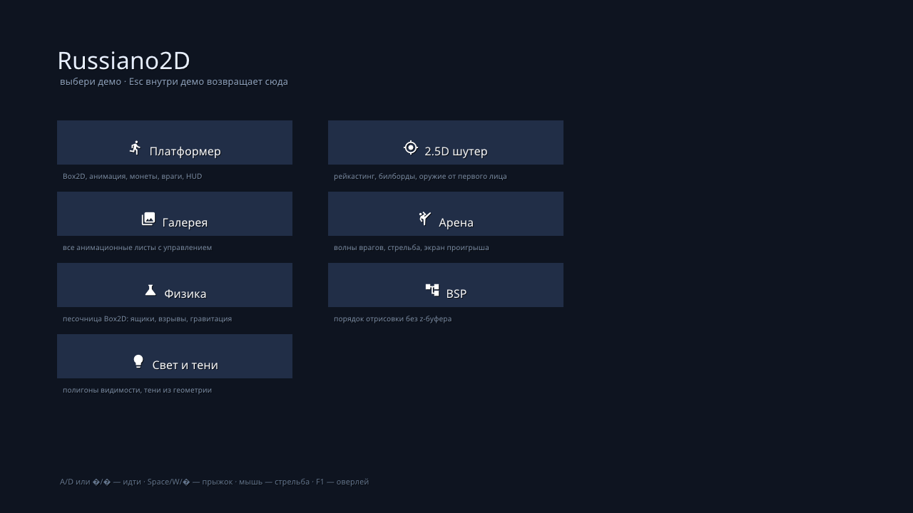

# Russiano2D — демо-проект

`demos/` — отдельная игра на движке: семь сцен-демо, каждая показывает свою
часть движка. Запускается тем же бинарником, что и `game/`, и выбирается
флагом `--game`.



## Запуск

```bash
./build/russiano2d --game demos                      # меню выбора
./build/russiano2d --game demos --scene platformer   # сразу конкретная сцена
./build/russiano2d --game demos --scene shooter25d \
    --screenshot /tmp/s.png --screenshot-at 3 --seconds 5
```

Точка входа — `<каталог>/main.js`, то есть [`demos/main.js`](../demos/main.js).
`--scene <имя>` движок кладёт в `engine.startScene`, и точка входа открывает
эту сцену минуя меню:

```js
// demos/main.js
const start = engine.startScene || 'launcher';
$.scene.load($.scene.has(start) ? start : 'launcher', { transition: 'none' });
```

## Как устроено демо

Каждое демо — модуль с одним экспортом: функцией `install($)`, которая
регистрирует свою сцену. Общего кода нет: всё, что раньше лежало в
`demos/lib/` (кэш ассетов, пакет отрисовки, менеджер сцен, звук, привязки
клавиш), теперь умеет само высокоуровневое API `$`.

```js
// demos/platformer/index.js
export default function install($) {
    $.scene.add('platformer', {
        enter($) { /* построить уровень */ },
        exit() { /* убрать за собой */ },
        update(dt, $) { /* логика кадра */ },
        render($) { /* необязательно: своя отрисовка */ },
    });
}
```

Три демо (`bsp`, `light`, `shooter25d`) сознательно остаются «низкоуровневыми»:
их суть — рейкастинг, BSP-дерево и полигоны видимости, то есть прямые вызовы
`engine.bsp.*`, `engine.light.visibility()` и `engine.submitTriangles()`.
Обвязка (сцена, HUD, ввод, камера) в них всё равно написана на `$`, а математика
вызывается из неё.

Добавить своё демо: положить `demos/имя/index.js` с `install($)` и дописать
строку в список `MODULES` в `demos/main.js` — кнопка в меню появится сама
(подпись и иконка берутся из таблицы `TITLES` в `demos/launcher.js`).

## Сцены

| Сцена | Что показывает | Ключевые вызовы |
|---|---|---|
| `platformer` | Box2D, листы анимации, монеты, враги, параллакс, HUD, пауза | `.controls`, `.frames`, `.animate`, `.on('death')`, `<ui.*>` |
| `shooter25d` | настоящий рейкастинг (DDA-обход сетки), билборды врагов, оружие от первого лица | `engine.raycast`, `$.gfx`, `$.camera` |
| `gallery` | все анимационные листы персонажей с управлением воспроизведением | `.frames`, `.animate`, `.playing`, `$.input` |
| `arena` | волны врагов, стрельба, здоровье, экран проигрыша | `$.world.raycast`, `$('<bullet>')`, `$.scene.restart` |
| `physics` | песочница Box2D: ящики, взрывы, гравитация, контуры тел | `.body('dynamic')`, `.applyImpulse`, `$.world.query` |
| `bsp` | порядок отрисовки без z-буфера на наклонных стенах, пошаговый обход дерева | `engine.bsp.build/order` |
| `light` | 2D-свет через полигоны видимости: источники, тени, градиент по цвету вершин | `engine.light.visibility`, `engine.submitTriangles` |
| `shooter_witch` | **ночной лес**: зомби-шутер в духе Vampire Survivors — авто-стрельба по ближайшему, волны, опыт, карты апгрейдов, фонари как единственный свет, тени от стволов, кровь и лужи | `<tilemap>` + `.autotile()` (террейн тропы), `engine.light.visibility`, `$.audio.zone/obstacles/damping`, `$.fx.*`, `$.gfx.postPreset` |

## Управление

| Клавиша | Действие |
|---|---|
| `A` / `D` или `←` / `→` | идти |
| `Space` / `W` / `↑` | прыжок |
| мышь | прицел, стрельба, перетаскивание объектов |
| `Esc` | выход из демо в меню, из меню — выход |
| `F1` | показать/скрыть отладочный оверлей движка |
| `F5` | перезапустить скрипты вручную |

## Ассеты

Графика, звук и шрифты лежат в `demos/assets/`; полный список с лицензиями —
[`demos/assets/CREDITS.md`](../demos/assets/CREDITS.md). Маскот движка
(`art/mascot/russiano_mascot_sheet_a.png`, 8×4 кадра по 176×176) используется
как игрок в демо-платформере.

## Проверка без рук

Все демо можно открыть агентом — это то же, что делает
`tests/agent/demos_test.py`:

```bash
python3 tests/agent/demos_test.py              # все сцены
python3 tests/agent/demos_test.py light        # только выбранные
```

Тест открывает каждую сцену, шагает кадры, проверяет журнал на ошибки
и сохраняет скриншот в `build/test_demo_<имя>.png`.
